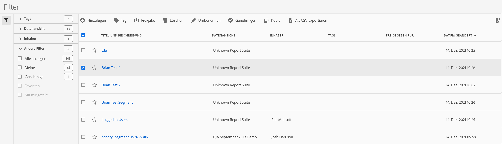

# Filter Manager

Der Filter-Manager bietet viele Möglichkeiten zum Kuratieren von Filtern, wie das Freigeben, Taggen, Genehmigen, Kopieren, Löschen und Kennzeichnen als Favoriten.

Der Filter-Manager zeigt Ihnen alle Filter an, deren Inhaber Sie sind und die für Sie freigegeben wurden. Benutzer auf Administratorebene können alle Filter der Organisation anzeigen. In dieser Übersicht werden die Benutzeroberfläche und die Funktionen des Filters-Managers vorgestellt.

## Zugriff auf den Filter-Manager

1. Wählen Sie unter Customer Journey Analytics die Registerkarte **[!UICONTROL Komponenten]** und dann **[!UICONTROL Filter]** aus.

## Verfügbare Aktionen im Filter-Manager

Im Filter-Manager haben Sie folgende Möglichkeiten:

* [Filtern der Filterliste](/help/components/filters/filters-filter.md)

* [Filter als Favoriten markieren](/help/components/filters/filters-favorite.md)

* [Genehmigen von Filtern](/help/components/filters/filters-approve.md)

* [Taggen von Filtern](/help/components/filters/filters-tag.md)

* [Freigeben von Filtern](/help/components/filters/filters-share.md)

* Exportieren Sie einen Filter in eine CSV-Datei.

* [Kopieren von Filtern](/help/components/filters/filters-copy.md)

* Filter löschen

## Spalten konfigurieren

Sie können die für jeden Filter angezeigten Informationen im Filter-Manager konfigurieren, indem Sie die angezeigten Spalten konfigurieren.

So konfigurieren Sie die sichtbaren Spalten im Filter-Manager:

1. Wählen Sie unter Customer Journey Analytics die Registerkarte **[!UICONTROL Komponenten]** und dann **[!UICONTROL Filter]** aus.

1. Wählen Sie im Filter-Manager das Symbol **Spalten anpassen**  und wählen Sie dann die Spalten aus, die im Filter-Manager angezeigt werden sollen.

   Die folgenden Spalten sind verfügbar:

   | Spaltentitel | Beschreibung |
   |---|---|
   | Titel und Beschreibung | Diese Werte werden im Filter-Builder bereitgestellt. Um den Titel und die Beschreibung zu bearbeiten, wählen Sie den Titel-Link aus, um den Filter-Builder zu öffnen. |
   | Favoriten | Zeigt neben jedem Filter Sternensymbole an, mit denen Sie Filter als Favoriten markieren können. Weitere Informationen finden Sie unter [Filter als Favoriten markieren](/help/components/filters/filters-favorite.md). |
   | Datenansicht | Diese Spalte gibt an, in welcher Datenansicht der Filter zuletzt gespeichert wurde. |
   | Verantwortlicher | Zeigt an, wer Inhaber des Filters ist. Wenn Sie kein Administrator sind, können Sie nur Filter sehen, deren Inhaber Sie sind, sowie Filter, die für Sie freigegeben wurden. |
   | Tags (in der Spaltenauswahl nicht aktiviert, weshalb die Spalte nicht angezeigt wird) | Tags, die entweder durch Sie oder durch Personen, die einen Filter für Sie freigegeben haben, auf den Filter angewendet wurden. |
   | Freigegeben für | Zeigt Personen oder Gruppen (nur Administrator) oder „Alle“ (nur Administrator) an, für die Sie den Filter freigegeben haben. 
Wenn ein Filter von Ihnen oder für Sie freigegeben wird, wird neben dem Filternamen ein Freigabesymbol angezeigt.
 |
   | Änderungsdatum | Zeigt das Datum der letzten Änderung des Filters an. |
   | Verwendet in | Zeigt an, wo Filter derzeit verwendet werden und wie oft sie in den einzelnen Bereichen verwendet werden. 
Wenn der Filter beispielsweise in 40 Projekten und 2 Warnhinweisen verwendet wird, wird der Wert dieser Spalte als [!UICONTROL **42 Komponenten**] angezeigt.
 
Wählen Sie den Wert in dieser Spalte aus, um die Aufschlüsselung der verwendeten Filter anzuzeigen (z. B. [!UICONTROL **Projekte (40)**], [!UICONTROL **mobile Scorecards (2)**]). Darüber hinaus können Sie die Liste der Elemente anzeigen, in denen die Filter verwendet werden. Sehen Sie sich beispielsweise die Liste der Projekte an, in denen sie verwendet werden, und klicken Sie auf den Link [!UICONTROL **Projekte (40)**] .

Jeder der folgenden Bereiche zeigt die Anzahl der in diesem Bereich verwendeten Filter:
  <ul><li>[!UICONTROL **Projekte**]
Enthält Filter, die im Filtergenerator ](/help/components/filters/filter-builder.md#) erstellt wurden und für alle Projekte verfügbar sind.[
</li><li>[!UICONTROL **Ad-hoc-Komponenten**]
Enthält Filter, die [als Schnellfilter erstellt wurden](/help/components/filters/quick-filters.md) und nur in einem Projekt verfügbar sind.
</li><li>[!UICONTROL **Geplante Projekte**]</li><li>[!UICONTROL **Mobile Scorecards**]</li><li>[!UICONTROL **Anmerkungen**]</li><li>[!UICONTROL **Berechnete Metriken**]</li><li>[!UICONTROL **Report Builder**]
Bei Auswahl dieser Option wird eine CSV-Datei mit den folgenden Datenspalten heruntergeladen:
<ul><li>Name des Report Builders</li><li>Zuletzt aufgerufen</li><li>Letzter Zugriff auf IMS-Benutzer-ID</li><li>Letzter Benutzername</li></ul></li>
Bei der Anzeige von Informationen für den Report Builder sind Nutzungsinformationen ab September 2024 verfügbar.
</ul>
Diese Informationen können Ihnen dabei helfen festzustellen, ob eine Komponente für Benutzer in Ihrer Organisation nützlich ist, wo sie verwendet wird und ob sie gelöscht oder geändert werden muss.

Beachten Sie Folgendes beim Anzeigen dieser Option:
<ul><li>Diese Informationen sind nur für Systemadministratoren verfügbar.</li><li>Die Spalte [!UICONTROL **Verwendet in**] wird nicht standardmäßig angezeigt. [Konfigurieren Sie Spalten](#configure-columns), um sie anzuzeigen.</li><li>Wenn ein Filter einen anderen Filter in seiner Definition enthält, wird die Verwendung dieses Filters nicht in der Spalte [!UICONTROL **Verwendet in**] angezeigt. Wenn ein Filter in der Definition eines anderen Komponententyps enthalten ist (z. B. eine berechnete Metrik), wird die Verwendung in der Spalte [!UICONTROL **Verwendet in**] angezeigt.</li><li>Diese Informationen enthalten keine Verwendung über die API oder Data Warehouse.</li><li>Wenn in dieser Spalte keine Daten für eine bestimmte Komponente vorhanden sind, sie jedoch das Datum [!UICONTROL **Zuletzt verwendet**] hat, wurde die Komponente möglicherweise in einer Analyse verwendet, ohne gespeichert zu werden.</li><li>Nutzungsinformationen sind ab September 2023 verfügbar.</li></ul>
Sie können das [Datenwörterbuch](/help/components/data-dictionary/data-dictionary-overview.md) zusammen mit diesen Informationen verwenden, um die Verwendung von Komponenten in Ihrer Organisation zu verfolgen und besser zu verstehen.
 |
   | Zuletzt verwendet | Zeigt das Datum der letzten Verwendung des Filters in einem der folgenden Komponententypen an: <ul><li>Berechnete Metriken </li><li>Projekte</li><li>Geplante Projekte</li><li>Filter</li></ul> 
Anhand dieser Informationen können Sie feststellen, ob eine Komponente für Benutzer in Ihrer Organisation nützlich ist oder ob sie gelöscht werden soll.

Beachten Sie Folgendes beim Anzeigen dieser Option:
<ul><li>Diese Informationen enthalten keine Verwendung von API, Report Builder oder Data Warehouse.</li><li>Bei einigen Komponenten enthält diese Spalte möglicherweise keine Daten, wenn die Komponente zuletzt vor September 2023 verwendet wurde.</li><li>Diese Informationen sind nur für Systemadministratoren verfügbar.</li></ul>
Sie können das [Datenwörterbuch](/help/components/data-dictionary/data-dictionary-overview.md) zusammen mit diesen Informationen verwenden, um die Verwendung von Komponenten in Ihrer Organisation zu verfolgen und besser zu verstehen. |

   {style="table-layout:auto"}
