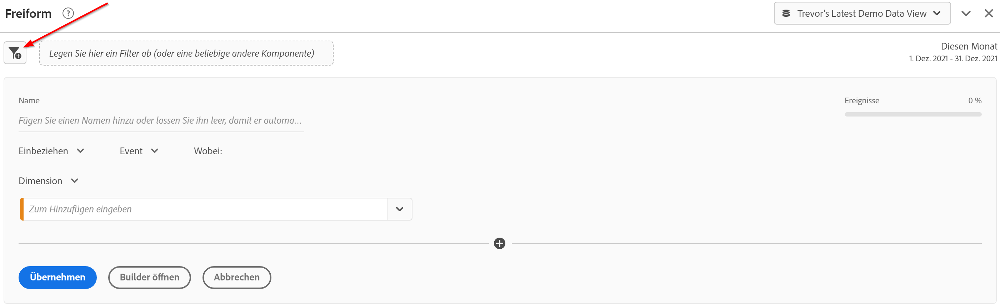
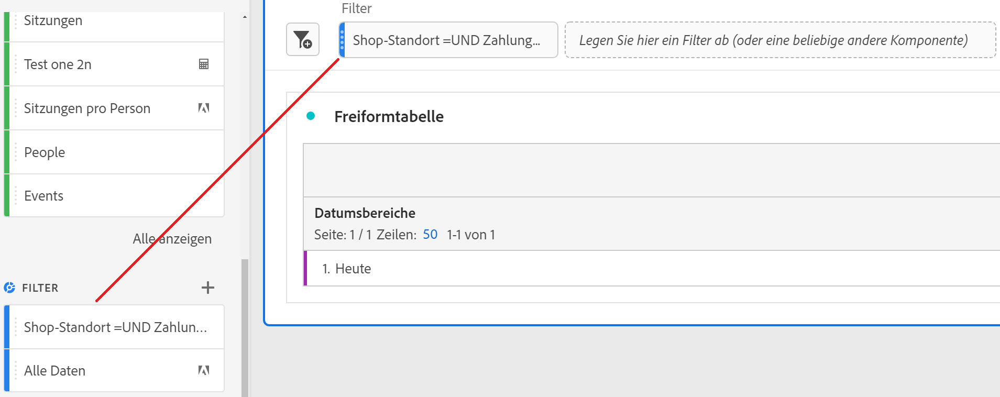
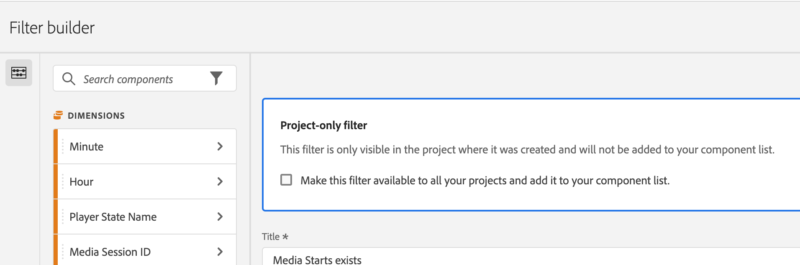
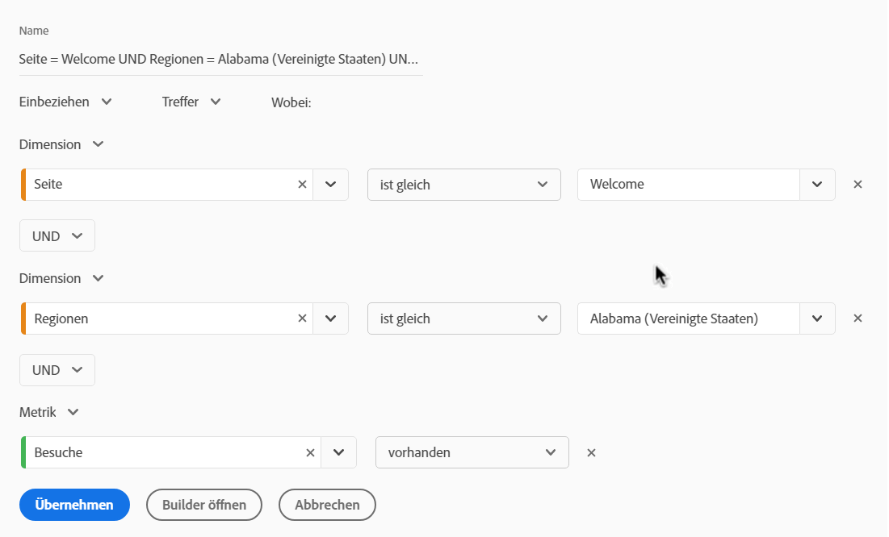

# Schnellfilter

Mit Schnellfiltern können Sie Daten innerhalb eines Projekts einfach untersuchen, ohne einen komplexeren Komponentenlistenfilter im [Filtergenerator](/help/components/filters/create-filters.md) erstellen zu müssen.

Beachten Sie beim Erstellen von Schnellfiltern Folgendes:

* Schnellfilter gelten nur für das Projekt, in dem sie erstellt wurden. Sie sind nicht in anderen Projekten verfügbar und können nicht für andere Benutzende freigegeben werden. 
* Es sind maximal 3 Regeln zulässig.
* Verschachtelte Container oder sequenzielle Regeln werden nicht unterstützt.
* Wenn Sie ein Projekt für andere Benutzer freigeben, können diese Benutzer Schnellfilter und andere reine Projektkomponenten bearbeiten, die in das freigegebene Projekt eingebettet sind.

Im folgenden Video wird die Verwendung von Schnellfiltern veranschaulicht. (Hinweis: In diesem Video wird der Begriff &quot;Schnellsegmente&quot;anstelle von &quot;Schnellfilter&quot;verwendet. Die Funktionalität ist jedoch identisch.)

>[!VIDEO](https://video.tv.adobe.com/v/341466/?quality=12&learn=on)

## Erstellen eines Schnellfilters {#create}

Jeder Benutzer in Analysis Workspace kann einen Schnellfilter erstellen.

So erstellen Sie einen Schnellfilter:

1. Wählen Sie eine der folgenden Methoden, um mit der Erstellung des Schnellfilters zu beginnen:

   * **Ad Hoc (Drag &amp; Drop):** Ziehen Sie eine Komponente aus der linken Leiste in die Dropzone des Filters in der Bedienfeldüberschrift.

     

     Sie können den Schnellfilter bearbeiten, wie unter [Schnellfilter bearbeiten](#edit-a-quick-filter) beschrieben.

     >[!NOTE]
     >
     > Beachten Sie Folgendes beim Erstellen eines Schnellfilters Ad-hoc (Drag-and-Drop):
     > * Die folgenden Komponententypen werden nicht unterstützt: berechnete Metriken und Dimensionen sowie Metriken, aus denen Sie keine Filter erstellen können.
     > * Für vollständige Dimensionen und Ereignisse erstellt Analysis Workspace Ereignisfilter &quot;vorhanden&quot;. Beispiele: `Hit where eVar1 exists` oder `Hit where event1 exists`.
     > * Wenn „nicht angegeben“ oder „keine“ im Filterablagebereich abgelegt werden, werden sie automatisch in einen Filter mit „nicht vorhanden“ umgewandelt, damit sie beim Filtern korrekt behandelt werden.

   * **Verwenden des Filtersymbols:** Wählen Sie in einer Freiformtabelle das Symbol **Filter** in der Bedienfeldüberschrift.

     

1. Passen Sie die folgenden Einstellungen an:

   | Einstellung | Beschreibung |
   | --- | --- |
   | [!UICONTROL Name] | Der Standardname eines Filters ist eine Kombination der Regelnamen im Filter. Sie können für den Filter einen benutzerfreundlicheren Namen wählen. |
   | [!UICONTROL Ein-/Ausschließen] | Sie können Komponenten in Ihrer Filterdefinition entweder ein- oder ausschließen, aber nicht beides. |
   | [!UICONTROL Treffer-/Besuchs-/Besucher-Container] | Schnellfilter enthalten nur einen [Filter-Container](https://experienceleague.adobe.com/docs/analytics-platform/using/cja-components/cja-filters/filters-overview.html?lang=de#filter-containers), mit dem Sie eine Dimension/Metrik/einen Datumsbereich in den Filter einbeziehen (oder daraus ausschließen) können. [!UICONTROL Besucher] enthält übergreifende Daten, die für die Person über Besuche und Seitenansichten hinweg spezifisch sind. Mit einem [!UICONTROL Besuchsbehälter] können Sie Regeln festlegen, mit denen die Daten der Person auf der Grundlage von Besuchen aufgeschlüsselt werden, und einen [!UICONTROL Trefferbehälter] , mit dem die Personeninformationen auf der Grundlage einzelner Seitenansichten aufgeschlüsselt werden. Der Standard-Container ist [!UICONTROL Treffer]. |
   | [!UICONTROL Komponenten] (Dimension/Metrik/Datumsbereich) | Definieren Sie bis zu 3 Regeln, indem Sie Komponenten (Dimensionen, Metriken, Datumsbereiche oder Dimensionswerte) hinzufügen. Es gibt 3 Möglichkeiten, die richtige Komponente zu finden:<ul><li>Beginnen Sie mit der Eingabe und der Schnellfilter-Builder findet automatisch die entsprechende Komponente.</li><li>Verwenden Sie die Dropdown-Liste, um die Komponente zu finden.</li><li>Per Drag-and-Drop aus der der linken Leiste ziehen.</li></ul> |
   | [!UICONTROL Operator] | Verwenden Sie das Dropdown-Menü, um Standardoperatoren und Operatoren des Typs [!UICONTROL Distinct Count] zu finden. Siehe [Filteroperatoren](operators.md). |
   | Plus (+)-Zeichen | Eine weitere Regel hinzufügen |
   | AND/OR-Kriterien | Sie können den Regeln „AND“- oder „OR“-Kriterien hinzufügen, aber „AND“- und „OR“-Werte können nicht in einer Filterdefinition gemischt werden. |
   | [!UICONTROL Übernehmen] | Diesen Filter auf das Bedienfeld an. Wenn der Filter keine Daten enthält, werden Sie gefragt, ob Sie fortfahren möchten. |
   | [!UICONTROL Builder öffnen] | Zeigt den Filtergenerator an. Nachdem Sie den Filter im Filtergenerator gespeichert oder angewendet haben, wird er nicht mehr als &quot;Schnellfilter&quot;betrachtet. Er wird Teil der Komponentenlisten-Filterbibliothek. 
Um die Komponente für alle Projekte und in der linken Leiste verfügbar zu machen, wählen Sie die Option [!UICONTROL **Diesen Filter für alle Projekte verfügbar machen und ihn zur Komponentenliste hinzufügen**] aus.

Weitere Informationen finden Sie im Abschnitt [Schnellfilter als Komponentenlistenfilter speichern](#save-a-quick-filter-as-a-component-list-filter) in diesem Artikel.

**Hinweis:** Nur Benutzer mit der Berechtigung zum Erstellen von Segmenten in der [Adobe Admin Console](https://experienceleague.adobe.com/docs/analytics/admin/admin-console/permissions/analytics-tools.html?lang=de) können den Filtergenerator öffnen.
 |
   | [!UICONTROL Abbrechen] | Abbrechen dieses Schnellfilters (nicht anwenden). |
   | [!UICONTROL Datumsbereich] | Der Validator verwendet den Datumsbereich des Bedienfelds für die Datensuche. Jeder Datumsbereich, der in einem Schnellfilter angewendet wird, überschreibt jedoch den Datumsbereich des Bedienfelds oben im Bedienfeld. |
   | Vorschau (oben rechts) | Hiermit können Sie sehen, ob Sie über einen gültigen Filter verfügen und wie breit der Filter ist. Stellt die Aufschlüsselung des Datensatzes dar, den Sie bei Anwendung dieses Filters erwarten können. Sie erhalten möglicherweise einen Hinweis, der anzeigt, dass dieser Filter keine Daten enthält. In diesem Fall können Sie weiterarbeiten oder aber die Filterdefinition ändern. |

1. Wählen Sie [!UICONTROL **Übernehmen**] aus, um Ihre Änderungen zu speichern.

## Schnellfilter bearbeiten {#edit}

1. Bewegen Sie den Mauszeiger über den Schnellfilter, den Sie bearbeiten möchten, und wählen Sie dann das Symbol **Bearbeiten** aus.

   

1. Bearbeiten Sie die Filterdefinition oder den Filternamen.
1. Wählen Sie [!UICONTROL **Übernehmen**] aus, um Ihre Änderungen zu speichern.

## Schnellfilter als Komponentenlistenfilter speichern {#save}

>[!IMPORTANT]
>
> Beachten Sie beim Speichern eines Schnellfilters Folgendes:
> 
> * Zum Speichern eines Schnellfilters benötigen Sie die Berechtigung Segmenterstellung in der [Adobe Admin Console](https://experienceleague.adobe.com/docs/analytics/admin/admin-console/permissions/analytics-tools.html?lang=de).
> 
> * Nachdem Sie den Filter gespeichert oder angewendet haben, kann er nicht mehr im Schnellfilter-Builder bearbeitet werden. Stattdessen müssen Sie den regulären Filter Builder verwenden.

Sie können Schnellfilter als Komponentenlistenfilter speichern. Vorteile von Komponentenlistenfiltern:

* Verfügbarkeit über alle Arbeitsbereich-Projekte hinweg
* Unterstützung komplexerer Filter sowie sequenzieller Filter

Sie können Filter entweder aus dem Schnellfilter-Builder oder aus dem [!UICONTROL Filtergenerator] speichern.

### Speichern im Schnellfilter-Builder {#save2}

1. Wenn Sie den Schnellfilter angewendet haben, halten Sie den Mauszeiger darüber und wählen Sie das Infosymbol (&quot;i&quot;) aus.
1. Wählen Sie **[!UICONTROL Für alle Projekte verfügbar machen und Ihrer Komponentenliste hinzufügen]** aus.
1. (Optional) Benennen Sie den Filter um.
1. Wählen Sie **[!UICONTROL Speichern]** aus.

   Der Filter wird jetzt in der Komponentenliste in der linken Leiste angezeigt. Beachten Sie außerdem, dass sich die Seitenleiste des Filters von hellblau in dunkelblau ändert und damit anzeigt, dass sie im Schnellfilter-Builder nicht mehr bearbeitet oder geöffnet werden kann.

### Speichern im Filtergenerator {#save3}

1. Wenn Sie den Schnellfilter angewendet haben, halten Sie den Mauszeiger darüber und wählen Sie das Infosymbol (&quot;i&quot;) aus.
1. Wählen Sie **[!UICONTROL Filter speichern]**
1. (Optional) Benennen Sie den Filter um und wählen Sie dann [!UICONTROL **Anwenden**] aus.

   Gehen Sie zurück zu Workspace und beachten Sie, dass sich die Seitenleiste des Filters von hellblau in dunkelblau ändert, was bedeutet, dass sie im Schnellfilter-Builder nicht mehr bearbeitet oder geöffnet werden kann. Und durch Speichern wird es Teil der Komponentenliste.

   

Nachdem Sie den Filter angewendet haben, können Sie ihn Ihrer Liste der Filterkomponenten hinzufügen und für alle Ihre Projekte verfügbar machen.

1. Bewegen Sie den Mauszeiger über den gespeicherten Filter und wählen Sie das Stiftsymbol aus.

1. Wählen Sie [!UICONTROL **Builder öffnen**] aus.

1. Beachten Sie dieses Dialogfeld oben im Filtergenerator:

   

1. Aktivieren Sie das Kontrollkästchen neben **[!UICONTROL Stellen Sie diesen Filter für alle Projekte zur Verfügung und fügen Sie ihn Ihrer Komponentenliste hinzu.]**

1. Wählen Sie **[!UICONTROL Speichern]** aus.

   Der Filter wird jetzt in der Liste der Filterkomponenten für alle Ihre Projekte angezeigt.
Sie können auch den Filter auch für andere Personen in Ihrer Organisation [freigeben](/help/components/filters/filters-share.md).

## Schnellfilterbeispiel

Im folgenden Beispiel eines Filters werden Dimensionen und Metriken kombiniert:

