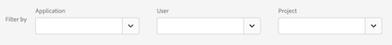

# Sequenzielle Filter erstellen

Sequenzielle Filter werden mit dem THEN -Operator anstelle von AND oder OR erstellt. DANN bedeutet, dass eines der Filterkriterien auftritt, gefolgt von einem anderen. Standardmäßig identifiziert ein sequenzieller Filter alle übereinstimmenden Daten mit dem Filter &quot;Alle einschließen&quot;. Sequenzielle Filter können mithilfe der Optionen &quot;Nur vor Sequenz&quot;und &quot;Nur nach Sequenz&quot;weiter in eine Teilmenge übereinstimmender Treffer gefiltert werden.

Im Folgenden finden Sie ein Video zur sequenziellen Segmentierung:

>[!VIDEO](https://video.tv.adobe.com/v/25405/?quality=12)

## Alle einschließen {#include_everyone}

Beim Erstellen eines Filters, bei dem &quot;Alle einschließen&quot;festgelegt ist, identifiziert der Filter Pfade, die mit dem angegebenen Muster als Ganzes übereinstimmen. Dies ist ein Beispiel für einen einfachen Sequenzfilter, der nach einem Treffer (Seite A) gefolgt von einem anderen (Seite B) sucht, der vom selben Besucher besucht wurde. Der Filter ist auf &quot;Alle einschließen&quot;eingestellt.

| Wenn Ergebnis... | Sequenz |
|--- | --- |
| Stimmt überein | A, dann B A, dann (bei einem anderen Besuch) BA, dann D, dann B |
| Stimmt nicht überein mit | B, dann A |

## „Nur vor Sequenz“ und „Nur nach Sequenz“ {#only_before_after}

Die Optionen **[!UICONTROL Nur vor Sequenz]** und **[!UICONTROL Nur nach Sequenz]** Filtern Sie den Filter nach einer Teilmenge von Daten vor oder nach der angegebenen Sequenz.

* **Nur vor Sequenz**: Umfasst alle Treffer vor einer Sequenz sowie den ersten Treffer der Sequenz selbst (siehe Beispiel 1 und 3). Wenn eine Sequenz innerhalb eines Pfads mehrmals vorkommt, umfasst „Nur vor Sequenz“ den ersten Treffer des letzten Vorkommens der Sequenz sowie alle vorangegangenen Treffer (siehe Beispiel 2).
* **Nur nach Sequenz**: Umfasst alle Treffer nach einer Sequenz sowie den letzten Treffer der Sequenz selbst (siehe Beispiel 1 und 3). Wenn eine Sequenz innerhalb eines Pfads mehrmals vorkommt, umfasst „Nur nach Sequenz“ den letzten Treffer des ersten Vorkommens der Sequenz sowie alle darauffolgenden Treffer (siehe Beispiel 2).

Betrachten wir beispielsweise eine Sequenz von B gefolgt von D. Die drei Filter würden die Treffer folgendermaßen identifizieren:

**Beispiel 1: B gefolgt von D kommt einmal vor**

| Beispiel | A | B | C | D | E | F |
|---|---|---|---|---|---|---|
| Alle einschließen | A | B | C | D | E | F |
| Nur vor Sequenz | A | B |  |  |  |  |
| Nur nach Sequenz |  |  |  | D | E | F |

**Beispiel 2: B gefolgt von D kommt mehrmals vor**

| Beispiel | A | B | C | D | B | C | D | E |
|---|---|---|---|---|---|---|---|---|
| Alle einschließen | A | B | C | D | B | C | D | E |
| Nur vor Sequenz | A | B | C | D | B |  |  |  |
| Nur nach Sequenz |  |  |  | D | B | C | D | E |

Nehmen wir zu diesem Konzept außerdem die Dimension der Treffertiefe hinzu.

**Beispiel 3: Treffertiefe 3 gefolgt von 5**

## Dimensionsbegrenzungen {#constraints}

In einem „Innerhalb“-Satz können Sie zwischen THEN-Anweisungen beispielsweise „innerhalb 1 Suchbegriffsinstanz“, „innerhalb 1 eVar 47-Instanz“ hinzufügen. Dadurch wird der Filter auf eine Instanz einer Dimension beschränkt.

Durch die Festlegung einer &quot;In-Dimension&quot;-Klausel zwischen Regeln kann ein Filter Daten auf Sequenzen beschränken, in denen diese Klausel erfüllt ist. Siehe untenstehendes Beispiel, in dem die Begrenzung auf „Within 1 Seite“ festgelegt ist:

| Wenn Ergebnis... | Sequenz |
|--- |--- |
| Stimmt überein | A, dann B |
| Stimmt nicht überein mit | A, dann C, dann B (da B nicht innerhalb einer Seite von A war) **Hinweis:** Wenn die Dimensionsbeschränkung entfernt wird, stimmen „A, dann B“und „A, dann C, dann B“ überein. |

## Einfache Seitenansichtssequenz {#simple_sequence}

Identifizieren Sie Benutzer, die eine Seite und anschließend eine andere Seite angezeigt haben. Die Daten auf Trefferebene filtern diese Sequenz ungeachtet vorheriger, letzter oder zwischenzeitlicher Besuchssitzungen oder der Zeit oder der Anzahl der Seitenansichten, die zwischenzeitlich vergangen ist bzw. erfolgt sind.

**Beispiel**: Besucher hat Seite A angesehen, dann Seite B bei demselben oder einem anderen Besuch.

**Anwendungsbeispiele**

Im Folgenden finden Sie Beispiele für die Verwendung des Filters.

1. Besucher einer Sport-Site sehen sich die Football-Landingpage und dann die Basketball-Landingpage in sequenzieller Reihenfolge an, aber nicht unbedingt während desselben Besuchs. Dies löst eine Kampagne aus, die während der Football-Saison Basketball-Inhalte an Football-Besucher liefert.
1. Der Händler ermittelt die Beziehung zwischen denen, die auf der Kundentreueseite landen und dann zu irgendeinem Zeitpunkt während des Besuchs oder bei einem anderen Besuch zur Videoseite wechseln.

**Filter erstellen**

Sie verschachteln zwei Seitenregeln in einem [!UICONTROL Besucherbehälter] der obersten Ebene und sequenzieren die Seitentreffer mit dem [!UICONTROL THEN]-Operator.

## Besuchsübergreifende Besuchersequenz {#sequence_across}

Identifizieren Sie die Besucher, die aus einer Kampagne herausgefallen, aber im Rahmen einer anderen Sitzung zur Sequenz der Seitenansichten zurückgekehrt sind.

**Beispiel**: Besucher hat Seite A in einem Besuch aufgerufen und dann Seite B in einem anderen Besuch besucht.

**Nutzungsszenarios**

Im Folgenden finden Sie Beispiele für die Verwendung dieses Filtertyps:

* Besucher der Sportseite eine Nachrichten-Site, die anschließend in einer anderen Sitzung die Sportseite erneut besuchen.
* Ein Bekleidungshändler sieht eine Beziehung zwischen Besuchern, die in einer Sitzung auf einer Landingpage ankommen und dann in einer anderen Sitzung direkt zur Kassenseite gehen.

**Filter erstellen**

Dieses Beispiel verschachtelt zwei **[!UICONTROL Besuch]** Container innerhalb der obersten Ebene **[!UICONTROL Besucher]** Container und Sequenzen des Filters mit dem [!UICONTROL THEN] Operator.

## Sequenz mit gemischten Ebenen {#mixed_level}

Erkennen von Besuchern, die bei einer nicht festgelegten Anzahl von Besuchen zwei Seiten ansehen, dann aber bei einem separaten Besuch eine dritte Seite ansehen.

**Beispiel**: Besucher besuchen Seite A und dann Seite B bei einem oder mehreren Besuchen, gefolgt von einem Besuch der Seite C bei einem separaten Besuch.

**Nutzungsszenarios**

Im Folgenden finden Sie Beispiele für die Verwendung dieses Filtertyps:

* Besucher besuchen zuerst eine Nachrichten-Site und sehen sich dann bei demselben Besuch die Sportseite an. Bei einem anderen Besuch sieht sich der Besucher die Wetterseite an.
* Ein Händler definiert Besucher, die die Hauptseite besuchen und dann zur Seite „Mein Konto“ wechseln. Bei einem anderen Besuch besuchen sie die Seite „Einkaufswagen anzeigen“.

**Filter erstellen**

1. Legen Sie zwei Seitendimensionen aus den linken Fenstern in einem [!UICONTROL Besucherbehälter] der obersten Ebene ab.
1. Fügen Sie zwischen den beiden den THEN-Operator ein.
1. Klicken Sie auf **[!UICONTROL Optionen]** > **[!UICONTROL Behälter hinzufügen]** und fügen Sie einen [!UICONTROL Besuchebehälter] unter der [!UICONTROL Besucherebene] ein und bilden Sie mit dem [!UICONTROL THEN]-Operator eine Sequenz.

## Aggregieren von Containern {#aggregate_containers}

Durch das Hinzufügen mehrerer [!UICONTROL Trefferbehälter] innerhalb eines [!UICONTROL Besucherbehälters] können Sie die entsprechenden Operatoren zwischen identischen Behältertypen anwenden und Regeln und Dimensionen wie Seiten- und Besuchsnummer verwenden, um die Seitenansicht zu definieren und eine Sequenzdefinition innerhalb des [!UICONTROL Trefferbehälters] bereitzustellen. Durch Anwendung der Logik auf Trefferebene können Sie Übereinstimmungen auf derselben Ebene von Treffern innerhalb der [!UICONTROL Besucher] Container , um eine Vielzahl von Filtertypen zu erstellen.

**Beispiel**: Die Besucher haben Seite A nach dem ersten Treffer in der Sequenz von Seitenansichten (in diesem Beispiel Seite D) besucht. Anschließend haben sie ungeachtet der Anzahl der Besuche entweder Seite B oder Seite C besucht.

**Nutzungsszenarios**

Im Folgenden finden Sie Beispiele für die Verwendung dieses Filtertyps:

* Erkennen von Besuchern, die während eines Besuchs zur Haupt-Landingpage gelangen, dann bei einem anderen Besuch die Herrenbekleidungsseite ansehen und sich dann bei einem anderen Besuch entweder die Landingpage für Damen- oder Kinderbekleidung ansehen.
* Ein e-Zine erfasst Besucher, die bei einem Besuch die Homepage besuchen, bei einem anderen Besuch die Sportseite und bei einem anderen Besuch die Kommentarseite.

**Filter erstellen**

1. Wählen Sie den [!UICONTROL Besucherbehälter] als Behälter der obersten Ebene aus.
1. Fügen Sie zwei weitere Behälter der [!UICONTROL Trefferebene] hinzu – eine Dimension mit einer geeigneten numerischen Dimension wurde auf derselben [!UICONTROL Trefferebene] durch die [!UICONTROL AND]- und [!UICONTROL OR]-Operatoren verknüpft.
1. Fügen Sie im [!UICONTROL Besuchsbehälter] einen weiteren [!UICONTROL Trefferbehälter] hinzu und verschachteln Sie zwei weitere [!UICONTROL Trefferbehälter], die mit einem [!UICONTROL OR]- oder [!UICONTROL AND]-Operator verknüpft wurden.

   Sequenzieren Sie die verschachtelten [!UICONTROL Trefferbehälter] mit dem [!UICONTROL THEN]-Operator.

## &quot;Verschachtelung&quot;in sequenziellen Filtern {#nesting}

Durch Platzierung von Checkpoints an beiden [!UICONTROL Besuch] und [!UICONTROL Treffer] -Ebene können Sie den Filter so einschränken, dass Anforderungen innerhalb eines bestimmten Besuchs sowie an einen bestimmten Treffer erfüllt werden.

**Beispiel**: Besucher hat Seite A und dann Seite B im selben Besuch besucht. Bei einem neuen Besuch ist der Besucher dann zur Seite C gewechselt.

**Filter erstellen**

1. Legen Sie unter einem [!UICONTROL Besuchebehälter] der obersten Ebene zwei Seitendimensionen ab.
1. Wählen Sie beide Regeln aus, klicken Sie auf **[!UICONTROL Optionen]** > **[!UICONTROL Behälter aus Auswahl hinzufügen]** und ändern Sie ihn in einen [!UICONTROL Besuchebehälter].
1. Verbinden Sie beide mit einem [!UICONTROL THEN]-Operator.
1. Erstellen Sie einen Trefferbehälter, der gleichrangig zum [!UICONTROL Besuchebehälter] ist, und legen Sie darin eine Seitendimension ab.
1. Verknüpfen Sie die verschachtelte Sequenz im [!UICONTROL Besuchsbehälter] mit dem [!UICONTROL Trefferbehälter]. Verwenden Sie dazu einen weiteren [!UICONTROL THEN]-Operator.

## Treffer ausschließen {#exclude}

Segmentregeln beinhalten alle Daten, es sei denn, Sie schließen mithilfe der Regel zum [!UICONTROL Ausschließen] [!UICONTROL Besucher], [!UICONTROL Besuchs] oder [!UICONTROL Trefferdaten] aus. Damit können Sie allgemeine Daten verwerfen und Filter mit mehr Fokus erstellen. Oder Sie können Filter erstellen, um gefundenen Gruppen auszuschließen, um den verbleibenden Datensatz zu identifizieren. So können Sie beispielsweise eine Regel erstellen, die erfolgreiche Besucher enthält, die Bestellungen aufgegeben haben, und diese dann ausschließen, um &quot;Nicht-Käufer&quot;zu identifizieren. In den meisten Fällen ist es jedoch besser, Regeln zum Ausschließen umfassender Werte zu erstellen, anstelle zu versuchen, die [!UICONTROL Ausschlussregel] für spezielle Einschlusswerte zu verwenden.

Beispiel:

* **Schließen Sie Seiten aus**. Verwenden Sie eine Filterregel, um eine bestimmte Seite auszuschließen (z. B. *`Home Page`*), erstellen Sie eine Trefferregel, bei der die Seite der &quot;Homepage&quot;entspricht, und schließen Sie sie dann aus. Diese Regel schließt mit Ausnahme der Homepage automatisch alle Werte ein.
* **Schließen Sie die Referrerdomäne aus**. Verwenden Sie eine Regel, die nur Referrerdomänen aus „Google.com“ einschließt und alle anderen Domänen ausschließt.
* **Identifizieren Sie Nicht-Käufer**. Bestimmen Sie, wann Bestellungen größer als null sind, und schließen Sie dann den [!UICONTROL Besucher] aus.

Der [!UICONTROL Exclude] kann zum Identifizieren einer Sequenz verwendet werden, in der vom Besucher keine spezifischen Besuche oder Treffer ausgeführt wurden. [!UICONTROL Ausschluss-Checkpoints] kann auch in eine logische Gruppe einbezogen werden (siehe unten).

### Ausschluss zwischen Checkpoints {#exclude_between}

Erzwingen Sie eine Logik zum Filtern von Besuchern, bei denen ein Checkpoint nicht explizit zwischen zwei anderen Checkpoints aufgetreten ist.

**Beispiel**: Besucher, die Seite A besucht haben und anschließend Seite C – ohne Seite B besucht zu haben.

**Nutzungsszenarios**

Im Folgenden finden Sie Beispiele für die Verwendung dieses Filtertyps:

* Besucher einer Lifestyle-Seite, die direkt den Theaterbereich aufsuchen, ohne die Feuilletonseite zu besuchen.
* Ein Autohändler sieht einen Zusammenhang zwischen denen, die die Haupt-Landingpage besuchen und dann direkt zur „Kein Interesse“-Kampagne wechseln, ohne die Fahrzeugseite zu besuchen.

**Filter erstellen**

Erstellen Sie einen Filter wie für einen einfachen, gemischten oder verschachtelten sequenziellen Filter und legen Sie dann die [!UICONTROL AUSSCHLIESSEN] -Operator für das Container-Element. Das folgende Beispiel zeigt einen Aggregat-Filter, bei dem die drei [!UICONTROL Treffer] -Container auf die Arbeitsfläche gezogen werden, wird die [!UICONTROL THEN] -Operator zugewiesen ist, um der Behälterlogik beizutreten, und schließen Sie dann den mittleren Seitenansichtsbehälter aus, um nur Besucher einzuschließen, die in der Sequenz von Seite A zu Seite C gewechselt sind.

### Ausschluss am Anfang der Sequenz {#exclude_beginning}

Wenn sich der Ausschluss-Checkpoint am Anfang eines sequenziellen Filters befindet, wird sichergestellt, dass vor dem ersten nicht ausgeschlossenen Treffer keine ausgeschlossene Seitenansicht aufgetreten ist.

Beispielsweise möchte ein Restaurant Benutzer sehen, die dazu neigen, die Haupt-Landingpage zu vermeiden, und direkt zur Bestellseite gehen. Sie können diese Daten anzeigen, indem Sie Treffer auf der Landingpage ausschließen und Treffer auf der Seite &quot;Auftragsausgabe&quot;in einen sequenziellen Filter einschließen.

**Filter erstellen**

Erstellen Sie zwei separate Trefferbehälter in einem Besucherbehälter der obersten Ebene. Legen Sie anschließend den [!UICONTROL EXCLUDE]-Operator für den ersten Behälter fest.

### Ausschluss am Ende der Sequenz {#exclude_end}

Wenn der Ausschluss-Checkpoint am Ende einer Sequenz liegt, wird sichergestellt, dass der Checkpoint nicht zwischen dem letzten nicht ausgeschlossenen Checkpoint und dem Ende der Besuchersequenz auftritt.

Ein Bekleidungsgeschäft möchte beispielsweise alle Besucher sehen, die sich eine Produktseite angesehen, aber anschließend nie ihren Warenkorb besucht haben. Dieses Beispiel kann dahingehend vereinfacht werden, dass ein Besucher Seite A besucht und dann beim aktuellen Besuch oder nachfolgenden Besuchen nie zu Seite B geht.

**Filter erstellen**

Erstellen eines einfachen Sequenzfilters durch Ziehen von zwei [!UICONTROL Treffer] Container mit der Arbeitsfläche verknüpfen und sie mithilfe der [!UICONTROL THEN] Operator. Weisen Sie dann den [!UICONTROL EXCLUDE]-Operator dem zweiten [!UICONTROL Trefferbehälter] in der Sequenz zu.

## Logische Gruppencontainer {#logic_group}

Logische Gruppenbehälter sind erforderlich, um Bedingungen in einem einzigen sequenziellen Filter-Checkpoint zu gruppieren. Der spezielle logische Gruppencontainer ist nur in der sequenziellen Segmentierung verfügbar, um sicherzustellen, dass seine Bedingungen nach einem vorherigen sequenziellen Checkpoint und vor einem nachfolgenden sequenziellen Checkpoint erfüllt werden. Die Bedingungen innerhalb des Checkpoints für logische Gruppen können in beliebiger Reihenfolge erfüllt werden. Dagegen erfordern nicht sequenzielle Container (Treffer, Besuch, Besucher) nicht, dass ihre Bedingungen innerhalb der Gesamtsequenz erfüllt werden, was bei Verwendung mit einem THEN-Operator zu intuitiven Ergebnissen führt.
Der [!UICONTROL logische Gruppencontainer] wurde so konzipiert, dass *mehrere Checkpoints als Gruppe* behandelt werden können, *ohne dass eine Reihenfolge* zwischen den gruppierten Checkpoints besteht. Mit anderen Worten: Die Reihenfolge der Checkpoints in dieser Gruppe spielt keine Rolle. Sie können beispielsweise einen [!UICONTROL Besucherbehälter] nicht in einem [!UICONTROL Besuchsbehälter] verschachteln. Stattdessen können Sie jedoch einen [!UICONTROL logischen Gruppencontainer] in einem [!UICONTROL Besuchercontainer] verschachteln, indem Sie spezielle Checkpoints auf [!UICONTROL Besuchsebene] und [!UICONTROL Trefferebene] verwenden.

>[!NOTE]
>
>A [!UICONTROL Logische Gruppe] kann nur in einem sequenziellen Filter definiert werden. Das bedeutet, dass die Variable [!UICONTROL THEN] -Operator wird innerhalb des Ausdrucks verwendet.

| Behälterhierarchie | Abbildung | Definition |
|---|---|---|
| Standardbehälterhierarchie |  | Innerhalb der [!UICONTROL Besucher] -Container, die [!UICONTROL Besuch] und [!UICONTROL Treffer] Behälter werden in einer Sequenz verschachtelt, um Filter basierend auf Treffern, der Anzahl Besuche und dem Besucher zu extrahieren. |
| Logische Containerhierarchie |  | Die Standardbehälterhierarchie ist auch außerhalb des [!UICONTROL Logischen Gruppenbehälters] erforderlich. Innerhalb des [!UICONTROL Logischen Gruppenbehälters] ist für die Checkpoints jedoch keine bestimmte Reihenfolge oder Hierarchie erforderlich. Diese Checkpoints müssen einfach vom Besucher in beliebiger Reihenfolge getroffen werden. |

Logische Gruppen wirken vielleicht abschreckend – hier finden Sie einige Best Practices zur Verwendung dieser Gruppen:

**Logische Gruppe oder Treffer-/Besuchecontainer?**
Wenn Sie sequenzielle Checkpoints gruppieren möchten, ist Ihr „Container“ eine logische Gruppe. Müssen diese sequenziellen Checkpoints jedoch innerhalb eines einzelnen Treffers oder Besuchs auftreten, ist ein „Treffercontainer“ oder ein „Besuchecontainer“ erforderlich. (Natürlich ergibt „Treffer“ keinen Sinn für eine Gruppe sequenzieller Checkpoints, wenn einem Treffer nicht mehr als ein Checkpoint gutgeschrieben werden kann).

**Vereinfachen logische Gruppen das Erstellen sequenzieller Filter?**
Ja, unter Umständen. Angenommen, Sie versuchen, diesen Besucherfilter zu identifizieren: **Besucher, die Seite A und dann alle Seiten von B, C und D angezeigt haben**

Sie können diesen Filter ohne logischen Gruppenbehälter erstellen, er ist jedoch komplex und aufwändig. Sie müssen jede Sequenz von Seiten angeben, die der Besucher anzeigen kann:
* `Visitor Container [Page A THEN Page B THEN Page C THEN Page D] or`
* `Visitor Container [Page A THEN Page B THEN Page D THEN Page C] or`
* `Visitor Container [Page A THEN Page C THEN Page B THEN Page D] or`
* `Visitor Container [Page A THEN Page C THEN Page D THEN Page B] or`
* `Visitor Container [Page A THEN Page D THEN Page B THEN Page C] or`
* `Visitor Container [Page A THEN Page D THEN Page C THEN Page B]`

Ein logischer Gruppenbehälter vereinfacht die Erstellung dieses Filters erheblich, wie im Folgenden gezeigt:

### Erstellen eines logischen Gruppenfilters {#logic_group_filter}

Wie andere Container können auch [!UICONTROL logische Gruppencontainer] auf mehrere Arten im [!UICONTROL Segment Builder] erstellt werden. Hier finden Sie eine bevorzugte Methode zum Verschachteln von [!UICONTROL logischen Gruppenbehältern]:

1. Ziehen Sie Dimensionen, Ereignisse oder Filter aus den linken Fenstern.
1. Ändern Sie den oberen Behälter in einen [!UICONTROL Besucher] behälter.
1. Ändern Sie den standardmäßig eingefügten [!UICONTROL AND]- oder [!UICONTROL OR]-Operator in den THEN-Operator.
1. Wählen Sie die [!UICONTROL Trefferbehälter] aus (Dimension, Ereignis oder Element) und klicken Sie auf **[!UICONTROL Optionen]** > **[!UICONTROL Behälter aus Auswahl hinzufügen]**.
1. Klicken Sie auf das Behältersymbol und wählen Sie **[!UICONTROL Logische Gruppe]**.  
1. Nun können Sie die [!UICONTROL Treffer] im [!UICONTROL logischen Gruppenbehälter] ungeachtet der Hierarchie festlegen.

### Logische Gruppe – Checkpoints in beliebiger Reihenfolge {#any_order}

Die Verwendung der [!UICONTROL logischen Gruppe] ermöglicht Ihnen das Erfüllen von Bedingungen innerhalb der jeweiligen Gruppe, die sich außerhalb der Sequenz befinden. Auf diese Weise können Sie Filter erstellen, bei denen eine [!UICONTROL Besuch] oder [!UICONTROL Treffer] -Container erfolgt unabhängig von der normalen Hierarchie.

**Beispiel**: Besucher, die Seite A und dann Seite B und C in beliebiger Reihenfolge besucht haben.

**Filter erstellen**

Seite B und C sind in einem [!UICONTROL logischen Gruppenbehälter] innerhalb des äußeren [!UICONTROL Besucherbehälters] verschachtelt. Der [!UICONTROL Trefferbehälter] für A wird anschließend vom [!UICONTROL logischen Gruppenbehälter] gefolgt, wobei B und C mithilfe des [!UICONTROL AND]-Operators identifiziert werden. Da sie sich in der [!UICONTROL logischen Gruppe] befindet, wird die Sequenz nicht definiert und durch einen Treffer auf Seite B und C in beliebiger Reihenfolge wird das Argument wahr.

**Weiteres Beispiel**: Besucher, die Seite B oder C und anschließend Seite A besucht haben:

Der Filter muss mindestens mit einem der Checkpoints der logischen Gruppe (B oder C) übereinstimmen. Außerdem können die Bedingungen für logische Gruppen im selben Treffer oder über mehrere Treffer hinweg erfüllt werden.&#x200B;

### Logische Gruppe – Erste Übereinstimmung {#first_match}

Die Verwendung der [!UICONTROL logischen Gruppe] ermöglicht Ihnen das Erfüllen von Bedingungen innerhalb der jeweiligen Gruppe, die sich außerhalb der Sequenz befinden. In diesem ungeordneten Filter für die erste Übereinstimmung wird die [!UICONTROL Logische Gruppe] -Regeln werden zuerst als Seitenansicht von Seite B oder C und dann als erforderliche Ansicht von Seite A identifiziert.

**Beispiel**: Besucher, die Seite B oder C und anschließend Seite A besucht haben.

**Filter erstellen**

Die Dimensionen von Seite B und C werden innerhalb eines [!UICONTROL Logischen Gruppenbehälters] gruppiert, wobei der [!UICONTROL OR]-Operator ausgewählt ist. Dann folgt der [!UICONTROL Trefferbehälter], der eine Seitenansicht von Seite A als Wert definiert.

### Logische Gruppe – AND-Ausschluss {#lg_exclude_and}

Erstellen von Filtern mithilfe der [!UICONTROL Logische Gruppe] wobei mehrere Seitenansichten aggregiert werden, um zu definieren, welche Seiten getroffen werden müssen, während andere Seiten speziell ausgelassen wurden. ****

**Beispiel**: Der Besucher hat Seite A besucht. Anschließend hat er Seite B oder C explizit nicht besucht, aber auf Seite D einen Treffer erzielt.

**Filter erstellen**

Erstellen Sie diesen Filter, indem Sie Dimensionen, Ereignisse und vorgefertigte Filter aus den linken Fenstern ziehen. Siehe Abschnitt Erstellen eines logischen Gruppenfilters .

Klicken Sie nach dem Verschachteln der Werte in der [!UICONTROL logischen Gruppe] im [!UICONTROL logischen Gruppenbehälter] auf die Schaltfläche **[!UICONTROL Ausschließen]**.

### Logische Gruppe – OR-Ausschluss {#lg_exclude_or}

Erstellen von Filtern mithilfe der [!UICONTROL Logische Gruppe] wobei mehrere Seitenansichten aggregiert werden, um zu definieren, welche Seiten getroffen werden müssen, während andere Seiten speziell ausgelassen wurden.

**Beispiel**: Besucher, die Seite A besucht haben, die jedoch vor dem Besuch von Seite A die Seite B oder C nicht besucht haben.

**Filter erstellen**

Die ursprünglichen Seiten B und C werden in einem ausgeschlossenen [!UICONTROL logischen Gruppenbehälter] identifiziert und werden dann von einem Treffer auf Seite A durch den Besucher gefolgt.

Erstellen Sie diesen Filter, indem Sie Dimensionen, Ereignisse und vorgefertigte Segmente aus den linken Fenstern ziehen.

Klicken Sie nach dem Verschachteln der Werte in der [!UICONTROL logischen Gruppe] im [!UICONTROL logischen Gruppenbehälter] auf die Schaltfläche **[!UICONTROL Ausschließen]**.

## Erstellen von Zeit-in- und Zeit-nach-Filtern {#time_within_after}

Mithilfe der in die Kopfzeilen der einzelnen Behälter integrierten [!UICONTROL Within]- und [!UICONTROL After]-Operatoren können Sie die Zeit, Ereignisse und Anzahl definieren.

Mit den [!UICONTROL Within] und [!UICONTROL After]-Behältern und durch Angabe einer Granularität und Anzahl können Sie die Übereinstimmung auf eine angegebene Zeitdauer beschränken. Der [!UICONTROL Within]-Operator wird zum Angeben einer maximalen Zeitbegrenzung zwischen zwei Checkpoints verwendet. Mit dem [!UICONTROL After]-Operator wird eine minimale Zeitbegrenzung zwischen zwei Checkpoints angegeben.

>[!NOTE]
>
>Bei der Auswertung gibt es Unterschiede zwischen ähnlich benannten Elementen wie **Tag(e)** oder **Tag**. Verwenden Sie für zeitbasierte Definitionen von Within und After die Optionen, die zuerst im Popup-Fenster aufgeführt werden:
>
>
>
>Verwenden Sie für dimensionsbasierte Definitionen von Within und After die Optionen im Untermenü. *Sonstige Dimensionen*:
>
>

### After- und Within-Operatoren {#after_within}

Die Dauer wird durch einen einzelnen Großbuchstaben für die Granularität gefolgt von einer Zahl für die Wiederholungszahl der Granularität angegeben.

**[!UICONTROL Within]** schließt den Endpunkt ein (kleiner gleich).

**[!UICONTROL After]** schließt den Endpunkt nicht mit en (größer als).

| Operatoren | Beschreibung |
|--- |--- |
| AFTER | Der After-Operator wird zum Angeben einer minimalen Zeitbegrenzung zwischen zwei Checkpoints verwendet. Beim Festlegen der After-Werte beginnt die Zeitbegrenzung mit der Anwendung des Filters. Wenn beispielsweise der Nach -Operator in einem Container festgelegt ist, um Besucher zu identifizieren, die Seite A besuchen, aber erst nach einem Tag zum Besuch von Seite B zurückkehren, beginnt dieser Tag mit dem Verlassen von Seite A durch den Besucher. Damit der Besucher in den Filter aufgenommen wird, müssen nach dem Verlassen von Seite A zur Anzeige von Seite B mindestens 1440 Minuten (ein Tag) vergehen. |
| WITHIN | Der Within-Operator wird zum Angeben einer maximalen Zeitbegrenzung zwischen zwei Checkpoints verwendet. Wenn der In -Operator beispielsweise für einen Container festgelegt ist, um Besucher zu identifizieren, die Seite A besuchen und dann innerhalb eines Tages zurückkehren und Seite B besuchen, beginnt dieser Tag mit dem Verlassen von Seite A durch den Besucher. Damit er in den Filter aufgenommen wird, hat der Besucher eine maximale Zeit von einem Tag, bevor er Seite B öffnet. Damit der Besucher in den Filter aufgenommen wird, muss der Besuch auf Seite B innerhalb von maximal 1440 Minuten (einen Tag) nach dem Verlassen von Seite A auf Seite B erfolgen. |
| AFTER/WITHIN | Beim Verwenden der After- und Within-Operatoren gilt es zu beachten, dass beide Operatoren parallel und nicht sequenziell beginnen und enden.   Wenn Sie beispielsweise einen Filter erstellen, bei dem der Container auf Folgendes festgelegt ist: `After = 1 Week(s) and Within = 2 Week(s)` Anschließend sind die Bedingungen zur Identifizierung von Besuchern im Filter nur zwischen 1 und 2 Wochen erfüllt. Beide Bedingungen werden vom Zeitpunkt des ersten Seitentreffers an erzwungen. |

### Verwenden von After-Operatoren {#after}

* Der After-Zeitoperator ermöglicht Ihnen eine Verfolgung nach Jahr, Monat, Tag, Stunde und Minute, um Besuche zuzuordnen.
* Der After-Zeitoperator kann nur auf einen [!UICONTROL Trefferbehälter] angewendet werden, da dies die einzige Ebene ist, für die eine solch feine Granularität definiert ist.

**Beispiel**: Besucher, die Seite A und dann erst nach 2 Wochen Seite B besucht haben.****

**Segment erstellen**: Dieser Filter wird durch Hinzufügen eines [!UICONTROL Besucher] Container mit zwei [!UICONTROL Treffer] Container. Anschließend können Sie den [!UICONTROL THEN]-Operator festlegen und die Dropdown-Liste für den [!UICONTROL AFTER]-Operator öffnen, um die Wochenanzahl festzulegen.

**Stimmt überein mit**

Wenn „Nach 2 Wochen“ festgelegt ist und am 1. Juni 2019 um 00:01 Uhr auf Seite A ein Treffer stattfindet, stimmt ein darauf folgender Treffer auf Seite B überein, sofern er vor dem 15. Juni 2019 um 00:01 Uhr (14 Tage später) erfolgt.

| Treffer A | Treffer B | Übereinstimmend |
|--- |--- |--- |
| Treffer **A**: 01. Juni 2019 00:01 | Treffer **B**: 15. Juni 2019 00:01 | **Stimmt überein mit:** Diese Zeitbeschränkung erzielt eine Übereinstimmung, weil sie nach dem 1. Juni 2019 (zwei Wochen) liegt. |
| Treffer **A**: 01. Juni 2019 00:01 | Treffer **B**: 8. Juni 2019 00:01 Treffer B: 15. Juni 2019 00:01 | **Stimmt nicht überein mit:** Der erste Treffer auf Seite B erzielt keine Übereinstimmung, weil er mit der Beschränkung in Konflikt gerät, laut der er nach zwei Wochen erforderlich ist. |

### Verwenden von Within-Operatoren {#within}

* Mit dem [!UICONTROL Within]-Operator können Sie eine Verfolgung nach Jahr, Monat, Tag, Stunde und Minute ausführen, um Besuche zuzuordnen.
* Der [!UICONTROL Within]-Operator kann nur auf einen [!UICONTROL Trefferbehälter] angewendet werden, da dies die einzige Ebene ist, für die eine solch feine Granularität definiert ist.

>[!TIP]
>
>In einem „Innerhalb“-Satz können Sie zwischen THEN-Anweisungen beispielsweise „innerhalb 1 Suchbegriffsinstanz“, „innerhalb 1 eVar 47-Instanz“ hinzufügen. Dadurch wird der Filter auf eine Instanz einer Dimension beschränkt.

**Beispiel**: Besucher, die Seite A und dann innerhalb von 5 Minuten Seite B besucht haben.

**Filter erstellen**: Dieser Filter wird durch Hinzufügen eines [!UICONTROL Besucher] Container, dann mit zwei [!UICONTROL Treffer] Container. Dann können Sie den [!UICONTROL THEN]-Operator festlegen und das Dropdown-Feld [!UICONTROL AFTER] öffnen, um das Intervall festzulegen: Treffer, Seitenansichten, Besuche, Minuten, Stunden, Tage, Wochen, Monate, Quartale oder Jahre.

**Stimmt überein mit**

Übereinstimmungen müssen innerhalb der Zeitbeschränkung erfolgen. Für den Ausdruck gilt Folgendes: Wenn ein Besucher um 00:01 Uhr Seite A trifft, stimmt ein darauf folgender Treffer auf Seite B überein, sofern er innerhalb von 6 Minuten erfolgt (fünf Minuten später, einschließlich derselben Minute). Mit Treffern innerhalb derselben Minuten werden ebenfalls Treffer erzielt.

### Die Within- und After-Operatoren {#within_after}

Verwendung [!UICONTROL Within] und [!UICONTROL Nachher] , um einen maximalen und minimalen Endpunkt an beiden Enden eines Filters bereitzustellen.

**Beispiel**: Besucher, die Seite A und dann nach 2 Wochen, aber innerhalb eines Monats, Seite B besucht haben.

**Segment erstellen**: Erstellen Sie den Filter durch Sequenzierung von zwei [!UICONTROL Treffer] Behälter in [!UICONTROL Besucher] Container. Legen Sie anschließend die [!UICONTROL After]- und [!UICONTROL Within]-Operatoren fest.

**Stimmt überein mit**

Alle Besucher, die am 1. Juni 2019 auf Seite A treffen, kehren nach dem 15. Juni 2019 um 00:01 Uhr zurück, jedoch *before* Der 1. Juli 2019 wird in den Filter aufgenommen. Vergleichen Sie den Abschnitt Zeit zwischen Ausschlüssen .

Die [!UICONTROL Nachher] und [!UICONTROL Within] -Operatoren können zusammen verwendet werden, um einen sequenziellen Filter zu definieren.

In diesem Beispiel wird ein zweiter Besuch zum Erzielen eines Treffers auf Seite B nach zwei Wochen aber innerhalb eines Monats dargestellt.
