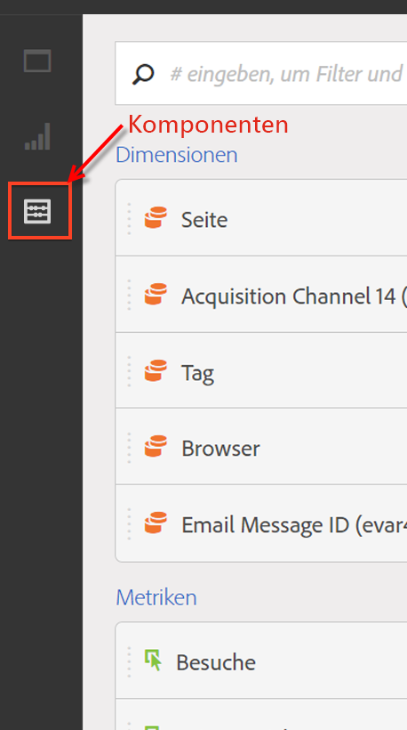

# Komponentenübersicht

Komponenten sind Funktionen in Customer Journey Analytics, die in Visualisierungen (wie Freiformtabellen) verwendet werden können oder Berichtsfunktionen ergänzen.

So verwalten Sie Komponenten über die Haupt-Benutzeroberfläche von Customer Journey Analytics:

1. Wählen Sie in der oberen Leiste **[!UICONTROL Komponenten]** aus.
1. Wählen Sie **[!UICONTROL Komponenten]** aus, um einen Überblick über die Komponenten zu erhalten, die Sie verwalten können, oder wählen Sie die zu verwaltende Komponente direkt über das Menü aus.

Sie können die folgenden Komponenten verwalten:

* [Segmente](segments/seg-overview.md): Erstellen, verwalten, teilen und verwenden Sie leistungsstarke, zielgerichtete Segmente für Ihre Berichte. Mit Segmenten können Sie Teilmengen von Personen anhand von Merkmalen oder Interaktionen identifizieren.
* [Berechnete Metriken:](calc-metrics/calc-metr-overview.md) Verwenden Sie Metriken und Formeln als neue Komponenten für die Berichterstellung.
* [Datumsbereiche](date-ranges/create.md): Passen Sie die von Analysis Workspace vorgeschlagenen Datumsbereiche an und präzisieren Sie diese.
* [Anmerkungen](/help/components/annotations/overview.md): Informieren Sie andere Benutzerinnen und Benutzer in Ihrem Unternehmen über die kontextbezogene Bedeutung von Daten und Erkenntnissen.
* [Intelligente Warnhinweise](/help/components/c-intelligent-alerts/intelligent-alerts.md): Diese ermöglichen es Ihnen, sich über geänderte Prozentsätze oder bestimmte Datenpunkte benachrichtigen zu lassen.
* [Geplante Projekte](/help/analysis-workspace/curate-share/t-schedule-report.md#scheduled-projects-manager): Verwalten Sie Ihre geplanten Projekte.
* [Voreinstellungen](/help/analysis-workspace/user-preferences.md): Verwalten Sie die Voreinstellungen für Analysis Workspace.
* [Zielgruppen](/help/components/audiences/audiences-overview.md): Erstellen und veröffentlichen Sie Zielgruppen aus Customer Journey Analytics auf der [Echtzeit-Kundendatenplattform](https://experienceleague.adobe.com/de/docs/experience-platform/profile/home) in Experience Platform zu Targeting- und Personalisierungszwecken.
* [Exporte](/help/components/exports/manage-export-locations.md): Verwalten Sie Ihr Exportkonto und Ihre Speicherorte.

## Analysis Workspace-Komponenten

Komponenten in Analysis Workspace bestehen aus Metriken, Dimensionen, Segmenten und Datumsbereichen, die Sie per Drag-and-Drop auf Panels und Visualisierungen in Ihrem Workspace-Projekt anwenden können. Wenn Sie benutzerdefinierte Komponenten erstellen, z. B. eine benutzerdefinierte Metrik oder einen benutzerdefinierten Datumsbereich, werden sie zu diesen Bedienfeldern hinzugefügt.

Um auf das Bedienfeld „Komponenten“ zuzugreifen, wählen Sie im Schaltflächenbedienfeld die Option  **[!UICONTROL Komponenten]** aus.

Informationen über die Verwendung von Komponenten in einem Projekt finden Sie unter [Erstellen eines Projekts](/help/analysis-workspace/home.md).

## Verwalten von Komponenten {#actions}

Mithilfe des Menüs **[!UICONTROL Komponenten]** in Analysis Workspace können Sie schnell eine neue Komponente erstellen. Weitere Informationen finden Sie im [Menü „Analysis Workspace“](/help/analysis-workspace/home.md#menu).

Sie können Komponenten verwalten, entweder einzeln oder durch Auswahl mehrerer Komponenten.

1. Wählen Sie eine oder mehrere Komponenten aus.

1. Wählen Sie im Kontextmenü oder über die Schaltfläche  „Aktionen für Komponenten“ (oben in Komponenten) eine der folgenden Aktionen aus.

   >[!TIP]
   >
   >Sie können mehrere Komponenten auswählen, indem Sie die **[!UICONTROL Umschalttaste]** gedrückt halten oder indem Sie die **[!UICONTROL Befehlstaste]** (macOS) bzw. die **[!UICONTROL Strg-Taste]** (Windows) gedrückt halten.

   {width=100%}

   | Komponentenaktion | Beschreibung |
   |--- |--- |
   |  [!UICONTROL **Tag**] | Organisieren oder verwalten Sie Komponenten, indem Sie Tags darauf anwenden. Sie können dann im linken Bedienfeld nach Tags suchen, indem Sie den  Filter auswählen oder `#` eingeben. Tags fungieren auch als Filter in den Komponenten-Managern. |
   |  [!UICONTROL **Zu Favoriten hinzufügen**] | Fügen Sie die Komponente zu Ihrer Favoritenliste hinzu. Genauso wie nach Tags können Sie im linken Bedienfeld auch nach Favoriten suchen und diese in den Komponenten-Managern als Filter verwenden. |
   |  **[!UICONTROL Aus Favoriten entfernen]** | Entfernen Sie die Komponente aus Ihrer Favoritenliste.  |
   |  [!UICONTROL **Genehmigen**] | Markieren Sie Komponenten als „Genehmigt“, um Ihren Benutzerinnen und Benutzern zu signalisieren, dass die Komponente vom Unternehmen genehmigt ist. Wie Tags können Sie im linken Bedienfeld anhand des Status „Genehmigt“ suchen und filtern. Mit einem  werden genehmigte Komponenten gekennzeichnet. |
   |  [!UICONTROL **Freigeben**] | Freigeben von Komponenten für Benutzer in Ihrer Organisation. Diese Option steht nur für benutzerdefinierte Komponenten zur Verfügung, beispielsweise für Segmente oder berechnete Metriken. |
   |  [!UICONTROL **Löschen**] | Löschen Sie Komponenten, die Sie nicht mehr benötigen. Diese Option steht nur für benutzerdefinierte Komponenten zur Verfügung, beispielsweise für Segmente oder berechnete Metriken. |

Benutzerdefinierte Komponenten können auch über ihre jeweiligen Komponenten-Manager verwaltet werden. Weitere Informationen finden Sie unter [Verwalten von Segmenten](/help/components/segments/seg-manage.md).

## Verwalten der Komponentenliste

Sie können die Komponentenliste im linken Bedienfeld von Analysis Workspace durchsuchen, filtern und sortieren, um eine bestimmte Komponente zu finden.

### Durchsuchen

1. Wählen Sie im linken Bedienfeld **Komponenten**  aus.

2. Geben Sie im Suchfeld den Namen der Komponente ein, die Sie in Ihrem Projekt verwenden möchten.

   Der jeweilige Komponententyp ist farblich und mit einem Symbol gekennzeichnet. **Dimensionen**  sind orange, **Segmente**  sind blau, **Datumsbereiche**  sind violett und **Metriken**  sind grün.  Das Adobe-Symbol  steht entweder für eine Vorlage für berechnete Metriken oder eine Segmentvorlage. Das Taschenrechnersymbol  gibt an, dass es sich um eine berechnete Metrik handelt, die administratorseitig in Ihrer Organisation erstellt wurde.

3. Wählen Sie aus dem Dropdown-Menü die gewünschte Komponente aus.

### Filter

1. Wählen Sie im linken Bedienfeld **Komponenten**  aus.

2. Wählen Sie **Filter**  aus oder geben Sie `#` in das Suchfeld ein.

3. Wählen Sie eine der folgenden Filteroptionen aus, um die Liste der Komponenten zu filtern:

   | Symbol | Filteroption | Beschreibung |
   |---------|---|----------|
   |  | **[!UICONTROL Genehmigt]** | Nur Komponenten anzeigen, die von Admins als genehmigt markiert wurden. |
   |  | **[!UICONTROL Favoriten]** | Nur Komponenten anzeigen, die sich in Ihrer Favoritenliste befinden.  Weitere Informationen zum Hinzufügen von Komponenten zu Ihrer Favoritenliste finden Sie unter [Verwalten von Komponenten](#manage-components). |
   |  | **[!UICONTROL Dimensionen]** | Nur Komponenten anzeigen, die Dimensionen sind. |
   |  | **[!UICONTROL Metriken]** | Nur Komponenten anzeigen, die Metriken sind. |
   |  | **[!UICONTROL Segmente]** | Nur Komponenten anzeigen, die Segmente sind.  |
   |  | **[!UICONTROL Datumsbereiche]** | Nur Komponenten anzeigen, die Datumsbereiche sind.  |
   |  | **[!UICONTROL *Tag-Name *]** | Nur Komponenten mit den jeweilig ausgewählten Tags anzeigen. Für Adobe-Vorlagen, bei denen es sich um die [standardmäßig berechneten Metriken](/help/components/calc-metrics/default-calcmetrics.md) von Adobe handelt, ist ein dediziertes Tag verfügbar. |

   Wählen Sie  in einem Filter aus, um den Filter zu entfernen.

4. Sie können optional die Komponentenliste sortieren, wie unter [Sortieren der Komponentenliste](#sort-the-component-list) beschrieben.

### Sortieren

<!-- {{release-limited-testing-section}}-->

1. (Optional) Wenden Sie alle Filter auf die Komponentenliste an, wie unter [Filtern der Komponentenliste](#filter-the-component-list) beschrieben.

2. Wählen Sie im linken Bedienfeld **Komponenten**  aus.

3. Wählen Sie **Sortieren**  und dann eine der folgenden Filteroptionen aus, um die Liste der Komponenten zu sortieren.

Die folgenden Sortieroptionen sind verfügbar:

{{components-sort-options}}

## Zugriffsberechtigungen

In Analysis Workspace können Admins [kuratieren](/help/analysis-workspace/curate-share/curate.md), welche Komponenten Benutzenden beim Reporting zur Verfügung stehen.
