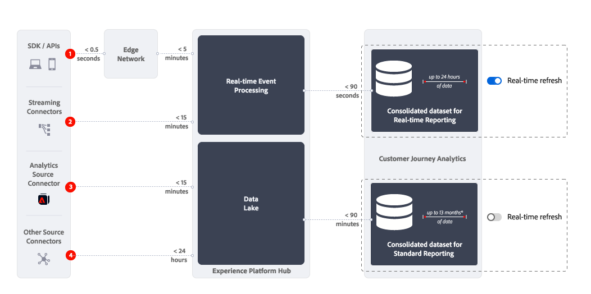

# Übersicht über die Echtzeitberichterstellung

Echtzeitberichte in Customer Journey Analytics zeigen Daten und Visualisierungen in einem oder mehreren Bedienfeldern in Analysis Workspace in Echtzeit an und aktualisieren diese.

{{ultimate-package}}

>[!TIP]
>
>Wenn Sie eine Berechtigung für das Ultimate-Paket haben, den Umschalter [Echtzeit-Aktualisierung](use-real-time.md) jedoch nicht sehen, erstellen Sie ein Ticket für die Kundenunterstützung, um die Echtzeit-Berichterstellung für Ihr Unternehmen anzufordern.

## Anwendungsfälle

Dieser Abschnitt bietet einen Überblick über typische wertvolle und weniger wertvolle Anwendungsfälle. Und auch Informationen, wann Echtzeit-Reporting nicht in Betracht gezogen werden sollte.

* Die wertvollsten Anwendungsfälle für Echtzeit-Reporting sind große Verkäufe, Promotions oder Produkteinführungen.
Im Rahmen dieses Launches sollten Sie Folgendes wissen:

   * Wie hoch sind die Umsätze im Vergleich zu Ihrem letzten Verkauf?
   * Wie sieht dieser Produktstart im Vergleich zum letzten Produktstart aus?
   * Funktionieren Ihre Promotions für diesen wichtigen Tag oder Event tatsächlich?

* Relevante, aber weniger wertvolle Anwendungsfälle für das Echtzeit-Reporting sind Validierungs-Anwendungsfälle.
Sie möchten beispielsweise Folgendes überprüfen:

   * Funktioniert die Kampagnen-Journey, die Sie kürzlich gestartet haben?
   * Wenn Ihre neue Produktseite aktiviert wurde, erfassen Sie dann Kundendaten von der Seite?
   * Geht Ihr Live-Medienereignis in Ordnung?

Erwägen Sie keine Echtzeitberichte für Anwendungsfälle zur Betriebsüberwachung. Zum Beispiel, um die Frage zu beantworten, ob eine Site ordnungsgemäß funktioniert. Da der Umschalter [Echtzeit-Aktualisierung](use-real-time.md) nach 30 Minuten automatisch deaktiviert wird und der Echtzeitbericht nicht mehr aktualisiert wird, sollten Sie für diese Anwendungsfälle keinen Echtzeitbericht als zuverlässige Quelle verwenden.

## Funktionsweise

Das Echtzeit-Reporting verwendet einen konsolidierten Datensatz, der vollständig getrennt vom [konsolidierten (kombinierten) Datensatz](/help/connections/combined-dataset.md) ist, der für das Standard-Reporting verwendet wird. Mit dem Umschalter [Echtzeit-Aktualisierung](use-real-time.md) können Sie zwischen folgenden Optionen wechseln:

* Echtzeitberichte zu einem konsolidierten Datensatz, der bis zu 24 Stunden rollierende Daten enthält.
* Standardberichte zum konsolidierten Datensatz, der bis zu 13 Monate rollierende Daten enthält (oder länger, falls Sie das Add-on für erweiterte Datenkapazität lizenziert haben).

{zoomable="yes"}

### Latenzen

Die Art und Weise, wie Sie Daten erfassen, bestimmt die Latenz von Echtzeitberichten in Customer Journey Analytics. Die obige Abbildung und die nachstehende Tabelle zeigen ungefähre Latenzen für verschiedene Datenerfassungsszenarien bei Verwendung von Echtzeit- und (zum Vergleich) Standard-Berichten.

| | Datenerfassung |   für Echtzeit-Berichte (ca. kleiner als) | Standard-Berichtslatenz  (ca. kleiner als) |
|:---:|---|--:|--:|
| 1 | Edge Network SDK / APIs in Edge Network | 7 Minuten | 95 Minuten |
| 2 | Streaming-Connectoren | 17 Minuten | 105 Minuten |
| 3 | Adobe Analytics-Quell-Connector | 17 Minuten | 105 Minuten |
| 4 | Andere Quell-Connectoren in die Quell-Connectoren (einschließlich Batch-Daten) | 25 Stunden | 25 Stunden |

Wenn es zu einer Unterbrechung von Services über eine halbe Stunde kommt, werden Echtzeitdaten nicht mit Daten aufgestockt, wenn die Probleme behoben sind. Stattdessen werden in Echtzeit-Berichten Echtzeitdaten von dem Zeitpunkt erfasst, an dem die Services wieder funktionieren. Während dieses Zeitraums gehen keine Daten verloren und sind weiterhin mit den standardmäßigen Berichtsfunktionen außerhalb des Echtzeit-Reportings verfügbar.

## Einschränkungen

Beachten Sie die folgenden Einschränkungen für das Echtzeit-Reporting:

* Echtzeitberichte berichten nur über Daten, die über einen rollierenden Zeitraum von 24 Stunden verfügbar sind. Daten, die älter als 24 Stunden sind, stehen für das Echtzeit-Reporting nicht zur Verfügung. Sobald die [Echtzeit-Aktualisierung](use-real-time.md) für einen Bericht deaktiviert oder automatisch deaktiviert wurde, sind alle relevanten Daten erneut aus dem [konsolidierten Datensatz“ verfügbar, &#x200B;](/help/connections/combined-dataset.md) normalerweise für das Reporting in Customer Journey Analytics verwendet wird.
* Attribution, Segmentierung, berechnete Metriken und mehr arbeiten nur mit den Daten, die innerhalb des rollierenden Zeitraums von 24 Stunden verfügbar sind. Ein Segment *Besucher wiederholen* enthält beispielsweise nur sehr wenige Personen in einem Echtzeitbericht, da der Bericht nur Personen enthält, die in den letzten 24 Stunden mehrmals besucht haben. Eine ähnliche Einschränkung gilt, wenn Sie einen Echtzeitbericht über Personen erstellen, die zuvor auf eine Kampagne geklickt haben, die nicht mehr aktiv ist.
* Echtzeitberichte eignen sich am besten für Daten auf Ereignis- und Sitzungsebene. Bei der Verwendung von Echtzeitberichten für Daten auf Personenebene sollten Sie daher vorsichtig sein. Da für Echtzeitberichte nur Ereignisse aus dem rollierenden 24-Stunden-Zeitraum verfügbar sind, ist der Ereignisverlauf einer Person auch auf dieses Fenster beschränkt. Berücksichtigen Sie bei der Auswahl einer Dimension und (berechneter) Metriken die Präferenz für Daten auf Ereignis- und Sitzungsebene. Und wenn Sie Funktionen wie Aufschlüsselungen, Nächstes oder Vorheriges und mehr in Ihrem Bedienfeld für die Echtzeit-Aktualisierung verwenden.
* Zuordnung und Echtzeitberichte können nicht kombiniert werden. Beim Echtzeit-Reporting geht es um Daten auf Ereignis- und Sitzungsebene, und es ist weniger relevant für personenbasierte Daten.
* Es sind keine von Heartbeat erfassten Medienmetriken verfügbar, mit Ausnahme von Medienstart- und Medienschlussmetriken. Sie können also weiterhin Echtzeitberichte verwenden, um einen Medienanwendungsfall zu ermöglichen.
* Wenn Sie die [Download- oder Exportoptionen](/help/analysis-workspace/export/download-send.md) verwenden, um ein Projekt herunterzuladen oder Daten aus einer Freiformtabelle zu exportieren, beachten Sie Folgendes:
   * Ein heruntergeladenes CSV-Projekt oder eine exportierte CSV-Datei enthält die zum Zeitpunkt des Herunterladens oder Exports verfügbaren Echtzeitdaten.
   * Ein heruntergeladenes PDF-Projekt enthält Nicht-Echtzeitdaten, ähnlich den Daten, die angezeigt werden, wenn die Echtzeit-Aktualisierung deaktiviert ist.
