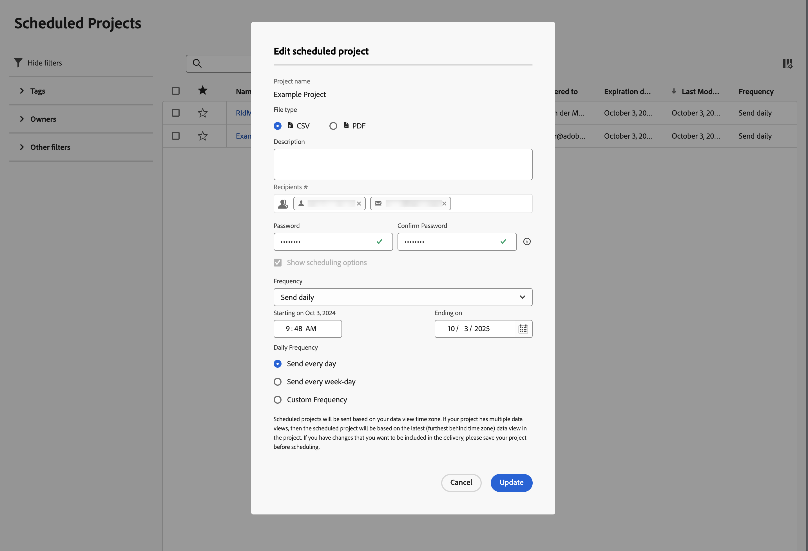

# Geplante Projekte

Geplante Analysis Workspace-Projekte können im Customer Journey Analytics mithilfe von **[!UICONTROL Komponenten]** > **[!UICONTROL Geplante Projekte]** verwaltet werden.

In **[!UICONTROL Geplante Projekte]** können Sie wiederkehrende Projektzeitpläne bearbeiten und löschen.  Die [Geplante Projektliste](#scheduled-project-list) zeigt die Elemente an, die ein bestimmter Benutzer erstellt hat. Wenn das Benutzerkonto in der Anwendung deaktiviert ist, werden alle geplanten Sendungen gestoppt.

## Geplante Projektliste

Die Liste Geplante Projekte enthält Spalten für:

| Spalte | Beschreibung |
| --- | --- |
|  | Wenn ein oder mehrere geplante Projekte ausgewählt werden, wird unten in der Benutzeroberfläche Geplante Projekte eine blaue Aktionsleiste angezeigt. Weitere Informationen finden [ unter ](#actions). |
|  | Wählen Sie aus zu bevorzugen oder zu deaktivieren. |
| **[!UICONTROL Zeitplan-ID]** | Eine ID, die hauptsächlich zum Debuggen verwendet wird. |
| **[!UICONTROL Name]** | Name dieses Projekts. Wählen Sie  aus, um weitere Details für das geplante Projekt anzuzeigen. Wählen Sie , um ein Kontextmenü zu öffnen. In diesem Menü haben Sie folgende Möglichkeiten:<ul><li> **[!UICONTROL Löschen]** eines geplanten Projekts.</li><li> **[!UICONTROL Tag]** ein geplantes Projekt.</li><li> **[!UICONTROL Genehmigen]** ein geplantes Projekt.</li><li> **[!UICONTROL CSV exportieren]**: Exportieren eines geplanten Projekts in eine CSV-Datei.</li></ul> |
| **[!UICONTROL Inhabende]** | Die Person, die das Projekt erstellt hat und dafür verantwortlich ist. |
| **[!UICONTROL Tags]** | (Optional) Mit Tagging können Projekte praktisch organisiert werden. Alle Benutzer können Tags erstellen und eines oder mehrere Tags auf ein Projekt anwenden. Sie sehen Tags jedoch nur für die Projekte, deren Verantwortlicher Sie sind oder die für Sie freigegeben wurden. |
| **[!UICONTROL Gesendet an]** | Die Empfänger dieses geplanten Projekts. |
| **[!UICONTROL Ablaufdatum]** | Sie können das Ablaufdatum unabhängig von der Häufigkeit des Zeitplans auf bis zu ein Jahr festlegen. |
| **[!UICONTROL Häufigkeit]** | Wie oft dieses geplante Projekt an einen oder mehrere Empfänger gesendet werden soll. |
| **[!UICONTROL Ausführungszeit]** | Zu welcher Tageszeit dieses geplante Projekt gesendet wird.  |
| **[!UICONTROL Anzahl der Abfragen]** | Die Anzahl der Abfragen für dieses Projekt. |
| **[!UICONTROL Längster Datumsbereich]** | Der längste für das geplante Projekt definierte Datumsbereich. Dieser Wert kann für die Untersuchung von Leistungsproblemen relevant sein. Weitere Informationen finden [ unter „Reporting ](/help/reporting-activity-manager/reporting-activity-overview.md) Manager“. |
| **[!UICONTROL Anzahl der Abfragen]** | Die Anzahl der für das geplante Projekt ausgeführten Abfragen. Dieser Wert kann für die Untersuchung von Leistungsproblemen relevant sein. Weitere Informationen finden [ unter „Reporting ](/help/reporting-activity-manager/reporting-activity-overview.md) Manager“. |

Sie können mit  konfigurieren, welche Spalten angezeigt werden sollen.

Suchen Sie mithilfe von „Suchen. Sie können auch im Bedienfeld Filter sehen, ob Filter angewendet werden. Um einen Filter zu entfernen, wählen Sie  für einen Filter aus. Um alle Filter zu entfernen, wählen Sie **[!UICONTROL Alle löschen]** aus.

Um ein geplantes Projekt zu bearbeiten, wählen Sie den Titel des geplanten Projekts aus. Aktualisieren Sie die Zeitplandetails **[!UICONTROL Dialogfeld „Geplantes Projekt]** bearbeiten“.

Wählen Sie **[!UICONTROL Aktualisieren]** aus, um den Zeitplan zu aktualisieren.

## Aktionen

Im Folgenden finden Sie häufige Aktionen im Manager für geplante Projekte. Sie können Aktionen im Kontextmenü oder in der blauen Aktionsleiste auswählen, wenn Sie ein oder mehrere geplante Projekte auswählen.

| Symbol | Aktion | Beschreibung |
|:---:|---|---|
|  | **[!UICONTROL *x *ausgewählt]** | Wählen Sie aus, um die Auswahl der geplanten Projekte aufzuheben. |
|  | **[!UICONTROL Löschen]** | Die ausgewählten geplanten Projekte für das Projekt löschen; die Projekte werden nicht gelöscht. |
|  | **[!UICONTROL Tag]** | Markieren Sie die ausgewählten geplanten Projekte. Wählen Sie in **[!UICONTROL Geplante Projekte taggen]** und klicken Sie zum Speichern **[!UICONTROL Speichern]**. |
|  | **[!UICONTROL Genehmigen]** | Genehmigen Sie die ausgewählten geplanten Projekte. |
|  | **[!UICONTROL In CSV exportieren]** | Exportieren Sie die ausgewählten geplanten Projekte in eine Datei mit dem Namen `Export Scheduled Projects List.csv`. |

## Filter

Sie können die geplanten Projekte [Liste geplanter Projekte](#scheduled-project-list) über das Filterbedienfeld filtern. Verwenden Sie zum Ein- oder Ausblenden des Filterbereichs .

Das Filterbedienfeld besteht aus den folgenden Abschnitten.

### Tags

| Tags | Beschreibung |
|---|---|
| {width="300"} | Im Abschnitt **[!UICONTROL Tags]** können Sie nach Tags filtern. <ul><li>Sie verwenden  **[!UICONTROL Tags suchen]** um nach Tags zu suchen, die Sie zum Filtern verwenden möchten.</li><li>Sie können mehrere Tags auswählen. Die verfügbaren Tags hängen von Auswahlen ab, die in anderen Abschnitten im Filterbedienfeld vorgenommen wurden.</li><li>Die Zahlen geben Folgendes an:<ul><li>7︎⃣: Die Anzahl der geplanten Projekte, die mit dem bestimmten Tag verknüpft sind.</li></ul></li></ul> |

### Inhaber

| Besitzer | Beschreibung |
|---|---|
| {width="300"} | Im Abschnitt **[!UICONTROL Verantwortlicher]** können Sie nach Verantwortlichen filtern. <ul><li>Sie verwenden  *Nach Inhabern suchen* um nach Inhabern zu suchen, die Sie zum Filtern verwenden möchten.</li><li>Sie können mehrere Besitzer auswählen. Die verfügbaren Besitzer hängen von den Auswahlen ab, die in anderen Abschnitten im Filterbedienfeld vorgenommen wurden.</li><li>Die Zahlen geben Folgendes an:<ul><li>4︎⃣: Die Anzahl der geplanten Projekte, die dem jeweiligen Eigentümer zugeordnet sind.</li></ul></li></ul> |

### Andere Filter

| Andere Filter | Beschreibung |
|---|---|
| {width="300"} | Im Abschnitt **[!UICONTROL Sonstige Filter]** können Sie nach anderen vordefinierten Filtern filtern.<ul><li>Sie können eine oder mehrere der folgenden Optionen auswählen:<ul><li> **[!UICONTROL Abgelaufen]**: Filtern Sie nach abgelaufenen geplanten Projekten.</li><li>**[!UICONTROL Fehlgeschlagen]**: Filtern Sie nach geplanten Projekten, bei denen der Zeitplan fehlgeschlagen ist.</li></ul>Was Sie auswählen können, hängt von Ihrer Rolle und Ihren Berechtigungen ab.</li><li>Sie können mehr als einen anderen Filter auswählen. Die anderen verfügbaren Filter hängen von Auswahlen ab, die in anderen Abschnitten im Filterbedienfeld vorgenommen wurden.</li><li>Die Zahlen geben Folgendes an:<ul><li>4︎⃣: Die Anzahl der geplanten Projekte, die dem jeweiligen anderen Filter zugeordnet sind.</li></ul></li></ul> |
