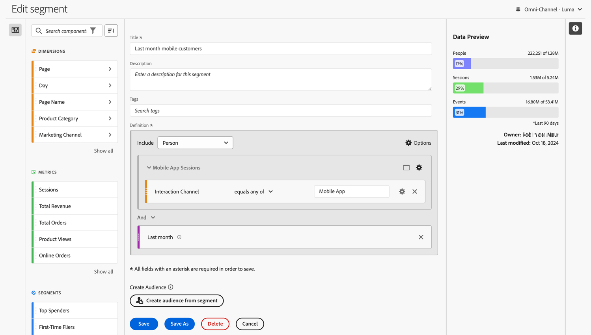

# Erstellen von Segmenten {#build-segments}

>[!CONTEXTUALHELP]
>id="components_filters_createaudience"
>title="Erstellen einer Zielgruppe"
>abstract="Zielgruppen können mithilfe eines Segments erstellt und zur Aktivierung für Adobe Experience Platform freigegeben werden."

>[!CONTEXTUALHELP]
>id="components_filters_datapreview"
>title="Datenvorschau"
>abstract="Vergleicht die Daten dieses Segments mit den Daten der Datenansicht. Der Prozentsatz der Vorschau basiert auf der Gesamtzahl der Daten in der Datenansicht aus den **letzten 90 Tagen**.  Wenn die Vorschau nicht geladen wird, wird Ihre Verbindung möglicherweise noch aufgestockt."

Das Dialogfeld **[!UICONTROL Segment Builder]** wird zum Erstellen neuer oder zum Bearbeiten vorhandener Segmente verwendet. Das Dialogfeld heißt **[!UICONTROL Neues Segment]** oder **[!UICONTROL Segment bearbeiten]** bei Segmenten, die Sie über den [[!UICONTROL Segment-Manager] erstellen oder verwalten](/help/components/segments/seg-manage.md).

>[!BEGINTABS]

>[!TAB Segment Builder]

>[!TAB Erstellen oder Bearbeiten von Segmenten]

>[!ENDTABS]

1. Geben Sie die folgenden Details an ( bedeutet erforderlich):

   | Element | Beschreibung |
   | --- | --- |
   | **[!UICONTROL Datenansicht]** | Sie können die Datenansicht für das Segment auswählen.  Das von Ihnen definierte Segment ist als Segment in der Registerkarte [Einstellungen](/help/data-views/create-dataview.md#settings-filters) einer Datenansicht verfügbar. |
   | **[!UICONTROL Projektspezifische Segmente]** | Ein Informationsfeld, in dem erklärt wird, dass das Segment nur in dem Projekt sichtbar ist, in dem es erstellt wurde, und dass das Segment nicht zu Ihrer Komponentenliste hinzugefügt wird. Aktivieren Sie **[!UICONTROL Dieses Segment für alle Projekte verfügbar machen und der Komponentenliste hinzufügen]**, um diese Einstellung zu ändern. Dieses Infofeld wird nur angezeigt, wenn Sie ein [Schnellsegment](seg-quick.md) erstellen und dieses mithilfe von **[!UICONTROL Builder öffnen]** in der Oberfläche [!UICONTROL Schnellsegment] in ein reguläres Segment umwandeln. |
   | **[!UICONTROL Titel]**  | Benennen Sie das Segment, beispielsweise mit `Last month mobile customers`. |
   | **[!UICONTROL Beschreibung]** | Geben Sie eine Beschreibung für das Segment ein, beispielsweise `Segment to define the mobile customers for the last month`. |
   | **[!UICONTROL Tags]** | Organisieren Sie das Segment, indem Sie ein oder mehrere Tags erstellen oder anwenden. Beginnen Sie mit der Eingabe, um nach vorhandenen Tags zu suchen, die Sie auswählen können. Oder drücken Sie die **[!UICONTROL Eingabetaste]**, um ein neues Tag hinzuzufügen. Wählen Sie  aus, um ein Tag zu entfernen. |
   | **[!UICONTROL Definition]**  | Definieren Sie Ihr Segment mit dem [Definition Builder](#definition-builder). |

   {style="table-layout:auto"}

1. Um zu überprüfen, ob Ihre Segmentdefinition korrekt ist, verwenden Sie die ständig aktualisierte Vorschau der Ergebnisse des Segments oben rechts.
1. Um eine Zielgruppe aus dem Segment zu erstellen und die Zielgruppe für Experience Platform freizugeben, wählen Sie **[!UICONTROL Zielgruppe aus Segment erstellen]** aus. Weitere Informationen finden Sie unter [&#x200B; Erstellen und Veröffentlichen von Zielgruppen](/help/components/audiences/publish.md).
1. Wählen Sie Folgendes aus:
   * **[!UICONTROL Speichern]**: Speichert das Segment.
   * **[!UICONTROL Speichern unter]**: Speichert eine Kopie des Segments.
   * **[!UICONTROL Löschen]**: Löscht das Segment.
   * **[!UICONTROL Abbrechen]**: Verwirft alle Änderungen, die Sie am Segment vorgenommen haben, oder bricht die Erstellung eines neuen Segments ab.

## Definition Builder

Mit dem Definition Builder erstellen Sie Ihre Segmentdefinition. Dabei verwenden Sie Komponenten, Container, Operatoren und Logik.

Sie können den Typ und den Umfang Ihrer Definition konfigurieren:

1. Um den Typ Ihrer Definition anzugeben, geben Sie an, ob Sie eine Ein- oder Ausschlussdefinition erstellen möchten. Wählen Sie  **[!UICONTROL Optionen]** und aus dem Dropdown-Menü **[!UICONTROL Einbeziehen]** oder **[!UICONTROL Ausschließen]** aus.
1. Um den Umfang Ihrer Definition anzugeben, wählen Sie aus dem Dropdown-Menü **[!UICONTROL Einschließen]** oder **[!UICONTROL Ausschließen]** aus, ob Sie den Umfang der Definition **[!UICONTROL Ereignis]**, **[!UICONTROL Sitzung]**, **[!UICONTROL Person]**, **[!UICONTROL Globales Konto]** [!BADGE B2B editionB2B edition B2B edition &#x200B;]{type=Informative url="https://experienceleague.adobe.com/de/docs/analytics-platform/using/cja-overview/cja-b2b/cja-b2b-edition" newtab=true tooltip="Customer Journey Analytics B2B Edition"} oder **&#x200B;**&#x200B;[!BADGE &#x200B; Einkaufsgruppe]{type=Informative url="https://experienceleague.adobe.com/de/docs/analytics-platform/using/cja-overview/cja-b2b/cja-b2b-edition" newtab=true tooltip="Customer Journey Analytics B2B Edition"}224&rbrace;B2B edition **&#x200B;**&#x200B;[!BADGE &#x200B; &#x200B;]{type=Informative url="https://experienceleague.adobe.com/de/docs/analytics-platform/using/cja-overview/cja-b2b/cja-b2b-edition" newtab=true tooltip="Customer Journey Analytics B2B Edition"} **[!UICONTROL möchten]**{type=Informative url="https://experienceleague.adobe.com/de/docs/analytics-platform/using/cja-overview/cja-b2b/cja-b2b-edition" newtab=true tooltip="Customer Journey Analytics B2B Edition"}

Sie können diese Einstellungen später jederzeit ändern.

### Komponenten

Ein wichtiger Teil beim Erstellen Ihrer Segmentdefinition ist die Verwendung von Dimensionen, Metriken, vorhandenen Segmenten und Datumsbereichen. Alle diese Komponenten sind über das Panel „Komponenten“ im Segment Builder verfügbar.

{width=100%}

So fügen Sie eine Komponente hinzu:

1. Ziehen Sie eine Komponente aus dem Panel „Komponenten“ auf **[!UICONTROL Platzieren Sie Metriken, Segmente und/oder Dimensionen mittels Drag-and-Drop hier]**. Sie können die  in der Komponentenleiste verwenden, um nach bestimmten Komponenten zu suchen.
1. Geben Sie Details für die Komponente an. Wählen Sie beispielsweise einen Wert über **[!UICONTROL Wert auswählen]** aus. Oder geben Sie einen Wert ein. Wie Sie einen oder mehrere Werte und welche Werte Sie angeben können, hängt von der Komponente und dem Operator ab.
1. Ändern Sie optional den Standardoperator. Beispiel: von **[!UICONTROL ist gleich]** zu **[!UICONTROL ist gleich eines von]**. Unter [Operatoren](seg-operators.md) finden Sie einen detaillierten Überblick über die verfügbaren Operatoren.

So bearbeiten Sie eine Komponente:

* Wählen Sie im Dropdown-Menü „Operator“ einen neuen Operator für die Komponente aus.
* Wählen Sie ggf. einen anderen Wert für den Operator aus oder geben Sie ihn an.
* Wenn der Komponententyp eine Dimension ist, können Sie das Attributionsmodell definieren. Weitere Informationen finden Sie unter [Attributionsmodell](#attribution).

So löschen Sie eine Komponente:

* Wählen Sie  in einer Komponente aus.

### Container

Sie können mehrere Komponenten in einem oder mehreren Containern gruppieren und Logik innerhalb und zwischen Containern definieren. Mit Containern können Sie komplexe Definitionen für Ihr Segment erstellen.

{Width=100%}

* Wählen Sie zum Hinzufügen eines Containers über  **[!UICONTROL Optionen]** die Option **[!UICONTROL Behälter hinzufügen]** aus.
* Um eine vorhandene Komponente zum Container hinzuzufügen, ziehen Sie die Komponente per Drag-and-Drop in den Container.
* Um dem Container eine weitere Komponente hinzuzufügen, ziehen Sie eine Komponente per Drag-and-Drop aus dem Panel „Komponente“ in den Container. Verwenden Sie die blaue Linie zum Einfügen als Orientierung.
* Um eine weitere Komponente außerhalb des Containers hinzuzufügen, ziehen Sie eine Komponente per Drag-and-Drop aus dem Panel „Komponente“ außerhalb des Containers, aber innerhalb des Containers für die Hauptdefinition. Verwenden Sie die blaue Linie zum Einfügen als Orientierung.
* Um die Logik zwischen Komponenten in einem Container, zwischen Containern oder zwischen einem Container und einer Komponente zu ändern, wählen Sie die entsprechende Option **[!UICONTROL Und]**, **[!UICONTROL Oder]**, **[!UICONTROL Dann]**. Wenn Sie Dann auswählen, wandeln Sie das Segment in ein sequenzielles Segment um. Weitere Informationen finden Sie unter [Erstellen eines sequenziellen Segments](seg-sequential-build.md).
* Um die Container-Ebene zu wechseln, wählen Sie  **[!UICONTROL Globales Konto]** [!BADGE B2B Edition]{type=Informative url="https://experienceleague.adobe.com/de/docs/analytics-platform/using/cja-overview/cja-b2b/cja-b2b-edition" newtab=true tooltip="Customer Journey Analytics B2B Edition"},  **[!UICONTROL Konto]** [!BADGE B2B Edition]{type=Informative url="https://experienceleague.adobe.com/de/docs/analytics-platform/using/cja-overview/cja-b2b/cja-b2b-edition" newtab=true tooltip="Customer Journey Analytics B2B Edition"},  **[!UICONTROL Opportunity]** [!BADGE B2B Edition]{type=Informative url="https://experienceleague.adobe.com/de/docs/analytics-platform/using/cja-overview/cja-b2b/cja-b2b-edition" newtab=true tooltip="Customer Journey Analytics B2B Edition"},  **[!UICONTROL Käufergruppe]** [!BADGE B2B Edition]{type=Informative url="https://experienceleague.adobe.com/de/docs/analytics-platform/using/cja-overview/cja-b2b/cja-b2b-edition" newtab=true tooltip="Customer Journey Analytics B2B Edition"},  **[!UICONTROL Ereignis]**,  **[!UICONTROL Sitzung]** oder  **[!UICONTROL Person]** aus.

Sie können  in einem Container für die folgenden Aktionen verwenden:

| Container-Aktion | Beschreibung |
|---|---|
| **[!UICONTROL Behälter hinzufügen]** | Fügen Sie dem Container einen verschachtelten Container hinzu. |
| **[!UICONTROL Ausschließen]** | Schließen Sie das Ergebnis aus dem Container in der Segmentdefinition aus. Ein dünner roter Balken auf der linken Seite kennzeichnet einen Container „Ausschließen.“ |
| **[!UICONTROL Einschließlich]** | Beziehen Sie das Ergebnis aus dem Container in die Segmentdefinition ein. Die Standardeinstellung lautet „Einbeziehen“. Ein dünner grauer Balken auf der linken Seite kennzeichnet einen Container „Einbeziehen“. |
| **[!UICONTROL Container benennen]** | Benennen Sie den Container ausgehend von seiner Standardbeschreibung um. Geben Sie einen Namen in das Textfeld ein. Wenn Sie keine Eingabe vornehmen, wird die Standardbeschreibung verwendet. |
| **[!UICONTROL Container löschen]** | Löschen Sie den Container aus der Definition. |

## Datumsbereiche

Sie können Segmente erstellen, die rollierende Datumsbereiche enthalten. So können Sie Fragen zu laufenden Kampagnen oder Ereignissen beantworten. Sie können beispielsweise ein Segment erstellen, das *alle Personen, die in den vergangenen 60 Tagen Online-Käufe getätigt haben*, einschließt.

>[!BEGINSHADEBOX]

Unter  [Rollierende Datumsbereiche in Segmenten](https://video.tv.adobe.com/v/25403/?quality=12&learn=on){target="_blank"} finden Sie ein Demovideo.

>[!ENDSHADEBOX]

## Stapeln von Segmenten {#stack}

Sie können ein Segment mithilfe von Segmenten erstellen. Wenn Sie Segmente in einem Segment verwenden, können Sie Ihr Segment optimieren und die Komplexität reduzieren.

Angenommen, Sie möchten eine Segmentierung anhand der Kombination aus Gerätetyp (2) und US-Status (50) vornehmen. Sie können entweder 100 Segmente erstellen, d. h. jeweils eine eindeutige Kombination aus Gerätetyp (Mobiltelefon oder Tablet) und US-Bundesstaat. Um die Tablet-Benutzenden aus Kalifornien abzurufen, würden Sie dann eines der 100 Segmente verwenden:

Oder Sie könnten 52 Segmente definieren: 50 Segmente für die US-Bundesstaaten, eines für Mobiltelefone und eines für Tablet-Computer. Stapeln Sie dann die Segmente, um die gleichen Ergebnisse zu erhalten. Um die kalifornischen Tablet-Benutzer zu erhalten, stapeln Sie zwei Segmente:

## Attribution {#attribution}

>[!CONTEXTUALHELP]
>id="components_filters_attribution_repeating"
>title="Wiederholend"
>abstract="Umfasst Instanzen und persistierte Werte für die Dimension."

>[!CONTEXTUALHELP]
>id="components_filters_attribution_instance"
>title="Instanz"
>abstract="Umfasst Instanzen für die Dimension."

>[!CONTEXTUALHELP]
>id="components_filters_attribution_nonrepeatinginstance"
>title="Sich nicht wiederholende Instanz"
>abstract="Umfasst einzigartige (sich nicht wiederholende) Instanzen für die Dimension."

Wenn Sie eine Dimension im Segment Builder verwenden, können Sie das Attributionsmodell für diese Dimension angeben. Das von Ihnen ausgewählte Attributionsmodell bestimmt, ob Daten für die Bedingung qualifiziert sind, die Sie für die Dimensionskomponente angegeben haben.

Wählen Sie in der Dimensionskomponente das Symbol  und dann eines der Attributionsmodelle aus dem Popup aus:

| Modelle | Beschreibung |
|---|---|
| **[!UICONTROL Sich wiederholendes Modell (Standard)]** | Schließen Sie die Instanz und persistierten Werte für die Dimension ein, um die Qualifizierung zu bestimmen. |
| **[!UICONTROL Instanz]** | Schließen Sie nur Instanzwerte für die Dimension ein, um die Qualifizierung zu bestimmen. |
| **[!UICONTROL Sich nicht wiederholende Instanz]** | Schließen Sie eindeutige (sich nicht wiederholende) Instanzwerte für die Dimension ein, um die Qualifizierung zu bestimmen. |

### Beispiel

Als Teil einer Segmentdefinition haben Sie die folgende Bedingung angegeben: Seitenname ist gleich Frauen. Dies ist ähnlich wie im obigen Beispiel. Sie wiederholen diese Segmentdefinition mit den beiden anderen Attributionsmodellen. Sie haben also drei Segmente mit jeweils einem eigenen Attributionsmodell:

* „Frauen“-Seite – Attribution – Wiederholung (Standard)
* „Frauen“-Seite – Attribution – Instanz
* „Frauen“-Seite – Attribution – Sich nicht wiederholende Instanz

In der folgenden Tabelle wird für jedes Attributionsmodell angegeben, welche eingehenden Ereignisse für diese Bedingung qualifiziert  sind.

| „Frauen“-Seite – Attribution –  *Attributionsmodell* | Ereignis 1: Seitenname ist gleich Frauen | Ereignis 2: Seitenname ist gleich Männer | Ereignis 3: Seitenname ist gleich Frauen | Ereignis 4: Seitenname ist gleich Frauen (persistiert) | Ereignis 5: Seitenname ist gleich Checkout | Ereignis 6: Seitenname ist gleich Frauen | Ereignis 7: Seitenname ist gleich Startseite |
|---|:---:|:---:|:---:|:---:|:---:|:---:|:--:|
| Wiederholung (Standard) |  |  |  |  |  |  |  |
| Instanz |  |  |  |  |  |  |  |
| Sich nicht wiederholende Instanz |  |  |  |  |  |  |  |

Ein Beispielbericht zu Ereignissen, die die drei Segmente verwenden, sieht wie folgt aus:

