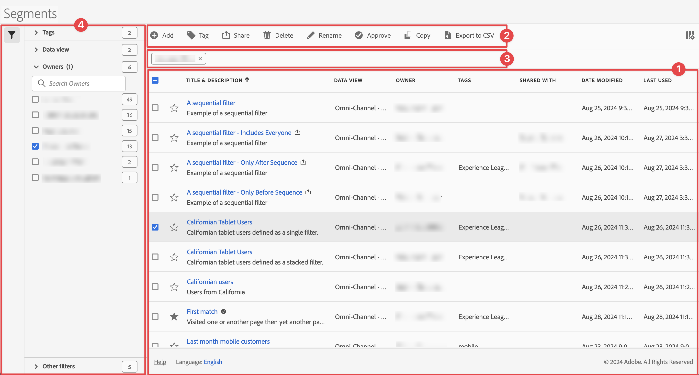

# Verwalten von Segmenten

Sie können [Freigeben](seg-share.md), [Segment](seg-filter.md), [Tag](seg-tag.md), [Genehmigen](seg-approve.md), umbenennen [Kopieren](seg-copy.md), Segmente löschen, exportieren und Segmente über eine zentrale [!UICONTROL Segment]Verwaltungsoberfläche als [Favorit](seg-favorite.md) markieren. So verwalten Sie Segmente:

* Wählen Sie **[!UICONTROL Hauptbenutzeroberfläche]** Komponenten“ aus und klicken Sie auf **[!UICONTROL Segmente]**.

>[!NOTE]
>
>Die Schnellsegmente, die Sie in einem bestimmten Workspace-Projekt erstellen, werden nicht im [!UICONTROL Segment]Manager angezeigt, es sei denn, Sie haben das Segment für alle Ihre Projekte verfügbar gemacht.
>

## Segment-Manager

Der Segment-Manager verfügt über die folgenden Elemente der Benutzeroberfläche:

### Segmentliste

In der ➊ „Segmentliste“ werden alle Segmente angezeigt, deren Inhaber Sie sind, die Segmente, die für alle Ihre Projekte gelten, und die Segmente, die für Sie freigegeben wurden. Die Liste umfasst die folgenden Spalten:

| Spalte | Beschreibung |
| --- | --- |
|  | Wählen Sie aus, StarOutline. Siehe [Segment als Favorit markieren](/help/components/segments/seg-favorite.md) |
| **[!UICONTROL Titel und Beschreibung]** | Um das Segment zu bearbeiten, klicken Sie auf den Titel-Link, der den [Segment Builder“ ](seg-builder.md). Ein freigegebenes Segment wird mit &quot;. |
| **[!UICONTROL Datenansicht]** | Die Datenansichten, für die dieses Segment gilt. |
| **[!UICONTROL Inhabende]** | Der Inhaber des Segments. Als Benutzer sehen Sie nur die Segmente, deren Inhaber Sie sind, oder die Anmerkungen, die für Sie freigegeben wurden. |
| **[!UICONTROL Tags]** | Die Tags für dieses Segment. |
| **[!UICONTROL Freigegeben für]** | Wie viele Einzelpersonen oder Gruppen Sie das Segment freigegeben haben. Wählen Sie diese Option aus, um das Dialogfeld **[!UICONTROL Komponente freigeben]** zu öffnen. Weitere Informationen finden [ unter ](seg-share.md) von Segmenten . |
| **[!UICONTROL Änderungsdatum]** | Datum und Uhrzeit der letzten Änderung des Segments. |
| **[!UICONTROL Verwendet in]** | Zeigt an, wo Segmente derzeit verwendet werden und wie oft sie in den einzelnen Bereichen verwendet werden. 
Wenn das Segment beispielsweise in 40 Projekten und 2 Warnhinweisen verwendet wird, wird der Wert dieser Spalte als [!UICONTROL **42 Komponenten**] angezeigt.
 
Wählen Sie den Wert in dieser Spalte aus, um die Aufschlüsselung anzuzeigen, wo die Segmente verwendet werden (z. B. [!UICONTROL **Projekte (40)**], [!UICONTROL **Mobile Scorecards (2)**]). Darüber hinaus können Sie die Liste der Elemente anzeigen, in denen die Segmente verwendet werden. Um beispielsweise die Liste der Projekte anzuzeigen, in denen sie verwendet werden, klicken Sie auf den Link [!UICONTROL **Projekte (40)**].

Jeder der folgenden Bereiche zeigt die Anzahl der Instanzen der Segmente an, die in diesem Bereich verwendet werden:
  <ul><li>[!UICONTROL **Projekte**]
Enthält Segmente, [ im Segment Builder erstellt wurden ](/help/components/segments/seg-builder.md#) für alle Projekte verfügbar sind.
</li><li>[!UICONTROL **Ad-hoc-Komponenten**]
Enthält Segmente, [ als Schnellsegmente erstellt wurden ](/help/components/segments/seg-quick.md) nur in einem einzigen Projekt verfügbar sind.
</li><li>[!UICONTROL **Geplante Projekte**]</li><li>[!UICONTROL **Mobile Scorecards**]</li><li>[!UICONTROL **Anmerkungen**]</li><li>[!UICONTROL **Berechnete Metriken**]</li><li>[!UICONTROL **Report Builder**]
Wenn Sie diese Option wählen, wird eine CSV-Datei mit den folgenden Datenspalten heruntergeladen:
<ul><li>Report Builder-Name</li><li>Letzter Zugriff</li><li>Letzter Zugriff – IMS-Benutzer-ID</li><li>Letzter Zugriff – Benutzername</li></ul></li></ul>
Mithilfe dieser Informationen können Sie feststellen, ob eine Komponente für Benutzerinnen und Benutzer in Ihrer Organisation nützlich ist, wo die Komponente verwendet wird und ob die Komponente gelöscht oder geändert werden muss.

Beachten Sie Folgendes beim Anzeigen dieser Option:
<ul><li>Diese Informationen stehen nur Systemadmins zur Verfügung.</li><li>Die Spalte [!UICONTROL **Verwendet in**] wird standardmäßig nicht angezeigt. Mit  können Sie die Anzeige dieser Spalte konfigurieren.</li><li>Diese Informationen umfassen nicht die Nutzung über die API oder Data Warehouse.</li><li>Wenn in dieser Spalte keine Daten für eine bestimmte Komponente vorhanden sind, die Komponente jedoch ein Datum [!UICONTROL **Zuletzt verwendet**] aufweist, wurde die Komponente möglicherweise in einer Analyse verwendet, ohne gespeichert zu werden.</li><li>Nutzungsinformationen sind ab September 2023 verfügbar.</li></ul>
Sie können das [Datenwörterbuch](/help/components/data-dictionary/data-dictionary-overview.md) zusammen mit diesen Informationen verwenden, um die Verwendung von Komponenten in Ihrer Organisation zu verfolgen und besser zu verstehen.
 |
| **[!UICONTROL Zuletzt verwendet]** | Zeitpunkt der letzten Verwendung des Segments. |

Verwenden Sie , um die anzuzeigenden Spalten anzugeben.

### Aktionsleiste

Sie können Aktionen für Segmente mithilfe der Aktionsleiste ➋. Die Aktionsleiste ermöglicht die folgenden Aktionen:

| Aktion | Beschreibung |
|---|---|
|  **[!UICONTROL Hinzufügen]** | Fügen Sie mit dem [Segment Builder“ ein weiteres Segment ](seg-builder.md). |
|  [!UICONTROL *Nach Titel suchen*] | Wenn kein Segment in der Liste ausgewählt ist, suchen Sie mithilfe dieses Suchfelds nach Segmenten. |
|  **[!UICONTROL Tag]** | Tagging der ausgewählten Segmente. Wählen Sie im **[!UICONTROL Segment]**-Dialogfeld die Tags für die ausgewählten Segmente aus bzw. heben Sie die Auswahl auf. Wählen Sie **[!UICONTROL Speichern]**, um die Tags für die ausgewählten Segmente zu speichern. Weitere Informationen finden [ unter ](/help/components/segments/seg-tag.md) von Segmenten . |
|  **[!UICONTROL Freigeben]** | Freigeben der ausgewählten Segmente. Im Dialogfeld **[!UICONTROL Segment freigeben]** können Sie  *(Einzelpersonen oder Gruppen* oder **[!UICONTROL Organisation]** oder **[!UICONTROL Gruppen]**. Wählen Sie **[!UICONTROL Speichern]**, um Freigabedetails für die ausgewählten Segmente zu speichern. Weitere Informationen finden [ unter ](seg-share.md) von Segmenten . |
|  **[!UICONTROL Löschen]** | Löscht die ausgewählten Segmente. Sie werden zur Bestätigung aufgefordert.  Beachten Sie beim Löschen eines Segments Folgendes: <ul><li>Terminierte Berichte und Projekte, auf die dieses Segment angewendet wurde, funktionieren weiterhin normal.</li><li> Terminierte Berichte werden nicht aktualisiert, wenn Sie ein Segment mit demselben Namen bearbeiten.</li> </ul> |
|  **[!UICONTROL Umbenennen]** | Ein einzelnes ausgewähltes Segment umbenennen. Wenn diese Option aktiviert ist, können Sie das Segment inline umbenennen. |
|  **[!UICONTROL Genehmigen]** | Genehmigen Sie die ausgewählten Segmente. Weitere Informationen finden [ unter ](seg-approve.md) von Segmenten. |
|  **[!UICONTROL Kopieren]** | Kopiert das ausgewählte Segment. Neue Segmente werden mit demselben Namen und derselben `(Copy)` erstellt. |
|  **[!UICONTROL In CSV exportieren]** | Exportieren Sie die Segmente in eine `Segments List.csv`. |

### Aktive Filterleiste

Die Filterleiste zeigt ➌ die aktiven Segmente an, die vom Filterbedienfeld auf die Liste der Segmente angewendet wurden (falls vorhanden). Mit  können Sie schnell einen Filter entfernen. Wenn mehr als ein Filter angegeben ist, können Sie mit „Alle entfernen **[!UICONTROL alle Filter]**.

### Panel „Filter“

Sie können die Liste der Segmente mithilfe der ➍ des  **[!UICONTROL Filtern]** filtern. Das Bedienfeld „Filter“ zeigt den Filtertyp und die Anzahl der Segmente an, die den spezifischen Filter berücksichtigen. Wählen Sie  aus, um die Anzeige des Bedienfelds „Filter“ umzuschalten.

Weitere [ finden Sie unter ](seg-filter.md) der Segmentliste .
