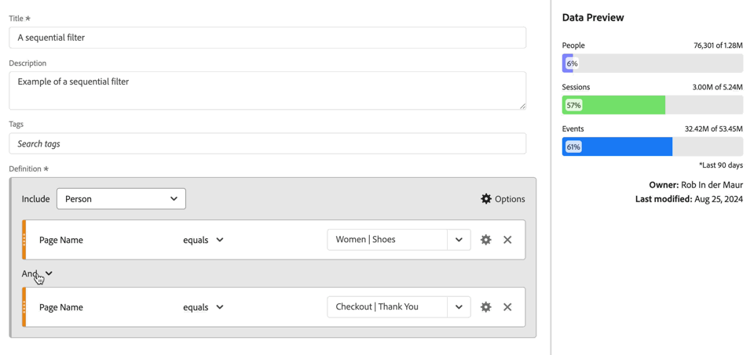
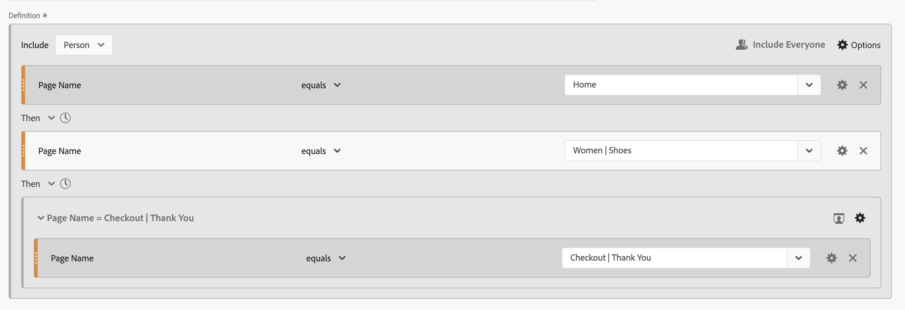
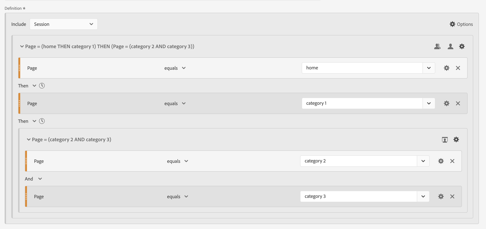
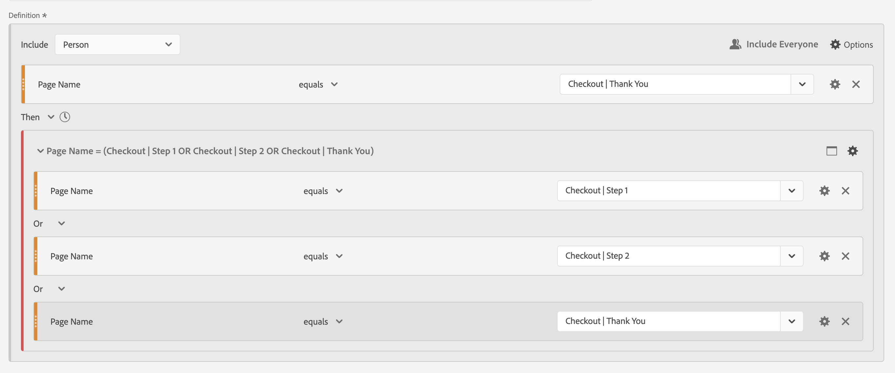
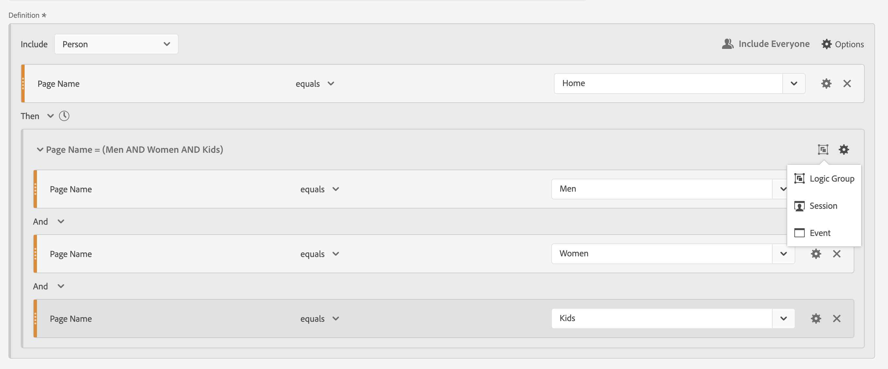
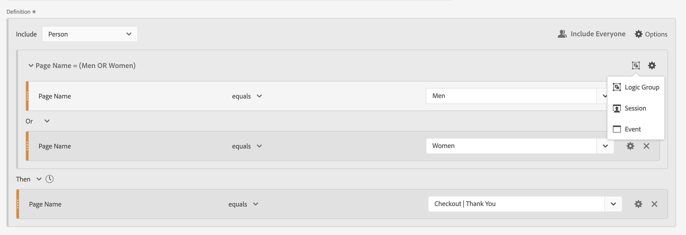

# Sequenzielle Segmente

Sequenzielle Segmente erstellen Sie mit dem [!UICONTROL Then] logischen Operator zwischen Komponenten, Containern und Komponenten oder Containern. Der [!UICONTROL Dann] logische Operator bedeutet, dass eine Segmentbedingung auftritt, gefolgt von einer anderen.

>[!BEGINSHADEBOX]

Siehe  [Sequenzielle Segmentierung](https://video.tv.adobe.com/v/25405/?quality=12&learn=on){target="_blank"} für ein Demovideo.

{{videoaa}}

>[!ENDSHADEBOX]

Ein sequenzielles Segment verfügt über einige [grundlegende Funktionen](#basics) und zusätzliche Optionen, die Sie konfigurieren können, um das sequenzielle Segment komplexer zu gestalten:

* [Nach und innerhalb](#after-and-within) Einschränkungen für die Dann-Logik in der Definition des Sequenzsegments:

* Welche Daten [einschließen](#include) als Teil der Gesamtsequenz für die Segmentdefinition. Oder für eine Sequenz, die als Teil eines Containers definiert ist. Standardmäßig werden alle übereinstimmenden Daten berücksichtigt. Diese Daten werden durch  [!UICONTROL Include everyone] identifiziert.

   * Wählen Sie  **[!UICONTROL Only Before Sequence]** aus, um nur Daten vor der Sequenz zu berücksichtigen.
   * Wählen Sie  **[!UICONTROL Only After Sequence]** aus, um nur Daten nach der Sequenz zu berücksichtigen.

* Welche Daten [ als Teil ](#exclude) sequenziellen Segmentdefinition ausgeschlossen werden sollen.

* Erfahren Sie[ wie Sie Bedingungen ](#logic-group) Ihrer sequenziellen Segmentdefinition logisch gruppieren.

## Grundlagen

Die Grundlagen zum Erstellen eines sequenziellen Segments unterscheiden sich nicht vom Erstellen eines regulären Segments mit dem [Segment Builder](seg-builder.md). Sie können den [Definition-Builder](seg-builder.md#definition-builder) verwenden, um Ihre Segmentdefinition zu erstellen. In dieser Konstruktion verwenden Sie Komponenten, Container, Operatoren und Logik. Ein reguläres Segment wird zu einem sequenziellen Segment, sobald Sie den **[!UICONTROL Then]**-Operator in der Hauptdefinition oder in einem der Container auswählen, die Sie im [Definition-Builder) ](seg-builder.md#definition-builder).

### Beispiele

Die folgenden Beispiele veranschaulichen die Verwendung sequenzieller Segmente in verschiedenen Anwendungsfällen.

#### Einfache Sequenz

Personen identifizieren, die eine Seite angesehen und dann eine andere Seite angesehen haben. Die Daten auf Ereignisebene werden mithilfe dieser Sequenz segmentiert. Unabhängig von vorherigen, vergangenen oder zwischengeschalteten Personensitzungen oder der Zeit oder Anzahl der Seitenansichten, die zwischen den Sitzungen stattfinden.

#### Sitzungsübergreifendes Sequenzieren

Personen identifizieren, die eine Seite in einer Sitzung und dann eine andere Seite in einer anderen Sitzung angesehen haben. Um zwischen Sitzungen zu unterscheiden, verwenden Sie Container, um die Sequenz zu erstellen, und definieren Sie Besuch **[!UICONTROL Sitzung]** für jeden Container.

#### Sequenz mit gemischten Ebenen

Personen identifizieren, die zwei Seiten über eine unbestimmte Anzahl von Sitzungen hinweg anzeigen, und dann eine dritte Seite in einer separaten Sitzung anzeigen. Auch hier verwenden Sie Container, um die Sequenz zu erstellen und Besuch **[!UICONTROL Sitzung]** für den Container zu definieren, der die separate Sitzung definiert.

#### Aggregierte Sequenz

Personen identifizieren, die bei ihrer ersten Sitzung eine bestimmte Seite und später einige andere Seiten besucht haben. Um zwischen der Ereignissequenz zu unterscheiden, verwenden Sie Container, um die Logik auf der Containerebene  **[!UICONTROL Session]** zu trennen.

#### Verschachteln einer Sequenz

Ermitteln Sie alle Sitzungen, bei denen eine Person eine Seite vor einer anderen besucht, und führen Sie dann Folgesitzungen durch, die zwei andere Seiten betreffen. Beispiel: Ermitteln Sie alle Sitzungen, in denen eine Person zuerst die Startseite und dann eine Kategorie-1-Seite besucht und dann andere Sitzungen hat, in denen in jeder Sitzung die Kategorie-2- und Kategorie-3-Seite besucht werden.

## [!UICONTROL Nachher] und [!UICONTROL Innerhalb]

Sie können  **[!UICONTROL After]** und  **[!UICONTROL Within]** den **[!UICONTROL Then]**-Operator verwenden, um zusätzliche [Zeitbeschränkungen](#time-constraints) oder [Beschränkungen für Ereignisse, Sitzungen oder Dimensionen](#event-session-and-dimension-constraints).

### Zeitliche Beschränkungen

So wenden Sie Zeitbeschränkungen auf den Operator **[!UICONTROL Then]** an:

1. Wählen Sie  aus.
1. Wählen **[!UICONTROL Innerhalb]** oder **[!UICONTROL Nachher]** aus dem Kontextmenü aus.
1. Geben Sie einen Zeitraum (**[!UICONTROL Minute]**, **[!UICONTROL Stunde]** bis **[!UICONTROL Jahre]**) an.
1. Wählen Sie  **[!UICONTROL *number *]**&#x200B;aus, um ein Popup zu öffnen, in dem Sie eine Zahl eingeben oder mit&#x200B;**[!UICONTROL -]**&#x200B;oder&#x200B;**[!UICONTROL +]**&#x200B;angeben können.

Um eine Zeitbeschränkung zu entfernen, verwenden Sie .

In der folgenden Tabelle werden die Zeitbeschränkungsoperatoren genauer erläutert.

| Operatoren | Beschreibung |
|--- |--- |
| **[!UICONTROL nachher]** | Der [!UICONTROL After]-Operator wird verwendet, um eine Mindestgrenze für den Zeitraum zwischen zwei Checkpoints anzugeben. Beim Festlegen der After-Werte beginnt das Zeitlimit mit der Anwendung des Segments. Wenn beispielsweise der Operator [!UICONTROL After] auf einem Container festgelegt ist, um Personen zu identifizieren, die Seite A besuchen, aber erst nach einem Tag zu Seite B zurückkehren, beginnt dieser Tag, wenn der Besucher Seite A verlässt.  Damit der Besucher in das Segment aufgenommen werden kann, muss nach dem Verlassen von Seite A zur Ansicht von Seite B mindestens 1440 Minuten (ein Tag) erkennbar sein. |
| **[!UICONTROL Innerhalb]** | Der [!UICONTROL In]-Operator wird zum Angeben einer maximalen Zeitbegrenzung zwischen zwei Checkpoints verwendet. Wenn beispielsweise der Operator [!UICONTROL Innerhalb] auf einem Container festgelegt ist, um Personen zu identifizieren, die Seite A besuchen, und dann innerhalb eines Tages zu Seite B zurückkehren, beginnt dieser Tag, wenn die Person Seite A verlässt. Um in das Segment aufgenommen zu werden, benötigt die Person maximal einen Tag, bevor sie Seite B öffnet. Damit die Person in das Segment aufgenommen werden kann, muss das Öffnen der Seite B innerhalb von maximal 1440 Minuten (einen Tag) nach dem Verlassen der Seite A erfolgen, um Seite B anzuzeigen. |
| **[!UICONTROL nach, aber innerhalb von]** | Bei Verwendung der Operatoren [!UICONTROL After] und [!UICONTROL Within] beginnen und enden beide parallel, nicht sequenziell.  Sie erstellen beispielsweise ein Segment, für das der Container auf `After = 1 Week(s) and Within = 2 Week(s)` festgelegt ist. Die Bedingungen zur Identifizierung von Besuchern in diesem Segment sind nur zwischen einer und zwei Wochen erfüllt. Beide Bedingungen werden ab dem Zeitpunkt der ersten Seitenansicht erzwungen. |

#### Beispiele

Einige Beispiele für die Verwendung der Zeitbeschränkungen.

##### [!UICONTROL After]-Operator

Personen identifizieren, die erst nach zwei Wochen eine Seite und dann eine andere Seite besucht haben. Beispielsweise Personen, die die Startseite besucht haben, aber Frauen | Schuhe Seite erst nach zwei Wochen.

Wenn am 1. Juni 2024 um 00:01 eine Seitenansicht für die Startseite erfolgt, erfolgt eine Seitenansicht für die Seite „Frauen“ | Die Schuhe stimmen überein, solange diese Seitenansicht nach dem 15. Juni 2024 um 00:01 Uhr erfolgt.

##### [!UICONTROL Within]-Operator

Personen identifizieren, die innerhalb von fünf Minuten eine Seite und dann eine andere Seite besucht haben. Beispielsweise Personen, die die Startseite und dann die Frauen besucht haben | Schuhe Seite innerhalb von 5 Minuten.

Wenn am 1. Juni 2024 um 12:01 Uhr eine Seitenansicht für die Startseite erfolgt, erfolgt eine Seitenansicht auf der Seite Frauen . | Die Schuhe stimmen überein, solange diese Seitenansicht vor dem 15. Juni 2024, 12:16 Uhr, erfolgt.

##### [!UICONTROL After] but [!UICONTROL Within]-Operator

Personen identifizieren, die eine Seite besucht und nach zwei Wochen, aber innerhalb eines Monats, eine andere Seite besucht haben. Personen, die die Startseite besucht haben und nach zwei Wochen und innerhalb eines Monats die Frauen | Seite Schuhe.

Alle Personen, die am 1. Juni 2024 die Startseite besuchen und die zum Besuch der Frauen zurückkehren | Schuhe Seite nach dem 15. Juni 2019 00:01, aber vor dem 1. Juli 2019 qualifiziert für das Segment.

### Einschränkungen [!UICONTROL Ereignis], [!UICONTROL Sitzung] und [!UICONTROL Dimension]

Mit den Begrenzungen  **[!UICONTROL After]** und  **[!UICONTROL Within]** können Sie nicht nur eine Zeitbeschränkung, sondern auch eine Ereignis-, Sitzungs- oder Dimensionsbeschränkung angeben. Wählen Sie **[!UICONTROL Ereignis(e)]**, **[!UICONTROL Sitzung(en)]** oder **[!UICONTROL Andere Dimensionen]**  **[!UICONTROL *Dimension-Name *]**. Sie können das Feld [!UICONTROL *Suche*] verwenden, um nach einer Dimension zu suchen.

#### Beispiel

Nachfolgend finden Sie ein Beispiel für ein sequenzielles Segment, das nach Personen sucht, die eine Produktkategorieseite besucht haben (Frauen) | Schuhe), gefolgt von einer Checkout-Seite (Checkout | Vielen Dank) innerhalb einer Seite.

Die folgenden Beispielsequenzen stimmen überein oder nicht überein:

| Sequenz |  |
|--- | :---: |
| Seite `Women \| Shoes` gefolgt von Seite `Checkout \| Thank You` |  |
| Seite `Women \| Shoes` gefolgt von Seite `Women \| Tops` gefolgt von Seite `Checkout \| Thank You` |  |

## [!UICONTROL Einschließlich]

Sie können angeben, welche Daten in Ihr sequenzielles Segment oder in einen sequenziellen Container, der Teil Ihres sequenziellen Segments ist, aufgenommen werden sollen.

### [!UICONTROL Alle] {#include_everyone}

Um ein sequenzielles Segment zu erstellen, das alle umfasst, wählen Sie die Option  **[!UICONTROL Alle einschließen]**.

Das sequenzielle Segment identifiziert Daten, die dem angegebenen Muster als Ganzes entsprechen.  Nachfolgend finden Sie ein Beispiel für ein einfaches Sequenzsegment, das nach Personen sucht, die eine Produktkategorieseite besucht haben (Frauen) | Schuhe), gefolgt von einer Checkout-Seite (Checkout | Vielen Dank). Das Segment ist auf  (Include **[!UICONTROL everyone]** festgelegt.

Die folgenden Beispielsequenzen stimmen überein oder nicht überein:

| | Sequenz |  |
|---:|--- | --- |
| 1 | `Women \| Shoes` dann in derselben Sitzung `Checkout \| Thank You` |  |
| 2 | `Women \| Shoes` dann `Men \| Shoes` dann `Checkout \| Thank You` (sitzungsübergreifend) |  |
| 3 | `Checkout \| Thank You` dann `Women \| Shoes` |  |

### [!UICONTROL Nur vor Sequenz] und [!UICONTROL Nur nach Sequenz]

Die Optionen  **[!UICONTROL Only Before Sequence]** und  **[!UICONTROL Only After]** segmentieren die Daten in eine Teilmenge vor oder nach der angegebenen Sequenz.

*  **Nur vor Sequenz**: Umfasst alle Daten vor einer Sequenz und die ersten Daten der Sequenz selbst. Wenn eine Sequenz mehrmals als Teil der Daten angezeigt wird, enthält [!UICONTROL Nur vor Sequenz] den ersten Treffer des letzten Vorkommens der Sequenz und alle vorherigen Treffer.
*  **Only After**: Enthält alle Treffer nach einer Sequenz und die letzten Daten der Sequenz selbst. Wenn eine Sequenz mehrmals als Teil der Daten angezeigt wird, enthält [!UICONTROL Nur nach Sequenz] den letzten Treffer des ersten Vorkommens der Sequenz und alle nachfolgenden Treffer.

Nehmen wir eine Definition, die eine Sequenz einer Komponente mit Kriterien spezifiziert, die durch B identifiziert wurden, gefolgt von einer Komponente mit Kriterien, die durch D identifiziert wurden (Then). Die drei Optionen würden Daten wie folgt identifizieren:

| B dann D | A | B | C | D | E | F |
|---|:---:|:---:|:---:|:---:|:---:|:---:|
| Alle einschließen |  |  |  |  |  |  |
| Nur vor Sequenz |  |  |  |  |  |  |
| Nur nach Sequenz |  |  |  |  |  |  |

{style="table-layout:fixed"}

| B Dann D (tritt mehrmals auf) | A | B | C | D | B | C | D | E |
|---|:---:|:---:|:---:|:---:|:---:|:---:|:---:|:---:|
| Alle einschließen |  |  |  |  |  |  |  |  |
| Nur vor Sequenz |  |  |  |  |  |  |  |  |
| Nur nach Sequenz |  |  |  |  |  |  |  |  |

{style="table-layout:fixed"}

#### Beispiel

Sie haben drei Versionen eines sequenziellen Segments für Site-Abschnitte definiert. Eine mit der Option  **[!UICONTROL Include everyone]**, eine mit der Option  **[!UICONTROL Only Before Sequence]** und eine mit der Option **[!UICONTROL Only After]**. Sie haben die drei Segmente entsprechend benannt.

Beim Reporting für Site-Abschnitte mit diesen drei Segmenten sieht die Beispielausgabe in einer Freiformtabelle wie folgt aus:

## [!UICONTROL Ausschließen]

Segmentdefinitionen enthalten alle Daten, es sei denn, Sie schließen  [!UICONTROL Person],  [!UICONTROL Sitzung] oder  WebPage[!UICONTROL Event] Daten mit **[!UICONTROL Exclude]** aus.

[!UICONTROL Ausschließen] ermöglicht es Ihnen, gängige Daten zu verwerfen und Segmente mit stärkerem Fokus zu erstellen. Mit „Ausschließen“ können Sie auch Segmente erstellen, die bestimmte Personengruppen ausschließen. Beispielsweise um ein Segment zu definieren, das Personen angibt, die Bestellungen aufgegeben haben, und dann diese Personengruppe ausschließt, um (Nicht *Käufer)*. Es empfiehlt sich, Regeln zu erstellen, die eine breite Definition verwenden, anstatt zu versuchen, [!UICONTROL Ausschließen] für bestimmte Rollen zu verwenden, die bestimmten Einschlusswerten entsprechen.

Beispiele für Ausschlussdefinitionen:

* **Schließen Sie Seiten aus**. Verwenden Sie eine Segmentdefinition, um eine bestimmte Seite (z *B. &quot;*„) aus einem Bericht zu entfernen, eine Ereignisregel zu erstellen, in der die Seite gleich `Home Page`, und dann die Regel auszuschließen. Diese Definition umfasst automatisch alle Seiten außer der *Startseite*.
* **Schließen Sie die Referrerdomäne aus**. Verwenden Sie eine Definition, die nur verweisende Domains von Google.com umfasst und alle anderen ausschließt.
* **Identifizieren Sie Nicht-Käufer**. Ermitteln Sie, wenn die Bestellungen größer als null sind, und schließen Sie dann die [!UICONTROL Person] aus.

[!UICONTROL Ausschließen] kann verwendet werden, um eine Sequenz zu identifizieren, in der Personen nicht an bestimmten Sitzungen teilnehmen oder bestimmte Ereignisse ausführen. [!UICONTROL Ausschließen] kann auch in eine [!UICONTROL logische Gruppe“ aufgenommen werden &#x200B;]siehe unten).

Sie können Container ausschließen, keine Komponenten.

### Beispiele

Nachfolgend finden Sie Beispiele für die Verwendung von [!UICONTROL Ausschließen].

#### [!UICONTROL Ausschließen] innerhalb von

Personen identifizieren, die eine Seite besucht haben, eine andere Seite nicht besucht haben und dann eine weitere Seite besucht haben. Sie schließen den Container mit &quot; &quot;[!UICONTROL &quot; &#x200B;]. Ein ausgeschlossener Container wird durch einen dünnen roten Balken auf der linken Seite gekennzeichnet.

#### [!UICONTROL Ausschließen] am Anfang

Personen identifizieren, die eine Seite besucht haben, ohne jemals eine andere Seite zu besuchen. Personen, die beispielsweise einen Kauf getätigt haben, ohne die Startseite besucht zu haben.

#### [!UICONTROL Ausschließen] am Ende

Personen identifizieren, die eine Seite, aber nie andere Seiten besucht haben. Zum Beispiel Personen, die Ihre Startseite, aber nie eine Ihrer Checkout-Seiten besucht haben.

## [!UICONTROL logische Gruppe]

>[!NOTE]
>
>Eine [!UICONTROL logische Gruppe] kann nur in einem sequenziellen Segment definiert werden, was bedeutet, dass der [!UICONTROL Then]Operator innerhalb des Containers verwendet wird.

„Logische Gruppe“ ermöglicht es Ihnen, Bedingungen in einem einzigen sequenziellen Segment-Checkpoint zu gruppieren. Als Teil der Sequenz wird die Logik, die in dem als logische Gruppe identifizierten Container definiert ist, nach einem vorherigen sequenziellen Checkpoint und vor einem nachfolgenden sequenziellen Checkpoint ausgewertet.

Die Bedingungen innerhalb der Logikgruppe selbst können in beliebiger Reihenfolge erfüllt werden. Nicht-sequenzielle Container (Ereignis, Sitzung, Person) erfordern dagegen nicht, dass ihre Bedingungen innerhalb der Gesamtsequenz erfüllt sind, was bei Verwendung mit einem Then-Operator zu intuitiven Ergebnissen führen kann.

[!UICONTROL Logic Group] wurde entwickelt, um *mehrere Bedingungen als eine Gruppe, ohne Reihenfolge* zwischen den gruppierten Bedingungen zu behandeln. Andernfalls ist die Reihenfolge der Bedingungen innerhalb einer logischen Gruppe irrelevant.

Einige Best Practices für die Verwendung der Logikgruppe sind:

* So gruppieren Sie sequenzielle Checkpoints.
* Zur Vereinfachung der Erstellung sequenzieller Segmente.

### Beispiele

Im Folgenden finden Sie Beispiele zur Verwendung des logischen Gruppen-Containers.

#### Beliebige Bestellung

Identifizieren Sie Personen, die eine Seite besucht und dann jede Seite aus einem anderen Seitensatz in beliebiger Reihenfolge angesehen haben. Beispielsweise Personen, die die -Startseite und dann die einzelnen Männer-, Frauen- und Kinderseiten unabhängig von der Reihenfolge besucht haben.

Sie können dieses Segment ohne eine [!UICONTROL logische Gruppe] erstellen, aber die Konstruktion wird komplex und mühsam sein. Geben Sie jede Folge von Seiten an, die der Besucher anzeigen konnte. Aus Gründen der Übersichtlichkeit wird nur der erste Container geöffnet  und die anderen Container werden geschlossen . Den Inhalt der anderen Container können Sie anhand der Titel ableiten.

Sie können die [!UICONTROL logische Gruppe] verwenden, um die Erstellung dieses Segments zu vereinfachen, wie unten dargestellt. Stellen Sie sicherGruppe **[!UICONTROL logische Gruppe]** für den Container auswählen.

#### Erstes Spiel

Personen identifizieren, die eine Seite oder eine andere Seite und dann noch eine andere Seite besucht haben. Personen, die beispielsweise die Seite „Frauen“ oder die Seite „Männer“ besucht und dann den Checkout besucht haben | Dankeseite.

#### [!UICONTROL exclude] [!UICONTROL and]

Personen identifizieren, die eine Seite besucht haben, dann explizit eine Reihe anderer Seiten nicht besucht haben, aber eine weitere Seite besucht haben. Personen, die die -Startseite besucht haben, haben beispielsweise nicht die Seite für Männer oder Frauen besucht, sondern die Seite für Kinder.

#### [!UICONTROL Ausschließen] [!UICONTROL ODER]

Personen identifizieren, die eine Seite besucht haben, dann explizit keine Seite eines Satzes von Seiten besucht haben, sondern eine weitere Seite besucht haben. Personen, die die -Startseite besucht haben, haben beispielsweise nicht die Seite für Männer und Frauen besucht, sondern die Seite für Kinder.

<!--
An example of a complex sequential segment if you want to find the persons that 

| Session One | Session Two | Session Three |
| --- | --- | --- |
| The person went to the main landing page A, excluded the campaign page B, and then viewed the Product page C.| The person again went to the main landing page A, excluded the campaign page B, and went again to the Product page C, and then to a new page D. | The person entered and followed that same path as in the first and second visits, then excluded page F to go directly to a targeted product on page G. |
-->

## Ein letztes Beispiel

Als letztes Beispiel möchten Sie Personen identifizieren, die von einer bestimmten Produktseite erfahren haben, ohne dass diese Personen jemals von Ihrer Kampagne „Empower Your Move“ berührt wurden. Und bei ihrem ersten Besuch in Ihrem Online-Shop die Startseite angesehen, aber nicht weiter auf Fitness (Ausrüstung) Produkte aus der Kategorie Männer. In ihrer nächsten Sitzung direkt danach gingen sie jedoch zu einer Produktseite und gaben eine Online-Bestellung auf, ohne zuerst die Startseite aufzurufen.

