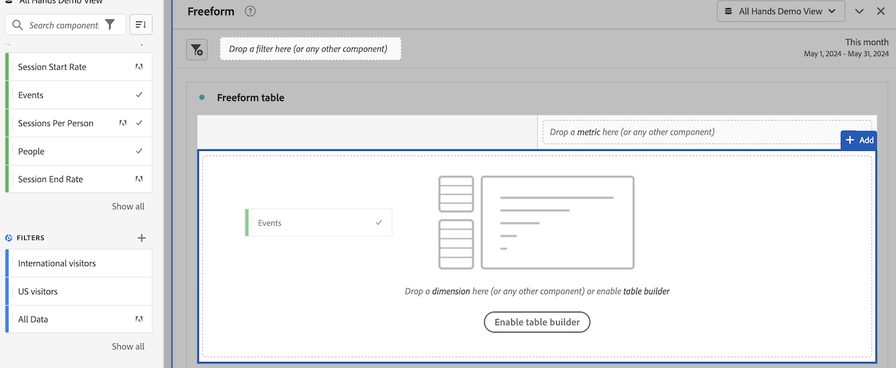

# Komponenten in Analysis Workspace verwenden

Komponenten bilden die tatsächlichen Daten eines Projekts in Analysis Workspace. Komponenten bestehen aus Dimensionen, Metriken, Filtern und Datumsbereichen. Sie können einem Projekt Komponenten hinzufügen, indem Sie sie in Visualisierungen oder Bedienfelder ziehen.

Eine Übersicht über die Komponententypen, die Sie hinzufügen können, finden Sie unter [Komponentenübersicht](/help/components/overview.md).

>[!TIP]
>
>Informationen zu den einzelnen Komponenten erhalten Sie, wenn Sie in der linken Leiste von Analysis Workspace auf das Infosymbol neben dem Namen einer Komponente klicken.

## Hinzufügen von Komponenten zu einem Projekt beginnen

1. [Erstellen eines Projekts in Analysis Workspace](/help/analysis-workspace/build-workspace-project/create-projects.md) wenn Sie es noch nicht getan haben.

1. [Bedienfeld hinzufügen](/help/analysis-workspace/c-panels/panels.md) oder [Visualisierung hinzufügen](/help/analysis-workspace/visualizations/freeform-analysis-visualizations.md#add-visualizations-to-a-panel) zum Projekt in Analysis Workspace.

   Wenn Sie eine Komponente zu einem leeren Projekt hinzufügen, wird automatisch eine Freiformtabellenvisualisierung erstellt.

1. Wählen Sie das Symbol **[!UICONTROL Komponenten]** in der linken Leiste aus.

   

1. Scrollen Sie zu der Komponente, die Sie hinzufügen möchten, oder suchen Sie sie und ziehen Sie sie in ein Bedienfeld oder eine Visualisierung innerhalb Ihres Projekts.

   Sie können beispielsweise einen Filter in die Dropzone des Filters in eine Bedienfeldüberschrift ziehen.

   

1. Weitere Informationen erhalten Sie in den folgenden Abschnitten, je nach Typ der Komponente, die Sie hinzufügen:

   * [Dimensionen zu einem Projekt hinzufügen](#add-dimensions-to-a-project)

   * [Hinzufügen von Metriken zu einem Projekt](#add-metrics-to-a-project)

   * [Filter zu einem Projekt hinzufügen](#add-filters-to-a-project)

   * [Hinzufügen von Datumsbereichen zu einem Projekt](#add-date-ranges-to-a-project)

## Dimensionen zu einem Projekt hinzufügen

[Dimensionen](/help/components/dimensions/overview.md) sind Variablen in Adobe Analytics, die normalerweise Zeichenfolgenwerte enthalten. Im Gegensatz dazu enthalten [Metriken](/help/components/calc-metrics/calc-metr-overview.md) numerische Werte, die mit einer Dimension verknüpft sind. Ein Basisbericht zeigt Zeilen mit Zeichenfolgenwerten (Dimension) gegen eine Spalte mit numerischen Werten (Metrik) an.

1. Beginnen Sie mit dem Hinzufügen einer Dimension zu Ihrem Projekt in Analysis Workspace, wie beschrieben in [Hinzufügen von Komponenten zu einem Projekt beginnen](#begin-adding-components-to-a-project).

1. Wählen Sie eine der folgenden Methoden, um Dimensionen hinzuzufügen und den Datentyp zu bestimmen, den Sie analysieren möchten:

   * Ziehen Sie eine Dimension in eine Visualisierung (z. B. eine Freiformtabelle) in Analysis Workspace.

     

   * Ziehen Sie eine oder mehrere Dimensionen aus der linken Leiste in die Dropzone des Filters, um einen Ad-hoc-Filter zu erstellen, wie unter [Filter zu einem Projekt hinzufügen](#add-filters-to-a-project).

Weitere Informationen zur Verwendung von Dimensionen in Analysis Workspace finden Sie unter [Dimensionen in der Vorschau anzeigen](/help/components/dimensions/view-dimensions.md), [Dimensionen aufschlüsseln](/help/components/dimensions/t-breakdown-fa.md), und [Dimensionen für die Zeitunterteilung](/help/components/dimensions/time-parting-dimensions.md).

## Hinzufügen von Metriken zu einem Projekt

Mit Metriken können Sie Datenpunkte in Analysis Workspace quantifizieren. Sie werden meist als Spalten in einer Visualisierung verwendet und sind an Dimensionen gebunden.

So fügen Sie einem Projekt in Analysis Workspace eine Metrik hinzu:

1. Beginnen Sie mit dem Hinzufügen einer Metrik zu Ihrem Projekt in Analysis Workspace, wie unter [Hinzufügen von Komponenten zu einem Projekt beginnen](#begin-adding-components-to-a-project).

1. Wählen Sie eine der folgenden Methoden, um eine Metrik in Analysis Workspace hinzuzufügen:

   * Ziehen Sie eine Metrik in den Ablagebereich der Metrik in einer leeren Freiformtabelle, um die Trendansicht dieser Metrik über den Datumsbereich des Projekts anzuzeigen.

     

   * Ziehen Sie eine Metrik, wenn eine Dimension vorhanden ist, um diese Metrik mit jedem Dimensionselement zu vergleichen.

   * Ziehen Sie eine Metrik auf eine vorhandene Metrik-Kopfzeile, um sie zu ersetzen.

   * Ziehen Sie eine Metrik neben eine Kopfzeile, um beide Metriken nebeneinander anzuzeigen.

Weitere Informationen zu Metriken finden Sie unter [Übersicht über berechnete Metriken](/help/components/calc-metrics/calc-metr-overview.md).

## Filter zu einem Projekt hinzufügen

[Filter](/help/components/filters/filters-overview.md) ermöglichen es Ihnen, Besucheruntergruppen anhand von Merkmalen oder spezifischen Interaktionen zu identifizieren.

So fügen Sie einem Projekt in Analysis Workspace einen Filter hinzu:

1. Beginnen Sie mit dem Hinzufügen eines Filters zu Ihrem Projekt in Analysis Workspace, wie beschrieben in [Hinzufügen von Komponenten zu einem Projekt beginnen](#begin-adding-components-to-a-project).

1. Wählen Sie eine der folgenden Methoden, um mit dem Filtern Ihres Bedienfelds zu beginnen:

   * Ziehen Sie einen einzelnen Filter aus der linken Leiste in die Dropzone des Filters.

     

   * Halten Sie die Umschalt- oder Strg-Taste gedrückt, um mehrere Filter in der linken Leiste auszuwählen, und halten Sie dann die Umschalt-Taste gedrückt, während Sie sie in der Dropzone des Filters ablegen.

     

     Dadurch wird ein Dropdown-Menü erstellt, über das Benutzer des Bedienfelds den Filter auswählen können, den sie anwenden möchten. Das Dropdown-Menü enthält eine [!UICONTROL **Kein Filter**] -Option, die Benutzer auswählen können, wodurch das Bedienfeld nicht gefiltert bleibt.

     Sie können die Option (x) auswählen, um eine beliebige Option aus dem Dropdown-Menü zu entfernen. Wenn Sie die [!UICONTROL **Kein Filter**] auswählen, ist ein Filter erforderlich.

   * Erstellen Sie Ad-hoc-Filter, indem Sie Nicht-Filter-Komponenten in die Dropzone ziehen. So sparen Sie Zeit und Mühe beim Aufrufen des Filter Builder. Auf diese Weise erstellte Filter werden automatisch als Filter auf Trefferebene definiert. Diese Definition kann geändert werden, indem Sie auf das Informationssymbol (i) neben dem Filter und dann auf das stiftförmige Bearbeitungssymbol klicken und sie in Filter Builder bearbeiten.

     Ad-hoc-Filter sind eine Art Schnellfilter und für das Projekt lokal verfügbar. Sie werden nicht in der linken Leiste angezeigt, es sei denn, Sie machen sie öffentlich.

     Weitere Informationen finden Sie unter [Schnellfilter](/help/components/filters/quick-filters.md).

Weitere Informationen dazu, wie Sie die Filter-Dropzone in einem Bedienfeld zum Filtern Ihres Bedienfelds verwenden können, finden Sie unter [Dropzone](/help/analysis-workspace/c-panels/panels.md#drop-zone) in [Bedienfelder - Übersicht](/help/analysis-workspace/c-panels/panels.md).

## Hinzufügen von Datumsbereichen zu einem Projekt

[Datumsbereiche](/help/components/date-ranges/custom-date-ranges.md) den Berichtszeitrahmen in Analysis Workspace bestimmen und auf einen oder mehrere Bereiche innerhalb eines Projekts angewendet werden können.

Jedes Bedienfeld enthält standardmäßig einen Datumsbereich. Es gibt mehrere Möglichkeiten, einen Datumsbereich für ein Bedienfeld zu aktualisieren. Eine Möglichkeit, einen Datumsbereich für ein Bedienfeld in Analysis Workspace zu aktualisieren, besteht darin, eine Datumsbereichskomponente aus der linken Leiste zu ziehen:

1. Beginnen Sie mit dem Hinzufügen eines Datumsbereichs zu Ihrem Projekt in Analysis Workspace, wie beschrieben in [Hinzufügen von Komponenten zu einem Projekt beginnen](#begin-adding-components-to-a-project).

1. Ziehen Sie einen Datumsbereich aus der linken Leiste in den aktuellen Datumsbereich oben rechts im Bedienfeld.

   

Weitere Informationen zur Verwendung von Kalendern und Datumsbereichen in Analysis Workspace finden Sie unter [Übersicht über Kalender und Datumsbereiche](/help/components/date-ranges/custom-date-ranges.md).
