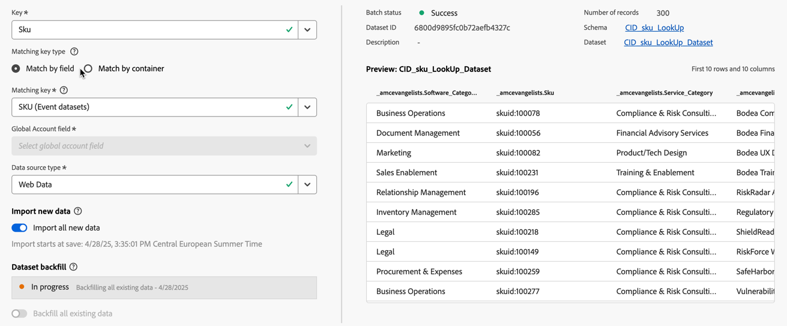

# Erstellen oder Bearbeiten einer Verbindung {#create-or-edit-a-connection}

>[!CONTEXTUALHELP]
>id="cja_connections_recordsadded"
>title="Hinzugefügte Einträge"
>abstract="Die Anzahl der Einträge (Zeilen), die einer Verbindung im für die entsprechenden Datensätze ausgewählten Zeitintervall hinzugefügt wurden."

>[!CONTEXTUALHELP]
>id="cja_connections_recordsskipped"
>title="Übersprungene Einträge"
>abstract="Die Anzahl der Einträge (Zeilen), die bei der Datenübertragung für eine Verbindung im für die entsprechenden Datensätze ausgewählten Zeitintervall übersprungen werden."

>[!CONTEXTUALHELP]
>id="cja_connections_recordsdeleted"
>title="Gelöschte Einträge"
>abstract="Die Anzahl der Einträge (Zeilen), die im ausgewählten Zeitintervall für die ausgewählten Datensätze aus einer Verbindung entfernt wurden."

>[!CONTEXTUALHELP]
>id="cja_connection_lastadded"
>title="Zuletzt hinzugefügt"
>abstract="Zeitstempel des letzten Batches aus einem beliebigen Datensatz, der an eine Verbindung übertragen wurde."

>[!CONTEXTUALHELP]
>id="cja_connection_enablerollingdatawindow"
>title="Rollierendes Datenfenster aktivieren"
>abstract="Definieren Sie die Datenspeicherung als rollierendes Fenster in Monaten auf Verbindungsebene."

>[!CONTEXTUALHELP]
>id="cja_connection_averagenumberofdailyuses"
>title="Durchschnittliche Anzahl der täglichen Nutzung"
>abstract="Wählen Sie einen Bereich für die Anzahl der erwarteten täglichen Ereignisse für die gesamte Verbindung."

>[!CONTEXTUALHELP]
>id="connections_recordsadded"
>title="Hinzugefügte Einträge"
>abstract="Die Anzahl der Einträge (Zeilen), die einer Verbindung im für die entsprechenden Datensätze ausgewählten Zeitintervall hinzugefügt wurden."

>[!CONTEXTUALHELP]
>id="connections_recordsskipped"
>title="Übersprungene Einträge"
>abstract="Die Anzahl der Einträge (Zeilen), die bei der Datenübertragung für eine Verbindung im für die entsprechenden Datensätze ausgewählten Zeitintervall übersprungen werden."

>[!CONTEXTUALHELP]
>id="connections_recordsdeleted"
>title="Gelöschte Einträge"
>abstract="Die Anzahl der Einträge (Zeilen), die im ausgewählten Zeitintervall für die ausgewählten Datensätze aus einer Verbindung entfernt wurden."

>[!CONTEXTUALHELP]
>id="connection_lastadded"
>title="Zuletzt hinzugefügt"
>abstract="Zeitstempel des letzten Batches aus einem beliebigen Datensatz, der an eine Verbindung übertragen wurde."

>[!CONTEXTUALHELP]
>id="connection_enablerollingdatawindow"
>title="Rollierendes Datenfenster aktivieren"
>abstract="Definieren Sie die Datenspeicherung als rollierendes Fenster in Monaten auf Verbindungsebene."

>[!CONTEXTUALHELP]
>id="connection_averagenumberofdailyuses"
>title="Durchschnittliche Anzahl der täglichen Nutzung"
>abstract="Wählen Sie einen Bereich für die Anzahl der erwarteten täglichen Ereignisse für die gesamte Verbindung."

>[!CONTEXTUALHELP]
>id="connection_change_personid"
>title="Änderung der Personen-ID"
>abstract="Durch eine Änderung der Personen-ID werden alle vorhandenen Daten in der Verbindung gelöscht und alle Daten aus dem Datensatz basierend auf der neuen Personen-ID erneut aufgenommen. Diese Aktion kann sich auf die Kosten auswirken. <br/><br/>Wenn Sie **[!UICONTROL Weiter]** wählen, kann es zu einer Verzögerung beim Reporting kommen, bis der Prozess abgeschlossen ist."

>[!CONTEXTUALHELP]
>id="connection_change_accountid"
>title="Änderung der Konto-ID"
>abstract="Durch eine Änderung der Konto-ID werden alle vorhandenen Daten in der Verbindung gelöscht und alle Daten aus dem Datensatz basierend auf der neuen Konto-ID erneut aufgenommen. Diese Aktion kann sich auf die Kosten auswirken. <br/><br/>Wenn Sie **[!UICONTROL Weiter]** wählen, kann es zu einer Verzögerung beim Reporting kommen, bis der Prozess abgeschlossen ist."

>[!CONTEXTUALHELP]
>id="connection_change_globalaccountid"
>title="Änderung der globalen Konto-ID"
>abstract="Durch eine Änderung der globalen Konto-ID werden alle vorhandenen Daten in der Verbindung gelöscht und alle Daten aus dem Datensatz basierend auf der neuen globalen Konto-ID erneut aufgenommen. Diese Aktion kann sich auf die Kosten auswirken. <br/><br/>Wenn Sie **[!UICONTROL Weiter]** wählen, kann es zu einer Verzögerung beim Reporting kommen, bis der Prozess abgeschlossen ist."

>[!CONTEXTUALHELP]
>id="connection_change_opportunityid"
>title="Änderung der Opportunity-ID"
>abstract="Durch eine Änderung der Opportunity-ID werden alle vorhandenen Daten in der Verbindung gelöscht und alle Daten aus dem Datensatz basierend auf der neuen Opportunity-ID erneut aufgenommen. Diese Aktion kann sich auf die Kosten auswirken. <br/><br/>Wenn Sie **[!UICONTROL Weiter]** wählen, kann es zu einer Verzögerung beim Reporting kommen, bis der Prozess abgeschlossen ist."

>[!CONTEXTUALHELP]
>id="connection_change_buyinggroupid"
>title="Änderung der Käufergruppen-ID"
>abstract="Durch eine Änderung der Käufergruppen-ID werden alle vorhandenen Daten in der Verbindung gelöscht und alle Daten aus dem Datensatz basierend auf der neuen Käufergruppen-ID erneut aufgenommen. Diese Aktion kann sich auf die Kosten auswirken. <br/><br/>Wenn Sie **[!UICONTROL Weiter]** wählen, kann es zu einer Verzögerung beim Reporting kommen, bis der Prozess abgeschlossen ist."

>[!CONTEXTUALHELP]
>id="connection_change_persistentid"
>title="Änderung der dauerhaften ID"
>abstract="Durch eine Änderung der dauerhaften ID werden alle vorhandenen Daten in der Verbindung gelöscht und alle Daten aus dem Datensatz basierend auf der neuen dauerhaften ID erneut aufgenommen. Diese Aktion kann sich auf die Kosten auswirken. <br/><br/>Wenn Sie **[!UICONTROL Weiter]** wählen, kann es zu einer Verzögerung beim Reporting kommen, bis der Prozess abgeschlossen ist."


<!-- Start of contextual help entries for CJA connection dialogs -->

>[!CONTEXTUALHELP]
>id="connections_useincja_ajo"
>title="Diese Verbindung in Customer Journey Analytics verwenden"
>abstract="Mit dieser Option können Sie die erweiterten Reporting-Funktionen von Customer Journey Analytics für Ihre Journey Optimizer-Verbindung nutzen. Mit diesen Funktionen können Sie:<ul><li>Führen Sie eine eingehende Analyse der Journey Optimizer-Daten in Customer Journey Analytics durch.</li><li>Bearbeiten Sie die Journey Optimizer-Verbindung und die zugehörigen Datenansichten.</li><li>Analysieren Sie Journey-Ereignisse, Konversationspfade und die Kampagnenleistung.</li></ul>**Wenn diese Option aktiviert ist, wird jede Datenzeile innerhalb der Verbindung monatlich für Ihre Lizenzdatenzeilen für Customer Journey Analytics gezählt und in der Benutzeroberfläche für die Verbindungsverwendung angezeigt.**<br><br/> Erkunden Sie diese Option nur, wenn Sie mit der zusätzlichen Verwendung von Datenzeilen in Customer Journey Analytics vertraut sind. [Weitere Informationen](https://experienceleague.adobe.com/de/docs/analytics-platform/using/integrations/ajo)."

>[!CONTEXTUALHELP]
>id="connections_disableuseincja_ajo"
>title="Diese Verbindung aus Customer Journey Analytics entfernen"
>abstract="Diese Journey Optimizer-Verbindung wird derzeit in Kunden-Journey Analytics verwendet. Die Verbindungen ermöglichen Ihnen Folgendes:<ul><li>Führen Sie eine eingehende Analyse der Journey Optimizer-Daten in Customer Journey Analytics durch.</li><li>Bearbeiten Sie die Journey Optimizer-Verbindung und die zugehörigen Datenansichten.</li><li>Analysieren Sie Journey-Ereignisse, Konversationspfade und die Kampagnenleistung.</li></ul>**Wenn Sie die Verbindung entfernen, ist eine detaillierte Analyse in Customer Journey Analytics nicht mehr möglich. Die Verbindung und alle zugehörigen Datenansichten werden auf ihren Standardstatus zurückgesetzt und können nicht mehr bearbeitet werden.**<br/><br/>**Die Abrechnung für diese Verbindung in Customer Journey Analytics umfasst den vollständigen Monat, in dem die Verbindung entfernt wird.**<br/><br/> Die Verbindung bleibt in Journey Optimizer aktiviert. [Weitere Informationen](https://experienceleague.adobe.com/de/docs/analytics-platform/using/integrations/ajo)."

>[!CONTEXTUALHELP]
>id="connections_useincja_exl_brand_concierge"
>title="Diese Verbindung in Customer Journey Analytics verwenden"
>abstract="Mit dieser Option können Sie die erweiterten Reporting-Funktionen von Customer Journey Analytics mit Ihrer Brand Concierge-Verbindung nutzen. Diese Funktionen ermöglichen Ihnen Folgendes:<ul><li>Führen Sie eine eingehende Analyse der Brand Concierge-Daten in Customer Journey Analytics durch.</li><li>Bearbeiten Sie die Brand Concierge-Verbindung und die zugehörigen Datenansichten.</li><li>Analysieren Sie Metriken zu Konversation, Stimmung und Konversion.</li></ul>**Wenn diese Option aktiviert ist, wird jede Datenzeile innerhalb der Verbindung monatlich für Ihre Lizenzdatenzeilen für Customer Journey Analytics gezählt und in der Benutzeroberfläche für die Verbindungsverwendung angezeigt.**<br><br/> Erkunden Sie diese Option nur, wenn Sie mit der zusätzlichen Verwendung von Datenzeilen in Customer Journey Analytics vertraut sind. [Weitere Informationen](https://experienceleague.adobe.com/de/docs/analytics-platform/using/cja-workspace/templates/use-templates#brand-concierge-templates)."

>[!CONTEXTUALHELP]
>id="connections_disableuseincja_exl_brand_concierge"
>title="Diese Verbindung aus Customer Journey Analytics entfernen"
>abstract="Diese Brand Concierge-Verbindung wird derzeit in Kunden-Journey Analytics verwendet. Die Verbindungen ermöglichen Ihnen Folgendes:<ul><li>Führen Sie eine eingehende Analyse der Brand Concierge-Daten in Customer Journey Analytics durch.</li><li>Bearbeiten Sie die Brand Concierge-Verbindung und die zugehörigen Datenansichten.</li><li>Analysieren Sie Metriken zu Konversation, Stimmung und Konversion.</li></ul>**Wenn Sie die Verbindung entfernen, ist eine detaillierte Analyse in Customer Journey Analytics nicht mehr möglich. Die Verbindung und alle zugehörigen Datenansichten werden auf ihren Standardstatus zurückgesetzt und können nicht mehr bearbeitet werden.**<br/><br/>**Die Abrechnung für diese Verbindung in Customer Journey Analytics umfasst den vollständigen Monat, in dem die Verbindung entfernt wird.**<br/><br/> Die Verbindung bleibt in Journey Optimizer aktiviert. [Weitere Informationen](https://experienceleague.adobe.com/de/docs/analytics-platform/using/cja-workspace/templates/use-templates#brand-concierge-templates)."

>[!CONTEXTUALHELP]
>id="connections_useincja_exl_product_usage"
>title="Diese Verbindung in Customer Journey Analytics verwenden"
>abstract="Mit dieser Option können Sie die erweiterten Reporting-Funktionen von Customer Journey Analytics mit Ihrer Produktnutzungsverbindung nutzen. Diese Funktionen ermöglichen Ihnen Folgendes:<ul><li>Führen Sie eine eingehende Analyse der Produktnutzungsdaten in Customer Journey Analytics durch.</li><li>Bearbeiten Sie die Produktnutzungsverbindung und die zugehörigen Datenansichten.</li></ul>**Wenn diese Option aktiviert ist, wird jede Datenzeile innerhalb der Verbindung monatlich für Ihre Lizenzdatenzeilen für Customer Journey Analytics gezählt und in der Benutzeroberfläche für die Verbindungsverwendung angezeigt.**<br><br/> Erkunden Sie diese Option nur, wenn Sie mit der zusätzlichen Verwendung von Datenzeilen in Customer Journey Analytics vertraut sind. [Weitere Informationen](https://experienceleague.adobe.com/de/docs/analytics-platform/using/tools/product-usage/usage-overview)."

>[!CONTEXTUALHELP]
>id="connections_disableuseincja_exl_product_usage"
>title="Diese Verbindung aus Customer Journey Analytics entfernen"
>abstract="Diese Produktnutzungsverbindung wird derzeit in Customer Journey Analytics verwendet. Die Verbindungen ermöglichen Ihnen Folgendes:<ul><li>Führen Sie eine eingehende Analyse der Produktnutzungsdaten in Customer Journey Analytics durch.</li><li>Bearbeiten Sie die Produktnutzungsverbindung und die zugehörigen Datenansichten.</li></ul>**Wenn Sie die Verbindung entfernen, ist eine detaillierte Analyse in Customer Journey Analytics nicht mehr möglich. Die Verbindung und alle zugehörigen Datenansichten werden auf ihren Standardstatus zurückgesetzt und können nicht mehr bearbeitet werden.**<br/><br/>**Die Abrechnung für diese Verbindung in Customer Journey Analytics umfasst den vollständigen Monat, in dem die Verbindung entfernt wird.**<br/><br/> Die Verbindung bleibt in Journey Optimizer aktiviert. [Weitere Informationen](https://experienceleague.adobe.com/de/docs/analytics-platform/using/tools/product-usage/usage-overview)."

>[!CONTEXTUALHELP]
>id="connections_useincja_legal_section_section"
>title="Rechtliche Implikationen"
>abstract="Die Verwendung von Customer Journey Analytics kann zusätzliche Änderungen auf der Grundlage des Integrationsdatenvolumens zur Folge haben. Siehe [Details zur Abrechnung und Nutzung von Customer Journey Analytics](https://experienceleague.adobe.com/de/docs/analytics-platform/using/cja-connections/manage-connections#connections-usage)"

<!-- End of contextual help entries for CJA connection dialogs -->


Beim Workflow für die Erstellung und Bearbeitung von Verbindungen können alle Einstellungen zur Datensatz- und Verbindungskonfiguration mit einem unterstützenden Workflow zentral auf dem Bildschirm durchgeführt werden. Er ermöglicht Ihnen eine präzise Auswahl, Konfiguration und Prüfung von Datensätzen. Außerdem können Sie wichtige Informationen wie [Datensatztyp](#dataset-types), Größe, Schema, Datensatz-ID, Batch-Status, Aufstockungsstatus, Identitäten und vieles mehr angeben, um das Risiko einer falschen Verbindungskonfiguration zu reduzieren. Im Folgenden finden Sie einen Überblick über die Funktionen:

* Sie können bei der Erstellung der Verbindung ein rollierendes Fenster zur Datenaufbewahrung aktivieren.
* Sie können Datensätze zu einer Verbindung hinzufügen und daraus entfernen. (Wenn Sie einen Datensatz entfernen, wird er aus der Verbindung entfernt und wirkt sich auf alle zugehörigen Datenansichten und zugrunde liegenden Analysis Workspace-Projekte aus.)
* Sie können für einzelne Datensätze Aufstockungsdaten aktivieren und anfordern.
* Sie können Datensätze bearbeiten, z. B. um eine weitere Aufstockung anzufordern.
* Sie können für einzelne Datensätze vorhandene Daten importieren.


>[!BEGINSHADEBOX]

Unter  [Erstellen und Bearbeiten einer Verbindung](https://video.tv.adobe.com/v/3409825/?captions=ger&quality=12&learn=on){target="_blank"} finden Sie ein Demovideo.

>[!ENDSHADEBOX]


## Voraussetzungen

Die maximale Anzahl der Datensätze, die einer Verbindung hinzugefügt werden können, ist auf 100 begrenzt. Die Mischung hängt davon ab, welches Customer Journey Analytics-Paket Ihr Unternehmen erworben hat.

Wenden Sie sich an Ihre Admins, wenn Sie sich nicht sicher sind, welches Customer Journey Analytics-Paket Sie besitzen.

| **&#x200B;**-Paket auswählen | **Stiftungs-**-Paket |
| --- | --- |
| Jede Kombination von Ereignis-, Profil-, Lookup- oder Zusammenfassungsdatensätzen, die bis zu 100 ergibt | Ein Ereignisdatensatz pro Verbindung |
|  | Bis zu 99 Profil-, Lookup- oder Zusammenfassungsdatensätze pro Verbindung |

{style="table-layout:auto"}

## Erstellen einer Verbindung {#create-connection}

So erstellen Sie eine Verbindung:

1. Wählen Sie in Customer Journey Analytics **[!UICONTROL Verbindungen]**, optional unter **[!UICONTROL Datenverwaltung]** im oberen Menü aus.
1. Wählen Sie **[!UICONTROL Neue Verbindung erstellen]** aus.

Sie können jetzt [die Details für Ihre Verbindung bearbeiten](#edit-a-connection).

## Verbindung bearbeiten {#edit-connection}

Wie Sie die Verbindung bearbeiten, hängt vom lizenzierten Customer Journey Analytics-Paket ab:

* [Customer Journey Analytics](#customer-journey-analytics)
* [Customer Journey Analytics B2B Edition](#customer-journey-analytics-b2b-edition)

### Customer Journey Analytics

Im Bildschirm **[!UICONTROL Verbindungen]** > **[!UICONTROL *Name der Verbindung *]**:


1. Konfigurieren Sie die Verbindungseinstellungen.

   | Einstellung | Beschreibung |
   | --- | --- |
   | **[!UICONTROL Name der Verbindung]** | Geben Sie einen eindeutigen Namen für die Verbindung ein. |
   | **[!UICONTROL Beschreibung der Verbindung]** | Beschreiben Sie den Zweck dieser Verbindung. |
   | **[!UICONTROL Tags]** | Geben Sie Tags an, um Ihrer Verbindung Tags hinzuzufügen, damit Sie diese Tags verwenden können, um die Verbindung in einem späteren Schritt zu suchen. |
   | **[!UICONTROL Rollierendes Datenfenster aktivieren]** | Wenn diese Option aktiviert ist, können Sie auf Verbindungsebene die Customer Journey Analytics-Datenspeicherung als rollierendes Fenster in Monaten (z. B. 1 Monat, 3 Monate und 6 Monate) definieren.<p>Die Datenaufbewahrung basiert auf Zeitstempeln für Ereignis-Datensätze und gilt nur für Ereignis-Datensätze. Für Profil- oder Lookup-Datensätze gibt es keine rollierenden Datenfenstereinstellungen, da keine entsprechenden Zeitstempel vorhanden sind. Wenn Ihre Verbindung jedoch Profil- oder Suchdatensätze enthält (neben einem oder mehreren Ereignisdatensätzen), werden diese Daten über denselben Zeitraum gespeichert.<p> Der Hauptvorteil besteht darin, dass Sie nur Daten speichern oder Berichte dazu erstellen, die anwendbar und nützlich sind, und ältere Daten löschen, die nicht mehr nützlich sind. Dies hilft Ihnen, Ihre vertraglichen Beschränkungen einzuhalten und das Risiko bezüglich Kostendeckung zu reduzieren.<p><ul><li>Wenn Sie die Standardeinstellung unverändert (d. h. deaktiviert) lassen, hat die Adobe Experience Platform-Einstellung zur Datenspeicherung Vorrang vor der Aufbewahrungsfrist. Wenn also in Experience Platform Daten von einem Zeitraum von 25 Monaten enthalten sind, erhält Customer Journey Analytics durch Aufstockung Daten von einem Zeitraum von 25 Monaten. Wenn Sie in Experience Platform 10 dieser Monate löschen, werden in Customer Journey Analytics die verbleibenden 15 Monate beibehalten.</li><li>Wenn Sie ein rollierendes Datenfenster aktivieren, geben Sie in **[!UICONTROL Anzahl der Monate auswählen]** die Anzahl der Monate an, für die Sie das rollierende Datenfenster aktivieren. |
   | **[!UICONTROL Sandbox]** | Wählen Sie eine Sandbox in Experience Platform aus, die die Datensätze enthält, für die Sie eine Verbindung erstellen möchten.<p>Adobe Experience Platform bietet [Sandboxes](https://experienceleague.adobe.com/de/docs/experience-platform/sandbox/home) bereit, die eine einzelne Platform-Instanz in separate virtuelle Umgebungen aufteilen, um die Entwicklung und Weiterentwicklung von Programmen für digitale Erlebnisse zu erleichtern. Sie können sich Sandboxes als „Datensilos“ vorstellen. Sandboxes dienen der Steuerung des Zugriffs auf Datensätze.<p>Nachdem Sie die Sandbox ausgewählt haben, werden in der linken Leiste alle Datensätze in der Sandbox angezeigt, aus denen Sie Daten abrufen können. |
   | **[!UICONTROL Hinzufügen von Datensätzen]** | Wählen Sie  **[!UICONTROL Datensätze hinzufügen]** aus, um Datensätze hinzuzufügen. Wenn die Verbindung noch keine Datensätze hat, können Sie auch **[!UICONTROL Datensätze hinzufügen]** in der Datensatztabelle auswählen. |


   Für die von Ihnen konfigurierten Datensätze zeigt die Datensatztabelle die folgenden Spalten:

   | Spalte | Beschreibung |
   |---|---|
   | **[!UICONTROL Datensatzname]** | Wählen Sie einen oder mehrere Datensätze für die Customer Journey Analytics-Übertragung und dann die Option **[!UICONTROL Hinzufügen]** aus.<p>(Wenn Sie viele Datensätze zur Auswahl haben, können Sie mithilfe der Suchleiste „Datensätze suchen“ über der Liste der Datensätze nach den richtigen suchen.) |
   |  | Wählen Sie  aus, um ein Kontextmenü für den ausgewählten Datensatz zu öffnen. Je nach (Typ des) Datensatzes können Sie Folgendes auswählen:<ul><li>  **[!UICONTROL Datensatz löschen]**, um [einen Datensatz zu löschen](#delete-a-dataset).</li><li> **[!UICONTROL Datensatz bearbeiten]**, um [einen Datensatz zu bearbeiten](#edit-a-dataset).</li><li> **[!UICONTROL Frühere Aufstockungen]** zum Anzeigen [früherer Aufstockungen für den Datensatz](#past-backfills). |
   | **[!UICONTROL Zuletzt aktualisiert]** | Nur für Ereignis-Datensätze wird diese Einstellung automatisch auf das Standard-Zeitstempelfeld von Ereignis-basierten Schemas in Experience Platform gesetzt. „K. A.“ bedeutet, dass dieser Datensatz keine Daten enthält. |
   | **[!UICONTROL Anzahl der Einträge]** | Die Gesamtzahl der Einträge im Vormonat für den Datensatz in Experience Platform. |
   | **[!UICONTROL Schema]** | Das [Schema](https://experienceleague.adobe.com/de/docs/experience-platform/xdm/schema/composition), auf dessen Grundlage der Datensatz in Adobe Experience Platform erstellt wurde. |
   | **[!UICONTROL Typ des Datensatzes]** | Customer Journey Analytics legt für jeden Datensatz, den Sie dieser Verbindung hinzugefügt haben, automatisch den [Datensatztyp](#dataset-types) anhand der eingehenden Daten fest. Es gibt 3 verschiedene Datensatztypen: Ereignis-, Profil- und Such-Daten. Eine Erläuterung der Datensatztypen finden Sie in der unten stehenden Tabelle. |
   | **[!UICONTROL Granularität]** | Die Granularität der Daten im Datensatz; gilt nur für Zusammenfassungsdatensätze. |
   | **[!UICONTROL Datenquellentyp]** | Der Datenquellentyp des Datensatzes. Gilt nicht für Zusammenfassungsdatensätze. |
   | **[!UICONTROL Personen-ID]** | Die Personen-ID, die zur Unterstützung des personenbasierten Reportings für den Datensatz verwendet wird. |
   | **[!UICONTROL Schlüssel]** | Der Schlüssel, der für einen Such-Datensatz verwendet wird. |
   | **[!UICONTROL Übereinstimmender Schlüssel]** | Der übereinstimmende Schlüssel, der für einen Such-Datensatz verwendet wird. |
   | **[!UICONTROL Importieren neuer Daten]** | Der Status des Imports neuer Daten für den Datensatz: <p>   **[!UICONTROL _x _Ein]**, wenn der Datensatz für den Import neuer Daten konfiguriert ist,<p>   **[!UICONTROL _x Aus_]**, wenn der Datensatz so konfiguriert ist, dass keine neuen Daten importiert werden. |
   | **[!UICONTROL Aufstockungsdaten]** | Der Status der Aufstockungsdaten für den Datensatz.<p>   **[!UICONTROL _x _Aufstockungen fehlgeschlagen]**&#x200B;für die Anzahl der fehlgeschlagenen Aufstockungen,<p>   **[!UICONTROL _x _Aufstockungen werden verarbeitet]**&#x200B;für die Anzahl der verarbeiteten Aufstockungen,<p>   **[!UICONTROL _x _Aufstockungen abgeschlossen]**&#x200B;für die Anzahl der abgeschlossenen Aufstockungen,<p>   **[!UICONTROL _Aus_]**, falls keine Aufstockungen konfiguriert sind. |

   Sie können über das Suchfeld  nach einem bestimmten Datensatz suchen.

### Customer Journey Analytics B2B Edition

[!BADGE B2B Edition]{type=Informative url="https://experienceleague.adobe.com/de/docs/analytics-platform/using/cja-overview/cja-b2b/cja-b2b-edition" newtab=true tooltip="Customer Journey Analytics B2B Edition"}

Im Bildschirm **[!UICONTROL Verbindungen]** > **[!UICONTROL *Name der Verbindung *]**:


1. Konfigurieren Sie die Verbindungseinstellungen.

   | Einstellung | Beschreibung |
   | --- | --- |
   | **[!UICONTROL Name der Verbindung]** | Geben Sie einen eindeutigen Namen für die Verbindung ein. |
   | **[!UICONTROL Beschreibung der Verbindung]** | Beschreiben Sie den Zweck dieser Verbindung. |
   | **[!UICONTROL Tags]** | Geben Sie Tags an, um Ihrer Verbindung Tags hinzuzufügen, damit Sie diese Tags verwenden können, um die Verbindung in einem späteren Schritt zu suchen. |
   | **[!UICONTROL Primäre ID]** | Wählen Sie die richtige primäre ID für Ihre Verbindung aus: <ul><li> **[!UICONTROL Person]** für eine personenbasierte Verbindung, die Sie normalerweise in einem B2C-Szenario verwenden.</li><li>  **[!UICONTROL Account]** für eine Account-basierte Verbindung, die Sie normalerweise in einem B2B-Szenario verwenden.</li></ul>Sobald Sie Ihrer Verbindung einen oder mehrere Datensätze hinzufügen, können Sie die primäre ID nicht mehr ändern. <br/>Die Auswahl der primären ID legt fest, ob die Verbindung personenbasiert oder kontobasiert ist. Die Verbindungsbasis bestimmt die verfügbaren [Einstellungen](#dataset-settings) für bestimmte Typen von Datensätzen. |
   | **[!UICONTROL Optionale Container]** | Wenn Sie &quot;&quot; **[!UICONTROL Konto]** als **[!UICONTROL Primäre ID]** ausgewählt haben, wählen Sie zusätzliche Container aus.<ul><li>**[!UICONTROL Globales Konto]**: ermöglicht die Konfiguration globaler Konten in einer Verbindung.</li><li>**[!UICONTROL Opportunity]**: ermöglicht die Konfiguration von Opportunities in einer Verbindung.</li><li>**[!UICONTROL Käufergruppe]**: ermöglicht die Konfiguration von Käufergruppen in einer Verbindung.</li><ul> |
   | **[!UICONTROL Sandbox]** | Wählen Sie eine Sandbox in Experience Platform aus, die die Datensätze enthält, zu denen Sie eine Verbindung herstellen möchten.<p>Adobe Experience Platform bietet [Sandboxes](https://experienceleague.adobe.com/de/docs/experience-platform/sandbox/home) bereit, die eine einzelne Platform-Instanz in separate virtuelle Umgebungen aufteilen, um die Entwicklung und Weiterentwicklung von Programmen für digitale Erlebnisse zu erleichtern. Sie können sich Sandboxes als „Datensilos“ vorstellen. Sandboxes dienen der Steuerung des Zugriffs auf Datensätze.<p>Nachdem Sie die Sandbox ausgewählt haben, werden in der linken Leiste alle Datensätze in der Sandbox angezeigt, aus denen Sie Daten abrufen können. |
   | **[!UICONTROL Rollierendes Datenfenster aktivieren]** | Wenn diese Option aktiviert ist, können Sie auf Verbindungsebene die Customer Journey Analytics-Datenspeicherung als rollierendes Fenster in Monaten (z. B. 1 Monat, 3 Monate und 6 Monate) definieren.<p>Die Datenaufbewahrung basiert auf Zeitstempeln für Ereignis-Datensätze und gilt nur für Ereignis-Datensätze. Für Profil- oder Lookup-Datensätze gibt es keine rollierenden Datenfenstereinstellungen, da keine entsprechenden Zeitstempel vorhanden sind. Wenn Ihre Verbindung jedoch Profil- oder Suchdatensätze enthält (neben einem oder mehreren Ereignisdatensätzen), werden diese Daten über denselben Zeitraum gespeichert.<p> Der Hauptvorteil besteht darin, dass Sie nur Daten speichern oder Berichte dazu erstellen, die anwendbar und nützlich sind, und ältere Daten löschen, die nicht mehr nützlich sind. Dies hilft Ihnen, Ihre vertraglichen Beschränkungen einzuhalten und das Risiko bezüglich Kostendeckung zu reduzieren.<p><ul><li>Wenn Sie die Standardeinstellung unverändert (d. h. deaktiviert) lassen, hat die Adobe Experience Platform-Einstellung zur Datenspeicherung Vorrang vor der Aufbewahrungsfrist. Wenn also in Experience Platform Daten von einem Zeitraum von 25 Monaten enthalten sind, erhält Customer Journey Analytics durch Aufstockung Daten von einem Zeitraum von 25 Monaten. Wenn Sie in Platform 10 dieser Monate löschen, werden in Customer Journey Analytics die verbleibenden 15 Monate beibehalten.</li><li>Wenn Sie ein rollierendes Datenfenster aktivieren, geben Sie in **[!UICONTROL Anzahl der Monate auswählen]** die Anzahl der Monate an, für die Sie das rollierende Datenfenster aktivieren. |
   | **[!UICONTROL Hinzufügen von Datensätzen]** | Wählen Sie  **[!UICONTROL Datensätze hinzufügen]** aus, um [Datensätze hinzuzufügen](#add-datasets). Wenn die Verbindung noch keine Datensätze hat, können Sie auch **[!UICONTROL Datensätze hinzufügen]** in der Datensatztabelle auswählen. |


   Für die von Ihnen konfigurierten Datensätze zeigt die Datensatztabelle die folgenden Spalten:

   | Spalte | Beschreibung |
   |---|---|
   | **[!UICONTROL Datensatzname]** | Wählen Sie einen oder mehrere Datensätze für die Customer Journey Analytics-Übertragung und dann die Option **[!UICONTROL Hinzufügen]** aus.<p>(Wenn Sie viele Datensätze zur Auswahl haben, können Sie mithilfe der Suchleiste „Datensätze suchen“ über der Liste der Datensätze nach den richtigen suchen.) |
   |  | Wählen Sie  aus, um ein Kontextmenü für den ausgewählten Datensatz zu öffnen. Je nach (Typ des) Datensatzes können Sie Folgendes auswählen:<ul><li>  **[!UICONTROL Datensatz löschen]**, um [einen Datensatz zu löschen](#delete-a-dataset).</li><li> **[!UICONTROL Datensatz bearbeiten]**, um [einen Datensatz zu bearbeiten](#edit-a-dataset).</li><li> **[!UICONTROL Frühere Aufstockungen]** zum Anzeigen [früherer Aufstockungen für den Datensatz](#past-backfills). |
   | **[!UICONTROL Zuletzt aktualisiert]** | Nur für Ereignis-Datensätze wird diese Einstellung automatisch auf das Standard-Zeitstempelfeld von Ereignis-basierten Schemas in Experience Platform gesetzt. „K. A.“ bedeutet, dass dieser Datensatz keine Daten enthält. |
   | **[!UICONTROL Anzahl der Einträge]** | Die Gesamtzahl der Einträge im Vormonat für den Datensatz in Experience Platform. |
   | **[!UICONTROL Schema]** | Das [Schema](https://experienceleague.adobe.com/de/docs/experience-platform/xdm/schema/composition), auf dessen Grundlage der Datensatz in Adobe Experience Platform erstellt wurde. |
   | **[!UICONTROL Typ des Datensatzes]** | Customer Journey Analytics legt für jeden Datensatz, den Sie dieser Verbindung hinzugefügt haben, automatisch den [Datensatztyp](#dataset-types) anhand der eingehenden Daten fest. |
   | **[!UICONTROL Granularität]** | Die Granularität der Daten im Datensatz; gilt nur für Zusammenfassungsdatensätze. |
   | **[!UICONTROL Datenquellentyp]** | Der Datenquellentyp des Datensatzes. Gilt nicht für Zusammenfassungsdatensätze. |
   | **[!UICONTROL Konto-ID]** | (Nur für kontobasierte Verbindungen angezeigt) Die Konto-ID, die zur Unterstützung des kontobasierten Reportings für den Datensatz verwendet wird. |
   | **[!UICONTROL Globale Konto-ID]** | (Nur für kontobasierte Verbindungen angezeigt) Die globale Konto-ID, die zur Unterstützung des kontobasierten Reportings für den Datensatz verwendet wird. |
   | **[!UICONTROL Einkaufsgruppen-ID]** | (Nur für kontobasierte Verbindungen angezeigt) Die Einkaufsgruppen-ID, die zum Nachschlagen von Einkaufsgruppendaten verwendet wird. |
   | **[!UICONTROL Opportunity-ID]** | (Nur für kontobasierte Verbindungen angezeigt) Die Opportunity-ID, die zum Nachschlagen von Opportunity-Daten verwendet wird. |
   | **[!UICONTROL Personen-ID]** | Die Personen-ID, die zur Unterstützung des personenbasierten Reportings für den Datensatz verwendet wird. |
   | **[!UICONTROL Schlüssel]** | Der Schlüssel, der für einen Such-Datensatz verwendet wird. |
   | **[!UICONTROL Übereinstimmender Schlüssel]** | Der übereinstimmende Schlüssel, der für einen Such-Datensatz verwendet wird. |
   | **[!UICONTROL Importieren neuer Daten]** | Der Status des Imports neuer Daten für den Datensatz: <p>   **[!UICONTROL _x _Ein]**, wenn der Datensatz für den Import neuer Daten konfiguriert ist,<p>   **[!UICONTROL _x Aus_]**, wenn der Datensatz so konfiguriert ist, dass keine neuen Daten importiert werden. |
   | **[!UICONTROL Aufstockungsdaten]** | Der Status der Aufstockungsdaten für den Datensatz.<p>   **[!UICONTROL _x _Aufstockungen fehlgeschlagen]**&#x200B;für die Anzahl der fehlgeschlagenen Aufstockungen,<p>   **[!UICONTROL _x _Aufstockungen werden verarbeitet]**&#x200B;für die Anzahl der verarbeiteten Aufstockungen,<p>   **[!UICONTROL _x _Aufstockungen abgeschlossen]**&#x200B;für die Anzahl der abgeschlossenen Aufstockungen,<p>   **[!UICONTROL _Aus_]**, falls keine Aufstockungen konfiguriert sind. |

   Sie können über das Suchfeld  nach einem bestimmten Datensatz suchen.

## Datensätze {#datasets}

Sie [einen oder mehrere Datensätze hinzufügen](#add-datasets) oder [vorhandene Datensätze bearbeiten](#edit-a-dataset) als Teil des Verbindungs-Workflows.

>[!NOTE]
>
>Werte vor 1900 für Datums- und Datums-/Uhrzeitfelder in einer Zeile in einem beliebigen Datensatztyp werden durch den Wert ersetzt, der vor der Aufnahme der Zeile `null` wird.<br/>Zeilen in einem Ereignis- oder Zusammenfassungsdatensatz mit einem Zeitstempelwert vor dem Jahr 1900 werden bei der Aufnahme entfernt.


{{relational-model-based}}


>[!CONTEXTUALHELP]
>id="cja_connection_primaryid"
>title="Primäre ID "
>abstract="Wählen Sie die richtige primäre ID für Ihre Verbindung aus: „Person“ für ein B2C-Szenario. „Konto“ für ein B2B-Szenario."

>[!CONTEXTUALHELP]
>id="cja_connection_optionalcontainers"
>title="Optionale Container"
>abstract="Wählen Sie weitere Container aus.<br/><br/>**[!UICONTROL Globales Konto &#x200B;]**: ermöglicht die Konfiguration globaler Konten in einer Verbindung.<br/>**[!UICONTROL Opportunity]**: ermöglicht die Konfiguration von Opportunities in einer Verbindung.<br/>**[!UICONTROL Käufergruppe &#x200B;]**: ermöglicht die Konfiguration von Käufergruppen in einer Verbindung."

>[!CONTEXTUALHELP]
>id="cja_connection_accountid"
>title="Konto-ID"
>abstract="Wählen Sie eine Konto-ID (die eindeutige Kennung für ein Konto) aus den verfügbaren Identitäten aus, die im Datensatzschema in Experience Platform definiert sind."

>[!CONTEXTUALHELP]
>id="cja_connection_accountfield"
>title="Kontofeld"
>abstract="Wählen Sie ein Feld aus, das die Konto-ID (die eindeutige Kennung für ein Konto) darstellt."

>[!CONTEXTUALHELP]
>id="cja_connection_globalaccountid"
>title="ID des globalen Kontos"
>abstract="Wählen Sie eine ID des globalen Kontos (die eindeutige Kennung für ein globales Konto) aus den verfügbaren Identitäten aus, die Sie im Datensatzschema in Experience Platform definiert haben."

>[!CONTEXTUALHELP]
>id="cja_connection_opportunityid"
>title="Opportunity-ID"
>abstract="Wählen Sie eine Opportunity-ID (die eindeutige Kennung für eine Opportunity) aus den verfügbaren Identitäten aus, die Sie im Datensatzschema in Experience Platform definiert haben."

>[!CONTEXTUALHELP]
>id="cja_connection_buyinggroupid"
>title="Käufergruppen-ID"
>abstract="Wählen Sie eine Käufergruppen-ID (die eindeutige Kennung für eine Käufergruppe) aus den verfügbaren Identitäten aus, die Sie im Datensatzschema in Experience Platform definiert haben."

>[!CONTEXTUALHELP]
>id="cja_connection_personid"
>title="Personen-ID"
>abstract="Wählen Sie eine Personen-ID (die eindeutige Kennung für eine Person) aus den verfügbaren Identitäten aus, die Sie im Datensatzschema in Experience Platform definiert haben."

>[!CONTEXTUALHELP]
>id="cja_connection_matchingkey"
>title="Passender Schlüssel"
>abstract="Wählen Sie ein Feld aus, das mit einem der Ereignisdatensätze verbunden werden soll. Wenn diese Liste leer ist, haben Sie wahrscheinlich keinen Ereignisdatensatz hinzugefügt oder konfiguriert."

>[!CONTEXTUALHELP]
>id="cja_connection_importnewdata"
>title="Neue Daten importieren"
>abstract="Alle neuen Batches, die im Experience Platform-Datensatz hinzugefügt werden, werden automatisch zu dieser Verbindung hinzugefügt und zur Analyse bereitgestellt."

>[!CONTEXTUALHELP]
>id="cja_connection_datasetbackfill"
>title="Aufstockung des Datensatzes"
>abstract="Mit dieser Option werden die vorhandenen (historischen) Daten von Experience Platform für diesen Datensatz in der Verbindung aufgestockt."

>[!CONTEXTUALHELP]
>id="cja_connection_transformdataset"
>title="Datensatz transformieren"
>abstract="Mit dieser Option wird der Datensatz transformiert, sodass er für personenbasierte Suchen in B2B-Szenarien verwendet werden kann. Nach der Aktivierung ist die Transformation des Datensatzes unumkehrbar."

>[!CONTEXTUALHELP]
>id="cja_connection_connectionmap"
>title="Verbindungszuordnung"
>abstract="Die Verbindungszuordnung visualisiert die Beziehungen zwischen Ereignis-, Personen-, Konto- und relevanten Lookup-Datensätzen (wie Opportunites, Kampagnenmitgliedern und mehr)."

>[!CONTEXTUALHELP]
>id="connection_primaryid"
>title="Primäre ID "
>abstract="Wählen Sie die richtige primäre ID für Ihre Verbindung aus: „Person“ für ein B2C-Szenario. „Konto“ für ein B2B-Szenario."

>[!CONTEXTUALHELP]
>id="connection_optionalcontainers"
>title="Optionale Container"
>abstract="Wählen Sie weitere Container aus.<br/><br/>**[!UICONTROL Globales Konto &#x200B;]**: ermöglicht die Konfiguration globaler Konten in einer Verbindung.<br/>**[!UICONTROL Opportunity]**: ermöglicht die Konfiguration von Opportunities in einer Verbindung.<br/>**[!UICONTROL Käufergruppe &#x200B;]**: ermöglicht die Konfiguration von Käufergruppen in einer Verbindung."

>[!CONTEXTUALHELP]
>id="connection_personid"
>title="Personen-ID"
>abstract="Wählen Sie eine Personen-ID aus den verfügbaren Identitäten aus, die im Datensatzschema in Experience Platform definiert sind."

>[!CONTEXTUALHELP]
>id="connection_accountid"
>title="Konto-ID"
>abstract="Wählen Sie eine Konto-ID (die eindeutige Kennung für ein Konto) aus den verfügbaren Identitäten aus, die im Datensatzschema in Experience Platform definiert sind."

>[!CONTEXTUALHELP]
>id="connection_accountfield"
>title="Kontofeld"
>abstract="Wählen Sie ein Feld aus, das die Konto-ID (die eindeutige Kennung für ein Konto) darstellt."

>[!CONTEXTUALHELP]
>id="connection_globalaccountid"
>title="ID des globalen Kontos"
>abstract="Wählen Sie eine ID des globalen Kontos (die eindeutige Kennung für ein globales Konto) aus den verfügbaren Identitäten aus, die Sie im Datensatzschema in Experience Platform definiert haben."

>[!CONTEXTUALHELP]
>id="connection_opportunityid"
>title="Opportunity-ID"
>abstract="Wählen Sie eine Opportunity-ID (die eindeutige Kennung für eine Opportunity) aus den verfügbaren Identitäten aus, die Sie im Datensatzschema in Experience Platform definiert haben."

>[!CONTEXTUALHELP]
>id="connection_buyinggroupid"
>title="Käufergruppen-ID"
>abstract="Wählen Sie eine Käufergruppen-ID (die eindeutige Kennung für eine Käufergruppe) aus den verfügbaren Identitäten aus, die Sie im Datensatzschema in Experience Platform definiert haben."

>[!CONTEXTUALHELP]
>id="connection_matchingkey"
>title="Passender Schlüssel"
>abstract="Wählen Sie ein Feld aus, das mit einem der Ereignisdatensätze verbunden werden soll. Wenn diese Liste leer ist, haben Sie wahrscheinlich keinen Ereignisdatensatz hinzugefügt oder konfiguriert."

>[!CONTEXTUALHELP]
>id="connection_matchingkeytype"
>title="Passender Schlüsseltyp"
>abstract="Legen Sie fest, wie der Join erfolgen soll: basierend auf einer Übereinstimmung nach Feld oder einer Übereinstimmung nach Container.<br/><br/>**[!UICONTROL Übereinstimmung nach Feld &#x200B;]**: Wählen Sie ein Feld aus, nach dem in einem der Ereignisdatensätze verknüpft werden soll. Wenn diese Liste leer ist, haben Sie wahrscheinlich keinen Ereignisdatensatz hinzugefügt oder konfiguriert.<br/>**[!UICONTROL Übereinstimmung nach Container]**: Wählen Sie einen Container aus, der für die Verknüpfung mit einem der Ereignis-Datensätze verwendet werden soll. "

>[!CONTEXTUALHELP]
>id="connection_importnewdata"
>title="Neue Daten importieren"
>abstract="Alle neuen Batches, die im Experience Platform-Datensatz hinzugefügt werden, werden automatisch zu dieser Verbindung hinzugefügt und zur Analyse bereitgestellt."

>[!CONTEXTUALHELP]
>id="connection_datasetbackfill"
>title="Aufstockung des Datensatzes"
>abstract="Mit dieser Option werden die vorhandenen (historischen) Daten von Experience Platform für diesen Datensatz in der Verbindung aufgestockt."

>[!CONTEXTUALHELP]
>id="connection_transformdataset"
>title="Datensatz transformieren"
>abstract="Mit dieser Option wird der Datensatz transformiert, sodass er für personenbasierte Suchen in B2B-Szenarien verwendet werden kann. Nach der Aktivierung ist die Transformation des Datensatzes unumkehrbar."

>[!CONTEXTUALHELP]
>id="connection_connectionmap"
>title="Verbindungszuordnung"
>abstract="Die Verbindungszuordnung visualisiert die Beziehungen zwischen Ereignis-, Personen-, Konto- und relevanten Lookup-Datensätzen (wie Opportunites, Kampagnenmitgliedern und mehr)."

>[!CONTEXTUALHELP]
>id="connection_stitching_enable"
>title="Aktivieren der Identitätszuordnung"
>abstract="Aktivieren Sie die Identitätszuordnung, um diesen Ereignisdatensatz für die kanalübergreifende Analyse hochzustufen."
>additional-url="https://experienceleague.adobe.com/de/docs/analytics-platform/using/stitching/overview" text="Überblick über die Zuordnung"

>[!CONTEXTUALHELP]
>id="connection_stitching_dialog"
>title="Aktivieren der Identitätszuordnung"
>abstract="Bei der Aktivierung der Identitätszuordnung wird eine zugeordnete ID von einem einzelnen oder von mehreren Datensätzen abgeleitet. Dieser Vorgang kann die Zusammenführung von Benutzerdaten aus authentifizierten und nicht authentifizierten Sitzungen umfassen.<br/><br/>Sie sind dafür verantwortlich, geltende Gesetze und Vorschriften einzuhalten. Zu dieser Einhaltung gehört, dass Sie vor der Zusammenführung von Datensätzen die erforderlichen Endbenutzerberechtigungen einholen."
>additional-url="https://experienceleague.adobe.com/de/docs/analytics-platform/using/stitching/overview" text="Überblick über die Zuordnung"

>[!CONTEXTUALHELP]
>id="connection_persistentid"
>title="Dauerhafte ID"
>abstract="Wählen Sie eine dauerhafte ID aus den verfügbaren Identitäten aus. Eine dauerhafte ID ist eine Kennung, die für alle Ereignisse im Ereignisdatensatz verfügbar ist."
>additional-url="https://experienceleague.adobe.com/de/docs/analytics-platform/using/stitching/overview" text="Überblick über die Zuordnung"

>[!CONTEXTUALHELP]
>id="connection_lookbackwindow"
>title="Lookback-Fenster"
>abstract="Wählen Sie den entsprechenden Zeitraum für das Lookback-Fenster aus, das beim Wiederholen der Zuordnung verwendet werden soll."
>additional-url="https://experienceleague.adobe.com/de/docs/analytics-platform/using/stitching/overview" text="Überblick über die Zuordnung"

>[!CONTEXTUALHELP]
>id="connection_namespace_map"
>title="Namespace-Identitätszuordnung"
>abstract="Wählen Sie den Namespace aus, der zur Auswahl der Kennung aus der Identitätszuordnung verwendet werden soll."
>additional-url="https://experienceleague.adobe.com/de/docs/analytics-platform/using/stitching/overview" text="Überblick über die Zuordnung"

>[!CONTEXTUALHELP]
>id="connection_namespace_graph"
>title="Namespace-Identitätsdiagramm"
>abstract="Wählen Sie den Namespace aus, der zur Aktualisierung der Kennung im Identitätsdiagramm verwendet werden soll."
>additional-url="https://experienceleague.adobe.com/de/docs/analytics-platform/using/stitching/overview" text="Überblick über die Zuordnung"

>[!CONTEXTUALHELP]
>id="connection_changeto_identitygraph"
>title="Änderung am Identitätsdiagramm"
>abstract="Stellen Sie sicher, dass Sie die Einrichtung des Identitätsdiagramms abgeschlossen haben, bevor Sie das Identitätsdiagramm für die Zuordnung verwenden."

### Datensatztypen {#dataset-types}

[!UICONTROL Customer Journey Analytics] legt für jeden Datensatz, den Sie dieser Verbindung hinzufügen, automatisch den Datensatztyp anhand der eingehenden Daten fest.

>[!IMPORTANT]
>
>Fügen Sie mindestens einen Ereignis- oder Zusammenfassungsdatensatz (Standard oder vom Typ Ad-hoc oder relational) zu Ihrer Verbindung hinzu.

Es gibt verschiedene Datensatztypen: [!UICONTROL Ereignis] Daten, [!UICONTROL Profil] Daten, [!UICONTROL Lookup] Daten und [!UICONTROL Zusammenfassung] Daten, die jeweils auf dem entsprechenden XDM-basierten Schema basieren.

| Typ des Datensatzes | Beschreibung | Zeitstempel | Schema | Personen-ID <br/> Konto-ID [!BADGE B2B Edition]{type=Informative url="https://experienceleague.adobe.com/de/docs/analytics-platform/using/cja-overview/cja-b2b/cja-b2b-edition" newtab=true tooltip="Customer Journey Analytics B2B Edition"} |
|---|---|---|---|---|
| **[!UICONTROL Ereignis]** | Daten, die Ereignisse im Laufe der Zeit darstellen. Beispiele hierfür sind Web-Besuche, Interaktionen, Transaktionen, PoS-Daten, Umfragedaten, Ad-Impression-Daten usw. Diese Daten können etwa typische Clickstream-Daten mit einer Kunden- oder Cookie-ID und einem Zeitstempel sein. Bei Ereignisdaten können Sie entscheiden, welche ID als Personen-ID verwendet wird. | Festgelegt auf das standardmäßige Zeitstempelfeld von ereignisbasierten Schemata in [!UICONTROL Experience Platform]. | Jedes integrierte oder benutzerdefinierte Schema, das auf einer XDM-Klasse mit dem Verhalten *Zeitreihe* basiert. Beispiele sind *XDM Experience Event* oder *XDM Decision Event*. | Sie können auswählen, welche Personen-ID oder Konto-ID [!BADGE B2B edition]{type=Informative url="https://experienceleague.adobe.com/de/docs/analytics-platform/using/cja-overview/cja-b2b/cja-b2b-edition" newtab=true tooltip="Customer Journey Analytics B2B Edition"} Sie einbeziehen möchten. Für jedes in Experience Platform definierte Datensatzschema kann ein eigener Satz von einer oder mehreren Identitäten definiert und mit einem Identity-Namespace verknüpft werden. Jede dieser Identitäten kann als Personen-ID oder Konto-ID [!BADGE B2B edition verwendet &#x200B;]{type=Informative url="https://experienceleague.adobe.com/de/docs/analytics-platform/using/cja-overview/cja-b2b/cja-b2b-edition" newtab=true tooltip="Customer Journey Analytics B2B Edition"}. Beispiele sind Cookie-ID, zugeordnete ID, Benutzer-ID, Trackingcode, Konto-ID [!BADGE B2B edition]{type=Informative url="https://experienceleague.adobe.com/de/docs/analytics-platform/using/cja-overview/cja-b2b/cja-b2b-edition" newtab=true tooltip="Customer Journey Analytics B2B Edition"} usw. |
| **[!UICONTROL Suche]** | Sie können Datensätze als Suchvorgänge von Feldern in allen Datensatztypen hinzufügen: Profil-, Lookup- und Ereignisdatensätze. (Letztere wurden immer unterstützt.) Diese zusätzliche Funktion erweitert die Fähigkeit von Customer Journey Analytics, komplexe Datenmodelle, einschließlich B2B, zu unterstützen. Diese Daten werden verwendet, um nach Werten oder Schlüsseln in Ihren Ereignis-, Profil- oder Suchdaten zu suchen. Sie können bis zu zwei Ebenen von Suchvorgängen hinzufügen. (Beachten Sie Folgendes: [Abgeleitete Felder](/help/data-views/derived-fields/derived-fields.md) können nicht als übereinstimmende Schlüssel für die Suche in Verbindungen verwendet werden.) Beispielsweise können Sie Suchdaten hochladen, die numerische IDs in Ihren Ereignisdaten Produktnamen zuordnen. Sehen Sie sich hierfür das [B2B-Beispiel](/help/use-cases/b2b/example.md) an. | k. A. | Jedes integrierte oder benutzerdefinierte Schema, das auf einer XDM-Klasse mit dem Verhalten *Record* basiert, mit Ausnahme der Klasse *XDM Individual Profile*. | -/- |
| **[!UICONTROL Profil]** | Daten, die auf Ihr Konto, Personen, Benutzende oder Kundinnen bzw. Kunden in den [!UICONTROL Ereignisdaten] angewendet werden. Sie können beispielsweise CRM-Daten zu Ihren Kunden hochladen. | -/- | Jedes integrierte oder benutzerdefinierte Schema, das auf der Klasse *XDM Individual Profile* basiert. | Sie können auswählen, welche Personen-ID/Konto-ID [!BADGE B2B edition]{type=Informative url="https://experienceleague.adobe.com/de/docs/analytics-platform/using/cja-overview/cja-b2b/cja-b2b-edition" newtab=true tooltip="Customer Journey Analytics B2B Edition"} Sie einbeziehen möchten. Jeder Datensatz (ausgenommen Zusammenfassungsdatensätze), der in [!DNL Experience Platform] definiert ist, verfügt über einen eigenen Satz von einer oder mehreren definierten Personen-IDs oder Konto-IDs [!BADGE B2B Edition]{type=Informative url="https://experienceleague.adobe.com/de/docs/analytics-platform/using/cja-overview/cja-b2b/cja-b2b-edition" newtab=true tooltip="Customer Journey Analytics B2B Edition"}. Beispielsweise Cookie-ID, zugeordnete ID, Benutzer-ID, Trackingcode, Konto-ID usw.<br>**Hinweis**: Wenn Sie eine Verbindung erstellen, die Datensätze mit unterschiedlichen IDs enthält, spiegelt sich dies im Reporting wider. Zum Zusammenführen von Datensätzen müssen Sie dieselbe Personen-ID oder Konto-ID [!BADGE B2B Edition]{type=Informative url="https://experienceleague.adobe.com/de/docs/analytics-platform/using/cja-overview/cja-b2b/cja-b2b-edition" newtab=true tooltip="Customer Journey Analytics B2B Edition"} verwenden. |
| **Zusammenfassung** | Zeitreihendaten, die keiner einzelnen Personen-ID zugeordnet sind. Zusammenfassungsdaten stellen aggregierte Daten auf einer anderen Aggregationsebene dar, z. B. Kampagnen. Sie können diese Daten im Customer Journey Analytics verwenden, um verschiedene Anwendungsfälle zu unterstützen. Weitere Informationen finden Sie [Zusammenfassungsdaten](/help/data-views/summary-data.md). | Automatisches Festlegen auf das standardmäßige Zeitstempelfeld aus ereignisbasierten Zusammenfassungsmetrikschemata in Experience Platform. Es wird nur die Granularität „Stündlich“ oder „Täglich“ unterstützt. | Jedes integrierte oder benutzerdefinierte Schema, das auf der Klasse *XDM Summary Metrics* basiert. | k. A. |

Alternativ können die oben aufgeführten Datensatztypen auf einem Ad-hoc- oder relationalen Schema anstelle eines generischen XDM-basierten Schemas basieren.

| Typ des Datensatzes | Beschreibung | Zeitstempel | Schema | Personen-ID |
|---|---|---|---|---|
| **[!UICONTROL Ad hoc]** | Ad-hoc-Daten basierend auf einem [Ad-hoc](https://experienceleague.adobe.com/de/docs/experience-platform/xdm/api/ad-hoc)Schema mit Feldern, die sich in einem Namespace befinden und nur von einem einzigen Datensatz verwendet werden. | Je nach dem Datensatztyp, den Sie für den Ad-hoc-Datensatz auswählen. | Jedes Ad-hoc-Schema, das auf einer Klasse basiert, die auf dem Ad-hoc *Verhalten* | Je nach dem Datensatztyp, den Sie für den Ad-hoc-Datensatz auswählen. |
| **[!UICONTROL Modell]** | Relationale Daten basierend auf einem relationalen Schema. | Abhängig vom Datensatztyp, den Sie für den relationalen Datensatz auswählen. | Ein beliebiges relationales Schema. | Abhängig vom Datensatztyp, den Sie für den relationalen Datensatz auswählen. |


### Hinzufügen von Datensätzen

Sie können beim Erstellen oder Bearbeiten einer Verbindung einen oder mehrere Experience Platform-Datensätze hinzufügen.


1. Wählen Sie **[!UICONTROL Verbindung]** > **[!UICONTROL _Name der Verbindung_]** Schnittstelle **[!UICONTROL Datensätze hinzufügen]**.

1. Im ➊ Schritt **[!UICONTROL Datensätze auswählen]** wird eine Liste der Experience Platform-Datensätze angezeigt.

   

   Für jeden Datensatz zeigt die Liste Folgendes an:

   | Spalte | Beschreibung |
   |---|---|
   | **[!UICONTROL Datensatz]** | Der Name des Datensatzes. Wählen Sie den Namen aus, um zum Datensatz in Experience Platform weitergeleitet zu werden. Wählen Sie  aus, um ein Popup-Fenster mit weiteren Details zum Datensatz anzuzeigen. Sie können **[!UICONTROL In Platform bearbeiten]** auswählen, um den Datensatz direkt in Experience Platform zu bearbeiten. |
   | **[!UICONTROL Typ des Datensatzes]** | Der Typ des Datensatzes: [Ereignis](#event-dataset), [Profil](#profile-dataset), [Suche](#lookup-dataset), [Zusammenfassung](#summary-dataset), [Adhoc](#ad-hoc-dataset) oder [relationale](#relational-dataset). |
   | **[!UICONTROL Anzahl der Einträge]** | Die Gesamtzahl der Einträge im Vormonat für den Datensatz in Experience Platform. |
   | **[!UICONTROL Schema]** | Das Schema für den Datensatz. Wählen Sie den Namen aus, um zum Schema in Experience Platform weitergeleitet zu werden. |
   | **[!UICONTROL Letzter Batch]** | Der Status des letzten Batches, der in Experience Platform aufgenommen wurde. Weitere Informationen finden Sie unter [Batch-Status](https://experienceleague.adobe.com/de/docs/experience-platform/ingestion/batch/troubleshooting#batch-states). |
   | **[!UICONTROL Datensatz-ID]** | Die ID des Datensatzes. |
   | **[!UICONTROL Zuletzt aktualisiert]** | Der Zeitstempel für die letzte Aktualisierung des Datensatzes. |

   * Um die für die Liste der Datensätze angezeigten Spalten zu ändern, wählen Sie  aus und wählen Sie die Spalten aus, die im Dialogfeld [!UICONTROL Tabelle anpassen] angezeigt werden sollen.
   * Um nach einem bestimmten Datensatz zu suchen, verwenden Sie das .
   * Um die ausgewählten Datensätze ein- oder auszublenden, wählen Sie , **[!UICONTROL Ausgewählte ausblenden]** oder **[!UICONTROL Ausgewählte anzeigen]** aus.
   * Um einen Datensatz aus der Liste der ausgewählten Datensätze zu entfernen, verwenden Sie . Um alle ausgewählten Datensätze zu entfernen, wählen Sie **[!UICONTROL Alle löschen]**.
   * Um Details zu einem Datensatz anzuzeigen, wählen Sie  aus.


1. Wählen Sie einen oder mehrere Datensätze und anschließend **[!UICONTROL Weiter]** aus. Mindestens ein Ereignis- oder Zusammenfassungsdatensatz muss Teil der Verbindung sein.

1. Konfigurieren Sie [Einstellungen für jeden der ausgewählten Datensätze](#dataset-settings) einzeln im Schritt ➋&#x200B;**[!UICONTROL Datensatzeinstellungen]** des Dialogfelds **[!UICONTROL Datensätze hinzufügen]**.

   

1. Wählen Sie **[!UICONTROL Datensätze hinzufügen]** aus, um die konfigurierten Datensätze zur Verbindung hinzuzufügen. Sie werden benachrichtigt, wenn Sie nicht alle erforderlichen Einstellungen für jeden Datensatz angegeben haben, den Sie hinzufügen möchten.

   Alternativ können Sie auf **[!UICONTROL Abbrechen]** klicken, um das Hinzufügen von Datensätzen zur Verbindung abzubrechen. Oder wählen Sie **[!UICONTROL Zurück]** aus, um zum Schritt ➊Auswählen **[!UICONTROL Datensätzen]** zurückzukehren.


### Bearbeiten eines Datensatzes

Um einen Datensatz zu bearbeiten, der bereits für eine Verbindung konfiguriert ist, gehen Sie in der Schnittstelle **[!UICONTROL Verbindungen]** > **[!UICONTROL _Name_]** Verbindung folgendermaßen vor:

1. Wählen Sie  für den Datensatz aus, der in der Datensatztabelle aufgeführt ist, die Sie bearbeiten möchten
1. Wählen Sie  **[!UICONTROL Datensatz bearbeiten]** aus.

1. Konfigurieren Sie [Datensatzeinstellungen](#dataset-settings) im Dialogfeld **[!UICONTROL Datensatz bearbeiten: _Datensatzname_]**.

   

   >[!NOTE]
   >
   >Sie können den **[!UICONTROL Datensatztyp]**, die **[!UICONTROL Personen-ID]**, den **[!UICONTROL Identity-Namespace]** und **[!UICONTROL Zeitstempel]** nicht für einen [Ad-hoc](#ad-hoc-dataset) oder einen [relationalen](#relational-dataset) Datensatz bearbeiten, der Teil einer gespeicherten Verbindung ist. So ändern Sie eine dieser Einstellungen:
   >
   >1. Löschen Sie den vorhandenen Ad-hoc- oder relationalen Datensatz aus der Verbindung.
   >1. Fügen Sie der Verbindung denselben Datensatz mit aktualisierten Einstellungen hinzu.
   >

1. Wählen **[!UICONTROL Anwenden]**, um die Datensatzeinstellungen anzuwenden. Wählen Sie zum Abbrechen **[!UICONTROL Abbrechen]** aus.


### Datensatzeinstellungen

Wenn Sie Datensätze hinzufügen oder einen vorhandenen Datensatz bearbeiten, konfigurieren Sie die Datensatzeinstellungen für jeden Datensatz. Die verfügbaren Einstellungen hängen vom [Typ des Datensatzes](#dataset-types) und bei einigen Datensatztypen vom Verbindungstyp (personenbasiert oder [!BADGE B2B edition]{type=Informative url="https://experienceleague.adobe.com/de/docs/analytics-platform/using/cja-overview/cja-b2b/cja-b2b-edition" newtab=true tooltip="Customer Journey Analytics B2B Edition"} kontobasiert) ab.

Alle Datensätze und Datensatztypen verfügen über [allgemeine Einstellungen und Details](#general-dataset-settings-and-details) z. B. ob neue Daten importiert und Aufstockungen angefordert werden sollen oder nicht.

#### Ereignisdatensatz

Die spezifischen Einstellungen für einen Ereignis-Datensatz hängen vom Verbindungstyp ab.

##### Personenbasierte Verbindung


Für einen Ereignis-Datensatz in einer personenbasierten Verbindung können Sie Folgendes angeben:

| Einstellung | Beschreibung |
| --- | --- |
| **[!UICONTROL Personen-ID]** | Wählen Sie eine Personen-ID aus dem Dropdown-Menü der verfügbaren Identitäten aus. Diese Identitäten wurden im Datensatzschema in Experience Platform definiert. Unter [Verwenden von Identity Map als Personen-ID](#id-map) finden Sie Informationen zur Verwendung von Identity Map als Personen-ID.<p>Wenn keine Personen-IDs zur Auswahl stehen, bedeutet dies, dass keine Personen-IDs im Schema definiert sind. Weitere Informationen finden Sie unter [Definieren von Identitätsfeldern in der Benutzeroberfläche](https://experienceleague.adobe.com/de/docs/experience-platform/xdm/ui/fields/identity). <p>Beim Wert für die ausgewählte Personen-ID wird zwischen Groß- und Kleinschreibung unterschieden. Beispielsweise sind `abc123` und `ABC123` zwei verschiedene Werte.<p>Wenn ein Datensatz keinen Wert für die Identität enthält, die Sie als Personen-ID für den Ereignis-Datensatz ausgewählt haben, wird der Datensatz übersprungen. |
| **[!UICONTROL Zeitstempel]** | Diese Einstellung wird in Experience Platform automatisch auf das standardmäßige Zeitstempelfeld von ereignisbasierten Schemata festgelegt. |
| **[!UICONTROL Datenquellentyp]** | Wählen Sie einen Datenquellentyp aus. Zu den Datenquelltypen gehören: <ul><li>[!UICONTROL Web-Daten]</li><li>[!UICONTROL App-Daten]</li><li>[!UICONTROL PoS-Daten]</li><li>[!UICONTROL CRM-Daten]</li><li>[!UICONTROL Umfragedaten]</li><li>[!UICONTROL Callcenter-Daten]</li><li>[!UICONTROL Produktdaten]</li><li> [!UICONTROL Kontodaten]</li><li> [!UICONTROL Transaktionsdaten]</li><li>[!UICONTROL Kunden-Feedback-Daten]</li><li> [!UICONTROL Sonstige]</li></ul>Dieses Feld wird verwendet, um sich einen Überblick über die verwendeten Datenquellen zu verschaffen. |
| **[!UICONTROL Beschreibung der Datenquelle]** | Eine Beschreibung der Datenquelle, wenn Sie Sonstige als Datenquellentyp ausgewählt haben. |


##### Kontobasierte Verbindung

[!BADGE B2B Edition]{type=Informative url="https://experienceleague.adobe.com/de/docs/analytics-platform/using/cja-overview/cja-b2b/cja-b2b-edition" newtab=true tooltip="Customer Journey Analytics B2B Edition"}

Für einen Ereignis-Datensatz in einer kontobasierten Verbindung können Sie Folgendes angeben:


| Einstellung | Beschreibung |
| --- | --- |
| **[!UICONTROL Globale Konto-ID]** | Wählen Sie eine globale Konto-ID (die eindeutige Kennung für ein Konto) aus den verfügbaren Identitäten aus, die im Datensatzschema in der Experience Platform definiert sind. Trifft zu, wenn Sie Ihrer Verbindung ein globales Konto als Container hinzugefügt haben. <p>Wenn ein Datensatz keinen Wert für die Identität enthält, die Sie als Konto-ID für den Ereignis-Datensatz ausgewählt haben, wird der Datensatz übersprungen. |
| **[!UICONTROL Konto-ID]** | Wählen Sie eine Konto-ID (die eindeutige Kennung für ein Konto) aus den verfügbaren Identitäten aus, die im Datensatzschema in der Experience Platform definiert sind. Gilt, wenn Sie Ihrer Verbindung kein globales Konto als Container hinzugefügt haben. |
| **[!UICONTROL Opportunity-ID]** | Wählen Sie eine Opportunity-ID (die eindeutige Kennung für eine Opportunity) aus den verfügbaren Identitäten aus, die im Datensatzschema in der Experience Platform definiert sind. |
| **[!UICONTROL Einkaufsgruppen-ID]** | Wählen Sie eine Einkaufsgruppen-ID (die eindeutige Kennung für eine Einkaufsgruppe) aus den verfügbaren Identitäten aus, die im Datensatzschema in der Experience Platform definiert sind. |
| **[!UICONTROL Personen-ID]** | Wählen Sie eine Personen-ID aus dem Dropdown-Menü der verfügbaren Identitäten aus. Diese Identitäten wurden im Datensatzschema in Experience Platform definiert. Unter [Verwenden von Identity Map als Personen-ID](#id-map) finden Sie Informationen zur Verwendung von Identity Map als Personen-ID.<p>Wenn keine Personen-IDs zur Auswahl stehen, bedeutet das, dass eine oder mehrere Personen-IDs im Schema nicht definiert wurden. Weitere Informationen finden Sie unter [Definieren von Identitätsfeldern in der Benutzeroberfläche](https://experienceleague.adobe.com/de/docs/experience-platform/xdm/ui/fields/identity). <p>Beim Wert für die ausgewählte Personen-ID wird zwischen Groß- und Kleinschreibung unterschieden. Beispielsweise sind `abc123` und `ABC123` zwei verschiedene Werte. |
| **[!UICONTROL Zeitstempel]** | Diese Einstellung wird in Experience Platform automatisch auf das standardmäßige Zeitstempelfeld von ereignisbasierten Schemata festgelegt. |
| **[!UICONTROL Datenquellentyp]** | Wählen Sie einen Datenquellentyp aus. Zu den Datenquelltypen gehören: <ul><li>[!UICONTROL Web-Daten]</li><li>[!UICONTROL App-Daten]</li><li>[!UICONTROL PoS-Daten]</li><li>[!UICONTROL CRM-Daten]</li><li>[!UICONTROL Umfragedaten]</li><li>[!UICONTROL Callcenter-Daten]</li><li>[!UICONTROL Produktdaten]</li><li> [!UICONTROL Kontodaten]</li><li> [!UICONTROL Transaktionsdaten]</li><li>[!UICONTROL Kunden-Feedback-Daten]</li><li> [!UICONTROL Sonstige]</li></ul>Dieses Feld wird verwendet, um sich einen Überblick über die verwendeten Datenquellen zu verschaffen. |
| **[!UICONTROL Beschreibung der Datenquelle]** | Eine Beschreibung der Datenquelle, wenn Sie Sonstige als Datenquellentyp ausgewählt haben. |

#### Profildatensatz

Die spezifischen Einstellungen für einen Profildatensatz hängen vom Verbindungstyp ab.

##### Personenbasierte Verbindung


Für einen Profildatensatz in einer personenbasierten Verbindung geben Sie Folgendes an:

| Einstellung | Beschreibung |
| --- | --- |
| **[!UICONTROL Personen-ID]** | Wählen Sie eine Personen-ID aus dem Dropdown-Menü der verfügbaren Identitäten aus. Diese Identitäten wurden im Datensatzschema in Experience Platform definiert. Unter [Verwenden von Identity Map als Personen-ID](#id-map) finden Sie Informationen zur Verwendung von Identity Map als Personen-ID.<p>Wenn keine Personen-IDs zur Auswahl stehen, werden im Schema keine Personen-IDs definiert. Weitere Informationen finden Sie unter [Definieren von Identitätsfeldern in der Benutzeroberfläche](https://experienceleague.adobe.com/de/docs/experience-platform/xdm/ui/fields/identity). <p>Beim Wert für die ausgewählte Personen-ID wird zwischen Groß- und Kleinschreibung unterschieden. Beispielsweise sind `abc123` und `ABC123` zwei verschiedene Werte. <p>Wenn ein Datensatz keinen Wert für die Identität enthält, die Sie als Personen-ID für den Profildatensatz ausgewählt haben, wird der Datensatz übersprungen. |
| **[!UICONTROL Datenquellentyp]** | Wählen Sie einen Datenquellentyp aus. Zu den Datenquelltypen gehören: <ul><li>[!UICONTROL Web-Daten]</li><li>[!UICONTROL App-Daten]</li><li>[!UICONTROL PoS-Daten]</li><li>[!UICONTROL CRM-Daten]</li><li>[!UICONTROL Umfragedaten]</li><li>[!UICONTROL Callcenter-Daten]</li><li>[!UICONTROL Produktdaten]</li><li> [!UICONTROL Kontodaten]</li><li> [!UICONTROL Transaktionsdaten]</li><li>[!UICONTROL Kunden-Feedback-Daten]</li><li> [!UICONTROL Sonstige]</li></ul>Dieses Feld wird verwendet, um sich einen Überblick über die verwendeten Datenquellen zu verschaffen. |
| **[!UICONTROL Beschreibung der Datenquelle]** | Eine Beschreibung der Datenquelle, wenn Sie Sonstige als Datenquellentyp ausgewählt haben. |

#### Kontobasierte Verbindung


Für einen Profildatensatz in einer kontobasierten Verbindung geben Sie Folgendes an:

| Einstellung | Beschreibung |
| --- | --- |
| **[!UICONTROL Personen-ID]** | Wählen Sie eine Personen-ID aus dem Dropdown-Menü der verfügbaren Identitäten aus. Diese Identitäten wurden im Datensatzschema in Experience Platform definiert. Unter [Verwenden von Identity Map als Personen-ID](#id-map) finden Sie Informationen zur Verwendung von Identity Map als Personen-ID.<p>Wenn keine Personen-IDs zur Auswahl stehen, werden im Schema keine Personen-IDs definiert. Weitere Informationen finden Sie unter [Definieren von Identitätsfeldern in der Benutzeroberfläche](https://experienceleague.adobe.com/de/docs/experience-platform/xdm/ui/fields/identity). <p>Beim Wert für die ausgewählte Personen-ID wird zwischen Groß- und Kleinschreibung unterschieden. Beispielsweise sind `abc123` und `ABC123` zwei verschiedene Werte. <p>Wenn ein Datensatz keinen Wert für die Identität enthält, die Sie als Personen-ID für den Profildatensatz ausgewählt haben, wird der Datensatz übersprungen. |
| **[!UICONTROL Feld Globales Konto]** | Wählen Sie aus dem Dropdown-Menü der verfügbaren Identitäten ein globales Kontofeld aus, um kontobasiertes Reporting für den Datensatz zu unterstützen. Trifft zu, wenn Sie Ihrer Verbindung ein globales Konto als Container hinzugefügt haben. |
| **[!UICONTROL Feld Konto]** | Wählen Sie aus dem Dropdown-Menü der verfügbaren Identitäten ein Kontofeld aus, um kontobasiertes Reporting für den Datensatz zu unterstützen. Gilt, wenn Sie Ihrer Verbindung kein globales Konto als Container hinzugefügt haben. |
| **[!UICONTROL Datenquellentyp]** | Wählen Sie einen Datenquellentyp aus. Zu den Datenquelltypen gehören: <ul><li>[!UICONTROL Web-Daten]</li><li>[!UICONTROL App-Daten]</li><li>[!UICONTROL PoS-Daten]</li><li>[!UICONTROL CRM-Daten]</li><li>[!UICONTROL Umfragedaten]</li><li>[!UICONTROL Callcenter-Daten]</li><li>[!UICONTROL Produktdaten]</li><li> [!UICONTROL Kontodaten]</li><li> [!UICONTROL Transaktionsdaten]</li><li>[!UICONTROL Kunden-Feedback-Daten]</li><li> [!UICONTROL Sonstige]</li></ul>Dieses Feld wird verwendet, um sich einen Überblick über die verwendeten Datenquellen zu verschaffen. |
| **[!UICONTROL Beschreibung der Datenquelle]** | Eine Beschreibung der Datenquelle, wenn Sie Sonstige als Datenquellentyp ausgewählt haben. |

#### Lookup-Datensatz

Die spezifischen Einstellungen für einen Lookup-Datensatz hängen vom Verbindungstyp ab.

##### Personenbasierte Verbindung


Für einen Lookup-Datensatz in einer personenbasierten Verbindung geben Sie Folgendes an:

| Einstellungen | Beschreibung |
|---|---|
| **[!UICONTROL Schlüssel]** | Der für einen Lookup-Datensatz zu verwendende Schlüssel. <p>Wenn ein Datensatz keinen Wert für den Schlüssel enthält, den Sie für den Such-Datensatz ausgewählt haben, wird der Datensatz übersprungen. |
| **[!UICONTROL Passender Schlüssel]** | Der passende Schlüssel, nach dem in einem der Ereignisdatensätze verknüpft werden soll. Wenn diese Liste leer ist, haben Sie wahrscheinlich keinen Ereignisdatensatz hinzugefügt oder konfiguriert. |
| **[!UICONTROL Datenquellentyp]** | Wählen Sie einen Datenquellentyp aus. Zu den Datenquelltypen gehören: <ul><li>[!UICONTROL Web-Daten]</li><li>[!UICONTROL App-Daten]</li><li>[!UICONTROL PoS-Daten]</li><li>[!UICONTROL CRM-Daten]</li><li>[!UICONTROL Umfragedaten]</li><li>[!UICONTROL Callcenter-Daten]</li><li>[!UICONTROL Produktdaten]</li><li> [!UICONTROL Kontodaten]</li><li> [!UICONTROL Transaktionsdaten]</li><li>[!UICONTROL Kunden-Feedback-Daten]</li><li> [!UICONTROL Sonstige]</li></ul>Dieses Feld wird verwendet, um sich einen Überblick über die verwendeten Datenquellen zu verschaffen. |
| **[!UICONTROL Beschreibung der Datenquelle]** | Eine Beschreibung der Datenquelle, wenn Sie Sonstige als Datenquellentyp ausgewählt haben. |
| **[!UICONTROL Datensatz transformieren]** | Für bestimmte B2B-Lookup-Datensätze können Sie die Umwandlung eines Datensatzes für geeignete personenbasierte B2B-Reporting-Szenarien aktivieren. Weitere Informationen finden Sie unter [Umwandeln von Datensätzen für B2B-Suchen](transform-datasets-b2b-lookups.md). |


##### Kontobasierte Verbindung

[!BADGE B2B Edition]{type=Informative url="https://experienceleague.adobe.com/de/docs/analytics-platform/using/cja-overview/cja-b2b/cja-b2b-edition" newtab=true tooltip="Customer Journey Analytics B2B Edition"}


Für einen Lookup-Datensatz in einer kontobasierten Verbindung können Sie Folgendes angeben:

| Einstellungen | Beschreibung |
|---|---|
| **[!UICONTROL Schlüssel]** | Der für einen Lookup-Datensatz zu verwendende Schlüssel. <p>Wenn ein Datensatz keinen Wert für den Schlüssel enthält, den Sie für den Such-Datensatz ausgewählt haben, wird der Datensatz übersprungen. |
| **[!UICONTROL Übereinstimmender Schlüsseltyp]** | Wählen Sie aus, wie die Datensätze verbunden werden sollen: basierend auf **[!UICONTROL Übereinstimmung nach Feld]** oder **[!UICONTROL Übereinstimmung nach Container]**. Weitere Informationen finden Sie unter [Übereinstimmung nach des Felds](/help/getting-started/cja-b2b-concepts-features.md#match-by-container-or-field). |
| **[!UICONTROL Passender Schlüssel]** | Der passende Schlüssel, nach dem in einem der Ereignisdatensätze verknüpft werden soll. Wenn diese Liste leer ist, haben Sie wahrscheinlich keinen Ereignisdatensatz hinzugefügt oder konfiguriert. <br/><br/>Wählen Sie je nach ausgewähltem **[!UICONTROL übereinstimmender Schlüsseltyp]** den entsprechenden Wert aus:<ul><li>**[!UICONTROL Übereinstimmung nach Feld]**: <br/>Wählen Sie ein Feld aus dem Dropdown-Menü **[!UICONTROL Übereinstimmender Schlüssel]** aus, um es mit einem der Ereignisdatensätze zu verbinden. Wenn diese Liste leer ist, haben Sie wahrscheinlich keinen Ereignisdatensatz hinzugefügt oder konfiguriert.</li><li>**[!UICONTROL Übereinstimmung nach Container]**: <br/>Wählen Sie einen Container aus dem Dropdown-Menü **[!UICONTROL Übereinstimmungsschlüssel]** aus, der zum Verbinden mit einem der Ereignisdatensätze verwendet werden soll. Die Container, die Sie beim Einrichten der Verbindung einbezogen haben, bestimmen die verfügbaren Container, die ausgewählt werden sollen.</li></ul> |
| **[!UICONTROL Feld Globales Konto]** | Die globale Konto-ID, die für das kontobasierte Reporting verwendet werden soll. |


#### Zusammenfassungsdatensatz

Die spezifischen Einstellungen für einen zusammenfassenden Datensatz sind:

| Einstellung | Beschreibung |
|---|---|
| **[!UICONTROL Zeitstempel]** | Diese Einstellung wird in Experience Platform automatisch auf das standardmäßige Zeitstempelfeld von ereignisbasierten Schemata festgelegt. |
| **[!UICONTROL Zeitzone]** | Wählen Sie die entsprechende Zeitzone für die Zeitreihen-Zusammenfassungsdaten aus. |
| **[!UICONTROL Granularität]** | Stellt den Zeitrahmen dar, der zum Aggregieren von Zusammenfassungsdaten nach Stunde oder Tag verwendet wird, aktuell entweder nach Stunde oder nach Tag. Von den Daten im Datensatz abgeleitet. |


#### Ad-hoc-Datensatz

>[!NOTE]
>
>Obwohl es möglich ist, zu konfigurieren und auszuwählen, sollten Sie aus Leistungsgründen vermeiden, einen Ad-hoc-Datensatz für Zeitreihendaten (Ereignis-, Zusammenfassungsdaten) zu verwenden. Relationale oder generische XDM-basierte Datensätze eignen sich viel besser für Zeitreihendaten als Ad-hoc-Datensätze.

Die spezifischen Einstellungen für einen Ad-hoc-Datensatz sind:

| Einstellung | Ausgewählter Datensatztyp | Beschreibung |
|---|---|---|
| **[!UICONTROL Typ des Datensatzes]** | k. A. | Der Datentyp im Ad-hoc-Datensatz. Mögliche Werte sind: **[!UICONTROL Ereignis]**, **[!UICONTROL Profil]**, **[!UICONTROL Suche]** und **[!UICONTROL Zusammenfassung]**. |
| **[!UICONTROL Personen-ID]** | Ereignis, Profil | Wählen Sie ein Feld aus dem Ad-hoc- oder relationalen Schema aus, das die Personen-ID darstellt. Dieses Feld kann ein beliebiges Feld im Datensatz sein. Wählen Sie aus **[!UICONTROL Identity-Namespace]** Feldern oder aus **[!UICONTROL Nicht-Identitätsfeldern]**. <br/>Sie können eine Kennung nur dann aus **[!UICONTROL Identity-Namespace]** auswählen, wenn mindestens ein Feld im Ad-hoc-Schema als Identität gekennzeichnet ist und einen Identity-Namespace hat. |
| **[!UICONTROL Identity-Namespace]** | Ereignis | Wählen Sie einen Identity-Namespace aus, falls Sie eine Personen-ID aus Feldern **[!UICONTROL Nicht-Identität]** ausgewählt haben. |
| **[!UICONTROL Zeitstempel]** | Ereignis, Zusammenfassung | Wählen Sie ein Feld aus dem Ad-hoc-Schema aus, das das Zeitstempelfeld darstellt. Dieses Feld kann eines der verfügbaren Felder vom Typ `DateTime` sein. |
| **[!UICONTROL Schlüssel]** | Lookup | Der für einen Lookup-Datensatz zu verwendende Schlüssel.<br/>Wenn ein Datensatz keinen Wert für den Schlüssel enthält, den Sie für den Such-Datensatz ausgewählt haben, wird der Datensatz übersprungen. |
| **[!UICONTROL Passender Schlüssel]** | Lookup | Der übereinstimmende Schlüssel, der einem der Ereignis- oder Lookup-Datensätze hinzugefügt werden soll. Wenn diese Liste leer ist, haben Sie wahrscheinlich keinen Ereignis- oder Lookup-Datensatz hinzugefügt oder konfiguriert. |


#### Relationaler Datensatz

>[!NOTE]
>
>Relationale Datensätze werden hauptsächlich zur Unterstützung der bevorstehenden Experience Platform Data Mirror for Customer Journey Analytics-Funktionen verwendet.
>

Die spezifischen Einstellungen für einen relationalen Datensatz sind:

| Einstellung | Ausgewählter Datensatztyp | Beschreibung |
|---|---|---|
| **[!UICONTROL Typ des Datensatzes]** | k. A. | Der Datentyp im relationalen Datensatz.<br/>Wenn der Datensatz Zeitreihendaten enthält, sind die möglichen Werte: **[!UICONTROL Ereignis]** und **[!UICONTROL Zusammenfassung]**. <br/>Wenn der Datensatz Datensatzdaten enthält, lauten die möglichen Werte: **[!UICONTROL Profile]** und **[!UICONTROL Lookup]**. |
| **[!UICONTROL Personen-ID]** | Ereignis, Profil | Wählen Sie ein Feld aus dem relationalen Schema aus, das die Personen-ID darstellt. Die Auswahl ist auf die Liste der Felder im relationalen Schema beschränkt, die als Identität markiert sind und keinen Identity-Namespace haben. |
| **[!UICONTROL Zeitstempel]** | Ereignis, Zusammenfassung | Das Feld, das als Zeitstempeldeskriptor im Schema definiert ist. Dieses Feld wird automatisch ausgefüllt. |
| **[!UICONTROL Schlüssel]** | Lookup | Der für einen Lookup-Datensatz zu verwendende Schlüssel.<br/>Wenn ein Datensatz keinen Wert für den Schlüssel enthält, den Sie für den Such-Datensatz ausgewählt haben, wird der Datensatz übersprungen. |
| **[!UICONTROL Passender Schlüssel]** | Lookup | Der passende Schlüssel, nach dem in einem der Ereignisdatensätze verknüpft werden soll. Wenn diese Liste leer ist, haben Sie wahrscheinlich keinen Ereignis- oder Lookup-Datensatz hinzugefügt oder konfiguriert. |


#### Allgemeine Datensatzeinstellungen und -details

Jeder (Typ von Datensatz) hat die folgenden allgemeinen Einstellungen:

{{common-dataset-settings}}


### Erneutes Aufnehmen von Daten

Manchmal ist es erforderlich, Daten aus einem oder mehreren Datensätzen erneut in eine Verbindung aufzunehmen. Für Ad-hoc- oder relationale Datensätze müssen Sie [löschen und dann den Datensatz erneut hinzufügen](#edit-a-dataset). Für andere Datensätze können Sie die Einstellungen aktualisieren. Gehen Sie dazu wie folgt vor:

1. Für den Datensatz, für den Sie Daten erneut aufnehmen möchten:

   1. Ändern Sie Folgendes:

      * Eine Kennung (Personen-ID, Konto-ID oder andere ID) für einen bereits erfassten Ereignisdatensatz.
      * Ein Schlüssel, ein übereinstimmender Schlüssel oder ein übereinstimmender Schlüsseltyp (Feld oder Container) für ein bereits aufgenommenes Profil oder einen Suchdatensatz.

      Alternativ können Sie die Aufstockung **[!UICONTROL vorhandenen Daten]** Datensatz umschalten.

   1. **[!UICONTROL Übernehmen]** der Änderungen für den Datensatz.


1. **[!UICONTROL Speichern]** der Verbindung. Daten werden für die jeweiligen Datensätze erneut aufgenommen.


### Datensatz löschen

Wenn Sie einen Datensatz löschen, werden Sie über die Auswirkungen des Löschens informiert. Das Löschen eines Datensatzes kann sich auf alle zugehörigen Verbindungen, Datenansichten und Projekte auswirken. Wenn Sie nicht das einzige Ereignis- oder Zusammenfassungsdatensatz in Ihrer Verbindung löschen, werden Sie aufgefordert, ein weiteres Ereignis- oder Zusammenfassungsdatensatz hinzuzufügen. Sie können nur eine Verbindung speichern, die mindestens einen Ereignis- oder Zusammenfassungsdatensatz enthält.


### Frühere Aufstockungen

Wenn Sie in der Benutzeroberfläche  **[!UICONTROL Frühere Aufstockungen]** auswählen, zeigt ein Dialogfeld **[!UICONTROL Frühere Aufstockungen: _Name des Datensatzes_]**&#x200B;die neuesten Aufstockungen aus dem Datensatz an.


## Verbindungsvorschau {#preview}

Um die von Ihnen erstellte Verbindung in einer Vorschau anzuzeigen, wählen Sie im Dialogfeld „Verbindungseinstellungen“  **[!UICONTROL Verbindungsvorschau]** aus.


Diese Vorschau enthält einige Spalten zur Verbindungskonfiguration. Welche Spaltentypen angezeigt werden, hängt von Ihren individuellen Datensätzen ab.


## Verbindungszuordnung

Um eine Zuordnung der Beziehungen zwischen den Datensätzen anzuzeigen, die Teil Ihrer Verbindung sind, wählen Sie im Dialogfeld „Verbindungseinstellungen“  **[!UICONTROL Verbindungszuordnung]** aus.


Diese Zuordnung hilft Ihnen, ein besseres Verständnis davon zu erhalten, wie Sie Ihre Verbindung definiert haben und die Beziehung zwischen Ihren Ereignis-, Profil-, Lookup- und Zusammenfassungsdatensätzen mithilfe von Containern und Kennungen einrichten.


## Verwenden von numerischen Feldern als Suchschlüssel und Nachschlagewerte {#numeric}

Diese Suchfunktion ist nützlich, wenn Sie ein numerisches Feld, z. B. Kosten oder Marge, zu einem zeichenfolgenbasierten Schlüsselfeld hinzufügen möchten. Numerische Werte können als Schlüssel oder als Werte in die Suche einbezogen werden. In Ihrem Lookup-Schema können numerische Werte mit z. B. Ihren Produktnamen, COGS, Kampagnen-Marketing-Kosten oder Margen verknüpft sein. Im Folgenden finden Sie ein Beispiel für ein Lookup-Schema in Adobe Experience Platform:


Es wird jetzt unterstützt, dass diese Werte als Metriken oder Dimensionen in Customer Journey Analytics-Berichte eingefügt werden können. Wenn Sie Ihre Verbindung einrichten und Lookup-Datensätze abrufen, können Sie die Datensätze bearbeiten, um die [!UICONTROL Schlüssel] und [!UICONTROL Übereinstimmungsschlüssel] auszuwählen:


Wenn Sie eine Datenansicht einrichten, die auf dieser Verbindung basiert, fügen Sie die numerischen Werte als Komponenten zur Datenansicht hinzu. Jedes Projekt, das auf dieser Datenansicht basiert, kann dann über diese numerischen Werte berichten.

## Identity Map als Personen-ID verwenden {#id-map}

In Customer Journey Analytics kann die Identity Map für ihre Personen-ID verwendet werden. Identity Map ist eine Zuordnungsdatenstruktur, mit der Sie Schlüssel-Wert-Paare hochladen können. Die Schlüssel sind Identity-Namespaces und der Wert ist eine Struktur, die den Identitätswert enthält. Die Identity Map ist für jede hochgeladene Zeile/jedes hochgeladene Ereignis vorhanden und wird für jede Zeile entsprechend aufgefüllt.

Die Identity Map ist für jeden Datensatz verfügbar, der ein auf der [ExperienceEvent XDM](https://experienceleague.adobe.com/de/docs/experience-platform/xdm/home)-Klasse basierendes Schema verwendet. Wenn Sie einen solchen Datensatz für eine Customer Journey Analytics-Verbindung auswählen, können Sie entweder ein Feld als primäre ID oder die Identity Map auswählen:


Wenn Sie Identity Map auswählen, erhalten Sie zwei zusätzliche Konfigurationsoptionen:

| Option | Beschreibung |
|---|---|
| **[!UICONTROL Primären ID-Namespace verwenden]** | Mit dieser Option wird Customer Journey Analytics angewiesen, nach der Identität in der Identitätszuordnung zu suchen, die mit dem Attribut `primary=true` markiert ist, und diese Identität als Personen-ID für die entsprechende Zeile zu verwenden. Diese Identität ist der Primärschlüssel, der in Experience Platform für die Partitionierung verwendet wird. Diese Identität ist auch der primäre Kandidat für die Verwendung als Personen-ID für Customer Journey Analytics (je nachdem, wie der Datensatz in einer Customer Journey Analytics-Verbindung konfiguriert ist). |
| **[!UICONTROL Namespace]** | (Diese Option ist nur verfügbar, wenn Sie den primären ID-Namespace nicht verwenden.) Identity-Namespaces sind eine Komponente des [Experience Platform Identity Service](https://experienceleague.adobe.com/de/docs/experience-platform/identity/features/namespaces). Namespaces dienen als Indikatoren für den Kontext, auf den sich eine Identität bezieht. Wenn Sie einen Namespace angeben, sucht Customer Journey Analytics in der Identitätszuordnung jeder Zeile nach diesem Namespace-Schlüssel und verwendet die Identität unter diesem Namespace als Personen-ID für die entsprechende Zeile. Da Customer Journey Analytics nicht alle Zeilen vollständig durchsuchen kann, um festzustellen, welche Namespaces vorhanden sind, werden alle möglichen Namespaces im Dropdown-Menü angezeigt. Sie müssen wissen, welche Namespaces in den Daten angegeben sind. Diese Namespaces werden nicht automatisch erkannt. |

{style="table-layout:auto"}

### Identity Map-Randfälle {#id-map-edge}

In dieser Tabelle werden die beiden Konfigurationsoptionen angezeigt, wenn Randfälle vorhanden sind, und wie sie behandelt werden:

| Option | Keine IDs in der Identitätszuordnung | Mehrere IDs, keine als primär markiert | Es wurden mehrere IDs als primär markiert | Einzelne ID, als primär markiert oder nicht | Ungültiger Namespace mit einer als primär markierten ID |
|---|---|---|---|---|---|
| **[!UICONTROL Primären ID-Namespace verwenden] aktiviert** | Customer Journey Analytics ignoriert die Zeile. | Customer Journey Analytics ignoriert die Zeile, da keine primäre ID angegeben ist. | Alle unter allen Namespaces als primär markierten IDs werden in eine Liste extrahiert. Sie werden dann alphabetisch sortiert. Bei dieser neuen Sortierung wird der erste Namespace mit seiner ersten ID als Personen-ID verwendet. | Die einzelne ID wird als Personen-ID verwendet. | Obwohl der Namespace möglicherweise ungültig ist (nicht in Adobe Experience Platform vorhanden), verwendet Customer Journey Analytics die primäre ID unter diesem Namespace als Personen-ID. |
| **[!UICONTROL Spezifischer Identity Map-Namespace] ausgewählt** | Customer Journey Analytics ignoriert die Zeile. | Alle IDs unter dem ausgewählten Namespace werden in eine Liste extrahiert und die erste wird als Personen-ID verwendet. | Alle IDs unter dem ausgewählten Namespace werden in eine Liste extrahiert und die erste wird als Personen-ID verwendet. | Alle IDs unter dem ausgewählten Namespace werden in eine Liste extrahiert und die erste wird als Personen-ID verwendet. | Alle IDs unter dem ausgewählten Namespace werden in eine Liste extrahiert und die erste wird als Personen-ID verwendet. (Bei der Erstellung der Verbindung kann nur ein gültiger Namespace ausgewählt werden. Daher ist es nicht möglich, einen ungültigen Namespace/eine ungültige ID als Personen-ID zu verwenden.) |

{style="table-layout:auto"}

## Berechnen der durchschnittlichen Anzahl von täglichen Ereignissen {#average-number}

Diese Berechnung wird für jeden Datensatz in der Verbindung durchgeführt.

1. Wechseln Sie zum [Abfrage-Service von Adobe Experience Platform](https://experienceleague.adobe.com/de/docs/experience-platform/query/home) und erstellen Sie eine Abfrage.

   Die Abfrage würde wie folgt aussehen:

   ```
   Select AVG(A.total_events) from (Select DISTINCT COUNT (*) as total_events, date(TIMESTAMP) from analytics_demo_data GROUP BY 2 Having total_events>0) A;
   ```

   In diesem Beispiel ist „analytics_demo_data“ der Name des Datensatzes.

2. Um alle in Adobe Experience Platform vorhandenen Datensätze anzuzeigen, führen Sie die Abfrage `Show Tables` durch.


>[!MORELIKETHIS]
>
>* [Übersicht über die Datenaufnahme](/help/data-ingestion/data-ingestion.md)
>* Blog: [Verwenden von Ereignis-, Lookup- und Profildatensätzen in Adobe Customer Journey Analytics](https://experienceleaguecommunities.adobe.com/t5/adobe-analytics-blogs/how-to-leverage-event-lookup-and-profile-datasets-in-adobe/ba-p/681478?profile.language=de)

