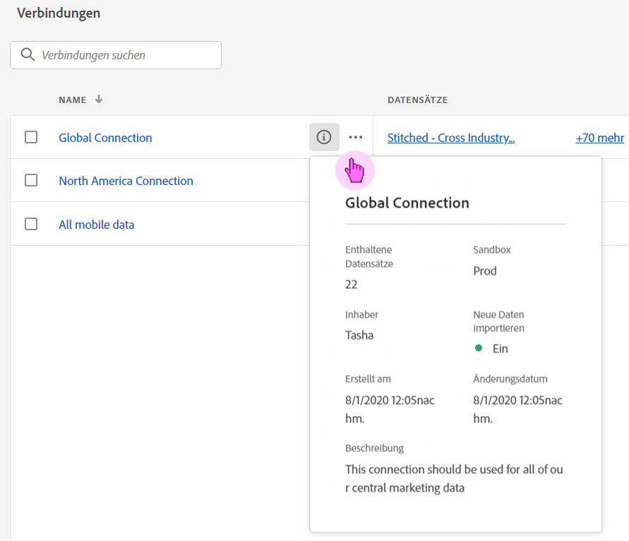
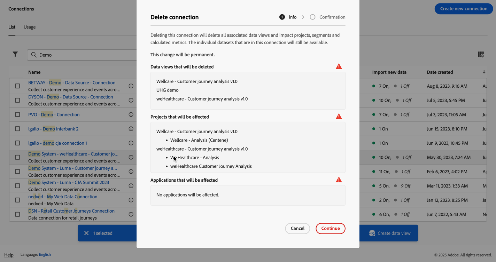
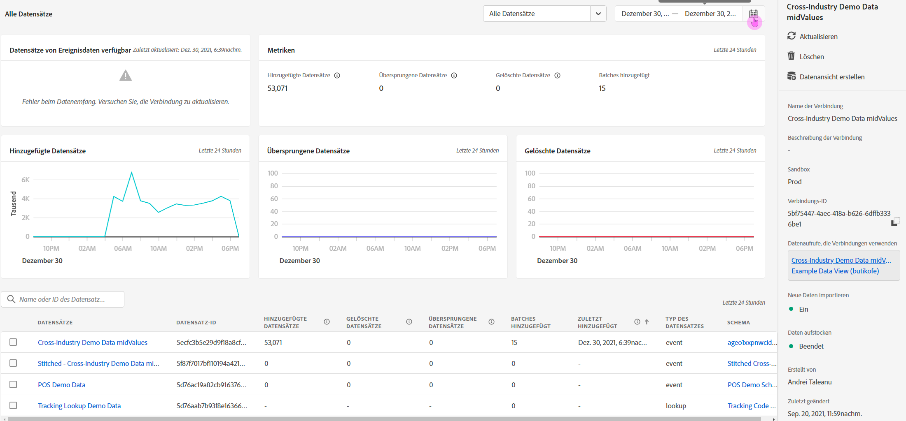

# Verwalten von Verbindungen

Nachdem Sie [eine oder mehrere Verbindungen erstellt oder bearbeitet haben](/help/connections/create-connection.md) können Sie sie in &quot;**[!UICONTROL &quot;]**. Verbindungen ermöglichen Ihnen Folgendes:

* Zeigen Sie alle Verbindungen auf einen Blick an, einschließlich Eigentümer, Sandbox und des Zeitpunkts der Erstellung und Änderung der Verbindungen.
* Bearbeiten einer Verbindung.
* Eine Verbindung löschen.
* Eine Datenschicht aus einer Verbindung erstellen.
* Lassen Sie sich alle Datensätze in einer Verbindung anzeigen.
* Überprüfen Sie den Status der Datensätze Ihrer Verbindung und den Status des Aufnahmevorgangs. Beispielsweise, wann Ihre Daten verfügbar sind, damit Sie mit der Berichterstellung und Analyse in Analysis Workspace beginnen können.
* Identifizieren Sie alle Datendiskrepanzen, die aufgrund einer Fehlkonfiguration entstanden sind. Fehlen Zeilen? Wenn ja, welche Zeilen fehlen und warum? Haben Sie Verbindungen falsch konfiguriert und dadurch das Fehlen von Daten im Customer Journey Analytics verursacht?
* Erhalten Sie Einblicke in die Verwendung aufgenommener und berichtspflichtiger Zeilen über alle Verbindungen hinweg.

[!UICONTROL Verbindungen] verfügt über zwei Schnittstellen: [[!UICONTROL List]](#list) und [[!UICONTROL Usage]](#usage).

## Liste

Die [!UICONTROL List]-Schnittstelle ist die Standardschnittstelle für Verbindungen. Wenn sie nicht ausgewählt ist, wählen Sie die **[!UICONTROL Liste]**, um auf die Benutzeroberfläche zuzugreifen.

Die [!UICONTROL List] zeigt eine Tabelle aller verfügbaren Verbindungen an. Sie können im Feld Suchen (Search) schnell .

Die folgenden Spalten oder Symbole sind in der Tabelle verfügbar.

| Spalte oder Symbol | Beschreibung |
| --- | --- |
| [!UICONTROL Name] | Der Anzeigename der Verbindung. Um die Details der Verbindung anzuzeigen, klicken Sie auf den Hyperlink-Namen. Siehe [Verbindungsdetails](#connection-details). |
|  | Um Informationen zu [!UICONTROL Enthaltene Datensätze], [!UICONTROL Sandbox], [!UICONTROL Inhaber] und mehr anzuzeigen, klicken Sie auf  neben dem Verbindungsnamen.
Ein Popup-Fenster mit Details wird angezeigt. 
 |
|  | Um [Datenansicht zu erstellen](#create-a-data-view) für die Verbindung wählen Sie . Dieses Symbol wird nur angezeigt, wenn der Verbindung bereits keine Datenansicht zugeordnet ist. |
|  | Wählen Sie  aus, um: 
 [Bearbeiten](#edit-a-connection) einer Verbindung.
 [Löschen](#delete-a-connection) einer Verbindung.
 [Neue Datenansicht erstellen](#create-a-data-view). So erstellen Sie zusätzliche Datenansichten für die Verbindung. |
| [!UICONTROL Datensätze] | Eine oder mehrere Verknüpfungen zu den Datensätzen, die Teil der Verbindung sind. Sie können den Datensatz-Hyperlink auswählen, um den Datensatz in der Verbindung anzuzeigen. Wenn weitere Datensätze Teil der ausgewählten Verbindung sind, wählen Sie **[!UICONTROL +*x* more]** aus, um das Bedienfeld **[!UICONTROL Datensätze enthalten]** anzuzeigen. In diesem Bedienfeld werden Links zu allen Datensätzen und eine Option zum Suchen nach einem bestimmten Datensatz angezeigt, der Teil der Verbindung ist.

Wenn Sie einen Datensatznamen auswählen, wird der Datensatz in der Experience Platform-Benutzeroberfläche auf einer neuen Registerkarte geöffnet. |
| [!UICONTROL Sandbox] | Die [Experience Platform-Sandbox](https://experienceleague.adobe.com/de/docs/experience-platform/sandbox/home) aus der diese Verbindung ihre Datensätze zieht. Diese Sandbox wurde beim erstmaligen Erstellen der Verbindung ausgewählt. Sie kann nicht geändert werden. |
| [!UICONTROL Inhaber] | Die Person, die die Verbindung hergestellt hat. |
| [!UICONTROL Importieren neuer Daten] | Der Status des Imports neuer Daten für Datensätze: 
)    **[!UICONTROL _x _Ein]**für Datensätze, die zum Importieren neuer Daten konfiguriert sind, und
   **[!UICONTROL _x Aus_]** für Datensätze, die nicht für den Import neuer Daten konfiguriert sind. |
| [!UICONTROL Erstellt am] | Der Zeitstempel, zu dem die Verbindung erstellt wurde. |
| [!UICONTROL Zuletzt geändert] | Der Zeitstempel, wann die Verbindung zuletzt aktualisiert wurde. |
| [!UICONTROL Aufstockungsdaten] | Der Status für die Aufstockung von Daten in allen Datensätzen.
   **[!UICONTROL _x _Aufstockungen fehlgeschlagen]**für die Anzahl der fehlgeschlagenen Aufstockungen über Datensätze hinweg,
   **[!UICONTROL _x _Aufstockungsverarbeitung]**für die Anzahl der Verarbeitungs-Aufstockungen über Datensätze hinweg,
   **[!UICONTROL _x _Aufstockungen abgeschlossen]**für die Anzahl der abgeschlossenen Aufstockungen für Datensätze und
   **[!UICONTROL _Aus_]** falls für die Datensätze in der Verbindung keine Aufstockungen definiert sind. |

Um zu konfigurieren, welche Spalten angezeigt werden sollen, wählen  aus. Dadurch wird das Dialogfeld **Tabelle anpassen** angezeigt, in dem Sie Spalten in der Tabelle aktivieren oder deaktivieren können.

### Verbindung bearbeiten

1. Klicken Sie  neben dem Verbindungsnamen
1. Wählen  die Option **[!UICONTROL Bearbeiten]** aus.

Alternativ haben Sie folgende Möglichkeiten:

1. Wählen Sie die Verbindungszeile aus.

1. Wählen  **[!UICONTROL Bearbeiten]** aus der blauen Leiste aus.

Beim Bearbeiten einer Verbindung haben Sie folgende Möglichkeiten:

* Starten und Beenden des Imports neuer Daten
* Eine Verbindung umbenennen.
* Aktualisieren Sie die Datensätze.
* Entfernen Sie Datensätze aus den Verbindungen.

Siehe [Erstellen oder Bearbeiten einer Verbindung](create-connection.md) für weitere Informationen.

### Eine Verbindung löschen {#connections-delete}

1. Klicken Sie  neben dem Verbindungsnamen.
1. Wählen Sie  **[!UICONTROL Löschen]** aus.

Alternativ haben Sie folgende Möglichkeiten:

1. Wählen Sie die Verbindungszeile aus.

1. Wählen Sie Löschen **[!UICONTROL Löschen]** aus.

Wenn Sie eine Verbindung löschen, zeigt das Bedienfeld **[!UICONTROL Verbindung löschen]** an, welche Datenansichten gelöscht werden und welche Workspace-Projekte betroffen sind.

Wählen Sie **[!UICONTROL Fortfahren]** aus, um die Verbindung zu löschen.

Weitere Informationen [ Löschen einer Verbindung finden ](/help/technotes/deletion.md) unter „Auswirkungen des Löschens“.

### Datenansicht für eine Verbindung erstellen

* Wenn der Verbindung keine Datenansicht zugeordnet ist:

   1. Wählen  neben dem Verbindungsnamen aus.

* Wenn für die Verbindung bereits eine oder mehrere Datenansichten erstellt wurden:

   1. Klicken Sie  neben dem Verbindungsnamen.
   1. Wählen  **[!UICONTROL Neue Datenansicht erstellen]**.

Alternativ haben Sie folgende Möglichkeiten:

1. Wählen Sie die Verbindungszeile aus.

1. Wählen Sie  **[!UICONTROL Datenansicht erstellen]** in der blauen Schaltflächenleiste aus.

Weitere Informationen finden Sie unter [Erstellen oder Bearbeiten einer Datenansicht](/help/data-views/create-dataview.md).

### Verbindungsdetails {#connection-detail}

Um zu den Details für eine Verbindung zu wechseln, wählen Sie einen Verbindungsnamen in der Tabelle Verbindungen aus.

Die Schnittstelle Verbindungsdetails bietet eine detaillierte Ansicht des Status einer Verbindung. Sie haben folgende Möglichkeiten:

* Überprüfen Sie den Status der Datensätze Ihrer Verbindung und des Aufnahmevorgangs.
* Identifizieren Sie Konfigurationsprobleme, die zu übersprungenen oder gelöschten Datensätzen führen können.
* Finden Sie heraus, wann die Daten für das Reporting verfügbar sind.

| Benutzeroberfläche | Beschreibung |
| --- | --- |
|  [!UICONTROL Verbindung bearbeiten] | Um die Details einer Verbindung zu bearbeiten, wählen Sie  **[!UICONTROL Verbindung bearbeiten]** aus. Siehe [Erstellen oder Bearbeiten einer Verbindung](create-connection.md) für weitere Informationen. |
| Datensatz-Auswahl | Ermöglicht die Auswahl eines Datensatzes oder aller Datensätze in der Verbindung. Datensätze können nicht mehrmals ausgewählt werden. Die Standardeinstellung ist [!UICONTROL Alle Datensätze]. |
| Datumsbereichsauswahl | Bearbeiten Sie das Start- und Enddatum oder wählen Sie , um die Datumsbereichsauswahl zu öffnen. Wählen Sie in der Datumsbereichsauswahl einen Datumsbereich aus, indem Sie einen der vordefinierten Zeiträume verwenden (z. B. **[!UICONTROL Letzte 6 Monate]**) oder verwenden Sie den Kalender, um das Start- und Enddatum auszuwählen. Wählen Sie **[!UICONTROL Anwenden]** aus, um den neuen Datumsbereich anzuwenden. |
| [!UICONTROL Datensätze von Ereignisdaten verfügbar] | Die Gesamtzahl der für das Reporting verfügbaren Ereignis-Datensatzzeilen (**für die gesamte Verbindung**. Diese Anzahl ist unabhängig von Kalendereinstellungen. Die Anzahl ändert sich, wenn Sie einen Datensatz aus der Datensatzauswahl oder durch Auswahl eines Datensatzes in der Tabelle auswählen. Nachdem Daten hinzugefügt wurden, dauert es 1-2 Stunden, bis die Daten im Reporting angezeigt werden. |
| [!UICONTROL Metriken] | Zusammenfassen der hinzugefügten, übersprungenen und gelöschten Ereignis-, Lookup-, Profil- und Zusammenfassungsdatensätze sowie der Anzahl der hinzugefügten Batches. Diese Metriken basieren auf **dem ausgewählten Datensatz und Datumsbereich**.
Wählen Sie **[!UICONTROL Detail überprüfen]** aus, um das Popup **[!UICONTROL Übersprungene Details überprüfen]** anzuzeigen. Das Popup-Fenster listet die Anzahl der übersprungenen Datensätze und den Grund für alle Ereignis-Datensätze oder ausgewählten Datensätze auf.

Wählen Sie -Popup mit weiteren Informationen aus. Aus einigen übersprungenen Gründen, z. B. [!UICONTROL Leere Besucher-ID], zeigt das Popup Beispiel-PSQL für EQS (Experience Platform für Abfrage-Service) an, das Sie in [Abfrage-Service](https://experienceleague.adobe.com/de/docs/experience-platform/query/home) verwenden können, um die übersprungenen Datensätze im Datensatz abzufragen. Wählen Sie  **[!UICONTROL Beispiel-PSQL für EQS kopieren]**, um die SQL zu kopieren. |
| [!UICONTROL Hinzugefügte Datensätze] | Gibt an, wie viele Zeilen im ausgewählten Zeitraum **für den ausgewählten Datensatz und Datumsbereich** hinzugefügt wurden. Wird alle zehn Minuten aktualisiert. |
| [!UICONTROL Übersprungene Datensätze] | Gibt an, wie viele Zeilen im ausgewählten Zeitraum **für den ausgewählten Datensatz und Datumsbereich** übersprungen wurden. Gründe für das Überspringen von Datensätzen sind: fehlende Zeitstempel, fehlende oder ungültige Personen-ID usw. Wird alle zehn Minuten aktualisiert. 
Ungültige Personen-IDs (z. B. `undefined` oder `00000000` oder eine beliebige Kombination aus Zahlen und Buchstaben in einer [!UICONTROL Personen-ID], die in einem Ereignis mehr als eine Million Mal in einem bestimmten Monat auftritt) sind IDs, die keinem bestimmten Benutzer bzw. keiner bestimmten Person zugeordnet werden können. Diese Zeilen können nicht in das System aufgenommen werden und führen zu fehlerhafter Aufnahme und Berichterstellung. Um ungültige Personen-IDs zu beheben, haben Sie drei Möglichkeiten:<ul><li>Verwenden Sie [Zusammenfügen](/help/stitching/overview.md) um die Benutzer-IDs, die nicht definiert sind oder nur Nullen enthalten, mit gültigen Benutzer-IDs zu füllen.</li><li>Blenden Sie die Benutzer-ID aus, die dann während der Aufnahme übersprungen werden (was ungültigen oder Benutzer-IDs mit nur null vorzuziehen ist).</li><li>Korrigieren Sie alle ungültigen Benutzer-IDs in Ihrem System, bevor Sie die Daten aufnehmen.</li></ul> |
| [!UICONTROL Datensätze] gelöscht | Gibt an, wie viele Zeilen im ausgewählten Zeitraum **für den ausgewählten Datensatz und Datumsbereich** gelöscht wurden. Beispielsweise könnte jemand einen Datensatz in [!DNL Experience Platform] gelöscht haben. Wird alle zehn Minuten aktualisiert.
In einigen Szenarien kann dieser Wert auch ersetzte Datensätze enthalten, wie etwa bei der Zuordnung oder bei einigen Aktualisierungen von Lookup-Datensätzen. Sehen Sie sich dieses Beispiel an:
<ul><li>Sie laden einen Datensatz in einen XDM Individual Profile-Datensatz hoch, wobei die Customer Journey Analytics so konfiguriert ist, dass sie als Profilsuchdaten aufnimmt. In den Verbindungsdetails würde dieser Datensatz 1 hinzugefügten Datensatz anzeigen.</li><li>Sie laden ein Duplikat des ursprünglichen Datensatzes in denselben AEP-Datensatz hoch, der jetzt zwei Datensätze enthält. Beim Customer Journey Analytics wird der zusätzliche Datensatz aus dem Profilsuchdatensatz aufgenommen. Da für diese Personen-ID bereits ein Profildatensatz in der Verbindung aufgenommen wurde, löscht Customer Journey Analytics seine frühere Version und fügt die neuen Profildaten hinzu. In den Verbindungsdetails würde diese Aktion bedeuten, dass 1 Datensatz hinzugefügt und 1 Datensatz gelöscht wird, da Customer Journey Analytics nur die neuesten Profilsuchdaten für eine aufgenommene Personen-ID beibehält.</li><li>Insgesamt enthält der AEP-Datensatz zwei Datensätze, die zufällig identisch sind. Separat zeigen die Customer Journey Analytics-Verbindungsdetails den Status der aufgenommenen Daten an: 2 Datensätze wurden hinzugefügt und 1 Datensatz für diesen Profildatensatz gelöscht. </li></ul> |
|  _Datensatznamen oder ID suchen_ | Datensatz-Suchfeld. Sie können die Datensatztabelle nach Datensatznamen oder [!UICONTROL Datensatz-ID) ]. |
| [!UICONTROL Tabelle Datensätze] | Die Datensätze, die Teil der Verbindung sind. |
| [!UICONTROL Datensätze] | Der Name des Datensatzes, der Teil der Verbindung ist. Sie können den Hyperlink auswählen, um den Datensatz in der Experience Platform-Benutzeroberfläche auf einer neuen Registerkarte zu öffnen. Sie können die Zeile oder das Kontrollkästchen aktivieren, um nur Details für den ausgewählten Datensatz anzuzeigen. |
| [!UICONTROL Datensatz-ID] | Automatisch durch Experience Platform generiert. |
| [!UICONTROL Hinzugefügte Datensätze] | Die Anzahl der Datensatzdatensätze (Zeilen), die einer Verbindung im ausgewählten Zeitintervall hinzugefügt wurden. |
| [!UICONTROL Übersprungene Datensätze] | Die Anzahl der bei der Datenübertragung für eine Verbindung übersprungenen Datensatzdatensätze (Zeilen) im ausgewählten Zeitintervall. |
| [!UICONTROL Gelöschte Datensätze] | Die Anzahl der Datensätze (Zeilen), die während des ausgewählten Zeitintervalls aus einer Verbindung entfernt wurden. |
| [!UICONTROL Batches hinzugefügt] | Die Anzahl der Datensatz-Batches wurde einer Verbindung hinzugefügt. |
| [!UICONTROL Zuletzt hinzugefügt] | Der Zeitstempel des letzten Batches aus dem Datensatz, der einer Verbindung hinzugefügt wurde. |
| [!UICONTROL Datenquellentyp] | Der Quelltyp des Datensatzes. Sie definieren den Quelltyp beim Erstellen einer Verbindung. |
| [!UICONTROL Typ des Datensatzes] | Der Datensatztyp für diesen Datensatz. Der Typ kann [!UICONTROL Ereignis], [!UICONTROL Profil], [!UICONTROL Suche] oder [!UICONTROL Zusammenfassung]. [Weitere Infos](https://experienceleague.adobe.com/de/docs/analytics-platform/using/cja-connections/create-connection) |
| Schema | Das Experience Platform-Schema, auf dem der Datensatz basiert. |
| [!UICONTROL Importieren neuer Daten] | Der Status des Imports neuer Daten für den Datensatz: 
   **[!UICONTROL _x _Ein]**wenn der Datensatz für den Import neuer Daten konfiguriert ist, und
   **[!UICONTROL _x Aus_]** wenn der Datensatz so konfiguriert ist, dass er keinen neuen Datenimport importiert. |
| [!UICONTROL Daten transformieren] | Der Umwandlungsstatus von anwendbaren B2B-Lookup-Datensätzen. Weitere Informationen finden Sie unter [Umwandeln von Datensätzen für B2B-Suchen](transform-datasets-b2b-lookups.md).
   **[!UICONTROL _x _Ein]**für entsprechende Datensätze, die für die Umwandlung aktiviert sind, 
   **[!UICONTROL _x Aus_]** für entsprechende Datensätze, die nicht für die Umwandlung aktiviert sind, und
**[!UICONTROL Nicht zutreffend]** für alle anderen Datensätze, nicht anwendbar für die Umwandlung. |
| [!UICONTROL Aufstockungsdaten] | Der Status der Aufstockungsdaten für den Datensatz.
   **[!UICONTROL _x _Aufstockungen fehlgeschlagen]**für die Anzahl fehlgeschlagener Aufstockungen,
   **[!UICONTROL _x _Aufstockungsverarbeitung]**für die Anzahl der Aufstockungsverarbeitung,
   **[!UICONTROL _x _Aufstockungen abgeschlossen]**für die Anzahl der abgeschlossenen Aufstockungen und
   **[!UICONTROL _Aus_]** falls keine Aufstockungen konfiguriert sind. |
| [!UICONTROL Importieren neuer Daten] | Der Status des Imports neuer Daten für den Datensatz: 
   **[!UICONTROL _x _Ein]**wenn der Datensatz für den Import neuer Daten konfiguriert ist, und
   **[!UICONTROL _x Aus_]** wenn der Datensatz so konfiguriert ist, dass er keine neuen Daten importiert. |
| [!UICONTROL Aufstockungsdaten] | Der Status der Aufstockungsdaten für den Datensatz.
   **[!UICONTROL _x _Aufstockungen fehlgeschlagen]**für die Anzahl fehlgeschlagener Aufstockungen,
   **[!UICONTROL _x _Aufstockungsverarbeitung]**für die Anzahl der Aufstockungsverarbeitung,
   **[!UICONTROL _x _Aufstockungen abgeschlossen]**für die Anzahl der abgeschlossenen Aufstockungen und
   **[!UICONTROL _Aus_]** falls keine Aufstockungen konfiguriert sind. |

>[!IMPORTANT]
>
>Daten, die vor dem 13. August 2021 aufgenommen wurden, werden in der Schnittstelle [!UICONTROL Verbindungen] nicht angezeigt.

#### Anschlussfeld

Wenn kein Datensatz in der Datensatztabelle ausgewählt ist, zeigt ein Bedienfeld auf der rechten Seite der Verbindungsschnittstelle Verbindungsoptionen und -details an.

| Optionen | Beschreibung |
| --- | --- |
|  [!UICONTROL Aktualisieren] | Um die Verbindung zu aktualisieren und die Anzeige kürzlich hinzugefügter Datensätze zuzulassen, wählen Sie  **[!UICONTROL Aktualisieren]** aus. |
|  **[!UICONTROL Löschen]** | [Löschen](#delete-a-connection) diese Verbindung. |
|  **[!UICONTROL Datenansicht erstellen]** | [Erstellen einer Datenansicht](#create-a-data-view) basierend auf dieser Verbindung. Weitere Informationen finden [ unter ](https://experienceleague.adobe.com/de/docs/analytics-platform/using/cja-dataviews/data-views)Datenansichten“. |
| [!UICONTROL Name der Verbindung] | Der Anzeigename der Verbindung. |
| [!UICONTROL Beschreibung der Verbindung] | Eine detailliertere Beschreibung, die den Zweck dieser Verbindung beschreibt. |
| [!UICONTROL Sandbox] | Die [Experience Platform-Sandbox](https://experienceleague.adobe.com/de/docs/experience-platform/sandbox/home) aus der diese Verbindung ihre Datensätze abruft. Diese Sandbox wurde beim erstmaligen Erstellen der Verbindung ausgewählt. Sie kann nicht geändert werden. |
| [!UICONTROL Verbindungs-ID] | Diese ID wird in Experience Platform generiert. Sie können  verwenden, um die ID zu kopieren. |
| [!UICONTROL Datenaufrufe, die Verbindungen verwenden] | Listet alle Datenansichten auf, die diese Verbindung verwenden. |
| [!UICONTROL Neue Daten importieren] | Der Status des Imports neuer Daten für Datensätze: 
   **[!UICONTROL _x _Ein]**für die Anzahl der Datensätze, die für den Import neuer Daten konfiguriert sind, und
   **[!UICONTROL _x Aus_]** für wie viele Datensätze der neue Datenimport deaktiviert ist. |
| [!UICONTROL Aufstockungsdaten] | Der Status der Aufstockungsdaten für Datensätze.
   **[!UICONTROL _x _Aufstockungen fehlgeschlagen]**für die Anzahl der fehlgeschlagenen Aufstockungen über Datensätze hinweg,
   **[!UICONTROL _x _Aufstockungsverarbeitung]**für die Anzahl der Verarbeitungs-Aufstockungen über Datensätze hinweg,
   **[!UICONTROL _x _Aufstockungen abgeschlossen]**für die Anzahl der abgeschlossenen Aufstockungen für Datensätze und
   **[!UICONTROL _Aus_]** falls für die Datensätze in der Verbindung keine Aufstockungen definiert sind. |
| Daten transformieren | Der Umwandlungsstatus von anwendbaren B2B-Lookup-Datensätzen. Weitere Informationen finden Sie unter [Umwandeln von Datensätzen für B2B-Suchen](transform-datasets-b2b-lookups.md).
   **[!UICONTROL _x _Ein]**für die Anzahl der für die Umwandlung aktivierten Datensätze. |
| [!UICONTROL Erstellt von] | Der Name der Person, die die Verbindung hergestellt hat. |
| [!UICONTROL Zuletzt geändert] | Der Zeitstempel der letzten Änderung der Verbindung. |
| [!UICONTROL Zuletzt geändert von] | Die Person, die die Verbindung zuletzt geändert hat. |

#### Datensatz-Panel

Wenn ein Datensatz in der Datensatztabelle ausgewählt ist, werden in einem Bedienfeld auf der rechten Seite der Verbindungsschnittstelle Details zum ausgewählten Datensatz angezeigt.

| Details | Beschreibung |
| --- | --- |
| [!UICONTROL Personen-ID] | Eine Identität, die im Datensatzschema auf der Experience Platform definiert wurde. Diese Identität ist die Personen-ID, die Sie bei der Erstellung der Verbindung ausgewählt haben. Wenn Sie eine Verbindung erstellen, die Datensätze mit unterschiedlichen IDs enthält, spiegelt die Berichterstellung dies wider. Um Datensätze zusammenzuführen, müssen Sie in allen Datensätzen dieselbe Personen-ID verwenden. |
| [!UICONTROL Schlüssel] | Der Schlüssel, den Sie für einen Such-Datensatz angegeben haben. |
| [!UICONTROL Übereinstimmender Schlüssel] | Der übereinstimmende Schlüssel, den Sie für einen Such-Datensatz angegeben haben. |
| [!UICONTROL Zeitstempel] | Der für einen Ereignis-Datensatz definierte Zeitstempel. |
| [!UICONTROL Verfügbare Datensätze] | Die Gesamtzahl der Zeilen, die für diesen Datensatz in dem im Kalender ausgewählten Zeitraum aufgenommen wurden. Es gibt keine Latenz im Hinblick darauf, ab wann die Daten nach dem Hinzufügen in Berichten angezeigt werden. Wenn Sie jedoch eine brandneue Verbindung erstellen, gibt es [Latenz](https://experienceleague.adobe.com/en/docs/analytics-platform/using/cja-overview/cja-faq). |
| [!UICONTROL Hinzugefügte Datensätze] | Wie viele Zeilen im ausgewählten Zeitraum hinzugefügt wurden. |
| [!UICONTROL Gelöschte Datensätze] | Wie viele Datensätze wurden im ausgewählten Zeitraum gelöscht. |
| [!UICONTROL Batches hinzugefügt] | Wie viele Datenstapel diesem Datensatz hinzugefügt wurden. |
| [!UICONTROL Übersprungene Datensätze] | Wie viele Zeilen während der Aufnahme im ausgewählten Zeitraum übersprungen wurden.
Gründe für das Überspringen von Datensätzen sind: fehlende Zeitstempel, fehlende oder ungültige Personen-ID usw. Wird alle zehn Minuten aktualisiert.
Ungültige Personen-IDs (z. B. `undefined` oder `00000000` oder eine beliebige Kombination aus Zahlen und Buchstaben in einer [!UICONTROL Personen-ID], die in einem Ereignis mehr als eine Million Mal in einem bestimmten Monat auftritt) sind IDs, die keinem bestimmten Benutzer bzw. keiner bestimmten Person zugeordnet werden können. Diese Zeilen können nicht in das System aufgenommen werden und führen zu fehlerhafter Aufnahme und Berichterstellung. Um ungültige Personen-IDs zu beheben, haben Sie drei Möglichkeiten:<ul><li>Verwenden Sie [Zusammenfügen](/help/stitching/overview.md) um die Benutzer-IDs, die nicht definiert sind oder nur Nullen enthalten, mit gültigen Benutzer-IDs zu füllen.</li><li>Blenden Sie die Benutzer-ID aus, die dann während der Aufnahme übersprungen wird (was ungültigen oder Benutzer-IDs mit nur null vorzuziehen ist).</li><li>Korrigieren Sie alle ungültigen Benutzer-IDs in Ihrem System, bevor Sie die Daten aufnehmen.</li></ul> |
| [!UICONTROL Zuletzt hinzugefügt] | Der Zeitpunkt, zu dem der letzte Stapel hinzugefügt wurde. |
| [!UICONTROL Importieren neuer Daten] | Der Status des Imports neuer Daten für den Datensatz: 
   **[!UICONTROL _x _Ein]**wenn der Datensatz für den Import neuer Daten konfiguriert ist, und
   **[!UICONTROL _x Aus_]** wenn der Datensatz so konfiguriert ist, dass er keine neuen Daten importiert. |
| [!UICONTROL Aufstockungsdaten] | Der Status der Aufstockungsdaten für den Datensatz.
   **[!UICONTROL _x _Aufstockungen fehlgeschlagen]**für die Anzahl fehlgeschlagener Aufstockungen,
   **[!UICONTROL _x _Aufstockungsverarbeitung]**für die Anzahl der Aufstockungsverarbeitung,
   **[!UICONTROL _x _Aufstockungen abgeschlossen]**für die Anzahl der abgeschlossenen Aufstockungen und
   **[!UICONTROL _Aus_]** falls keine Aufstockungen konfiguriert sind.
Um ein Dialogfeld mit einer Übersicht über die früheren Aufstockungen für den Datensatz anzuzeigen, wählen Sie aus  **[!UICONTROL Frühere Aufstockungen]**. |
| [!UICONTROL Datenquellentyp] | Datenquellentyp, wie er beim Hinzufügen des Datensatzes zur Verbindung definiert wurde. |
| [!UICONTROL Typ des Datensatzes] | Entweder [!UICONTROL Ereignis], [!UICONTROL Profil], [!UICONTROL Suche] oder [!UICONTROL Zusammenfassung]. [Weitere Infos](https://experienceleague.adobe.com/de/docs/analytics-platform/using/cja-connections/create-connection) |
| [!UICONTROL Schema] | Das Experience Platform-Schema, auf dem dieser Datensatz basiert. |
| [!UICONTROL Datensatz-ID] | Diese Datensatz-ID wird im Experience Platform generiert. |

## Nutzung

<!-- markdownlint-disable MD034 -->

>[!CONTEXTUALHELP]
>id="cja_connections_usage_keyusagemetrics"
>title="Wichtige Nutzungsmetriken"
>abstract="Monatliche und gesamte Daten für Kern- und Verlaufszeilen bereitstellen."

<!-- markdownlint-enable MD034 -->

<!-- markdownlint-disable MD034 -->

>[!CONTEXTUALHELP]
>id="cja_connections_usage_monthlyingestedrows"
>title="Monatlich aufgenommene Zeilen"
>abstract="Misst die Gesamtzahl der monatlich zum System hinzugefügten Datensätze, um Einblicke in das Datenwachstum und die Aufnahmeraten zu erhalten."

<!-- markdownlint-enable MD034 -->

<!-- markdownlint-disable MD034 -->

>[!CONTEXTUALHELP]
>id="cja_connections_usage_monthlyreportablerows"
>title="Monatliche berichtsfähige Zeilen"
>abstract="Verfolgt die Anzahl der für das Reporting verfügbaren Zeilen. Berichterstattungsfähige Zeilen sind die aufgenommenen Zeilen abzüglich der Zeilen, die bei der Aufnahme übersprungen und gelöscht werden. Berichterstellbare Zeilen dienen als Schlüsselmetrik für die Abrechnung und Datennutzung."

<!-- markdownlint-enable MD034 -->

<!-- markdownlint-disable MD034 -->

>[!CONTEXTUALHELP]
>id="cja_connections_usage_detailbreakdown"
>title="Detailaufschlüsselung."
>abstract="Sie können detaillierte Metriken nach Verbindung, Datensatz, Sandbox und Tags mit der Option anzeigen, eine CSV-Datei der Daten herunterzuladen."

<!-- markdownlint-enable MD034 -->

Die [!UICONTROL Usage]-Schnittstelle zeigt die Verwendung aufgenommener und berichtspflichtiger Zeilen über alle Verbindungen hinweg. Über diese Schnittstelle können Sie feststellen, ob Ihre Customer Journey Analytics-Nutzung den vertraglich vereinbarten Vorgaben entspricht. Zusätzlich zu Überwachungszwecken können Sie die Nutzungsbenutzeroberfläche verwenden, um die Verlängerung Ihrer Customer Journey Analytics-Lizenz zu planen.

Sie können einen Zeitraum (zwischen den letzten 6 Monaten, dem Jahr bis zum Datum oder den letzten 2 Jahren) und ein Intervall (zwischen monatlich oder vierteljährlich) zur Überwachung der Customer Journey Analytics-Nutzung auswählen. Die Benutzeroberfläche ist in zwei Abschnitte unterteilt:

* Aufgenommene Zeilen: Gesamtzahl der Zeilen, die von Ereignis-Datensätzen über alle Customer Journey Analytics-Verbindungen hinweg aufgenommen/gesendet wurden, einschließlich der bei der Aufnahme übersprungenen Datensätze
* Berichterstellbare Zeilen: Gesamtzahl der berichtspflichtigen Zeilen, die alle Ereignisdaten über alle Customer Journey Analytics-Verbindungen hinweg enthalten

Wählen Sie die **[!UICONTROL Nutzung]** aus, um auf die Benutzeroberfläche zuzugreifen.

### Bericht zur Nutzung

1. Wählen Sie einen **[!UICONTROL Zeitbereich]** aus. Sie können zwischen **[!UICONTROL Letzte 6 Monate]**, **[!UICONTROL Jahr bis heute]** oder **[!UICONTROL Letzte 2 Jahre]** wählen.
1. Wählen Sie ein **[!UICONTROL Intervall]**. Sie können zwischen **[!UICONTROL monatlich]** oder **[!UICONTROL vierteljährlich]** wählen.

Für [!UICONTROL aufgenommene Zeilen]:

* In einem Bedienfeld werden die insgesamt aufgenommenen Zeilen angezeigt, die alle Ereignisdaten über alle Verbindungen hinweg enthalten, die an jedem 2. Tag eines Monats aktualisiert werden. Innerhalb des Bedienfelds:
   * In einem Feld wird die Anzahl der aufgenommenen Zeilen für den letzten Monat und die Änderung in % (angegeben durch ▲ oder ▼) gegenüber dem Vormonat angezeigt.
   * Ein Liniendiagramm zeigt die ◼︎ &quot;[!UICONTROL  aufgenommene Zeilen] an. Um ein Popup anzuzeigen, das die Anzahl der monatlich aufgenommenen Zeilen für einen Monat anzeigt, bewegen Sie den Mauszeiger über einen beliebigen Datenpunkt im Liniendiagramm.

Für [!UICONTROL meldepflichtige Zeilen]:

* In einem Bedienfeld werden alle meldepflichtigen Zeilen angezeigt, die alle Ereignisdaten über alle Verbindungen hinweg enthalten, die an jedem 2. Tag eines Monats aktualisiert werden. Innerhalb des Bedienfelds:
   * Ein Feld zeigt die kumulative Gesamtzahl der berichtspflichtigen Zeilen an.
   * Ein Feld zeigt die Gesamtzahl der berichtspflichtigen Zeilen für den letzten Monat und die Änderung in % (angegeben durch ▲ oder ▼) gegenüber dem Vormonat an.
   * Ein Liniendiagramm zeigt die ◼︎ [!UICONTROL monatlich meldepflichtige Zeilen] an. Um ein Popup anzuzeigen, das die Anzahl der kumulativen berichtspflichtigen Zeilen für einen bestimmten Monat anzeigt, bewegen Sie den Mauszeiger über einen beliebigen Datenpunkt im Liniendiagramm.
   * ein Liniendiagramm zeigt die ◼︎ [!UICONTROL Kumulative berichtspflichtige Zeilen] an. Um ein Popup anzuzeigen, das die Anzahl der monatlich zu meldenden Zeilen für einen Monat anzeigt, bewegen Sie den Mauszeiger über einen beliebigen Datenpunkt im Liniendiagramm.

>[!MORELIKETHIS]
>
>[Tutorial zum Anzeigen, Beheben und Ändern ](https://experienceleague.adobe.com/en/docs/customer-journey-analytics-learn/tutorials/connections/connections-details-experience-in-cja) Verbindungseinstellungen.
