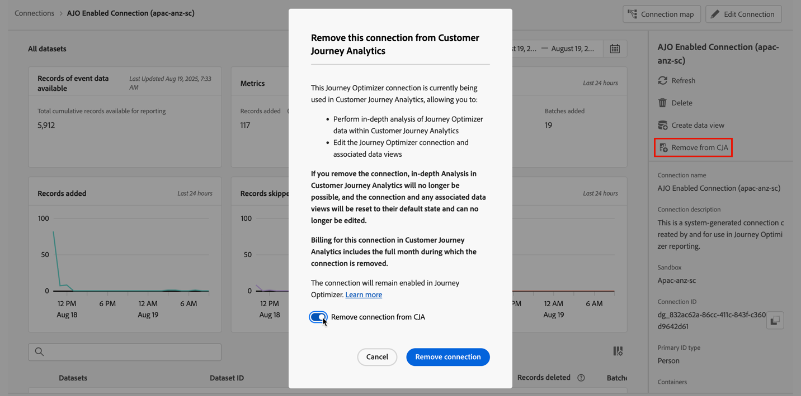

# Verwalten von Verbindungen {#manage-connections}

>[!CONTEXTUALHELP]
>id="connections_use_ajo"
>title="Verwenden der Journey Optimizer-Verbindung"
>abstract="Nutzt die erweiterten Reporting-Funktionen von Customer Journey Analytics mit Journey Optimizer."

>[!CONTEXTUALHELP]
>id="connections_cancel_ajo"
>title="Abbrechen der Journey Optimizer-Verbindung"
>abstract="Deaktiviert die erweiterten Reporting-Funktionen von Customer Journey Analytics mit Journey Optimizer."

Nachdem Sie [eine oder mehrere Verbindungen erstellt oder bearbeitet haben](/help/connections/create-connection.md), können Sie sie unter **[!UICONTROL Verbindungen]** verwalten. Die Benutzeroberfläche [!UICONTROL Verbindungen] ermöglicht Ihnen Folgendes:

* alle Verbindungen auf einen Blick anzeigen, einschließlich der oder des Verantwortlichen, der Sandbox und des Zeitpunkts der Verbindungserstellung und -änderung.
* Verbindungen bearbeiten.
* Eine Verbindung löschen.
* Eine Datenschicht aus einer Verbindung erstellen.
* Lassen Sie sich alle Datensätze in einer Verbindung anzeigen.
* den Status der Datensätze Ihrer Verbindung und des Aufnahmevorgangs überprüfen. Beispielsweise, wann Ihre Daten verfügbar sind, damit Sie mit der Berichterstellung und Analyse in Analysis Workspace beginnen können.
* alle Datendiskrepanzen identifizieren, die aufgrund einer Fehlkonfiguration entstanden sind. Fehlen Zeilen? Wen dies der Fall ist, welche Zeilen fehlen und warum? Haben Sie Verbindungen falsch konfiguriert und dadurch das Fehlen von Daten in Customer Journey Analytics verursacht?
* Erkenntnisse zur Verwendung aufgenommener und berichtsfähiger Zeilen über alle Verbindungen hinweg erhalten.

Für [!UICONTROL Verbindungen] gibt es zwei Benutzeroberflächen: [[!UICONTROL Liste]](#list) und [[!UICONTROL Nutzung]](#usage).

## Liste

Die Benutzeroberfläche **[!UICONTROL Liste]** ist die Standardbenutzeroberfläche für Verbindungen. Wenn sie nicht ausgewählt ist, wählen Sie die Registerkarte **[!UICONTROL Liste]** aus, um auf die Benutzeroberfläche zuzugreifen.

In der Benutzeroberfläche [!UICONTROL Liste] wird eine Tabelle aller verfügbaren Verbindungen angezeigt. 

### Suchen nach einer Verbindung

Sie können im Feld „Suchen“  nach einer Verbindung suchen.

### Anwenden eines Filters auf die Liste der Verbindungen

Um einen Filter auf die Liste der Verbindungen anzuwenden, wählen Sie das Filtersymbol und dann eine der folgenden Filteroptionen aus:

| Filteroption | Beschreibung |
|---------|----------|
| **[!UICONTROL Datensätze]** | Es werden nur Verbindungen angezeigt, die mit den von Ihnen ausgewählten Datensätzen verknüpft sind. |
| **[!UICONTROL Inhabende]** | Es werden nur Verbindungen angezeigt, die den von Ihnen ausgewählten Personen gehören. |
| **[!UICONTROL Sandbox]** | Es werden nur Verbindungen angezeigt, die in den von Ihnen ausgewählten Sandboxes verfügbar sind. |
| **[!UICONTROL In CJA verwenden]** | Wählen Sie **[!UICONTROL Ein]** aus, um nur Verbindungen anzuzeigen, die für die Verwendung mit Customer Journey Analytics aktiviert sind. Wählen Sie **[!UICONTROL Aus]** aus, um nur Verbindungen anzuzeigen, die noch nicht für die Verwendung mit Customer Journey Analytics aktiviert sind. |

### Verfügbare Spalten

Die folgenden Spalten oder Symbole sind in der Tabelle verfügbar.

| Spalte oder Symbol | Beschreibung |
| --- | --- |
| **[!UICONTROL _Name_]** | Der Anzeigename der Verbindung. Wählen Sie den mit Hyperlink versehenen Namen aus, um die [Details der Verbindung](#connection-details) anzuzeigen. |
|  | Um Informationen zu [!UICONTROL enthaltenen Datensätzen], [!UICONTROL Sandbox], der oder dem [!UICONTROL Verantwortlichen] usw. anzuzeigen, wählen Sie  neben dem Verbindungsnamen aus.
Ein Popup-Fenster zeigt Details zum Datensatz an. 
 |
|  | Um für die Verbindung [eine Datenansicht zu erstellen](#create-a-data-view), wählen Sie  aus. Dieses Symbol wird nur angezeigt, wenn der Verbindung noch keine Datenansicht zugeordnet ist. |
|  | Wählen Sie  aus, um ein Kontextmenü zu öffnen. Folgende Optionen stehen zur Auswahl: 
 **[!UICONTROL Bearbeiten]**, um eine Verbindung zu [bearbeiten](#edit-a-connection).
 **[!UICONTROL Löschen]**, um eine Verbindung zu [löschen](#delete-a-connection).
 **[!UICONTROL Neue Datenansicht erstellen]**, um für die Verbindung [eine neue Datenansicht zu erstellen](#create-a-data-view).
 **[!UICONTROL Verbindungszuordnung]**, um eine [Verbindungszuordnung](#map-a-connection) für die Verbindung anzuzeigen. |
| [!BADGE B2B Edition]{type=Informative url="https://experienceleague.adobe.com/de/docs/analytics-platform/using/cja-overview/cja-b2b/cja-b2b-edition" newtab=true tooltip="Customer Journey Analytics B2B Edition"} **[!UICONTROL Verbindungstyp &#x200B;]** | Der Typ der Verbindung: **[!UICONTROL Personen]**- oder **[!UICONTROL Konto]**-basierte Verbindung. |
| **[!UICONTROL Datensätze]** | Ein oder mehrere Links zu den Datensätzen, die Teil der Verbindung sind. Sie können den Datensatz-Hyperlink auswählen, um den Datensatz in der Verbindung anzuzeigen. Wenn weitere Datensätze Teil der ausgewählten Verbindung sind, wählen Sie **[!UICONTROL +*x* mehr]** aus, um das Panel **[!UICONTROL Enthaltene Datensätze]** anzuzeigen. In diesem Panel werden Links zu allen Datensätzen und eine Option zum  Suchen nach bestimmten Datensätzen angezeigt, die Teil der Verbindung sind.

Wählen Sie einen Datensatznamen aus, um den Datensatz in der Experience Platform-Benutzeroberfläche in einer neuen Registerkarte zu öffnen. |
| **[!UICONTROL Sandbox]** | Die [Experience Platform-Sandbox](https://experienceleague.adobe.com/de/docs/experience-platform/sandbox/home), aus der diese Verbindung ihre Datensätze abruft. Sie wählen diese Sandbox beim Erstellen der Verbindung aus. Sobald eine Verbindung gespeichert wurde, können Sie die Sandbox nicht mehr ändern. |
| **[!UICONTROL Inhaber]** | Die Person, die die Verbindung hergestellt hat. |
| **[!UICONTROL Importieren neuer Daten]** | Der Status des Imports neuer Daten für Datensätze: 
   **[!UICONTROL _x _Ein]**&#x200B;für Datensätze, die zum Importieren neuer Daten konfiguriert sind, und
   **[!UICONTROL _x Aus_]** für Datensätze, die nicht für den Import neuer Daten konfiguriert sind. |
| **[!UICONTROL Erstellt am]** | Der Zeitstempel, wann die Verbindung erstellt wurde. |
| **[!UICONTROL Zuletzt geändert]** | Der Zeitstempel, wann die Verbindung zuletzt aktualisiert wurde. |
| **[!UICONTROL Aufstockungsdaten]** | Der Status für die Aufstockung von Daten in allen Datensätzen:
   **[!UICONTROL _x _Aufstockungen fehlgeschlagen]**&#x200B;für die Anzahl der datensatzübergreifend fehlgeschlagenen Aufstockungen über Datensätze,
   **[!UICONTROL _x _Aufstockungen werden verarbeitet]**&#x200B;für die Anzahl der datensatzübergreifend verarbeiteten Aufstockungen,
   **[!UICONTROL _x _Aufstockungen abgeschlossen]**&#x200B;für die Anzahl der abgeschlossenen Aufstockungen für Datensätze,
   **[!UICONTROL _Aus_]**, falls für die Datensätze in der Verbindung keine Aufstockungen definiert sind. |
| **[!UICONTROL Integrationen]** | Zeigt alle Experience Platform-Programme an, die für die Verbindung aktiviert sind. |
| **[!UICONTROL In CJA verwenden]** | Zeigt an, ob die Verbindung für die Verwendung mit Customer Journey Analytics aktiviert wurde. |

Um zu definieren, welche Spalten in der Tabelle angezeigt werden sollen, wählen Sie  aus. Wählen **[!UICONTROL Dialogfeld „Tabelle anpassen]** die anzuzeigenden Spalten aus. Wählen Sie dann **[!UICONTROL Übernehmen]** aus.

### Bearbeiten einer Verbindung

So bearbeiten Sie eine Verbindung:

1. Wählen Sie  neben dem Verbindungsnamen aus
1. Wählen Sie im Kontextmenü die Option  **[!UICONTROL Bearbeiten]** aus.

Sie können auch wie folgt vorgehen:

1. Wählen Sie die Verbindungszeile aus.

1. Wählen Sie in der blauen Aktionsleiste die Option  **[!UICONTROL Bearbeiten]** aus.

Weitere Informationen finden Sie unter [Erstellen oder Bearbeiten einer Verbindung](create-connection.md).

### Eine Verbindung löschen {#connections-delete}

So löschen Sie eine Verbindung:

1. Wählen Sie  neben dem Verbindungsnamen aus.
1. Wählen Sie  **[!UICONTROL Löschen]** aus.

Sie können auch wie folgt vorgehen:

1. Wählen Sie die Verbindungszeile aus.

1. Wählen Sie in der blauen Aktionsleiste die Option  **[!UICONTROL Löschen]** aus.

Wenn Sie eine Verbindung löschen, wird im Panel **[!UICONTROL Verbindung löschen]** angezeigt, welche Datenansichten gelöscht werden und welche Workspace-Projekte betroffen sind.

* Unter ➊ **[!UICONTROL Info]** werden die Auswirkungen des Löschens der Verbindung angezeigt.

  

  Wählen Sie **[!UICONTROL Weiter]** aus, um das Löschen zu bestätigen.

* Geben Sie unter ➋ **[!UICONTROL Bestätigung]** den Namen der Verbindung in **[!UICONTROL Verbindungsnamen eingeben]** ein und wählen Sie **[!UICONTROL Löschen]**, um die Verbindung zu löschen. Wählen Sie zum Abbrechen **[!UICONTROL Abbrechen]** aus.

Weitere Informationen zum Löschen einer Verbindung finden Sie unter [Auswirkungen des Löschens](/help/technotes/deletion.md).

### Erstellen einer Datenschicht für eine Verbindung

So erstellen Sie eine Datenansicht für eine Verbindung:

1. Wählen Sie  neben dem Verbindungsnamen aus.
1. Wählen Sie  **[!UICONTROL Neue Datenansicht erstellen]** aus.

Sie können auch wie folgt vorgehen:

1. Wählen Sie die Verbindungszeile aus.

1. Wählen Sie in der blauen Aktionsleiste die Option  **[!UICONTROL Datenansicht erstellen]** aus.

Weitere Informationen finden Sie unter [Erstellen oder Bearbeiten einer Datenansicht](/help/data-views/create-dataview.md).

### Journey Optimizer-Verbindungen

Sie können eine Journey Optimizer-Verbindung in Customer Journey Analytics verwenden, um mit der Verbindung folgende weitere Vorteile zu erhalten:

* Detaillierte Analyse der Journey Optimizer-Daten in Customer Journey Analytics durchführen (mithilfe der Schaltfläche **[!UICONTROL In CJA analysieren]** in Journey Optimizer).

  Weitere Informationen finden Sie in der Journey Optimizer-Dokumentation unter [Analysieren in Customer Journey Analytics](https://experienceleague.adobe.com/de/docs/journey-optimizer/using/reporting/channel-report/report-cja-manage#cja-template).

* Die Journey Optimizer-Verbindung und zugehörige Datenansichten bearbeiten.

  Weitere Informationen zu Bearbeitungsoptionen finden Sie unter [Bearbeiten einer Verbindung](#edit-a-connection).

>[!IMPORTANT]
>
>Wenn Sie eine Journey Optimizer-Verbindung für die Verwendung mit Customer Journey Analytics aktivieren, wie in diesem Abschnitt beschrieben, wird jede Datenzeile innerhalb der Verbindung für Ihre lizenzierten Datenzeilen jeden Monat für Customer Journey Analytics gezählt und in der Benutzeroberfläche für Verbindungsnutzungen angezeigt. Wählen Sie die Option **[!UICONTROL In CJA verwenden]** nur dann für die Verbindung aus, wenn Sie mit der zusätzlichen Verwendung von Datenzeilen in Customer Journey Analytics vertraut sind.
>
>**Wenn Sie zwischen Oktober 2024 und Oktober 2025 die Berechtigung sowohl für Customer Journey Analytics als auch für Journey Optimizer hatten, lesen Sie im folgenden Dokument die weiteren Informationen zu [AJO-fähigen Verbindungen](https://view.adobe.com/viewer/1ed94fc35c7860b260766c620889e7a0#1)**.

Um diese Funktion zu aktivieren, muss Ihr Unternehmen Zugriff auf Customer Journey Analytics haben. Wenn Sie keinen Zugriff haben, wenden Sie sich an Ihren Adobe-Vertriebskontakt.

#### Verwenden einer Journey Optimizer-Verbindung {#use-connection-in-cja}

So verwenden Sie eine Journey Optimizer-Verbindung in Customer Journey Analytics:

1. Suchen Sie die Journey Optimizer-Verbindung, die Sie mit Customer Journey Analytics verwenden möchten.

   1. Wählen Sie auf der Registerkarte **[!UICONTROL Verbindungen]** die Option  **[!UICONTROL Filter]** aus.

   1. Wählen im Abschnitt **[!UICONTROL In CJA verwenden]** die Option **[!UICONTROL Aus]** aus.

      Nun werden alle Journey Optimizer-Verbindungen angezeigt, die derzeit nicht für die Verwendung in Customer Journey Analytics konfiguriert sind.

      

1. Wählen Sie den Namen der Journey Optimizer-Verbindung.

1. Wählen Sie  **[!UICONTROL In CJA verwenden]** aus.

   Schaltfläche 

   Das Dialogfeld **[!UICONTROL Diese Verbindung in Customer Journey Analytics verwenden]** wird angezeigt.

1. Aktivieren Sie den Umschalter **[!UICONTROL Verbindung in CJA verwenden]**.

1. Wählen Sie **[!UICONTROL Verbindung verwenden]** aus.<!-- double-check these dialog button names -->

#### Entfernen einer Journey Optimizer-Verbindung {#remove-connection-in-cja}

Sie können eine Journey Optimizer-Verbindung jederzeit aus Customer Journey Analytics entfernen. Wenn Sie die Verbindung jedoch aus Customer Journey Analytics entfernen, nachdem sie bereits verwendet wurde, führt dies zu Folgendem:

* Die Journey Optimizer-Verbindung und alle zugehörigen Datenansichten werden auf ihren Standardstatus zurückgesetzt und können nicht mehr bearbeitet werden

* Alle benutzerdefinierten abgeleiteten Felder, die mit der Verbindung verknüpft sind, werden gelöscht.

* Sie können keine detaillierte Analyse der Journey Optimizer-Daten in Customer Journey Analytics mehr durchführen

  Dies bedeutet, dass die Schaltfläche **[!UICONTROL In CJA analysieren]** in Journey Optimizer deaktiviert ist.

>[!IMPORTANT]
>
>Die Abrechnung für die Verbindung in Customer Journey Analytics umfasst den gesamten Monat, in dem die Verbindung entfernt wird.

So entfernen Sie die Verbindung aus Customer Journey Analytics:

1. Suchen Sie die Journey Optimizer-Verbindung, die Sie aus Customer Journey Analytics entfernen möchten.

   1. Wählen Sie auf der Registerkarte **[!UICONTROL Verbindungen]** die Option  **[!UICONTROL Filter]** aus.

   1. Wählen  im Abschnitt **[!UICONTROL In CJA verwenden]** die Option **[!UICONTROL Ein]** aus.

      Nun werden alle Journey Optimizer-Verbindungen angezeigt, die derzeit für die Verwendung in Customer Journey Analytics konfiguriert sind.

      

1. Um die Verbindung anzuzeigen, wählen Sie den Namen der Journey Optimizer-Verbindung aus, die Sie aus Customer Journey Analytics entfernen möchten.

1. Wählen Sie beim Anzeigen der Journey Optimizer-Verbindung **[!UICONTROL Aus CJA entfernen]** aus.

   Das Dialogfeld **[!UICONTROL Diese Verbindung aus Customer Journey Analytics entfernen]** wird angezeigt:

   Schaltfläche 

1. Deaktivieren Sie die Option **[!UICONTROL Verbindung aus CJA entfernen]**.

1. Wählen Sie **[!UICONTROL Verbindung entfernen]** aus.

### Zuordnen einer Verbindung

So zeigen Sie eine [Verbindungszuordnung](/help/connections/create-connection.md#connection-map) an, die die Beziehungen zwischen den Datensätzen, die Teil einer Verbindung sind, genau angibt:

1. Wählen Sie  neben dem Verbindungsnamen aus.
1. Wählen Sie  **[!UICONTROL Verbindungszuordnung]** aus.

### Verbindungsdetails {#connection-detail}

Um zu den Details für eine Verbindung zu wechseln, wählen Sie einen mit Hyperlink versehenen Verbindungsnamen in der Verbindungstabelle aus.

In der Benutzeroberfläche mit den Verbindungsdetails erhalten Sie einen sehr detaillierten Überblick über den Status einer Verbindung. Sie haben folgende Möglichkeiten:

* Überprüfen Sie den Status der Datensätze Ihrer Verbindung und des Aufnahmevorgangs.
* Identifizieren Sie Konfigurationsprobleme, die zu übersprungenen oder gelöschten Einträgen führen können.
* Finden Sie heraus, wann die Daten für das Reporting verfügbar sind.

| Benutzeroberfläche | Beschreibung |
| --- | --- |
|  **[!UICONTROL Verbindung bearbeiten]** | Um die Details einer Verbindung zu bearbeiten, wählen Sie  **[!UICONTROL Verbindung bearbeiten]** aus. Weitere Informationen finden Sie unter [Erstellen oder Bearbeiten einer Verbindung](create-connection.md). |
| **[!UICONTROL *Datensatzauswahl *]** | Wählen Sie einen oder alle Datensätze aus, für den bzw. die Sie Details in der Verbindung anzeigen möchten. Datensätze können nicht mehrmals ausgewählt werden. Die Standardeinstellung ist **[!UICONTROL Alle Datensätze]**. |
| **[!UICONTROL *Datumsbereichsauswahl *]** | Wählen Sie einen Datumsbereich aus, für den Sie Details in der Verbindung anzeigen möchten. Bearbeiten Sie das Start- und Enddatum oder wählen Sie  aus, um die Datumsbereichsauswahl zu öffnen. Wählen Sie in der Datumsbereichsauswahl einen Datumsbereich aus, indem Sie einen der vordefinierten Zeiträume verwenden (z. B. **[!UICONTROL Letzte 6 Monate]**), oder legen Sie das Start- und Enddatum über den Kalender fest. Wählen Sie **[!UICONTROL Anwenden]** aus, um den neuen Datumsbereich auf die Verbindungsdetails anzuwenden. |
| **[!UICONTROL Verfügbare Einträge von Ereignisdaten]** | Die Gesamtzahl der für das Reporting verfügbaren Ereignisdatensätze **für die gesamte Verbindung**. Diese Anzahl ist unabhängig vom ausgewählten Datumsbereich oder einer Datensatz. |
| [!UICONTROL **[!UICONTROL Metriken]**] | Fasst die hinzugefügten, übersprungenen und gelöschten Ereignis-, Lookup-, Profil- und Zusammenfassungs-Datensatzeinträge sowie die Anzahl der hinzugefügten Batches zusammen. Diese Metriken basieren auf **dem ausgewählten Datensatz und Datumsbereich**.
Wählen Sie **[!UICONTROL Detail überprüfen]** aus, um das Popup **[!UICONTROL Übersprungenes Detail überprüfen]** anzuzeigen. Im Popup werden die Anzahl der übersprungenen Einträge und der Grund für alle Ereignisdatensätze oder ausgewählten Datensätze aufgeführt.

Wählen Sie das Popup  mit weiteren Informationen aus. Bei einigen Gründen für übersprungene Einträge, z. B. [!UICONTROL Leere Besucher-ID], zeigt das Popup **[!UICONTROL Beispiel-PSQL für EQS]** (Abfrage-Service von Experience Platform) an, das Sie im [Abfrage-Service](https://experienceleague.adobe.com/de/docs/experience-platform/query/home) verwenden können, um die übersprungenen Einträge im Datensatz abzufragen. Wählen Sie  **[!UICONTROL Muster-PSQL für EQS kopieren]** aus, um die SQL zu kopieren. |
| **[!UICONTROL Hinzugefügte Einträge]** | Eine Visualisierung, die angibt, wie viele Zeilen im ausgewählten Zeitraum **für den ausgewählten Datensatz und Datumsbereich** hinzugefügt wurden. Wird alle zehn Minuten aktualisiert. |
| **[!UICONTROL Übersprungene Einträge]** | Eine Visualisierung, die angibt, wie viele Zeilen im ausgewählten Zeitraum **für den ausgewählten Datensatz und Datumsbereich** übersprungen wurden. Zu den Gründen für das Überspringen von Einträgen zählen: fehlende Zeitstempel, fehlende oder ungültige Personen-IDs oder Konto-IDs [!BADGE B2B Edition]{type=Informative url="https://experienceleague.adobe.com/de/docs/analytics-platform/using/cja-overview/cja-b2b/cja-b2b-edition" newtab=true tooltip="Customer Journey Analytics B2B Edition"} usw. Wird alle zehn Minuten aktualisiert. 
Ungültige IDs (z. B. `undefined` oder `00000000` oder jede Kombination aus Zahlen und Buchstaben in einer [!UICONTROL Personen-ID], die in einem Ereignis mehr als eine Million Mal in einem bestimmten Monat auftritt) sind IDs, die keiner bestimmten Benutzerin bzw. keinem bestimmten Benutzer oder keiner bestimmten Person zugeordnet werden können. Diese Zeilen können nicht in das System aufgenommen werden und führen möglicherweise zu Fehlern bei Datenaufnahme und Reporting. Um ungültige Personen- oder Konto-IDs [!BADGE B2B Edition]{type=Informative url="https://experienceleague.adobe.com/de/docs/analytics-platform/using/cja-overview/cja-b2b/cja-b2b-edition" newtab=true tooltip="Customer Journey Analytics B2B Edition"} zu korrigieren, haben Sie drei Möglichkeiten:<ul><li>Verwenden Sie die [Zuordnungsfunktion](/help/stitching/overview.md), um die Benutzer-IDs, die nicht definiert sind oder nur Nullen enthalten, mit gültigen Benutzer-IDs aufzufüllen.</li><li>Blenden Sie Benutzer-IDs aus, die dann bei der Datenaufnahme übersprungen werden (was Benutzer-IDs vorzuziehen ist, die ungültig sind oder nur Nullen enthalten).</li><li>Korrigieren Sie alle ungültigen Benutzer-IDs in Ihrem System, bevor Sie die Daten aufnehmen.</li></ul> |
| **[!UICONTROL Gelöschte Einträge]** | Eine Visualisierung, die angibt, wie viele Zeilen im ausgewählten Zeitraum **für den ausgewählten Datensatz und Datumsbereich** gelöscht wurden. Beispielsweise könnte jemand einen Datensatz in [!DNL Experience Platform] gelöscht haben. Wird alle zehn Minuten aktualisiert.
In einigen Szenarien kann dieser Wert auch ersetzte Einträge enthalten, wie etwa bei der Zuordnung oder bei einigen Aktualisierungen von Lookup-Datensätzen. Sehen Sie sich dieses Beispiel an:
<ul><li>Sie laden einen Eintrag in einen Datensatz vom Typ „XDM-Profil für Einzelpersonen“ hoch, der von Customer Journey Analytics als Profil-Lookup-Daten aufgenommen wird. In den Verbindungsdetails wird für diesen Datensatz angezeigt, dass ein Eintrag hinzugefügt wurde.</li><li>Sie laden ein Duplikat des ursprünglichen Eintrags in denselben AEP-Datensatz hoch, der jetzt zwei Einträge enthält. Customer Journey Analytics nimmt den zusätzlichen Eintrag aus dem Profil-Lookup-Datensatz oder Konto-Lookup-Datensatz [!BADGE B2B Edition]{type=Informative url="https://experienceleague.adobe.com/de/docs/analytics-platform/using/cja-overview/cja-b2b/cja-b2b-edition" newtab=true tooltip="Customer Journey Analytics B2B Edition"} auf. Da für diese Personen oder Konto-ID [!BADGE B2B Edition]{type=Informative url="https://experienceleague.adobe.com/de/docs/analytics-platform/using/cja-overview/cja-b2b/cja-b2b-edition" newtab=true tooltip="Customer Journey Analytics B2B Edition"} bereits ein Profil- oder Kontoeintrag in die Verbindung aufgenommen wurde, löscht Customer Journey Analytics dessen frühere Version und fügt die neuen Profildaten hinzu. In den Verbindungsdetails führt diese Aktion dazu, dass ein Eintrag hinzugefügt und ein Eintrag gelöscht wird, weil Customer Journey Analytics nur die neuesten Profil-Lookup-Daten für eine aufgenommene Personen-ID oder Konto-ID [!BADGE B2B Edition]{type=Informative url="https://experienceleague.adobe.com/de/docs/analytics-platform/using/cja-overview/cja-b2b/cja-b2b-edition" newtab=true tooltip="Customer Journey Analytics B2B Edition"} beibehält.</li><li>Insgesamt enthält der AEP-Datensatz zwei Einträge, die zufällig identisch sind. Separat zeigen die Customer Journey Analytics-Verbindungsdetails den Status der aufgenommenen Daten an: Für diesen Profildatensatz wurden zwei Einträge hinzugefügt und ein Eintrag gelöscht. </li></ul> |
|  | Das Datensatz-Suchfeld. Sie können die Datensatztabelle nach dem Datensatznamen oder der Datensatz-ID durchsuchen. |
| [!UICONTROL Datensatztabelle] | Die Datensätze, die Teil der Verbindung sind. Weitere Informationen finden Sie in der Tabelle unten. Wählen Sie  einen einzelnen Datensatz aus, um nur Verbindungsdetails für den ausgewählten Datensatz anzuzeigen. Dies entspricht der Auswahl eines Datensatzes aus der **[!UICONTROL _Datensatzauswahl_]**. |

Die Datensatztabelle beinhaltet die folgenden Spalten für jeden Datensatz:

| Spalte | Beschreibung |
| --- | --- |
| **[!UICONTROL Datensätze]** | Der Name des Datensatzes. Sie können den Hyperlink auswählen, um den Datensatz in der Experience Platform-Benutzeroberfläche auf einer neuen Registerkarte zu öffnen. Sie können die Zeile auswählen oder das Kontrollkästchen aktivieren, um nur Details für den ausgewählten Datensatz anzuzeigen. |
| **[!UICONTROL Datensatz-ID]** | Die von Experience Platform generierte Datensatz-ID. |
| **[!UICONTROL Hinzugefügte Einträge]** | Die Anzahl der Datensatzeinträge (Zeilen), die im ausgewählten Datumsbereich zu einer Verbindung hinzugefügt wurden. |
| **[!UICONTROL Übersprungene Einträge]** | Die Anzahl der Datensatzeinträge (Zeilen), die bei der Datenübertragung für eine Verbindung im ausgewählten Datumsbereich übersprungen wurden. |
| **[!UICONTROL Gelöschte Einträge]** | Die Anzahl der Datensatzeinträge (Zeilen), die im ausgewählten Datumsbereich aus einer Verbindung entfernt wurden. |
| **[!UICONTROL Hinzugefügte Batches]** | Die Anzahl der Batches, die einer Verbindung im ausgewählten Datumsbereich hinzugefügt wurden. |
| **[!UICONTROL Zuletzt hinzugefügt]** | Der Zeitstempel des letzten Batches, der einer Verbindung hinzugefügt wurde. |
| **[!UICONTROL Datenquellentyp]** | Der Quelltyp. Sie definieren den Quelltyp, wenn Sie einen Datensatz zu einer Verbindung hinzufügen. |
| **[!UICONTROL Typ des Datensatzes]** | Der [Datensatztyp](create-connection.md#dataset-types). Mögliche Typen sind **[!UICONTROL Ereignis]**, **[!UICONTROL Profil]**, **[!UICONTROL Lookup]** oder **[!UICONTROL Zusammenfassung]**. Ein Ad-hoc- oder relationaler Datensatz wird durch **[!UICONTROL (Ad-hoc)]** oder **[!UICONTROL (Relational)]** identifiziert. Zum Beispiel **[!UICONTROL Ereignis (Ad-hoc)]** oder **[!UICONTROL Lookup (Relational)]**. |
| **[!UICONTROL Zusammengefügt]** | Wenn ein Datensatz [für das Zusammenfügen in der Verbindungs-Benutzeroberfläche aktiviert](/help/stitching/use-stitching-ui.md) ist, lautet der Wert **[!UICONTROL true]**. Andernfalls lautet der Wert **[!UICONTROL false]**. Zugeordnete Datensätze, die das Ergebnis der [Verknüpfungsanfrage“ sind](/help/stitching//use-stitching.md) werden in dieser Tabelle nicht als zugeordnet identifiziert und haben standardmäßig den Wert **[!UICONTROL false]**. |
| **[!UICONTROL Schema]** | Das Experience Platform-Schema, auf dem der Datensatz basiert. |
| **[!UICONTROL Importieren neuer Daten]** | Der Status des Imports neuer Daten für den Datensatz: 
   **[!UICONTROL _x _Ein]**, wenn der Datensatz für den Import neuer Daten konfiguriert ist,
   **[!UICONTROL _x Aus_]**, wenn der Datensatz so konfiguriert ist, dass keine neuen Daten importiert werden. |
| **[!UICONTROL Umwandeln von Daten]** | Der Umwandlungsstatus von entsprechenden B2B-Lookup-Datensätzen. Weitere Informationen finden Sie unter [Umwandeln von Datensätzen für B2B-Suchen](transform-datasets-b2b-lookups.md).
   **[!UICONTROL _x _Ein]**&#x200B;für entsprechende Datensätze, die für die Umwandlung aktiviert sind, 
   **[!UICONTROL _x Aus_]** für entsprechende Datensätze, die nicht für die Umwandlung aktiviert sind,
**[!UICONTROL Nicht zutreffend]** für alle anderen Datensätze, nicht für eine Umwandlung in Frage kommen. |
| **[!UICONTROL Aufstockungsdaten]** | Der Status der Aufstockungsdaten für den Datensatz.
   **[!UICONTROL _x _Aufstockungen fehlgeschlagen]**&#x200B;für die Anzahl der fehlgeschlagenen Aufstockungen,
   **[!UICONTROL _x _Aufstockungen werden verarbeitet]**&#x200B;für die Anzahl der verarbeiteten Aufstockungen,
   **[!UICONTROL _x _Aufstockungen abgeschlossen]**&#x200B;für die Anzahl der abgeschlossenen Aufstockungen,
   **[!UICONTROL _Aus_]**, falls keine Aufstockungen konfiguriert sind. |

>[!IMPORTANT]
>
>Daten, die vor dem 13. August 2021 aufgenommen wurden, werden in der Benutzeroberfläche [!UICONTROL Verbindungen] nicht angezeigt.
>

#### Panel „Verbindung“

Wenn kein einzelner Datensatz in der Datensatztabelle ausgewählt ist, zeigt das rechte Panel Verbindungsoptionen und -details an.

| Optionen | Beschreibung |
| --- | --- |
|  **[!UICONTROL Aktualisieren]** | Um die Verbindung zu aktualisieren und die Anzeige kürzlich hinzugefügter Datensätze zuzulassen, wählen Sie  **[!UICONTROL Aktualisieren]** aus. |
|  **[!UICONTROL Löschen]** | [Löschen](#delete-a-connection) Sie diese Verbindung. |
|  **[!UICONTROL Datenansicht erstellen]** | [Erstellen Sie eine Datenansicht](#create-a-data-view) auf Grundlage dieser Verbindung. Weitere Informationen finden Sie unter [Datenansichten](https://experienceleague.adobe.com/de/docs/analytics-platform/using/cja-dataviews/data-views). |
| **[!UICONTROL In CJA verwenden]** | Verwenden Sie eine Journey Optimizer-Verbindung in Customer Journey Analytics, um mit der Journey Optimizer-Verbindung weitere Vorteile zu erhalten. Weitere Informationen finden Sie unter [Verwenden einer Journey Optimizer-Verbindung in Customer Journey Analytics](#use-a-journey-optimizer-connection-in-customer-journey-analytics). |
| **[!UICONTROL Name der Verbindung]** | Der Anzeigename der Verbindung. |
| **[!UICONTROL Beschreibung der Verbindung]** | Eine detailliertere Beschreibung, die den Zweck dieser Verbindung angibt. |
| **[!UICONTROL Sandbox]** | Die [Experience Platform-Sandbox](https://experienceleague.adobe.com/de/docs/experience-platform/sandbox/home), aus der diese Verbindung ihre Datensätze abruft. Sie wählen diese Sandbox beim Erstellen der Verbindung aus. Sobald eine Verbindung gespeichert wurde, können Sie die Sandbox nicht mehr ändern. |
| **[!UICONTROL Verbindungs-ID]** | Eine eindeutige Kennung für die Verbindung. Sie können  verwenden, um den Wert zu kopieren. |
| [!BADGE B2B Edition]{type=Informative url="https://experienceleague.adobe.com/de/docs/analytics-platform/using/cja-overview/cja-b2b/cja-b2b-edition" newtab=true tooltip="Customer Journey Analytics B2B Edition"} **[!UICONTROL Primärer ID-Typ &#x200B;]** | Der primäre ID-Typ für die Verbindung: **[!UICONTROL Person]** für eine personenbasierte Verbindung, **[!UICONTROL Konto]** für eine kontobasierte Verbindung. |
| [!BADGE B2B Edition]{type=Informative url="https://experienceleague.adobe.com/de/docs/analytics-platform/using/cja-overview/cja-b2b/cja-b2b-edition" newtab=true tooltip="Customer Journey Analytics B2B Edition"} **[!UICONTROL Container &#x200B;]** | Die konfigurierten Container für die Verbindung. |
| **[!UICONTROL Datenaufrufe, die Verbindungen verwenden]** | Die Datenansichten, die diese Verbindung verwenden. |
| **[!UICONTROL Importieren neuer Daten]** | Der Status des Imports neuer Daten für Datensätze: 
   **[!UICONTROL _x _Ein]**&#x200B;für die Anzahl der Datensätze, die für den Import neuer Daten konfiguriert sind,
   **[!UICONTROL _x Aus_]** für die Anzahl der Datensätze, für die der Import neuer Daten deaktiviert ist. |
| **[!UICONTROL Aufstockungsdaten]** | Der Status der Aufstockungsdaten für Datensätze:
   **[!UICONTROL _x _Aufstockungen fehlgeschlagen]**&#x200B;für die Anzahl der datensatzübergreifend fehlgeschlagenen Aufstockungen,
   **[!UICONTROL _x _Aufstockungen werden verarbeitet]**&#x200B;für die Anzahl der datensatzübergreifend verarbeiteten Aufstockungen,
   **[!UICONTROL _x _Aufstockungen abgeschlossen]**&#x200B;für die Anzahl der abgeschlossenen Aufstockungen für Datensätze,
   **[!UICONTROL _Aus_]**, falls für die Datensätze in der Verbindung keine Aufstockungen definiert sind. |
| **[!UICONTROL Umwandeln von Daten]** | Der Umwandlungsstatus von entsprechenden B2B-Lookup-Datensätzen. Weitere Informationen finden Sie unter [Umwandeln von Datensätzen für B2B-Suchen](transform-datasets-b2b-lookups.md).
   **[!UICONTROL _x _Ein]**&#x200B;für die Anzahl der für die Umwandlung aktivierten Datensätze. |
| **[!UICONTROL Erstellt von]** | Der Name der Person, die die Verbindung erstellt hat. |
| **[!UICONTROL Zuletzt geändert]** | Der Zeitstempel der letzten Änderung der Verbindung. |
| **[!UICONTROL Zuletzt geändert von]** | Der Name der Person, die die Verbindung zuletzt aktualisiert hat. |

#### Panel „Datensatz“

Wenn eine Datensatzzeile in der Datensatztabelle ausgewählt ist, werden in einem Panel auf der rechten Seite der Benutzeroberfläche „Verbindung“ Details zum ausgewählten Datensatz angezeigt.

| Details | Beschreibung |
| --- | --- |
| [!BADGE B2B Edition]{type=Informative url="https://experienceleague.adobe.com/de/docs/analytics-platform/using/cja-overview/cja-b2b/cja-b2b-edition" newtab=true tooltip="Customer Journey Analytics B2B Edition"} **[!UICONTROL ID des globalen Kontos &#x200B;]** | Die Identität, die Sie als ID des globalen Kontos für die Verbindung angegeben haben. Gilt nur für eine kontobasierte Verbindung, für die ein Container für ein globales Konto konfiguriert ist. |
| [!BADGE B2B Edition]{type=Informative url="https://experienceleague.adobe.com/de/docs/analytics-platform/using/cja-overview/cja-b2b/cja-b2b-edition" newtab=true tooltip="Customer Journey Analytics B2B Edition"} **[!UICONTROL Konto-ID &#x200B;]** | Die Identität, die Sie als Konto-ID für die Verbindung angegeben haben. Gilt nur für eine kontobasierte Verbindung, für die kein globaler Konto-Container konfiguriert ist. |
| **[!UICONTROL Personen-ID]** | Die Identität, die Sie als Personen-ID für die Verbindung angegeben haben. |
| **[!UICONTROL Schlüssel]** | Der Schlüssel, den Sie für einen Lookup-Datensatz angegeben haben. |
| **[!UICONTROL Übereinstimmender Schlüssel]** | Der übereinstimmende Schlüssel, den Sie für einen Lookup-Datensatz angegeben haben. |
| **[!UICONTROL Zeitstempel]** | Der für einen Ereignisdatensatz definierte Zeitstempel. |
| **[!UICONTROL Verfügbare Einträge]** | Die Gesamtzahl der Zeilen, die für diesen Datensatz in dem im Kalender ausgewählten Zeitraum aufgenommen wurden. Es gibt keine Latenz im Hinblick darauf, ab wann die Daten nach dem Hinzufügen in Berichten angezeigt werden. Wenn Sie jedoch eine völlig neue Verbindung erstellen, gibt es eine [Latenz](https://experienceleague.adobe.com/de/docs/analytics-platform/using/cja-overview/cja-b2c-overview/cja-faq). |
| **[!UICONTROL Hinzugefügte Einträge]** | Die Anzahl der Datensatzeinträge (Zeilen), die im ausgewählten Datumsbereich zu einer Verbindung hinzugefügt wurden. |
| **[!UICONTROL Übersprungene Einträge]** | Die Anzahl der Datensatzeinträge (Zeilen), die bei der Datenübertragung für eine Verbindung im ausgewählten Datumsbereich übersprungen wurden. |
| **[!UICONTROL Hinzugefügte Batches]** | Die Anzahl der Batches, die einer Verbindung hinzugefügt wurden. |
| **[!UICONTROL Gelöschte Einträge]** | Die Anzahl der Datensatzeinträge (Zeilen), die im ausgewählten Datumsbereich aus einer Verbindung entfernt wurden. |
| **[!UICONTROL Zuletzt hinzugefügt]** | Der Zeitstempel des letzten Batches, der einer Verbindung hinzugefügt wurde. |
| **[!UICONTROL Importieren neuer Daten]** | Der Status des Imports neuer Daten für den Datensatz: 
   **[!UICONTROL _x _Ein]**, wenn der Datensatz für den Import neuer Daten konfiguriert ist,
   **[!UICONTROL _x Aus_]**, wenn der Datensatz so konfiguriert ist, dass keine neuen Daten importiert werden. |
| **[!UICONTROL Aufstockungsdaten]** | Der Status der Aufstockungsdaten für den Datensatz.
   **[!UICONTROL _x _Aufstockungen fehlgeschlagen]**&#x200B;für die Anzahl der fehlgeschlagenen Aufstockungen,
   **[!UICONTROL _x _Aufstockungen werden verarbeitet]**&#x200B;für die Anzahl der verarbeiteten Aufstockungen,
   **[!UICONTROL _x _Aufstockungen abgeschlossen]**&#x200B;für die Anzahl der abgeschlossenen Aufstockungen,
   **[!UICONTROL _Aus_]**, falls keine Aufstockungen konfiguriert sind.
Um ein Dialogfeld mit einer Übersicht über die früheren Aufstockungen für den Datensatz anzuzeigen, wählen Sie  **[!UICONTROL Frühere Aufstockungen]** aus. |
| **[!UICONTROL Datenquellentyp]** | Der Datenquellentyp, wie beim Hinzufügen des Datensatzes zur Verbindung definiert. |
| **[!UICONTROL Typ des Datensatzes]** | Der [Datensatztyp](create-connection.md#dataset-types). Mögliche Typen sind **[!UICONTROL Ereignis]**, **[!UICONTROL Profil]**, **[!UICONTROL Lookup]** oder **[!UICONTROL Zusammenfassung]**. Ein Ad-hoc- oder relationaler Datensatz wird durch **[!UICONTROL (Ad-hoc)]** oder **[!UICONTROL (Relational)]** identifiziert. Zum Beispiel **[!UICONTROL Ereignis (Ad-hoc)]** oder **[!UICONTROL Lookup (Relational)]**. |
| **[!UICONTROL Schema]** | Das Experience Platform-Schema, auf dem dieser Datensatz basiert. |
| **[!UICONTROL Datensatz-ID]** | Die Datensatz-ID, wie in Experience Platform generiert. |

## Nutzung {#connections-usage}

>[!CONTEXTUALHELP]
>id="connections_usage_keyusagemetrics"
>title="Wichtige Nutzungsmetriken"
>abstract="Stellen Sie berichtsfähige Zeilen zu Kern- und historischen Daten pro Monat und insgesamt bereit."

>[!CONTEXTUALHELP]
>id="connections_usage_monthlyingestedrows"
>title="Monatlich aufgenommene Zeilen"
>abstract="Misst die Gesamtzahl der monatlich zum System hinzugefügten Einträge, um Einblicke in das Datenwachstum und die Aufnahmeraten zu erhalten."

>[!CONTEXTUALHELP]
>id="connections_usage_monthlyreportablerows"
>title="Monatliche berichtsfähige Zeilen"
>abstract="Verfolgt die Anzahl der für das Reporting verfügbaren Zeilen. Berichtsfähige Zeilen sind die aufgenommenen Zeilen abzüglich der Zeilen, die bei der Aufnahme übersprungen und gelöscht wurden. Berichtsfähige Zeilen dienen als Schlüsselmetrik für die Rechnungsstellung und Datennutzung."

>[!CONTEXTUALHELP]
>id="connections_usage_detailbreakdown"
>title="Detailaufschlüsselung."
>abstract="Sie können detaillierte Metriken nach Verbindung, Datensatz, Sandbox und Tags mit der Option zum Herunterladen einer CSV-Datei der Daten anzeigen."

>[!CONTEXTUALHELP]
>id="connections_usage_otherdatasets"
>title="Andere Datensätze"
>abstract="Für die Monate vor September 2024 wurden Daten auf Datensatzebene erfasst. Sie werden der Klarheit halber als *andere Datensätze* angezeigt. Seit September 2024 werden Daten auf einer granularen Datensatzebene erfasst und *andere Datensätze* werden nicht mehr angezeigt."

>[!CONTEXTUALHELP]
>id="connections_usage_unknowndatasetsorconnections"
>title="Unbekannte Datensätze oder Verbindungen"
>abstract="Unbekannte Datensätze oder Verbindungen werden mit ihren IDs angezeigt."

>[!CONTEXTUALHELP]
>id="connections_usage_datanotavailable"
>title="Daten nicht verfügbar"
>abstract="Historische Daten, die älter sind als September 2024, sind aufgrund von Systembeschränkungen nicht verfügbar. Metriken werden seit September 2024 erfasst und angezeigt. Das Diagramm zeigt die letzten 18 Monate in der Timeline und zukünftige Daten werden angezeigt, sobald die Daten verfügbar werden."

>[!CONTEXTUALHELP]
>id="connections_corereportablerows"
>title="Berichtsfähige Zeilen zu Kerndaten"
>abstract="Die Gesamtzahl der in den letzten 13 Monaten verfügbaren Zeilen für den aktuellen Monat, mit einer prozentualen Änderung im Vergleich zum Vormonat.  Beispielsweise zeigt die Zahl am 1. Februar 2024 die Gesamtzahl der verfügbaren Zeilen mit einem Ereignis-Zeitstempel von Januar 2023 bis Januar 2024 an."

>[!CONTEXTUALHELP]
>id="connections_historicalreportablerows"
>title="Berichtsfähige Zeilen zu historischen Daten"
>abstract="Die Gesamtzahl der verfügbaren Zeilen über einen Zeitraum, der älter als 13 Monate ist, für den aktuellen Monat, mit einer prozentualen Änderung im Vergleich zum Vormonat. Beispielsweise zeigt die Zahl am 1. Februar 2024 die Gesamtzahl der verfügbaren Zeilen mit einem Ereignis-Zeitstempel an, der älter als Januar 2023 ist."

>[!CONTEXTUALHELP]
>id="connections_averagerowsize"
>title="Durchschnittliche Zeilengröße"
>abstract="Der durchschnittliche Speicherplatz, den jede für den aktuellen Monat aufgenommene und gespeicherte Datenzeile verbraucht (in KB), mit einer prozentualen Änderung im Vergleich zum Vormonat."

>[!CONTEXTUALHELP]
>id="connections_coredatavolume"
>title="Kerndatenvolumen"
>abstract="Die Gesamtmenge der Daten (in TB), die auf der Festplatte gespeichert und mit einem Zeitstempel für den aktuellen Monat versehen sind, mit einer prozentualen Änderung im Vergleich zum Vormonat."

>[!CONTEXTUALHELP]
>id="connections_breakdown_corereportablerows"
>title="Berichtsfähige Zeilen zu Kerndaten"
>abstract="Berichtsfähige Zeilen zu Kerndaten sind Momentaufnahmenwerte, keine aggregierten Gesamtwerte. Diese Werte werden basierend auf dem letzten Monat im ausgewählten Datumsbereich dynamisch aktualisiert. Bei der Auswahl von Januar bis März spiegeln die Werte die Momentaufnahme von März wider."

>[!CONTEXTUALHELP]
>id="connections_breakdown_historicalreportablerows"
>title="Berichtsfähige Zeilen zu historischen Daten"
>abstract="Berichtsfähige Zeilen zu historischen Daten sind Momentaufnahmenwerte, keine aggregierten Gesamtwerte. Diese Werte werden basierend auf dem letzten Monat im ausgewählten Datumsbereich dynamisch aktualisiert. Bei der Auswahl von Januar bis März spiegeln die Werte die Momentaufnahme von März wider."

>[!CONTEXTUALHELP]
>id="connections_breakdown_cumulativereportablerows"
>title="Kumulative berichtsfähige Zeilen"
>abstract="Kumulative berichtsfähige Zeilen sind Momentaufnahmenwerte, keine aggregierten Gesamtwerte. Diese Werte werden basierend auf dem letzten Monat im ausgewählten Datumsbereich dynamisch aktualisiert. Bei der Auswahl von Januar bis März spiegeln die Werte die Momentaufnahme von März wider."

In der Benutzeroberfläche [!UICONTROL Nutzung] wird die Verwendung von aufgenommenen und berichtsfähigen Zeilen über alle Verbindungen hinweg angezeigt. Wenn sie nicht ausgewählt ist, wählen Sie die Registerkarte **[!UICONTROL Nutzung]** aus, um auf die Benutzeroberfläche zuzugreifen.

Über diese Benutzeroberfläche können Sie ermitteln, ob Ihre Customer Journey Analytics-Nutzung den vertraglich vereinbarten Bedingungen entspricht. Zusätzlich zur Überwachung können Sie die Benutzeroberfläche „Nutzung“ verwenden, um die Verlängerung Ihrer Customer Journey Analytics-Lizenz zu planen.

Die Benutzeroberfläche „Nutzung“ verwendet die folgenden Metriken:

| Metrikname | Beschreibung |
|---|---|
| **Berichtsfähige Zeilen zu historischen Daten** | Die Anzahl der Zeilen für den Zeitraum, der länger als 13 Monate zurückliegt. |
| **Berichtsfähige Zeilen zu Kerndaten** | Die Anzahl der Zeilen in den letzten 13 Monaten. |
| **Kerndatenvolumen** | Gesamtzahl der auf der Festplatte gespeicherten Daten. |
| **Durchschnittliche Zeilengröße** | Durchschnittliche Menge des belegten Speichers für jede aufgenommene und gespeicherte Datenzeile. |
| **Aufgenommene Zeilen** | Die Anzahl der im jeweiligen Zeitraum aufgenommenen Zeilen. |
| **Berichtsfähige Zeilen** | Die Anzahl der Datenzeilen, die als Teil der Verbindung für den angegebenen Zeitraum vorliegen. |
| **Kumulative Zeilen** | Die Anzahl der Zeilen, die bis zum angegebenen Monat aufgenommen werden. |

>[!NOTE]
>
>Die Daten werden ab Juli 2024 für die Kern-, historischen und Gesamteinträge erfasst. Wenden Sie sich an die Kundenbetreuung, wenn Sie frühere historische Daten benötigen.
>

Die Benutzeroberfläche „Nutzung“ besteht aus zwei Panels:

* Das Panel **[!UICONTROL Schlüsselnutzungsmetriken]** mit folgenden Informationen:

   * Vier zusammenfassende Visualisierungen, die Gesamt- und prozentuale Änderungen gegenüber dem Vormonat anzeigen für:

      * **[!UICONTROL Berichtsfähige Zeilen zu Kerndaten]**. Die Gesamtzahl der in den letzten 13 Monaten verfügbaren Zeilen für den aktuellen Monat, mit einer prozentualen Änderung im Vergleich zum Vormonat.  Beispielsweise zeigt die Zahl am 1. Februar 2024 die Gesamtzahl der verfügbaren Zeilen mit einem Ereignis-Zeitstempel von Januar 2023 bis Januar 2024 an.
      * **[!UICONTROL Berichtsfähige Zeilen zu historischen Daten]**. Die Gesamtzahl der verfügbaren Zeilen über einen Zeitraum, der älter als 13 Monate ist, für den aktuellen Monat, mit einer prozentualen Änderung im Vergleich zum Vormonat. Beispielsweise zeigt die Zahl am 1. Februar 2024 die Gesamtzahl der verfügbaren Zeilen mit einem Ereignis-Zeitstempel an, der älter als Januar 2023 ist.
      * **[!UICONTROL Kerndatenvolumen]**. Die Gesamtmenge der Daten (in TB), die auf der Festplatte gespeichert und mit einem Zeitstempel für den aktuellen Monat versehen sind, mit einer prozentualen Änderung im Vergleich zum Vormonat.
      * **[!UICONTROL Durchschnittliche Zeilengröße]**. Der durchschnittliche Speicherplatz, den jede für den aktuellen Monat aufgenommene und gespeicherte Datenzeile verbraucht (in KB), mit einer prozentualen Änderung im Vergleich zum Vormonat.

   * Eine gestapelte vertikale Balkenvisualisierung, die die **[!UICONTROL berichtsfähigen Zeilen zu Kerndaten und historischen Daten]** der letzten 13 Monate anzeigt.

     Wenn Sie den Mauszeiger über einen gestapelten Balken in der Visualisierung bewegen, wird in einem Popup die Anzahl der Zeilen für diesen bestimmten Teil des Balkens angezeigt. Im folgenden Beispiel werden die berichtfähigen Zeilen zu Kerndaten für den aktuellen Monat angezeigt (August 2025: 936 Mio. (936.347.325)).

     

* Ein kombiniertes Panel mit den drei folgenden Unter-Panels:

  +++ Aufgenommene Zeilen

  Das Unter-Panel **[!UICONTROL Aufgenommene Zeilen]** misst die Gesamtzahl der Einträge, die dem System jeden Monat hinzugefügt werden, und liefert Erkenntnisse zu Datenwachstum und Aufnahmeraten. Dieses Unter-Panel bietet eine Zusammenfassung der insgesamt aufgenommenen Zeilen dieses Monats und der Änderung gegenüber dem Vormonat.

  

  Sie können den Mauszeiger über Datenpunkte in der Visualisierung bewegen, um ein Popup mit weiteren Details anzuzeigen.

  +++

  +++ Berichtsfähige Zeilen

  Die Visualisierung **[!UICONTROL Berichtsfähige Zeilen]** verfolgt die Anzahl der für die das Reporting verfügbaren Zeilen, indem übersprungene und gelöschte Zeilen von den aufgenommenen Zeilen subtrahiert werden. Dies dient als Schlüsselmetrik für die Abrechnung und die Datennutzung. Dieses Unter-Panel bietet zwei Zusammenfassungen:

   * **[!UICONTROL Letzter Monat insgesamt]**: Eine Zusammenfassung der insgesamt berichtsfähigen Zeilen bis zu diesem Monat.
   * **[!UICONTROL Dieser Monat]**: Eine Zusammenfassung der insgesamt berichtsfähigen Zeilen dieses Monats und der Änderung gegenüber dem Vormonat.

  

  Sie können den Mauszeiger über Datenpunkte in den Visualisierungen bewegen, um ein Popup mit weiteren Details anzuzeigen.

  +++

  +++ Detailaufschlüsselung

  Sie können die Tabelle **[!UICONTROL Detailaufschlüsselung]** verwenden, um detaillierte Metriken nach Verbindung, Datensatz, Sandbox und Tags anzuzeigen. Über Datensätze wird mit IDs anstelle von Namen berichtet, da Datensatznamen während eines Berichtszeitraums geändert werden können. Über unbekannte Datensätze oder Verbindungen wird mithilfe von IDs berichtet.

  Seit Monaten vor September 2024 wurden Daten auf Datensatzebene erfasst. Sie werden der Klarheit halber als [!UICONTROL andere Datensätze] angezeigt. Seit September 2024 werden Daten auf einer granularen Datensatzebene erfasst und [!UICONTROL andere Datensätze] werden nicht mehr angezeigt.

   * Um die Aufschlüsselung zu ändern, wählen Sie eine Kombination für **[!UICONTROL Anzeigen nach]** und **[!UICONTROL Aufschlüsselung nach]** aus.

     | Optionen **[!UICONTROL Anzeigen nach]** | Optionen **[!UICONTROL Aufschlüsselung nach]** |
     |---|---|
     | **[!UICONTROL Verbindung]** | **[!UICONTROL -]** und **[!UICONTROL Datensatz]** |
     | **[!UICONTROL Datensatz]** | **[!UICONTROL -]** |
     | **[!UICONTROL Sandbox]** | **[!UICONTROL Verbindung]** |
     | **[!UICONTROL Tag]** | **[!UICONTROL Verbindung]** |

  

  +++

  Sie können einen **[!UICONTROL Zeitraum]** in Monaten definieren, über den berichtet werden soll. Verwenden Sie , um den Zeitraum auszuwählen.

>[!MORELIKETHIS]
>
>Tutorial [Anzeigen, Beheben von Problemen und Ändern von Verbindungseinstellungen](https://experienceleague.adobe.com/de/docs/customer-journey-analytics-learn/tutorials/connections/connections-details-experience-in-cja).
>[Verwalten der Nutzung von Customer Journey Analytics](/help/technotes/estimate-usage.md)
>
