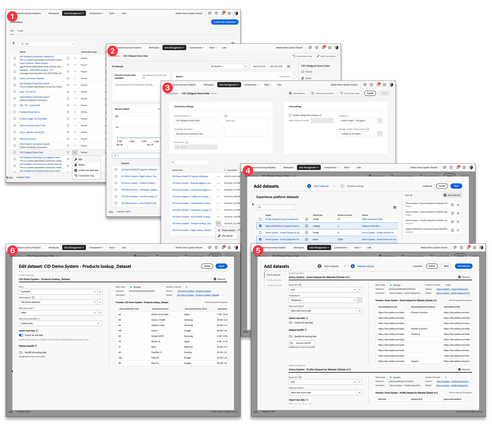

# Verbindungen – Übersicht

Mit Verbindungen können Customer Journey Analytics-Produktadmins definieren, welche [!DNL &#x200B; Experience Platform]-Datenquellen aufgenommen werden, z. B. Ereignis-, Lookup-, Profil- und Zusammenfassungsdatensätze. Verbindungen bilden die Grundlage von Customer Journey Analytics und bestimmen die Verfügbarkeit von Daten (Feldern), die Sie in einer [Datenansicht](/help/data-views/data-views.md) als Dimension oder Metriken definieren können.

>[!IMPORTANT]
>
>Sie können mehrere [!DNL Experience Platform]-Datensätze zu einer Verbindung zusammenfassen.

## Workflow „Verbindungen“

>[!BEGINSHADEBOX]

Siehe  [Verbinden mit Datenquellen](https://experienceleague.adobe.com/de/docs/customer-journey-analytics-learn/tutorials/connections/connecting-customer-journey-analytics-to-data-sources-in-platform){target="_blank"} für ein Demovideo.

>[!ENDSHADEBOX]

Der Workflow „Verbindungen“ bietet Ihnen allgemein die folgenden Möglichkeiten:

| Schnittstelle | Beschreibung |
|:---:|---|
| ➊ | [Verwalten Sie Verbindungen und die allgemeine Nutzung](manage-connections.md) von Customer Journey Analytics über den Verbindungs-Manager. |
| ➋ | [Überprüfen Sie Details einer Verbindung](manage-connections.md#connection-details), z. B. aufgenommene, übersprungene oder gelöschte Datensatzeinträge. |
| ➌ | [Erstellen oder bearbeiten Sie die Konfiguration einer Verbindung](create-connection.md#create-or-edit-a-connection), z. B. eines rollierenden Datenfensters, der zu verwendenden Sandbox, der Datensätze, die Teil der Verbindung sind, usw. |
| ➍ | [Fügen Sie Datensätzen zu einer Verbindung hinzu](create-connection.md#add-datasets). Ihre Verbindung sollte mindestens einen Ereignis- oder Zusammenfassungsdatensatz aufweisen, kann jedoch eine Vielzahl von Ereignis-, Profil-, Lookup- und Zusammenfassungsdatensätzen enthalten. |
| ➎ | [Konfigurieren Sie die Einstellungen](create-connection.md#dataset-settings) für Datensätze, die Sie hinzufügen. Sie können festlegen, wie verschiedene Datensätze basierend auf einer gemeinsamen personenbasierten oder [!BADGE B2B Edition]{type=Informative url="https://experienceleague.adobe.com/de/docs/analytics-platform/using/cja-overview/cja-b2b/cja-b2b-edition" newtab=true tooltip="Customer Journey Analytics B2B Edition"}-kontobasierten Kennung verknüpft werden. |
| ➏ | [Bearbeiten Sie die Einstellungen für einen vorhandenen Datensatz](create-connection.md#edit-a-dataset). Sie können die Datensatzeinstellungen zu einem späteren Zeitpunkt jederzeit erneut aufrufen. |

## Zugriffssteuerung

Der Zugriff auf das Verbindungs-Management sollte auf eine zentrale Management-Gruppe beschränkt sein. Verbindungskonfigurationen haben vertragliche Auswirkungen auf die Volumenzuweisungen von Daten, die in Customer Journey Analytics eingehen.

>[!MORELIKETHIS]
>
>[Zugriffssteuerung](/help/technotes/access-control.md)

