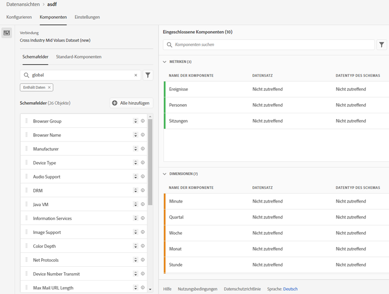

# Standardsuchvorgänge zu Ihren Datensätzen hinzufügen

>[!IMPORTANT]
>Standardsuchvorgänge sind nur für Analytics Data Connector-Datenquellen in CJA verfügbar. Sie können sie nur verwenden, wenn Sie die [Adobe Experience Platform Web SDK](https://experienceleague.adobe.com/docs/experience-platform/edge/home.html) oder den Datenerfassungs-APIs der Experience Platform.

Standardsuchvorgänge (auch als von Adoben bereitgestellte Suchen bezeichnet) verbessern die Fähigkeit von Customer Journey Analytics, Berichte zu bestimmten Dimensionen/Attributen zu erstellen, die für sich allein nicht nützlich sind, aber bei der Verknüpfung mit anderen Daten nützlich sind. Dies können beispielsweise Attribute von Smartphones oder Tablets und Attribute von OS- und Browser-Dimensionen wie etwa die Versionsnummern von Browsern sein. Eine &quot;Standardsuche&quot;ähnelt einem Lookup-Datensatz. Standardsuchvorgänge können in allen Experience Cloud-Unternehmen durchgeführt werden. Sie werden automatisch auf alle Ereignis-Datensätze angewendet, die bestimmte XDM-Schema-Felder enthalten (die jeweiligen Felder finden Sie unten). Für jeden Schema-Speicherort, den die Adobe klassifiziert, gibt es einen standardmäßigen Lookup-Datensatz.

Im herkömmlichen Adobe Analytics werden diese Dimensionen eigenständig angezeigt. In Customer Journey Analytics hingegen müssen Sie diese Dimensionen beim Erstellen von Datenansichten aktiv einbeziehen. Im Workflow Verbindungen wählen Sie einen Datensatz aus, der als ein Datensatz mit einem Schlüssel für die Standardsuche gekennzeichnet ist. In der Benutzeroberfläche &quot;Datenansichten&quot;sind automatisch alle standardmäßigen Lookup-Dimensionen enthalten, die für die Berichterstellung verfügbar sind. Die Lookup-Dateien werden automatisch aktualisiert und stehen für alle Regionen und Accounts zur Verfügung. Sie werden in regionsspezifischen Organisationen gespeichert, die dem Kunden zugeordnet sind.

## Standardsuche mit Adobe Data Connector-Datensätzen verwenden

Standardmäßige Lookup-Datensätze werden zur Berichtszeit automatisch angewendet. Wenn Sie Analytics Data Connector verwenden und eine Dimension einbringen, für die die Adobe eine Standardsuche bereitstellt, wird diese Standardsuche automatisch angewendet. Wenn ein Ereignis-Datensatz XDM-Felder enthält, können wir Standardsuchvorgänge darauf anwenden.

### Verfügbare standardmäßige Suchfelder

* `browser`
   * `browser`, `group_id`, `id`
* `browser_group`
   * `browser_group`, `id`
* `os`
   * `os`, `group_id`, `id`
* `os_group`
   * `os_group`, `id`
* `mobile_audio_support - multi`
* `mobile_color_depth`
* `mobile_cookie_support`
* `mobile_device_name`
* `mobile_device_number_transmit`
* `mobile_device_type`
* `mobile_drm - multi`
* `mobile_image_support - multi`
* `mobile_information_services`
* `mobile_java_vm - multi`
* `mobile_mail_decoration`
* `mobile_manufacturer`
* `mobile_max_bookmark_url_length`
* `mobile_max_browser_url_length`
* `mobile_max_mail_url_length`
* `mobile_net_protocols - multi`
* `mobile_os`
* `mobile_push_to_talk`
* `mobile_screen_height`
* `mobile_screen_size`
* `mobile_screen_width`
* `mobile_video_support - multi`

## Bericht zu standardmäßigen Lookup-Dimensionen

Um über die standardmäßigen Lookup-Dimensionen zu berichten, müssen Sie diese hinzufügen, wenn Sie eine Datenansicht in Customer Journey Analytics erstellen:

Anschließend werden die Lookup-Daten in Workspace angezeigt:

