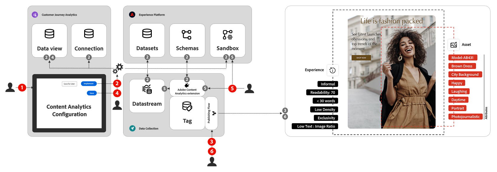

# Konfigurieren von Content Analytics

In diesem Artikel wird allgemein beschrieben, wie Sie Content Analytics konfigurieren.

Bevor Sie Content Analytics konfigurieren, müssen Sie sicherstellen, dass die [Voraussetzungen](#prerequisites) erfüllt sind, dass Sie über die erforderliche [Zugriffssteuerung](#access-control) verfügen und dass Sie die [Einschränkungen](#limitations) kennen.

Die Schritte zum Konfigurieren von Content Analytics sind:

{zoomable="yes"}

1. Verwenden Sie den Assistenten für die [geführte Konfiguration](guided.md) von Content Analytics, der Sie durch alle Schritte führt, die zum Erfüllen der Voraussetzungen für eine Content Analytics-Konfiguration erforderlich sind. Sie können Ihre Konfigurationen jederzeit speichern und zu einem späteren Zeitpunkt dorthin zurückkehren.
1. Sobald Sie mit den Konfigurationswerten zufrieden sind, können Sie die Konfiguration implementieren. Diese Implementierung erstellt alle erforderlichen Artefakte, basierend auf der Konfiguration mit dem Assistenten.
1. Nur wenn Sie [manuell veröffentlichen](manual.md) wird die Tags-Eigenschaft effektiv bereitgestellt und die Datenerfassung gestartet.

1. Sie können nur einige kleinere Änderungen an einer implementierten Konfiguration mithilfe des Assistenten für [geführte Konfigurationen](guided.md) vornehmen, beispielsweise das Ändern der [Datenansicht](/help/data-views/data-views.md).
1. Sie können weitere Änderungen an einer implementierten Konfiguration vornehmen, indem Sie die Adobe Content Analytics-Erweiterung in der zugehörigen Tags-Eigenschaft für [Web](https://experienceleague.adobe.com/de/docs/experience-platform/tags/extensions/client/content-analytics/overview) oder [Mobile](https://developer.adobe.com/client-sdks/solution/adobe-content-analytics/) verwenden.
1. Konfigurationsänderungen werden effektiv bereitgestellt, und die Datenerfassung beginnt nur, wenn Sie die Tags-Eigenschaft manuell erneut veröffentlichen.

## Voraussetzungen

Stellen Sie vor dem Konfigurieren von Content Analytics sicher, dass die folgenden Voraussetzungen erfüllt sind:

### Web

* Sie haben den Benutzeragenten und die IP-Adresse für den in Content Analytics verwendeten Featurisierungs-Service auf die Zulassungsliste gesetzt. Die zu konfigurierende Benutzeragenten-Zeichenfolge lautet: <code>AdobeFeaturization/1.0</code>.
* Wenn Sie das [Web SDK mit JavaScript](https://experienceleague.adobe.com/en/docs/experience-platform/collection/js/install/library){target="_blank"} zur regulären Verhaltensdatenerfassung implementiert haben, stellen Sie sicher, dass Sie den Standardnamen <code>alloy</code> für die JavaScript-Bibliothek verwenden.
* Sie verfügen über die Customer Journey Analytics-Rolle „Produktadministrator“ mit zusätzlichen Berechtigungen zum Verwalten von Verbindungen und Datenansichten.
* Wenn Sie sich entscheiden, Content Analytics-Erlebnisse zu erfassen, stellen Sie sicher, dass Sie die Content Analytics-Versionierung basierend auf Änderungen an Ihren Web-Seiten einrichten und aktualisieren.
* Sie müssen über [Berechtigungen zur Datenerfassung](https://experienceleague.adobe.com/de/docs/experience-platform/collection/permissions){target="_blank"} verfügen.
   * [Experience Platform](https://experienceleague.adobe.com/de/docs/experience-platform/collection/permissions#adobe-experience-platform-permissions){target="_blank"}-Berechtigungen.
   * [Berechtigungen für die Experience Platform](https://experienceleague.adobe.com/de/docs/experience-platform/collection/permissions#adobe-experience-platform-data-collection-permissions){target="_blank"}Datenerfassung.
* Sie haben die folgenden wichtigen Konfigurationsoptionen sorgfältig geprüft:

   * Ihre Site ist für das Reporting zu Erlebnissen geeignet. Ein ordnungsgemäßes Reporting zu Erlebnissen ist nur möglich, wenn die folgenden Bedingungen erfüllt sind:
      * Die Seiten auf der Site müssen unter Verwendung der Seiten-URL reproduzierbar sein.
      * Der Textinhalt, der einer Person angezeigt wird, kann über die Seiten-URL reproduziert werden und hängt nicht von Cookies oder anderen Personalisierungsmechanismen ab.
   * Sie haben ein klares Verständnis davon, welche Seiten Sie für die Inhaltsinteraktionsanalyse und -einblicke erfassen möchten.
   * Sie haben ein klares Verständnis dafür, für welche (Art von) Assets Sie Analysen und Erkenntnisse zur Inhaltsinteraktion erfassen möchten.

### Mobile

* Stellen Sie sicher, dass die Erweiterungen {0](https://developer.adobe.com/client-sdks/edge/edge-network/) Experience Platform Edge Network und [Experience Platform Identity for Edge Network](https://developer.adobe.com/client-sdks/edge/identity-for-edge-network/) für die Mobile App aktiviert sind.[
* Sie verfügen über die Customer Journey Analytics-Rolle „Produktadministrator“ mit zusätzlichen Berechtigungen zum Verwalten von Verbindungen und Datenansichten.
* Sie müssen über [Berechtigungen zur Datenerfassung](https://experienceleague.adobe.com/de/docs/experience-platform/collection/permissions){target="_blank"} verfügen.
   * [Experience Platform](https://experienceleague.adobe.com/de/docs/experience-platform/collection/permissions#adobe-experience-platform-permissions){target="_blank"}-Berechtigungen.
   * [Berechtigungen für die Experience Platform](https://experienceleague.adobe.com/de/docs/experience-platform/collection/permissions#adobe-experience-platform-data-collection-permissions){target="_blank"}Datenerfassung.

## Zugriffssteuerung

>[!IMPORTANT]
>
>Es gibt keine Content Analytics-Berechtigung, die Sie konfigurieren können, um den Content Analytics-Zugriff für einzelne Benutzende oder Benutzergruppen zu aktivieren oder zu deaktivieren.
>

Um einzelnen Benutzenden oder einer Benutzergruppe Zugriff auf Content Analytics zu gewähren, müssen Sie der Person oder der Benutzergruppe den Zugriff auf eine oder mehrere [für Content Analytics konfigurierte Datenansichten](guided.md#data-view) gestatten.

Dieser Zugriff setzt Folgendes voraus:

1. Die für Content Analytics aktivierte Datenansicht ist als Teil der Berechtigungen „Datenansicht“ für ein bestimmtes Customer Journey Analytics-Produktprofil enthalten.
1. Bei diesem Customer Journey Analytics-Produktprofil handelt es sich um eines der Produktprofile, die der Person oder der Benutzergruppe zugewiesen sind.

## Einschränkungen

Das für Content Analytics-Ereignisdaten verwendete Schema ist systemeigen. Ein systemeigenes Schema kann nicht geändert werden, was Folgendes bedeutet:

* Sie können keine Feldgruppen zur Unterstützung von Funktionen wie Geolokalisierung, Bot-Erkennung oder Gerätesuche einbeziehen.
* Sie können keine spezifische Kennung zur Unterstützung von [feldbasiertem Stitching](/help/stitching/fbs.md) hinzufügen.

>[!MORELIKETHIS]
>
>* [Geführte Konfiguration](guided.md)
>* [Manuelle Konfiguration](manual.md)
>* [Zugriffskontrolle](/help/technotes/access-control.md)
>
