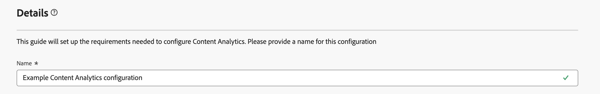
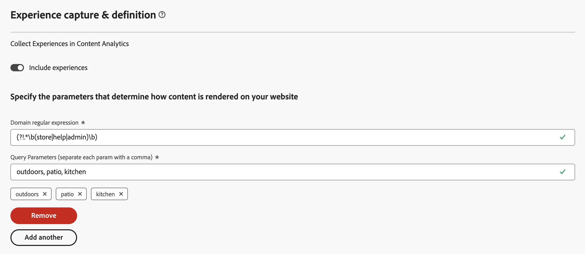

# Geführte Inhaltsanalysekonfiguration

Mit der geführten Konfiguration können Sie die Inhaltsanalyse schnell und einfach konfigurieren. Bei der geführten Konfiguration wird ein Assistent verwendet, um die Anforderungen für die automatische Konfiguration der Inhaltsanalyse für Ihre Organisation festzulegen. Im Bildschirm **[!UICONTROL Konfiguration]** können Sie entweder eine neue Konfiguration erstellen oder eine vorhandene Konfiguration bearbeiten.

>[!IMPORTANT]
>
>Pro Sandbox ist in Ihrer Organisation nur eine Inhaltsanalysekonfiguration möglich.

So greifen Sie auf die Inhaltsanalysekonfiguration zu:

* Wählen Sie aus dem Hauptmenü in Customer Journey Analytics die Option **[!UICONTROL Daten-Management]** > **[!UICONTROL Content Analytics-Konfiguration]** aus.

Im Bildschirm **[!UICONTROL Content Analytics-Konfigurationen]** wird eine Tabelle mit vorhandenen Content Analytics-Konfigurationen angezeigt.

Für jede Konfiguration stehen die folgenden Details zur Verfügung:

| Spalte | Beschreibung |
|---|---|
| **[!UICONTROL Name]** | Der Name der Konfiguration. |
| **[!UICONTROL Erstellt von]** | Das technische Konto, mit dem die Konfiguration erstellt wurde. |
| **[!UICONTROL Erstellt am]** | Der Zeitstempel, wann die Konfiguration erstellt wurde. |
| **[!UICONTROL Geändert am]** | Der Zeitstempel, wann die Konfiguration zuletzt geändert wurde. |
| **[!UICONTROL Sandbox]** | Die Sandbox in der Organisation, in der die Inhaltsanalyse (voraussichtlich) konfiguriert und implementiert wird. |
| **[!UICONTROL Status]** | Der Status der Konfiguration. Folgende Status sind möglich:   **[!UICONTROL Entwurf]**: Die Konfiguration wird für später gespeichert und nicht bereitgestellt.  **[!UICONTROL Fehlgeschlagen]**: Die Konfiguration ist fehlgeschlagen. Sie können **[!UICONTROL Bearbeiten]** auswählen, um Informationen zum Fehler zu erhalten. Adobe kümmert sich proaktiv um jede fehlgeschlagene Implementierung. Weitere Informationen erhalten Sie vom Team der Kundenunterstützung.  **[!UICONTROL Beendet]**: Die Konfiguration wurde abgeschlossen und erfolgreich implementiert. |

Sie können  verwenden, um die Tabelle anzupassen. Legen Sie fest, welche Spalten im Dialogfeld **[!UICONTROL Tabelle anpassen]** angezeigt werden sollen, und wählen Sie **[!UICONTROL Anwenden]** aus, um die Änderungen anzuwenden.

Im Bildschirm **[!UICONTROL Konfiguration]** der Inhaltsanalyse können Sie eine neue Konfiguration erstellen oder eine vorhandene Konfiguration bearbeiten.

So erstellen Sie eine neue Konfiguration:

* Wählen Sie **[!UICONTROL Konfiguration erstellen]** aus. Hierdurch wird der [Assistent für geführte Konfigurationen](#guided-configuration-wizard) geöffnet.

So bearbeiten Sie eine vorhandene Konfiguration:

* Wählen Sie  und dann  **[!UICONTROL Bearbeiten]** für eine vorhandene Inhaltsanalysekonfiguration aus. Hierdurch wird der [Assistent für geführte Konfigurationen](#guided-configuration-wizard) geöffnet.

## Assistent für geführte Konfigurationen

Der Assistent für geführte Konfigurationen besteht aus vier Abschnitten ([Details](#details), [Datenansicht](#data-view), [Erlebniserfassung und -definition](#experience-capture-and-definition) und [Datenerfassung](#data-collection)), in denen Sie jeweils aufgefordert werden, die zum Einrichten und Konfigurieren von Content Analytics erforderlichen Details anzugeben. Schließen Sie jeden Abschnitt ab, bevor Sie zum nächsten Abschnitt wechseln, da einige Einstellungen in einem Abschnitt möglicherweise von den Konfigurationswerten in früheren Abschnitten abhängen.

### Details {#onboarding-details}

<!-- markdownlint-disable MD034 -->

>[!CONTEXTUALHELP]
>id="aca_onboarding_details_button"
>title="Details"
>abstract="Geben Sie einen Namen für die Verbindung an. Geben Sie in den Abschnitten zu **[!UICONTROL Datenansicht]**, **[!UICONTROL Erlebniserfassung und -definition]** und **[!UICONTROL Datenerfassung]** weitere Details an, um sicherzustellen, dass die Inhaltsanalyse korrekt konfiguriert werden kann."

>[!CONTEXTUALHELP]
>id="aca_onboarding_details_name_header"
>title="Details"
>abstract="In dieser Anleitung werden die Anforderungen für die Konfiguration der Inhaltsanalyse festgelegt. Geben Sie einen Namen für diese Konfiguration an"

<!-- markdownlint-enable MD034 -->

Jede Konfiguration erfordert einen eindeutigen Namen. Beispiel: `Example Content Analytics configuration`. Der Name ist zum Speichern oder Implementieren einer Konfiguration erforderlich.

### Datenansicht {#onboarding-data-view}

<!-- markdownlint-disable MD034 -->

>[!CONTEXTUALHELP]
>id="ac_onboarding_dataview_button"
>title="Datenansicht"
>abstract="Für die Konfiguration der Inhaltsanalyse müssen Sie eine vorhandene Datenansicht auswählen. So können Sie Ihre Inhaltsanalysedaten mit anderen Daten zusammenführen."

>[!CONTEXTUALHELP]
>id="aca_onboarding_dataview_header"
>title="Datenansicht"
>abstract="Wählen Sie eine vorhandene Datenansicht aus Customer Journey Analytics aus, mit der Ihre Inhaltsanalysedaten zusammengeführt werden sollen."

>[!CONTEXTUALHELP]
>id="aca_onboarding_dataview_header_alt"
>title="Datenansicht"
>abstract="Wählen Sie eine vorhandene Datenansicht aus Customer Journey Analytics aus, mit der Ihre Inhaltsanalysedaten zusammengeführt werden sollen. "

>[!CONTEXTUALHELP]
>id="aca_onboarding_dataview_change_dialog"
>title="Neue Datenansicht"
>abstract="Die Auswahl einer neuen Datenansicht führt zu einer Aktualisierung dieser Datenansicht, um Metriken und Dimensionen der Inhaltsanalyse einzuschließen. Bei Bedarf wird die zugehörige Verbindung ebenfalls aktualisiert, damit die Datensätze der Inhaltsanalyse berücksichtigt werden. Die Verbindung und Datenansicht, die aktuell für die Inhaltsanalyse konfiguriert sind, werden nicht geändert."

>[!CONTEXTUALHELP]
>id="aca_onboarding_dataview_current_cleanup_labels_dialog"
>title="Bereinigen der ausgewählten Datenansicht"
>abstract="Sie haben eine Datenansicht ausgewählt, die bereits für Content Analytics bereitgestellt ist. Diese vorhandene Content Analytics-Konfiguration wird entfernt und die Datenansicht wird mit Ihrer neuen Konfiguration bereitgestellt."

>[!CONTEXTUALHELP]
>id="aca_onboarding_dataview_prev_cleanup_labels_dialog"
>title="Bereinigen der vorherigen Datenansicht"
>abstract="Sie haben eine neue Datenansicht ausgewählt. Die Content Analytics-Konfiguration für die zuvor ausgewählte Datenansicht wird entfernt."

>[!CONTEXTUALHELP]
>id="aca_onboarding_dataview_new_dialog"
>title="Neue Datenansicht"
>abstract="Sie haben eine neue Datenansicht für diese Konfiguration ausgewählt. Die neue Datenansicht wird aktualisiert, sodass sie die Dimensionen und Metriken der Inhaltsanalyse einschließt. Ähnliche Metriken und Dimensionen werden aus der vorhandenen Datenansicht entfernt. Wenn der neuen Datenansicht eine andere Verbindung zugeordnet ist, wird die Verbindung aktualisiert, sodass sie Datensätze der Inhaltsanalyse einschließt. Beachten Sie, dass Datensätze der Inhaltsanalyse nicht aus der vorhandenen Konfiguration entfernt werden."

<!-- markdownlint-enable MD034 -->

Ihre Konfiguration erfordert die Auswahl einer [Datenansicht](/help/data-views/data-views.md).

1. Auswählen einer Datenansicht

   * Um eine neue Datenansicht für eine Konfiguration auszuwählen, verwenden Sie  **[!UICONTROL Datenansicht auswählen]**.

     

   * Um eine neue Datenansicht für eine Konfiguration zu ändern, wählen Sie  **[!UICONTROL Bearbeiten]** aus.

     

   In beiden Fällen wird das Dialogfeld **[!UICONTROL Datenansicht]** angezeigt, in dem Sie eine Datenansicht für Ihre Konfiguration auswählen können.

   

   Bei einer neuen Konfiguration werden in der Liste nur die Datenansichten angezeigt, die mit Sandboxes ohne aktive Konfiguration verknüpft sind. Außerdem sehen Sie nur Datenansichten, die mit Sandboxes verknüpft sind, auf die Sie Zugriff haben, und Verbindungen, die Sie ändern dürfen.

   Wenn Sie eine vorhandene Konfiguration bearbeiten, werden in der Liste nur Datenansichten angezeigt, die in der Sandbox verfügbar sind, die bereits mit der vorhandenen Konfiguration verknüpft ist.

   Folgende Aktionen können durchgeführt werden:

   * Um nach einem bestimmten Datensatz zu suchen, verwenden Sie das Suchfeld .
   * Um die Liste der verfügbaren Datenansichten zu filtern, wählen Sie  aus. Sie können die Liste nach [!UICONTROL Verbindung], [!UICONTROL Inhaberin oder Inhaber] und [!UICONTROL Sandbox] filtern. Verwenden Sie  **[!UICONTROL Ausblenden von]**, um den Segmentbereich auszublenden.
   * Um zu definieren, welche Spalten in der Tabelle angezeigt werden sollen, wählen Sie  aus. Wählen Sie aus, welche Spalten im Dialogfeld **[!UICONTROL Tabelle anpassen]** angezeigt werden sollen, und wählen Sie **[!UICONTROL Anwenden]** aus, um die Änderungen anzuwenden.

1. Wählen Sie mit  die Datenansicht aus, die verwendet werden soll.
1. Wählen Sie **[!UICONTROL Speichern]** aus, um die ausgewählte Datenansicht zu bestätigen. Wählen Sie zum Abbrechen **[!UICONTROL Abbrechen]** aus.

In Customer Journey Analytics ist eine [Datenansicht](/help/data-views/data-views.md) an eine Customer Journey Analytics-[Verbindung](/help/connections/overview.md) gebunden. Und eine Verbindung basiert auf einer Sandbox in Ihrer Organisation. Nachdem Sie die Konfiguration gespeichert haben **[!UICONTROL wird]** Feld „Sandbox“ basierend auf der ausgewählten Datenansicht automatisch mit dem Namen der Sandbox ausgefüllt.

### Erlebniserfassung und -definition {#onboarding-experiences}

<!-- markdownlint-disable MD034 -->

>[!CONTEXTUALHELP]
>id="aca_onboarding_experiences_button"
>title="Erlebniserfassung und -definition"
>abstract="Sie können auswählen, dass Erlebnisse in die mit Content Analytics erfassten Daten eingeschlossen werden. Wenn diese Option aktiviert ist, müssen Sie eine oder mehrere Kombinationen aus einem regulären Ausdruck und Abfrageparametern definieren, um festzulegen, für welche URLs Erlebnisse eingeschlossen werden sollen."

>[!CONTEXTUALHELP]
>id="aca_onboarding_experiences_header"
>title="Erlebniserfassung und -definition"
>abstract="Erfassen von Erlebnissen in der Inhaltsanalyse"

>[!CONTEXTUALHELP]
>id="aca_onboarding_experiences_parameters_header"
>title="Erlebniserfassung und -definition"
>abstract="Geben Sie die Parameter an, die bestimmen, wie Inhalte auf Ihrer Website gerendert werden."

>[!CONTEXTUALHELP]
>id="aca_onboarding_experiencecapture_new_include_experiences"
>title="Erlebniserfassung und -definition"
>abstract="Wenn diese Option aktiviert ist, werden Erlebnisdaten erfasst und Erlebnisattribute generiert. Außerdem sind Erlebnisberichte verfügbar."

>[!CONTEXTUALHELP]
>id="aca_onboarding_experiencecapture_edit_include_experiences"
>title="Erlebniserfassung und -definition"
>abstract="Wenn diese Option aktiviert ist, werden Erlebnisdaten erfasst und Erlebnisattribute generiert. Außerdem sind Erlebnisberichte verfügbar.   Verwenden Sie  **[!UICONTROL Bearbeiten]**, um die Datenerfassungskonfiguration für Erlebnisse in der Tags-Eigenschaft zu ändern, die mit der aktuellen Konfiguration verknüpft ist."

>[!CONTEXTUALHELP]
>id="aca_onboarding_experiencecapture_edit_button"
>title="Erlebniserfassung und -definition"
>abstract="Sie müssen die Einstellungen für die Erlebnisdatenerfassung in der Adobe Content Analytics-Erweiterung bearbeiten."

<!-- markdownlint-enable MD034 -->

In diesem Abschnitt können Sie auswählen, dass Erlebnisse in die mit Content Analytics erfassten Daten eingeschlossen werden.  Ein Erlebnis ist der gesamte Text auf einer Web-Seite, der anhand der URL reproduzierbar ist, die die Benutzerin bzw. der Benutzer verwendet hat, die bzw. der diese Web-Seite ursprünglich besucht hat.

Standardmäßig ist **[!UICONTROL Erlebnisse einschließen]** deaktiviert. Wenn diese Option aktiviert ist, müssen Sie festlegen, für welche URLs Erlebnisse eingeschlossen werden sollen.

Ziehen Sie das Einschließen von Erlebnissen nur in Betracht, wenn Folgendes zutrifft:

* Die Seiten auf der Site müssen unter Verwendung der Seiten-URL reproduzierbar sein.
* Der Textinhalt, der von einem bestimmten Benutzer angezeigt wird, kann mithilfe der Seiten-URL reproduziert werden und hängt nicht von Cookies oder anderen Personalisierungsmechanismen ab.

>[!IMPORTANT]
>
>Implementieren Sie die [Content Analytics](manual.md#versioning)Versionierung, um Änderungen zu erfassen, die Sie an den Erlebnissen (Seiten) vornehmen, die Content Analytics unterliegen.

#### Neue Konfiguration {#new-experiences-configuration}

So schließen Sie Erlebnisse in eine neue oder nicht implementierte Konfiguration ein:

1. Aktivieren Sie **[!UICONTROL Erlebnisse einschließen]**. Das Umschalten zum Aktivieren von Erlebnissen wirkt sich auf Folgendes aus:

   * die Datenerfassung in der Content Analytics-Erweiterung
   * den Prozess, der Erlebnisattribute aus Content Analytics-Ereignisdaten generiert
   * die Berichtsvorlage in Customer Journey Analytics

1. Geben Sie die Parameter an, die bestimmen, wie Inhalte auf Ihrer Website gerendert werden. Bei den Parametern handelt es sich, falls welche vorhanden sind, um Kombinationen aus einem **[!UICONTROL regulären Domain-Ausdruck]** und **[!UICONTROL Abfrageparametern]**. Die Abfrageparameter geben an, welche Parameter sich auf den Inhalt auf Ihrer Seite auswirken. Mit dieser Eingabe kann Content Analytics alle Parameter ignorieren, die sich nicht auf den Inhalt der Seite auswirken, wenn ein eindeutiges Erlebnis definiert wird.
   1. Geben Sie einen **[!UICONTROL regulären Domain-Ausdruck]** ein, z. B. `/^(?!.*\b(store|help|admin)\b)/`. Stellen Sie sicher, dass Sie reguläre Ausdrücke mit dem Escape-Zeichen `/` versehen. Der reguläre Ausdruck der Domain gibt an, für welche URLs diese Parameter gelten. Beispielsweise können Sie über mehrere Sites verfügen, bei denen für jede Site der Inhalt durch andere Parameter gesteuert wird. Wenn die Abfrageparameter für alle Ihre Seiten gelten, können Sie `.*` verwenden, um alle Seiten anzugeben.
   1. Geben Sie eine durch Kommas getrennte Liste von **[!UICONTROL Abfrageparametern]** an, z. B. `outdoors, patio, kitchen`.
1. Wählen Sie **[!UICONTROL Entfernen]** aus, wenn Sie eine Kombination aus regulärem Domain-Ausdruck und Abfrageparametern entfernen möchten.
1. Wählen Sie **[!UICONTROL Regulären Ausdruck hinzufügen]** aus, wenn Sie eine weitere Kombination aus einem regulären Ausdruck und Abfrageparametern hinzufügen möchten.

#### Implementierte Konfiguration {#implemented-experiences-configuration}

So bearbeiten Sie vorhandene Erlebnisse oder schließen neue Erlebnisse in eine implementierte Konfiguration ein:

* Schalten Sie **[!UICONTROL Erlebnisse einschließen]** um:

   * den Prozess, der Erlebnisattribute aus Content Analytics-Ereignisdaten generiert
   * die Berichtsvorlage in Customer Journey Analytics

* Wählen Sie  **[!UICONTROL Bearbeiten]** aus, um die Konfiguration der Datenerfassung für Erlebnisse in Content Analytics weiter zu bearbeiten. Sie werden zur [Adobe Content Analytics-Erweiterung](https://experienceleague.adobe.com/en/docs/experience-platform/tags/extensions/client/content-analytics/overview#configure-event-segmenting) in der Tags-Eigenschaft weitergeleitet, die mit der aktuellen Konfiguration verknüpft ist.

### Datenerfassung {#onboarding-data-collection}

In diesem Abschnitt können Sie konfigurieren, wie die Daten Ihrer Inhaltsanalyse erfasst werden sollen.  

<!-- markdownlint-disable MD034 -->

>[!CONTEXTUALHELP]
>id="aca_onboarding_datacollection_button"
>title="Datenerfassung"
>abstract="Definieren Sie, welche Tag-Eigenschaft verwendet werden soll, oder erstellen Sie eine neue. Definieren Sie zudem mithilfe regulärer Ausdrücke die ein- oder auszuschließenden Seiten und Assets."

>[!CONTEXTUALHELP]
>id="aca_onboarding_datacollection_tag_header"
>title="Datenerfassung"
>abstract="**Angeben einer Tag-Eigenschaft**"

>[!CONTEXTUALHELP]
>id="aca_onboarding_datacollection_pages_excluded_boldheader"
>title="Datenerfassung"
>abstract="**Einzuschließende/auszuschließende Seiten**"

>[!CONTEXTUALHELP]
>id="aca_onboarding_datacollection_pages_excluded_header"
>title="Datenerfassung"
>abstract="Geben Sie an, welche Seiten bei der Datenerfassung zur Inhaltsanalyse **eingeschlossen** oder **ausgeschlossen** werden sollen"

>[!CONTEXTUALHELP]
>id="aca_onboarding_datacollection_assets_excluded_boldheader"
>title="Datenerfassung"
>abstract="**Einzuschließende/auszuschließende Assets**"

>[!CONTEXTUALHELP]
>id="aca_onboarding_datacollection_assets_excluded_header"
>title="Datenerfassung"
>abstract="Geben Sie an, welche Assets bei der Datenerfassung zur Inhaltsanalyse **eingeschlossen** oder **ausgeschlossen** werden sollen"

>[!CONTEXTUALHELP]
>id="aca_onboarding_datacollection_experiences_edit_button"
>title="Datenerfassung"
>abstract="Sie können die Einstellungen für Seiten in der Adobe-Erweiterung für die Inhaltsanalyse in der Tag-Eigenschaft bearbeiten, die mit der aktuellen Konfiguration verknüpft ist."

>[!CONTEXTUALHELP]
>id="aca_onboarding_datacollection_assets_edit_button"
>title="Datenerfassung"
>abstract="Sie können die Einstellungen für Assets in der Adobe-Erweiterung für die Inhaltsanalyse in der Tag-Eigenschaft bearbeiten, die mit der aktuellen Konfiguration verknüpft ist."

>[!CONTEXTUALHELP]
>id="aca_onboarding_datacollection_tags_disabled_description "
>title="Tag-Eigenschaft deaktiviert"
>abstract="Content Analytics-Erweiterung ist bereits aktiv."

<!-- markdownlint-enable MD034 -->

#### Neue Konfiguration {#new-configuration}

In einer neuen Konfiguration müssen Sie festlegen, ob Sie eine vorhandene Tag-Eigenschaft verwenden oder eine neue Tag-Eigenschaft erstellen möchten. Außerdem müssen Sie mithilfe regulärer Ausdrücke festlegen, welche Seiten und Assets ein- oder ausgeschlossen werden sollen.

* Verwenden einer vorhandenen Tag-Eigenschaft:

  

   1. Wählen Sie **[!UICONTROL Vorhandene auswählen]**.
   2. Wählen Sie eine vorhandene Eigenschaft aus dem Dropdown **[!UICONTROL Menü „Eigenschaft]** Tags“ aus. Sie können mit der Eingabe beginnen, um nach den verfügbaren Optionen zu suchen und diese zu beschränken. Sie können keine Tags-Eigenschaft auswählen, die bereits von einer anderen implementierten Content Analytics-Konfiguration verwendet wird.

* Erstellen einer neuen Tags-Eigenschaft:

  

   1. Wählen Sie **[!UICONTROL Neu erstellen]** aus.
   1. Geben Sie einen **[!UICONTROL Tags-Namen]** an, z. B. `ACA Test for Documentation`.
   1. Geben Sie **[!UICONTROL Domains]** an, z. B. `example.com`.

* Geben Sie an, welche Seiten bei der Datenerfassung für Content Analytics ein- oder ausgeschlossen werden sollen.

  Geben Sie eine Zeichenfolge für reguläre Ausdrücke für **[!UICONTROL Einzuschließende/auszuschließende Seiten]** an.  Beispiel: `^(?!.*documentation).*`, um alle Dokumentationsseiten aus Content Analytics auszuschließen.

* Geben Sie an, welche Assets bei der Datenerfassung zur Inhaltsanalyse ein- oder ausgeschlossen werden sollen.

  Geben Sie eine Zeichenfolge für reguläre Ausdrücke für **[!UICONTROL Einzuschließende/auszuschließende Assets]** an.  Beispiel: `^(?!.*(logo\.jpg|\.svg)).*$`, um alle Logo-Bilder im JPEG- und SVG-Format aus Content Analytics auszuschließen.

>[!IMPORTANT]
>
>Entfernen Sie manuell die automatisch eingeschlossene Web SDK-Erweiterung aus der neu erstellten Tags-Eigenschaft, falls Sie über eine bestehende Web SDK-Implementierung verfügen, die die [JavaScript](https://experienceleague.adobe.com/de/docs/experience-platform/web-sdk/install/library)Bibliothek anstelle der [Tags-Erweiterung) ](https://experienceleague.adobe.com/de/docs/experience-platform/tags/extensions/client/web-sdk/web-sdk-extension-configuration).
>

#### Vorhandene Konfiguration {#existing-configuration}

Sie können die Tags-Eigenschaft für eine vorhandene Konfiguration nicht bearbeiten. Sie können jedoch die Seiten und Assets bearbeiten, die ein- oder ausgeschlossen werden sollen.

* Um zu bearbeiten, welche Seiten bei der Datenerfassung für Content Analytics ein- oder ausgeschlossen werden sollen, wählen Sie  **[!UICONTROL Bearbeiten]** unter **[!UICONTROL Erlebnis]** aus. Sie werden zur [Adobe Content Analytics-Erweiterung](https://experienceleague.adobe.com/en/docs/experience-platform/tags/extensions/client/content-analytics/overview#configure-event-segmenting) weitergeleitet, die mit der Tags-Eigenschaft für die aktuelle Content Analytics-Konfiguration verknüpft ist. Sie können den regulären Ausdruck bearbeiten, um Seiten ein- oder auszuschließen. Achten Sie darauf, Ihre Änderungen zu [veröffentlichen](#publish).

* Um zu bearbeiten, welche Assets bei der Datenerfassung für Content Analytics ein- oder ausgeschlossen werden sollen, wählen Sie  **[!UICONTROL Bearbeiten]** unter **[!UICONTROL Asset]** aus. Sie werden zur [Adobe Content Analytics-Erweiterung](https://experienceleague.adobe.com/en/docs/experience-platform/tags/extensions/client/content-analytics/overview#configure-event-segmenting) weitergeleitet, die mit der Tags-Eigenschaft für die aktuelle Content Analytics-Konfiguration verknüpft ist. Sie können den regulären Ausdruck bearbeiten, um Assets ein- oder auszuschließen. Achten Sie darauf, Ihre Änderungen zu [veröffentlichen](#publish).

### Zusammenfassung {#summary}

Nachdem Sie alle erforderlichen Details angegeben haben, werden die Informationen zu den erstellten oder geänderten Artefakten in einer Zusammenfassung aufgeführt.

* Beim Implementieren einer neuen Konfiguration wird Ihnen die Zusammenfassung **[!UICONTROL Sie sind fast bereit, _Konfigurationsname_ für die Inhaltsanalyse zu implementieren]** angezeigt.

* Für vorhandene implementierte Konfigurationen wird die Zusammenfassung **[!UICONTROL Sie haben _Konfigurationsname_ für die Inhaltsanalyse implementiert]** angezeigt.

### Aktionen {#actions}

<!-- markdownlint-disable MD034 -->

>[!CONTEXTUALHELP]
>id="aca_onboarding_implementation_warning_dialog"
>title="Bestätigung der Implementierung"
>abstract="Wenn Sie **[!UICONTROL Implementieren]** auswählen, konfigurieren Sie die Inhaltsanalyse basierend auf den in diesem Workflow getätigten Eingaben. Standardmäßig werden mehrere Einstellungen auf Grundlage dessen ausgewählt, was im Allgemeinen für die Inhaltsanalyse nützlich ist. Als für die Daten verantwortliche Person müssen Sie jedoch die Einstellungen der einzelnen Artefakte überprüfen, um zu bestätigen, dass die Einstellungen in Übereinstimmung mit Ihrer Datenschutzrichtlinie, Ihren vertraglichen Rechten und Pflichten sowie den Einverständnisanforderungen nach geltendem Recht implementiert werden.  Beachten Sie, dass Daten erst dann erfasst werden, wenn die mit dieser Konfiguration verknüpfte Tag-Bibliothek manuell veröffentlicht wird.  Um Bild- und Textattribute abzuleiten, ruft Adobe die Attribute ab, und zwar mithilfe:<ol><li>Die URL der Seite, die zum Zeitpunkt des Site-Besuchs des Benutzers gemäß den von Ihnen konfigurierten Datenerfassungseinstellungen erfasst wurde, und</li><li>der URL, unter der das Bild gehostet wird.</li></ol>Bilder, die auf Websites von Drittanbietern gehostet werden, dürfen nicht mit Tags versehen werden."

<!-- markdownlint-enable MD034 -->

Wenn Sie eine Konfiguration erstellen oder bearbeiten, haben Sie die folgenden Optionen:

* **[!UICONTROL Verwerfen]**: Alle im Rahmen der Konfiguration vorgenommenen Änderungen werden verworfen.
* **[!UICONTROL Für später speichern]**: Änderungen an einer Konfiguration werden gespeichert. Sie können die Konfiguration zu einem späteren Zeitpunkt erneut aufrufen, um weitere Änderungen vorzunehmen, oder die Konfiguration implementieren. Zum Speichern einer Konfiguration ist lediglich ein Wert für [!UICONTROL Name] erforderlich.
* **[!UICONTROL Implementieren]**: Einstellungen für oder Änderungen an einer Konfiguration werden gespeichert und implementiert. Alle als  markierten Felder müssen über geeignete Werte verfügen. Die Implementierung besteht aus Folgendem:

   * **[!UICONTROL Customer Journey Analytics-Konfiguration]**:
      * Die ausgewählte Datenansicht wird aktualisiert, um die Content Analytics-Dimension und -Metriken einzuschließen.
      * Die mit der ausgewählten Datenansicht verknüpfte Verbindung wird geändert, um Ereignis- und Attributdatensätze von Content Analytics einzuschließen.
      * Eine Content Analytics-Berichtsvorlage wird zu Workspace hinzugefügt.

   * **[!UICONTROL Adobe Experience Platform-Konfiguration]**:
      * Die Erstellung von Schemata zur Modellierung von Inhaltsanalyse-Ereignissen, Asset-Attributen und (sofern konfiguriert) Erlebnisattributen.
      * Die Erstellung von Datensätzen zur Erfassung von Inhaltsanalyse-Ereignissen, Asset-Attributen und (sofern konfiguriert) Erlebnisattributen.
      * Die Erstellung eines Datenflusses, der den Featurisierungs-Service verwendet, um Inhaltsattribute aus Content Analytics-Ereignissen zu generieren und zu aktualisieren.

   * **[!UICONTROL Konfiguration der Datenerfassung]**:
      * Die neue oder vorhandene Tags-Eigenschaft ist so konfiguriert, dass sie die Content Analytics-Datenerfassung unterstützt. Diese Konfiguration impliziert die Einbeziehung der Inhaltsanalyse-Erweiterung von Adobe für Tags.
      * Ein Datenstrom wird für Inhaltsanalyse-Ereignisse erstellt.
      * Die Inhaltsanalyse-Erweiterung von Adobe ist so konfiguriert, dass Inhaltsanalyse-Ereignisse an den Datenstrom für die Inhaltsanalyse gesendet werden.
      * Wenn das Web SDK nicht für die Tags-Eigenschaft konfiguriert ist, wird eine neue Web SDK-Konfiguration erstellt, um ausschließlich Inhaltsanalyse-Ereignisse zu senden.
      * Wenn das Web SDK für diese Tags-Eigenschaft konfiguriert ist, werden an der vorhandenen Konfiguration des Web SDK keine Änderungen vorgenommen.

* **[!UICONTROL Speichern]**: Änderungen an einer implementierten Konfiguration werden gespeichert und die Implementierung wird aktualisiert.
* **[!UICONTROL Beenden]**: Die geführte Konfiguration wird beendet. Alle Änderungen an einer implementierten Konfiguration werden verworfen.

## Veröffentlichen {#publish}

Um Daten für Ihre Content Analytics-Konfiguration zu erfassen, müssen Sie die nach der Auswahl von **[!UICONTROL Implementieren]** erstellte Tags-Eigenschaft [manuell](manual.md) veröffentlichen.

>[!MORELIKETHIS]
>
>[Manuelle Konfiguration](manual.md)
>
