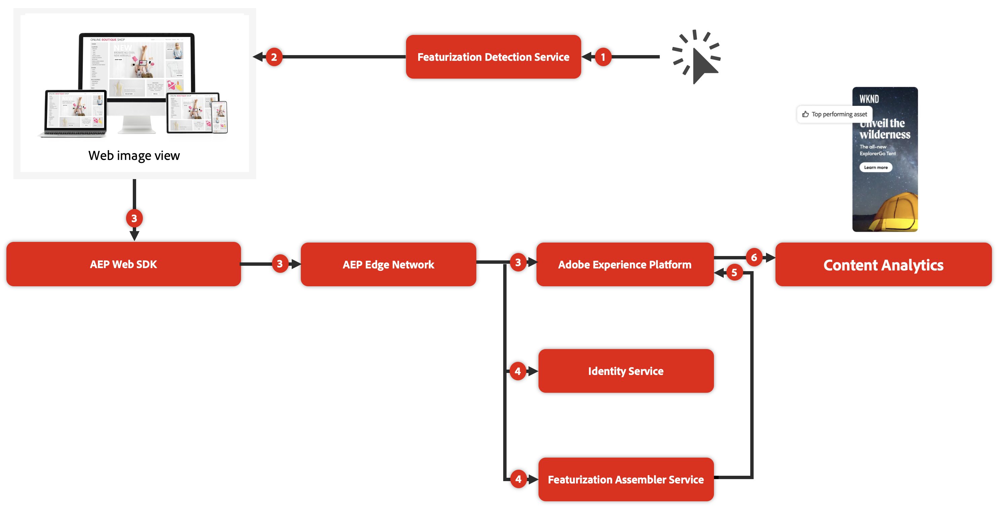

# Übersicht über die Inhaltsanalyse

<!-- 
This is a placeholder article for upcoming Content Analytics documentation. Currently used to set up contextual help entries for developer working on onboarding UI and workspace UI 
-->

>[!WARNING]
>
>Dieser Artikel ist eine vorläufige inoffizielle Entwurfsversion einer kommenden endgültigen Version und Teil der Inhaltsanalysedokumentation. Alle Inhalte unterliegen Änderungen und es können keinerlei rechtlichen Verpflichtungen aus der aktuellen Version dieses Artikels abgeleitet werden.
>

{#release-limited-testing}

Mit der Inhaltsanalyse können Marketing-Fachleute verstehen, wie sich Inhalte auf die von einem Unternehmen definierten wichtigsten Leistungsindikatoren auswirken. Zusätzlich zu den herkömmlichen auf Mikroebene basierenden Funktionen zum Testen von Inhaltsfragmenten (z. B. A/B-Tests) bietet Content Analytics Einblicke, wie Inhalte die Wirkung auf Makroebene steigern. Reagieren Kunden beispielsweise besser auf einen bestimmten Tonfall, eine bestimmte Farbpalette oder bestimmte Themen?

Content Analytics verwendet eine auf KI und maschinellem Lernen basierende **Feature**), um Inhalte in Komponenten und Attribute aufzuteilen. Durch die Erstellung eines strukturierten Metadatenprofils für alle Ihre Inhalte können Sie analysieren, welche Inhalte und welche Attribute dieser Inhalte zu Geschäftsergebnissen führen.

Zusätzlich zur Erstellung dieses strukturierten Metadatenprofils bietet Content Analytics einen **Identity-Service** der Assets und Erlebnisse mithilfe einer einzigen Kennung identifiziert. Der Identity Service versteht, ob beispielsweise die Größe eines Assets geändert, zugeschnitten oder in einem anderen Dateiformat gespeichert wurde. Der Service weist alle Varianten dieses Assets derselben einzelnen Kennung zu. Daher ermöglicht Ihnen der Identity Service, die Leistung eines Assets basierend auf seinen verschiedenen Formularen und Platzierungen zu aggregieren.

## Wert

Inhaltsanalysen bieten einen Mehrwert auf steigender Ebene:

1. Content **Nutzung**: Mit Content Analytics erhalten Sie Einblicke darüber, welche Assets Impressionen erhalten und wo Assets Impressionen erhalten. Diese Einblicke helfen Ihnen zu erkennen, ob Assets in Ihren Web-Eigenschaften zu wenig oder zu häufig verwendet werden.
1. Inhalte **Interaktionen**: Inhaltsanalysen können Interaktionseinblicke bieten, wie z. B. die durchschnittliche Klickrate für Assets mit bestimmten Attributen. Diese Einblicke helfen Ihnen festzustellen, ob bestimmte Arten von Erlebnissen weiterhin effektiv sind.
1. Inhalt **Journey**: Darüber hinaus können Sie in Kombination mit allen anderen auf Experience Platform verfügbaren Daten zusätzliche Einblicke in Ihre Inhalts-Journey erhalten. Zum Beispiel, ob bestimmte Inhalte zusätzlich zur Interaktion zu Konversionen führen. Und mit diesem Wissen können Sie den ROI für verschiedene Inhaltstypen bestimmen.
1. Content **Personalization**: Mit Content Analytics können Sie letztendlich anhand Ihrer Einblicke handeln und diese Einblicke verwenden, um zu bestimmen, wie Sie Geld für Inhalte ausgeben. Sollte ich beispielsweise bestimmte Inhaltstypen an bestimmte Zielgruppen senden? Welche Inhalte bieten mir Möglichkeiten zur Personalisierung?

## Terminologie

Content Analytics verwendet die folgenden Schlüsselbegriffe:

* **Erlebnis**: Ein Erlebnis ist der gesamte Text auf einer Web-Seite, der anhand der URL reproduzierbar ist, die der Benutzer verwendet hat, der diese Web-Seite ursprünglich besucht hat. Jedes Erlebnis erhält eine eindeutige Kennung.
* **Asset**: Ein Asset ist ein individuelles und eindeutiges Inhaltselement, z. B. ein Bild. Jedes Asset erhält außerdem eine eindeutige Kennung.
* **Attribut**: Ein Attribut ist ein beschreibendes Metadatenelement, das mit einem Erlebnis oder Asset verknüpft ist. Beispiele für ein Attribut sind: Stil der Fotografie, Lesbarkeit, Überzeugungsstrategie, Objektfarbe, Hintergrundfarbe.

## Funktionsweise

Content Analytics verwendet Web-Bildansichtsdaten, die in Ereignisdatensätzen im Experience Platform erfasst werden. Diese Daten können mithilfe der verschiedenen verfügbaren Methoden erfasst werden: Experience Platform-Edge Network (Web SDK, Server-API) oder Analytics-Quell-Connector.

1. Der Teil der Erkennung des Feature Service wird bei jedem neuen Schnappschuss der Daten ausgelöst, der in einem Content Analytics-fähigen Ereignisdatensatz eingeht.
1. Der Service zur Erkennung von Funktionen bestimmt, welche Daten in diesem Schnappschuss für die Inhaltsanalyse relevant sind, und betrachtet das Erlebnis und die Assets dieser Web-Bildansichten erneut.
1. Beim erneuten Besuch werden bestimmte Inhaltsanalysedaten über eine ordnungsgemäße Konfiguration des Experience Platform Web SDK- und Experience Platform-Edge Networks erfasst. Anschließend werden die Daten an einen dedizierten Inhaltsanalysedatensatz und relevante Lookup-Datensätze gesendet.
1. Der Assembler-Service für Funktionen und der Identity Service verarbeiten die erneut besuchten Daten.
1. Die Ergebnisse dieser Services (Komponenten, Attribute und Identitäten) werden verwendet, um die relevanten spezifischen Content-Analytics-Datensätze im Experience Platform zu aktualisieren.
1. Die Inhaltsanalysedaten können dann zusammen mit Verhaltensdaten und anderen Lookup-Datensätzen in einer Customer Journey Analytics-Konfiguration (Verbindung, Datenansicht und Workspace) verwendet werden. Diese Konfiguration bildet die Grundlage für die einzigartigen Einblicke auf Makroebene in Ihren Inhalt.

>[!MORELIKETHIS]
>
>[Content Analytics-Reporting](#report/report.md)
>[Konfigurieren von Inhaltsanalysen](config/configuration.md)
