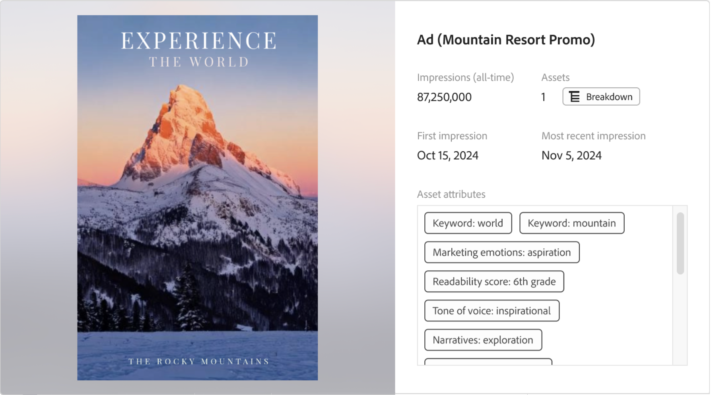

# Überblick über das Content Analytics-Reporting

Sie erstellen Berichte, führen Analysen durch und erhalten Einblicke in die [!DNL Content Analytics] in [Analysis Workspace](/help/analysis-workspace/home.md). Eine bestimmte Workspace-[Vorlage](#template) ist verfügbar, sodass Sie sofort auf ein vorausgefülltes Workspace-Projekt mit relevanten Inhalten zugreifen können.

Gehen Sie wie folgt vor, um einen neuen Content Analytics-Bericht zu erstellen:

1. Erstellen Sie ein [neues Projekt](/help/analysis-workspace/build-workspace-project/create-projects.md) oder öffnen Sie ein [vorhandenes Projekt](/help/analysis-workspace/build-workspace-project/open-projects.md) in Workspace.
1. Stellen Sie sicher, dass Sie für das Content Analytics-Reporting eine [Datenansicht auswählen](/help/analysis-workspace/c-panels/panels.md#data-view). Das Content Analytics-Reporting ist nur für Datenansichten verfügbar, die für Content Analytics [konfiguriert](/help/content-analytics/config/configuration.md) sind.
1. Ziehen Sie Tabelle[/Freiformtabelle](/help/analysis-workspace/visualizations/freeform-table/freeform-table.md) auf die Arbeitsfläche.
1. Verwenden Sie [spezifische Content Analytics-Komponenten](components.md) und andere allgemeine [Komponenten](/help/components/overview.md) (wie Segmente, Datumsbereiche, Anmerkungen), um Erkenntnisse zu Content Analytics zu erhalten.
1. Verwenden Sie andere [Visualisierungen](/help/analysis-workspace/visualizations/freeform-analysis-visualizations.md), um Ihr Projekt zu verbessern.

## Miniaturen

Basierend auf den Content Analytics-spezifischen Dimensionen, die Sie in Ihrem Projekt verwenden, werden Miniaturansichten in den folgenden Visualisierungen angezeigt:

### Freiformtabelle

Standardmäßig werden Miniaturansichten in einer [Freiformtabelle“ ](/help/analysis-workspace/visualizations/freeform-table/freeform-table.md). So konfigurieren Sie die Anzeige von Miniaturen für eine Content Analytics-Dimension:

* Bewegen Sie den Mauszeiger über eine Kopfzeile für eine Content Analytics-Dimension, z. B. **[!UICONTROL Asset-IDs]** oder **[!UICONTROL Erlebnis-IDs]**.
* Wählen Sie  aus.
* Aktivieren oder deaktivieren Sie im Popup **[!UICONTROL Zeileneinstellungen]** unter **[!UICONTROL Einstellungen]** die Option **[!UICONTROL Miniaturansichten anzeigen]**.

### Balken (gestapelt) und Horizontalbalken (gestapelt)

Miniaturen werden als Teil der Legende auf der vertikalen oder horizontalen Achse angezeigt. Miniaturen werden auch angezeigt, wenn Sie den Mauszeiger über eine Leiste in einem [Balken (gestapelt)](/help/analysis-workspace/visualizations/bar.md) und [horizontalen Balken (gestapelt)](/help/analysis-workspace/visualizations/horizontal-bar.md) bewegen.

### Streuung

Miniaturansichten werden angezeigt, wenn Sie den Mauszeiger über einen Datenpunkt in einer [Streuung](/help/analysis-workspace/visualizations/scatterplot.md) bewegen.

### Linie

Miniaturen werden angezeigt, wenn Sie den Mauszeiger über einen Datenpunkt in einer [ bewegen](/help/analysis-workspace/visualizations/line.md).

## Vorschau

Sie können ein Vorschaufenster öffnen. Gehen Sie dazu wie folgt vor:

* Wählen Sie  in einer [Freiformtabelle](#freeform-table) aus.
* Wählen Sie einen bestimmten Balken in einer [Balken](#bar-and-horizontal-bar) oder [horizontalen Balken](#bar-and-horizontal-bar) Visualisierung oder einen Datenpunkt in [Streuvisualisierung](#scatter).

Es werden die folgenden Details angezeigt.

| Erlebnisvorschau | Asset-Vorschau |
|---|---|
|  |  |
| Name der Dimension (z. B. **[!UICONTROL Erlebnis-ID])** | Name der Asset-Dimension (z. B. **[!UICONTROL Asset-ID])** |
| **[!UICONTROL Impressions (gesamte Zeit)]**: Anzahl der Impressions für das Erlebnis. | **[!UICONTROL Impressions (gesamte Zeit)]**: Anzahl der Impressions für das Asset. |
| **[!UICONTROL Assets]**: Anzahl der Assets, die dieses Erlebnis umfasst.  Wählen Sie  **[!UICONTROL Aufschlüsselung]** aus, um die Assets zu überprüfen. | **[!UICONTROL Erlebnisse]**: Anzahl der Erlebnisse, bei denen dieses Asset angezeigt wird.  Wählen Sie  **[!UICONTROL Aufschlüsselung]** aus, um die Assets zu überprüfen. |
| **[!UICONTROL Erste Impression]**: Datum der ersten Impression des Erlebnisses. | **[!UICONTROL Erste Impression]**: Datum der ersten Impression des Assets. |
| **[!UICONTROL Letzte Impression]**: Datum der letzten Impression des Erlebnisses. | **[!UICONTROL Letzte Impression]**: Datum der letzten Impression des Assets. |
| **[!UICONTROL Erlebnisattribute]**: Die [Attribute](/help/content-analytics/report/components.md#experience-attributes) des Erlebnisses. | **[!UICONTROL Asset-Attribute]**: Die [Attribute](/help/content-analytics/report/components.md#asset-attributes) des Assets. |

## Vorlage

Eine Content Analytics [Vorlage](/help/analysis-workspace/templates/use-templates.md) ist verfügbar, die Ihnen dabei hilft zu erfahren, welche Inhalte und Inhaltsattribute am besten funktionieren. Die Vorlage ist Teil des Anwendungsfalls [Web-Kanal und Interaktion](/help/analysis-workspace/templates/use-templates.md#web-engagement) und beschreibt, wie Ihre Inhalte auf granularer Ebene abschneiden. Sie können die Leistung einzelner Assets oder bestimmter Attribute überprüfen.

Basierend auf Ihren Erkenntnissen können Sie eine Reihe von Schritten ausführen, z. B. Assets mit hoher Leistung auf Ihrer Startseite fördern, Inhalte für bestimmte Segmente personalisieren, um Attribute mit hoher Leistung einzuschließen, oder Inhalte austauschen, die nicht mehr aktuell sind.

So verwenden Sie die Vorlage:

1. Wählen Sie im Hauptmenü die Option **[!UICONTROL Arbeitsbereich]** aus.
1. Stellen Sie sicher, dass Sie eine Datenansicht ausgewählt haben, die bereits für Content Analytics konfiguriert ist.
1. Suchen Sie nach oder verwenden Sie Segmente (**[!UICONTROL Web]** für **[!UICONTROL Kanal]** und **[!UICONTROL Interaktion]** für **[!UICONTROL Anwendungsfall]**) und wählen Sie die Vorlage **[!UICONTROL Content Analytics]** aus.
1. Wählen Sie **[!UICONTROL Vorlage verwenden]** aus.
1. Wählen Sie im Dialogfeld **[!UICONTROL Vorlage einrichten]** eine Metrik aus dem Dialogfeld **[!UICONTROL Konversionsmetrik auswählen]** aus, z. B. **[!UICONTROL Asset – CTR]**.
1. Wählen Sie **[!UICONTROL Weiter]** aus.

Ein Projekt vom Typ **[!UICONTROL Übersicht über Content Analytics]** wird in [Analysis Workspace](/help/analysis-workspace/home.md) geöffnet. Das Projekt besteht aus vier [Bedienfeldern](/help/analysis-workspace/c-panels/panels.md) in denen jedes Bedienfeld [Freiformtabellen](/help/analysis-workspace/visualizations/freeform-table/freeform-table.md) und [Visualisierungen](/help/analysis-workspace/visualizations/freeform-analysis-visualizations.md) zur Beantwortung einer bestimmten Frage bereitstellt.

Sie können die Aufschlüsselung **[!UICONTROL Inhaltskanal]** verwenden, um das ](/help/analysis-workspace/c-panels/panels.md#break-down-a-panel) **[!UICONTROL für den Inhaltskanal, an dem Sie interessiert sind, [aufzuschlüsseln]** oder **[!UICONTROL mobil]**.

Die vier Bedienfelder sind:

* **Welche Inhalte erzielen die besten Ergebnisse?**
In diesem Bedienfeld wird ermittelt, welche Erlebnisse und Assets die Interaktion und Konversion fördern. Erlebnisse sind vollständige Web-Seiten, die zu einem bestimmten Zeitpunkt erfasst werden, oder eine Kombination aus Text, Assets und Aktionsaufrufen, die in einer Mobile App definiert sind.

   * **Erlebnisse**

     >[!NOTE]
     >
     >Diese Visualisierungen werden nur dann in Ihrer Vorlage angezeigt, wenn Sie das System so konfiguriert haben[ dass Erlebnisse in ](/help/content-analytics/config/guided.md#experience-capture-and-definition) Content Analytics-Konfiguration aufgenommen werden.
     > 

      * **Experience CTR**: eine Visualisierung [Zusammenfassungsänderung](/help/analysis-workspace/visualizations/summary-number-change.md) die Experience CTR anzeigt.
      * **Erlebnisse mit den meisten Konversionen**: Eine Visualisierung vom Typ [Horizontalbalken](/help/analysis-workspace/visualizations/horizontal-bar.md), die die besten Konversionserlebnisse basierend auf der ausgewählten Konversionsmetrik zeigt.
      * **Erlebnisse mit Top**: Eine [Freiformtabelle](/help/analysis-workspace/visualizations/freeform-table/freeform-table.md) (einschließlich [Miniaturen](#thumbnails) und [Vorschauen](#previews)) für die Erlebnisse mit der besten Leistung.

   * **Assets**

      * **Asset-CTR**
Eine Visualisierung [Zusammenfassungsänderung](/help/analysis-workspace/visualizations/summary-number-change.md) die den Asset-CTR anzeigt.
      * **Am häufigsten konvertierte Assets**
Eine [Horizontalbalken](/help/analysis-workspace/visualizations/horizontal-bar.md) Visualisierung, die basierend auf der ausgewählten Konversionsmetrik die am häufigsten konvertierten Assets anzeigt.
      * **Assets mit der besten Leistung**
Eine [Freiformtabelle](/help/analysis-workspace/visualizations/freeform-table/freeform-table.md) (einschließlich [Miniaturen](#thumbnails) und [Vorschauen](#previews)) für die Assets mit der besten Performance.
Assets - Ansichten im Vergleich zur Konversion.
Eine [Streudiagramm](/help/analysis-workspace/visualizations/scatterplot.md)-Visualisierung, die ein Streudiagramm der Asset-Ansichten im Vergleich zu den Asset-Konversionen zeigt.

* **Welche Asset-Attribute tragen zu Konversionen bei?**
Content Analytics verwendet KI und GenAI, um jedem Asset automatisch Metadaten und Attribute wie Themen, Szenen und Vordergrundfarben zuzuweisen.

   * **Top-Konvertierung von Asset-Attributen**
Ein [horizontaler Balken](/help/analysis-workspace/visualizations/horizontal-bar.md) der die wichtigsten konvertierenden Asset-Attribute basierend auf der ausgewählten Konversionsmetrik anzeigt.
   * **Konvertieren der Asset-Attribute nach oben im Vergleich zu vorherigen 30 Tagen**
Eine [horizontale Balken](/help/analysis-workspace/visualizations/horizontal-bar.md) Visualisierung, die die wichtigsten konvertierenden Asset-Attribute basierend auf der ausgewählten Konversionsmetrik im Vergleich zu den vorherigen 30 Tagen anzeigt.
   * **Top-Konvertierung von Asset-Attributdaten**
Eine [Freiformtabelle](/help/analysis-workspace/visualizations/freeform-table/freeform-table.md) die die wichtigsten konvertierenden Attribute basierend auf der ausgewählten Konversionsmetrik anzeigt. Wählen Sie eine Zeile in der Tabelle aus, um die Visualisierung „Attribut-Trend“ zu aktualisieren.
   * **Attributtrend**
Eine [-](/help/analysis-workspace/visualizations/line.md)-Visualisierung, die den Attributtrend für das ausgewählte am häufigsten konvertierende Asset-Attribut anzeigt.
   * **Asset-Vordergrundfarbe**
Ein Beispiel [Freiformtabelle), ](/help/analysis-workspace/visualizations/freeform-table/freeform-table.md) die Leistung von Elementen aus einer einzelnen Asset-Attributkategorie vergleicht: Vordergrundfarben. Sie können dieses Asset-Attribut durch andere Dimensionen der Asset-Attributkategorie ersetzen.

* **Welche Erlebnisattribute tragen zu Konversionen bei?**

  >[!NOTE]
  >
  >Dieses Panel wird nur angezeigt, wenn Sie in Ihre Content Analytics-Konfiguration [Erlebnisse eingeschlossen](/help/content-analytics/config/guided.md#experience-capture-and-definition) haben.
  > 

  Während sich Asset-Attribute auf die visuellen Qualitäten von Bildern konzentrieren, liegt der Fokus bei Erlebnisattributen auf dem Seitentext. Mit den folgenden Visualisierungen können Sie untersuchen, welche Erlebnisattribute zur Konversion beitragen. Diese Attribute werden auch automatisch mithilfe von KI- und GenKI-Modellen zugewiesen.

  Das Panel besteht aus den folgenden Visualisierungen:

   * **Die besten Erlebnisattribute konvertieren**
Eine [Horizontalbalken](/help/analysis-workspace/visualizations/horizontal-bar.md) Visualisierung, die die wichtigsten konvertierenden Erlebnisattribute basierend auf der ausgewählten Konversionsmetrik anzeigt.
Die besten Konvertierungserlebnisattribute im Vergleich zu den vorherigen 30 Tagen
Eine [horizontale Balken](/help/analysis-workspace/visualizations/horizontal-bar.md) Visualisierung, die die wichtigsten Konvertierungserlebnisattribute im Vergleich zu den letzten 30 Tagen zeigt, basierend auf der ausgewählten Konversionsmetrik.
   * **Top-Konvertierung von Erlebnisattributdaten**
Eine [Freiformtabelle), ](/help/analysis-workspace/visualizations/freeform-table/freeform-table.md) die wichtigsten Konvertierungserlebnisse basierend auf der ausgewählten Konversionsmetrik anzeigt. Wählen Sie eine Zeile in der Tabelle aus, um die Visualisierung „Linie“ zu aktualisieren.
   * **line**
Eine [-](/help/analysis-workspace/visualizations/line.md)-Visualisierung, die den Trend für das ausgewählte am häufigsten konvertierte Erlebnisattribut anzeigt.
   * **Erlebnis-Keywords**
Eine [Freiformtabelle“, ](/help/analysis-workspace/visualizations/freeform-table/freeform-table.md) die wichtigsten Erlebnisschlüsselwörter basierend auf der ausgewählten Konversionsmetrik anzeigt.

* **Wo werden Assets auf meiner Site angezeigt?**
In dieser Freiformtabelle wird angegeben, wo die am häufigsten angezeigten Assets angezeigt werden. Verwenden Sie diese Analyse, um leistungsstarke Seiten zu identifizieren und die Asset-Platzierung zu optimieren.

   * **Wo werden die am häufigsten angezeigten Assets angezeigt?**
Sie können jedes Asset nach Dimensionen aufschlüsseln, damit Sie besser verstehen können, wo dieses Bild angezeigt wird.

     Im Beispiel [Freiformtabelle](/help/analysis-workspace/visualizations/freeform-table/freeform-table.md) (einschließlich [Miniaturen](#thumbnails) und [Vorschauen](#previews)) wird **[!UICONTROL Asset-Wahrnehmungs-ID]** anstelle von [!UICONTROL Element-ID] verwendet. Manchmal kann exakt dasselbe Bild mit einer anderen Bild-URL auf Ihrer Site dupliziert werden. Mit dem Attribut [!UICONTROL Asset-Wahrnehmungs-ID] können diese Duplikate unter einer einzigen ID gruppiert werden.

     Da sich Assets auf einer Seite ändern können, unterteilt das System jedes Asset nach **[!UICONTROL Erlebnis-ID]**, um die Version der Seite zu identifizieren, auf der das Asset erschienen ist. Sie können die [!UICONTROL Erlebnis-ID] durch andere Dimensionen ersetzen, anhand derer Sie die Position eines Assets auf Ihrer Site ermitteln können. Beispiel: [!UICONTROL Seitenname], [!UICONTROL Seiten-URL] oder [!UICONTROL Site-Bereich].

     Sie können [!UICONTROL Asset-Wahrnehmungs-ID] auch durch [!UICONTROL Element-ID] ersetzen, um einen Eintrag mit Informationen dazu zu erhalten, wo bestimmte Bild-URLs referenziert werden.

>[!MORELIKETHIS]
>
>[Content Analytics-Komponenten](components.md)
>[Verwenden von Vorlagen](/help/analysis-workspace/templates/use-templates.md#web-engagement)
>
