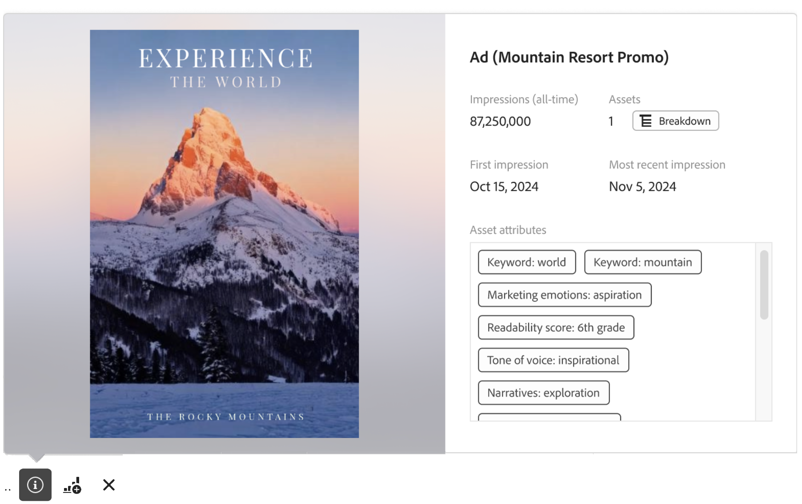

# Übersicht über das Reporting in Content Analytics

>[!WARNING]
>
>Dieser Artikel ist eine vorläufige inoffizielle Entwurfsversion einer kommenden endgültigen Version und Teil der Inhaltsanalysedokumentation. Alle Inhalte unterliegen Änderungen und es können keinerlei rechtlichen Verpflichtungen aus der aktuellen Version dieses Artikels abgeleitet werden.
>

{{release-limited-testing}}

Das Reporting zu Inhaltsanalysen erfolgt in Analysis Workspace. Eine bestimmte Workspace [Vorlage](#template) ist verfügbar, sodass Sie sofort auf ein vorausgefülltes Workspace-Projekt mit relevanten Inhalten zugreifen können.

So starten Sie das Reporting zu Inhaltsanalysen von Grund auf neu:

1. [Erstellen eines neuen](/help/analysis-workspace/build-workspace-project/create-projects.md) oder [Öffnen eines vorhandenen](/help/analysis-workspace/build-workspace-project/open-projects.md) Projekts in Workspace.
1. Ziehen Sie Tabelle[/Freiformtabelle](/help/analysis-workspace/visualizations/freeform-table/freeform-table.md) auf die Arbeitsfläche.
1. Verwenden Sie bestimmte Inhaltsanalysedimensionen und Metriken sowie andere generische [Komponenten](/help/components/overview.md) (wie Filter, Datumsbereiche, Anmerkungen), um Ihre Inhaltsanalyseeinblicke zu erstellen.

## Miniaturen

Basierend auf den Inhaltsanalysedimensionen, die Sie in Ihrem Projekt verwenden, werden Miniaturansichten für Assets und Dimensionen angezeigt.

## Vorschau

Für Dimensionen mit Miniaturen (z. B. Asset-Name, Erlebnisname und andere) können Sie ein Vorschau-Popup-Fenster öffnen.

So öffnen Sie die Vorschau mit den folgenden Details:

* Wählen Sie  aus. Es werden die folgenden Details angezeigt.

  | Erlebnisvorschau | Asset-Vorschau |
  |---|---|
  |  |  |
  | **[!UICONTROL Name des Erlebnisses]** | **[!UICONTROL Name des Assets]** |
  | **[!UICONTROL Impressions (alle Zeiten)]**: Anzahl der Impressionen für das Erlebnis. | **[!UICONTROL Impressions (alle Zeiten)]**: Anzahl der Impressionen für das Asset. |
  | **[!UICONTROL Assets]**: Anzahl der Assets, die dieses Erlebnis enthält. Wählen Sie  Aufschlüsselung aus, um die Assets zu überprüfen. | **[!UICONTROL Erlebnisse]**: Anzahl der Erlebnisse, in denen dieses Asset angezeigt wird. [Aufschlüsselung](/help/assets/icons/Breakdown.svg) Aufschlüsselung zur Überprüfung der Assets. |
  | **[!UICONTROL Erster Impression]**: Datum des ersten Impressions des Erlebnisses. | **[!UICONTROL Erste Impression]**: Datum der ersten Impression des Assets. |
  | **[!UICONTROL Letzte Impression]**: Datum der letzten Impression des Erlebnisses. | **[!UICONTROL Letzte Impression]**: Datum der letzten Impression des Assets. |
  | **[!UICONTROL Erlebnisattribute]**: Die Attribute des Erlebnisses. | **[!UICONTROL Asset-]**: Die Attribute des Assets. |

## Vorlage

Details zu Vorlagen …
