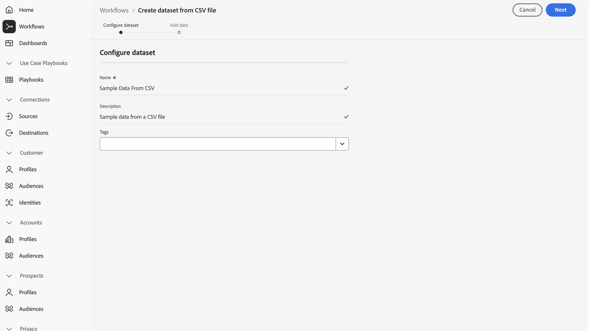

# Aufnehmen und Verwenden von Ad-hoc-Daten

In dieser Kurzanleitung wird erläutert, wie Sie Ad-hoc-Daten in Adobe Experience Platform aufnehmen und diese Daten dann in Customer Journey Analytics verwenden können.

Gehen Sie dazu folgendermaßen vor:

- **Erstellen Sie einen Datensatz mit einer CSV** Datei in Experience Platform , um das Modell (Schema) der zu erfassenden Daten zu definieren und um festzulegen, wo die Daten (Datensatz) erfasst werden sollen.

- **Verwenden Sie einen Quell-Connector** in Experience Platform, um Ihre Daten in den konfigurierten Datensatz zu übertragen.

- **Richten Sie in Customer Journey Analytics eine Verbindung ein**. Diese Verbindung sollte (zumindest) Ihren Adobe Experience Platform-Datensatz enthalten.

- **Richten Sie in Customer Journey Analytics eine Datenansicht ein**, um Metriken und Dimensionen zu definieren, die Sie in Analysis Workspace verwenden möchten.

- **Richten Sie in Customer Journey Analytics ein Projekt ein**, um Berichte und Visualisierungen zu erstellen.

>[!NOTE]
>
>Diese Kurzanleitung ist eine vereinfachte Anleitung zur Aufnahme von Ad-hoc-Daten mithilfe von in Adobe Experience Platform und deren Verwendung in Customer Journey Analytics. Es wird dringend empfohlen, die zusätzlichen Artikel zu lesen, auf die verwiesen wird.

## Datensatz mit einer CSV-Datei erstellen

Für diese Kurzanleitung sollten Sie eine CSV-Datei verwenden, die Suchdaten darstellt und Informationen enthält, die der unten gezeigten ähneln.

| _id | tracking_code | ad_group | campaign_name |
| ---: | :---          | :---        | :---          |
| 1 | abc123 | abc-adgroup | 123 Kampagne |
| 2 | def123 | def-adgroup | 123 Kampagne |
| 3 | ghi123 | ghi-adgroup | 123 Kampagne |
| 4 | ABC456 | abc-adgroup | 456-Kampagne |
| 5 | def456 | def-adgroup | 456-Kampagne |

>[!NOTE]
>
>Verwenden Sie Ad-hoc-Datensätze und -Schemata für auf Datensätzen basierende (Lookup-, Profil-) Daten. Ad-hoc-Datensätze und -Schemata sind weniger geeignet und sollten nicht für Zeitreihendaten (Ereignis, Zusammenfassung) berücksichtigt werden.

Sie müssen kein XDM-Schema für Ad-hoc-Daten erstellen. Adobe Experience Platform unterstützt einen Workflow, der auf den Daten in der CSV-Datei basiert:

1. Erstellt ein Ad-hoc-Schema entsprechend den Spalten der CSV-Datei.
1. Erstellt einen Datensatz basierend auf dem Ad-hoc-Schema, das die Daten aus der CSV-Datei enthält.

So starten Sie den Workflow:

1. Wählen Sie in der Adobe Experience Platform-Benutzeroberfläche in der linken Leiste die Option **[!UICONTROL Workflows]**.
1. Wählen Sie  **[!UICONTROL Datensatz aus CSV-Datei erstellen]** aus.
1. Wählen **[!UICONTROL Launch]** im rechten Bereich aus.
1. Im Assistenten **[!UICONTROL Workflows]** > **[!UICONTROL Datensatz aus CSV-Datei]**:
   1. Im Schritt **[!UICONTROL Konfigurieren eines]**&quot;:
      1. Geben Sie einen **[!UICONTROL Namen]** für den Datensatz ein. Beispiel: `Sample Data From CSV`.
      1. Fügen Sie eine optionale **[!UICONTROL Beschreibung)]**. Beispiel: `Sample data from a CSV file`.
      1. Fügen Sie eine oder mehrere optionale **[!UICONTROL Tags]** hinzu oder wählen Sie eine oder mehrere vorhandene **[!UICONTROL Tags]** aus.

         

      1. Klicken Sie auf **[!UICONTROL Weiter]**.
   1. Im Schritt **[!UICONTROL Daten hinzufügen]**:
      1. Wählen Sie **[!UICONTROL Dateien auswählen]** aus, um Ihre CSV-Datei auf Ihrem Computer oder im Netzwerk auszuwählen. Alternativ können Sie die Datei per Drag-and-Drop von ihrer Position auf Ihrem Computer oder Netzwerk auf **[!UICONTROL Drag-and-Drop-Dateien]** ziehen. Die Datei wird hochgeladen und **[!UICONTROL Beispieldaten]** wird angezeigt.
      1. Aktivieren oder deaktivieren **[!UICONTROL Fehlerdiagnose]** und **[!UICONTROL Teilaufnahme aktivieren]** gemäß Ihren Voreinstellungen. Wenn Sie **[!UICONTROL Partielle Aufnahme aktivieren]** können Sie einen **[!UICONTROL Fehlerschwellenwert %]** definieren.

         

      1. Wählen Sie **[!UICONTROL Beenden]** aus.

Die Daten werden vorbereitet und hochgeladen. Nachdem die Daten erfolgreich hochgeladen wurden, werden Sie in der Adobe Experience Platform **[!UICONTROL Benutzeroberfläche zu]** Datensätze“ weitergeleitet.  Sie sehen die **[!UICONTROL Datensatzaktivität]** für Ihren **[!UICONTROL Beispieldaten aus CSV]**-Datensatz mit dem Status **[!UICONTROL Processing]**.

So überprüfen Sie die Ad-hoc-Daten:

1. Wählen Sie in der Adobe Experience Platform-Benutzeroberfläche in der linken Leiste die Option **[!UICONTROL Datensätze]**.
1. Wählen Sie die **[!UICONTROL Durchsuchen]** in **[!UICONTROL Datensätze]** aus. Ihr Datensatz sollte aufgelistet sein.
1. Wählen Sie den Namen des Schemas aus der Spalte **[!UICONTROL Schema]** aus. Beispiel: **[!UICONTROL Beispieldaten aus CSV…]**.

   

1. Wählen Sie im Popup den **[!UICONTROL Schemanamen]** aus. Beispiel: **[!UICONTROL Beispieldaten aus CSV - Ad-hoc-Schema - XXXXXXXXX]**. Sie werden zur Schnittstelle **[!UICONTROL Schemata]** > **[!UICONTROL Beispieldaten aus CSV - Adhoc-Schema - XXXXXXXXXXX]** weitergeleitet.

In der Benutzeroberfläche **[!UICONTROL Schemata]** > **[!UICONTROL Beispieldaten aus CSV - Ad-hoc-Schema - XXXXXXXXXXX]**:

- Wählen Sie das oberste Mandantennamenobjekt unter **[!UICONTROL Schemata]** > **[!UICONTROL Beispieldaten aus CSV - Adhoc-Schema - XXXXXXXXXXX]** aus, um die Felder im Objekt anzuzeigen. Die Felder innerhalb des -Objekts stellen die Struktur der CSV-Datei dar. Das Schema wird automatisch auf der Grundlage des Uploads der Ad-hoc-Daten erstellt.

  

## Einrichten einer Verbindung

Um den Adobe Experience Platform-Datensatz in Customer Journey Analytics zu verwenden, erstellen Sie eine Verbindung, die die aus dem Workflow resultierenden Ad-hoc-Daten enthält.

Mithilfe einer Verbindung können Sie Datensätze aus Adobe Experience Platform in Analysis Workspace integrieren. Um über diese Datensätze zu berichten, müssen Sie zunächst eine Verbindung zwischen den Datensätzen in Adobe Experience Platform und Workspace herstellen.

Gehen Sie folgendermaßen vor, um eine Verbindung zu erstellen:

1. Wählen Sie in der Benutzeroberfläche von Customer Journey Analytics **[!UICONTROL Verbindungen]**, optional unter **[!UICONTROL Datenverwaltung]** im oberen Menü aus.

1. Wählen Sie **[!UICONTROL Neue Verbindung erstellen]** aus.

1. Im Bildschirm **[!UICONTROL Nicht benannte Verbindung]**:

   1. Benennen und beschreiben Sie Ihre Verbindung in den **[!UICONTROL Verbindungseinstellungen]**.

   1. Wählen Sie die entsprechende Sandbox in der Liste **[!UICONTROL Sandbox]** in **[!UICONTROL Dateneinstellungen]** sowie die Anzahl der täglichen Ereignisse in der Liste **[!UICONTROL Durchschnittliche Anzahl der täglichen Ereignisse]** aus.

      

   1. Wählen Sie **[!UICONTROL Datensätze hinzufügen]** aus.

1. Im Schritt **[!UICONTROL Auswählen von Datensätzen]** in **[!UICONTROL Datensätze hinzufügen]**:

   1. Wählen Sie den zuvor erstellten Datensatz aus, z. B. **[!UICONTROL Beispieldaten aus CSV]** und jeden anderen Datensatz, den Sie in Ihre Verbindung einbeziehen möchten.

      

   1. Wählen Sie **[!UICONTROL Weiter]** aus.

1. Im Schritt **[!UICONTROL Datensatzeinstellungen]** in **[!UICONTROL Datensätze hinzufügen]**:

   Für Ihren Ad-hoc-Datensatz:

   1. Typ des Ad-hoc-Datensatzes auswählen. Beispiel: **[!UICONTROL lookup]**.
   1. Wählen Sie einen **[!UICONTROL Schlüssel]** aus den verfügbaren Schlüsseln aus, die im Ad-hoc-Schema definiert sind.
   1. Wählen Sie einen **[!UICONTROL Übereinstimmungsschlüssel]** aus einem Ereignis-Datensatz aus, den Sie als Teil Ihrer Verbindung hinzugefügt haben.
   1. Wählen Sie die richtige Datenquelle in der Liste **[!UICONTROL Datenquellentyp]** aus. Wenn Sie **[!UICONTROL Sonstige]** angeben, fügen Sie eine Beschreibung für Ihre Datenquelle hinzu.

   1. Definieren Sie **[!UICONTROL Alle neuen Daten importieren]** und **[!UICONTROL Datensatz-Aufstockung vorhandener Daten]** entsprechend Ihren Anforderungen.

      

   1. Wählen Sie **[!UICONTROL Datensätze hinzufügen]** aus.

   1. Wählen Sie **[!UICONTROL Speichern]** aus.

Siehe [Ad-hoc-Datensatzeinstellungen](/help/connections/create-connection.md#adhoc-dataset) für weitere Details zu den Einstellungen, die für Ad-hoc-Datensätze verfügbar sind.

>[!IMPORTANT]
>
>Zusätzlich zur allgemeinen Empfehlung, keine Ad-hoc-Datensätze und -Schemata für Zeitreihendaten zu verwenden, sollten Sie **nicht** den Workflow **[!UICONTROL Datensatz aus CSV erstellen]** für Zeitreihendaten verwenden. Der Workflow, der das Ad-hoc-Schema generiert, definiert alle Felder als vom Typ Zeichenfolge, die Sie nachträglich nicht mehr ändern können. Wenn Sie einen zeitreihenbasierten Datensatz (Ereignis oder Zusammenfassung) zu einer Verbindung hinzufügen, erfordert dieser Datensatztyp die Definition von mindestens einem Feld des Typs DateTime.  Wenn Sie Ad-hoc-Zeitreihendaten verwenden müssen, sollten Sie [die API zum Erstellen eines Ad-hoc-Schemas verwenden](https://experienceleague.adobe.com/en/docs/experience-platform/xdm/tutorials/ad-hoc#token_type=bearer&expires_in=43197438) und dann den Workflow [Erstellen eines Datensatzes aus einem Schema](https://experienceleague.adobe.com/en/docs/experience-platform/catalog/datasets/user-guide#schema) verwenden.

Nachdem Sie eine [Verbindung](/help/connections/overview.md) erstellt haben, können Sie verschiedene Verwaltungsaufgaben ausführen, z. B. [Auswählen und Kombinieren von ](/help/connections/combined-dataset.md), [Überprüfen des Status der Datensätze einer Verbindung und des Status der Datenaufnahme](/help/connections/manage-connections.md) und mehr.

## Einrichten einer Datenansicht

Eine Datenansicht ist ein für Customer Journey Analytics spezifischer Container, mit dem Sie bestimmen können, wie die aus einer Verbindung stammenden Daten interpretiert werden sollen. Darin werden alle in Analysis Workspace verfügbaren Dimensionen und Metriken sowie die Spalten angegeben, aus denen diese Dimensionen und Metriken ihre Daten abrufen. Datenansichten werden in Vorbereitung auf das Reporting in Analysis Workspace definiert.

Gehen Sie folgendermaßen vor, um eine Datenansicht zu erstellen:

1. Wählen Sie in der Customer Journey Analytics **[!UICONTROL Benutzeroberfläche im oberen Menü]** Datenansichten **[!UICONTROL optional unter Datenverwaltung]** aus.

1. Wählen Sie **[!UICONTROL Neue Datenansicht erstellen]**.

1. Im Schritt **[!UICONTROL Konfigurieren]**:

   1. Wählen Sie Ihre [Verbindung](#set-up-a-connection) aus der Liste **[!UICONTROL Verbindung]** aus.

   1. Geben Sie einen Namen und (optional) eine Beschreibung für Ihre Verbindung ein.

      

   1. Wählen Sie **[!UICONTROL Speichern und fortfahren]** aus.

1. Im Schritt **[!UICONTROL Komponenten]**:

   1. Fügen Sie alle Ad-hoc-Schemafelder und/oder Standardkomponenten hinzu, die Sie in die Komponentenfelder **[!UICONTROL METRIKEN]** oder **[!UICONTROL DIMENSIONEN]** aufnehmen möchten.
   1. Optional können Sie [abgeleitete Felder](/help/data-views/derived-fields/derived-fields.md) verwenden, um eines der Ad-hoc-Felder von seinem standardmäßigen Zeichenfolgentyp und -format in einen anderen Typ oder ein anderes Format zu ändern.

   1. Wählen Sie **[!UICONTROL Speichern und fortfahren]** aus.

1. Im Schritt **[!UICONTROL Einstellungen]**:

   Behalten Sie die Einstellungen bei und wählen Sie **[!UICONTROL Speichern und beenden]**.

Weitere Informationen [ Erstellen und Bearbeiten einer Datenansicht finden ](../data-views/data-views.md) unter Datenansichten - Übersicht . Und welche Komponenten in Ihrer Datenansicht verfügbar sind und wie Sie Segment- und Sitzungseinstellungen verwenden.

## Einrichten eines Projekts

Analysis Workspace ist ein flexibles Browser-Tool, mit dem Sie schnell Analysen erstellen und Erkenntnisse basierend auf Ihren Daten austauschen können. Mit Analysis Workspace-Projekten können Sie Datenkomponenten, Tabellen und Visualisierungen kombinieren, um eine Analyse zu erstellen, und diese für andere Personen in Ihrem Unternehmen freigeben.

Gehen Sie folgendermaßen vor, um ein Projekt zu erstellen:

1. Wählen Sie in der Benutzeroberfläche von Customer Journey Analytics **[!UICONTROL Projekte]** im oberen Menü aus.

1. Wählen Sie **[!UICONTROL Projekte]** in der linken Navigation aus.

1. Wählen Sie **[!UICONTROL Projekt erstellen]** aus

1. Wählen Sie **[!UICONTROL Leeres Projekt]** aus.

1. Wählen Sie Ihre [Datenansicht](#set-up-a-data-view) aus der Liste aus.

1. Ziehen Sie zum Erstellen Ihres ersten Berichts Dimensionen und Metriken per Drag-and-Drop auf die [!UICONTROL Freiformtabelle] im [!UICONTROL Panel]. Einschließen dieser Metriken oder Dimensionen basierend auf Ihren Ad-hoc-Daten.

Weitere Informationen zum Erstellen von Projekten und zum Durchführen einer Analyse mithilfe von Komponenten, Visualisierungen und Bedienfeldern finden Sie unter [Analysis Workspace – Überblick](../analysis-workspace/home.md).

>[!SUCCESS]
>
>Sie haben jetzt alle Schritte ausgeführt. Sie haben zunächst definiert, welche Ad-hoc-Daten erfasst werden sollen (CSV-Datei). Sie haben den Workflow verwendet, um einen Ad-hoc-Datensatz und ein Schema aus dieser CSV-Datei zu erstellen. Sie haben eine Verbindung in Customer Journey Analytics definiert, um die aufgenommenen Ad-hoc-Daten und andere Daten zu verwenden. Durch die Definition Ihrer Datenansicht konnten Sie festlegen, welche Dimension und Metriken verwendet werden sollen. Abschließend haben Sie Ihr erstes Projekt erstellt, in dem Ihre Daten visualisiert und analysiert wurden.
