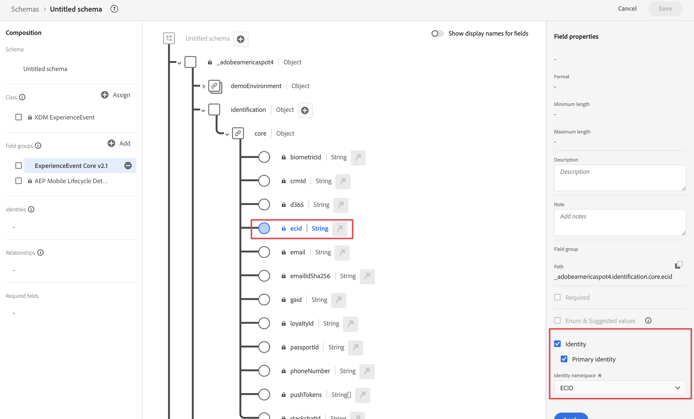
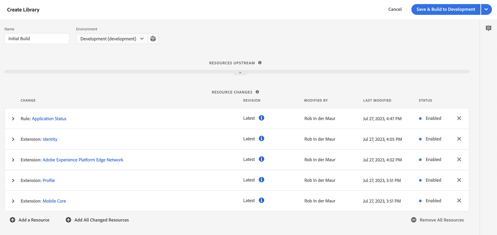

# Aufnehmen von Daten über das Adobe Experience Platform Mobile SDK

In dieser Kurzanleitung wird erläutert, wie Sie mit dem Adobe Experience Platform Mobile SDK und Edge Network Tracking-Daten von Mobile Apps direkt in Adobe Experience Platform aufnehmen können. Verwenden Sie diese Daten dann auf Customer Journey Analytics.

Gehen Sie dazu folgendermaßen vor:

- **Richten Sie ein Schema und einen Datensatz** in Adobe Experience Platform ein, um das Modell (Schema) der zu erfassenden Daten zu definieren und um festzulegen, wo die Daten (Datensatz) erfasst werden sollen.

- **Richten Sie einen Datenstrom ein**, um das Adobe Experience Platform Edge Network so zu konfigurieren, dass Ihre erfassten Daten an den in Adobe Experience Platform konfigurierten Datensatz weitergeleitet werden.

- **Verwenden von Tags** , um Regeln und Datenelemente einfach entsprechend den Daten in Ihrer Mobile App zu konfigurieren. Sorgen Sie dann dafür, dass die Daten an den im Adobe Experience Platform Edge Network konfigurierten Datenstrom gesendet werden.

- **Stellen Sie die Daten bereit und validieren Sie sie**. Nutzen Sie eine Umgebung, in der Sie die Entwicklung von Tags iterieren können. Veröffentlichen Sie sie nach der Validierung in Ihrer Produktionsumgebung.

- **Richten Sie in Customer Journey Analytics eine Verbindung ein**. Diese Verbindung sollte (zumindest) Ihren Adobe Experience Platform-Datensatz enthalten.

- **Richten Sie in Customer Journey Analytics eine Datenansicht ein**, um Metriken und Dimensionen zu definieren, die Sie in Analysis Workspace verwenden möchten.

- **Richten Sie in Customer Journey Analytics ein Projekt ein**, um Berichte und Visualisierungen zu erstellen.

>[!NOTE]
>
>Diese Kurzanleitung ist eine vereinfachte Anleitung zur Aufnahme von Daten aus Ihrer Anwendung in Adobe Experience Platform und deren Verwendung im Customer Journey Analytics. Es wird dringend empfohlen, die zusätzlichen Artikel zu lesen, auf die verwiesen wird.

## Einrichten eines Schemas und eines Datensatzes

Um Daten in Adobe Experience Platform aufzunehmen, müssen Sie zunächst definieren, welche Daten Sie erfassen möchten. Alle in Adobe Experience Platform aufgenommenen Daten müssen einer standardmäßigen, denormalisierten Struktur entsprechen, damit sie von nachgelagerten Funktionen erkannt und genutzt werden können. Das Experience-Datenmodell (XDM) ist das Standard-Framework, das eine Struktur in Form von Schemata bereitstellt.

Nachdem Sie ein Schema definiert haben, verwenden Sie einen oder mehrere Datensätze, um die erfassten Daten zu speichern und zu verwalten. Ein Datensatz ist ein Speicher- und Verwaltungskonstrukt für eine Sammlung von Daten (normalerweise eine Tabelle), die ein Schema (Spalten) und Felder (Zeilen) enthält.

Alle in Adobe Experience Platform aufgenommene Daten müssen einem vordefinierten Schema entsprechen, bevor sie als Datensatz gespeichert werden können.

### Einrichten eines Schemas

Sie möchten einige minimale Daten von Profilen mithilfe Ihrer Mobile App nachverfolgen, z. B. Szenenname, Identifizierung.
Zunächst müssen Sie ein Schema definieren, das diese Daten modelliert.

Gehen Sie folgendermaßen vor, um das Schema einzurichten:

1. Wählen Sie in der Adobe Experience Platform-Benutzeroberfläche in der linken Leiste die Option **[!UICONTROL Schemata]** in [!UICONTROL DATEN-MANAGEMENT] aus.

1. Auswählen **[!UICONTROL Schema erstellen]**. .
1. Im Schritt Klasse auswählen des Assistenten Schema erstellen :

   1. Auswählen **[!UICONTROL Erlebnisereignis]**.

      

      >[!INFO]
      >
      >    Ein Erlebnisereignis-Schema wird zum Modellieren des _Verhalten_ eines Profils (z. B. Szenenname, Drucktaste zum Hinzufügen zum Warenkorb). Das Schema „Individuelles Profil“ wird verwendet, um die _Attribute_ eines Profils zu modellieren (z. B. Name, E-Mail, Geschlecht).

   1. Klicken Sie auf **[!UICONTROL Weiter]**.

1. In der [!UICONTROL Name und Überprüfungsschritt] der [!UICONTROL Schema erstellen] Assistent:

   1. Geben Sie ein **[!UICONTROL Anzeigename des Schemas]** für Ihr Schema und (optional) eine **[!UICONTROL Beschreibung]**.

      

   1. Wählen Sie **[!UICONTROL Beenden]** aus.

1. Auf der Registerkarte Struktur des Beispielschemas:

   1. Wählen Sie **[!UICONTROL + Hinzufügen]** in [!UICONTROL Feldergruppen] aus.

      

      Feldergruppen sind wiederverwendbare Sammlungen von Objekten und Attributen, mit denen Sie Ihr Schema einfach erweitern können.

   1. In der [!UICONTROL Feldergruppen hinzufügen] auswählen **[!UICONTROL AEP Mobile SDK ExperienceEvent]** Feldergruppe aus der Liste.

      

      Sie können die Vorschau-Schaltfläche auswählen, um eine Vorschau der Felder anzuzeigen, die zu dieser Feldergruppe gehören, z. B. `application > name`.

      

      Wählen Sie **[!UICONTROL Zurück]** aus, um die Vorschau zu schließen.

   1. Wählen Sie **[!UICONTROL Feldergruppen hinzufügen]** aus.

1. Wählen Sie **[!UICONTROL +]** neben Ihrem Schemanamen im Bedienfeld [!UICONTROL Struktur] aus.

   

1. In der [!UICONTROL Feldeigenschaften] Bedienfeld, Eingabe `identification` als [!UICONTROL Feldname], **[!UICONTROL Identifikation]** als [!UICONTROL Anzeigename], auswählen **[!UICONTROL Objekt]** als [!UICONTROL Typ] und wählen Sie **[!UICONTROL ExperienceEvent Core v2.1]** als [!UICONTROL Feldergruppe].

   >[!NOTE]
   >
   >Wenn diese Feldergruppe nicht verfügbar ist, suchen Sie nach einer anderen Feldergruppe, die Identitätsfelder enthält. oder [Erstellen einer neuen Feldergruppe](https://experienceleague.adobe.com/docs/experience-platform/xdm/ui/resources/field-groups.html) und [Neue Identitätsfelder hinzufügen](https://experienceleague.adobe.com/docs/experience-platform/xdm/ui/fields/identity.html#define-a-identity-field) (wie `ecid`, `crmId`und andere, die Sie benötigen), um die Feldergruppe zu öffnen und diese neue Feldergruppe auszuwählen.

   

   Das Identifizierungsobjekt fügt Ihrem Schema Identifizierungsfunktionen hinzu. In Ihrem Fall möchten Sie Profile mithilfe Ihrer Mobile App mithilfe der Experience Cloud-ID und der E-Mail-Adresse identifizieren. Es stehen viele weitere Attribute zur Verfügung, um die Identifizierung Ihrer Person zu verfolgen (z. B. Kunden-ID, Treueprogramm-ID).

   Wählen Sie **[!UICONTROL Anwenden]** aus, um dieses Objekt zu Ihrem Schema hinzuzufügen.

1. Wählen Sie im soeben hinzugefügten Identifizierungsobjekt das Feld **[!UICONTROL ECID]** aus und danach im rechten Bedienfeld **[!UICONTROL Identität]** und **[!UICONTROL Primäre Identität]** sowie die Option **[!UICONTROL ECID]** in der Liste [!UICONTROL Identity-Namespace].

   

   Sie spezifizieren die Experience Cloud-Identität als primäre Identität, die Adobe Experience Platform Identity Service verwenden kann, um das Verhalten von Profilen, die dieselbe ECID haben, zu kombinieren (Stitching).

   Wählen Sie **[!UICONTROL Anwenden]** aus. Daraufhin erscheint ein Fingerabdruck-Symbol im ECID-Attribut.

1. Wählen Sie das Feld **[!UICONTROL E-Mail]** im soeben hinzugefügten Identifizierungsobjekt aus und danach **[!UICONTROL Identität]** und **[!UICONTROL E-Mail]** in der Liste [!UICONTROL Identity-Namespace] im Bedienfeld [!UICONTROL Feldeigenschaften].

   

   Sie spezifizieren die E-Mail-Adresse als weitere Identität, die Adobe Experience Platform Identity Service verwenden kann, um das Verhalten von Profilen zu kombinieren (Stitching).

   Wählen Sie **[!UICONTROL Anwenden]** aus. Daraufhin erscheint ein Fingerabdruck-Symbol im E-Mail-Attribut.

   Wählen Sie **[!UICONTROL Speichern]** aus.

1. Wählen Sie das Stammelement Ihres Schemas aus, das den Namen des Schemas trägt, und wählen Sie dann den Umschalter **[!UICONTROL Profil]** aus.

   Sie werden aufgefordert, das Schema für das Profil zu aktivieren. Nach der Aktivierung werden Daten, die auf der Basis dieses Schemas in Datensätze aufgenommen werden, zum Echtzeit-Kundenprofil hinzugefügt.

   Weitere Informationen finden Sie im Abschnitt [Aktivieren des Schemas zur Verwendung im Echtzeit-Kundenprofil](https://experienceleague.adobe.com/docs/experience-platform/xdm/tutorials/create-schema-ui.html#profile).

   >[!IMPORTANT]
   >
   >    Nachdem Sie ein für ein Profil aktiviertes Schema gespeichert haben, kann es für das Profil nicht mehr deaktiviert werden.

   

1. Wählen Sie **[!UICONTROL Speichern]** aus, um Ihr Schema zu speichern.

Sie haben ein Minimalschema erstellt, das die Daten modelliert, die Sie mit Ihrer Mobile App erfassen können. Mithilfe des Schemas können Profile anhand der Experience Cloud-Identität und -E-Mail-Adresse identifiziert werden. Durch die Aktivierung des Schemas für das Profil stellen Sie sicher, dass die über Ihre Mobile App erfassten Daten zum Echtzeit-Kundenprofil hinzugefügt werden.

Neben Verhaltensdaten können Sie auch Profilattributdaten aus Ihrer Mobile App erfassen (z. B. Details zu Profilen, die einen Newsletter abonnieren).

Um Profildaten zu erfassen, gehen Sie folgendermaßen vor:

- Erstellen Sie ein Schema basierend auf der Klasse „XDM Individual Profile“.

- Fügen Sie die Feldergruppe „Profile Core v2“ zum Schema hinzu.

- Fügen Sie ein Identifizierungsobjekt hinzu, das auf der Feldergruppe „Profile Core v2“ basiert.

- Experience Cloud-ID als primäre Kennung und E-Mail als Kennung definieren.

- Aktivieren Sie dieses Schema für das Profil

Weitere Informationen zum Hinzufügen und Entfernen von Feldergruppen und einzelnen Feldern zu einem Schema finden Sie unter [Erstellen und Bearbeiten von Schemata über die Benutzeroberfläche](https://experienceleague.adobe.com/docs/experience-platform/xdm/ui/resources/schemas.html?lang=de).

### Erstellen eines Datensatzes

Mit Ihrem Schema haben Sie Ihr Datenmodell definiert. Jetzt müssen Sie das Konstrukt definieren, um diese Daten mithilfe von Datensätzen zu speichern und zu verwalten.

Gehen Sie folgendermaßen vor, um einen Datensatz einzurichten:

1. Wählen Sie in der Adobe Experience Platform-Benutzeroberfläche in der linken Leiste die Option **[!UICONTROL Datensätze]** in [!UICONTROL DATEN-MANAGEMENT].

2. Wählen Sie **[!UICONTROL Erstellen eines Datensatzes]** aus.

   

3. Wählen Sie **[!UICONTROL Erstellen eines Datensatzes aus einem Schema]** aus.

   

4. Wählen Sie das zuvor erstellte Schema und danach **[!UICONTROL Weiter]** aus.

5. Benennen Sie Ihren Datensatz und geben Sie (optional) eine Beschreibung ein.

   

6. Wählen Sie **[!UICONTROL Beenden]** aus.

7. Wählen Sie den Umschalter **[!UICONTROL Profil]** aus.

   Sie werden aufgefordert, den Datensatz für das Profil zu aktivieren. Nach der Aktivierung reichert der Datensatz das Echtzeit-Kundenprofil mit den aufgenommenen Daten an.

   >[!IMPORTANT]
   >
   >    Sie können einen Datensatz für ein Profil nur aktivieren, wenn das Schema, zu dem der Datensatz gehört, auch für das Profil aktiviert ist.

   

Im [Handbuch zur Datensatz-Benutzeroberfläche](https://experienceleague.adobe.com/docs/experience-platform/catalog/datasets/user-guide.html?lang=de) können Sie nachlesen, wie ein Datensatz angezeigt, in der Vorschau angesehen, erstellt und gelöscht werden kann und wie ein Datensatz für das Echtzeit-Kundenprofil aktiviert wird.

## Einrichten eines Datenstroms

Ein Datenstrom stellt die Server-seitige Konfiguration bei der Implementierung der Adobe Experience Platform Web- und Mobile-SDKs dar. Beim Erfassen von Daten mit den Adobe Experience Platform SDKs werden Daten an das Adobe Experience Platform Edge Network gesendet. Es ist der Datenstrom, der bestimmt, an welche Services diese Daten weitergeleitet werden.

In Ihrem Setup möchten Sie, dass die von der Mobile App erfassten Daten an Ihren Datensatz in Adobe Experience Platform gesendet werden.

Gehen Sie folgendermaßen vor, um einen Datenstrom einzurichten:

1. Wählen Sie in der Adobe Experience Platform-Benutzeroberfläche die Option **[!UICONTROL Datenströme]** in [!UICONTROL DATENERFASSUNG] in der linken Leiste.

2. Wählen Sie **[!UICONTROL Neuer Datenstrom]** aus.

3. Benennen und beschreiben Sie Ihren Datenstrom. Wählen Sie Ihr Schema in der Liste [!UICONTROL Ereignisschema] aus.

   

4. Wählen Sie **[!UICONTROL Speichern]** aus.

5. Wählen Sie **[!UICONTROL Service hinzufügen]** aus.

6. Im Bildschirm [!UICONTROL Service hinzufügen]:

   1. Wählen Sie **[!UICONTROL Adobe Experience Platform]** in der Liste [!UICONTROL Service] aus.

   2. Achten Sie darauf, dass **[!UICONTROL Aktiviert]** ausgewählt ist.

   3. Wählen Sie Ihren Datensatz aus der Liste [!UICONTROL Ereignisdatensatz] aus.

      

   4. Lassen Sie die anderen Einstellungen unverändert und wählen Sie **[!UICONTROL Speichern]** aus, um den Datenstrom zu speichern.

Ihr Datenstrom ist jetzt so konfiguriert, dass die von Ihrer Mobile App erfassten Daten an Ihren Datensatz in Adobe Experience Platform weitergeleitet werden.

Weitere Informationen um Konfigurieren eines Datenstroms und zum Umgang mit sensiblen Daten finden Sie unter [Übersicht über Datenströme](https://experienceleague.adobe.com/docs/experience-platform/edge/datastreams/overview.html?lang=de).

## Verwenden von Tags

Verwenden Sie die Tags-Funktion in Adobe Experience Platform, um Code für die Datenerfassung auf Ihrer Site zu implementieren. Mit dieser Tag-Management-Lösung können Sie Code zusammen mit anderen Tagging-Anforderungen bereitstellen. Tags ermöglichen die nahtlose Integration mit Adobe Experience Platform mithilfe der Adobe Experience Platform Mobile SDK-Erweiterung.

### Erstellen von Tags

1. Wählen Sie in der Adobe Experience Platform-Benutzeroberfläche in der linken Leiste die Option **[!UICONTROL Tags]** in [!UICONTROL DATENERFASSUNG].

2. Wählen Sie **[!UICONTROL Neue Eigenschaft]** aus.

   Benennen Sie das Tag und wählen Sie **[!UICONTROL Mobiltelefon]**. Wählen Sie **[!UICONTROL Speichern]** aus, um fortzufahren.

   

### Konfigurieren Ihres Tags

Nachdem Sie das Tag erstellt haben, müssen Sie es mit den richtigen Erweiterungen konfigurieren, Datenelemente und Regeln entsprechend dem gewünschten Tracking auf Ihrer Website konfigurieren und Daten an Adobe Experience Platform senden.

Wählen Sie zum Konfigurieren Ihr neu erstelltes Tag aus der Liste der [!UICONTROL Tag-Eigenschaften].

#### **Erweiterungen**

Fügen Sie Ihrem Tag die Adobe Platform Edge Network-Erweiterung hinzu, um sicherzustellen, dass Sie Daten (über Ihren Datenstrom) an Adobe Experience Platform senden können.

So erstellen und konfigurieren Sie die Adobe Experience Platform Mobile SDK-Erweiterung:

1. Auswählen **[!UICONTROL Erweiterungen]** in der linken Leiste. Sie sehen, dass die Mobile Core- und Profilerweiterungen bereits verfügbar sind.

1. Wählen Sie **[!UICONTROL Katalog]** in der oberen Leiste aus.

1. Suchen oder scrollen Sie nach . **[!UICONTROL Adobe Experience Platform Edge Network]** -Erweiterung und Auswählen **[!UICONTROL Installieren von]** im rechten Bereich, um es zu installieren.

1. Wählen Sie Ihre Sandbox und Ihren zuvor erstellten Datenstrom für Ihre [!UICONTROL Produktionsumgebung] und (optional) Ihre [!UICONTROL Staging-Umgebung] und Ihre [!UICONTROL Entwicklungsumgebung] aus.

   

1. Geben Sie Ihr **[!UICONTROL Edge Network-Domain]** darunter [!UICONTROL Domain-Konfiguration]. Normalerweise verwenden `<organizationName>.data.adobedc.net`.

1. Wählen Sie **[!UICONTROL Speichern]** aus.

Siehe [Konfigurieren der Adobe Experience Platform Edge Network-Erweiterung](https://developer.adobe.com/client-sdks/documentation/edge-network) für weitere Informationen.

Sie sollten auch die folgenden zusätzlichen Erweiterungen über den Katalog einrichten:

- Identität.
- AEP-Sicherheit.
- Einverständnis

Siehe [Konfigurieren einer Tag-Eigenschaft](https://experienceleague.adobe.com/docs/platform-learn/implement-mobile-sdk/initial-configuration/configure-tags.html?lang=de) im Mobile-App-Tutorial für Experience Platform finden Sie weitere Informationen zu Erweiterungen und ihrer Konfiguration.

#### **Datenelemente**

Datenelemente sind die Bausteine Ihres Datenwörterbuchs (oder Ihrer Data Map). Verwenden Sie Datenelemente zum Erfassen, Organisieren und Bereitstellen von Daten in Marketing- und Werbe-Tools. Sie richten Datenelemente in Ihrem Tag ein, die Daten oder Ereignisse aus Mobile Apps lesen und zur Bereitstellung von Daten in Adobe Experience Platform verwendet werden können.

Sie möchten beispielsweise den Provider-Namen aus der Mobile App abrufen.

So definieren Sie ein Datenelement für den Provider-Namen:

1. Wählen Sie **[!UICONTROL Datenelemente]** in der linken Leiste aus.

2. Wählen Sie **[!UICONTROL Datenelement hinzufügen]** aus.

3. Im Dialog [!UICONTROL Datenelement erstellen]:

   - Benennen Sie Ihr Datenelement, z. B. `Carrier Name`.

   - Auswählen **[!UICONTROL Mobile Core]** vom [!UICONTROL Erweiterung] Liste.

   - Auswählen **[!UICONTROL Betreibername]** vom [!UICONTROL Datenelementtyp] Liste.

     

   - Wählen Sie **[!UICONTROL Speichern]** aus.

Sie können beliebig viele Datenelemente erstellen und sie in Regeln verwenden.

#### **Regeln**

Tags in Adobe Experience Platform folgen einem regelbasierten System. Sie suchen nach Benutzerinteraktionen und zugehörigen Daten. Wenn die in Ihren Regeln formulierten Kriterien erfüllt sind, löst die Regel die jeweils definierte Erweiterung, das Skript oder den Client-seitigen Code aus. Sie können Regeln verwenden, um Daten (wie ein XDM-Objekt) mithilfe der Adobe Experience Platform Edge Network-Erweiterung an Adobe Experience Platform zu senden.

Sie möchten beispielsweise Ereignisdaten senden, wenn die Mobile App verwendet wird (im Vordergrund) und wenn die Mobile App nicht verwendet wird (zurück in den Hintergrund verschoben).

Gehen Sie folgendermaßen vor, um eine Regel zu definieren:

1. Wählen Sie **[!UICONTROL Regeln]** in der linken Leiste aus.

2. Wählen Sie **[!UICONTROL Neue Regel erstellen]** aus.

3. Im Dialog [!UICONTROL Regel erstellen]:

   - Benennen Sie die Regel, beispielsweise mit `Application Status`.

   - Wählen Sie **[!UICONTROL + Hinzufügen]** unter [!UICONTROL Ereignisse] aus.

   - Im Dialog [!UICONTROL Ereigniskonfiguration]:

      - Auswählen **[!UICONTROL Mobile Core]** vom [!UICONTROL Erweiterung] Liste.

      - Auswählen **[!UICONTROL Vordergrund]** vom [!UICONTROL Ereignistyp] Liste.

      - Wählen Sie **[!UICONTROL Änderungen beibehalten]** aus.

   - Klick  neben [!UICONTROL Mobile Core - Vordergrund].

      - Auswählen **[!UICONTROL Mobile Core]** vom [!UICONTROL Erweiterung] Liste.

      - Auswählen **[!UICONTROL Hintergrund]** vom [!UICONTROL Ereignistyp] Liste.

      - Wählen Sie **[!UICONTROL Änderungen beibehalten]** aus.

   - Klick  Unter hinzufügen [!UICONTROL AKTIONEN]. Im Dialog [!UICONTROL Aktionskonfiguration]:

      - Auswählen **[!UICONTROL Adobe Experience Platform Edge Network]** vom [!UICONTROL Erweiterung] Liste.

      - Auswählen **[!UICONTROL Ereignis an Edge Network weiterleiten]** vom [!UICONTROL Aktionstyp] Liste.

      - Wählen Sie **[!UICONTROL Änderungen beibehalten]** aus.

   - Ihre Regel sollte wie folgt aussehen:

     

   - Wählen Sie **[!UICONTROL Speichern]** aus.

Das obige Beispiel ist nur ein Beispiel für die Definition einer Regel, die XDM-Daten mit dem Anwendungsstatus an das Adobe Edge-Netzwerk und an Adobe Experience Platform sendet.

Sie können Regeln in Ihrem Tag auf unterschiedliche Weise verwenden, um (mithilfe Ihrer Datenelemente) Variablen zu bearbeiten.

Weitere Informationen finden Sie unter [Regeln](https://developer.adobe.com/client-sdks/documentation/lifecycle-for-edge-network/#configure-a-rule-to-forward-lifecycle-metrics-to-platform).

### Erstellen und Veröffentlichen Ihres Tags

Nachdem Sie Datenelemente und Regeln definiert haben, müssen Sie Ihr Tag erstellen und veröffentlichen. Wenn Sie einen Bibliotheks-Build erstellen, müssen Sie ihn einer Umgebung zuweisen. Die Erweiterungen, Regeln und Datenelemente des Builds werden dann kompiliert und in die zugewiesene Umgebung eingefügt. Jede Umgebung bietet einen eindeutigen Einbettungs-Code, mit dem Sie den zugewiesenen Build in Ihre Website integrieren können.

Gehen Sie folgendermaßen vor, um Ihr Tag zu erstellen und zu veröffentlichen:

1. Wählen Sie **[!UICONTROL Veröffentlichungsfluss]** in der linken Leiste aus.

2. Wählen Sie **[!UICONTROL Arbeitsbibliothek auswählen]**, gefolgt von **[!UICONTROL Bibliothek hinzufügen...]** aus.

3. Im Dialog [!UICONTROL Bibliothek erstellen]:

   - Benennen Sie die Bibliothek.

   - Wählen Sie **[!UICONTROL Entwicklung (development)]** in der Liste [!UICONTROL Umgebung] aus.

   - Wählen Sie **[!UICONTROL + Alle geänderten Ressourcen hinzufügen]** aus.

     

   - Wählen Sie **[!UICONTROL Speichern und in Entwicklung erstellen]** aus.

   Ihr Tag wird gespeichert und für Ihre Entwicklungsumgebung erstellt. Ein grüner Punkt kennzeichnet eine erfolgreiche Erstellung Ihres Tags in Ihrer Entwicklungsumgebung.

4. Sie können **[!UICONTROL ...]** auswählen, um die Bibliothek neu zu erstellen oder in eine Staging- oder Produktionsumgebung zu verschieben.

Adobe Experience Platform-Tags unterstützen einfache bis komplexe Veröffentlichungs-Workflows, die Ihre Bereitstellung des Adobe Experience Platform Edge Network unterstützen sollten.

Weitere Informationen finden Sie unter [Veröffentlichung – Überblick](https://developer.adobe.com/client-sdks/documentation/getting-started/create-a-mobile-property/#publish-the-configuration).

### Abrufen des Tag-Codes

Schließlich müssen Sie Ihr Tag in der Mobile App verwenden, die Sie verfolgen möchten.

So erhalten Sie Code-Anweisungen, in denen die Einrichtung Ihrer Mobile App und die Verwendung Ihres Tags in der App erläutert wird:

1. Wählen Sie **[!UICONTROL Umgebungen]** in der linken Leiste aus.

2. Wählen Sie aus der Liste der Umgebungen die richtige Installation aus  Schaltfläche.

   In der [!UICONTROL Installationsanweisungen für Mobilgeräte] die entsprechende Plattform aus ([!UICONTROL iOS], [!UICONTROL Android]). Verwenden Sie dann die Kopie  Klicken Sie neben jedem der relevanten Codeausschnitte, die Sie zum Einrichten und Initialisieren Ihrer Mobile App verwenden möchten:

   

3. Wählen Sie **[!UICONTROL Schließen]** aus.

Anstelle des Codes für die Entwicklungsumgebung hätten Sie auch eine andere Umgebung (Staging, Produktion) auswählen können, je nachdem, wo Sie das Adobe Experience Platform Mobile SDK bereitstellen.

Weitere Informationen finden Sie in [Umgebungen](https://experienceleague.adobe.com/docs/experience-platform/tags/publish/environments/environments.html?lang=de?).

## Bereitstellen und validieren

Sie können den Code jetzt in Ihrer Mobile App bereitstellen. Nach der Bereitstellung beginnt Ihre Mobile App mit der Datenerfassung in Adobe Experience Platform.

Validieren Sie Ihre Implementierung, korrigieren Sie sie bei Bedarf und stellen Sie sie mithilfe der Publishing-Workflow-Funktion von Tags in Ihrer Staging- und Produktionsumgebung bereit.

Siehe [Tutorial zur Implementierung von Adobe Experience Cloud in Mobile Apps](https://experienceleague.adobe.com/docs/platform-learn/implement-mobile-sdk/overview.html?lang=de) für detailliertere Informationen.

## Einrichten einer Verbindung

Um die Adobe Experience Platform-Daten in Customer Journey Analytics verwenden zu können, erstellen Sie eine Verbindung, die die Daten enthält, die aus der Einrichtung Ihres Schemas, Datensatzes und Workflows resultieren.

Mithilfe einer Verbindung können Sie Datensätze aus Adobe Experience Platform in Analysis Workspace integrieren. Um über diese Datensätze zu berichten, müssen Sie zunächst eine Verbindung zwischen den Datensätzen in Adobe Experience Platform und Workspace herstellen.

Gehen Sie folgendermaßen vor, um eine Verbindung zu erstellen:

1. Wählen Sie in der Customer Journey Analytics-Benutzeroberfläche die Option **[!UICONTROL Verbindungen]** in der oberen Navigation aus.

2. Wählen Sie **[!UICONTROL Neue Verbindung erstellen]** aus.

3. Im Bildschirm [!UICONTROL Nicht benannte Verbindung]:

   Benennen und beschreiben Sie Ihre Verbindung in den [!UICONTROL Verbindungseinstellungen].

   Wählen Sie die entsprechende Sandbox in der Liste [!UICONTROL Sandbox] in [!UICONTROL Dateneinstellungen] sowie die Anzahl der täglichen Ereignisse in der Liste [!UICONTROL Durchschnittliche Anzahl der täglichen Ereignisse] aus.

   

   Wählen Sie **[!UICONTROL Datensätze hinzufügen]** aus.

   Im Schritt [!UICONTROL Auswählen von Datensätzen] in [!UICONTROL Datensätze hinzufügen]:

   - Wählen Sie zuvor erstellte Datensätze und/oder andere relevante Datensätze aus, die Sie in Ihre Verbindung einbeziehen möchten (z. B. Daten zu Push-Tracking-Erlebnisereignissen und Push-Profildaten aus Adobe Journey Optimizer)

     

   - Wählen Sie **[!UICONTROL Weiter]** aus.

   Im Schritt [!UICONTROL Datensatzeinstellungen] in [!UICONTROL Datensätze hinzufügen]:

   - Für jeden Datensatz:

      - Wählen Sie eine [!UICONTROL Personen-ID] aus den verfügbaren Identitäten aus, die im Datensatzschema in Experience Platform definiert sind.

      - Wählen Sie die richtige Datenquelle in der Liste [!UICONTROL Datenquellentyp] aus. Wenn Sie **[!UICONTROL Sonstige]** angeben, fügen Sie eine Beschreibung für Ihre Datenquelle hinzu.

      - Definieren Sie **[!UICONTROL Alle neuen Daten importieren]** und **[!UICONTROL Datensatz-Aufstockung vorhandener Daten]** entsprechend Ihren Anforderungen.

     

   - Wählen Sie **[!UICONTROL Datensätze hinzufügen]** aus.

   Wählen Sie **[!UICONTROL Speichern]** aus.

Weitere Informationen zum Erstellen und Verwalten einer Verbindung und zum Auswählen und Kombinieren von Datensätzen finden Sie unter [Verbindungen – Überblick](../connections/overview.md).

## Einrichten einer Datenansicht

Eine Datenansicht ist ein für Customer Journey Analytics spezifischer Container, mit dem Sie bestimmen können, wie die aus einer Verbindung stammenden Daten interpretiert werden sollen. Darin werden alle in Analysis Workspace verfügbaren Dimensionen und Metriken sowie die Spalten angegeben, aus denen diese Dimensionen und Metriken ihre Daten abrufen. Datenansichten werden in Vorbereitung auf das Reporting in Analysis Workspace definiert.

Gehen Sie folgendermaßen vor, um eine Datenansicht zu erstellen:

1. Wählen Sie in der Customer Journey Analytics-Benutzeroberfläche die Option **[!UICONTROL Datenansichten]** in der oberen Navigationsleiste.

2. Wählen Sie **[!UICONTROL Neue Datenansicht erstellen]**.

3. Im Schritt [!UICONTROL Konfigurieren]:

   Wählen Sie Ihre Verbindung in der Liste [!UICONTROL Verbindung].

   Geben Sie einen Namen und (optional) eine Beschreibung für Ihre Verbindung ein.

   

   Wählen Sie **[!UICONTROL Speichern und fortfahren]** aus.

4. Im Schritt [!UICONTROL Komponenten]:

   Fügen Sie alle Schemafelder und/oder Standardkomponenten hinzu, die Sie in die Komponentenfelder [!UICONTROL METRIKEN] oder [!UICONTROL DIMENSIONEN] einbeziehen möchten.

   

   Wählen Sie **[!UICONTROL Speichern und fortfahren]** aus.

5. Im Schritt [!UICONTROL Einstellungen]:

   

   Behalten Sie die Einstellungen bei und wählen Sie **[!UICONTROL Speichern und beenden]**.

Weitere Informationen dazu, wie Sie eine Datenansicht erstellen und bearbeiten, welche Komponenten in Ihrer Datenansicht verfügbar sind und wie Filter- und Sitzungseinstellungen verwendet werden, finden Sie in [Datenansichten – Überblick](../data-views/data-views.md).

## Einrichten eines Projekts

Analysis Workspace ist ein flexibles Browsertool, mit dem Sie schnell Analysen erstellen und Erkenntnisse anderen Team-Mitgliedern zur Verfügung stellen können. Mit Analysis Workspace-Projekten können Sie Datenkomponenten, Tabellen und Visualisierungen kombinieren, um eine Analyse zu erstellen, und diese für andere Personen in Ihrem Unternehmen freigeben.

Gehen Sie folgendermaßen vor, um ein Projekt zu erstellen:

1. Wählen Sie in der Customer Journey Analytics-Benutzeroberfläche die Option **[!UICONTROL Projekte]** in der oberen Navigationsleiste.

2. Wählen Sie **[!UICONTROL Projekte]** in der linken Navigation aus.

3. Wählen Sie **[!UICONTROL Projekt erstellen]** aus

   

   Wählen Sie **[!UICONTROL Leeres Projekt]** aus.

   

4. Wählen Sie Ihre Datenansicht aus der Liste aus.

   .

5. Ziehen Sie zum Erstellen Ihres ersten Berichts Dimensionen und Metriken per Drag-and-Drop auf die Oberfläche [!UICONTROL Freiformtabelle] in der [!UICONTROL Bedienfeld] . Ziehen Sie beispielsweise `Events` als Metriken und `Push Title` als Dimension, aufgeschlüsselt nach `Event Type` um einen Überblick über Ihre Push-Benachrichtigungen für Ihre Mobile App zu erhalten und darüber, was mit ihnen passiert ist.

   

Weitere Informationen zum Erstellen von Projekten und zum Durchführen einer Analyse mithilfe von Komponenten, Visualisierungen und Bedienfeldern finden Sie unter [Analysis Workspace – Überblick](../analysis-workspace/home.md).

>[!SUCCESS]
>
>Sie haben jetzt alle Schritte ausgeführt. Sie haben zunächst definiert, welche Daten erfasst werden sollen (Schema) und wo sie in Adobe Experience Platform gespeichert werden sollen (Datensatz). Dann haben Sie einen Datenstrom im Edge Network konfiguriert, damit Daten an diesen Datensatz weitergeleitet werden können. Anschließend haben Sie Ihr Tag definiert und bereitgestellt, das die Erweiterungen (Adobe Experience Platform Edge Network und andere), Datenelemente und Regeln enthält, mit denen Daten aus Ihrer Mobile App erfasst und an Ihren Datenstrom gesendet werden. Sie haben eine Verbindung in Customer Journey Analytics definiert, um Ihre Push-Benachrichtigungs-Tracking-Daten Ihrer Mobile App und andere Daten zu verwenden. Mit der Definition Ihrer Datenansicht konnten Sie festlegen, welche Dimension und Metriken verwendet werden sollen. Abschließend haben Sie Ihr erstes Projekt erstellt, in dem die Daten Ihrer Mobile App visualisiert und analysiert wurden.
