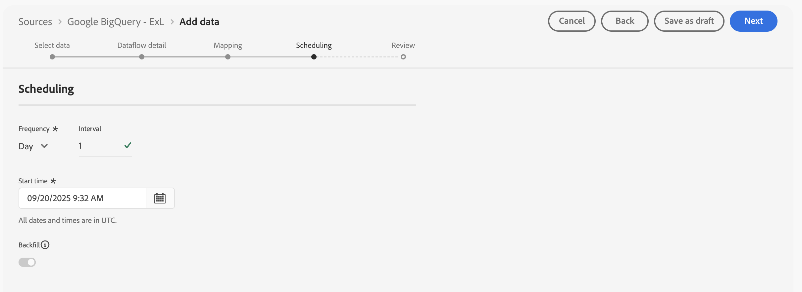

# Relationale Daten spiegeln und verwenden

{{release-limited-testing}}

In dieser Kurzanleitung wird erläutert, wie Sie [Experience Platform Data Mirror for Customer Journey Analytics](data-mirror.md) verwenden können, um relationale Daten aus einer Data Warehouse-nativen Lösung in Adobe Experience Platform zu spiegeln. Und dann benutzen wir diese Daten in Customer Journey Analytics.

Um diesen Anwendungsfall zu erreichen, müssen Sie:

* **Verwenden einer nativen Data Warehouse-Lösung** um Daten zu speichern, die Sie in Experience Platform spiegeln möchten. Verwenden Sie diese Daten dann in Customer Journey Analytics, um Berichte zu erstellen und sie zu analysieren.

* **Einrichten eines Schemas** in Experience Platform, um das Modell (Schema) der Daten zu definieren, die Sie spiegeln möchten.

* **Verwenden Sie einen Quell-Connector** in Experience Platform, um Ihre gespiegelten Daten in einen Datensatz zu übertragen.

* **Richten Sie in Customer Journey Analytics eine Verbindung ein**. Diese Verbindung sollte (zumindest) Ihren relationalen Experience Platform-Datensatz enthalten.

* **Richten Sie in Customer Journey Analytics eine Datenansicht ein**, um Metriken und Dimensionen zu definieren, die Sie in Analysis Workspace verwenden möchten.

* **Richten Sie in Customer Journey Analytics ein Projekt ein**, um Berichte und Visualisierungen zu erstellen.

Experience Platform Data Mirror für Customer Journey Analytics erfordert relationale Schemata.


>[!NOTE]
>
>Diese Kurzanleitung ist eine vereinfachte Anleitung zum Spiegeln relationaler Daten in Adobe Experience Platform und zur Verwendung dieser Daten in Customer Journey Analytics. Es wird dringend empfohlen, die zusätzlichen Artikel zu lesen, auf die verwiesen wird.

{{relational-model-based}}

## Verwenden einer nativen Data Warehouse-Lösung

In dieser Kurzanleitung wird [[!DNL Google BigQuery]](datawarehouse.md#google-bigquery) als native Data Warehouse-Lösung verwendet. Andere [unterstützte Lösungen](datawarehouse.md) sind [[!DNL Snowflake]](datawarehouse.md#snowflake) und [[!DNL Azure Databricks]](datawarehouse.md#azure-databricks).

In [!DNL Google BigQuery] werden die folgenden Beispieldaten regelmäßig in einer Tabelle mit dem Namen **[!UICONTROL eventdata]** gespeichert und aktualisiert.

+++ Details zu Beispielereignisdaten

| timestamp | ID | pageName | PersonID | trackingCode | Bestellungen | Einnahmenbetrag |
| :---                      |  ---: | :---              | :---            | :---          |   ---: | :---           |
| 2025-03-06T19:15:39+00:00 | 10001 | Startseite | person-1abc123 | abc123 |        |                |
| 2025-03-06T19:15:39+00:00 | 10002 | Bestätigungsseite | person-1abc123 |               | 1 | 174,25 |
| 2025-03-06T19:15:39+00:00 | 10003 | Startseite | person-2def123 | def123 |        |                |
| 2025-03-06T19:15:39+00:00 | 10004 | Startseite | person-3ghi123 | ghi123 |        |                |
| 2025-03-06T19:15:39+00:00 | 10005 | Bestätigungsseite | person-3ghi123 |               | 1 | 149,25 |
| 2025-03-06T19:15:39+00:00 | 10006 | Startseite | person-4abc456 | ABC456 |        |                |
| 2025-03-06T19:15:39+00:00 | 10007 | Startseite | person-5def456 | def456 |        |                |
| 2025-03-06T19:15:39+00:00 | 10008 | Startseite | person-6ghi456 | GHI456 |        |                |
| 2025-03-06T19:15:39+00:00 | 10009 | Bestätigungsseite | person-6ghi456 |               | 1 | 159,25 |
| 2025-03-06T19:15:39+00:00 | 10010 | Startseite | person-7abc789 | ABC789 |        |                |
| 2025-03-06T19:15:39+00:00 | 10011 | Startseite | person-8def789 | DEF789 |        |                |
| 2025-03-06T19:15:39+00:00 | 10012 | Startseite | person-9ghi789 | ghi789 |        |                |
| 2025-03-06T19:15:39+00:00 | 10013 | Bestätigungsseite | person-9ghi789 |               | 1 | 124,25 |
| 2025-03-06T19:15:39+00:00 | 10014 | Startseite | person-10abc987 | ABC987 |        |                |
| 2025-03-06T19:15:39+00:00 | 10015 | Startseite | person-11def987 | DEF987 |        |                |
| 2025-03-06T19:15:39+00:00 | 10016 | Startseite | person-12ghi987 | ghi987 |        |                |
| 2025-03-06T19:15:39+00:00 | 10017 | Startseite | person-13abc654 | ABC654 |        |                |
| 2025-03-06T19:15:39+00:00 | 10018 | Startseite | person-14def654 | DEF654 |        |                |
| 2025-03-06T19:15:39+00:00 | 10019 | Startseite | person-15ghi654 | ghi654 |        |                |
| 2025-03-06T19:15:39+00:00 | 10020 | Bestätigungsseite | person-15ghi654 |               | 1 | 174,25 |

+++

Die Daten werden in einer Datenbanktabelle mit einem verknüpften Schema gespeichert. So überprüfen Sie die Datenbanktabelle:

1. Melden Sie sich bei Google BigQuery an.
1. Wählen Sie **[!UICONTROL BigQuery]** > **[!UICONTROL Studio]** aus.
1. Projekt, Datensatz und Tabelle auswählen. Auf der Registerkarte **[!UICONTROL Schema]** sehen Sie eine Übersicht über das Schema für die Ereignisdaten.

   

So überprüfen Sie die Daten:

1. Wählen Sie **[!UICONTROL Abfrage]** aus.
1. Führen Sie eine Beispielabfrage im Abfrage-Editor aus, wobei `project` der Name Ihres Projekts und `datasets` der Name Ihrer Datensätze ist:

   ```sql
   SELECT * FROM `project.datasets.eventdata` LIMIT 100
   ```

   

Für Experience Platform Data Mirror für Customer Journey Analytics müssen die Tabellen in Ihrer nativen Data Warehouse-Lösung für den Änderungsverlauf aktiviert sein. So überprüfen Sie, ob die Tabelle für den Änderungsverlauf aktiviert ist:

1. Führen Sie die folgende SQL-Anweisung im Abfrage-Editor aus, um die Einstellung zu überprüfen, wobei `project` der Name Ihres Projekts und `datasets` der Name Ihrer Datensätze ist:

   ```sql
   SELECT
      table_name,
      MAX(CASE WHEN option_name = 'enable_change_history' THEN option_value END) AS enable_change_history
   FROM `project.datasets.INFORMATION_SCHEMA.TABLE_OPTIONS`
   WHERE table_name = 'eventdata'
   GROUP BY table_name
   ORDER BY table_name;
   ```

1. Wenn das Ergebnis nicht **[!UICONTROL TRUE]** lautet, verwenden Sie die folgende SQL-Anweisung, um den Änderungsverlauf zu aktivieren, wobei `project` der Name Ihres Projekts und `datasets` der Name Ihrer Datensätze ist:

   ```sql
   ALTER TABLE `project.datasets.eventdata` 
   SET OPTIONS (enable_change_history = TRUE);
   ```

Die Daten in der Tabelle in Ihrer Data Warehouse-nativen Lösung sind für Experience Platform Data Mirror für Customer Journey Analytics bereit.


## Einrichten eines Schemas

Um Daten in Experience Platform zu spiegeln, müssen Sie zunächst das Schema für die Daten definieren. Alle Daten, die Sie in Experience Platform spiegeln möchten und Experience Platform Data Mirror für Customer Journey Analytics verwenden, müssen einem relationalen Schema entsprechen.

Definieren Sie ein Schema, das diese Daten modelliert. Gehen Sie folgendermaßen vor, um das Schema einzurichten:

1. Wählen Sie in der Adobe Experience Platform-Benutzeroberfläche in der linken Leiste die Option **[!UICONTROL Schemata]** unter **[!UICONTROL Daten-Management]**.

1. Wählen Sie **[!UICONTROL Schema erstellen]** aus.
1. Wählen Sie aus dem Dropdown-Menü **[!UICONTROL Relational]** aus.
1. Wenn ein Popup mit der Option angezeigt wird, zwischen **[!UICONTROL Manuell erstellen]** oder **[!UICONTROL DDL-Datei hochladen]**:
   1. Wählen Sie **[!UICONTROL Manuell erstellen aus]**.

      

   1. Klicken Sie auf **[!UICONTROL Weiter]**.
1. In der Benutzeroberfläche **[!UICONTROL Schemata]** > **[!UICONTROL Relationales Schema erstellen]**:
   1. Geben Sie einen **[!UICONTROL Anzeigenamen des Schemas]** ein. Beispiel: `Sample Event Feed Schema`.
   1. Geben Sie eine **[!UICONTROL Beschreibung]** ein. Beispiel: `Sample event feed schema for a relational schema`.
   1. Wählen Sie **[!UICONTROL Zeitreihe]** als **[!UICONTROL Schemaverhalten]** aus. Sie wählen **[!UICONTROL Zeitreihe]** für zeitreihenbasierte Daten und **[!UICONTROL Datensatz]** für datensatzbasierte Daten aus. Das Verhalten definiert die Struktur des Schemas und die enthaltenen Eigenschaften.

      Experience Platform Data Mirror für Customer Journey Analytics wird hauptsächlich für Zeitreihendaten (z. B. Ereignisdaten) verwendet.

      

   1. Wählen Sie **[!UICONTROL Beenden]** aus.

1. In der Benutzeroberfläche **[!UICONTROL Schemata]** > **[!UICONTROL Beispiel-Ereignisfeed-]**) wird eine Warnung angezeigt, dass relationale Schemata die Aufnahme als Änderungszeilen unterstützen.

   

   Die Aufnahme als Änderungszeilen wird auch als Änderungsdatenerfassung (Change Data Capture, CDC) bezeichnet. Zur Unterstützung der Änderungsdatenerfassung erfordert das Schema Folgendes:

   * Primärer Schlüssel.
   * Versionsdeskriptor
   * Zeitstempeldeskriptor für Zeitreihendaten.

1. Wählen Sie  neben **[!UICONTROL Beispielereignis-Feed-Schema]** aus, um Felder zum Schema hinzuzufügen. Fügen Sie die folgenden Felder mit Datentyp und zusätzlichen Attributen zum Schema hinzu.

   | Feldname | Anzeigename | Typ | Zusätzliche Attribute |
   |---|---|---|---|
   | `id` | `Id` | **[!UICONTROL Integer]** |  Versionsdeskriptor |
   | `orders` | `Orders` | **[!UICONTROL Integer]** | |
   | `pagename` | `Page Name` | **[!UICONTROL String]** | |
   | `personid` | `Person Id` | **[!UICONTROL String]** |  Primärer Schlüssel<br/> Identität<br/>Wählen Sie CRMID für den Identity-Namespace. |
   | `revenueamount` | `Revenue Amount` | **[!UICONTROL Double]** | |
   | `timestamp` | `Timestamp` | **[!UICONTROL DateTime]** |  Zeitstempeldeskriptor |
   | `trackingcode` | `Tracking Code` | **[!UICONTROL String]** | |


   * Das Feld **[!UICONTROL id]** wird als **[!UICONTROL Versionsdeskriptor]** konfiguriert.

     

   * Das Feld **[!UICONTROL personid]** wird zusammen mit **[!UICONTROL timestamp]** als Primärer Schlüssel **&#x200B;**&#x200B;konfiguriert. Wählen Sie  **[!UICONTROL Zusammengesetzten Primärschlüssel erstellen]** aus, um einen zusammengesetzten Schlüssel zu erstellen.

     

     Das **[!UICONTROL personid]**-Feld wird auch als **[!UICONTROL Identity]** konfiguriert, mit **[!UICONTROL CRMID]** als **[!UICONTROL Identity-Namespace]**.

     

   * Das Feld **[!UICONTROL Zeitstempel]** wird zusammen mit dem Feld **[!UICONTROL personid]** als Primärer Schlüssel **&#x200B;**&#x200B;konfiguriert. Das **[!UICONTROL Zeitstempel]**-Feld wird auch als **[!UICONTROL Zeitstempeldeskriptor]** konfiguriert. Sie müssen nur ein Feld als **[!UICONTROL Zeitstempeldeskriptor]** für relationale Zeitreihendaten definieren.

     


   Wenn Sie **[!UICONTROL Primären Schlüssel]**, **[!UICONTROL Versionsdeskriptor]** und **[!UICONTROL Zeitstempeldeskriptor]** korrekt definiert haben, verschwindet die Warnung über der Schemadefinition.

1. Wählen Sie **[!UICONTROL Speichern]** aus, um Ihr Schema zu speichern.


## Verwenden eines Quell-Connectors

Sie verwenden einen Quell-Connector, um die native Data Warehouse-Lösung mit Experience Platform zu verbinden.

In der Benutzeroberfläche von Experience Platform:

1. Wählen Sie **[!UICONTROL Quellen]** aus.
1. Wählen oder suchen Sie nach **[!UICONTROL Google BigQuery]**.
1. Wählen Sie **[!UICONTROL Daten hinzufügen]** aus.

Der Assistent Daten hinzufügen führt Sie durch die folgenden Schritte, um die Daten aus der Tabelle in [!DNL Google BigQuery] mit Experience Platform zu verbinden.

### Authentifizierung

Wählen **[!UICONTROL im Schritt]** Authentifizierung“ Folgendes aus:

* **[!UICONTROL Vorhandenes Konto]** wenn Sie bereits ein Konto für Google BigQuery eingerichtet haben. Fahren Sie mit dem Schritt [Daten auswählen](#select-data) fort.
* **[!UICONTROL Neues Konto]** wenn Sie eine Verbindung zu Google BigQuery herstellen müssen.
   1. Geben Sie einen **[!UICONTROL Kontonamen]** und (optional) **[!UICONTROL Beschreibung]** an.
   1. Wählen Sie Ihren **[!UICONTROL Authentifizierungstyp]** aus: **[!UICONTROL Standardauthentifizierung]** oder **[!UICONTROL Service-]**. Geben Sie je nach Auswahl die erforderlichen Eingaben ein.
   1. Wählen Sie **[!UICONTROL Mit Quelle verbinden]**

      

      Ihre Verbindung wurde verifiziert. Ein  **[!UICONTROL Verbunden]** zeigt eine erfolgreiche Verbindung an.

   1. Klicken Sie auf **[!UICONTROL Weiter]**.

  In der Experience Platform-Dokumentation finden Sie Einzelheiten zur Verbindung und Authentifizierung bei der Verwendung des [Azure Databricks](https://experienceleague.adobe.com/de/docs/experience-platform/sources/connectors/databases/databricks) oder [Snowflake](https://experienceleague.adobe.com/de/docs/experience-platform/sources/connectors/databases/snowflake)-Connectors.


### Daten auswählen

Im Schritt **[!UICONTROL Daten auswählen]**:

1. Wählen Sie die Tabelle aus der Liste der Tabellen aus. Beispiel: **[!UICONTROL eventdata]**.

   

   Ein Beispiel für die zur Überprüfung angezeigten Daten wird angezeigt.

1. Klicken Sie auf **[!UICONTROL Weiter]**, um fortzufahren.


### Datenflussdetails

Im Schritt **[!UICONTROL Datenflussdetails]**:

1. Wählen **[!UICONTROL Änderungsdatenerfassung aktivieren]**. Ein **[!UICONTROL Change data collection requirement]**-Informationsfeld wird mit weiteren Informationen angezeigt.
1. Wählen Sie **[!UICONTROL Neuer Datensatz]** für **[!UICONTROL Zieldatensatz]** aus, um einen neuen Datensatz zu erstellen, der die gespiegelten Daten enthält.
1. Geben Sie einen **[!UICONTROL Namen des Ausgabedatensatzes]** ein. Beispiel: `event-data-mirror`.
1. Wählen Sie aus dem Dropdown-Menü **[!UICONTROL Schema]** das zuvor erstellte relationale Schema aus. Beispiel: **[!UICONTROL Beispielereignis-Feed-Schema]**.

   

1. Geben Sie weitere Details an.
1. Klicken Sie auf **[!UICONTROL Weiter]**.


### Zuordnen

Im Schritt **[!UICONTROL Zuordnung]**:

1. Ordnen Sie die Felder zu. Vom Schema in Google BigQuery (**[!UICONTROL Source-Daten]**) bis zu den Feldern im Schema, die Sie in Experience Platform definiert haben (**[!UICONTROL Zielfelder]**).

   

1. Wenn alle Felder korrekt zugeordnet sind, wählen Sie **[!UICONTROL Weiter]** aus, um fortzufahren.


### Zeitplan

Im Schritt **[!UICONTROL Planung]**:

1. Geben Sie **[!UICONTROL Häufigkeit]** und **[!UICONTROL Intervall]** an, um die Synchronisierung der gespiegelten Daten zu planen.
1. Geben Sie die **[!UICONTROL Startzeit]** für den Zeitplan an.

   

1. Klicken Sie auf **[!UICONTROL Weiter]**, um fortzufahren.


### Überprüfung

Im Schritt **[!UICONTROL Überprüfen]**.

1. Überprüfen Sie die Konfiguration für den Quell-Connector.

   

1. Wählen Sie **[!UICONTROL Beenden]** aus. Sie werden zum konfigurierten Datenfluss weitergeleitet.

   


## Einrichten einer Verbindung

In dieser Kurzanleitung erstellen Sie eine neue Verbindung, um die gespiegelten Daten aus Experience Platform zu verwenden. Alternativ können Sie die gespiegelten Daten zu einer vorhandenen Verbindung hinzufügen.

In der Benutzeroberfläche von Customer Journey Analytics:

1. Wählen **[!UICONTROL Verbindungen]** aus dem Menü **[!UICONTROL Daten-Management]** aus.
1. Wählen Sie **[!UICONTROL Neue Verbindung erstellen]** aus.
1. Geben Sie den erforderlichen **[!UICONTROL Verbindungsnamen]**, **[!UICONTROL Sandbox]**, **[!UICONTROL Durchschnittliche Anzahl der täglichen Ereignisse]** und andere optionale Parameter an.
1. Wählen Sie **[!UICONTROL Datensätze hinzufügen]** aus.

   1. Im Schritt **[!UICONTROL Auswählen von]**&quot; von **[!UICONTROL Hinzufügen von Datensätzen]**:

      1. Wählen Sie den Datensatz aus, der die gespiegelten Daten enthält. Beispiel: **[!UICONTROL event-data-mirror]**. Der Datensatz hat **[!UICONTROL relationale]** als **[!UICONTROL Datensatztyp]**.

         

      1. Fügen Sie alle zusätzlichen Datensätze hinzu, die für die Verbindung relevant sind.
      1. Klicken Sie auf **[!UICONTROL Weiter]**.

   1. Im Schritt **[!UICONTROL Datensatzeinstellungen]** von **[!UICONTROL Datensätze hinzufügen]**:

      Für den **[!UICONTROL event-data-mirror]** relationalen Datensatz

      1. Wählen Sie **[!UICONTROL Ereignis]** als **[!UICONTROL Datensatztyp]**.
      1. Wählen Sie das **[!UICONTROL PersonId]** als **[!UICONTROL Personen-ID]**.
      1. **[!UICONTROL Zeitstempel]** wird automatisch als &quot;**[!UICONTROL &quot;]**.
      1. Wählen Sie **[!UICONTROL Sonstige]** als **[!UICONTROL Datenquellentyp]**.
      1. Geben Sie `Google BigQuery Event Data` als **[!UICONTROL Beschreibung der Datenquelle“]**.
      1. Geben Sie andere Details an, z **[!UICONTROL B. „Alle neuen Daten importieren]** und **[!UICONTROL Alle vorhandenen Daten aufstocken]**.

         

      Geben Sie optional Details für andere Datensätze an.

   1. Wählen Sie **[!UICONTROL Datensätze hinzufügen]** aus.
1. Wählen Sie **[!UICONTROL Speichern]** aus.

Nachdem Sie eine [Verbindung](/help/connections/overview.md) erstellt haben, können Sie verschiedene Verwaltungsaufgaben ausführen. Beispielsweise [Auswählen und Kombinieren &#x200B;](/help/connections/combined-dataset.md) Datensätzen[&#x200B; Überprüfen des Status der Datensätze einer Verbindung und des Status &#x200B;](/help/connections/manage-connections.md) Datenaufnahme).


## Einrichten einer Datenansicht

Gehen Sie folgendermaßen vor, um eine Datenansicht zu erstellen:

1. Wählen Sie in der Benutzeroberfläche von Customer Journey Analytics **[!UICONTROL Datenansichten]**, optional unter **[!UICONTROL Daten-Management]** im oberen Menü aus.

2. Wählen Sie **[!UICONTROL Neue Datenansicht erstellen]**.

3. Im Schritt **[!UICONTROL Konfigurieren]**:

   1. Wählen Sie Ihre Verbindung in der Liste **[!UICONTROL Verbindung]**.

   1. Geben Sie einen Namen und (optional) eine Beschreibung für Ihre Verbindung ein.

   1. Wählen Sie **[!UICONTROL Speichern und fortfahren]** aus.

4. Im Schritt **[!UICONTROL Komponenten]**:

   1. Fügen Sie alle Schemafelder und/oder Standardkomponenten hinzu, die Sie in die Komponentenfelder **[!UICONTROL METRIKEN]** oder **[!UICONTROL DIMENSIONEN]** aufnehmen möchten. Stellen Sie sicher, dass Sie relevante Felder aus dem Datensatz hinzufügen, der die gespiegelten Daten enthält. Zugriff auf diese Felder:

      1. Wählen Sie **[!UICONTROL Ereignis-Datensätze]** aus.
      1. Wählen Sie **[!UICONTROL Ad-hoc- und relationale Felder]**.
      1. Ziehen Sie Felder aus den relationalen Schemata per Drag-and-Drop auf **[!UICONTROL METRIKEN]** oder **[!UICONTROL DIMENSIONEN]**.

         

   1. Abgeleitete Felder für Felder definieren, die nicht den richtigen Typ haben, nicht das richtige Format aufweisen oder aus anderen Gründen geändert werden sollen. Beispiel: für &quot;**[!UICONTROL &quot;]**.

      1. Wählen Sie **[!UICONTROL Abgeleitetes Feld erstellen.]**
      1. Im Editor für abgeleitete Felder:
         1. Definieren Sie ein neues `Revenue Amount (Numeric)`, wie unten dargestellt.

            

         1. Wählen Sie **[!UICONTROL Speichern]** aus.
      1. Ziehen Sie das neue **[!UICONTROL Abgeleitete (numerische]** Umsatzbetrag) und legen Sie das Feld in &quot;**[!UICONTROL &quot;]**.

         

   1. Wählen Sie **[!UICONTROL Speichern und fortfahren]** aus.

5. Im Schritt **[!UICONTROL Einstellungen]**:

   Behalten Sie die Einstellungen bei und wählen Sie **[!UICONTROL Speichern und beenden]**.

Weitere Informationen [&#x200B; Erstellen und Bearbeiten einer Datenansicht finden &#x200B;](../data-views/data-views.md) unter Datenansichten - Übersicht . Und welche Komponenten in Ihrer Datenansicht verfügbar sind und wie Sie Segment- und Sitzungseinstellungen verwenden.


## Einrichten eines Projekts

Analysis Workspace ist ein flexibles Browser-Tool, mit dem Sie schnell Analysen erstellen und Erkenntnisse basierend auf Ihren Daten austauschen können. Mit Analysis Workspace-Projekten können Sie Datenkomponenten, Tabellen und Visualisierungen kombinieren, um eine Analyse zu erstellen, und diese für andere Personen in Ihrem Unternehmen freigeben.

Gehen Sie folgendermaßen vor, um ein Projekt zu erstellen:

1. Wählen Sie in der Customer Journey Analytics-Benutzeroberfläche im oberen **[!UICONTROL die Option]** Workspace.

2. Wählen Sie **[!UICONTROL Projekte]** in der linken Navigation aus.

3. Wählen Sie **[!UICONTROL Projekt erstellen]** aus. Im Popup:


   1. Wählen Sie **[!UICONTROL Leeres Workspace-Projekt]** aus.

   1. Wählen Sie **[!UICONTROL Erstellen]** aus.


4. Stellen Sie im Arbeitsbereich **[!UICONTROL Neues Projekt]** sicher, dass [Datenansicht](#set-up-a-data-view) ausgewählt ist. Diese Datenansicht verweist auf die [Verbindung](#set-up-a-connection) die die gespiegelten Daten enthält.

5. Um Ihren ersten Bericht zu erstellen, ziehen Sie Dimensionen und Metriken per Drag-and-Drop in die **[!UICONTROL Freiformtabelle]** im Bedienfeld **[!UICONTROL Freiform]**. Ziehen Sie beispielsweise **[!UICONTROL Umsatzbetrag (numerisch))]** auf **[!UICONTROL _Ziehen Sie hier eine Metrik_]**. Ziehen Sie **[!UICONTROL PersonId]** und legen Sie das Feld in der ersten Spaltenüberschrift ab. Nehmen Sie nach Bedarf weitere Anpassungen vor.

   Das Endergebnis ist ein Überblick über Profile und deren Umsätze, die auf gespiegelten Daten aus einer Google BigQuery-Tabelle basieren.

   

Weitere Informationen zum Erstellen von Projekten und zum Durchführen einer Analyse mithilfe von Komponenten, Visualisierungen und Bedienfeldern finden Sie unter [Analysis Workspace – Überblick](../analysis-workspace/home.md).

>[!SUCCESS]
>
>Sie haben jetzt alle Schritte ausgeführt. Sie haben zunächst definiert, welche gespiegelten Daten Sie aus einer Data Warehouse-nativen Lösung erfassen möchten (Schema). Und wo diese Daten (Datensatz) in Experience Platform gespeichert werden. Sie haben den entsprechenden Quell-Connector konfiguriert, um die gespiegelten Daten in Experience Platform bereitzustellen. Sie haben eine Verbindung in Customer Journey Analytics definiert, um die gespiegelten Ereignisdaten und (optional) andere Daten zu verwenden. Mit der Definition Ihrer Datenansicht konnten Sie angeben, welche Dimension und Metriken aus den gespiegelten Daten verwendet werden sollen. Und schließlich haben Sie Ihr erstes Projekt erstellt, in dem Ihre gespiegelten Daten visualisiert und analysiert werden.
