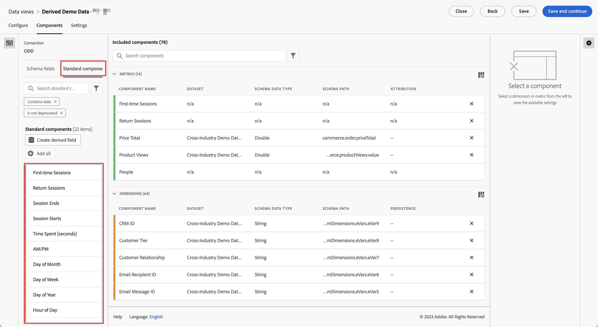

# Standardkomponentenreferenz

Die meisten Dimensionen und Metriken in Customer Journey Analytics basieren auf Schemaelementen aus Ihrem Adobe Experience Platform-Datensatz. Es stehen jedoch mehrere Komponenten zur Verfügung, die unabhängig von der verwendeten Verbindung zu einer Datenansicht hinzugefügt werden können.

[!UICONTROL Standardkomponenten] sind Komponenten, die nicht aus Datensatz-Schemafeldern, sondern vom System generiert werden. Einige Systemkomponenten sind erforderlich, um die Reporting-Funktionen in Analysis Workspace zu erleichtern, wohingegen andere Systemkomponenten optional sind.

## Erforderliche Standardkomponenten {#required}

Diese erforderlichen Standardkomponenten werden standardmäßig jeder Datendatei-Ansicht hinzugefügt. Sie sind von wesentlicher Bedeutung für die Reporting-Funktionen, die Customer Journey Analytics bietet.

### Standarddimensionen

{{standard-dimensions}}

### Standardmetriken

{{standard-metrics}}

## Optionale Standardkomponenten {#optional}

Optionale Standardkomponenten sind unter **[!UICONTROL Datenansichten]** > **[!UICONTROL Datenansicht bearbeiten]** > Registerkarte **[!UICONTROL Komponenten]** > Registerkarte **[!UICONTROL Standardkomponenten]** verfügbar.

| Name der Komponente | Dimension oder Metrik | Anmerkungen und Werte |
| --- | --- | --- |
| [!UICONTROL Vormittag/Nachmittag] | Zeitunterteilungsdimension | Vormittag oder Nachmittag |
| [!UICONTROL Batch-ID] | Dimension | Kennung für den Experience Platform-Batch, zu [!UICONTROL &#x200B; ein &#x200B;] gehört hat. |
| [!UICONTROL Datensatz-ID] | Dimension | Kennung für den Experience Platform-Datensatz, zu [!UICONTROL &#x200B; ein &#x200B;] gehört hat. |
| [!UICONTROL Tag des Monats] | Zeitunterteilungsdimension | 1–31 |
| [!UICONTROL Wochentag] | Zeitunterteilungsdimension | Montag, Dienstag, Mittwoch, Donnerstag, Freitag, Samstag, Sonntag |
| [!UICONTROL Tag des Jahres] | Zeitunterteilungsdimension | 1–366 |
| [!UICONTROL Stunde des Tages] | Zeitunterteilungsdimension | 0–23 |
| [!UICONTROL &#x200B; Monat des Jahres] | Zeitunterteilungsdimension | Januar–Dezember |
| [!UICONTROL Erstmalige Sitzungen] | Metrik | Die definierte erste Sitzung einer Person im Reporting-Zeitraum. [Weitere Informationen](https://experienceleague.adobe.com/docs/analytics-platform/using/cja-dataviews/data-views-usecases.html?lang=de#new-repeat) |
| [!UICONTROL Rückkehrende Sitzungen] | Metrik | Die Anzahl der Sitzungen, die nicht die erste Sitzung einer Person waren. [Weitere Informationen](https://experienceleague.adobe.com/docs/analytics-platform/using/cja-dataviews/data-views-usecases.html?lang=de#new-repeat) |
| [!UICONTROL Personen-ID] | Dimension | Für jedes in Experience Platform definierte Datensatzschema kann ein eigener Satz von einer oder mehreren Identitäten definiert und mit einem Identity-Namespace verknüpft werden. Jede dieser Identitäten kann als Personen-ID verwendet werden. Beispiele sind Cookie-ID, zugeordnete ID, Benutzer-ID und Trackingcode. Die Dimension [!UICONTROL Personen-ID] ist die Grundlage für die Kombination von Datensätzen und die Identifizierung von eindeutigen Personen in Customer Journey Analytics.
Mögliche Anwendungsfälle sind:<ul><li>Erstellen Sie ein Segment für einen bestimmten Personen-ID-Wert, um alles nach dem Verhalten dieses Benutzers zu segmentieren.</li><li>Debugging: Prüfen, ob die Daten für eine bestimmte Cookie-ID (oder eine bestimmte Kunden-ID) vorhanden sind.</li><li>Identifizieren der Benutzer, die bei einem Callcenter angerufen haben.</li></ul> |
| [!UICONTROL Personen-ID-Namespace] | Dimension | Aus welchem ID-Typ die [!UICONTROL Personen-ID] besteht. Beispiele sind: `email address`, `cookie ID` und `Analytics ID` |
| [!BADGE B2B Edition]{type=Informative url="https://experienceleague.adobe.com/de/docs/analytics-platform/using/cja-overview/cja-b2b/cja-b2b-edition" newtab=true tooltip="Customer Journey Analytics B2B Edition"} [!UICONTROL Globale Konto-ID] | Dimension | Die [!UICONTROL globale Konto-ID], wenn Sie den Container „Globales Konto“ in Ihrer Verbindung verwenden. |
| [!BADGE B2B Edition]{type=Informative url="https://experienceleague.adobe.com/de/docs/analytics-platform/using/cja-overview/cja-b2b/cja-b2b-edition" newtab=true tooltip="Customer Journey Analytics B2B Edition"} [!UICONTROL Konto-ID] | Dimension | Die [!UICONTROL Konto-ID], wenn Sie den Konto-Container in Ihrer Verbindung verwenden. |
| [!BADGE B2B Edition]{type=Informative url="https://experienceleague.adobe.com/de/docs/analytics-platform/using/cja-overview/cja-b2b/cja-b2b-edition" newtab=true tooltip="Customer Journey Analytics B2B Edition"} [!UICONTROL Opportunity-ID] | Dimension | Die [!UICONTROL Opportunity-ID], wenn Sie den Container „Opportunity“ in Ihrer Verbindung verwenden. |
| [!BADGE B2B Edition]{type=Informative url="https://experienceleague.adobe.com/de/docs/analytics-platform/using/cja-overview/cja-b2b/cja-b2b-edition" newtab=true tooltip="Customer Journey Analytics B2B Edition"} [!UICONTROL Käufergruppen-ID] | Dimension | Die [!UICONTROL Käufergruppen-ID], wenn Sie den Container „Käufergruppe“ in Ihrer Verbindung verwenden. |
| [!UICONTROL Quartal des Jahres] | Zeitunterteilungsdimension | Q1, Q2, Q3, Q4 |
| [!UICONTROL Sitzung wiederholen] | Metrik | Die Anzahl der Sitzungen, die nicht die allererste Sitzung einer Person waren. [Weitere Informationen](https://experienceleague.adobe.com/docs/analytics-platform/using/cja-dataviews/data-views-usecases.html?lang=de#new-repeat) |
| [!UICONTROL Sitzungstyp] | Dimension | Diese Dimension hat zwei Werte: 1. [!UICONTROL Erstmalig] und 2. „Wiederkehrend“. Der Zeileneintrag [!UICONTROL Erstmalig] enthält das gesamte Verhalten (d. h. die Metriken für diese Dimension) in einer Sitzung, die als erste Sitzung einer Person definiert wurde. Alles andere ist im Zeileneintrag [!UICONTROL Wiederkehrend] enthalten (vorausgesetzt, dass alles zu einer Sitzung gehört). Wenn Metriken nicht Teil einer Sitzung sind, fallen sie in den Bucket „Nicht zutreffend“ für diese Dimension. [Weitere Informationen](https://experienceleague.adobe.com/docs/analytics-platform/using/cja-dataviews/data-views-usecases.html?lang=de#new-repeat) |
| [!UICONTROL Aufgewendete Zeit pro Ereignis] | Dimension | Sammelt die Metrik [!UICONTROL Verwendete Zeit] in Buckets des Typs [!UICONTROL Ereignis]. |
| [!UICONTROL Aufgewendete Zeit pro Sitzung] | Dimension | Fasst die Metrik [!UICONTROL Aufgewendete Zeit] in Behältern des Typs [!UICONTROL Sitzung] zusammen. |
| [!UICONTROL Aufgewendete Zeit pro Person] | Dimension | Fasst die Metrik [!UICONTROL Aufgewendete Zeit] in Behältern des Typs [!UICONTROL Person] zusammen. |
| [!UICONTROL Wochenende]/[!UICONTROL Wochentag] | Zeitunterteilungsdimension | Wochenende oder Wochentag |

{style="table-layout:auto"}

>[!MORELIKETHIS]
>
>[Entdecken Sie mit der Funktion „Ereignistiefe“ detailliertere Kundenerkenntnisse](https://experienceleaguecommunities.adobe.com/t5/adobe-analytics-blogs/discover-deeper-customer-insights-with-adobe-customer-journey/ba-p/753947?profile.language=de#M576)
>