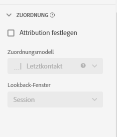

# Attributions-Komponenteneinstellungen {#attribution-component-settings}

<!-- markdownlint-disable MD034 -->

>[!CONTEXTUALHELP]
>id="cja_dataview_component_metric_attribution"
>title="Attribution"
>abstract="Konfigurieren Sie das Standard-Attributionsmodell, das in Berichten auf eine Metrik angewendet wird."

<!-- markdownlint-enable MD034 -->

Mit Attribution können Sie anpassen, wie Dimensionselemente Erfolgsereignissen zugeschrieben werden.

Zum Beispiel:

1. Eine Person auf Ihrer Site klickt auf einen Paid Search-Link zu einer Ihrer Produktseiten. Das Produkt wird zum Warenkorb hinzugefügt, aber nicht gekauft.
2. Am nächsten Tag sehen sie einen Social-Media-Post von einem ihrer Freunde. Er klickt auf den Link und schließt dann den Kauf ab.

In einigen Berichten möchten Sie die Bestellung eventuell Paid Search zuordnen. In anderen Berichten möchten Sie die Bestellung eventuell Social Media zuordnen. Mithilfe von Attribution können Sie diesen Aspekt der Berichterstattung steuern.

## Standardattributionsmodell einer Komponente festlegen

Sie können ein standardmäßiges Attributionsmodell für eine bestimmte Metrik festlegen, indem Sie die Einstellung der Metrik in der Datenansicht aktualisieren. Dadurch wird das Attributionsmodell der Metrik bei jeder Verwendung in Analysis Workspace außer Kraft gesetzt.

>[!NOTE]
>
>Beachten Sie beim Aktivieren der Attribution für eine Metrik Folgendes:
>
>* **Bei Verwendung der Komponente in einem Bericht mit *einer einzelnen Dimension*:** Die Attribution der Komponente ignoriert das Zuordnungsmodell, wenn ein nicht standardmäßiges Attributionsmodell verwendet wird.
>
>* **Bei Verwendung der Komponente in einem Bericht mit *mehreren Dimensionen*:** Die Attribution der Komponente behält das Zuordnungsmodell bei, wenn ein nicht standardmäßiges Attributionsmodell verwendet wird.
>
>   Mehrere Dimensionen sind nur verfügbar, wenn [Daten in die Cloud exportieren](/help/analysis-workspace/export/export-cloud.md).
>
> Weitere Informationen zur Zuordnung finden Sie unter [Einstellungen der Persistenz-Komponente](/help/data-views/component-settings/persistence.md).

So aktualisieren Sie das standardmäßige Attributionsmodell einer Komponente:

1. Rufen Sie die Datenansicht auf, die die Komponente enthält, deren standardmäßiges Attributionsmodell Sie aktualisieren möchten.

1. Wählen Sie die Komponente aus und erweitern Sie dann den Abschnitt Attribution auf der rechten Seite des Bildschirms.

   

1. Wählen Sie [!UICONTROL **Attribution festlegen**] und wählen Sie dann das Attributionsmodell im Dropdown-Menü [!UICONTROL **Attributionsmodell**] aus.

   Weitere Informationen zu den einzelnen Attributionsmodellen finden Sie unter [Attributionsmodelle](#attribution-models) .

1. Wählen Sie [!UICONTROL **Speichern und fortfahren**] aus.

>[!TIP]
>
>Wenn Ihre Organisation erfordert, dass eine Metrik über mehrere Attributionseinstellungen verfügt, können Sie eine der folgenden Aktionen durchführen:
>
> * Kopieren Sie die Metrik in der Datenansicht mit jeder gewünschten Attributionseinstellung. Sie können dieselbe Metrik mehrmals in eine Datenansicht einbeziehen, wodurch jede Metrik eine andere Einstellung erhält. Stellen Sie sicher, dass Sie jede Metrik entsprechend benennen, damit Analysten den Unterschied zwischen diesen Metriken bei der Berichterstellung verstehen.
>
> * Überschreiben Sie die Metrik in Analysis Workspace. Wählen Sie in den [Spalteneinstellungen](/help/analysis-workspace/visualizations/freeform-table/column-row-settings/column-settings.md) einer Metrik die Option **[!UICONTROL Nicht standardmäßiges Attributionsmodell verwenden]** aus, um das Attributionsmodell und das Lookback-Fenster der Metrik für diesen Bericht zu ändern.

## Attributionsmodelle {#attribution-models}

<!-- markdownlint-disable MD034 -->

>[!CONTEXTUALHELP]
>id="cja_dataviews_component_attribution_attributionmodels"
>title="Modell"
>abstract="Wählen Sie ein Attributionsmodell für die Metrik."

<!-- markdownlint-enable MD034 -->

{{attribution-models-details}}

## Lookback-Fenster

{{attribution-lookback-window}}

## Beispiel für Attribution {#attribution-example}

Siehe folgendes Beispiel:

1. Am 15. September gelangt eine Person über eine gebührenpflichtige Suchanzeige zu Ihrer Site und verlässt sie dann.
1. Am 18. September gelangt die Person erneut über einen Link in sozialen Medien zu Ihrer Site, den sie von einem Freund erhalten hat. Er fügt mehrere Artikel zum Warenkorb hinzu, erwirbt aber nichts.
1. Am 24. September sendet Ihr Marketing-Team eine E-Mail mit einem Coupon für einige der Artikel im Warenkorb. Der Coupon wird angewendet, der Besucher ruft aber mehrere andere Websites auf, um zu sehen, ob andere Coupons verfügbar sind. Er findet einen weiteren über eine Display-Anzeige und kauft dann letztendlich für 50 Euro ein.

Je nach Lookback-Fenster und Attributionsmodell erhalten Kanäle eine unterschiedliche Gewichtung. Im Folgenden finden Sie einige Beispiele:

* Bei Verwendung von **Erstkontakt** und einem **Sitzungs-Lookback-Fenster** betrachtet die Attribution nur den dritten Besuch. E-Mail kam vor Display-Anzeige, sodass E-Mail 100 % des Kaufs von 50 Euro zugeschrieben werden.

* Mithilfe von **Erstkontakt** und einem **Personen-Lookback-Fenster** betrachtet die Attribution alle drei Besuche. Paid Search kam zuerst, sodass Paid Search 100 % des Kaufs von 50 Euro zugeschrieben werden.

* Bei Verwendung von **linear** und einem **Sitzungs-Lookback-Fenster** wird die Gewichtung zwischen E-Mail und Anzeige aufgeteilt. Beiden Kanälen werden jeweils 25 USD gutgeschrieben.
Bei Verwendung von **linear** und einem **Personen-Lookback-Fenster** wird die Gewichtung zwischen Paid Search, Social Media, E-Mail und Display-Anzeige aufgeteilt. Jedem Kanal werden für diesen Kauf 12,50 Euro zugeschrieben.

* Bei Verwendung von **J-förmig** und einem **Personen-Lookback-Fenster** wird die Gewichtung zwischen Paid Search, Social Media, E-Mail und Display-Anzeige aufgeteilt.

   * Der Display-Anzeige werden 60 %, also 30 Euro, zugeschrieben.
   * Paid Search werden 20 %, also 10 Euro, zugeschrieben.
   * Die restlichen 20 % werden zwischen Social Media und E-Mail aufgeteilt (jeweils 5 Euro).

* Bei Verwendung von **Zeitverfall** und einem **Personen-Lookback-Fenster** wird die Gewichtung zwischen Paid Search, Social Media, E-Mail und Display-Anzeige aufgeteilt. Verwendung der standardmäßigen 7-Tage-Halbwertszeit:

   * Abstand von null Tagen zwischen Display-Touchpoint und Konversion. `2^(-0/7) = 1`
   * Abstand von null Tagen zwischen E-Mail-Touchpoint und Konversion. `2^(-0/7) = 1`
   * Abstand von sechs Tagen zwischen Social Touch-Point und Konversion. `2^(-6/7) = 0.552`
   * Abstand von neun Tagen zwischen Paid-Search-Touchpoint und Konversion. `2^(-9/7) = 0.41`
   * Die Normalisierung dieser Werte führt zu Folgendem:

      * Display-Anzeige: 33,8 %, 16,88 Euro
      * E-Mail: 33,8 %, 16,88 Euro
      * Social Media: 18,6 %, 9,32 Euro
      * Paid Search: 13,8 %, 6,92 Euro

Konversionsereignisse, die normalerweise ganze Zahlen aufweisen, werden aufgeteilt, wenn die Gewichtung für mehrere Kanäle erfolgt. Wenn beispielsweise zwei Kanäle mit einem linearen Attributionsmodell zu einer Bestellung beitragen, erhalten beide Kanäle 0,5 dieser Reihenfolge. Diese partiellen Metriken werden über alle Personen summiert und dann zur Berichterstellung auf die nächste Ganzzahl gerundet.

