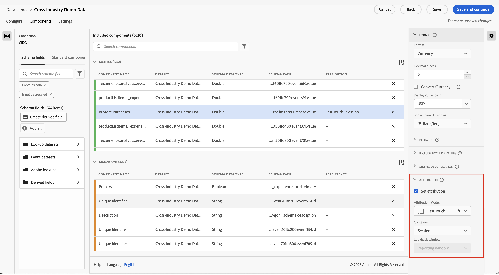

# Attributions-Komponenteneinstellungen {#attribution-component-settings}

<!-- markdownlint-disable MD034 -->

>[!CONTEXTUALHELP]
>id="dataview_component_metric_attribution"
>title="Attribution"
>abstract="Konfigurieren Sie das standardmäßige Attributionsmodell, das auf eine Metrik in Berichten angewendet wird."

<!-- markdownlint-enable MD034 -->

Attribution ermöglicht die Anpassung der Anrechnung von Dimensionselementen für Erfolgsereignisse.

Zum Beispiel:

1. Eine Person au Ihrer Site klickt auf einen Paid Search-Link zu einer Ihrer Produktseiten. Sie fügt das Produkt zum Warenkorb hinzu, kauft es jedoch nicht.
2. Am nächsten Tag sieht sie einen Social Media-Beitrag von einer Freundin bzw. einem Freund. Sie klickt auf den Link und schließt den Kauf ab.

In einigen Berichten möchten Sie die Bestellung eventuell Paid Search zuordnen. In anderen Berichten möchten Sie die Bestellung eventuell Social Media zuordnen. Mithilfe von Attribution können Sie diesen Aspekt des Berichts steuern.

## Festlegen des Attributionsmodells einer Komponente

Sie können das standardmäßige Attributionsmodell für eine bestimmte Komponente ändern, indem Sie die Einstellung der Komponente in der Datenansicht aktualisieren. Dadurch wird das Attributionsmodell der Komponente bei jeder Verwendung in Analysis Workspace überschrieben.

>[!NOTE]
>
>Beachten Sie Folgendes, wenn Sie ein nicht standardmäßiges Attributionsmodell für eine Metrik aktivieren:
>
>* **Bei Verwendung der Metrik in einem Bericht mit *einer einzelnen Dimension*:** Die Attribution der Metrik überschreibt das für die Dimension festgelegte Zuordnungsmodell. Beispielsweise überschreibt eine Metrik mit der Attribution „Erstkontakt“ eine Dimensionszuordnung „Zuletzt verwendet“.
>
>* **Bei Verwendung der Metrik in einem Bericht mit *mehreren Dimensionen*:** Die Attribution der Metrik wird für jede Dimension zusätzlich zum Zuordnungsmodell angewendet. Beispielsweise wird eine Metrik mit der Attribution „Erstkontakt“ auf eine Dimensionszuordnung „Zuletzt verwendet“ angewendet.
>
> Weitere Informationen zur Zuordnung finden Sie unter [Persistenz - Komponenteneinstellungen](/help/data-views/component-settings/persistence.md).

So aktualisieren Sie das standardmäßige Attributionsmodell einer Komponente:

1. Wechseln Sie zu zur Datenansicht mit der Komponente, deren standardmäßiges Attributionsmodell Sie aktualisieren möchten.

1. Wählen Sie die Komponente aus und erweitern Sie dann **[!UICONTROL Abschnitt]** Attribution“ auf der rechten Seite des Bildschirms.

   

1. Wählen [!UICONTROL **Attribution festlegen**] und wählen Sie dann das Fenster [Attributionsmodell](#attribution-models), [Container](#container) und [Lookback](#lookback-window) aus.

1. Wählen Sie [!UICONTROL **Speichern und fortfahren**] aus.

>[!TIP]
>
>Wenn Ihre Organisation verlangt, dass eine Metrik über mehrere Attributionseinstellungen verfügt, können Sie einen der folgenden Schritte ausführen:
>
> * Kopieren Sie die Metrik in die Datenansicht mit jeder gewünschten Attributionseinstellung. Sie können dieselbe Metrik mehrmals in eine Datenansicht einschließen, sodass jede Metrik eine andere Einstellung erhält. Achten Sie darauf, jede Metrik entsprechend zu kennzeichnen, damit Analystinnen und Analysten bei der Berichterstellung den Unterschied zwischen diesen Metriken erkennen.
>
> * Überschreiben Sie die Metrik in Analysis Workspace. Wählen Sie in den [Spalteneinstellungen](/help/analysis-workspace/visualizations/freeform-table/column-row-settings/column-settings.md) einer Metrik **[!UICONTROL Nicht standardmäßiges Zuordnungsmodell verwenden]** aus, um das Attributionsmodell und das Lookback-Fenster der Metrik für diesen spezifischen Bericht zu ändern.

## Attributionsmodelle {#attribution-models}

<!-- markdownlint-disable MD034 -->

>[!CONTEXTUALHELP]
>id="dataviews_component_attribution_attributionmodels"
>title="Modell"
>abstract="Wählen Sie ein Attributionsmodell für die Metrik aus."

<!-- markdownlint-enable MD034 -->

{{attribution-models-details}}

## Container

{{attribution-container}}

## Lookback-Fenster

{{attribution-lookback-window}}

## Beispiel

{{attribution-example}}
