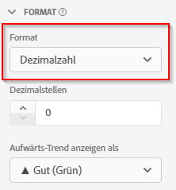

# Formatierungs-Komponenteneinstellungen {#format-component-settings}

<!-- markdownlint-disable MD034 -->

>[!CONTEXTUALHELP]
>id="cja_dataview_component_metric_format"
>title="Format"
>abstract="Legen Sie fest, wie eine Komponente in Berichten angezeigt wird."

<!-- markdownlint-enable MD034 -->

<!-- markdownlint-disable MD034 -->

>[!CONTEXTUALHELP]
>id="cja_dataview_component_metric_format_currencyconversion"
>title="Währungsumrechnung"
>abstract="Die Währungs-Code-Dimension kann ausgewählt werden, um die Währung in einem ausgewählten Währungstyp zu konfigurieren und anzuzeigen."

<!-- markdownlint-enable MD034 -->

Mit &quot;Format&quot;können Sie festlegen, wie eine bestimmte Metrik bei Verwendung in Berichten angezeigt wird.

## Formateinstellungen für eine Metrik konfigurieren

Sie können bestimmen, wie eine bestimmte Metrik angezeigt wird, indem Sie ihre Formateinstellungen anpassen.

1. Wählen Sie unter Customer Journey Analytics die Registerkarte [!UICONTROL **Datenansichten**] aus.

1. Wählen Sie die Datenansicht aus, die die Komponente enthält, deren Formateinstellung Sie konfigurieren möchten.

1. Wählen Sie die Registerkarte [!UICONTROL **Komponenten**] aus.

1. Wählen Sie die Komponente aus, die Sie konfigurieren möchten, und erweitern Sie dann den Abschnitt [!UICONTROL **Format**] auf der rechten Seite der Seite.

   

1. Geben Sie die folgenden Informationen an:

   | Einstellung | Beschreibung |
   | --- | --- |
   | **[!UICONTROL Format]** | Hier können Sie die Formatierung einer Metrik als Dezimal, Zeit, Prozent oder Währung angeben. |
   | **[!UICONTROL Dezimal]** | Nicht sichtbar bei Schemadatentypen des Typs „Ganzzahl“. Hier können Sie die Anzahl der Dezimalstellen angeben, die eine Metrik anzeigt. |
   | **[!UICONTROL Datum]** | Hiermit können Sie bestimmen, wie das „date-time“-Feld angezeigt werden soll, wenn es als Dimension in Berichten verwendet wird. [Weitere Informationen](../../use-cases/data-views/data-views-usecases.md#date-and-date-time-use-cases) |
   | **[!UICONTROL Date-Time]** | Hiermit können Sie bestimmen, wie das „date-time“-Feld angezeigt werden soll, wenn es als Dimension in Berichten verwendet wird. [Weitere Informationen](../../use-cases/data-views/data-views-usecases.md#date-and-date-time-use-cases) |
   | **[!UICONTROL Währung]** | Ermöglicht Ihnen die Bestimmung der Währung, in der die Metrik angezeigt werden soll. 
Wenn Sie globale Daten analysieren, in denen Transaktionen in verschiedenen Währungen stattfinden, lesen Sie [Währungsumrechnung verwenden](#use-currency-conversion).
 |
   | **[!UICONTROL Aufwärts-Trend anzeigen als]** | Hier können Sie angeben, ob bei dieser Metrik ein Aufwärts-Trend gut (grün) oder schlecht (rot) ist. |
   | **[!UICONTROL Wert „True“]** und **[!UICONTROL Wert „False“]** | Nur bei booleschen Schemadatentypen sichtbar. Ermöglicht die Anpassung der Bezeichnung des Dimensionselements für die Werte `true` und `false`. |

   {style="table-layout:auto"}

## Währungsumrechnung verwenden

Die Währungsumrechnung in Customer Journey Analytics kann für international tätige Unternehmen äußerst wertvoll sein. Indem die Komplexität der manuellen Währungsumrechnung beseitigt wird, bringt die Währungsumrechnung in Customer Journey Analytics Einheitlichkeit und Klarheit in den Finanzdaten. Die Währungsumrechnung verfolgt die historischen Tageskurse und behält diese Tageskurse für einen Zeitraum von vier Jahren bei.

Wenn beispielsweise ein E-Commerce-Unternehmen in den USA, Großbritannien und der EU tätig ist, können Verkaufsdaten automatisch in USD umgewandelt werden, was einen einfachen Vergleich und ein ganzheitliches Verständnis der Leistung gewährleistet.

>[!NOTE]
>
>Beachten Sie Folgendes, bevor Sie mit der Konfiguration einer Metrik für die Währungsumrechnung beginnen:
>
>* Die Metrik, die Sie für die Währungsumrechnung auswählen, muss einen numerischen Typ aufweisen (Double, Long, Integer, Short, Byte).
>* Richten Sie Ihre Customer Journey Analytics-Verbindung so ein, dass sie mindestens einen Ereignis-Datensatz enthält, der eine Währungscode-Dimension für jedes Ereignis enthält, das eine Währungsmetrik enthält. Diese Dimension des Währungscodes verwendet einen alphabetischen Währungscode, der dem [ISO 4217](https://www.iso.org/iso-4217-currency-codes.html)-Standard für die Darstellung von Währungen entspricht. Diese Werte sollten in einem vollständigen Großbuchstabenformat vorliegen, z. B. USD für $, EUR für €, GBP für £.

So bestimmen Sie, wie Währungen für eine bestimmte Metrik angezeigt und konvertiert werden:

1. Konfigurieren Sie zunächst die Metrik, für die Sie die Währung als Format verwenden möchten, wie oben unter [Formateinstellungen für eine Metrik konfigurieren](#configure-format-settings-for-a-metric) beschrieben.

1. Führen Sie bei ausgewählter Metrik die folgenden Auswahlen im Abschnitt [!UICONTROL **Format**] rechts auf der Seite durch:

   * Wählen Sie im Feld [!UICONTROL **Format**] die Option [!UICONTROL **Währung**] aus.

   * Wählen Sie im Feld [!UICONTROL **Dezimalstellen**] die Anzahl der Dezimalstellen aus, die die Metrik anzeigt.

     Diese Option ist nur verfügbar, wenn die Metrik den numerischen Typ &quot;Double&quot;aufweist.

   * Wählen Sie die Option [!UICONTROL **Währung konvertieren**] aus.

   * Wählen Sie im Feld [!UICONTROL **Dimension Währungscode auswählen**] die Dimension aus, die die Währung darstellt, aus der Sie konvertieren (Währung, auf der Ihre Daten basieren). Wählen Sie beispielsweise die Dimension [!UICONTROL **Währungscode**] aus.

     Wenn im aktuellen Datenschema keine Dimension vorhanden ist, die ein Währungscode-Feld enthält, können Sie mit [Datenvorgabe](https://experienceleague.adobe.com/docs/experience-platform/data-prep/home.html?lang=de), [Daten-Distiller](https://experienceleague.adobe.com/docs/experience-platform/query/data-distiller/overview.html) oder [Abgeleitete Felder](/help/data-views/derived-fields/derived-fields.md) ein neues Währungscode-Feld erstellen. Die Datenvorbereitung eignet sich nur für neue Implementierungen, da sie nur für künftige Implementierungen geeignet ist. Je nach Einrichtung eines Unternehmens können Data Distiller und abgeleitete Felder verwendet werden, um historisch auf die Währungscodewerte zuzugreifen.

   * Wählen Sie im Feld [!UICONTROL **Währung konvertieren und in**] anzeigen die Währung aus, in die die Daten konvertiert werden sollen.

1. Wiederholen Sie diese Schritte, wenn Sie die Währungsumrechnung auf zusätzliche Metriken anwenden möchten.

### Häufig gestellte Fragen

+++ Wie wird die Währungsumrechnung ausgeführt?

Bei Berichtszeit werden der Wert der Metrik und der ursprüngliche Währungscode in USD konvertiert und dann in die für die Anzeige konfigurierte Währung konvertiert. Für diese Konversion werden die Tageswährungskurse verwendet, die für die Zeit des Ereignisses gelten.

+++

