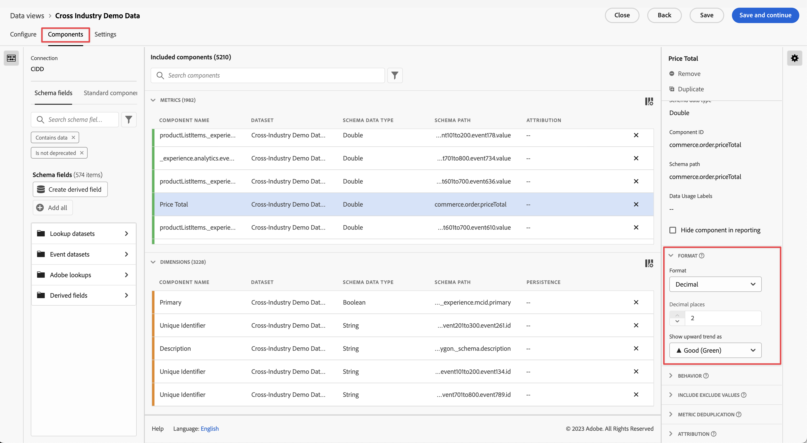

# Formatierungs-Komponenteneinstellungen {#format-component-settings}

<!-- markdownlint-disable MD034 -->

>[!CONTEXTUALHELP]
>id="dataview_component_metric_format"
>title="Format"
>abstract="Legen Sie fest, wie eine Komponente in Berichten angezeigt wird."

<!-- markdownlint-enable MD034 -->

Mit „Format“ können Sie festlegen, wie eine bestimmte Komponente in Berichten angezeigt werden soll.

## Konfigurieren von Formateinstellungen für eine Komponente

Sie können bestimmen, wie eine bestimmte Komponente angezeigt wird, indem Sie ihre Formateinstellungen anpassen.

1. Wählen Sie in Customer Journey Analytics die Registerkarte [!UICONTROL **Datenansichten**] auf.

1. Wählen Sie die Datenansicht aus, die die Komponente enthält, deren Formateinstellung Sie konfigurieren möchten.

1. Wählen Sie die Registerkarte [!UICONTROL **Komponenten**] aus.

1. Wählen Sie die zu konfigurierende Komponente aus und erweitern Sie dann den Abschnitt [!UICONTROL **Format**] auf der rechten Seite.

   

1. Geben Sie die folgenden Informationen an:

   | Einstellung | Beschreibung |
   | --- | --- |
   | **[!UICONTROL Format]** | Hier können Sie die Formatierung einer Komponente als Dezimalzahl, Zeit, Prozent oder Währung angeben. |
   | **[!UICONTROL Dezimal]** | Nicht sichtbar bei Schemadatentypen des Typs „Ganzzahl“. Hier können Sie die Anzahl der Dezimalstellen angeben, die eine Komponente anzeigt. |
   | **[!UICONTROL Datum]** | Hiermit können Sie bestimmen, wie das „date-time“-Feld angezeigt werden soll, wenn es als Dimension in Berichten verwendet wird. [Weitere Informationen](../../use-cases/data-views/data-views-usecases.md#date-and-date-time-use-cases) |
   | **[!UICONTROL Date-Time]** | Hiermit können Sie bestimmen, wie das „date-time“-Feld angezeigt werden soll, wenn es als Dimension in Berichten verwendet wird. [Weitere Informationen](../../use-cases/data-views/data-views-usecases.md#date-and-date-time-use-cases) |
   | **[!UICONTROL Währung]** | Hiermit können Sie festlegen, in welcher Währung die Komponente angezeigt werden soll. 
Wenn Sie globale Daten analysieren, bei denen Transaktionen in verschiedenen Währungen auftreten, lesen Sie [Verwenden der Währungsumrechnung](#use-currency-conversion).
 |
   | **[!UICONTROL Aufwärts-Trend anzeigen als]** | Hier können Sie angeben, ob bei dieser Komponente ein Aufwärtstrend gut (grün) oder schlecht (rot) ist. |
   | **[!UICONTROL Wert „True“]** und **[!UICONTROL Wert „False“]** | Nur bei booleschen Schemadatentypen sichtbar. Ermöglicht die Anpassung der Bezeichnung des Dimensionselements für die Werte `true` und `false`. |

   {style="table-layout:auto"}

## Verwenden der Währungsumrechnung {#use-currency-conversion}

<!-- markdownlint-disable MD034 -->

>[!CONTEXTUALHELP]
>id="dataview_component_metric_format_currencyconversion"
>title="Währungsumrechnung"
>abstract="Wählen Sie eine Währungs-Code-Dimension aus, um die Währung in einem ausgewählten Währungstyp zu konfigurieren und anzuzeigen."

<!-- markdownlint-enable MD034 -->

Die Währungsumrechnung in Customer Journey Analytics kann für international tätige Unternehmen äußerst wertvoll sein. Durch die Beseitigung der Komplexität einer manuellen Währungsumrechnung bringt die Währungsumrechnung in Customer Journey Analytics Einheitlichkeit und Klarheit für Finanzdaten. Die Währungsumrechnung erfasst die täglichen historischen Wechselkurse und behält diese täglichen Kurse für einen Zeitraum von 4 Jahren bei.

Wenn beispielsweise ein E-Commerce-Unternehmen in den USA, Großbritannien und der EU tätig ist, können die Verkaufsdaten automatisch in USD umgewandelt werden, was einen einfachen Vergleich und ein ganzheitliches Verständnis der Leistung ermöglicht.

>[!NOTE]
>
>Bevor Sie mit der Konfiguration einer Metrik für die Währungsumrechnung beginnen, beachten Sie Folgendes:
>
>* Die Metrik, die Sie für die Währungsumrechnung auswählen, muss einen numerischen Typ aufweisen (Dublette, Lang, Ganzzahl, Kurz, Byte).
>* Richten Sie Ihre Customer Journey Analytics-Verbindung so ein, dass sie mindestens einen Ereignisdatensatz enthält, der für jedes Ereignis mit einer Währungsmetrik eine Währungs-Code-Dimension enthält. Diese Währungs-Code-Dimension verwendet einen alphabetischen Währungs-Code, der der Norm [ISO 4217](https://www.iso.org/iso-4217-currency-codes.html) für die Darstellung von Währungen entspricht. Diese Werte sollten ausschließlich in Großbuchstaben angegeben werden, wie z. B. USD für $, EUR für € und GBP für £.

So bestimmen Sie, wie Währungen für eine bestimmte Metrik angezeigt und umgerechnet werden:

1. Beginnen Sie mit der Konfiguration der Metrik, für die Sie die Währung als Format verwenden möchten, wie oben unter [Konfigurieren von Formateinstellungen für eine Metrik](#configure-format-settings-for-a-metric) beschrieben.

1. Treffen Sie bei ausgewählter Metrik die folgende Auswahl im Abschnitt [!UICONTROL **Format**] auf der rechten Seite:

   * Wählen Sie im Feld [!UICONTROL **Format**] die Option [!UICONTROL **Währung**] aus.

   * Wählen Sie im Feld [!UICONTROL **Dezimalstellen**] die Anzahl der Dezimalstellen aus, die die Metrik anzeigt.

     Diese Option ist nur verfügbar, wenn die Metrik den numerischen Typ „Dublette“ aufweist,

   * Wählen Sie die Option [!UICONTROL **Währung umrechnen**] aus.

   * Wählen Sie im Feld [!UICONTROL **Währungs-Code-Dimension auswählen**] die Dimension aus, die für die Währung steht, aus der Sie die Umrechnung durchführen (die Währung, auf der Ihre Daten basieren). Wählen Sie beispielsweise eine Dimension mit dem Namen [!UICONTROL **Währungs-Code**].

     Wenn Ihr aktuelles Datenschema keine Dimension mit einem Feld für den Währungs-Code enthält, können Sie ein neues Feld für den Währungs-Code mit [Datenvorbereitung](https://experienceleague.adobe.com/de/docs/experience-platform/data-prep/home), [Data Distiller](https://experienceleague.adobe.com/de/docs/experience-platform/query/data-distiller/overview) oder [Abgeleitete Felder](/help/data-views/derived-fields/derived-fields.md) erstellen. Die Datenvorbereitung ist nur für neue Implementierungen geeignet, da sie nur auf einer Zukunftsbasis erfolgt. Je nach Einrichtung einer Organisation können Data Distiller und abgeleitete Felder verwendet werden, um historisch auf die Währungs-Code-Werte zuzugreifen.

   * Wählen Sie im Feld [!UICONTROL **Währung umrechnen und anzeigen in**] die Währung, in die Daten umgerechnet werden sollen.

1. Wiederholen Sie diese Schritte, wenn Sie eine Währungsumrechnung auf weitere Metriken anwenden möchten.

### Häufig gestellte Fragen

+++ Wie wird die Währungsumrechnung durchgeführt?

Zur Berichtszeit werden der Wert der Metrik und der ursprüngliche Währungs-Code in USD umgerechnet und dann in die für die Anzeige konfigurierte Währung umgerechnet. Für diese Umrechnung werden die täglichen Wechselkurse verwendet, die für die Zeit des Ereignisses gelten.

+++

