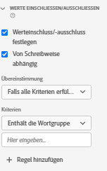

# Komponenteneinstellung „Werte einschließen/ausschließen“ {#include-exclude-values-component-settings}

<!-- markdownlint-disable MD034 -->

>[!CONTEXTUALHELP]
>id="dataview_component_metric_includeexcludevalues"
>title="Werte einschließen/ausschließen"
>abstract="Filtern Sie eine Metrik so, dass nur Werte gezählt werden, die bestimmten Kriterien entsprechen."

<!-- markdownlint-enable MD034 -->

<!-- markdownlint-disable MD034 -->

>[!CONTEXTUALHELP]
>id="dataview_component_dimension_includeexcludevalues"
>title="Werte einschließen/ausschließen"
>abstract="Schränken Sie eine Dimension so ein, dass nur Werte eingeschlossen werden, die bestimmten Kriterien entsprechen. Ein- und Ausschlüsse erfolgen in Berichten vor der Zuordnung und Segmentierung. Ermitteln Sie, ob bei der angegebenen Segmentlogik die Groß-/Kleinschreibung beachtet wird."

<!-- markdownlint-enable MD034 -->

„Werte einschließen/ausschließen“ ermöglicht die Erstellung von Regeln, die vom Wert eines Dimensionselements abhängen. Werte, die die von Ihnen festgelegten Kriterien nicht erfüllen, werden in Analysis Workspace so behandelt, als wären sie nicht vorhanden, obwohl die Daten noch im zugrunde liegenden Datensatz vorhanden sind.

| Einstellung | Beschreibung/Verwendungsfall |
| --- | --- |
| [!UICONTROL Werteinschluss/-ausschluss festlegen] | Ein Kontrollkästchen, mit dem Sie Bedingungen aktivieren können, wenn Daten in einer Datenansicht enthalten sind. |
| [!UICONTROL Von Schreibweise abhängig] | Sichtbar bei Datentypen des Zeichenfolgen-Schemas. Standardmäßig ist diese Einstellung aktiviert. Diese Einstellung gilt nur für die Logik [!UICONTROL Werte einschließen/ausschließen], nicht für den resultierenden Wert. Sie können damit angeben, ob bei der Regel zwischen Groß- und Kleinschreibung unterschieden wird. |
| [!UICONTROL Übereinstimmung] | Hier können Sie angeben, welche Werte Sie vor der Attribution und den Segmenten für das Reporting berücksichtigen möchten (z. B. nur Werte mit der Phrase „Fehler„). Sie können **[!UICONTROL Wenn alle Kriterien erfüllt sind]** oder **[!UICONTROL Wenn ein beliebiges Kriterium erfüllt ist]** auswählen. Trennen Sie die Werte durch ein Leerzeichen. |
| [!UICONTROL Kriterien] | Ermöglicht die Angabe der Übereinstimmungslogik, die auf eine bestimmte Segmentregel angewendet werden soll.<ul><li>**Zeichenfolge**: [!UICONTROL Enthält die Wortgruppe], [!UICONTROL Enthält einen der Begriffe], [!UICONTROL Enthält alle Begriffe], [!UICONTROL Enthält keine Begriffe], [!UICONTROL Enthält nicht die Wortgruppe], [!UICONTROL Gleich], [!UICONTROL Ist nicht gleich], [!UICONTROL Beginnt mit], [!UICONTROL Endet mit]</li><li>**Dezimalzahl/Ganzzahl**: [!UICONTROL Gleich], [!UICONTROL Ist nicht gleich], [!UICONTROL Ist größer als], [!UICONTROL Is less than], [!UICONTROL Ist kleiner als], [!UICONTROL Ist kleiner als oder gleich]</li><li>**Datum**: [!UICONTROL Gleich], [!UICONTROL Ist nicht gleich], [!UICONTROL Ist später als], [!UICONTROL ist vor], [!UICONTROL Tritt ein innerhalb]</li></ul> |
| [!UICONTROL Übereinstimmungsoperand] | Hiermit können Sie den Übereinstimmungsoperanden angeben, auf den der Übereinstimmungsoperator angewendet werden soll.<ul><li>**Zeichenfolge**: Textfeld</li><li>**Dezimalzahl/Ganzzahl**: Textfeld mit Pfeilen nach oben/unten für numerische Werte</li><li>**Datum**: Auswahl der Tagesgranularität (Kalender)</li><li>**Datum Uhrzeit**: Auswahl der Datums- und Uhrzeitgranularität</li></ul> |
| [!UICONTROL Regel hinzufügen] | Hier können Sie einen zusätzlichen Übereinstimmungsoperator und -operanden angeben. |

{style="table-layout:auto"}
