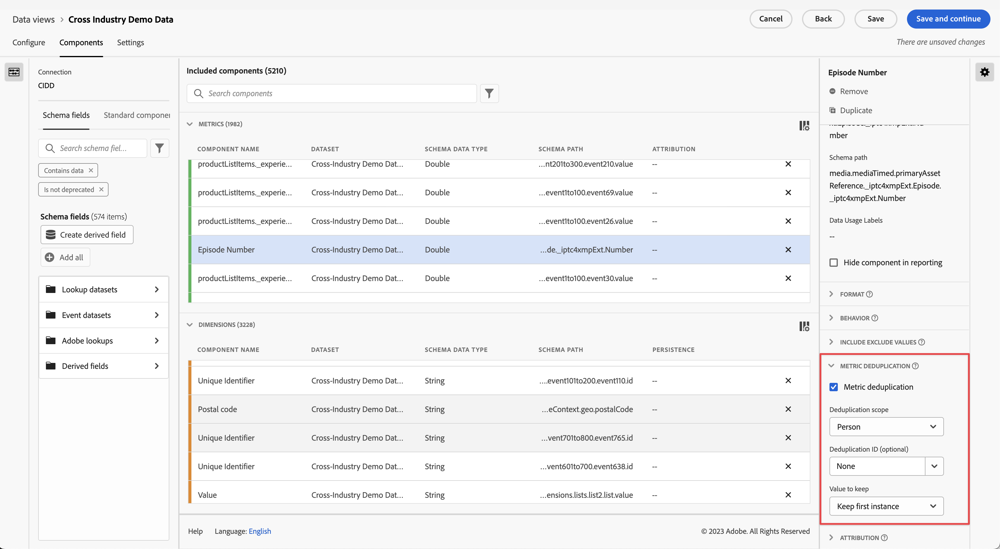

# Komponenteneinstellungen für die Metrik-Deduplizierung {#metric-deduplication-component-settings}

<!-- markdownlint-disable MD034 -->

>[!CONTEXTUALHELP]
>id="dataview_component_metric_deduplication"
>title="Deduplizierung einer Metrik"
>abstract="Konfigurieren Sie eine Metrik so, dass nur Werte gezählt werden, die nicht wiederholt auftreten."

<!-- markdownlint-enable MD034 -->

Mit der Metrik-Deduplizierung können Sie eine Metrik so konfigurieren, dass Werte nicht wiederholt gezählt werden.

| Einstellung | Beschreibung |
| --- | --- |
| [!UICONTROL Deduplizierung einer Metrik] | Ein Kontrollkästchen, mit dem Sie die Metrik-Deduplizierung aktivieren können. Standardmäßig deaktiviert. |
| [!UICONTROL Umfang der Deduplizierung] | Hiermit können Sie bestimmen, wie weit die eindeutige Prüfung in die Vergangenheit reicht. **[!UICONTROL Globales Konto &#x200B;]**: Es wird nur das erste Metrikereignis im Reporting-Fenster gezählt. **[!UICONTROL Konto]**: Es wird nur das erste Metrikereignis im Reporting-Fenster gezählt. **[!UICONTROL Opportunity &#x200B;]**: Es wird nur das erste Metrikereignis im Reporting-Fenster gezählt. **[!UICONTROL Einkaufsgruppe]**: Nur das erste Metrikereignis im Berichtsfenster wird gezählt. **[!UICONTROL Person &#x200B;]**: Nur das erste Metrikereignis im Berichtsfenster wird gezählt. **[!UICONTROL Sitzung]**: Nur das erste Metrikereignis der Sitzung wird gezählt.  |
| [!UICONTROL Deduplizierungs-ID] | Ermöglicht es Ihnen, anstelle der Deduplizierung in der Metrik selbst die Metrik-Deduplizierung auf Grundlage einer Dimension anzuwenden. Wertvoll für Dimensionen wie Kauf-ID, um eine Deduplizierung anzuwenden. |
| [!UICONTROL Beizubehaltender Wert] | <ul><li>**Erste Instanz beibehalten**: Verwenden Sie dies in Situationen, in denen die ursprüngliche Instanz der Metrik die gültige ist. Die häufigste wäre wahrscheinlich eine Kaufbestätigung. Selbst wenn jemand versehentlich die Seite neu lädt und wir eine weitere Instanz einer Kaufbestätigung erhalten, ist das erste Ereignis das gültige.</li><li>**Letzte Instanz beibehalten**: Verwenden Sie dies in Situationen, in denen es sinnvoller ist, die letzte Instanz zu erfassen. Beispiel: Eine Person aktualisiert ihr Online-Profil. Wir möchten nur eine dieser Aktualisierungen pro Sitzung zählen. Die Person könnte das Profil während der Sitzung jedoch mehrmals aktualisieren. Wenn wir die erste Instanz beibehalten, kann es Aktivitäten geben, die nicht mit dem Ereignis verknüpft sind. In diesem Fall ist es sinnvoller, die letzte Instanz zu behalten.</li></ul> |

{style="table-layout:auto"}

>[!CAUTION]
>
>Deduplizierung im Umfang einer _Person_ wird nach vollständigen Monaten in UTC-Zeit bewertet. Ein Berichtsfenster für einen Teil des Monats zeigt möglicherweise nicht alle ersten oder letzten Instanzen an, wenn einige innerhalb des ganzen Monats, aber außerhalb der Berichtsdaten aufgetreten sind.
