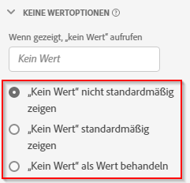

# Komponenteneinstellungen für Optionen für keinen Wert {#no-value-options-component-settings}

<!-- markdownlint-disable MD034 -->

>[!CONTEXTUALHELP]
>id="dataview_component_dimension_novalueoptions"
>title="Keine Wertoptionen"
>abstract="Konfigurieren Sie das Standardverhalten für ein Szenario, bei dem in einer Dimension kein Wert vorhanden ist."

<!-- markdownlint-enable MD034 -->

Mit [!UICONTROL Optionen zu „Kein Wert“] können Sie festlegen, wie Analysis Workspace Situationen handhabt, in denen ein Ereignis in einem Datensatz eine Metrik enthält, die Dimension jedoch keinen Wert enthielt. Sie können den Namen dieses Dimensionselements auswählen, es vollständig ausblenden oder es sogar als tatsächlichen Wert behandeln.

## Einstellungen {#settings}

| Einstellung | Beschreibung |
| --- | --- |
| **[!UICONTROL Falls angezeigt, „Kein Wert“ abrufen]** | Ein Textfeld, mit dem Sie das Dimensionselement **[!UICONTROL Kein Wert]** in etwas anderes umbenennen können. |
| **[!UICONTROL „Kein Wert“ nicht standardmäßig anzeigen]** | Zeigt diesen Wert im Reporting nicht an. Metrikereignisse, die nicht an diese Dimension gebunden sind, sind im Bericht nicht sichtbar. |
| **[!UICONTROL Standardmäßig „Kein Wert“ anzeigen]** | Zeigt diesen Wert im Reporting an. |
| **[!UICONTROL „Kein Wert“ als Wert behandeln]** | (Nicht unterstützt bei numerischen Dimensionen) Ersetzt leere Werte in den Daten durch den Text, den Sie unter [!UICONTROL Wenn gezeigt, „kein Wert“ aufrufen] angegeben haben. Wenn Sie beispielsweise Mobilgerätetypen als Dimension haben, können Sie das Element **[!UICONTROL Kein Wert]** in „Desktop“ umbenennen. Beim Ändern dieses Felds in einen benutzerdefinierten Wert wird dieser benutzerdefinierte Wert als legitimer Zeichenfolgenwert behandelt. Wenn Sie also z. B. den Wert „Rot“ in dieses Feld eingeben, werden alle Instanzen der Zeichenfolge „Rot“, die in den Daten selbst vorkommen, auch unter demselben von Ihnen angegebenen Zeileneintrag erscheinen. |

## Unterstützung von „Kein Wert“ bei numerischen Dimensionen {#numeric}

Wenn Sie einen numerischen Wert als Dimension verwenden, haben Sie folgende Möglichkeiten:

* Konfigurieren Sie die Option „Kein Wert“ in einer Datenansicht. Beachten Sie, dass bis auf **[!UICONTROL „Kein Wert“ als Wert behandeln]** alle oben gezeigten Konfigurationseinstellungen unterstützt werden.
* Verwenden Sie **[!UICONTROL „Kein Wert“ einschließen]** für numerische Dimensionen in einer Freiformtabelle in Workspace.
* Verwenden Sie im Segment Builder die Operatoren **[!UICONTROL vorhanden]** oder **[!UICONTROL nicht vorhanden]** mit numerischen Dimensionen.

>[!MORELIKETHIS]
>
>[Das vollständige Playbook für die Verarbeitung von „Kein Wert“ in Adobe Customer Journey Analytics](https://experienceleaguecommunities.adobe.com/t5/adobe-analytics-blogs/the-complete-playbook-for-handling-no-value-in-adobe-cja/ba-p/756696?profile.language=de#M598).

