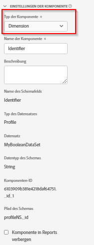

# Komponenteneinstellungen {#component-settings}

<!-- markdownlint-disable MD034 -->

>[!CONTEXTUALHELP]
>id="dataview_component_settings"
>title="Komponenteneinstellungen"
>abstract="Zeigen Sie den Namen, die Beschreibung und andere Einstellungen einer Komponente an und konfigurieren Sie sie. Aktivieren Sie dieses Kontrollkästchen, um diese Komponente in Berichten für Benutzende ohne Administratorrechte auszublenden. Admins können weiterhin auf die Komponente zugreifen, indem sie in einem Workspace-Projekt auf **[!UICONTROL Alle Komponenten anzeigen]** klicken."

<!-- markdownlint-enable MD034 -->

<!-- markdownlint-disable MD034 -->

>[!CONTEXTUALHELP]
>id="dataview_component_contextlabels"
>title="Kontext-Labels"
>abstract="Das Entfernen eines Kontext-Labels kann sich auf bestimmte Bedienfelder oder Berichte auswirken, bei denen die Komponente erforderlich ist."

<!-- markdownlint-enable MD034 -->

Die folgenden Informationen beschreiben die Einstellungen, die eine Datenansichtskomponente verwendet.

| Einstellung | Beschreibung/Verwendungsfall |
| --- | --- |
| [!UICONTROL Typ der Komponente] | Erforderlich. Ermöglicht es Ihnen, eine Komponente von Metrik in Dimension oder umgekehrt zu ändern. Durch Änderung dieser Dropdown-Auswahl wird die Komponente in den entsprechenden eingeschlossenen Komponentenbereich verschoben. |
| [!UICONTROL Komponentenname] | Erforderlich. Hier können Sie den benutzerfreundlichen Namen angeben, der in Analysis Workspace angezeigt wird. Sie können eine Komponente umbenennen, um ihr einen spezifischen Namen für die Datenansicht zu geben. |
| [!UICONTROL Beschreibung] | Optional, jedoch empfohlen. Stellt Informationen über die Komponente für andere Benutzer bereit. |
| [!UICONTROL Tags] | Optional. Sie können die Komponente mit benutzerdefinierten oder vordefinierten Tags versehen, um die Suche/Filterung in der Analysis Workspace-Benutzeroberfläche zu erleichtern. |
| [!UICONTROL Kontextbeschriftungen] | Optional. Ein Dropdown-Menü mit verfügbaren systemdefinierten [Kontextkennzeichnungen](#context-labels) die auf eine Komponente angewendet werden können. |
| [!UICONTROL Schemafeldname] | Der Name des Schemafelds. |
| [!UICONTROL Typ des Datensatzes] | Erforderlich. Ein nicht bearbeitbares Feld, das anzeigt, von welchem Datensatztyp (Ereignis, Suche oder Profil) die Komponente stammt. |
| [!UICONTROL Datensatz] | Ein nicht bearbeitbares Feld, das anzeigt, aus welchem Datensatz die Komponente stammt. Dieses Feld kann mehrere Datensätze enthalten. |
| [!UICONTROL Typ des Schemas] | Ein nicht bearbeitbares Feld, das den Datentyp der Komponente anzeigt. Sie können zwar einen beliebigen unterstützten Schemafeldtyp in Platform verwenden, jedoch werden in Customer Journey Analytics nicht alle Feldtypen unterstützt. Die folgenden Datentypen werden unterstützt: `Integer`, `Int`, `Long`, `Double`, `Float`, `Number`, `Short`, `Byte`, `String` und `Boolean`. In Such-Datensätzen ist derzeit nur der Schemadatentyp `String` erlaubt. |
| [!UICONTROL Komponenten-ID] | Erforderlich. Die [Customer Journey Analytics-API](https://www.adobe.io/cja-apis/docs) verwendet dieses Feld, um auf die Komponente zu verweisen. Jede Komponente in einer Datenansicht muss eindeutig sein. Adobe generiert automatisch eine ID für jede Komponente. Sie können jedoch auf das Bearbeitungssymbol klicken und die Komponenten-ID ändern. Durch das Ändern der Komponenten-ID werden alle vorhandenen Workspace-Projekte, die diese Komponente enthalten, beschädigt. Während jede Komponente eine eindeutige ID in einer Datenansicht benötigt, können Sie dieselbe Komponenten-ID in anderen Datenansichten verwenden. Wenn Sie dieselbe Komponenten-ID in anderen Datenansichten verwenden, können Sie Workspace-Projekte über Datenansichten hinweg kompatibel machen.  Bei profil- und suchbasierten Komponenten verfügt die Komponenten-ID über ein ID-Präfix, das auf der Datensatz-ID basiert (z. B.: `642b28fcc1f0ee1c074265a0.person.name.firstName`). Wenn Sie eine profil- oder suchbasierte Komponente wie `person.name.firstName` in Ihrem Workspace-Projekt wiederverwenden und diese Komponente in verschiedenen Datenansichten konfigurieren möchten, stellen Sie sicher, dass Sie die Komponenten-ID in Ihren Datenansichten eindeutig umbenennen (z. B.: `myUniqueID.person.name.firstName`). |
| [!UICONTROL Path] | Erforderlich. Ein nicht bearbeitbares Feld, das den Schema-Pfad anzeigt, von dem die Komponente stammt. |
| [!UICONTROL Beschriftungen zur Datennutzung] | Alle Datennutzungsbeschriftungen, die dieser Komponente in Adobe Experience Platform zugewiesen sind. [Weitere Informationen](/help/data-views/data-governance.md). |
| [!UICONTROL Komponente in Reports verbergen] | Ermöglicht das Kuratieren der Komponente aus der Datenansicht für Benutzer ohne Administratorrechte. Administratoren können weiterhin darauf zugreifen, indem sie in einem Analysis Workspace-Projekt auf [!UICONTROL Alle Komponenten anzeigen] klicken. |

{style="table-layout:auto"}

>[!BEGINSHADEBOX]

Unter  [Einstellungen zum Komponententyp](https://video.tv.adobe.com/v/333112/?quality=12&learn=on){target="_blank"} finden Sie ein Demovideo.

>[!ENDSHADEBOX]

## Kontext-Labels

Kontextbeschriftungen sind systemdefinierte Tags, die auf Komponenten in einer Datenansicht angewendet werden. Wenn Kontextbeschriftungen auf Komponenten (Dimensionen oder Metriken) angewendet werden, wird Customer Journey Analytics angewiesen, diese kontextgekennzeichneten Komponenten automatisch in bestimmten Visualisierungen oder Funktionen zu verwenden.

Kontextbeschriftungen ermöglichen es Ihnen, einen semantischen Kontext für einzelne Datenelemente bereitzustellen.  Im Allgemeinen muss Customer Journey Analytics die semantische Bedeutung einer Dimension oder Metrik nicht kennen, um eine Analyse durchzuführen.  In einigen Situationen (Projektvorlagen und einige ausgewählte Visualisierungen) muss Customer Journey Analytics jedoch die semantische Bedeutung verstehen, um eine Analyse durchführen zu können. Für diese Situationen werden Kontextkennzeichnungen erstellt.

Kontextbeschriftungen werden auf Komponentenebene (Dimension oder Metrik) ausgeführt und ermöglichen dem Kunden eine große Flexibilität in der Datenansicht. Beispielsweise können Sie einer Dimension eine Kontextbeschriftung zuweisen, nachdem Sie mehrere Nachbearbeitungstransformationen auf ein Feld angewendet haben. Oder sogar auf eine Dimension, die auf einem abgeleiteten Feld basiert.  Kontextbeschriftungen bieten eine Abstraktionsebene zusätzlich zu Komponenten und Feldern.

Aus praktischen Gründen werden Smart-Standard-Kontextbeschriftungen automatisch auf Komponenten angewendet, die auf Feldern mit einem bestimmten XDM-Pfad basieren. Beispielsweise wird die Kontextbeschriftung **[!UICONTROL Commerce: Produktkategorie]** automatisch auf eine Dimension **[!UICONTROL Kategoriename]** angewendet, die auf dem `productListItems.productCategories.categoryName` Schemapfad basiert. Sie können die Kontextbeschriftung jedoch problemlos in eine andere Komponente verschieben.

Um die von Adobe bereitgestellten Projektvorlagen zu optimieren, richten mehrere Integrationen (wie Journey Optimizer, Content Analytics und mehr) Datenansichten ein, bei denen vorkonfigurierte Komponenten auf bestimmte Weise erstellt werden. Und die entsprechenden Kontextbeschriftungen werden automatisch angewendet. Auch hier können Sie einfach eine dieser Kontextkennzeichnungen in andere Komponenten verschieben, die in der Datenansicht erstellt werden, und stattdessen wird Ihre benutzerdefinierte Komponente verwendet.

Kontextkennzeichnungen sind auch für die Offenlegung von Projektvorlagen relevant. Projektvorlagen bilden schnell die Grundlage für die Berichterstellung für verschiedene Anwendungsfälle. Allerdings ist nicht jede Vorlage für jede Datenansicht sinnvoll, und Sie möchten keine nicht anwendbaren Vorlagen anzeigen. Kontextbeschriftungen werden verwendet, um Vorlagen anzuzeigen, je nachdem, ob die Kontextbeschriftungen in der ausgewählten Datenansicht enthalten sind.  Sie können einfach mehr Kontextbeschriftungen zu Ihrer Datenansicht (Komponenten) hinzufügen, und es werden mehr Vorlagen verfügbar. Oder entfernen Sie Kontextbeschriftungen, um bestimmte Vorlagen auszublenden.

>[!NOTE]
>
>Sie können mehr als eine Kontextbeschriftung auf eine Komponente anwenden, aber Sie können eine Kontextbeschriftung nicht auf mehrere Komponenten in einer Datenansicht anwenden.
>

Die Vorteile von Kontextkennzeichnungen sind:

* **Komfort**: Sie müssen nicht in jedem Bedienfeld oder jeder Visualisierung dieselbe Komponente erneut auswählen.
* **Funktion zum Entsperren**: Einige Visualisierungen (wie [Map](/help/analysis-workspace/visualizations/map.md)) erfordern Kenntnisse darüber, welche Komponente Breiten- und Längengrad ist. Durch die Zuweisung von Kontextkennzeichnungen werden diese Informationen für die Visualisierung offen gelegt.
* **Konsistenz**: Alle Personen in Ihrer Organisation, die an einem oder mehreren Projekten arbeiten, die auf einer Datenansicht basieren, die Kontextkennzeichnungen verwendet, erhalten dasselbe Verhalten.
* **Sichtbarkeit von Funktionen und Vorlagen**: Bestimmte Visualisierungen und Funktionen werden nur angezeigt, wenn die richtige Kontextbeschriftung zugewiesen wird. Zum Beispiel:

   * Eine [Map](/help/analysis-workspace/visualizations/map.md)-Visualisierung wird nur dann richtig angezeigt, wenn Customer Journey Analytics weiß, welche Felder den Breiten- und Längengrad darstellen.
   * Bestimmte [Vorlagen](/help/analysis-workspace/templates/use-templates.md) werden nur angezeigt, wenn die richtigen Kontextbeschriftungen angewendet werden und die zugehörigen Komponenten verfügbar werden.

Kontextkennzeichnungen können in den folgenden Situationen erforderlich sein:

* Um einen Komponentensatz zu definieren, können Sie ihn in Analysis Workspace-Projekten im Experimentier[Reporting über das ](/help/analysis-workspace/c-panels/experimentation.md)Experimentier-Bedienfeld“ verwenden.

  Weitere Informationen finden Sie unter [Integrieren mit Journey Optimizer](/help/integrations/ajo.md#data-view) und [Zielgruppenberichte](/help/integrations/at.md).

* Um einen Komponentensatz zu definieren, können Sie ihn in der [-](/help/analysis-workspace/visualizations/map.md) in Analysis Workspace-Projekten verwenden.

  Weitere Informationen finden Sie unter [Hinzufügen von Kontextbeschriftungen in Datenansichten](/help/analysis-workspace/visualizations/map.md#add-context-labels-in-data-views) in [Map](/help/analysis-workspace/visualizations/map.md).

  **Hinweis**: Die Kartenvisualisierung befindet sich in der eingeschränkten Testphase der Version und ist möglicherweise noch nicht in Ihrer Umgebung verfügbar.

* Wenn Sie ([ von Adobe bereitgestellte Vorlagen) ](/help/analysis-workspace/templates/use-templates.md). Einige von Adobe bereitgestellte Vorlagen funktionieren möglicherweise nicht, da bestimmte Komponenten nicht in Ihrer Datenansicht vorhanden sind.

  In Ihrer Datenansicht ist für jede fehlende Komponente ein entsprechendes Kontext-Label verfügbar. Sie müssen entweder die entsprechende Kontextbeschriftung zu einer Komponente hinzufügen, die sich bereits in Ihrer Datenansicht befindet. Oder Sie müssen Ihrer Datenansicht eine neue Komponente hinzufügen und der Komponente die Kontextbeschriftung hinzufügen (falls noch nicht automatisch bereitgestellt).

  Weitere Informationen finden Sie unter [Hinzufügen fehlender Komponenten zur Datenansicht für eine bestimmte Vorlage](/help/analysis-workspace/templates/create-templates.md#add-missing-components-to-the-data-view-for-a-given-template) im Artikel [Erstellen und Verwalten von Vorlagen](/help/analysis-workspace/templates/create-templates.md).

Die folgenden Gruppen von Kontextbeschriftungen sind mit jeweils einer Liste spezifischer Kontextbeschriftungen verfügbar.

+++ Kampagne

| Name | Beschreibung |
|------|-------------|
| Trackingcode | Trackingcode. |
| Trackingcode-Instanzen | Trackingcode-Instanzen |

+++

+++ Handel

| Name | Beschreibung |
|------|-------------|
| Zusatz zum Warenkorb | Zusatz zum Warenkorb |
| Öffnungen des Warenkorbs | Der Warenkorb wird geöffnet. |
| Entnahme aus Warenkorb | Entnahme aus Warenkorb |
| Warenkorbansichten | Warenkorbansichten |
| Checkouts | Checkouts. |
| Bestellungen | Bestellungen. |
| Produkt | Produkt. |
| Produktkategorie | Produktkategorie. |
| Produktansichten | Produktansichten. |
| Umsatz | Umsatz. |
| Store | Speichern. |
| Einheiten | Einheiten. |

+++

+++ Experimentieren

| Name | Beschreibung |
|------|-------------|
| Experimentierexperiment | Ein Experiment ist eine Reihe von Varianten eines Erlebnisses, die Endbenutzern präsentiert wurden, um zu bestimmen, welche am besten dauerhaft beibehalten werden sollte. |
| Experimentiervariante | Die Variante ist eine von zwei oder mehr Änderungen im Erlebnis eines Endbenutzers, die verglichen werden, um die bessere Alternative zu ermitteln. |

+++

+++ Medien

| Name | Beschreibung |
|------|-------------|
| Inhalts-ID | Inhalts-ID |
| Inhaltsbesuchszeit | Besuchszeit für Inhalt. |
| Folge | Folge. |
| Ereignistyp | Ereignistyp. |
| Besuchszeit für Medien | Mit Medien verbrachte Zeit. |
| Staffel | Staffel. |
| Sekunden seit dem letzten Aufruf | Sekunden seit letztem Aufruf. |
| Serie | Anzeigen. |
| Zeit bis Start | Zeit bis zum Start. |
| Gesamtpufferdauer | Gesamtdauer des Puffers. |
| Pausierung – Gesamtdauer | Pausierung - Gesamtdauer |
| Videolänge | Videolänge. |
| Videoname | Videoname. |

+++

+++ Callcenter

| Name | Beschreibung |
|------|-------------|
| Callcenter-Name | Name des Callcenters. |
| Anrufkosten | Anrufkosten. |
| Anrufzeiten | Ruft Stunden an. |
| Anruflänge | Aufruflänge. |
| Grund für den Anruf | Grund des Anrufs. |
| Ergebnis der Anrufumfrage | Punktzahl der Anrufumfrage. |
| Anrufe | Aufrufe. |

+++

+++ Demografisch

| Name | Beschreibung |
|------|-------------|
| Geschlecht | Geschlecht. |

+++

+++ Umgebung

| Name | Beschreibung |
|------|-------------|
| Browser | Browser. |
| Browser-Typ | Browser-Typ. |
| Sprache | Sprache. |
| Betriebssystem | Betriebssystem. |
| Betriebssystemgruppe | Betriebssystemgruppe. |
| Betriebssystemname | Betriebssystemname. |

+++

+++ Allgemein

| Name | Beschreibung |
|------|-------------|
| Aktionsname | Aktionsname. |
| Aktionen | Aktionen. |
| Interaktionskanal | Interaktionskanal. |

+++

+++ Geo

| Name | Beschreibung |
|------|-------------|
| Geo-Ort | Geo-Stadt. |
| Geo-Land | Geo-Land. |
| Geo-DMA | Geo-DMA. |
| Geo-Region | Geo-Region. |
| Breitengrad | Breitengrad |
| Längengrad | Längengrad |
| Zielpunkt | Point of Interest. |
| Bundesland | Bundesland. |

+++

+++ Marketing-Kanal

| Name | Beschreibung |
|------|-------------|
| Erstkontakt-Kanal | Erstkontakt-Kanal. |
| Erstkontakt-Kanaldetail | Detail des Erstkontaktkanals. |
| Letztkontakt-Kanal | Letztkontakt-Kanal. |
| Letztkontakt-Kanaldetail | Detail des Letztkontaktkanals. |
| Marketing-Kanal | Marketing-Kanal. |

+++

+++ Mobile

| Name | Beschreibung |
|------|-------------|
| Anwendungs-ID | Anwendungs-ID. |
| Mobilnetzbetreiber | Mobilnetzbetreiber. |
| Abstürze auf Mobilgeräten | Mobile stürzt ab. |
| Mobilgerätname | Name des Mobilgeräts. |
| Mobilgerätetyp | Mobilgerätetyp. |
| Name der mobilen In-App-Nachricht | Name der Mobile-App-Nachricht. |
| Installationen auf Mobilgeräten | Mobile Installationen. |
| Startvorgänge auf Mobilgeräten | Mobile-Launches. |
| Mobilgerätehersteller | Mobilgerätehersteller. |
| Abbrüche bei Mobilnachrichten | Mobile Nachricht wird abgebrochen. |
| Klicks von Mobilnachrichten | Klicks auf mobile Nachrichten. |
| Impressions bei Mobilnachrichten | Impressionen von Mobile-Nachrichten. |
| Opt-in für mobile Push-Nachrichten | Push-Opt-in für Mobile-Nachrichten. |
| Name der mobilen Push-Nachricht | Name der mobilen Push-Nachricht. |
| Upgrades auf Mobilgeräten | Upgrades für Mobilgeräte. |
| Aufgewendete Zeit pro zeitgesteuerter Aktion | Aufgewendete Zeit pro zeitgesteuerte Aktion. |

+++

+++ Suche

| Name | Beschreibung |
|------|-------------|
| Suchmaschine | Suchmaschine. |
| Suchmaschinen-Keyword | Suchmaschinenschlüsselwort. |
| Suchmaschine - kostenlos | Suchmaschine natürlich. |
| Kostenloses Keyword für Suchmaschine | Natürliches Keyword für Suchmaschinen. |
| Suchmaschine – kostenpflichtig | Suchmaschine bezahlt. |
| Kostenpflichtiges Keyword für Suchmaschine. | Paid-Keyword für Suchmaschinen. |

+++

+++ Umfrage

| Name | Beschreibung |
|------|-------------|
| Umfrage | Umfrage. |
| Umfrageantwort | Umfrageantwort. |
| Umfrageabschlüsse | Umfrage abgeschlossen. |
| Umfragefrage | Frage der Umfrage |
| Umfragestarts | Die Umfrage beginnt. |

+++

+++ Web

| Name | Beschreibung |
|------|-------------|
| Durchschnittliche Seitenzeit | Durchschnittliche Seitendauer. |
| Bounces | Bounces. |
| Einstiegsseite | Einstiegsseite |
| Exitpage | Exitpage. |
| Seite | Seite. |
| Seitenansichten | Seitenansichten. |
| Referrer | Werber. |
| Referrer-Typ | Referrer-Typ. |
| Referrer-Domain | Verweisende Domain. |
| Ursprüngliche Referrer-Domain | Verweisende Domain original. |
| Neuladungen | Lädt neu. |
| Einzelseitenbesuche | Einzelseitenbesuche. |
| Sitebereiche | Site-Bereiche. |

+++

+++ B2B

| Name | Beschreibung |
|------|-------------|
| Kontoname | Kontoname. |
| Käufergruppenname | Name der Einkaufsgruppe |
| Opportunity-Name | Opportunity-Name |

+++

+++ Content Analytics

| Name | Beschreibung |
|------|-------------|
| Asset – Absolut – Links | Asset absolut links. |
| Asset – Absolut – Oben | Absolutes Asset oben. |
| Asset – Attribute | Asset-Attribute. |
| Asset – Hintergrundfarben | Asset-Hintergrundfarben. |
| Asset – Kamerapositionen | Asset-Kamerapositionen. |
| Asset – Kameraumgebung | Nähe der Asset-Kamera. |
| Asset – Kameraeinstellungen | Asset-Kameraeinstellungen. |
| Asset – Klicks | Kreativelement-Klicks. |
| Asset – Erstellt von | Asset von erstellt. |
| Asset – Erstellungsdatum | Datum der Asset-Erstellung |
| Asset – Anzeigehöhe | Asset-Anzeigehöhe. |
| Asset – Anzeigebreite | Asset-Anzeigebreite. |
| Asset – Vordergrundfarben | Asset-Vordergrundfarben. |
| Asset – ID | Asset-ID. |
| Asset – Bildtypen | Asset-Bildtypen. |
| Asset – Zuletzt aktualisiert von | Asset zuletzt aktualisiert. |
| Asset – Zuletzt aktualisiert – Datum | Datum der letzten Asset-Aktualisierung. |
| Asset – Lichtverhältnisse | Asset-Beleuchtungsbedingungen. |
| Asset – Link-URL | Asset-Link-URL. |
| Asset-Name | Asset-Name. |
| Asset – Personenkategorien | Asset-Personenkategorien. |
| Asset – Wahrnehmungs-ID | Eindeutige Kennung von Assets, die von der Wahrnehmung her identisch sind. |
| Asset – Fotografie-Stile | Asset-Fotografiestile. |
| Asset – Szenen | Asset-Szenen. |
| Asset-Quelle | Asset-Source. |
| Asset – Tags | Asset-Tags. |
| Asset-Typ | Asset-Typ |
| Asset – Ansichten | Asset-Ansichten. |
| Asset – Verteilung der visuellen Aufmerksamkeit | Verbreitung der visuellen Aufmerksamkeit für Assets. |
| Asset – Dichte der visuellen Inhalte | Dichte des visuellen Inhalts des Assets. |
| Erlebnis – Attribute | Erlebnisattribute. |
| Erlebniskanal | Erlebniskanal. |
| Erlebnis – Klicks | Erlebnis-Klicks. |
| Erlebnis – Anzahl der Emojis | Anzahl der Emojis |
| Erlebnis – Hashtag-Anzahl | Anzahl der Erlebnis-Hashtags |
| Erlebnis – Horizontale Prozentsatz-Tiefe | Erleben Sie eine horizontale prozentuale Tiefe. |
| Erlebnis – Keywords | Erlebnis-Keywords. |
| Erlebnis – Marketing-Emotionen | Erleben Sie Marketing-Emotionen. |
| Erlebnis – Narrative | Erleben Sie Erzählungen. |
| Erlebnis – Überzeugungsstrategien | Erleben Sie Überredungsstrategien. |
| Wortzahl der Erlebnislesbarkeit pro Satzanzahl | Wortzahl der Erlebnislesbarkeit pro Satzanzahl. |
| Erlebnis – Lesbarkeit – Wert | Bewertung der Lesbarkeit des Erlebnisses. |
| Erlebnis – Lesbarkeit – Satzanzahl | Anzahl der Sätze zur Erlebnislesbarkeit. |
| Erlebnis – Lesbarkeit – Anzahl der Stoppwörter | Erlebnislesbarkeit Stoppwörter zählen. |
| Erlebnis – Lesbarkeit – Anzahl der Textzitate | Anzahl der Anführungszeichen in Texten für die Lesbarkeit von Erlebnissen. |
| Erlebnis – Lesbarkeit – Wortanzahl | Wortzahl der Erlebnislesbarkeit. |
| Erlebnis – Quelle | Erleben Sie Source. |
| Erlebnis – Töne | Erleben Sie Töne. |
| Erlebnis – Vertikale Prozentsatz-Tiefe | Vertikale prozentuale Tiefe des Erlebnisses |
| Erlebnis – Ansichten | Erlebnisansichten. |

+++

+++ Journey Optimizer

| Name | Beschreibung |
|------|-------------|
| Aktionsfehler (AJO) | Anzahl an Fehlern, die durch Journey-Aktionen erzeugt wurden. |
| Fehler bei Aktionsausführung | Fehlerbedingung, die Journey Runtime daran hinderte, die Aktion auszuführen. |
| Aktions-Label (AJO) | Der kundenseitig generierte Anzeigename des Elements, mit dem die Endbenutzerin bzw. der Endbenutzer interagiert hat. |
| Alternative Ausstiege (AJO) | Die Anzahl der Ausstiege, die nicht aufgetreten sind, da ein Profil einen Endknoten erreicht hat oder aufgrund eines Fehlers fehlgeschlagen ist. |
| App-Installationen (AJO) | Anzahl der App-Installationen. |
| App-Launches (AJO) | Anzahl der Starts einer Mobile App. |
| Batch-ID (AJO) | GUID, die beim Aufruf jeder neuen Batch-Instanz für eine geplante Journey- oder Kampagnenaktion erstellt wird. Beispiel: Wenn eine geplante Journey- oder Kampagnenaktion um 8.00 Uhr und 10.00 Uhr ausgeführt wird, gibt es zwei separate batchInstanceIDs. |
| Zeitstempel der Batch-Instanz (AJO) | Der Zeitstempel der Batch-Instanz. |
| Bounces für ausgehende Kanäle (veraltet) | Die Gesamtzahl der Nachrichten, die über ausgehende Kanäle hinweg zurückgesendet werden. |
| Name der Kampagnenaktion (AJO) | Der Name der Kampagnenaktion. |
| Kampagnen-ID (AJO) | Die ID der Kampagne. |
| Kampagnenname (AJO) | Der Name der Kampagne. |
| Campaign-Versions-ID (AJO) | Die Versions-ID der Kampagne. |
| Kanal | Der Kanal, mit dem diese Daten verknüpft werden sollen. |
| Klicks (AJO) | Gesamtanzahl der Klicks auf allen Kanälen. |
| Ablehnungen der Einverständnisrichtlinie (AJO) | Anzahl der Journey-Aktionen, die aufgrund einer oder mehrerer Einverständnisrichtlinien abgelehnt werden. |
| Inhaltsentscheidungsfehler (AJO) | Von Inhaltsentscheidungsknoten der Journey generierte Fehlermeldungen. |
| Inhaltsentscheidungsfehler (AJO) | Anzahl der Fehler, die von Inhaltsentscheidungsknoten der Journey generiert wurden. |
| Name des Inhaltsentscheidungsknotens (AJO) | Der Name des Inhaltsentscheidungsknotens der Journey. |
| Korrelations-ID | Korrelations-ID. |
| Anzahl der Angebote (AJO) | Die Anzahl der im Vorschlag enthaltenen Angebotselemente. |
| Bindungsschlüssel für Entscheidungselement | Eine zusammengesetzte Kennung, die die Element-ID mit der Experience Decisioning-Anfrage-ID kombiniert und so die Datenpersistenz über Interaktionen hinweg ermöglicht. |
| Entscheidungsanbieter (AJO) | Der Anbieter, der die Entscheidung treffen soll. Diese Dimension wird verwendet, wenn mehrere Services Entscheidungen für dieselbe Platzierung oder Aktivität treffen können. |
| Entscheidungsanbieter (persistiert) (AJO) | Der Entscheidungsanbieter mit aktivierter Persistenzbindung. |
| Entscheidungsrichtlinien-ID (AJO) | Die ID der Entscheidungsrichtlinie, die bei der Entscheidung verwendet wird, wenn es darum geht, welche Elemente in diesen Vorschlag aufgenommen werden sollen. |
| Deduplizierungsmetrik (AJO) | Dedup-Metrik. |
| Zugestellt (veraltet) | Gesamtzahl der zugestellten Nachrichten. |
| Anzeigen (AJO) | Diese Anzahl zeigt AJO-Nachrichten an. Diese Anzahl umfasst E-Mail-Öffnungen, Web-Anzeigen und In-App-Anzeigen. Mobile Plattformen melden keine Anzeigen von SMS- und Push-Nachrichten, daher werden sie nicht gezählt. |
| Verworfen (AJO) | Zählt jedes Mal, wenn die In-App-Nachricht vom Adobe SDK geschlossen wird, unabhängig davon, welche Aktion die Endbenutzerin bzw. der Endbenutzer zum Schließen auswählt. |
| Probelauf-ID (AJO) | Eindeutige Kennung für Probelauf. |
| E-Mail-Bot-Öffnungen (AJO) | Gesamtzahl der von Bots ausgeführten E-Mail-Öffnungen. |
| E-Mail-Öffnungen (AJO) | Gesamtzahl der Öffnungen von E-Mails. |
| E-Mail-Empfänger-Domain (AJO) | Domain der E-Mail-Adresse. |
| E-Mail-Betreff | E-Mail-Betreff, nicht personalisiert. |
| Ereignis-ID | Eine eindeutige Kennung für das Zeitreihenereignis: |
| Ausstiegskriteriums-ID (AJO) | Die ID des Ausstiegskriteriums, anhand derer bestimmt wird, ob die Journey beendet werden soll. |
| Name des Ausstiegskriteriums (AJO) | Name der Ausstiegskriterien. |
| Experiment-ID (AJO) | Die ID des Experiments. |
| Experimentname (AJO) | Der Name des Experiments. |
| Anzahl der Fallback-Angebote (AJO) | Die Anzahl der Fallback-Angebote. |
| Fehler beim Abrufen | Fehlerbedingung, die die Ausführung des Abrufs durch Journey Runtime verhinderte. |
| Eingehende Klicks (AJO) | Gesamtzahl der Klicks in allen eingehenden Kanälen. |
| Eingehende Abweisungen (AJO) | Gesamtzahl der verworfenen Nachrichten in allen eingehenden Kanälen |
| Eingehende Impressionen (AJO) | Gesamtzahl der Impressionen in allen eingehenden Kanälen. |
| Eingehende Sendungen (AJO) | Gesamtzahl der gesendeten Nachrichten über eingehende Kanäle |
| Eingehend ausgelöst (AJO) | Der Vorschlag wurde zur Anzeige durch das Adobe SDK ausgewählt. Andere Faktoren können verhindern, dass er tatsächlich angezeigt wird. |
| Ist für Sendezeit optimiert (AJO) | Ist die Nachrichtenausführung für SendTime optimiert? |
| Ist Test-Journey | Ist das Ereignis Teil einer Test-Journey-Ausführung? |
| Ist Testnachricht (AJO) | Wird die Nachricht als Testausführung gesendet? |
| Element-ID (persistiert) (AJO) | Die ID des Elements mit aktivierter Persistenzbindung. |
| Element-ID (AJO) | Die ID des Elements. |
| Elementname (AJO) | Der Name des Elements. |
| Elementname (persistiert) (AJO) | Der Name des Elements mit aktivierter Persistenzbindung. |
| Journey-Aktionsfehler (AJO) | Durch Journey-Aktionen generierte Fehlermeldungen |
| Knotenname der Journey-Aktion | Der Knotenname der Journey-Aktion. |
| Journey-Eintritte | True, wenn das Schrittereignis ein Journey-Eintrittsereignis für ein Profil war. |
| Journey-Ende (AJO) | Das Ende der Journey. |
| Knotenname des Journey-Ereignisses | Dieser Wert wird immer dann festgelegt, wenn in einer Journey ein Segment oder ein externes Ereignis auftritt. |
| Grund für den Journey-Ausschluss | Grund für den Ausschluss der Journey-Instanz. |
| Regelname für Journey-Ausschluss | Name der Regel, die die Ablehnung des Journey-Eintritts verursacht hat. |
| Journey-Ausschlüsse (AJO) | Geben Sie an, ob das aktuelle Schrittereignis zu einem Journey-Verwerfen für ein Profil geführt hat. Dies geschieht in der Regel aufgrund der Anwendung von Begrenzungs- oder Gleichzeitigkeitsregeln, die einen weiteren Fortschritt im Journey verhindern. |
| Journey-Ausstiegstyp (AJO) | Der Exittyp, der für die Journey-Instanz aufgetreten ist. |
| Journey-Fehler | Gibt den aktuellen Status des Schritts an, dessen Ausführung abgeschlossen ist. |
| Journey-ID | Die ID der Journey. |
| Name der Journey | Der Name der Journey. |
| Name und Version der Journey | Der Name und die Version der Journey. |
| Journey-Version-ID | Die Versions-ID der Journey. |
| Journey-Ausstiege | True, wenn der aktuelle Schritt zum Beenden einer Instanz der Journey geführt hat. Dies ist der letzte Schritt in einer Journey, die für ein bestimmtes Profil erfolgreich ausgeführt wurde. |
| Landingpage-Konversionen (AJO) | Gesamtanzahl der Konversionen auf der Landingpage. |
| Landingpage-ID (AJO) | Eindeutige Kennung für die Landingpage. |
| Landingpage-Quelle (AJO) | Die Quelle der Landingpage. |
| Ansichten der Landingpage (AJO) | Gesamtzahl der Ansichten auf der Landingpage. |
| Landingpage-Klicks (AJO) | Gesamtanzahl an Klicks auf die Landingpage. |
| Link-URL (AJO) | Die von den Benutzenden angeklickte URL. |
| Grund für den Nachrichten-Bounce (AJO) | Der Grund für den Nachrichten-Bounce. |
| Grund für Fehlschlagen der Nachricht (AJO) | Der Grund für den Nachrichtenfehler. |
| Grund des Nachrichtenausschlusses (AJO) | Grund des Ausschlusses. |
| Kategorie fehlgeschlagener Nachrichten (AJO) | Fehlerkategorie . |
| Grund für Fehlschlagen der Nachricht (AJO) | Grund des Fehlschlagens. |
| Typ des Nachrichtenfehlers (AJO) | Fehlertyp. |
| Nachrichten-ID (AJO) | Die Nachrichten-ID, mit der diese Daten verknüpft werden sollen. |
| Nachrichtensprache (AJO) | Die Sprache der Nachricht. |
| Nachrichtenname (AJO) | Der Name der Nachricht. |
| Nachrichtenwiederholung (AJO) | Wiederholungsanzahl. |
| Nachrichtenstatus (AJO) | Nachrichtenstatus (z. B. gesendet, gebounct, Fehler usw.) |
| Nachrichtentyp (AJO) | Ob es sich bei der Nachricht um eine Marketing- oder Transaktionsnachricht handelt. |
| Status des Nachrichten-Feedbacks (veraltet) | Feedback-Status. |
| Knoteneintritte | True, wenn das Schrittereignis ein Knoteneintrittsereignis für ein Profil war. |
| Knoten-ID | Die Knoten-ID des Journey-Knotens. |
| Knotenname | Der Knotenname des Journey-Knotens. |
| Knotentyp | Der Knotentyp des Journey-Knotens. |
| Aktions-Identity-Namespace der orchestrierten Kampagne (AJO) | Der Identity-Namespace der koordinierten Kampagnenaktion. |
| Aktionsname der orchestrierten Kampagne (AJO) | Der Aktionsname der orchestrierten Kampagne. |
| Aktionsknoten-ID der orchestrierten Kampagne (AJO) | Die Aktions-ID der koordinierten Kampagne. |
| ID der orchestrierten Kampagne (AJO) | Die ID der koordinierten Kampagne. |
| Name der orchestrierten Kampagne (AJO) | Der Name der koordinierten Kampagne. |
| Versions-ID der orchestrierten Kampagne (AJO) | Die Versions-ID der koordinierten Kampagne. |
| Ausgehende Klicks (AJO) | Gesamtzahl der Klicks in allen ausgehenden Kanälen. |
| Ausgehende Fehler (AJO) | Gesamtzahl der Nachrichten mit Fehlern in allen ausgehenden Kanälen. |
| Ausgehende Ausschlüsse (veraltet) | Gesamtzahl der ausgeschlossenen Ereignisse in allen ausgehenden Kanälen. |
| Ausgehende Sendungen (veraltet) | Gesamtzahl der über ausgehende Kanäle gesendeten Nachrichten. |
| Zielpunkt | Zielpunkt. |
| Vorschlags-ID (AJO) | Die ID des Vorschlags. |
| Benutzerdefinierte Push-Aktionen (AJO) | Gesamtanzahl an benutzerdefinierten Aktionen in einer Push-Interaktion. |
| Push-Interaktionen (AJO) | Anzahl der Starts einer Mobile App aufgrund einer direkten Push-Nachrichteninteraktion. |
| Push-Plattform (AJO) | Push-Anbieter-Service, z. B. APNS oder FCM. |
| Push-Titel | Push-Titel, nicht personalisiert. |
| Ranking-Strategie-ID (AJO) | Die Ranking-Strategie-ID. |
| Name der zurückgewiesenen Einverständnisrichtlinie | Name der entsprechenden zurückgewiesenen Einverständnisrichtlinie. |
| Wiederholungsanzahl (AJO) | Anzahl der erneuten Zustellversuche für eine Nachricht, bevor ein Erfolg oder ein Fehler aufgetreten ist. |
| Regelname | Name der Regel, die die Ablehnung des Journey-Eintritts verursacht hat. |
| Auswahltyp (AJO) | Dies ist die Art der Auswahl, die verwendet wird, wenn ein Element als Teil einer Entscheidung abgeleitet wird. |
| Sendungen (veraltet) | Gesamtzahl der über alle Kanäle gesendeten Nachrichten. |
| Eingehende SMS-Nachricht (AJO) | Eingehende SMS-Antwort, z. B. STOP, START, ABONNEMENT usw. |
| Eingehende SMS-Nachrichten (AJO) | Eingehende SMS-Antwort, z. B. Anhalten, Starten, Abonnieren usw. |
| SMS-Nachrichtentyp (AJO) | SMS-Provider, z. B. inbound, inboundReply oder send. |
| SMS-Anbieter (AJO) | SMS-Anbieter wie Sinch oder Twilio. |
| Spam-Beschwerde (AJO) | Gesamtzahl der Spam-Beschwerden. |
| Strategiename (AJO) | Strategiename. Der Strategiename, aus dem das Element abgeleitet wurde. |
| Strategiename (persistiert) (AJO) | Der Strategiename mit aktivierter Persistenzbindung. |
| Hinzufügungen zur Abonnement-Liste (AJO) | Gesamtanzahl der zu einer Abonnement-Liste hinzugefügten Nachrichten. |
| Abonnement-Listen-ID (AJO) | Eindeutige Kennung für Abonnement-Liste. |
| Entfernungen von Abonnement-Listen (AJO) | Gesamtanzahl der Entfernungen aus einer Abonnement-Liste. |
| Oberfläche (AJO) | Die Kanaloberfläche, auf der die Nachricht angezeigt wurde. |
| An Zielgruppe gerichtet (veraltet) | Hier wird gezählt, wie oft ein Vorschlag an eine Person gerichtet wurde. Dies ist die Anzahl der Male, in denen ein Vorschlag für die Anzeige bei einer Person in Betracht gezogen wurde. |
| Name der Targeting-Regel (AJO) | Der Name der Targeting-Regel. |
| Testereignis (AJO) | Testereignis. |
| Zeit bis Start | Zeit bis zum Start. |
| Gesamtpufferdauer | Gesamtdauer des Puffers. |
| Pausierung – Gesamtdauer | Pausierung - Gesamtdauer |
| Traffic-Typ (AJO) | Der Ranking-Traffic-Typ. |
| Abwandlungs-ID (AJO) | Die ID der ausgewählten Abwandlung für das Experiment. |
| Abwandlungsname (AJO) | Der Name der Abwandlung für das Experiment. |
| Unique Visitors im Experiment (AJO) | Die Unique Visitors im Experiment |
| Abmeldungen (AJO) | Gesamtzahl der Abmeldungen. |
| URL-Titel (AJO) | Benutzerfreundliches Label für URL. |
| URL-ID (AJO) | Eindeutige Kennung der URL, auf die die Benutzerin oder der Benutzer geklickt hat. |

+++
