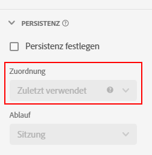

# [!UICONTROL Persistenz]-Komponenteneinstellungen {#persistence-component-settings}

<!-- markdownlint-disable MD034 -->

>[!CONTEXTUALHELP]
>id="dataview_component_dimension_persistence"
>title="Persistenz"
>abstract="Konfigurieren Sie das standardmäßige Zuordnungsmodell, das auf eine Dimension angewendet wird. Die Zuordnung erfolgt vor den Segmenten in Berichten. "

<!-- markdownlint-enable MD034 -->

[!UICONTROL Persistenz] ist die Fähigkeit, dass ein bestimmter Dimensionswert über das Ereignis hinaus einer Metrik zugeordnet werden kann, für das er festgelegt ist. Dafür wird eine Kombination aus Zuordnung und Gültigkeit verwendet.

* **Zuordnung** ermöglicht die Bestimmung des beizubehaltenden Werts, wenn mehrere Dimensionselemente gleichzeitig in einer Spalte beibehalten werden können.

  >[!NOTE]
  >
  >Wenn Sie für eine Metrik in einem Bericht ein [nicht standardmäßiges Attributionsmodell](/help/data-views/component-settings/attribution.md) festgelegt haben, ignoriert das Attributionsmodell die Zuordnung, die Sie in der Dimension für denselben Bericht festgelegt haben.
  >
  >Bei einem [vollständigen Tabellenexport](/help/analysis-workspace/export/export-cloud.md) mit mehreren Dimensionen behält die Attribution jedoch die auf die einzelnen Dimensionen angewendeten Zuordnungsmodelle bei.

* Mit **Gültigkeit** können Sie festlegen, wie lange ein Dimensionselement über das Ereignis hinaus bestehen bleibt, für das es festgelegt ist.

[!UICONTROL Persistenz] ist nur in Dimensionen verfügbar und rückwirkend für die Daten, auf die sie angewendet wird. Es handelt sich um eine sofortige Datenumwandlung, die vor der Anwendung von Segmentierungen oder anderen Analysevorgängen erfolgt.

| Einstellung | Beschreibung |
| --- | --- |
| [!UICONTROL Persistenz festlegen] | Aktivieren Sie die Persistenz für die Dimension. Wenn die Persistenz nicht aktiviert ist, bezieht sich die Dimension nur auf Metriken, die im selben Ereignis vorhanden sind. Diese Einstellung ist standardmäßig aktiviert. |
| [!UICONTROL Zuordnung] | Geben Sie das Zuordnungsmodell an, das für eine Dimension zur Persistenz verwendet wird. Die Optionen sind:<ul><li>**[!UICONTROL Zuletzt verwendet]**: Werte in der Dimension bleiben so lange bestehen, bis sie durch nachfolgende Werte überschrieben werden</li><li> **[!UICONTROL Original]**: Der erste Wert für diese Dimension bleibt bestehen und wird nicht durch nachfolgende Werte überschrieben</li><li>**[!UICONTROL Alle]**: Alle Werte für diese Dimension bleiben gleichzeitig bestehen</li><li>**[!UICONTROL Erster bekannter]**: Der erste Wert für diese Dimension wird verwendet und wird auf alle Ereignisse davor und danach angewendet.</li><li>**[!UICONTROL Letzter bekannter]**: Der letzte Wert für diese Dimension wird verwendet und wird auf alle Ereignisse davor und danach angewendet.</li></ul> |
| [!UICONTROL Ablauf] | Persistenzfenster für eine Dimension angeben. Die Optionen sind: <ul><li>**[!UICONTROL Sitzung]** (Standard)</li><li>**[!UICONTROL Person]**</li><li>**[!UICONTROL Benutzerdefinierte Zeit]**</li><li>**[!UICONTROL Metrik]**</li></ul>  Möglicherweise brauchen Sie die Option, dass die Dimension bei einem Kauf ablaufen soll (z. B. interne Suchbegriffe oder andere Merchandising-Verwendungsfälle). Die maximale Gültigkeitsdauer, die Sie festlegen können, beträgt 90 Tage. Wenn Sie die Zuordnung [!UICONTROL Alle] auswählen, ist nur die Gültigkeit [!UICONTROL Sitzung] oder [!UICONTROL Person] verfügbar. |

{style="table-layout:auto"}

## [!UICONTROL Zuordnungs]-Einstellungen

Die verfügbaren Zuordnungseinstellungen sind:

* **[!UICONTROL Zuletzt verwendet]**: behält den letzten (nach Zeitstempel) in der Dimension vorhandenen Wert bei. Alle nachfolgenden Werte, die innerhalb des Gültigkeitszeitraums der Dimension auftreten, ersetzen den vorherigen Wert. Wenn „Kein Wert als Wert behandeln“ für diese Dimension unter [Optionen für keinen Wert](no-value-options.md) aktiviert ist, überschreiben leere Werte vorherige Werte. Betrachten Sie beispielsweise die folgende Tabelle mit der Zuordnung [!UICONTROL Zuletzt verwendet] und der Gültigkeit [!UICONTROL Sitzung]:

  | Dimension | Treffer 1 | Treffer 2 | Treffer 3 | Treffer 4 | Treffer 5 |
  | --- | --- | --- | --- | --- | --- |
  | Datensatzwerte |  | C | B |  | A  |
  | Zuletzt verwendete Zuordnung |  | C | B | B | A  |

* **[!UICONTROL Original]**: Behält den ursprünglichen Wert nach Zeitstempel bei, der innerhalb der Dimension für die Dauer des Gültigkeitszeitraums vorhanden ist. Wenn diese Dimension einen Wert hat, wird er nicht überschrieben, wenn bei einem nachfolgenden Ereignis ein anderer Wert angezeigt wird. Betrachten Sie beispielsweise die folgende Tabelle mit der Zuordnung [!UICONTROL Original] und der Gültigkeit [!UICONTROL Sitzung]:

  | Dimension | Treffer 1 | Treffer 2 | Treffer 3 | Treffer 4 | Treffer 5 |
  | --- | --- | --- | --- | --- | --- |
  | Datensatzwerte |  | C | B |  | A  |
  | Originale Zuordnung |  | C | C | C | C |

* **[!UICONTROL Alle]**: Funktioniert ähnlich wie das Attributionsmodell [!UICONTROL Partizipation] für Metriken. Behält alle Werte bei, damit jeder Wert im Reporting vollständig für die Metrik angerechnet wird. Betrachten Sie beispielsweise die folgende Tabelle mit der Zuordnung [!UICONTROL Alle] und der Gültigkeit [!UICONTROL Sitzung]:

  | Dimension | Treffer 1 | Treffer 2 | Treffer 3 | Treffer 4 | Treffer 5 |
  | --- | --- | --- | --- | --- | --- |
  | Datensatzwerte | A  | B | C |  | A  |
  | Zuordnung Alle | A  | A,B | A,B,C | A,B,C | A,B,C |

* **[!UICONTROL Erster bekannter]** und **[!UICONTROL Letzter bekannter]**: (19. Januar 2022) Diese beiden Zuordnungsmodelle erfüllen die Anwendungsfälle der Dimensionen Einstieg und Ausstieg. Sie wenden den ersten oder letzten beobachteten Wert für eine Dimension innerhalb eines bestimmten Persistenzbereichs (Sitzung, Person oder benutzerspezifischer Zeitraum mit Lookback) auf alle Ereignisse innerhalb des angegebenen Bereichs an. Beispiel:

  | Dimension | Treffer 1 | Treffer 2 | Treffer 3 | Treffer 4 | Treffer 5 |
  | --- | --- | --- | --- | --- | --- |
  | Zeitstempel (Min.) | 1 | 2 | 3 | 6 | 7 |
  | Ausgangswerte |  | C | B |  | A  |
  | Erster bekannter | C | C | C | C | C |
  | Letzter bekannter | A  | A  | A  | A  | A  |

## [!UICONTROL Gültigkeits]-Einstellungen

Die verfügbaren Ablaufeinstellungen sind:

* **Sitzung**: Läuft nach einer Sitzung ab. Standardgültigkeitsfenster.
* **Reporting-Fenster „Person“**: Läuft am Ende des Reporting-Fensters ab.
* **Reporting Fenster „Globales Konto“** [!BADGE B2B Edition]{type=Informative url="https://experienceleague.adobe.com/de/docs/analytics-platform/using/cja-overview/cja-b2b/cja-b2b-edition" newtab=true tooltip="Customer Journey Analytics B2B Edition"}: Läuft am Ende des Reporting-Fensters ab.
* **Reporting-Fenster „Konto“** [!BADGE B2B Edition]{type=Informative url="https://experienceleague.adobe.com/de/docs/analytics-platform/using/cja-overview/cja-b2b/cja-b2b-edition" newtab=true tooltip="Customer Journey Analytics B2B Edition"}: Läuft am Ende des Reporting-Fensters ab.
* **Reporting-Fenster „Opportunity“** [!BADGE B2B Edition]{type=Informative url="https://experienceleague.adobe.com/de/docs/analytics-platform/using/cja-overview/cja-b2b/cja-b2b-edition" newtab=true tooltip="Customer Journey Analytics B2B Edition"}: Läuft am Ende des Reporting-Fensters ab.
* **Reporting Fenster „Käufergruppe“** [!BADGE B2B Edition]{type=Informative url="https://experienceleague.adobe.com/de/docs/analytics-platform/using/cja-overview/cja-b2b/cja-b2b-edition" newtab=true tooltip="Customer Journey Analytics B2B Edition"}: Läuft am Ende des Reporting-Fensters ab.
* **Benutzerdefinierte Zeit**: Läuft nach einer festgelegten Zeitspanne ab (bis zu 90 Tage). Diese Ablaufoption ist nur für die Zuordnungsmodelle „Original“ und „Zuletzt verwendet“ verfügbar. Bei Verwendung der zeitbasierten Gültigkeitsdauer werden auch Werte vor dem Beginn des Reporting-Fensters (bis zu 90 Tage) berücksichtigt.
* **Metrik**: Wenn diese Metrik in einem Ereignis angezeigt wird, läuft der persistente Wert in der Dimension sofort ab. Sie können jede beliebige Metrik als Gültigkeitsende für diese Dimension verwenden. Diese Gültigkeitsoption ist nur für die Zuordnungseinstellungen „Original“ und „Zuletzt verwendet“ verfügbar.

## [!UICONTROL Binding-Dimension]

Ein Dropdown-Menü, mit dem Sie die Persistenz eines Dimensionswerts an Dimensionswerte in einer anderen Dimension binden können. Gültige Optionen umfassen andere Dimensionen, die in der Datenansicht enthalten sind.

Siehe [Verwenden von Bindungsdimensionen und Metriken in Customer Journey Analytics](../../use-cases/data-views/binding-dimensions-metrics.md) für Beispiele zur effektiven Verwendung von Bindungsdimensionen.

>[!BEGINSHADEBOX]

Unter  [Bindungsdimensionen](https://video.tv.adobe.com/v/342694/?quality=12&learn=on){target="_blank"} finden Sie ein Demovideo.

>[!ENDSHADEBOX]

## [!UICONTROL Binding-Metrik]

Ein Dropdown-Menü, über das Sie eine Metrik auswählen können, die als Bindungs-Trigger fungiert. Zu den gültigen Optionen gehören die Metriken, die in der Datenansicht enthalten sind.

Diese Einstellung wird nur angezeigt, wenn die Binding-Dimension im Objekt-Array niedriger ist als die Komponente. Wenn in einem Ereignis eine Bindungsmetrik vorhanden ist, werden Dimensionswerte von der Ereignisebene auf die untere Schemaebene der Bindungsdimension kopiert.

Siehe das zweite Beispiel unter [Verwenden von Bindungsdimensionen und Metriken in Customer Journey Analytics](../../use-cases/data-views/binding-dimensions-metrics.md) für weitere Informationen zur effektiven Verwendung von Bindungsmetriken.
