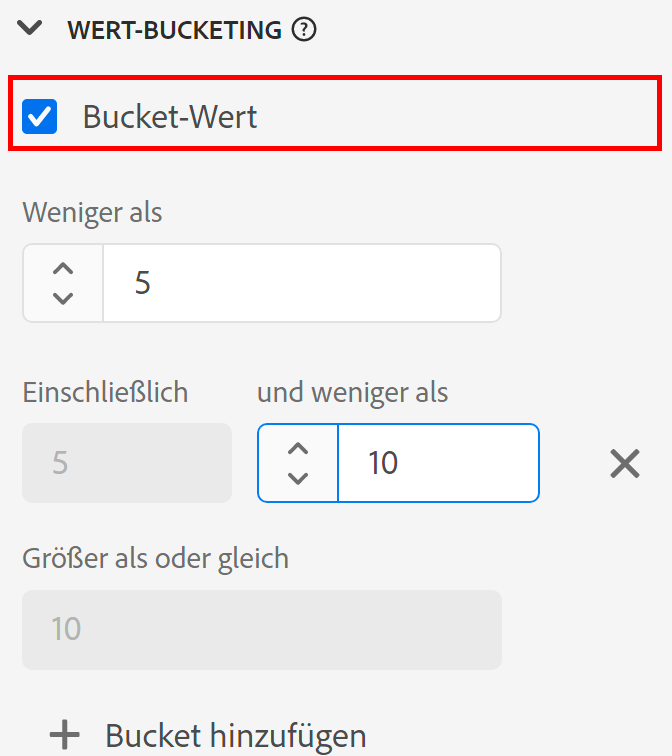

# Komponenteneinstellungen für [!UICONTROL Wert-Bucketing] {#value-bucketing-component-settings}

<!-- markdownlint-disable MD034 -->

>[!CONTEXTUALHELP]
>id="cja_dataview_component_dimension_valuebucketing"
>title="Bucketing von Werten"
>abstract="Sie können Werte zu spezifischen Bereichen zusammenfassen. Diese Bereiche werden in Berichten als Dimensionseinträge angezeigt."

<!-- markdownlint-enable MD034 -->

Beim Erstellen oder Bearbeiten einer Datenansicht können Sie mit Wert-Bucketing numerische Werte basierend auf einem Bereich kombinieren. Sie ist nur für Dimensionen verfügbar, die Schemadatentypen vom Typ „Ganzzahl“ oder „Doppelt“ verwenden.

Wert-Bucketing ist nützlich, wenn Sie Bereiche gruppieren möchten, anstatt jede eindeutige Zahl als ein separates Dimensionselement zu behandeln. Ein Behälter von „zwischen 5 und 10“ wird beispielsweise in Analysis Workspace als ein Zeilenelement „5 bis 10“ angezeigt.

Wenn Sie die Flexibilität beim Reporting für eine Dimension mit und ohne Behälter Dimension wünschen, ziehen Sie zwei Kopien der Komponente in die Liste der verfügbaren Dimensionen. Aktivieren Sie Bucketing für eine Dimension und deaktivieren Sie es für die andere.

| Einstellung | Beschreibung |
| --- | --- |
| [!UICONTROL Bucket-Wert] | Ein Kontrollkästchen, mit dem Sie Bucketing aktivieren können. |
| [!UICONTROL Kleiner als] | Die obere Grenze des ersten Dimensionsbehälters. |
| [!UICONTROL Einschließlich] [!UICONTROL und weniger als] | Grenzen der nachfolgenden Behälter. |
| [!UICONTROL Größer oder gleich] | Die untere Grenze des letzten Dimensionsbehälters. |
| [!UICONTROL Bucket hinzufügen] | Ermöglicht das Hinzufügen eines weiteren Behälters zu numerischen Dimensionsbehältern. Sie können bis zu 20 Behälter in einer Dimension hinzufügen. |

{style="table-layout:auto"}
