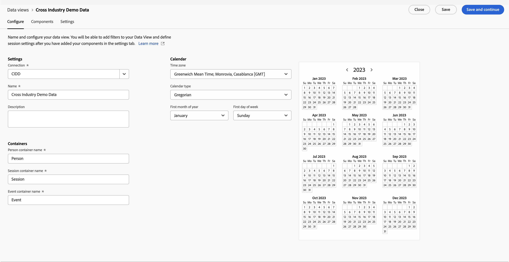
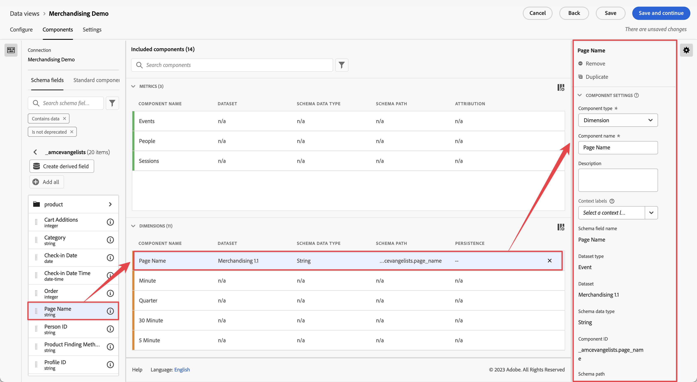
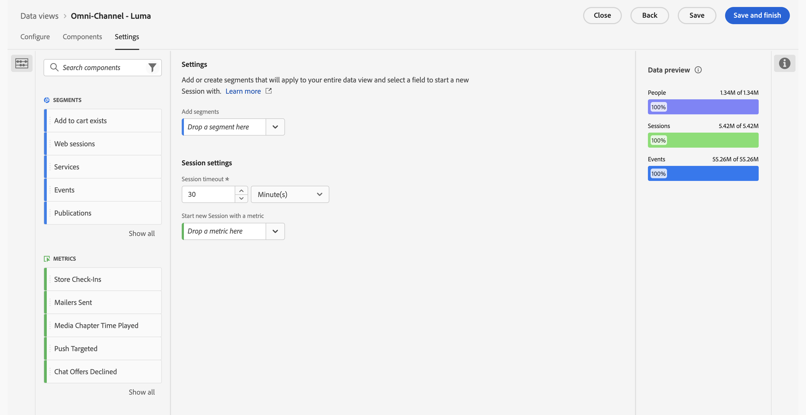

# Erstellen oder Bearbeiten einer Datenansicht

Das Erstellen einer Datenansicht beinhaltet entweder das Erstellen von Metriken und Dimensionen aus Schemaelementen oder die Verwendung von Standardkomponenten. Die meisten Schemaelemente können je nach den Anforderungen Ihres Unternehmens entweder eine Dimension oder eine Metrik sein. Nachdem Sie ein Schemaelement in eine Datenansicht gezogen haben, werden rechts Optionen angezeigt, mit denen Sie anpassen können, wie die Dimension oder Metrik in Customer Journey Analytics funktioniert.

>[!BEGINSHADEBOX]

Unter  [Erstellen oder Bearbeiten einer Datenansicht](https://video.tv.adobe.com/v/3410300/?quality=12&learn=on&captions=ger){target="_blank"} finden Sie ein Demovideo.

>[!ENDSHADEBOX]

So erstellen oder bearbeiten Sie eine Datenansicht:

1. Melden Sie sich bei [Customer Journey Analytics](https://analytics.adobe.com) an und wählen Sie **[!UICONTROL Datenansichten]** optional unter **[!UICONTROL Daten-Management]** im oberen Menü aus.
1. Um eine Datenansicht zu erstellen, wählen Sie **[!UICONTROL Neue Datenansicht erstellen]** aus. Sie können auch eine vorhandene Datenansicht aus der Liste der Datenansichten auswählen und diese bearbeiten.

## Konfigurieren {#configure}

So konfigurieren Sie eine neue oder vorhandene Datenansicht:

>[!BEGINTABS]

>[!TAB Standard ]

>[!TAB B2B Edition]

>[!ENDTABS]

1. Wählen Sie die Registerkarte **[!UICONTROL Konfigurieren]** aus (sofern noch nicht aktiv).

1. Legen Sie Angaben für [!UICONTROL Einstellungen], [!UICONTROL Container] und [!UICONTROL Kalender] fest (siehe unten).
1. Wählen Sie **[!UICONTROL Speichern und fortfahren]** aus, um mit der Konfiguration der neuen oder vorhandenen Datenansicht fortzufahren. Wählen Sie **[!UICONTROL Speichern]** aus, um die Konfiguration für die vorhandene Datenansicht zu speichern.

### Einstellungen {#configure-settings}

>[!CONTEXTUALHELP]
>id="dataview_externalid"
>title="Externe ID"
>abstract="Das Ändern der externen ID kann sich darauf auswirken, wie der Name der Datenansicht in externen Quellen angezeigt wird, z. B. in Business-Intelligence-Tools."

Stellt übergreifende Einstellungen für die Datenansicht bereit.

| Einstellung | Beschreibung |
| --- | --- |
| **[!UICONTROL Verbindung]** | In diesem Feld wird die Datenansicht mit der zuvor eingerichteten Verbindung verknüpft, die einen oder mehrere Adobe Experience Platform-Datensätze enthält. |
| **[!UICONTROL Name]** | Erforderlich. Der Name der Datenansicht. Dieser Wert wird im Dropdown-Menü oben rechts in Analysis Workspace angezeigt. |
| **[!UICONTROL Externe ID]** | Erforderlich. Der Name der Datenansicht, die Sie in externen Quellen verwenden können, beispielsweise in Business-Intelligence-Tools. Der Standardwert ist `unspecified`. Wenn Sie keine externe ID angeben, wird der Name aus dem Namen der Datenansicht erstellt, wobei Leerzeichen durch Unterstriche ersetzt werden. |
| **[!UICONTROL Beschreibung]** | Optional. Adobe empfiehlt eine detaillierte Beschreibung, damit Benutzer verstehen, warum die Datenansicht vorhanden ist und für wen sie konzipiert ist. |

{style="table-layout:auto"}

### Kompatibilität {#compatibility}

>[!CONTEXTUALHELP]
>id="dataview_dataviewsinadobejourneyoptimizer"
>title="Datenansichten in Journey Optimizer"
>abstract="Customer Journey Analytics muss eine Verbindung und eine Datenansicht verwenden, die mit Adobe Journey Optimizer kompatibel sind. Standardmäßig werden zu diesem Zweck automatisch eine Verbindung und eine Datenansicht erstellt. Alternativ kann diese Option aktiviert werden, um diese Datenansicht zur Standardansicht zu machen, die in der Adobe Journey Optimizer-Berichterstellung verwendet wird. Wenn diese Option aktiviert ist, werden alle notwendigen Komponenten, die für Journey Optimizer erforderlich sind, zu dieser Datenansicht hinzugefügt, und alle notwendigen Journey Optimizer-Datensätze werden zu der mit dieser Datenansicht verbundenen Verbindung hinzugefügt."
>additional-url="https://experienceleague.adobe.com/de/docs/analytics-platform/using/integrations/ajo#connection" text="Welche Komponenten und Datensätze hinzugefügt werden."

Bietet Einstellungen, die angewendet werden können, wenn Adobe Journey Optimizer zusätzlich zu Customer Journey Analytics verwendet wird.

Dieser Abschnitt ist nur für Admins sichtbar, denen Journey Optimizer bereitgestellt wird.

| Einstellung | Beschreibung |
| --- | --- |
| [!UICONTROL **Als Standard-Datenansicht in Adobe Journey Optimizer festlegen**] | Diese Konfigurationsoption standardisiert die Berichterstellung zwischen Journey Optimizer und Customer Journey Analytics. Sie können auch eine erweiterte Analyse Ihrer Adobe Journey Optimizer-Daten in Customer Journey Analytics durchführen (indem Sie in Journey Optimizer  [!UICONTROL **In CJA analysieren**] auswählen).
Für die Durchführung dieser Art von Analyse benötigt Journey Optimizer Zugriff auf eine Customer Journey Analytics-Datenansicht.
Aktivieren Sie diese Option, um diese Datenansicht als Standardansicht für die Journey Optimizer-Berichterstellung für Ihre Sandbox zu verwenden.

Diese Konfigurationsoption führt Folgendes automatisch durch:
<ul><li>Konfiguration alle rerforderlichen Journey Optimizer-Datensätze in der zugehörigen Verbindung in Customer Journey Analytics für die Verwendung mit Journey Optimizer.</li><li>Erstellung eines Satzes von Journey Optimizer-Metriken und -Dimensionen in der Datenansicht (einschließlich abgeleiteter Felder und berechneter Metriken). Kontextbezeichnungen werden für alle diese Metriken und Dimensionen automatisch festgelegt.</li><li>Aktiviert automatisch **[!UICONTROL Option „In CJA verwenden]** in der Verbindung, die mit dieser Datenansicht verknüpft ist. (Weitere Informationen zu dieser Option finden Sie unter [Verwenden einer Journey Optimizer-Verbindung in Customer Journey Analytics](/help/connections/manage-connections.md).)
Wenn Sie diese Einstellung manuell deaktivieren, nachdem sie aktiviert wurde, werden die Verbindung und alle zugehörigen Datenansichten auf ihren Standardstatus zurückgesetzt. Dies kann zu Datenänderungen in Ihren Berichten führen.
</li></ul>

Beachten Sie beim Aktivieren dieser Option Folgendes: <ul><li>Sie können die Standarddatenansicht zu einem späteren Zeitpunkt ändern. Hierdurch können sich jedoch Ihre Journey Optimizer-Berichtsdaten ändern.  Wenn Sie diese Option deaktivieren, nachdem sie aktiviert war, werden Sie aufgefordert, eine neue Standarddatenansicht auszuwählen.</li><li>Wenn Sie bereits manuelle Anpassungen an den Datensätzen, Dimensionen oder Metriken in der Customer Journey Analytics-Datenansicht vorgenommen haben, bleiben Ihre manuellen Anpassungen beim Aktivieren dieser Konfigurationsoption erhalten. Diese Option ermöglicht zusätzliche Anpassungen, die die Berichterstellung zwischen Journey Optimizer und Customer Journey Analytics weiter standardisieren. Sie können manuelle Anpassungen auch nach dem Aktivieren dieser Option vornehmen.</li><li>Wenn diese Option ausgewählt ist, kann die mit der Datenansicht verknüpfte Verbindung nicht gelöscht werden.</li></ul>Weitere Informationen finden Sie unter [Integrieren von Adobe Journey Optimizer mit Adobe Customer Journey Analytics](/help/integrations/ajo.md). |

{style="table-layout:auto"}

### Container

Gibt den Namen der Container für die Datenansicht an. Container-Namen werden häufig in &quot;[&quot; ](/help/components/segments/seg-overview.md#containers).

| Einstellung | Beschreibung |
| --- | --- |
| [!BADGE B2B Edition]{type=Informative url="https://experienceleague.adobe.com/de/docs/analytics-platform/using/cja-overview/cja-b2b/cja-b2b-edition" newtab=true tooltip="Customer Journey Analytics B2B Edition"} **[!UICONTROL Container-Name für globales Konto &#x200B;]** | `Global Account` (Standard). Der Container [!UICONTROL Globales Konto] enthält sämtliche Sitzungen und Ereignisse für globale Konten innerhalb des angegebenen Zeitrahmens. Falls Ihre Organisation einen anderen Begriff verwendet, können Sie den Container hier umbenennen. |
| [!BADGE B2B Edition]{type=Informative url="https://experienceleague.adobe.com/de/docs/analytics-platform/using/cja-overview/cja-b2b/cja-b2b-edition" newtab=true tooltip="Customer Journey Analytics B2B Edition"} **[!UICONTROL Container-Name für Konto &#x200B;]** | `Account` (Standard). Der Container [!UICONTROL Konto] enthält sämtliche Sitzungen und Ereignisse für Konten innerhalb des angegebenen Zeitrahmens. Falls Ihre Organisation einen anderen Begriff verwendet, können Sie den Container hier umbenennen. |
| [!BADGE B2B Edition]{type=Informative url="https://experienceleague.adobe.com/de/docs/analytics-platform/using/cja-overview/cja-b2b/cja-b2b-edition" newtab=true tooltip="Customer Journey Analytics B2B Edition"} **[!UICONTROL Container-Name für Opportunity &#x200B;]** | `Opportunity` (Standard). Der Container [!UICONTROL Opportunity] enthält sämtliche Sitzungen und Ereignisse für Opportunitys innerhalb des angegebenen Zeitrahmens. Falls Ihre Organisation einen anderen Begriff verwendet, können Sie den Container hier umbenennen. |
| [!BADGE B2B Edition]{type=Informative url="https://experienceleague.adobe.com/de/docs/analytics-platform/using/cja-overview/cja-b2b/cja-b2b-edition" newtab=true tooltip="Customer Journey Analytics B2B Edition"} **[!UICONTROL Container-Name für Käufergruppe &#x200B;]** | `Buying Group` (Standard). Der Container [!UICONTROL Käufergruppe] enthält sämtliche Sitzungen und Ereignisse für Käufergruppen innerhalb des angegebenen Zeitrahmens. Falls Ihre Organisation einen anderen Begriff verwendet, können Sie den Container hier umbenennen. |
| **[!UICONTROL Container-Name für Person]** | `Person` (Standard). Der Container [!UICONTROL Person] enthält sämtliche Sitzungen und Ereignisse für Personen innerhalb des angegebenen Zeitrahmens. Wenn Ihr Unternehmen einen anderen Begriff verwendet (z. B. „Besucher“ oder „Benutzer“), können Sie den Container hier umbenennen. |
| **[!UICONTROL Container-Name für Sitzung]** | `Session` (Standard). Mit dem Sitzungs-Container können Seiteninteraktionen, Kampagnen oder Konversionen für eine bestimmte [!UICONTROL Sitzung] identifiziert werden. Sie können diesen Container in „Besuch“ oder einen anderen von Ihrem Unternehmen bevorzugten Begriff umbenennen. |
| **[!UICONTROL Container-Name für Ereignis]** | `Event` (Standard). Der Container [!UICONTROL Ereignis] definiert einzelne Ereignisse in einem Datensatz. Wenn Ihr Unternehmen einen anderen Begriff verwendet (z. B. „Hits“ oder „Seitenansichten“), können Sie den Container hier umbenennen. |

{style="table-layout:auto"}

### Kalender

Gibt das Kalenderformat an, dem die Datenansicht folgen soll. Sie können mehrere Datenansichten basierend auf derselben [Verbindung](/help/connections/create-connection.md) haben und ihnen unterschiedliche Kalendertypen oder Zeitzonen zuweisen. Diese Datenansichten können es Teams, die verschiedene Kalendertypen verwenden, ermöglichen, ihre jeweiligen Anforderungen mit denselben zugrunde liegenden Daten zu erfüllen.

| Einstellung | Beschreibung |
| --- | --- |
| [!UICONTROL **Zeitzone**] | Wählen Sie die Zeitzone aus, in der Ihre Daten angezeigt werden sollen. Wenn Sie eine Zeitzone auswählen, die mit der Sommerzeit arbeitet, werden die Daten automatisch entsprechend angepasst. Im Frühling, wenn die Uhren eine Stunde vor gestellt werden, besteht eine Lücke von einer Stunde. Im Herbst, wenn die Uhren eine Stunde zurück gestellt werden, wird während der Sommerzeit eine Stunde wiederholt. |
| [!UICONTROL **Kalendertyp**] | Bestimmen Sie, wie die Wochen des Monats gruppiert werden. **Gregorianisch:** Standardkalenderformat. Die Quartale werden nach Monat gruppiert. **4-5-4 Einzelhandel:** Ein standardisierter 4-5-4 Einzelhandelskalender. Der erste und der letzte Monat des Quartals enthalten 4 Wochen, während der zweite Monat des Quartals 5 Wochen umfasst. **Benutzerspezifisch (4-5-4):** Ähnlich wie der 4-5-4-Kalender, mit dem Unterschied, dass Sie den ersten Tag des Jahres und das Jahr auswählen können, in dem die „zusätzliche“ Woche liegt. **Benutzerspezifisch (4-4-5):** Der erste und zweite Monat jedes Quartals enthalten 4 Wochen, während die letzte Woche jedes Quartals 5 Wochen umfasst. **Benutzerspezifisch (5-4-4):** Der erste Monat jedes Quartals umfasst 5 Wochen, während der zweite und dritte Monat jedes Quartals 4 Wochen umfassen. |
| [!UICONTROL **Erster Monat des Jahres**] und [!UICONTROL **Erster Wochentag**] | Sichtbar für den gregorianischen Kalender. Geben Sie an, mit welchem Monat das Kalenderjahr beginnen soll und mit welchem Tag jede Woche beginnen soll. |
| [!UICONTROL **Erster Tag des aktuellen Jahres**] | Für benutzerdefinierte Kalendertypen sichtbar. Geben Sie an, an welchem Tag des Jahres das aktuelle Jahr beginnen soll. Der Kalender formatiert automatisch den ersten Wochentag auf Grundlage dieses Werts. |
| [!UICONTROL **Jahr mit „zusätzlicher“ Woche**] | Bei den meisten 364-tägigen Kalendern (52 Wochen mit jeweils 7 Tagen) sammeln sich jedes Jahr verbleibende Tage, bis sie eine zusätzliche Woche ausmachen. Diese zusätzliche Woche wird dann zum letzten Monat des Jahres hinzugefügt. Geben Sie an, zu welchem Jahr die zusätzliche Woche hinzugefügt werden soll. |

{style="table-layout:auto"}

## Komponenten

Als Nächstes können Sie die Komponenten einer Datenansicht festlegen, d. h., Sie können Metriken und Dimensionen aus Schemaelementen erstellen. Sie können auch Standardkomponenten verwenden.

>[!IMPORTANT]
>
>Zu einer Datenansicht können bis zu 5.000 Metriken und 5.000 Dimensionen hinzugefügt werden.

1. Wählen Sie die Registerkarte **[!UICONTROL Komponenten]** aus.

   

   Links oben sehen Sie die [!UICONTROL Verbindung], die die Datensätze enthält, und unten ihre [!UICONTROL Schemafelder].  Bei den bereits eingeschlossenen Komponenten handelt es sich um die (vom System generierten) Standardkomponenten, die für alle Datenansichten benötigt werden (z. B. Ereignisse, Personen, Sitzungsmetriken und die Dimensionen „Minute“, „Quartal“und „Woche“). Adobe wendet standardmäßig auch den Filter **[!UICONTROL Enthält Daten]** und **[!UICONTROL wird nicht]**, sodass nur Schemafelder angezeigt werden, die Daten enthalten und nicht veraltet sind.

1. Suchen Sie mithilfe von  **[!UICONTROL Schemafelder suchen]** oder suchen Sie ein Feld, indem Sie in eine der Datensatzsammlungen wechseln, z. B **[!UICONTROL Ereignis-Datensätze]** oder **[!UICONTROL Lookup-Datensätze]**. Für Ereignis-Datensätze sind separate Sammlungen für  **[!UICONTROL XDM-]** und  **[!UICONTROL Adhoc- und modellbasierte]** verfügbar. Alternativ können Sie über  **Abgeleitetes Feld erstellen** ein abgeleitetes Feld erstellen. Weitere Informationen finden Sie unter [Abgeleitete Felder](./derived-fields/derived-fields.md).

1. Wenn Sie Ihr spezifisches Schemafeld gefunden oder Ihr abgeleitetes Feld definiert haben, ziehen Sie dieses Feld, z. B.  **[!UICONTROL Seitenname]**, aus der linken Leiste in den Abschnitt **[!UICONTROL Metriken]** oder **[!UICONTROL Dimensionen]** unter **[!UICONTROL Eingeschlossene Komponenten]**.
Sie können dasselbe Schema mehrmals in die Bereiche „Dimensionen“ oder „Metriken“ ziehen und dieselbe Dimension bzw. Metrik auf unterschiedliche Weise konfigurieren. Beispielsweise können Sie im Feld pageName rechts eine Dimension mit dem Titel `Product Pages` und eine weitere Dimension mit dem Titel `Error pages` erstellen, indem Sie verschiedene [Komponenteneinstellungen](component-settings/overview.md) verwenden.
Wenn Sie einen Ordner mit Schemafeldern aus der linken Leiste ziehen, werden die Felder im Ordner automatisch in den entsprechenden Abschnitt sortiert. Zeichenfolgenfelder landen im Abschnitt [!UICONTROL Dimensionen] und numerische Schematypen landen im Abschnitt [!UICONTROL Metriken]. Sie können auch auf **[!UICONTROL Alle hinzufügen]** klicken, dann werden alle Schemafelder zu ihrem jeweiligen Abschnitt hinzugefügt.

1. Nachdem Sie eine Komponente ausgewählt haben, werden die Einstellungen auf der rechten Seite angezeigt.

   

   Konfigurieren Sie die Komponente mit [Komponenteneinstellungen](component-settings/overview.md). Die verfügbaren Komponenteneinstellungen hängen davon ab, ob es sich bei der Komponente um eine Dimension/Metrik und um den Schemadatentyp handelt. Zu den Einstellungen gehören:

   * [[!UICONTROL Attribution]](component-settings/attribution.md)
   * [[!UICONTROL Verhalten]](component-settings/behavior.md)
   * [[!UICONTROL Format]](component-settings/format.md)
   * [[!UICONTROL Werte einschließen/ausschließen]](component-settings/include-exclude-values.md)
   * [[!UICONTROL Deduplizierung der Metrik]](component-settings/metric-deduplication.md)
   * [[!UICONTROL Keine Wertoptionen]](component-settings/no-value-options.md)
   * [[!UICONTROL Persistenz]](component-settings/persistence.md)
   * [[!UICONTROL Wert-Bucketing]](component-settings/value-bucketing.md)

1. Wählen Sie **[!UICONTROL Speichern und fortfahren]** aus, um mit der Konfiguration der neuen oder vorhandenen Datenansicht fortzufahren. Wählen Sie **[!UICONTROL Speichern]** aus, um die Konfiguration für die vorhandene Datenansicht zu speichern.

### Duplizieren von Metriken oder Dimensionen

Das Duplizieren von Metriken oder Dimensionen und das anschließende Ändern spezifischer Einstellungen ist eine einfache Möglichkeit, mehrere Metriken oder Dimensionen aus einem einzelnen Schemafeld zu erstellen. Wählen Sie die Einstellung [!UICONTROL Duplizieren] unter dem Namen der Metrik oder Dimension oben rechts aus. Ändern Sie dann die neue Dimension oder Metrik und speichern Sie sie unter einem aussagekräftigeren Namen.

### Filtern von Schemafeldern oder Datensätzen

Sie können  Schemafelder in der linken Leiste nach [!UICONTROL Datentyp], [!UICONTROL Datensätzen], [!UICONTROL Data Governance] und [!UICONTROL anderen] Kriterien ([!UICONTROL Enthält Daten], [!UICONTROL Ist Identität] und [!UICONTROL Ist nicht veraltet]) filtern:

>[!TIP]
>
>Wenn die Komponenten in Ihrer Datenansicht nicht ordnungsgemäß geladen werden und stattdessen eine Fehlermeldung angezeigt wird, lesen Sie bitte den Abschnitt [Fehlende Berechtigungen](../troubleshooting/lack-of-permissions.md), um das Problem zu beheben.

### Eingeschlossene Komponenten {#included-components}

>[!CONTEXTUALHELP]
>id="dataview_includedcomponents_filter_datagovernance_custom"
>title="Benutzerdefinierte Labels"
>abstract="Zusätzlich zu den von Adobe bereitgestellten Labels können Sie auch eigene benutzerdefinierte Labels für Ihr Unternehmen definieren. "
>additional-url="https://experienceleague.adobe.com/de/docs/experience-platform/data-governance/labels/overview" text="Datennutzungs-Labels – Überblick"

>[!CONTEXTUALHELP]
>id="dataview_includedcomponents_filter_datagovernance_contract"
>title="Vertrags-Labels"
>abstract="Vertrags-Labels (Contract Labels, C Labels) dienen der Kategorisierung von Daten, die vertragliche Bestimmungen aufweisen oder mit Data-Governance-Richtlinien Ihrer Organisation in Zusammenhang stehen."
>additional-url="https://experienceleague.adobe.com/de/docs/experience-platform/data-governance/labels/overview" text="Datennutzungs-Labels – Überblick"

>[!CONTEXTUALHELP]
>id="dataview_includedcomponents_filter_datagovernance_identity"
>title="Identitäts-Labels"
>abstract="Identitäts-Labels (I Labels) dienen der Kategorisierung von Daten, mit denen sich eine bestimmte Person identifizieren oder kontaktieren lässt."
>additional-url="https://experienceleague.adobe.com/de/docs/experience-platform/data-governance/labels/overview" text="Datennutzungs-Labels – Überblick"

>[!CONTEXTUALHELP]
>id="dataview_includedcomponents_filter_datagovernance_sensitive"
>title="Labels für sensible Daten"
>abstract="Labels für sensible Daten (S) dienen der Kategorisierung von Daten, die Sie und Ihre Organisation als sensibel betrachten."
>additional-url="https://experienceleague.adobe.com/de/docs/experience-platform/data-governance/labels/overview" text="Datennutzungs-Labels – Überblick"

>[!CONTEXTUALHELP]
>id="dataview_includedcomponents_filter_datagovernance_partnerecosystem"
>title="Partner-Ökosystem"
>abstract="Labels für Partner-Ökosysteme (P Labels) dienen der Kategorisierung von Daten, die mit Drittanbieter-Partnern geteilt werden."
>additional-url="https://experienceleague.adobe.com/de/docs/experience-platform/data-governance/labels/overview" text="Datennutzungs-Labels – Überblick"

>[!CONTEXTUALHELP]
>id="dataview_includedcomponents_filter_datagovernance_policies"
>title="Richtlinien"
>abstract="Damit Datennutzungsbezeichnungen die Datenkonformität effektiv unterstützen können, müssen Sie Datennutzungsrichtlinien definieren und aktivieren. Datennutzungsrichtlinien sind Regeln, die die Arten von Marketing-Aktionen beschreiben, die Sie für Daten in Experience Platform ausführen bzw. nicht ausführen dürfen. Die Richtlinienfilter wenden die aktivierte Richtlinie auf die Datenansicht an."
>additional-url="https://experienceleague.adobe.com/de/docs/experience-platform/data-governance/labels/overview" text="Datennutzungs-Labels – Überblick"

>[!CONTEXTUALHELP]
>id="dataview_includedcomponents_filter_datagovernance_responsibleengagement"
>title="Labels für verantwortungsvolle Interaktion"
>abstract="Labels für verantwortungsvolle Interaktion dienen der Unterstützung verantwortungsvoller Interaktion."
>additional-url="https://experienceleague.adobe.com/de/docs/experience-platform/data-governance/labels/overview" text="Datennutzungs-Labels – Überblick"

Die **[!UICONTROL Enthaltene Komponenten]** enthält die Liste der **[!UICONTROL Metriken]** und **[!UICONTROL Dimensionen]** die Sie für die Datenansicht konfigurieren.

* Um nach Komponenten zu suchen, verwenden Sie  **[!UICONTROL _Komponenten suchen_]**.
* Um die aufgelisteten enthaltenen Komponenten zu filtern, wählen Sie  aus.

  

  Im Dialogfeld **[!UICONTROL Feld filtern nach]** können Sie nach den folgenden Kategorien filtern:

   * **[!UICONTROL Datentyp]** - Sie können einen oder mehrere der folgenden Datentypen auswählen: [!UICONTROL String], [!UICONTROL Integer], [!UICONTROL Short], [!UICONTROL Boolean], [!UICONTROL Double], [!UICONTROL Byte], [!UICONTROL Long], [!UICONTROL Date] oder [!UICONTROL Date-Time].
   * **[!UICONTROL Datensätze]** - Wählen Sie einen oder mehrere Datensätze aus.
   * **[!UICONTROL Data Governance]**: Wählen Sie eine oder mehrere Kennzeichnungen aus den Unterkategorien [!UICONTROL Benutzerdefinierte Kennzeichnungen], [!UICONTROL Vertragskennzeichnungen], [!UICONTROL Identitätskennzeichnungen], [!UICONTROL Sensitivitätskennzeichnungen], P[!UICONTROL Partner-Ökosystem] oder [!UICONTROL Richtlinien] aus.
   * **[!UICONTROL Sonstige]** - Wählen Sie eine oder mehrere der Optionen [!UICONTROL Enthält Daten], [!UICONTROL Ist Identität] oder [!UICONTROL Ist nicht veraltet] aus.

  Wählen Sie **[!UICONTROL Anwenden]** aus, um die Filter anzuwenden.

## Einstellungen {#dataview-settings}

1. Wählen Sie die Registerkarte **[!UICONTROL Einstellungen]** aus.

   

1. Konfigurieren Sie Segmente, die auf Ihre gesamte Datenansicht angewendet werden sollen. Siehe [Einstellungen (Segmente)](#settings-filters) unten.
1. Konfigurieren Sie Sitzungs-Timeout und Metriken. Siehe [Sitzungseinstellungen](#session-settings) unten.

1. Wählen Sie **[!UICONTROL Speichern und fortfahren]** aus, um mit der Konfiguration der neuen oder vorhandenen Datenansicht fortzufahren. Wählen Sie **[!UICONTROL Speichern]** aus, um die Konfiguration für die vorhandene Datenansicht zu speichern.

### Einstellungen (Segmente) {#segment-settings}

Sie können Segmente hinzufügen, die für eine gesamte Datenansicht gelten. Dieses Segment wird auf alle Berichte angewendet, die Sie in Workspace ausführen. Ziehen Sie ein Segment aus den Komponenten in der linken Leiste in das Feld **[!UICONTROL Segmente hinzufügen]**.

### Sitzungseinstellungen

Legen Sie den Zeitraum der Inaktivität zwischen Ereignissen fest, bevor eine Sitzung abläuft und eine neue gestartet wird. Ein Zeitraum ist erforderlich. Sie können optional auch den Start einer neuen Sitzung erzwingen, wenn ein Ereignis eine bestimmte Metrik enthält. Siehe [Sitzungseinstellungen](session-settings.md) für weitere Details.

### Datenvorschau

Die Datenvorschau vergleicht (für die verschiedenen Container) die Daten dieser Datenansicht mit den Daten der Verbindung. Der Prozentsatz der Vorschau basiert auf der Gesamtzahl in der Verbindung aus den letzten 90 Tagen.

Wenn die Vorschau nicht geladen wird, wird Ihre Verbindung möglicherweise noch aufgestockt.

Nachdem alle gewünschten Einstellungen angegeben wurden, klicken Sie auf **[!UICONTROL Speichern und beenden]**.
