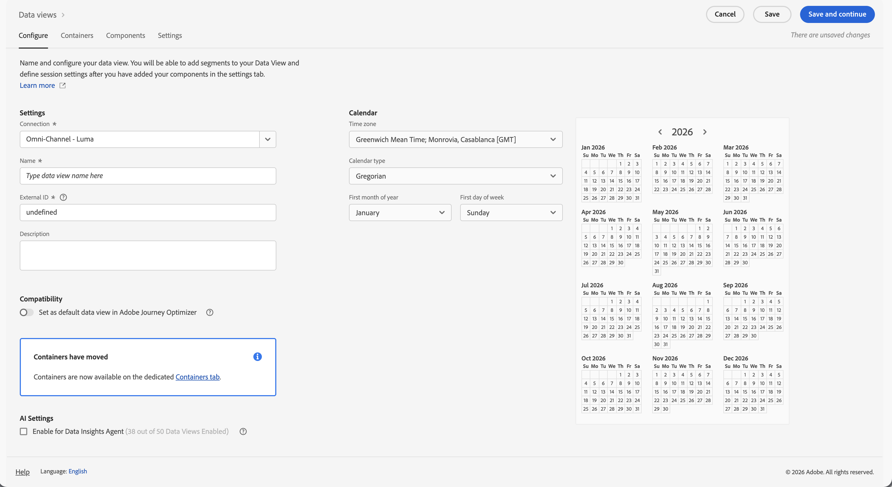
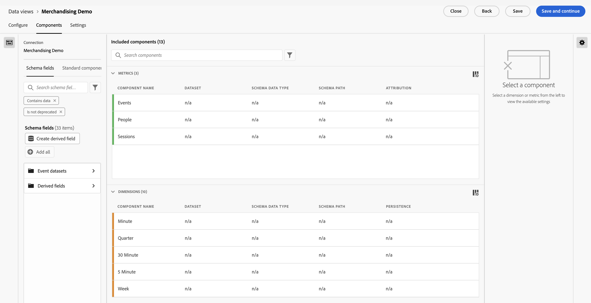
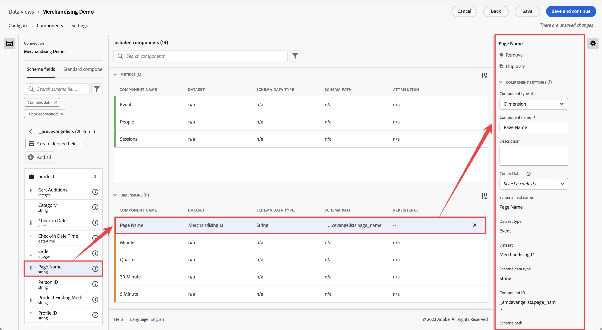
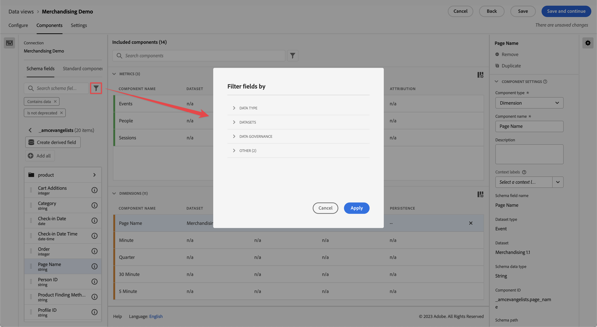

# Erstellen oder Bearbeiten einer Datenansicht

Das Erstellen einer Datenansicht beinhaltet entweder das Erstellen von Metriken und Dimensionen aus Schemaelementen oder die Verwendung von Standardkomponenten. Die meisten Schemaelemente können je nach den Anforderungen Ihres Unternehmens entweder eine Dimension oder eine Metrik sein. Nachdem Sie ein Schemaelement in eine Datenansicht gezogen haben, werden rechts Optionen angezeigt, mit denen Sie anpassen können, wie die Dimension oder Metrik in Customer Journey Analytics funktioniert.

>[!BEGINSHADEBOX]

Unter  [Erstellen oder Bearbeiten einer Datenansicht](https://experienceleague.adobe.com/en/docs/customer-journey-analytics-learn/tutorials/data-views/overview-of-configuring-data-views-for-cja){target="_blank"} finden Sie ein Demovideo.

>[!ENDSHADEBOX]

So erstellen oder bearbeiten Sie eine Datenansicht:

1. Melden Sie sich bei [Customer Journey Analytics](https://analytics.adobe.com) an und wählen Sie **[!UICONTROL Datenansichten]**, optional unter **[!UICONTROL Daten-Management]**, im oberen Menü aus.
1. Um eine Datenansicht zu erstellen, wählen Sie **[!UICONTROL Neue Datenansicht erstellen]** aus. Sie können auch eine vorhandene Datenansicht aus der Liste der Datenansichten auswählen und diese bearbeiten.

## Konfigurieren {#configure}

So konfigurieren Sie eine neue oder vorhandene Datenansicht:

1. Wählen Sie die Registerkarte **[!UICONTROL Konfigurieren]** aus (sofern noch nicht aktiv).
1. Geben Sie **[!UICONTROL Einstellungen]**, **[!UICONTROL Kompatibilität]**, **[!UICONTROL KI-]** und **[!UICONTROL Kalender]** Details an (siehe unten).
1. Wählen Sie **[!UICONTROL Speichern und fortfahren]** aus, um mit der Konfiguration der neuen oder vorhandenen Datenansicht fortzufahren. Wählen Sie **[!UICONTROL Speichern]** aus, um die Konfiguration für die vorhandene Datenansicht zu speichern.

### Einstellungen {#configure-settings}

>[!CONTEXTUALHELP]
>id="dataview_externalid"
>title="Externe ID"
>abstract="Das Ändern der externen ID wirkt sich darauf aus, wie der Name der Datenansicht in externen Quellen (z. B. Business Intelligence-Tools) angezeigt wird."

Stellt übergreifende Einstellungen für die Datenansicht bereit.

| Einstellung | Beschreibung |
| --- | --- |
| **[!UICONTROL Verbindung]** | In diesem Feld wird die Datenansicht mit der zuvor eingerichteten Verbindung verknüpft, die einen oder mehrere Adobe Experience Platform-Datensätze enthält. |
| **[!UICONTROL Name]** | Erforderlich. Der Name der Datenansicht. Dieser Wert wird im Dropdown-Menü rechts oben in Analysis Workspace angezeigt. |
| **[!UICONTROL Externe ID]** | Erforderlich. Der Name der Datenansicht, die Sie in externen Quellen verwenden können, beispielsweise in Business-Intelligence-Tools. Der Standardwert ist `unspecified`. Wenn Sie keine externe ID angeben, wird der Name aus dem Namen der Datenansicht erstellt, wobei Leerzeichen durch Unterstriche ersetzt werden. |
| **[!UICONTROL Beschreibung]** | Optional. Adobe empfiehlt eine detaillierte Beschreibung, damit Benutzer verstehen, warum die Datenansicht vorhanden ist und für wen sie konzipiert ist. |

{style="table-layout:auto"}

### Kompatibilität {#compatibility}

>[!CONTEXTUALHELP]
>id="dataview_dataviewsinadobejourneyoptimizer"
>title="Datenansichten in Journey Optimizer"
>abstract="Customer Journey Analytics erfordert eine Verbindung und eine Datenansicht, die mit Adobe Journey Optimizer kompatibel sind. Das System erstellt standardmäßig eine Verbindung und eine Datenansicht. Alternativ können Sie diese Option aktivieren, um dies als Standarddatenansicht für die Adobe Journey Optimizer-Berichterstellung festzulegen, wodurch die erforderlichen Komponenten zur Datenansicht und zu Datensätzen zur Verbindung hinzugefügt werden."
>additional-url="https://experienceleague.adobe.com/de/docs/analytics-platform/using/integrations/ajo#connection" text="Welche Komponenten und Datensätze hinzugefügt werden."

Bietet Einstellungen, die angewendet werden können, wenn Adobe Journey Optimizer zusätzlich zu Customer Journey Analytics verwendet wird.

Dieser Abschnitt ist nur für Admins sichtbar, denen Journey Optimizer bereitgestellt wird.

| Einstellung | Beschreibung |
| --- | --- |
| [!UICONTROL **Als Standard-Datenansicht in Adobe Journey Optimizer festlegen**] | Diese Konfigurationsoption standardisiert die Berichterstellung zwischen Journey Optimizer und Customer Journey Analytics. Sie können auch eine erweiterte Analyse Ihrer Adobe Journey Optimizer-Daten in Customer Journey Analytics durchführen (indem Sie in Journey Optimizer  [!UICONTROL **In CJA analysieren**] auswählen).
Für die Durchführung dieser Art von Analyse benötigt Journey Optimizer Zugriff auf eine Customer Journey Analytics-Datenansicht.
Aktivieren Sie diese Option, um diese Datenansicht als Standardansicht für die Journey Optimizer-Berichterstellung für Ihre Sandbox zu verwenden.

Diese Konfigurationsoption führt Folgendes automatisch durch:
<ul><li>Konfiguration alle rerforderlichen Journey Optimizer-Datensätze in der zugehörigen Verbindung in Customer Journey Analytics für die Verwendung mit Journey Optimizer.</li><li>Erstellung eines Satzes von Journey Optimizer-Metriken und -Dimensionen in der Datenansicht (einschließlich abgeleiteter Felder und berechneter Metriken). Kontextbezeichnungen werden für alle diese Metriken und Dimensionen automatisch festgelegt.</li><li>Aktiviert automatisch die Option **[!UICONTROL In CJA verwenden]** in der Verbindung, die mit dieser Datenansicht verknüpft ist. (Weitere Informationen zu dieser Option finden Sie unter [Verwenden einer Journey Optimizer-Verbindung in Customer Journey Analytics](/help/connections/manage-connections.md).)
Wenn Sie diese Einstellung nach der Aktivierung manuell deaktivieren, werden die Verbindung und alle zugehörigen Datenansichten auf ihren Standardstatus zurückgesetzt. Dies kann zu Datenänderungen in Ihren Berichten führen.
</li></ul>

Beachten Sie beim Aktivieren dieser Option Folgendes: <ul><li>Sie können die Standarddatenansicht zu einem späteren Zeitpunkt ändern. Hierdurch können sich jedoch Ihre Journey Optimizer-Berichtsdaten ändern. Wenn Sie diese Option deaktivieren, nachdem sie aktiviert war, werden Sie aufgefordert, eine neue Standarddatenansicht auszuwählen.</li><li>Wenn Sie bereits manuelle Anpassungen an den Datensätzen, Dimensionen oder Metriken in der Customer Journey Analytics-Datenansicht vorgenommen haben, bleiben Ihre manuellen Anpassungen beim Aktivieren dieser Konfigurationsoption erhalten. Diese Option ermöglicht zusätzliche Anpassungen, die die Berichterstellung zwischen Journey Optimizer und Customer Journey Analytics weiter standardisieren. Sie können manuelle Anpassungen auch nach dem Aktivieren dieser Option vornehmen.</li><li>Wenn diese Option ausgewählt ist, kann die mit der Datenansicht verknüpfte Verbindung nicht gelöscht werden.</li></ul>Weitere Informationen finden Sie unter [Integrieren von Adobe Journey Optimizer mit Adobe Customer Journey Analytics](/help/integrations/ajo.md). |

{style="table-layout:auto"}

### KI-Einstellungen

Wählen Sie **[!UICONTROL Für Data Insights Agent aktivieren]** aus, um die Datenansicht für die [Data Insights Agent zu &#x200B;](/help/data-analysis-ai.md). Der Data Insights Agent ist ein generativer KI-Konversationsagent, auf den über den KI-Assistenten in Customer Journey Analytics zugegriffen werden kann. So können Sie Daten schnell mit Text-Prompts analysieren. Der Agent erstellt relevante Visualisierungen in Analysis Workspace mithilfe von Komponenten aus Ihrer Datenansicht und unter Verwendung Ihrer tatsächlichen Daten.

### Kalender

Gibt das Kalenderformat an, dem die Datenansicht folgen soll. Sie können mehrere Datenansichten basierend auf derselben [Verbindung](/help/connections/create-connection.md) haben und ihnen unterschiedliche Kalendertypen oder Zeitzonen zuweisen. Diese Datenansichten können es Teams, die verschiedene Kalendertypen verwenden, ermöglichen, ihre jeweiligen Anforderungen mit denselben zugrunde liegenden Daten zu erfüllen.

| Einstellung | Beschreibung |
| --- | --- |
| [!UICONTROL **Zeitzone**] | Wählen Sie die Zeitzone aus, in der Ihre Daten angezeigt werden sollen. Wenn Sie eine Zeitzone auswählen, die mit der Sommerzeit arbeitet, werden die Daten automatisch entsprechend angepasst. Im Frühling, wenn die Uhren eine Stunde vor gestellt werden, besteht eine Lücke von einer Stunde. Im Herbst, wenn die Uhren eine Stunde zurück gestellt werden, wird während der Sommerzeit eine Stunde wiederholt. |
| [!UICONTROL **Kalendertyp**] | Bestimmen Sie, wie die Wochen des Monats gruppiert werden  **gregorianisch:** Standardkalenderformat. Die Quartale sind nach Monat gruppiert. **4-5-4 Einzelhandel:** Ein standardisierter 4-5-4 Einzelhandelskalender. Der erste und der letzte Monat des Quartals enthalten 4 Wochen, während der zweite Monat des Quartals 5 Wochen umfasst. **Benutzerspezifisch (4-5-4):** Ähnlich wie der 4-5-4-Kalender, mit dem Unterschied, dass Sie den ersten Tag des Jahres und das Jahr auswählen können, in dem die „zusätzliche“ Woche liegt. **Benutzerspezifisch (4-4-5):** Der erste und zweite Monat jedes Quartals enthalten 4 Wochen, während die letzte Woche jedes Quartals 5 Wochen umfasst. **Benutzerspezifisch (5-4-4):** Der erste Monat jedes Quartals umfasst 5 Wochen, während der zweite und dritte Monat jedes Quartals 4 Wochen umfassen. |
| [!UICONTROL **Erster Monat des Jahres**] und [!UICONTROL **Erster Wochentag**] | Sichtbar für den gregorianischen Kalender. Geben Sie an, mit welchem Monat das Kalenderjahr beginnen soll und mit welchem Tag jede Woche beginnen soll. |
| [!UICONTROL **Erster Tag des aktuellen Jahres**] | Für benutzerdefinierte Kalendertypen sichtbar. Geben Sie an, an welchem Tag des Jahres das aktuelle Jahr beginnen soll. Der Kalender formatiert automatisch den ersten Wochentag auf Grundlage dieses Werts. |
| [!UICONTROL **Jahr mit „zusätzlicher“ Woche**] | Bei den meisten 364-tägigen Kalendern (52 Wochen mit jeweils 7 Tagen) sammeln sich jedes Jahr verbleibende Tage, bis sie eine zusätzliche Woche ausmachen. Diese zusätzliche Woche wird dann zum letzten Monat des Jahres hinzugefügt. Geben Sie an, zu welchem Jahr die zusätzliche Woche hinzugefügt werden soll.  **Zusätzliche Wochen und Schaltjahre**  Wenn Sie einen benutzerdefinierten **[!UICONTROL Kalendertyp]** (**[!UICONTROL Benutzerdefiniert (4-5-4)]**, **[!UICONTROL Benutzerdefiniert (4-4-5)]** oder **[!UICONTROL Benutzerdefiniert (5-4-4)]**) auswählen, werden jedes Jahr verbleibende Tage gesammelt, bis sich die Tage zu einer ganzen zusätzlichen Woche (7 Tage) addieren. Diese zusätzliche Woche wird zu dem Jahr hinzugefügt, das Sie unter **[!UICONTROL Jahr mit „zusätzlicher“ Woche]** auswählen.  Schaltjahre werden absichtlich nicht in **[!UICONTROL Jahr mit „zusätzlicher“ Woche]** angezeigt. Dennoch kann ein Schaltjahr 53 Wochen umfassen. Um zu erzwingen, dass ein Schaltjahr 53 Wochen umfasst, wählen Sie unter **[!UICONTROL Jahr mit „zusätzlicher“ Woche]** ein Nicht-Schaltjahr aus, um sicherzustellen, dass die kumulative Datumsverschiebung bis zu 7 Tage für Ihr Ziel-Schaltjahr ergibt. Beispiel: Um im Jahr 2024 53 Wochen zu haben, wählen Sie **[!UICONTROL 2019]** aus. Von 2019 bis 2024 beträgt die Datumsverschiebung insgesamt 7 Tage (2020 (+2), 2021 (+1), 2022 (+1), 2023 (+1) und 2024 (+2)), was 2024 zu einer 53. Woche führt.  Die Auswahl für **[!UICONTROL Erster Tag des laufenden Jahres]** wirkt sich darauf aus, wo die zusätzliche Woche landet. Bestätigen Sie Ihre Konfiguration mithilfe der Kalendervorschau. |

{style="table-layout:auto"}

## Container

{{release-limited-testing-section}}

>[!BEGINTABS]

>[!TAB Standard ]

>[!TAB B2B Edition]

>[!ENDTABS]

Auf der Registerkarte **[!UICONTROL Container]** können Sie System-Container umbenennen und benutzerdefinierte Container hinzufügen.

### System-Container

Gibt den Namen der Container für die Datenansicht an. Container-Namen werden häufig in [Segmenten](/help/components/segments/seg-overview.md#containers) verwendet.

| Container-Name | Anzeigename (Standard) | Beschreibung |
| --- | --- | --- |
| globalAccount | [!BADGE B2B edition]{type=Informative url="https://experienceleague.adobe.com/de/docs/analytics-platform/using/cja-overview/cja-b2b/cja-b2b-edition" newtab=true tooltip="Customer Journey Analytics B2B Edition"} **[!UICONTROL Global-Konto &#x200B;]** | Der Container [!UICONTROL Globales Konto] enthält sämtliche Sitzungen und Ereignisse für globale Konten innerhalb des angegebenen Zeitrahmens. Falls Ihre Organisation einen anderen Begriff verwendet, können Sie den Container hier umbenennen. |
| Person | **[!UICONTROL Person]** | Der Container [!UICONTROL Person] enthält sämtliche Sitzungen und Ereignisse für Personen innerhalb des angegebenen Zeitrahmens. Wenn Ihr Unternehmen einen anderen Begriff verwendet (z. B. „Besucher“ oder „Benutzer“), können Sie den Container hier umbenennen. |
| Sitzung | **[!UICONTROL Sitzung]** | Mit dem Sitzungs-Container können Seiteninteraktionen, Kampagnen oder Konversionen für eine bestimmte [!UICONTROL Sitzung] identifiziert werden. Sie können diesen Container in „Besuch“ oder einen anderen von Ihrem Unternehmen bevorzugten Begriff umbenennen. |
| Opportunity | [!BADGE B2B edition]{type=Informative url="https://experienceleague.adobe.com/de/docs/analytics-platform/using/cja-overview/cja-b2b/cja-b2b-edition" newtab=true tooltip="Customer Journey Analytics B2B Edition"} **[!UICONTROL Opportunity &#x200B;]** | Der Container [!UICONTROL Opportunity] enthält sämtliche Sitzungen und Ereignisse für Opportunitys innerhalb des angegebenen Zeitrahmens. Falls Ihre Organisation einen anderen Begriff verwendet, können Sie den Container hier umbenennen. |
| Einkaufsgruppe | [!BADGE B2B edition]{type=Informative url="https://experienceleague.adobe.com/de/docs/analytics-platform/using/cja-overview/cja-b2b/cja-b2b-edition" newtab=true tooltip="Customer Journey Analytics B2B Edition"} **[!UICONTROL Buying-Gruppe &#x200B;]** | Der Container [!UICONTROL Käufergruppe] enthält sämtliche Sitzungen und Ereignisse für Käufergruppen innerhalb des angegebenen Zeitrahmens. Falls Ihre Organisation einen anderen Begriff verwendet, können Sie den Container hier umbenennen. |
| event | **[!UICONTROL Ereignis]** | Der Container [!UICONTROL Ereignis] definiert einzelne Ereignisse in einem Datensatz. Wenn Ihr Unternehmen einen anderen Begriff verwendet (z. B. „Hits“ oder „Seitenansichten“), können Sie den Container hier umbenennen. |
| account | [!BADGE B2B edition]{type=Informative url="https://experienceleague.adobe.com/de/docs/analytics-platform/using/cja-overview/cja-b2b/cja-b2b-edition" newtab=true tooltip="Customer Journey Analytics B2B Edition"} **[!UICONTROL Account &#x200B;]** | Der Container [!UICONTROL Konto] enthält sämtliche Sitzungen und Ereignisse für Konten innerhalb des angegebenen Zeitrahmens. Falls Ihre Organisation einen anderen Begriff verwendet, können Sie den Container hier umbenennen. |

So benennen Sie System-Container um:

1. Wählen Sie  aus, um den **[!UICONTROL Anzeigenamen]** des Containers zu bearbeiten.
1. Definieren Sie einen neuen Namen für den Container.
1. Wählen Sie **[!UICONTROL Speichern]** aus.

### Benutzerdefinierte Container

Sie fügen Ihrer Datenansicht benutzerdefinierte Container hinzu, damit Sie diese Container für die [&#x200B; von Unterereignissen &#x200B;](/help/components/segments/sub-event.md) können. Benutzerdefinierte Container können wie folgt definiert werden:

* Objekte oder Arrays, die in den Datensätzen verfügbar sind, die Teil der Verbindung sind. Zum Beispiel **[!UICONTROL productListItems]**, **[!UICONTROL content_assets]** oder **[!UICONTROL placeContext.activePOIs]**.
* abgeleitete Felder, die mithilfe der Funktion [Aufspaltung“ ein &#x200B;](/help/data-views/derived-fields/derived-fields.md#split) zurückgeben
* Datenansichtskomponenten, die so konfiguriert sind, dass sie ein Array unter Verwendung der Komponenteneinstellungen [Teilzeichenfolge](/help/data-views/component-settings/substring.md) mit der Option [Trennzeichen](/help/data-views/component-settings/substring.md#delimiter) zurückgeben.

Hinzufügen eines benutzerdefinierten Containers:

1. Wählen Sie **[!UICONTROL Benutzerdefinierten Container hinzufügen]** aus.
1. Im Dialogfeld **[!UICONTROL Container hinzufügen]**:
   1. Wählen Sie einen Container aus dem Dropdown **[!UICONTROL Menü]** Container“ aus. Beispiel: **[!UICONTROL productListItems.productCategories]**. Nach der Auswahl werden aktualisierte Werte für **[!UICONTROL Schemapfad]** und **[!UICONTROL Schematyp]** angezeigt.

   1. Geben Sie einen **[!UICONTROL Anzeigenamen]** für den Container ein. Beispiel: `Product Categories`.
   1. Wählen Sie **[!UICONTROL Speichern]** aus.

So bearbeiten Sie einen benutzerdefinierten Container:

1. Wählen Sie  für den benutzerdefinierten Container in der Spalte **[!UICONTROL Anzeigename]** aus.
1. Wählen Sie im Kontextmenü die Option  **[!UICONTROL Bearbeiten]** aus.
1. Im Dialogfeld **[!UICONTROL Container bearbeiten]**:
   1. Ändern Sie **[!UICONTROL Container]** oder **[!UICONTROL Anzeigename]** oder beides.
   1. Wählen Sie **[!UICONTROL Speichern]** aus.

So löschen Sie einen benutzerdefinierten Container:

1. Wählen Sie  für den benutzerdefinierten Container in der Spalte Anzeigename aus.
1. Wählen Sie Löschen **[!UICONTROL Löschen]** aus.

   >[!NOTE]
   >
   >Der benutzerdefinierte Container wird ohne Bestätigung gelöscht.
   >

So ändern Sie die Liste der benutzerdefinierten Container:

1. Wählen Sie  aus.
1. In **[!UICONTROL Tabelle anpassen]**:
   1. Auswahl der anzuzeigenden Spalten.
   1. Wählen Sie **[!UICONTROL Speichern]** aus.

## Komponenten

Als Nächstes können Sie die Komponenten einer Datenansicht festlegen, d. h., Sie können Metriken und Dimensionen aus Schemaelementen erstellen. Sie können auch Standardkomponenten verwenden.

>[!IMPORTANT]
>
>Zu einer Datenansicht können bis zu 5.000 Metriken und 5.000 Dimensionen hinzugefügt werden.

1. Wählen Sie die Registerkarte **[!UICONTROL Komponenten]** aus.

   

   Links oben sehen Sie die [!UICONTROL Verbindung], die die Datensätze enthält, und unten ihre [!UICONTROL Schemafelder].  Alle Datenansichten enthalten Standardkomponenten wie Ereignisse, Personen, Sitzungsmetriken und Zeitdimensionen.<ul><li>Wenn Sie [benutzerdefinierte Container](#containers-1) definieren, werden Metriken automatisch als  **[!UICONTROL _benutzerdefinierter Container-Name _Vorfälle]**&#x200B;hinzugefügt.</li><li>Das System wendet standardmäßig den Filter **[!UICONTROL wird nicht]**) an, sodass nur nicht veraltete Schemafelder angezeigt werden.</li></ul>

1. Suchen Sie nach einem Schemafeld mit  **[!UICONTROL Suchschemafeldern]** oder suchen Sie ein Feld, indem Sie in eine der Datensatzsammlungen wechseln, z. B.  **[!UICONTROL Ereignisdatensätze]** oder  **[!UICONTROL Lookup-Datensätze]**. Für Ereignis-Datensätze sind separate Sammlungen für  **[!UICONTROL XDM-]** und  **[!UICONTROL Adhoc- und relationale Felder]** verfügbar. Alternativ können Sie ein abgeleitetes Feld mit **Abgeleitetes Feld erstellen**. Weitere Informationen finden Sie unter [Abgeleitete Felder](./derived-fields/derived-fields.md).

1. Wenn Sie Ihr spezifisches Schemafeld gefunden oder Ihr abgeleitetes Feld definiert haben, ziehen Sie dieses Feld, z. B.  **[!UICONTROL Seitenname]**, aus der linken Leiste in den Abschnitt **[!UICONTROL Metriken]** oder **[!UICONTROL Dimensionen]** unter **[!UICONTROL Eingeschlossene Komponenten]**.
Sie können dasselbe Schema mehrmals in die Bereiche „Dimensionen“ oder „Metriken“ ziehen und dieselbe Dimension bzw. Metrik auf unterschiedliche Weise konfigurieren. Erstellen Sie beispielsweise im Feld pageName `Product Pages` und `Error pages` Sie Dimensionen mithilfe verschiedener [Komponenteneinstellungen](component-settings/overview.md) auf der rechten Seite.
Wenn Sie einen Ordner mit Schemafeldern aus der linken Leiste ziehen, werden die Felder in diesem Ordner automatisch in die passenden Abschnitte einsortiert. Zeichenfolgenfelder landen im Abschnitt [!UICONTROL Dimensionen] und numerische Schematypen landen im Abschnitt [!UICONTROL Metriken]. Sie können auch auf **[!UICONTROL Alle hinzufügen]** klicken. Dann werden alle Schemafelder in ihren jeweiligen Abschnitt eingefügt.

1. Nachdem Sie eine Komponente ausgewählt haben, werden die Einstellungen auf der rechten Seite angezeigt.

   

   Konfigurieren Sie die Komponente mit [Komponenteneinstellungen](component-settings/overview.md). Die verfügbaren Komponenteneinstellungen hängen davon ab, ob es sich bei der Komponente um eine Dimension/Metrik und um den Schemadatentyp handelt. Zu den Einstellungen gehören:

   * [[!UICONTROL Attribution]](component-settings/attribution.md)
   * [[!UICONTROL Verhalten]](component-settings/behavior.md)
   * [[!UICONTROL Format]](component-settings/format.md)
   * [[!UICONTROL Werte einschließen/ausschließen]](component-settings/include-exclude-values.md)
   * [[!UICONTROL Deduplizierung der Metrik]](component-settings/metric-deduplication.md)
   * [[!UICONTROL Keine Wertoptionen]](component-settings/no-value-options.md)
   * [[!UICONTROL Persistenz]](component-settings/persistence.md)
   * [[!UICONTROL Wert-Bucketing]](component-settings/value-bucketing.md)

1. Wählen Sie **[!UICONTROL Speichern und fortfahren]** aus, um mit der Konfiguration der neuen oder vorhandenen Datenansicht fortzufahren. Wählen Sie **[!UICONTROL Speichern]** aus, um die Konfiguration für die vorhandene Datenansicht zu speichern.

### Duplizieren von Metriken oder Dimensionen

Das Duplizieren von Metriken oder Dimensionen und das anschließende Ändern spezifischer Einstellungen ist eine effiziente Möglichkeit, mehrere Metriken oder Dimensionen aus einem einzelnen Schemafeld zu erstellen. Wählen Sie die Einstellung [!UICONTROL Duplizieren] unter dem Namen der Metrik oder Dimension oben rechts aus. Ändern Sie dann die neue Dimension oder Metrik und speichern Sie sie unter einem aussagekräftigeren Namen.

### Filtern von Schemafeldern oder Datensätzen

Sie können  Schemafelder in der linken Leiste nach [!UICONTROL Datentyp], [!UICONTROL Datensätzen], [!UICONTROL Data Governance] und [!UICONTROL anderen] Kriterien ([!UICONTROL Enthält Daten], [!UICONTROL Ist Identität] und [!UICONTROL Ist nicht veraltet]) filtern:

>[!TIP]
>
>Wenn die Komponenten nicht ordnungsgemäß in Ihre Datenansicht geladen werden und eine Fehlermeldung angezeigt wird, finden Sie unter [&#x200B; von Berechtigungen &#x200B;](../troubleshooting/lack-of-permissions.md) eine Lösung.

### Eingeschlossene Komponenten {#included-components}

>[!CONTEXTUALHELP]
>id="dataview_includedcomponents_filter_datagovernance_custom"
>title="Benutzerdefinierte Labels"
>abstract="Zusätzlich zu den von Adobe bereitgestellten Labels können Sie auch eigene benutzerdefinierte Labels für Ihr Unternehmen definieren."
>additional-url="https://experienceleague.adobe.com/de/docs/experience-platform/data-governance/labels/overview" text="Datennutzungs-Labels – Überblick"

>[!CONTEXTUALHELP]
>id="dataview_includedcomponents_filter_datagovernance_contract"
>title="Vertrags-Labels"
>abstract="Vertrags-Labels (Contract Labels, C Labels) dienen der Kategorisierung von Daten, die vertragliche Bestimmungen aufweisen oder mit Data-Governance-Richtlinien Ihrer Organisation in Zusammenhang stehen."
>additional-url="https://experienceleague.adobe.com/de/docs/experience-platform/data-governance/labels/overview" text="Datennutzungs-Labels – Überblick"

>[!CONTEXTUALHELP]
>id="dataview_includedcomponents_filter_datagovernance_identity"
>title="Identitäts-Labels"
>abstract="Identitäts-Labels (I Labels) dienen der Kategorisierung von Daten, mit denen sich eine bestimmte Person identifizieren oder kontaktieren lässt."
>additional-url="https://experienceleague.adobe.com/de/docs/experience-platform/data-governance/labels/overview" text="Datennutzungs-Labels – Überblick"

>[!CONTEXTUALHELP]
>id="dataview_includedcomponents_filter_datagovernance_sensitive"
>title="Labels für sensible Daten"
>abstract="Labels für sensible Daten (S) dienen der Kategorisierung von Daten, die Sie und Ihre Organisation als sensibel betrachten."
>additional-url="https://experienceleague.adobe.com/de/docs/experience-platform/data-governance/labels/overview" text="Datennutzungs-Labels – Überblick"

>[!CONTEXTUALHELP]
>id="dataview_includedcomponents_filter_datagovernance_partnerecosystem"
>title="Partner-Ökosystem"
>abstract="Labels für Partner-Ökosysteme (P Labels) dienen der Kategorisierung von Daten, die mit Drittanbieter-Partnern geteilt werden."
>additional-url="https://experienceleague.adobe.com/de/docs/experience-platform/data-governance/labels/overview" text="Datennutzungs-Labels – Überblick"

>[!CONTEXTUALHELP]
>id="dataview_includedcomponents_filter_datagovernance_policies"
>title="Richtlinien"
>abstract="Implementieren Sie Datennutzungsrichtlinien, um die Datenkonformität zu unterstützen. Diese Richtlinien beschreiben zulässige oder eingeschränkte Marketing-Aktionen für Daten in Experience Platform. Die Richtlinienfilter wenden die aktivierte Richtlinie auf die Datenansicht an."
>additional-url="https://experienceleague.adobe.com/de/docs/experience-platform/data-governance/labels/overview" text="Datennutzungs-Labels – Überblick"

>[!CONTEXTUALHELP]
>id="dataview_includedcomponents_filter_datagovernance_responsibleengagement"
>title="Labels für verantwortungsvolle Interaktion"
>abstract="Labels für verantwortungsvolle Interaktion dienen der Unterstützung verantwortungsvoller Interaktion."
>additional-url="https://experienceleague.adobe.com/de/docs/experience-platform/data-governance/labels/overview" text="Datennutzungs-Labels – Überblick"

Der Abschnitt **[!UICONTROL Enthaltene Komponenten]** enthält die Liste der **[!UICONTROL Metriken]** und **[!UICONTROL Dimensionen]** die Sie für die Datenansicht konfigurieren.

* Um nach Komponenten zu suchen, verwenden Sie  **[!UICONTROL _Komponenten suchen_]**.
* Um die aufgelisteten enthaltenen Komponenten zu filtern, wählen Sie  aus.

  

  Im Dialogfeld **[!UICONTROL Felder filtern nach]** können Sie nach folgenden Kategorien filtern:

   * **[!UICONTROL Datentyp]** – Sie können einen oder mehrere der folgenden Datentypen auswählen: [!UICONTROL String], [!UICONTROL Integer], [!UICONTROL Short], [!UICONTROL Boolean], [!UICONTROL Double], [!UICONTROL Byte], [!UICONTROL Long], [!UICONTROL Date] oder [!UICONTROL Date-Time].
   * **[!UICONTROL Datensätze]** – Wählen Sie einen oder mehrere Datensätze aus.
   * **[!UICONTROL Data Governance]**: Wählen Sie eine oder mehrere Kennzeichnungen aus den Unterkategorien [!UICONTROL Benutzerdefinierte Kennzeichnungen], [!UICONTROL Vertragskennzeichnungen], [!UICONTROL Identitätskennzeichnungen], [!UICONTROL Sensitivitätskennzeichnungen], [!UICONTROL Partner-Ökosystem] oder [!UICONTROL Richtlinien] aus.
   * **[!UICONTROL Sonstige]** – Wählen Sie eine oder mehrere der Optionen [!UICONTROL Enthält Daten], [!UICONTROL Ist Identität] oder [!UICONTROL Ist nicht veraltet] aus.

  Wählen Sie **[!UICONTROL Übernehmen]** aus, um die Filter anzuwenden.

## Einstellungen {#dataview-settings}

1. Wählen Sie die Registerkarte **[!UICONTROL Einstellungen]** aus.

   

1. Konfigurieren Sie Segmente, die auf die gesamte Datenansicht angewendet werden sollen. Siehe [Einstellungen (Segmente)](#settings-filters) unten.
1. Konfigurieren Sie Sitzungs-Timeout und Metriken. Siehe [Sitzungseinstellungen](#session-settings) unten.

1. Wählen Sie **[!UICONTROL Speichern und fortfahren]** aus, um mit der Konfiguration der neuen oder vorhandenen Datenansicht fortzufahren. Wählen Sie **[!UICONTROL Speichern]** aus, um die Konfiguration für die vorhandene Datenansicht zu speichern.

### Einstellungen (Segmente) {#segment-settings}

Sie können Segmente hinzufügen, die für eine gesamte Datenansicht gelten. Dieses Segment wird auf alle Berichte angewendet, die Sie in Workspace ausführen. Ziehen Sie ein Segment aus der Liste in das Feld **[!UICONTROL Segmente hinzufügen]** in der linken Leiste.

### Sitzungseinstellungen

Legen Sie den Zeitraum der Inaktivität zwischen Ereignissen fest, bevor eine Sitzung abläuft und eine neue gestartet wird. Ein Zeitraum ist erforderlich. Sie können optional den Start einer neuen Sitzung erzwingen, wenn ein Ereignis eine bestimmte Metrik enthält. Siehe [Sitzungseinstellungen](session-settings.md) für weitere Details.

### Datenvorschau

Die Datenvorschau vergleicht (für die verschiedenen Container) die Daten dieser Datenansicht mit den Daten der Verbindung. Der Prozentsatz der Vorschau basiert auf der Gesamtzahl in der Verbindung aus den letzten 90 Tagen.

Wenn die Vorschau nicht geladen wird, wird die Verbindung weiterhin aufgestockt.

Nachdem alle gewünschten Einstellungen angegeben wurden, klicken Sie auf **[!UICONTROL Speichern und beenden]**.
