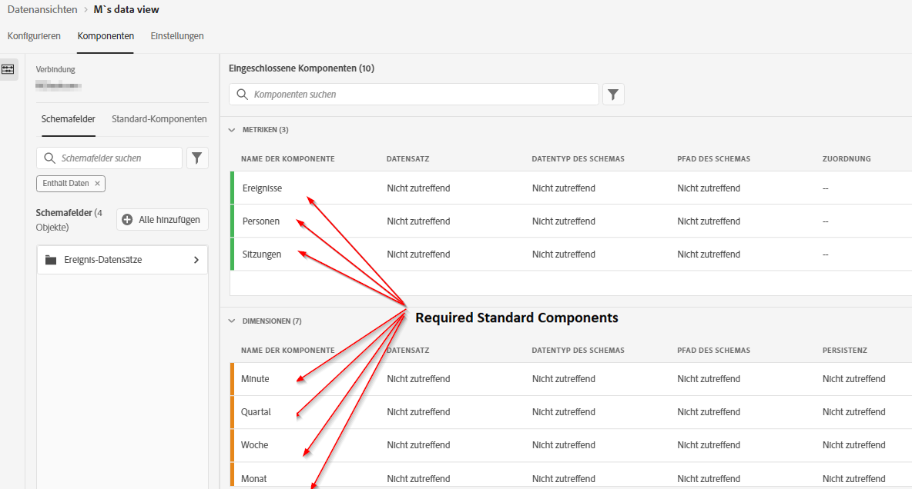
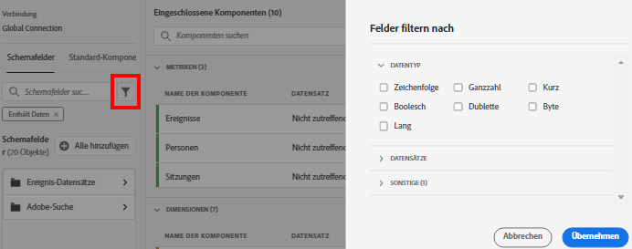
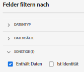

# Neue Ansicht erstellen

>[!IMPORTANT]
>
>Diese Funktion wird derzeit nur eingeschränkt getestet.

Das Erstellen einer Ansicht umfasst entweder das Erstellen von Metriken und Dimensionen aus Schema-Elementen oder die Verwendung von Standardkomponenten. Die Erstellung von Metriken oder Dimensionen bietet Ihnen eine enorme Flexibilität. Bisher wurde davon ausgegangen, dass bei Datensätzen in Adobe Experience Platform Zeichenfolgenfelder als Dimensionen und numerische Felder als Metriken verwendet wurden. Um diese Felder zu ändern, mussten Sie Ihr Schema in Plattform bearbeiten. Die Benutzeroberfläche &quot;Ansichten&quot;ermöglicht jetzt eine [Freiformdefinition von Metriken und Dimensionen](/help/data-views/data-views.md).

## 1. Einstellungen und Container für Data Ansichten konfigurieren

1. Gehen Sie in Customer Journey Analytics zur Registerkarte **[!UICONTROL Datenansichten]**.
2. Klicken Sie auf **[!UICONTROL Hinzufügen]**, um eine neue Data Ansicht zu erstellen und deren Einstellungen zu konfigurieren.

| Einstellung | Beschreibung/Verwendungsfall |
| --- | --- |
| [!UICONTROL Verbindung] | In diesem Feld wird die Ansicht der Daten mit der zuvor eingerichteten Verbindung verknüpft, die einen oder mehrere Adobe Experience Platform-Datensätze enthält. |
| [!UICONTROL Name] | Geben Sie der Datenansicht einen Namen. Dies ist ein Pflichtfeld. |
| [!UICONTROL Beschreibung] | Eine detaillierte Beschreibung ist nicht obligatorisch, wird jedoch empfohlen. |
| [!UICONTROL Zeitzone] | Wählen Sie die Zeitzone aus, in der Ihre Daten angezeigt werden sollen. |
| [!UICONTROL Tags] | Mit Tags können Sie Ihre Datenansichten in Kategorien organisieren. |
| [!UICONTROL Behälter] | Sie können Ihre Container hier umbenennen und so werden sie in jedem Workspace-Projekt angezeigt, das auf dieser Ansicht basiert. Container werden in Filtern und Fallout/Fluss verwendet, um zu definieren, wie breit oder schmal der Umfang oder Kontext ist. [Weitere Infos](https://experienceleague.adobe.com/docs/analytics-platform/using/cja-components/cja-filters/filters-overview.html?lang=en#filter-containers) |
| [!UICONTROL Name des Containers...] | [!UICONTROL Person]  (Standard). Der Container [!UICONTROL Person] enthält alle Besuche und Ansichten für Besucher innerhalb eines bestimmten Zeitraums. Sie können diesen Begriff in &quot;Benutzer&quot;oder einen anderen von Ihnen bevorzugten Begriff umbenennen. |
| [!UICONTROL Der Name des Session Containers lautet...] | [!UICONTROL Sitzung]  (Standard). Mit dem Container [!UICONTROL Sitzung] können Sie Seiteninteraktionen, Kampagnen oder Konversionen für eine bestimmte Sitzung identifizieren. Sie können diesen Begriff in &quot;Besuch&quot;oder einen anderen von Ihnen bevorzugten Begriff umbenennen. |
| [!UICONTROL Ereignis Container name ist...] | [!UICONTROL Ereignis]  (Standard). Der Container [!UICONTROL Ereignis] definiert, welche Ereignis von Seiten Sie in einen Filter einbeziehen oder ausschließen möchten. |

Als Nächstes können Sie Metriken und Dimensionen aus Schema-Elementen erstellen. Sie können auch Standardkomponenten verwenden.

## 2. Erstellen von Metriken und Dimensionen aus Schema-Elementen

1. Klicken Sie unter [!UICONTROL Customer Journey Analytics] > [!UICONTROL Data Ansichten] auf die Registerkarte [!UICONTROL Komponenten].

Links oben sehen Sie die [!UICONTROL Verbindung], die die Datensätze und die [!UICONTROL Schema-Felder] enthält.

1. Ziehen Sie nun ein Schema, z. B. [!UICONTROL pageTitle], aus der linken Leiste in den Bereich Metriken oder Dimensionen.

   Sie können dasselbe Schema mehrmals in die Dimensionen oder Metrikabschnitte ziehen und dieselbe Dimension oder Metrik auf unterschiedliche Weise konfigurieren. Beispielsweise können Sie im Feld **[!UICONTROL pageTitle]** eine Dimension namens &quot;Produktseiten&quot;und eine weitere Dimension &quot;Fehlerseiten&quot;erstellen usw. von **[!UICONTROL pageTitle]**; können Sie auch Metriken aus einem Zeichenfolgenwert erstellen. Sie können beispielsweise eine oder mehrere **[!UICONTROL Bestellungen]** Metriken mit unterschiedlichen Zuordnungseinstellungen und unterschiedlichen Ein-/Ausschlusswerten erstellen.

   

   >[!NOTE]
   >
   >Sie können ganze Schema-Feldordner aus der linken Leiste ziehen und sie werden automatisch in herkömmliche Bereiche sortiert. Die Zeichenfolgenfelder werden im Abschnitt [!UICONTROL Dimensionen] und die Zahlen im Abschnitt [!UICONTROL Metriken] angezeigt. Sie können auch auf **[!UICONTROL Hinzufügen alle]** klicken und alle Schema-Felder werden hinzugefügt.

1. Nachdem Sie die Komponente ausgewählt haben, werden auf der rechten Seite eine Reihe von Einstellungen angezeigt. Konfigurieren Sie die Komponente mithilfe der unten beschriebenen Einstellungen.

### Komponenteneinstellungen konfigurieren

| Einstellung | Beschreibung/Verwendungsfall |
| --- | --- |
| [!UICONTROL Typ der Komponente] | Erforderlich. Ermöglicht es Ihnen, eine Komponente von Metrik in Dimension zu ändern oder umgekehrt. |
| [!UICONTROL Komponentenname] | Erforderlich. Hier können Sie den Anzeigenamen angeben, der in Analysis Workspace angezeigt wird. Sie können eine Komponente umbenennen, um ihr einen datenspezifischen Ansichten-spezifischen Namen zu geben. |
| [!UICONTROL Beschreibung] | Optional, aber empfohlen, um Informationen über die Komponente für andere Benutzer bereitzustellen. |
| [!UICONTROL Tags] | Optional. Ermöglicht das Taggen der Komponente mit benutzerdefinierten oder vordefinierten Tags zur einfacheren Suche/Filterung in der Analysis Workspace-Benutzeroberfläche. |
| [!UICONTROL Feldname] | Der Name des Schema-Felds. |
| [!UICONTROL Typ des Datensatzes] | Erforderlich. Ein nicht bearbeitbares Feld, das anzeigt, von welchem Datensatztyp (Ereignis, Suche oder Profil) die Komponente stammt. |
| [!UICONTROL Datensatz] | Erforderlich. Ein nicht bearbeitbares Feld, das anzeigt, von welchem Feldtyp die Komponente stammt (z. B. String, Integer usw.). Dieses Feld kann mehrere Datensätze enthalten, z. B. wenn Sie mehrere Report Suites kombinieren. |
| [!UICONTROL Typ des Schemas] | Gibt an, ob es sich bei der Komponente um eine Zeichenfolge, eine Ganzzahl usw. handelt. |
| [!UICONTROL Komponenten-ID] | Erforderlich. Die [CJA-API](https://adobe.io/cja-apis/docs) verwendet dieses Feld, um auf die Komponente zu verweisen. Sie können auf das Bearbeitungssymbol klicken und diese Komponenten-ID ändern. Wenn Sie diese Komponenten-ID ändern, werden jedoch alle vorhandenen Workspace-Projekte, die diese Komponente enthalten, umgangen. Wenn Sie jemals eine andere Datenfelddimension erstellen, die ein anderes Ansicht für eine pageTitle-Dimension verwendet, können Sie diese umbenennen und die Ansicht der Dimension für Datenübergreifende Inhalte kompatibel machen. |
| [!UICONTROL Path] | Erforderlich. Ein nicht bearbeitbares Feld, das den Schema-Pfad anzeigt, von dem die Komponente stammt. |
| [!UICONTROL Komponente in Reports verbergen] | Standard = aus. Ermöglicht das Kuratieren der Komponente aus der Data-Ansicht, wenn sie in Berichte verwendet wird. Dies wirkt sich nicht auf Berechtigungen aus, sondern nur auf die Kuratierung von Komponenten. Mit anderen Worten, Sie können die Komponente in Berichte vor Nicht-Admins ausblenden. Administratoren können weiterhin darauf zugreifen, indem sie in einem Analysis Workspace-Projekt auf [!UICONTROL Alle Komponenten anzeigen] klicken. |

### Formateinstellungen konfigurieren

Die Formateinstellungen gelten nur für Metriken.

| Einstellung | Beschreibung/Verwendungsfall |
| --- | --- |
| [!UICONTROL Format] | Hier können Sie die Formatierung einer Metrik als Dezimal, Zeit, Prozent oder Währung angeben. |
| [!UICONTROL Dezimalstellen] | Hier können Sie die Anzahl der Dezimalstellen angeben, die eine Metrik anzeigen soll. |
| [!UICONTROL Aufwärts-Trend anzeigen als] | Hier können Sie angeben, ob ein Aufwärtstrend bei dieser Metrik als gut (grün) oder schlecht (rot) zu betrachten ist. |
| [!UICONTROL Währung] | Diese Einstellung wird nur angezeigt, wenn das ausgewählte Metrikformat [!UICONTROL Währung] lautet. Es steht eine Liste von Währungsoptionen zur Verfügung. Der Standardwert ist keine Währung. Auf diese Weise können Sie den Umsatz in der Währung Ihrer Wahl im Berichte darstellen. Dies ist keine Währungskonvertierung, sondern nur eine Formatierungsoption der Benutzeroberfläche. |

### Konfigurieren der Zuordnungseinstellungen

| Einstellung | Beschreibung/Verwendungsfall |
| --- | --- |
| [!UICONTROL Attribution festlegen] | Hier können Sie die Zuordnungseinstellungen angeben, die Sie bei Verwendung dieser Metrik standardmäßig anwenden möchten. Dieser Standard kann in einer Freiformtabelle oder in einer berechneten Metrik überschrieben werden. |
| [!UICONTROL Attributionsmodell] | Ermöglicht die Angabe eines Standardzuordnungsmodells - nur aktiv, wenn Sie die Einstellung [!UICONTROL Nicht standardmäßiges Zuordnungsmodell verwenden] aktivieren. Die Standardeinstellung ist [!UICONTROL Letztkontakt]. Die Optionen sind: Last Touch, First Touch, Linear, Participation, Same Touch, U-Shaped, J Curve, Inverse J, Time Decay, Custom, Algorithmic. Einige dieser Optionen erstellen zusätzliche Felder, die ausgefüllt werden müssen, z. B. &quot;Benutzerdefiniert&quot;oder &quot;Zeitraum&quot;. Sie können mehrere Metriken mit demselben Feld erstellen. Dies bedeutet, dass Sie eine [!UICONTROL Last touch] Umsatzmetrik und eine [!UICONTROL First Touch] Umsatzmetrik haben können, die jedoch auf demselben Umsatzfeld im Schema basiert. |
| [!UICONTROL Lookback-Fenster] | Ermöglicht die Angabe eines standardmäßigen Lookback-Fensters für eine Metrik - nur aktiv, wenn Sie die Einstellung [!UICONTROL Nicht standardmäßiges Zuordnungsmodell verwenden] aktivieren. Die Optionen sind: Person (Berichte-Fenster), Sitzung, Benutzerdefiniert. Wenn &quot;Benutzerdefiniert&quot;ausgewählt ist, können Sie auch eine beliebige Anzahl von Tagen/Wochen/Monaten/usw. auswählen. (bis zu 90 Tage), genau wie Attribution IQ. Sie können über mehrere Metriken verfügen, die dasselbe Schema verwenden, jedoch jeweils ein separates Lookback-Fenster. |

### Einstellungen zum Einschließen/Ausschließen von Werten konfigurieren

Mit dieser Einstellung können Sie die zugrunde liegenden Daten, auf denen Sie Berichte sind, zur Abfrage ändern. Es ist nicht dasselbe wie ein Filter (früher Segment genannt). Aber Filter werden diese neue Dimension respektieren, ebenso wie Pfade und Zuordnungen.

Sie können beispielsweise eine Dimension aus dem Feld &quot;pageTitle&quot;erstellen, sie aber als &quot;Fehlerseiten&quot;bezeichnen und jede Seite einschließen, die [!UICONTROL die Wortgruppe] &quot;error&quot;enthält.

| Einstellung | Beschreibung/Verwendungsfall |
| --- | --- |
| [!UICONTROL Von Schreibweise abhängig] | Standard = Ein. Diese Einstellung unterscheidet sich geringfügig von Dimensionen im Vergleich zu Metriken.<ul><li>**Metrik**: Diese Einstellung gilt nur für die  [!UICONTROL Option ] &quot;Wert einschließen/ausschließen&quot;. Damit können Sie angeben, ob beim Filter, den Sie anwenden, die Groß-/Kleinschreibung beachtet werden soll.</li><li>**Dimension** : Diese Einstellung bestimmt, ob die Daten in dieser Dimension in einer Weise aggregiert werden sollen, bei der zwischen Groß- und Kleinschreibung unterschieden wird. Dadurch wird die Ausführung von Berichten/Filtern/Zuordnungseinstellungen für ein Zeichenfolgenfeld geändert.</li></ul> |
| [!UICONTROL Übereinstimmung] | Hier können Sie angeben, welche Werte Sie vor der Zuordnung und Segmentierung für den Berichte berücksichtigen möchten (z. B. nur Werte mit der Wortgruppe &quot;error&quot;). Sie können Folgendes angeben: **[!UICONTROL Wenn alle Kriterien erfüllt sind]** oder **[!UICONTROL Wenn ein Kriterium erfüllt ist]**. |
| [!UICONTROL Kriterien] | Hier können Sie die Übereinstimmungslogik angeben, die auf eine bestimmte Filterregel angewendet werden soll.<ul><li>**Zeichenfolge**: Enthält die Wortgruppe, Enthält einen Begriff, enthält alle Begriffe, enthält keinen Begriff, enthält nicht die Wortgruppe, Ist gleich, Ist nicht gleich, Beginn mit, endet mit</li><li>**Dublette/Ganzzahl**: gleich, ungleich, größer als, kleiner als, größer gleich oder gleich, kleiner gleich oder gleich</li><li>**Datum**: gleich, ungleich, ist später als, liegt vor, tritt innerhalb von</li></ul> |
| [!UICONTROL Übereinstimmungs-Operand] | Hiermit können Sie den Übereinstimmungs-Operanden angeben, auf den der Übereinstimmungsoperator angewendet werden soll.<ul><li>**Zeichenfolge**: Textfeld</li><li>**Dublette/Ganzzahl**: Textfeld mit Nach-oben-/Nach-unten-Pfeilen für numerische Werte</li><li>**Datum**: Granularitätsauswahl Tag (Kalender)</li><li>**Datums-Zeit**: Auswahl der Datums- und Uhrzeitgranularität</li></ul> |
| [!UICONTROL Regel hinzufügen] | Hiermit können Sie einen zusätzlichen Übereinstimmungsoperator und -opern angeben. |

### Verhaltenseinstellungen konfigurieren

| Einstellung | Beschreibung/Verwendungsfall |
| --- | --- |
| [!UICONTROL Werte zählen] | Auf diese Weise können Sie eine Zählung der Häufigkeit erstellen, mit der ein boolesches Feld auf `true` gesetzt wurde; als Metrik. Beispielsweise ist die Anzahl der [!UICONTROL Ansichten], wobei für ein boolesches Feld mit dem Namen `isPage` `true` der Wert  festgelegt ist. |
| [!UICONTROL Instanzen zählen] | Hiermit können Sie festlegen, ob ein numerisches Feld oder ein Datumsfeld, das als Metrik verwendet wird, statt des Werts selbst gezählt werden soll, wie lange es festgelegt wurde.  Wenn Sie die Instanzen eines numerischen Felds hinzufügen möchten und einfach die Anzahl der  ** Einstellungen eines Felds anstatt des tatsächlichen Werts darin addieren möchten. Dies ist beispielsweise hilfreich, um eine   Bestellmetrik aus einem   Umsatzfeld zu erstellen. Wenn der Umsatz festgelegt wurde, sollten wir 1 einzelne Bestellung anstelle des numerischen Umsatzbetrags zählen. |

### Einstellungen für [!UICONTROL Keine Wertoptionen] konfigurieren

[!UICONTROL Keine ] Wertoptionen sind im Berichte identisch mit   Nicht festgelegten oder   Nicht-Werten. In der Benutzeroberfläche &quot;Ansichten&quot;können Sie für jede Komponente festlegen, wie diese Werte in Berichte behandelt werden sollen. Sie können [!UICONTROL Kein Wert] auch in etwas umbenennen, das Ihrer Umgebung besser entspricht, z. B. [!UICONTROL Null], [!UICONTROL Nicht festgelegt] oder andere.

>[!NOTE]
>
>Wenn Sie dieses Feld in einen benutzerdefinierten Wert ändern, wird der benutzerdefinierte Wert als legitimer Zeichenfolgenwert behandelt. Wenn Sie also den Wert &quot;Red&quot;in dieses Feld eingeben, werden alle Instanzen der Zeichenfolge &quot;Red&quot;in den Daten selbst ebenfalls unter dem von Ihnen angegebenen Zeileneintrag rollierend.

Beachten Sie außerdem, dass das, was Sie in diesem Feld angeben, für eine spezielle UI-Behandlung des Zeileneintrags [!UICONTROL Kein Wert] in Berichte verwendet werden kann, wie in der Einstellung [!UICONTROL Keine Wertoptionen] beschrieben.

| Einstellung | Beschreibung/Verwendungsfall |
| --- | --- |
| [!UICONTROL Wenn angezeigt, wird Kein Wert] aufgerufen... | Hier können Sie **[!UICONTROL Kein Wert]** in etwas Anderes umbenennen. |
| [!UICONTROL Kein Wert standardmäßig anzeigen] | Zeigt diesen Wert nicht in Berichte an. |
| [!UICONTROL Standardmäßig keinen Wert anzeigen] | Zeigt diesen Wert in Berichte an. |
| [!UICONTROL Kein Wert als Wert behandeln] | Wenn Sie beispielsweise Mobilgerätetypen als Dimension haben, können Sie das Element **[!UICONTROL Kein Wert]** in &quot;Desktop&quot;umbenennen. |

### Persistenzeinstellungen konfigurieren

Diese Einstellungen ähneln den eVar im herkömmlichen Adobe Analytics.

| Einstellung | Beschreibung/Verwendungsfall |
| --- | --- |
| [!UICONTROL Persistenz festlegen] | Schlüssel umschalten |
| [!UICONTROL Zuordnung] | Hier können Sie das Zuordnungsmodell angeben, das für eine Dimension für Persistenz verwendet wird. Die Optionen sind: Zuletzt verwendet: Original, Instanz, Alle. Wenn ein Wert beibehalten werden soll (ähnlich wie bei eVars in herkömmlichen Analytics), legen Sie ihn hier fest. Der einzige wichtige Unterschied besteht darin, dass die maximale Persistenz, die Sie einstellen können, 90 Tage beträgt. Außerdem ist [!UICONTROL Niemals ablaufen] keine Option. |
| [!UICONTROL Ablauf] | Hiermit können Sie das Persistenzfenster für eine Dimension angeben. Die Optionen sind: [!UICONTROL Sitzung] (Standard), [!UICONTROL Person], [!UICONTROL Zeit], [!UICONTROL Metrik]. Möglicherweise müssen Sie die Dimension bei einem Kauf ablaufen lassen (z. B. interne Suchbegriffe oder andere Merchandising-Verwendungsfälle).  Metriken, die Sie als Ablaufdatum für diese Dimension festlegen (z. B. eine   Kaufmetrik). |

### Einstellungen für die Wertberechnung konfigurieren

| Einstellung | Beschreibung/Verwendungsfall |
| --- | --- |
| [!UICONTROL Bucket-Wert] | Ermöglicht das Erstellen einer zusammengefassten Version einer numerischen Dimension. Auf diese Weise können Sie Berichte zu Umsatzbehältern oder anderen numerischen Werten als Dimension in Berichte erstellen. Sie können bis zu 5 Behälter erstellen. |
| [!UICONTROL Bis zu] | Hier können Sie die Grenzen des ersten numerischen Dimensionsbuckets angeben. Dies gilt nur für numerische Dimensionen. |
| [!UICONTROL Zwischen und bis] | Hier können Sie die Grenzen der nachfolgenden numerischen Dimensionsbehälter angeben. |
| [!UICONTROL Bucket hinzufügen] | Ermöglicht das Hinzufügen eines weiteren Behälters zum Bucket für numerische Dimensionen. |

### Verwenden Sie [!UICONTROL Standardkomponenten]

Neben der Erstellung von Metriken und Dimensionen aus Schema-Elementen können Sie auch Standardkomponenten in Ihren Daten-Ansichten verwenden.

[!UICONTROL Standardkomponenten ] sind Komponenten, die nicht aus Datenaset-Schema-Feldern generiert werden, sondern stattdessen vom System generiert werden. Einige Systemkomponenten sind in jeder Data Ansicht erforderlich, um die Funktionen des Berichte in Analysis Workspace zu erleichtern, andere Systemkomponenten sind optional.

Erforderliche Standardkomponenten

| Komponentenname | Dimension oder Metrik | Hinweise |
| --- | --- | --- |
| [!UICONTROL Personen] | Metrik | Zuvor in Analytics als [!UICONTROL Individuelle Besucher] bezeichnet. Diese Metrik basiert auf der in einer Verbindung angegebenen Person-ID. |
| [!UICONTROL Sitzungen] | Metrik | Früher in herkömmlicher Analytics als [!UICONTROL Besuche] bezeichnet. Diese Metrik basiert auf den unten angegebenen Sitzungseinstellungen. |
| [!UICONTROL Ereignisse] | Metrik | Früher in traditionellen Analytics als [!UICONTROL Vorfälle] bezeichnet. Diese Metrik stellt die Anzahl der Zeilen aus allen Ereignis-Datensätzen in einer Verbindung dar. |
| [!UICONTROL Tag] | Dimension |  |
| [!UICONTROL Woche] | Dimension |  |
| [!UICONTROL Monat] | Dimension |  |
| [!UICONTROL Quartal] | Dimension |  |
| [!UICONTROL Jahr] | Dimension |  |
| [!UICONTROL Stunde] | Dimension |  |
| [!UICONTROL Minute] | Dimension |  |

### Optionale Standardkomponenten

Einige Systemkomponenten sind in jeder Data-Ansicht erforderlich, um die Funktionen des Berichte in Analysis Workspace zu erleichtern, während die folgenden Komponenten optional sind.

| Komponentenname | Dimension oder Metrik | Hinweise |
| --- | --- | --- |
| [!UICONTROL Sitzung beginnt] | Metrik | Diese Metrik zählt die Anzahl der Ereignis, die das erste Ereignis einer Sitzung waren. Bei Verwendung in einer Filterdefinition (z. &#39;[!UICONTROL Session Beginns] existiert&quot;), wird nur das erste Ereignis jeder Sitzung Filter. Beachten Sie, dass sich dies von [!UICONTROL Einträge] unterscheidet, da es immer das erste Ereignis einer Sitzung zählt - nicht den ersten vorhandenen Wert für eine Dimension in einer Sitzung. |
| [!UICONTROL Sitzung endet] | Metrik | Diese Metrik zählt die Anzahl der Ereignis, die das letzte Ereignis einer Sitzung waren. Ähnlich wie [!UICONTROL Sitzungs-Beginn] kann es auch in einer Filterdefinition verwendet werden, um Dinge bis zum letzten Ereignis jeder Sitzung zu filtern. Beachten Sie, dass sich dies von [!UICONTROL Ausstiege] unterscheidet, da es immer das letzte Ereignis einer Sitzung zählt - nicht den letzten vorhandenen Wert für eine Dimension in einer Sitzung. |
| [!UICONTROL Aufgewendete Zeit (Sekunden)] | Metrik | Die Metrik [!UICONTROL Besuchszeit] funktioniert ähnlich wie im herkömmlichen Adobe Analytics - indem die Zeit zwischen zwei verschiedenen Werten für eine Dimension addiert wird. Mit den Metriken &quot;Sitzungsende&quot;und &quot;Sitzungsende&quot;können die Kunden jedoch die berechneten Metriken [!UICONTROL Besuchszeit pro Beginn] und [!UICONTROL Zeit pro Sitzung] selbst erstellen (siehe OTB-Filter und Berechnungsmetriken unten). |
| [!UICONTROL Aufgewendete Zeit pro Ereignis] | Dimension | Funktionell gesehen handelt es sich hier eigentlich nur um eine Zusammenfassung der oben genannten Metrik. Wir stellen Standardbehälter bereit, erlauben Ihnen aber, die Behälter zu ändern, was Sie wollen. |
| [!UICONTROL Aufgewendete Zeit pro Sitzung] | Dimension |  |
| [!UICONTROL Aufgewendete Zeit pro Person] | Dimension |  |
| [!UICONTROL Batch-ID] | Dimension |  |
| [!UICONTROL Datensatz-ID] | Dimension |  |

### Filtern von Schema-Feldern und Dimensionen/Metriken

Sie können die Schema-Felder in der linken Leiste nach folgenden Datentypen filtern:

Sie können auch nach Datensätzen und danach filtern, ob ein Schema Daten enthält oder ob es sich um eine Identität handelt:

## 3. hinzufügen einer globalen Ansicht

Sie können Filter (früher &quot;Segmente&quot;) hinzufügen, die für die gesamte Ansicht der Daten gelten, ähnlich der gefilterten Ansicht der Daten in Virtual Report Suites (traditionelles Adobe Analytics).

1. Klicken Sie auf die Registerkarte [!UICONTROL Settings] in [!UICONTROL Data Ansichten].
1. Ziehen Sie einen Filter aus der Liste in der linken Leiste in das Feld [!UICONTROL Hinzufügen Filter].