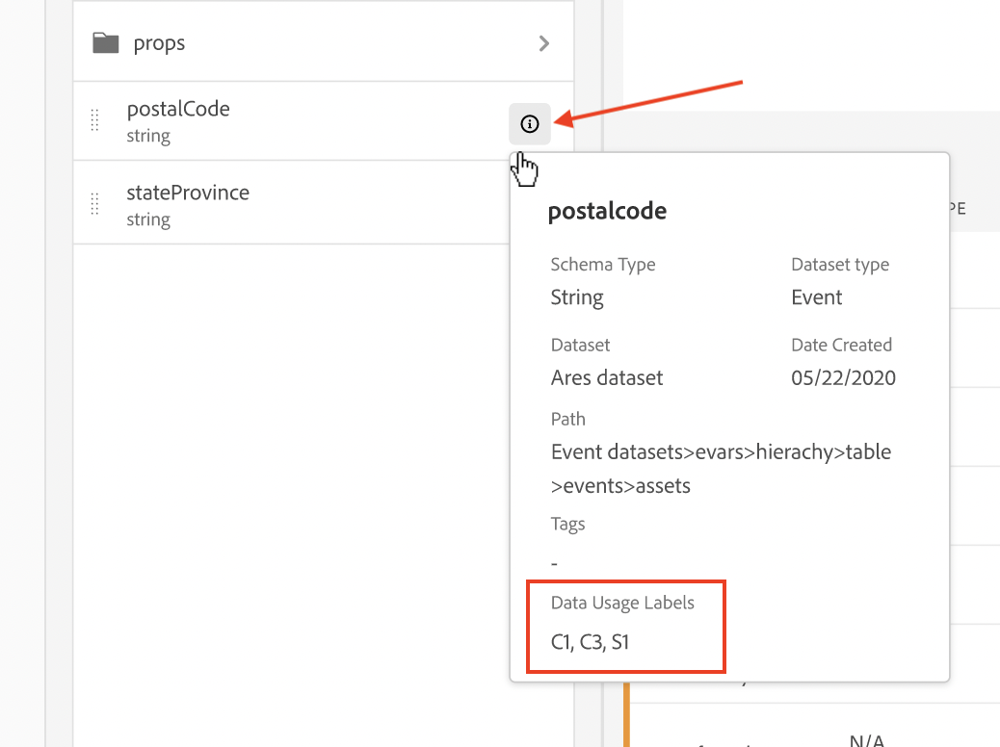

# Beschriftungen und Richtlinien

Wenn Sie einen Datensatz in Experience Platform erstellen, können Sie [Label zur Datennutzung](https://experienceleague.adobe.com/de/docs/experience-platform/data-governance/labels/reference) für einige oder alle Elemente im Datensatz erstellen. Sie können diese Beschriftungen und Richtlinien in Customer Journey Analytics anzeigen.

Die folgenden Beschriftungen sind für Customer Journey Analytics von besonderem Interesse:

* Die Beschriftung `C8` – **[!UICONTROL Keine Messung]**. Diese Beschriftung bedeutet, dass Daten nicht für Analysen auf den Websites oder in Anwendungen Ihres Unternehmens verwendet werden können.

* Das Label `C12` – **[!UICONTROL Kein allgemeiner Datenexport]**. Auf diese Weise gekennzeichnete Schemafelder können nicht aus CJA exportiert oder heruntergeladen werden (über Reporting, Export, API usw.)

>[!NOTE]
>
>Datennutzungskennzeichnungen werden nicht automatisch in zugeordnete Datensätze übertragen. Sie können jedoch manuell hinzugefügt werden.

Die Beschriftung an sich bedeutet nicht, dass diese Datennutzungskennzeichnungen erzwungen werden. Dafür werden Richtlinien verwendet. Sie erstellen Ihre Richtlinien mithilfe der [Experience Platform-Benutzeroberfläche](https://experienceleague.adobe.com/de/docs/experience-platform/data-governance/policies/user-guide) oder über die [Richtlinien-Service-API](https://experienceleague.adobe.com/de/docs/experience-platform/data-governance/api/overview) in Experience Platform.

Unter Experience Platform sind zwei von Adobe definierte Richtlinien verfügbar, die sich auf Customer Journey Analytics auswirken und Berichte und Datenexporte beeinflussen können:

* Die Richtlinie **[!UICONTROL Nutzungsanalyse und benutzerbasierte Messung beschränken]** mit dem Label `C8` und
* die Richtlinie **[!UICONTROL Datenexport beschränken]** mit dem Label `C12`.

## Anzeigen von Daten-Labeln in Datenansichten von Customer Journey Analytics

Daten-Label, die von Ihnen oder anderen Benutzenden in Experience Platform erstellt wurden, werden an drei Stellen in der Benutzeroberfläche der Datenansichten angezeigt:

| Standort | Beschreibung |
| --- | --- |
| Informationsschaltfläche in einem Schemafeld | Durch Klicken auf diese Schaltfläche wird angegeben, welche [!UICONTROL Datennutzungsbezeichnungen] derzeit auf ein Feld angewendet werden:
 |
| Rechte Leiste unter [Komponenteneinstellungen](/help/data-views/component-settings/overview.md) | Alle [!UICONTROL Datennutzungsbezeichnungen] sind hier aufgeführt:
 |
| Hinzufügen von Datenbeschriftungen als Spalte | Sie können [!UICONTROL Datennutzungsbezeichnungen] als Spalte zu den [!UICONTROL Enthaltene Komponenten] Spalten in Datenansichten hinzufügen. Klicken Sie einfach auf das Symbol für die Spaltenauswahl und wählen Sie **[!UICONTROL Labels zur Datennutzung]** aus:
 |

{style="table-layout:auto"}

## Filtern nach Data-Governance-Labels in Datenansichten

Wählen Sie im Editor für Datenansichten das Symbol [!UICONTROL Filter] in der linken Spur aus und filtern Sie die Komponenten der Datenansichten nach **[!UICONTROL Data Governance]** und dem Typ der **[!UICONTROL Label]**:

Klicken **[!UICONTROL Anwenden]**, um zu sehen, an welche Komponenten Beschriftungen angehängt sind.

## Filtern nach Data Governance-Richtlinien in Datenansichten

Sie können überprüfen, ob eine Richtlinie (z. B. eine von Ihnen erstellte Richtlinie mit dem Namen **[!UICONTROL Analytics erzwingen]**) aktiviert ist. Außerdem können Sie überprüfen, ob diese Richtlinie die Verwendung bestimmter Datenansichtselemente von Customer Journey Analytics für Analysen oder Datenexporte blockiert.

Wählen Sie erneut das [!UICONTROL Filtersymbol] in der linken Leiste aus und klicken Sie unter **[!UICONTROL Data Governance]** auf **[!UICONTROL Richtlinien]**:

Klicken Sie auf **[!UICONTROL Anwenden]**, um zu sehen, welche Richtlinien aktiviert sind.

## Wie sich aktivierte Richtlinien auf Datenansichten auswirken

Wenn eine oder mehrere Richtlinien mit C8- oder C12-Labeln aktiviert sind, können Schemakomponenten, auf die bestimmte Daten-Label angewendet wurden, nicht zu Datenansichten hinzugefügt werden.

Diese Komponenten sind in der Liste [!UICONTROL Schemafelder] in der linken Leiste ausgegraut:

Sie können auch keine Datensicht speichern, die gesperrte Felder enthält.

Seien Sie vorsichtig, wenn Sie versuchen, Zugriffs- und-Data Governance-Labels (über Richtlinien) in Experience Platform auf Felder oder Feldergruppen anzuwenden, für die Sie in Ihrer Datenansicht bereits Komponenten definiert haben. Möglicherweise wird dieses Dialogfeld angezeigt.

Sie müssen zunächst den Verstoß beheben (z. B. die Komponenten aus der Datenansicht entfernen).

>[!MORELIKETHIS]
>
>[Herunterladen sensibler Daten](/help/analysis-workspace/export/download-send.md)

>[!MORELIKETHIS]
>
>[Was sind eingeschränkte Beschriftungen in Report Builder?](https://experienceleague.adobe.com/de/docs/analytics-platform/using/cja-reportbuilder/restricted-labels)

