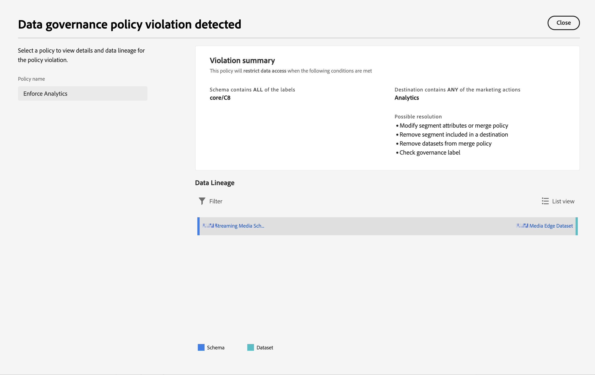

# Beschriftungen und Richtlinien

Wenn Sie einen Datensatz in Experience Platform erstellen, können Sie [Datennutzungsbezeichnungen](https://experienceleague.adobe.com/en/docs/experience-platform/data-governance/labels/reference) für einige oder alle Elemente im Datensatz. Sie können diese Beschriftungen und Richtlinien in Customer Journey Analytics anzeigen.

Die folgenden Beschriftungen sind für Customer Journey Analytics von besonderem Interesse:

* Die Beschriftung `C8` – **[!UICONTROL Keine Messung]**. Diese Beschriftung bedeutet, dass Daten nicht für Analysen auf den Websites oder in Anwendungen Ihres Unternehmens verwendet werden können.

* Die `C12` label - **[!UICONTROL Kein allgemeiner Datenexport]**. Auf diese Weise gekennzeichnete Schemafelder können nicht aus CJA exportiert oder heruntergeladen werden (über Reporting, Export, API usw.)

>[!NOTE]
>
>Datennutzungskennzeichnungen werden nicht automatisch in zugeordnete Datensätze übertragen. Sie können jedoch manuell hinzugefügt werden.

Die Beschriftung an sich bedeutet nicht, dass diese Datennutzungskennzeichnungen erzwungen werden. Dafür werden Richtlinien verwendet. Sie können Ihre Richtlinien mit dem [Experience Platform-Benutzeroberfläche](https://experienceleague.adobe.com/en/docs/experience-platform/data-governance/policies/user-guide) oder über die [Policy Service-API](https://experienceleague.adobe.com/en/docs/experience-platform/data-governance/api/overview) in Experience Platform.

Unter Experience Platform sind zwei Adobe definierte Richtlinien verfügbar, die sich auf Customer Journey Analytics auswirken und Berichte und Datenexporte beeinflussen können:

* **[!UICONTROL Nutzungsanalyse und benutzerbasierte Messung beschränken]** -Richtlinie mithilfe der `C8` Beschriftung und
* **[!UICONTROL Datenexport beschränken]** -Richtlinie mithilfe der `C12` Beschriftung.

## Anzeigen von Datenbeschriftungen in Datenansichten von Customer Journey Analytics

Datenbeschriftungen, die Sie oder andere Benutzer unter Experience Platform erstellt haben, werden an drei Stellen in der Benutzeroberfläche &quot;Datenansichten&quot;angezeigt:

| Standort | Beschreibung |
| --- | --- |
| Informationsschaltfläche in einem Schemafeld | Durch Klicken auf diese Schaltfläche wird angegeben, welche [!UICONTROL Datennutzungsbezeichnungen] derzeit auf ein Feld angewendet werden:
 |
| Rechte Leiste unter [Komponenteneinstellungen](/help/data-views/component-settings/overview.md) | Alle [!UICONTROL Datennutzungsbezeichnungen] sind hier aufgeführt:
 |
| Hinzufügen von Datenbeschriftungen als Spalte | Sie können [!UICONTROL Datennutzungsbezeichnungen] als Spalte zu den [!UICONTROL Enthaltene Komponenten] Spalten in Datenansichten hinzufügen. Wählen Sie einfach das Symbol für die Spaltenauswahl aus und wählen Sie **[!UICONTROL Datennutzungsbezeichnungen]**:
 |

{style="table-layout:auto"}

## Filtern nach Data Governance-Beschriftungen in Datenansichten

Wählen Sie im Datenansichtseditor die [!UICONTROL filter] Symbol im linken Pfad und Filtern Sie die Datenansichtskomponenten nach **[!UICONTROL Data Governance]** und Art der **[!UICONTROL Titel]**:

Klicken **[!UICONTROL Anwenden]**, um zu sehen, an welche Komponenten Beschriftungen angehängt sind.

## Filtern nach Data Governance-Richtlinien in Datenansichten

Sie können überprüfen, ob eine Richtlinie (z. B. eine von Ihnen erstellte Richtlinie mit dem Namen **[!UICONTROL Analytics erzwingen]**) aktiviert ist. Und ob diese Richtlinie die Verwendung bestimmter Customer Journey Analytics-Datenansichtselemente für Analysen oder Datenexporte blockiert.

Wählen Sie erneut die [!UICONTROL filter] Symbol in der linken Leiste und unter **[!UICONTROL Data Governance]** auswählen **[!UICONTROL Richtlinien]**:

Klicks **[!UICONTROL Anwenden]** , um zu sehen, welche Richtlinien aktiviert sind.

## Wie sich aktivierte Richtlinien auf Datenansichten auswirken

Wenn eine oder mehrere Richtlinien mit C8- oder C12-Beschriftungen aktiviert sind, können Schemakomponenten, auf die bestimmte Datenbezeichnungen angewendet wurden, nicht zu Datenansichten hinzugefügt werden.

Diese Komponenten sind in der linken Leiste grau dargestellt [!UICONTROL Schemafelder] list:

Sie können auch keine Datensicht speichern, die gesperrte Felder enthält.

Seien Sie vorsichtig, wenn Sie versuchen, Zugriffs- und Data Governance-Beschriftungen (über Richtlinien) auf Felder oder Feldergruppen in Experience Platform anzuwenden, für die Sie in Ihrer Datenansicht bereits Komponenten definiert haben. Möglicherweise wird dieses Dialogfeld angezeigt.

Sie müssen zunächst den Verstoß beheben (z. B. die Komponenten aus der Datenansicht entfernen).

>[!MORELIKETHIS]
>
>[Herunterladen sensibler Daten](/help/analysis-workspace/export/download-send.md)

>[!MORELIKETHIS]
>
>[Was sind eingeschränkte Beschriftungen in Report Builder?](https://experienceleague.adobe.com/en/docs/analytics-platform/using/cja-reportbuilder/restricted-labels)

