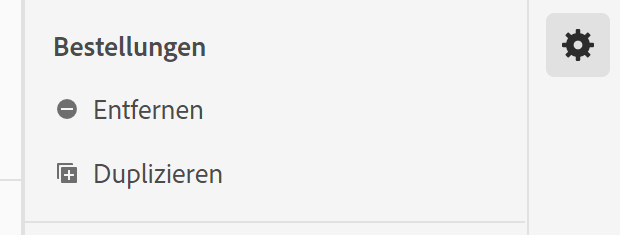

# Anwendungsfälle von Datenansichten

Diese Anwendungsfälle zeigen die Flexibilität und Leistungsfähigkeit von Datenansichten in Customer Journey Analytics.

## 1. Erstellen Sie eine Metrik für Bestellungen aus einem Schema-Feld &quot;pageTitle&quot;(Zeichenfolge)

Wenn Sie beispielsweise eine Datenansicht erstellen, können Sie eine Metrik [!UICONTROL Bestellungen] aus einem Schemafeld [!UICONTROL pageTitle] erstellen, das eine Zeichenfolge ist. Hierzu sind folgende Schritte notwendig:

1. Ziehen Sie auf der Registerkarte „Komponenten“ den Abschnitt [!UICONTROL pageTitle] in den Abschnitt [!UICONTROL Metriken] unter [!UICONTROL Eingeschlossene Komponenten].
   
1. Markieren Sie nun die Metrik, die Sie gerade in den Bereich gezogen haben, und benennen Sie sie unter [!UICONTROL Komponenteneinstellungen] auf der rechten Seite um:
   
1. Öffnen Sie das Dialogfeld [!UICONTROL Werte einschließen/ausschließen] auf der rechten Seite und geben Sie Folgendes an:
   

   Der Zusatz „Bestätigung“ gibt an, dass es sich um eine Bestellung handelt. Nach Überprüfung aller Seitentitel, bei denen diese Kriterien erfüllt sind, wird für jede Instanz „1“ gezählt. Das Ergebnis ist eine neue Metrik (keine berechnete Metrik). Eine Metrik mit eingeschlossenen/ausgeschlossenen Werten kann überall dort verwendet werden, wo auch jede andere Metrik eingesetzt werden kann. Sie funktioniert mit Attribution IQ, Filtern und überall sonst, wo Sie Standardmetriken verwenden können.
1. Sie können darüber hinaus ein Zuordnungsmodell für diese Metrik angeben, beispielsweise [!UICONTROL Letztkontakt] mit einem [!UICONTROL Lookback-Fenster] von [!UICONTROL Sitzung].
Sie können auch eine weitere Metrik [!UICONTROL Bestellungen] aus demselben Feld erstellen und dafür ein anderes Zuordnungsmodell festlegen, beispielsweise [!UICONTROL Erstkontakt], und ein anderes [!UICONTROL Lookback-Fenster], beispielsweise [!UICONTROL 30 Tage].

## 2. Verwenden Sie Ganzzahlen als Dimensionen

Zuvor wurden Ganzzahlen in Customer Journey Analytics automatisch als Metriken behandelt. Jetzt können numerische Zeichen (einschließlich benutzerdefinierter Ereignisse aus Adobe Analytics) als Dimensionen behandelt werden. Siehe folgendes Beispiel:

1. Ziehen Sie die Ganzzahl [!UICONTROL call_length_min] in den Abschnitt [!UICONTROL Dimensionen] unter [!UICONTROL Eingeschlossene Komponenten]:

   

1. Sie können jetzt [!UICONTROL Wertgruppierung] hinzufügen, um diese Dimension in Berichten in zusammengefasster Form darzustellen. (Ohne Gruppierung würde jede Instanz dieser Dimension als Zeilenelement im Workspace-Reporting angezeigt.)

   

## 3. Numerische Dimensionen als &quot;Metriken&quot;in Flussdiagrammen verwenden

Sie können eine numerische Dimension verwenden, um &quot;Metriken&quot;in Ihre [!UICONTROL  Fluss] -Visualisierung zu übertragen.

1. Ziehen Sie auf der Registerkarte Datenansichten [Komponenten](https://experienceleague.adobe.com/docs/analytics-platform/using/cja-dataviews/create-dataview.html?lang=en#configure-component-settings) das Schemafeld [!UICONTROL Marketing-Kanäle] in den Bereich [!UICONTROL Metriken] unter [!UICONTROL Eingeschlossene Komponenten].
2. In Workspace-Berichten zeigt dieser Fluss [!UICONTROL Marketing-Kanäle], die in [!UICONTROL Bestellungen] fließen:

## 4. Unterereignisfilterung durchführen

Sie können Ereignisse so filtern, dass nur das angezeigt wird, was Sie sehen möchten. Verwenden Sie beispielsweise die Ein-/Ausschlussfunktion in Datenansichten , um sich nur auf Produkte zu konzentrieren, die einen Umsatz von mehr als 50 Dollar generierten. Wenn Sie also eine Bestellung haben, die einen 50-Dollar-Produktkauf und einen 25-Dollar-Produktkauf beinhaltet, würden wir nur den 25-Dollar-Produktkauf entfernen, nicht die gesamte Bestellung.

1. Ziehen Sie auf der Registerkarte Datenansichten [Komponenten](https://experienceleague.adobe.com/docs/analytics-platform/using/cja-dataviews/create-dataview.html?lang=en#configure-component-settings) das Schema [!UICONTROL Umsatz] in den Bereich [!UICONTROL Metriken] unter [!UICONTROL Eingeschlossene Komponenten].
1. Wählen Sie die Metrik aus und konfigurieren Sie rechts Folgendes:
a. Wählen Sie unter [!UICONTROL Format] [!UICONTROL Währung] aus.
b. Wählen Sie unter [!UICONTROL Currency] die Option USD aus.
c. Aktivieren Sie unter [!UICONTROL Werte einschließen/ausschließen] das Kontrollkästchen neben [!UICONTROL Ein-/Ausschlusswerte festlegen].
d. Wählen Sie unter [!UICONTROL Match] [!UICONTROL Wenn alle Kriterien erfüllt sind].
e. Wählen Sie unter [!UICONTROL Kriterien] [!UICONTROL ist größer oder gleich] aus.
f. Geben Sie &quot;50&quot;als Wert an.

Mit diesen neuen Einstellungen können Sie nur hochwertige Umsätze anzeigen und alles unter 50 Euro herausfiltern.

## 5. Verwenden Sie die Einstellung [!UICONTROL Keine Wertoptionen] .

Möglicherweise hat Ihr Unternehmen Zeit damit verbracht, Ihre Benutzer in Berichten mit &quot;Nicht angegeben&quot;zu vertraut zu machen. Der Standardwert in Datenansichten ist &quot;Kein Wert&quot;. Sie können in der Benutzeroberfläche für Datenansichten jetzt [&quot;Kein Wert&quot;in &quot;Nicht angegeben&quot;](https://experienceleague.adobe.com/docs/analytics-platform/using/cja-dataviews/create-dataview.html?lang=en#configure-no-value-options-settings) umbenennen.

## 6. Verwenden Sie die Funktion [!UICONTROL Duplizieren] .

Das Duplizieren einer Metrik und anschließende Ändern spezifischer Einstellungen ist eine einfache Möglichkeit, mehrere Metriken oder Dimensionen aus einem einzelnen Schemafeld zu erstellen.

Wählen Sie einfach die Einstellung Duplizieren unter dem Namen der Metrik oder Dimensionen oben rechts aus:

## Erstellen mehrerer Metriken mit unterschiedlichen Attributionseinstellungen

Erstellen Sie mit der oben erwähnten Funktion [!UICONTROL Duplizieren] eine Reihe von Umsatzmetriken mit verschiedenen Attributionseinstellungen wie [!UICONTROL Erstkontakt], [!UICONTROL Letztkontakt] und [!UICONTROL Algorithmus].

Vergessen Sie nicht, jede Metrik umzubenennen, um die Unterschiede widerzuspiegeln, z. B. &quot;Algorithmischer Umsatz&quot;:

Weitere Informationen zu anderen Datenansicht-Einstellungen finden Sie unter [Erstellen von Datenansichten](/help/data-views/create-dataview.md).
Eine konzeptionelle Übersicht über die Datenansichten finden Sie unter [Übersicht über Datenansichten](/help/data-views/data-views.md).