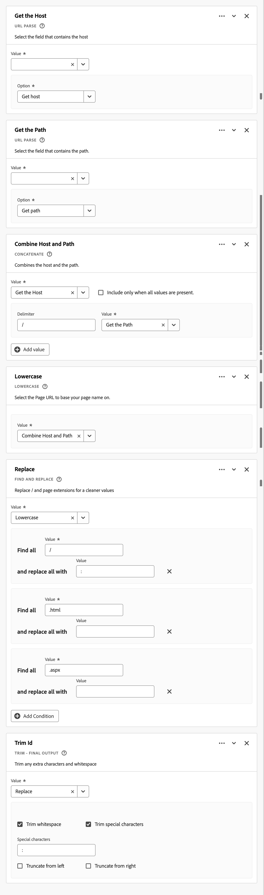
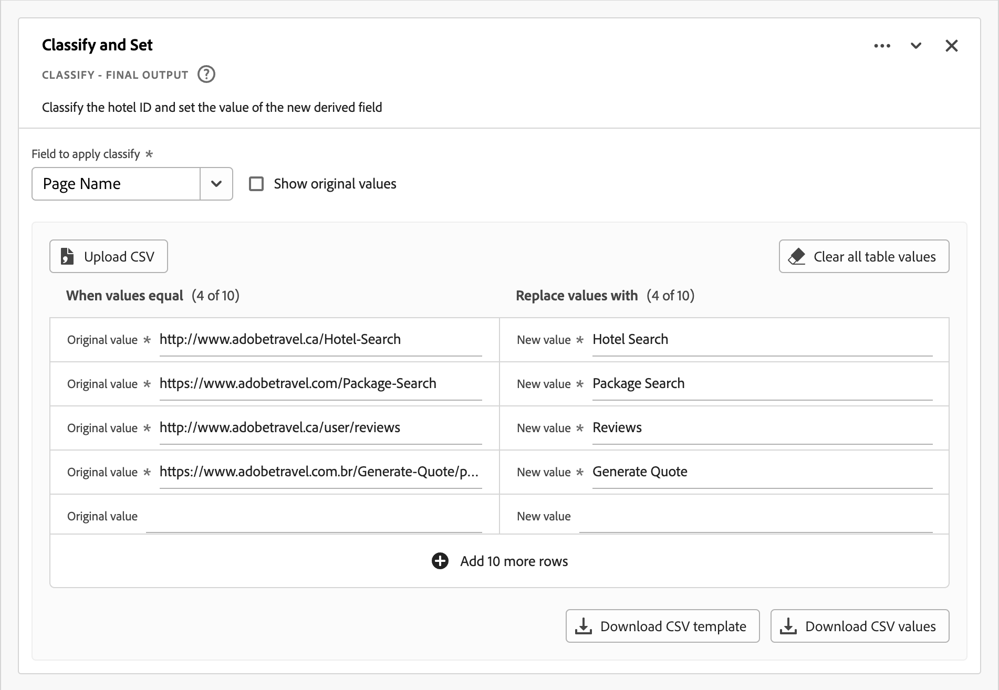
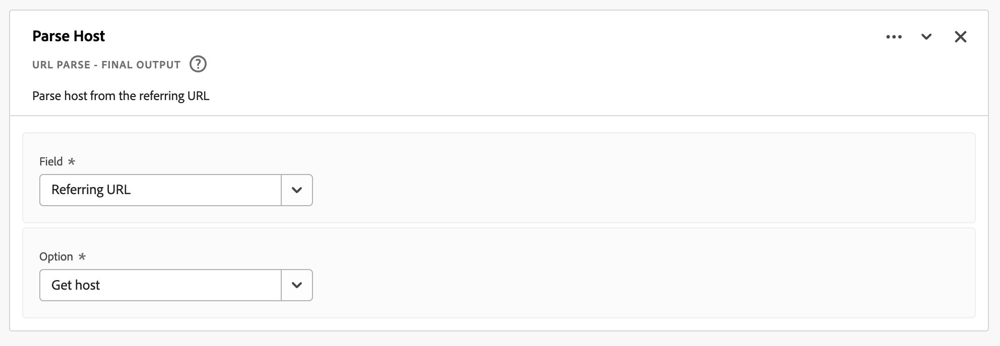

# Abgeleitete Felder {#derived-fields}

<!-- markdownlint-disable MD034 -->

>[!CONTEXTUALHELP]
>id="cja_dataview_derivedfields"
>title="Abgeleitete Felder"
>abstract="Mit einem abgeleiteten Feld können Datenmanipulationen direkt über einen anpassbaren Regelgenerator definiert werden. Dieses abgeleitete Feld kann dann als Komponente (Metrik oder Dimension) im Arbeitsbereich verwendet oder weiterdefiniert und als Komponente in der Datenansicht eingesetzt werden."

<!-- markdownlint-enable MD034 -->

Abgeleitete Felder sind ein wichtiger Aspekt der Echtzeitberichterstellungsfunktion in Adobe Customer Journey Analytics. Mit einem abgeleiteten Feld können Sie mithilfe eines anpassbaren Regel-Builders spontan (häufig komplexe) Datenmanipulationen definieren. Anschließend können Sie dieses abgeleitete Feld als Komponente (Metrik oder Dimension) in [Workspace](../../analysis-workspace/home.md) verwenden oder das abgeleitete Feld als Komponente in der [Datenansicht](../data-views.md) weiter definieren.

Abgeleitete Felder können viel Zeit und Mühe sparen, verglichen mit der Transformation oder Manipulation Ihrer Daten an anderen Orten außerhalb von Customer Journey Analytics. Zum Beispiel [Datenvorbereitung](https://experienceleague.adobe.com/docs/experience-platform/data-prep/home.html?lang=de), [Data Distiller](https://experienceleague.adobe.com/docs/experience-platform/query/data-distiller/overview.html) oder in Ihren eigenen Prozessen &quot;Extract Transform Load (ETL)/Extract Load Transform (ELT)&quot;.

Abgeleitete Felder werden in [Datenansichten](../data-views.md) definiert, basieren auf einem Satz von Funktionen, die als Regeln definiert sind und auf verfügbare Standard- und/oder Schemafelder angewendet werden.

Anwendungsbeispiele sind:

- Definieren Sie ein abgeleitetes Feld für den Seitennamen, das falsche erfasste Seitennamenwerte korrigiert, um die Seitennamenwerte zu korrigieren.

- Definieren Sie ein abgeleitetes Marketing-Kanal -Feld, das den korrekten Marketing-Kanal anhand einer oder mehrerer Bedingungen bestimmt (z. B. URL-Parameter, Seiten-URL, Seitenname).

## Abgeleitete Feldoberfläche {#interface}

Wenn Sie ein abgeleitetes Feld erstellen oder bearbeiten, verwenden Sie die abgeleitete Feldoberfläche.

|  | Name | Beschreibung |
|---------|----------|--------|
| 1 | **Selektor** | Sie verwenden den Auswahlbereich, um Ihre Funktion, Funktionsvorlage, Schemafelder oder Standardfelder auszuwählen und in den Regel-Builder zu ziehen.  Verwenden Sie das Dropdown-Menü, um zwischen:   [!UICONTROL Funktionen] - Listen verfügbarer [Funktionen](#function-reference),   [!UICONTROL Funktionsvorlagen] - Listen verfügbarer [Funktionsvorlagen](#function-templates),   - Listen auszuwählen. Felder, die aus Datensatzkategorien (Ereignis, Profil, Suche) und zuvor definierten abgeleiteten Feldern verfügbar sind, und das Standardfeldsymbol](assets/Smock_DragHandle_18_N.svg) [!UICONTROL Standardfelder] - Standardverfügbare Felder (wie Platform-Datensatz-ID).   können Sie nach Funktionen, Funktionsvorlagen, Schemas und Standardfeldern suchen.  Sie können die ausgewählte Objektliste filtern, indem Sie  Filter auswählen und im Dialogfeld [!UICONTROL Felder filtern nach] Filter angeben. Sie können Filter einfach mit dem Symbol  für jeden Filter entfernen. |
| 2 | **Regel-Builder** | Sie erstellen Ihr abgeleitetes Feld sequenziell mithilfe einer oder mehrerer Regeln. Eine Regel ist eine spezifische Implementierung einer Funktion und ist daher immer nur einer Funktion zugeordnet. Sie erstellen eine Regel, indem Sie eine Funktion per Drag-and-Drop in den Regel-Builder ziehen. Der Funktionstyp bestimmt die Schnittstelle der Regel. Weitere Informationen finden Sie in der [Regelschnittstelle](#rule-interface) .  Sie können eine Funktion am Anfang, Ende oder zwischen Regeln einfügen, die bereits im Regel-Builder verfügbar sind. Die letzte Regel im Regel-Builder bestimmt die endgültige Ausgabe des abgeleiteten Felds. |
| 3 | **[!UICONTROL ** Feldeinstellungen **]** | Sie können Ihr abgeleitetes Feld benennen und beschreiben und dessen Feldtyp überprüfen. |
| 4 | **[!UICONTROL ** Endgültige Ausgabe **]** | Dieser Bereich zeigt eine direkt aktualisierte Vorschau der Ausgabewerte basierend auf den Daten der letzten 30 Tage und den Änderungen, die Sie am abgeleiteten Feld im Regel-Builder vornehmen. |

{style="table-layout:auto"}

## Assistent für Feldvorlagen {#wizard}

Wenn Sie zum ersten Mal auf die abgeleitete Feldoberfläche zugreifen, wird der Assistent [!UICONTROL Mit einer Feldvorlage beginnen] angezeigt.

1. Wählen Sie die Vorlage aus, die den Typ des zu erstellenden Felds am besten beschreibt.
2. Wählen Sie die Schaltfläche **[!UICONTROL ** Auswählen **]** aus, um fortzufahren.

Ihr abgeleitetes Felddialogfeld enthält Regeln (und Funktionen), die für den von Ihnen ausgewählten Feldtyp erforderlich oder nützlich sind. Weitere Informationen zu den verfügbaren Vorlagen finden Sie unter [Funktionsvorlagen](#function-templates) .

## Regelschnittstelle {#rules}

Wenn Sie eine Regel im Regel-Builder definieren, verwenden Sie die Regel-Oberfläche.

|  | Name | Beschreibung |
|---------|----------|--------|
| A  | **Regelname** | Standardmäßig lautet der Regelname **Regel X** (X bezieht sich auf eine Sequenznummer). Um den Namen einer Regel zu bearbeiten, wählen Sie ihren Namen aus und geben Sie den neuen Namen ein, z. B. `Query Parameter`. |
| B | **Funktionsname** | Der ausgewählte Funktionsname für die Regel, z. B. [!UICONTROL URL PARSE]. Wenn die Funktion der letzte in der Funktionssequenz ist und die endgültigen Ausgabewerte bestimmt, folgt dem Funktionsnamen [!UICONTROL - FINAL OUTPUT], z. B. [!UICONTROL URL PARSE - FINAL OUTPUT].  Um ein Popup mit weiteren Informationen zur Funktion anzuzeigen, wählen Sie  aus. |
| C  | **Regelbeschreibung** | Sie können optional einer Regel eine Beschreibung hinzufügen. Wählen Sie  aus und klicken Sie dann auf **[!UICONTROL ** Beschreibung hinzufügen **]** , um eine Beschreibung hinzuzufügen, oder auf **[!UICONTROL ** Beschreibung bearbeiten **]** , um eine vorhandene Beschreibung zu bearbeiten. Geben Sie im Editor eine Beschreibung ein. Sie können die Symbolleiste verwenden, um den Text zu formatieren (mithilfe der Stilauswahl, fett, kursiv, unterstrichen, rechts, links, zentriert, Farbe, Nummernliste, Aufzählungsliste) und Links zu externen Informationen hinzuzufügen.  Um die Bearbeitung der Beschreibung abzuschließen, klicken Sie außerhalb des Editors auf . |
| D | **Funktionsbereich** | Definiert die Logik der Funktion. Die Benutzeroberfläche hängt vom Funktionstyp ab. Das Dropdown-Menü für [!UICONTROL Feld] oder [!UICONTROL Wert] enthält alle verfügbaren Feldkategorien (Regeln, Standardfelder, Felder), basierend auf dem von der Funktion erwarteten Eingabetyp. Alternativ können Sie ein Feld aus der Auswahl &quot;Schema&quot;und &quot;Standard-Felder&quot;per Drag-and-Drop in ein Feld oder einen Wert ziehen. Wenn dieses gezogene Feld aus einem Lookup-Datensatz stammt, wird vor der von Ihnen definierten Funktion automatisch eine Suchfunktion eingefügt.  Detaillierte Informationen zu den einzelnen unterstützten Funktionen finden Sie unter [Funktionsreferenz](#function-reference) . |

{style="table-layout:auto"}

## abgeleitetes Feld erstellen {#create}

1. Wählen Sie eine Datenansicht aus oder erstellen Sie eine Datenansicht. Weitere Informationen finden Sie unter [Datenansichten](../data-views.md) .

2. Wählen Sie in der Datenansicht die Registerkarte **[!UICONTROL ** Komponenten **]** aus.

3. Wählen Sie in der linken Leiste **[!UICONTROL ** abgeleitetes Feld erstellen **]** aus.

4. Um Ihr abgeleitetes Feld zu definieren, verwenden Sie die Benutzeroberfläche [!UICONTROL abgeleitetes Feld erstellen] . Siehe [Abgeleitete Feldoberfläche](#derived-field-interface).

   Um Ihr neues abgeleitetes Feld zu speichern, wählen Sie **[!UICONTROL ** Speichern **]** aus.

5. Ihr neues abgeleitetes Feld wird dem Container [!UICONTROL Abgeleitete Felder >] als Teil von **[!UICONTROL ** Schemafeldern **]** in der linken Leiste Ihrer Datenansicht hinzugefügt.

## abgeleitetes Feld bearbeiten {#edit}

1. Wählen Sie eine Datenansicht aus. Weitere Informationen finden Sie unter [Datenansichten](../data-views.md) .

2. Wählen Sie in der Datenansicht die Registerkarte **[!UICONTROL ** Komponenten **]** aus.

3. Wählen Sie im Bereich [!UICONTROL Verbindung] auf der linken Seite die Registerkarte **[!UICONTROL ** Schemafelder **]** aus.

4. Wählen Sie &quot;**[!UICONTROL ** Abgeleitete Felder > **]** Container&quot;.

5. Bewegen Sie den Mauszeiger über das abgeleitete Feld, das Sie bearbeiten möchten, und wählen Sie  aus.

6. Um Ihr abgeleitetes Feld zu bearbeiten, verwenden Sie die Benutzeroberfläche [!UICONTROL abgeleitetes Feld bearbeiten] . Siehe [Abgeleitete Feldoberfläche](#derived-field-interface).

   - Wählen Sie **[!UICONTROL ** Speichern **]** aus, um Ihr aktualisiertes abgeleitetes Feld zu speichern.

   - Wählen Sie **[!UICONTROL ** Abbrechen **]** aus, um alle Änderungen abzubrechen, die Sie am abgeleiteten Feld vorgenommen haben.

   - Wählen Sie **[!UICONTROL ** Speichern unter **]** aus, um das abgeleitete Feld als neues abgeleitetes Feld zu speichern. Das neue abgeleitete Feld hat denselben Namen wie das ursprünglich bearbeitete abgeleitete Feld, dem `(copy)` hinzugefügt wurde.

Wenn Sie ein abgeleitetes Feld als Komponente für Dimensionen oder Metriken in Ihrer Datenansicht verwendet haben:

1. Wählen Sie die Komponente aus. Beachten Sie, dass die Komponente möglicherweise einen anderen Namen hat als Ihr abgeleitetes Feld.

1. Wählen Sie im Komponentenbereich neben dem abgeleiteten Feld unter dem Feldnamen Schema das Symbol  aus.

1. Um Ihr abgeleitetes Feld zu bearbeiten, verwenden Sie die Benutzeroberfläche [!UICONTROL abgeleitetes Feld bearbeiten] . Siehe [Abgeleitete Feldoberfläche](#derived-field-interface).

   - Wählen Sie **[!UICONTROL ** Speichern **]** aus, um Ihr aktualisiertes abgeleitetes Feld zu speichern.

   - Wählen Sie **[!UICONTROL ** Abbrechen **]** aus, um alle Änderungen abzubrechen, die Sie am abgeleiteten Feld vorgenommen haben.

   - Wählen Sie **[!UICONTROL ** Speichern unter **]** aus, um das abgeleitete Feld als neues abgeleitetes Feld zu speichern. Das neue abgeleitete Feld hat denselben Namen wie das ursprünglich bearbeitete abgeleitete Feld, dem `(copy)` hinzugefügt wurde.

## abgeleitetes Feld löschen {#delete}

1. Wählen Sie eine Datenansicht aus. Weitere Informationen finden Sie unter [Datenansichten](../data-views.md) .

2. Wählen Sie in der Datenansicht die Registerkarte **[!UICONTROL ** Komponenten **]** aus.

3. Wählen Sie die Registerkarte **[!UICONTROL ** Schemafelder **]** im Bereich [!UICONTROL Verbindung] aus.

4. Wählen Sie &quot;**[!UICONTROL ** Abgeleitete Felder > **]** Container&quot;.

5. Bewegen Sie den Mauszeiger über das abgeleitete Feld, das Sie löschen möchten, und wählen Sie  aus.

6. Wählen Sie in der Benutzeroberfläche [!UICONTROL abgeleitetes Feld bearbeiten] die Option **[!UICONTROL Löschen]** aus.

   Im Dialogfeld [!UICONTROL Komponente löschen] werden Sie aufgefordert, den Löschvorgang zu bestätigen. Betrachten Sie alle externen Verweise, die außerhalb der Datenansicht auf das abgeleitete Feld vorhanden sein könnten.

   - Wählen Sie **[!UICONTROL ** Weiter **]** aus, um das abgeleitete Feld zu löschen.

Wenn Sie ein abgeleitetes Feld als Komponente für Dimensionen oder Metriken in Ihrer Datenansicht verwendet haben:

1. Wählen Sie die Komponente aus. Beachten Sie, dass die Komponente möglicherweise einen anderen Namen hat als Ihr abgeleitetes Feld.

1. Wählen Sie im Komponentenbereich neben dem abgeleiteten Feld unter dem Feldnamen Schema das Symbol  aus.

1. Wählen Sie in der Benutzeroberfläche [!UICONTROL abgeleitetes Feld bearbeiten] die Option **[!UICONTROL Löschen]** aus.

   Im Dialogfeld [!UICONTROL Komponente löschen] werden Sie aufgefordert, den Löschvorgang zu bestätigen. Betrachten Sie alle externen Verweise, die außerhalb der Datenansicht auf das abgeleitete Feld vorhanden sein könnten.

   - Wählen Sie **[!UICONTROL ** Weiter **]** aus, um das abgeleitete Feld zu löschen.

>[!NOTE]
>
>Abgeleitete Felder werden auf Verbindungsebene im Customer Journey Analytics verwaltet. Jede Änderung, die an einem abgeleiteten Feld in einer der mit dieser Verbindung verknüpften Datenansichten vorgenommen wurde, gilt für alle diese zugehörigen Datenansichten.

## Funktionsvorlagen {#templates}

Um schnell ein abgeleitetes Feld für bestimmte Anwendungsfälle zu erstellen, sind Funktionsvorlagen verfügbar. Auf diese Funktionsvorlagen kann über den Auswahlbereich in der abgeleiteten Feldoberfläche zugegriffen werden oder sie werden bei der ersten Verwendung im Assistenten [!UICONTROL Mit einer Feldvorlage beginnen] angezeigt.

### Marketing-Kanäle {#mchannel}

Diese Funktionsvorlage verwendet eine Kollektion von Regeln, um Marketingkanäle zu erstellen.

+++ Details

Um die Vorlage zu verwenden, müssen Sie die richtigen Parameter für jede Funktion angeben, die als Teil der Regeln in der Vorlage aufgeführt wird. Weitere Informationen finden Sie unter [Funktionsreferenz](#function-reference) .

+++

### Bounces {#bounces}

Diese Funktionsvorlage verwendet eine Sammlung von Regeln, um Site-Absprünge zu identifizieren.

+++ Details

Um die Vorlage zu verwenden, müssen Sie die richtigen Parameter für jede Funktion angeben, die als Teil der Regeln in der Vorlage aufgeführt wird. Weitere Informationen finden Sie unter [Funktionsreferenz](#function-reference) .

+++

### Mehrdimensionales Kombinieren {#multi-dim}

Diese Funktionsvorlage kombiniert zwei Werte zu einem.

+++ Details

Um die Vorlage zu verwenden, müssen Sie die richtigen Parameter für jede Funktion angeben, die als Teil der Regeln in der Vorlage aufgeführt wird. Weitere Informationen finden Sie unter [Funktionsreferenz](#function-reference) .

+++

### Anzeigename des Datensatzes {#friendlyname}

Diese Funktionsvorlage enthält einen lesbaren Datensatznamen.

+++ Details

Um die Vorlage zu verwenden, müssen Sie die richtigen Parameter für jede Funktion angeben, die als Teil der Regeln in der Vorlage aufgeführt wird. Weitere Informationen finden Sie unter [Funktionsreferenz](#function-reference) .

+++

### Seitenname aus URL {#pagename}

Diese Funktionsvorlage erstellt einen einfachen Seitennamen.

+++ Details

Um die Vorlage zu verwenden, müssen Sie die richtigen Parameter für jede Funktion angeben, die als Teil der Regeln in der Vorlage aufgeführt wird. Weitere Informationen finden Sie unter [Funktionsreferenz](#function-reference) .

+++

### Urlaubssaison {#holiday}

Diese Funktionsvorlage klassifiziert die Schlüsselzeiten des Jahres.

+++ Details

Um die Vorlage zu verwenden, müssen Sie die richtigen Parameter für jede Funktion angeben, die als Teil der Regeln in der Vorlage aufgeführt wird. Weitere Informationen finden Sie unter [Funktionsreferenz](#function-reference) .

+++

### Monatliche Ziele {#goals}

Diese Funktionsvorlage legt benutzerdefinierte Monatsziele fest.

+++ Details

Um die Vorlage zu verwenden, müssen Sie die richtigen Parameter für jede Funktion angeben, die als Teil der Regeln in der Vorlage aufgeführt wird. Weitere Informationen finden Sie unter [Funktionsreferenz](#function-reference) .

+++

### Alle Werte in durch Trennzeichen getrennter Liste abrufen {#allvalues}

Diese Funktionsvorlage konvertiert eine begrenzte Liste in ein Array.

+++ Details

Um die Vorlage zu verwenden, müssen Sie die richtigen Parameter für jede Funktion angeben, die als Teil der Regeln in der Vorlage aufgeführt wird. Weitere Informationen finden Sie unter [Funktionsreferenz](#function-reference) .

+++

### Ersten Wert in durch Trennzeichen getrennter Liste abrufen {#firstvalue}

Diese Funktionsvorlage erhält den ersten Wert in einer durch Trennzeichen getrennten Liste.

+++ Details

Um die Vorlage zu verwenden, müssen Sie die richtigen Parameter für jede Funktion angeben, die als Teil der Regeln in der Vorlage aufgeführt wird. Weitere Informationen finden Sie unter [Funktionsreferenz](#function-reference) .

+++

### Letzten Wert in durch Trennzeichen getrennter Liste abrufen {#lastvalue}

Diese Funktionsvorlage erhält den letzten Wert in einer durch Trennzeichen getrennten Liste.

+++ Details

Um die Vorlage zu verwenden, müssen Sie die richtigen Parameter für jede Funktion angeben, die als Teil der Regeln in der Vorlage aufgeführt wird. Weitere Informationen finden Sie unter [Funktionsreferenz](#function-reference) .

+++

### Domänenname {#domain}

Diese Funktionsvorlage extrahiert den Domänennamen mithilfe eines regulären Ausdrucks.

+++ Details

Um die Vorlage zu verwenden, müssen Sie die richtigen Parameter für jede Funktion angeben, die als Teil der Regeln in der Vorlage aufgeführt wird. Weitere Informationen finden Sie unter [Funktionsreferenz](#function-reference) .

+++

### Abfragezeichenfolgenparameter abrufen {#querystring}

Diese Funktionsvorlage extrahiert Abfragezeichenfolgenwerte.

+++ Details

Um die Vorlage zu verwenden, müssen Sie die richtigen Parameter für jede Funktion angeben, die als Teil der Regeln in der Vorlage aufgeführt wird. Weitere Informationen finden Sie unter [Funktionsreferenz](#function-reference) .

+++

### Übergangsfeld {#transition}

Diese Funktionsvorlage überträgt die Berichterstellung von einem Feld in ein anderes.

+++ Details

Um die Vorlage zu verwenden, müssen Sie die richtigen Parameter für jede Funktion angeben, die als Teil der Regeln in der Vorlage aufgeführt wird. Weitere Informationen finden Sie unter [Funktionsreferenz](#function-reference) .

+++

### Einfache Bot-Erkennung {#botdetection}

Diese Funktionsvorlage implementiert die leichte Bot-Identifizierung.

+++ Details

Um die Vorlage zu verwenden, müssen Sie die richtigen Parameter für jede Funktion angeben, die als Teil der Regeln in der Vorlage aufgeführt wird. Weitere Informationen finden Sie unter [Funktionsreferenz](#function-reference) .

+++

### Exitlink {#exit}

Diese Funktionsvorlage identifiziert den letzten Link, der in einer Sitzung angeklickt wurde.

+++ Details

Um die Vorlage zu verwenden, müssen Sie die richtigen Parameter für jede Funktion angeben, die als Teil der Regeln in der Vorlage aufgeführt wird. Weitere Informationen finden Sie unter [Funktionsreferenz](#function-reference) .

+++

### Downloadlink {#download}

Diese Funktionsvorlage markiert allgemeine Downloadlinks.

+++ Details

Um die Vorlage zu verwenden, müssen Sie die richtigen Parameter für jede Funktion angeben, die als Teil der Regeln in der Vorlage aufgeführt wird. Weitere Informationen finden Sie unter [Funktionsreferenz](#function-reference) .

+++

<!--

+++ Data clean up template

>[!WARNING]
>
>Could not find any information on this template.
+++

-->

## Funktionsreferenz {#functionref}

{{select-package}}

Für jede unterstützte Funktion finden Sie im Folgenden Details zu:

- Spezifikationen:
   - Eingabedatentyp: Typ der unterstützten Daten,
   - Eingabe: mögliche Werte für die Eingabe,
   - enthaltene Operatoren: für diese Funktion unterstützte Operatoren (falls vorhanden),
   - Einschränkungen: Einschränkungen, die für diese spezifische Funktion gelten,
   - Ausgabe.

- Anwendungsbeispiele, darunter:
   - Daten vor der Definition des abgeleiteten Felds,
   - wie das abgeleitete Feld definiert wird,
   - Daten nach der Definition des abgeleiteten Felds.

- Einschränkungen (falls zutreffend).

<!-- CASE WHEN -->

### Fall wenn {#casewhen}

<!-- markdownlint-disable MD034 -->

>[!CONTEXTUALHELP]
>id="cja_dataview_derivedfields_casewhen"
>title="Fall wenn"
>abstract="Diese Funktion bietet die Möglichkeit, Bedingungen basierend auf definierten Kriterien aus einem oder mehreren Feldern anzuwenden. Diese Kriterien werden dann verwendet, um die Werte in dem neuen, abgeleiteten Feld auf der Grundlage der Reihenfolge der Bedingungen zu definieren."

<!-- markdownlint-enable MD034 -->

Wendet Bedingungen an, die auf definierten Kriterien aus einem oder mehreren Feldern basieren. Diese Kriterien werden dann verwendet, um die Werte in einem neuen abgeleiteten Feld basierend auf der Reihenfolge der Bedingungen zu definieren.

+++ Details

## Spezifikationen {#casewhen-io}

| Eingabedatentyp | Eingabe | Einbezogene Operatoren | Einschränkungen | Ausgabe |
|---|---|---|---|---|
| <ul><li>Zeichenfolge</li><li>Numerisch</li><li>Datum</li></ul> | <ul><li>[!UICONTROL If], [!UICONTROL Else If] container:
<ul><li>[!UICONTROL Wert]</li><ul><li>Regeln</li><li>Standardfelder</li><li>Felder</li></ul><li>[!UICONTROL Kriterium] (siehe eingeschlossene Operatoren, basierend auf dem ausgewählten Werttyp)</li></ul></li><li>[!UICONTROL Legen Sie dann den Wert auf ], [!UICONTROL Legen Sie andernfalls den Wert auf ] fest:
<ul><li>[!UICONTROL Wert]</li><ul><li>Regeln</li><li>Standardfelder</li><li>Felder</li></ul></ul></li></ul> | 
Zeichenfolgen
<ul><li>Gleich</li><li>Gleich jedem Begriff</li><li>Enthält die Wortgruppe</li><li>Enthält einen der Begriffe</li><li>Enthält alle Begriffe</li><li>Beginnt mit</li><li>Beginnt mit einem beliebigen Begriff</li><li>Endet mit</li><li>Endet mit einem beliebigen Begriff</li><li>Ist nicht gleich</li><li>Entspricht keinem Begriff</li><li>Enthält nicht die Wortgruppe</li><li>Enthält keine Begriffe</li><li>Enthält nicht alle Begriffe</li><li>Beginnt nicht mit</li><li>Beginnt nicht mit einem Begriff</li><li>Endet nicht mit</li><li>endet nicht mit einem Begriff</li><li>Ist eingestellt</li><li>Ist nicht eingestellt</li></ul>
Numerisch
<ul><li>Gleich</li><li>Ist nicht gleich</li><li>Größer als</li><li>Größer als oder gleich</li><li>Kleiner als</li><li>Kleiner als oder gleich</li><li>Ist eingestellt</li><li>Ist nicht eingestellt</li></ul>
Daten 
<ul><li>Gleich</li><li>Ist nicht gleich</li><li>ist später als</li><li>Ist später als oder gleich</li><li>ist vor</li><li>Ist vor oder gleich</li><li>Ist eingestellt</li><li>Ist nicht eingestellt</li></ul> | <ul><li>5 Funktionen pro abgeleitetem Feld</li><li>200 [Operatoren](#operators) pro abgeleitetem Feld. Ein Beispiel für einen einzelnen Operator ist &quot;Referrerdomäne enthält Google&quot;. </li></ul> | 
Neues abgeleitetes Feld
 |

{style="table-layout:auto"}

## Anwendungsfall 1 {#casewhen-uc1}

Sie möchten Regeln definieren, um verschiedene Marketing-Kanäle zu identifizieren, indem Sie eine kaskadierende Logik anwenden, um ein Marketing-Kanal-Feld auf den richtigen Wert festzulegen:

- Wenn der Referrer aus einer Suchmaschine stammt und die Seite einen Abfragezeichenfolgenwert hat, bei dem `cid` `ps_` enthält, sollte der Marketing-Kanal als [!DNL *Paid Search*] identifiziert werden.
- Wenn der Referrer aus einer Suchmaschine stammt und die Seite nicht über die Abfragezeichenfolge `cid` verfügt, sollte der Marketing-Kanal als [!DNL *Kostenlose Suche*] identifiziert werden.
- Wenn eine Seite einen Abfragezeichenfolgenwert hat, bei dem `cid` `em_` enthält, sollte der Marketing-Kanal als [!DNL *E-Mail*] identifiziert werden.
- Wenn eine Seite einen Abfragezeichenfolgenwert hat, bei dem `cid` `ds_` enthält, sollte der Marketing-Kanal als [!DNL *Display Ad*] identifiziert werden.
- Wenn eine Seite einen Abfragezeichenfolgenwert hat, bei dem `cid` `so_` enthält, sollte der Marketing-Kanal als [!DNL *Paid Social*] identifiziert werden.
- Wenn der Referrer aus einer verweisenden Domäne mit [!DNL twitter.com], [!DNL facebook.com], [!DNL linkedin.com] oder [!DNL tiktok.com] stammt, sollte der Marketing-Kanal als [!DNL *Kostenlos Social*] identifiziert werden.
- Wenn keine der oben genannten Regeln übereinstimmt, sollte der Marketing-Kanal als [!DNL *Andere verweisende Stelle*] identifiziert werden.

Falls Ihre Site die folgenden Beispielereignisse erhält, die [!UICONTROL Referrer] und [!UICONTROL Seiten-URL] enthalten, sollten diese Ereignisse wie folgt identifiziert werden:

| [!DNL Event] | [!DNL Referrer] | [!DNL Page URL] | [!DNL Marketing Channel] |
|:--:|----|----|----|
| 1 | `https://facebook.com` | `https://site.com/home` | [!DNL Natural Social] |
| 2 | `https://abc.com` | `https://site.com/?cid=ds_12345678` | [!DNL Display] |
| 3 | | `https://site.com/?cid=em_12345678` | [!DNL Email] |
| 4 | `https://google.com` | `https://site.com/?cid=ps_abc098765` | [!DNL Paid Search] |
| 5 | `https://google.com` | `https://site.com/?cid=em_765544332` | [!DNL Email] |
| 6 | `https://google.com` |  | [!DNL Natural Search] |

{style="table-layout:auto"}

### Daten vor {#casewhen-uc1-databefore}

| [!DNL Referrer] | [!DNL Page URL] |
|----|----|
| `https://facebook.com` | `https://site.com/home` |
| `https://abc.com` | `https://site.com/?cid=ds_12345678` |
|  | `https://site.com/?cid=em_12345678` |
| `https://google.com` | `https://site.com/?cid=ps_abc098765` |
| `https://google.com` | `https://site.com/?cid=em_765544332` |
| `https://google.com` | |

{style="table-layout:auto"}

### Abgeleitetes Feld {#casewhen-uc1-derivedfield}

Sie definieren ein abgeleitetes `Marketing Channel` -Feld. Sie verwenden die Funktionen [!UICONTROL CASE WHEN] , um Regeln zu definieren, die Werte für die basierend auf vorhandenen Werten für sowohl das Feld `Page URL` als auch das Feld `Referring URL` erstellen.

Beachten Sie, dass die Funktion [!UICONTROL URL PARSE] verwendet wird, um Regeln zum Abrufen der Werte für `Page Url` und `Referring Url` zu definieren, bevor die Regeln [!UICONTROL CASE WHEN] angewendet werden.

### Daten nach {#casewhen-uc1-dataafter}

| [!DNL Marketing Channel] |
|----|
| [!DNL Natural Social] |
| [!DNL Display] |
| [!DNL Email] |
| [!DNL Paid Search] |
| [!DNL Email] |
| [!DNL Natural Search] |

{style="table-layout:auto"}

## Anwendungsfall 2 {#casewhen-uc2}

Sie haben mehrere verschiedene Varianten der Suche innerhalb Ihrer [!DNL Product Finding Methods] -Dimension erfasst. Um die Gesamtleistung der Suche im Vergleich zum Durchsuchen zu verstehen, müssen Sie viel Zeit damit verbringen, die Ergebnisse manuell zu kombinieren.

Ihre Site erfasst die folgenden Werte für Ihre [!DNL Product Finding Methods] -Dimension. Letztlich weisen alle diese Werte auf eine Suche hin.

| Erfasster Wert | Tatsächlicher Wert |
|---|---|
| [!DNL search p13n_no] | [!DNL search] |
| [!DNL search p13n_yes] | [!DNL search] |
| [!DNL search refine p13n_no] | [!DNL search] |
| [!DNL search refine p13n_yes] | [!DNL search] |
| [!DNL search redirect p13n_yes] | [!DNL search] |
| [!DNL search-redirect] | [!DNL search] |

{style="table-layout:auto"}

### Daten vor {#casewhen-uc2-databefore}

| [!DNL Product Finding Methods] |
|----|
| [!DNL search p13_no] |
| [!DNL search p13_yes] |
| [!DNL browse] |
| [!DNL search refine p13_no] |
| [!DNL search refine p13_yes] |
| [!DNL browse] |
| [!DNL search redirect p13_yes] |
| [!DNL search-redirect] |
| [!DNL browse] |

{style="table-layout:auto"}

### Abgeleitetes Feld {#casewhen-uc2-derivedfield}

Sie definieren ein abgeleitetes `Product Finding Methods (new)` -Feld. Sie erstellen die folgenden [!UICONTROL WENN]-Regeln im Regel-Builder. Diese Regeln wenden Logik auf alle möglichen Varianten der alten [!UICONTROL Produktsuchmethoden] -Feldwerte für `search` und `browse` an, indem die Bedingung [!UICONTROL Enthält die Phrase] verwendet wird.

### Daten nach {#casewhen-uc2-dataafter}

| [!DNL Product Finding Methods (new)] |
|----|
| [!DNL search] |
| [!DNL search] |
| [!DNL browse] |
| [!DNL search] |
| [!DNL search] |
| [!DNL browse] |
| [!DNL search] |
| [!DNL search] |
| [!DNL browse] |

{style="table-layout:auto"}

## Anwendungsfall 3 {#casewhen-uc3}

Als Reiseunternehmen möchten Sie die Reisedauer für gebuchte Reisen buchen, damit Sie über die gesammelten Reisen berichten können.

Annahmen:

- Die Organisation erfasst die Reisedauer in ein numerisches Feld.
- Sie möchten eine Dauer von 1 bis 3 Tagen in einen Behälter namens &#39;[!DNL short trip]&#39; einteilen.
- Sie möchten die Dauer von 4 bis 7 Tagen in einen Behälter namens &#39;[!DNL medium trip]&#39; einteilen.
- Sie möchten die Dauer von mehr als 8 Tagen in einen Behälter mit der Bezeichnung &#39;[!DNL long trip]&#39; einteilen.
- 132 Reisen wurden für eine Dauer von 1 Tag gebucht
- 110 Ausflüge wurden für eine Dauer von 2 Tagen gebucht
- 105 Ausflüge wurden für eine Dauer von 3 Tagen gebucht
- 99 Reisen wurden für eine Dauer von 4 Tagen gebucht
- 92 Reisen wurden für eine Dauer von 5 Tagen gebucht
- 85 Ausflüge wurden für eine Dauer von 6 Tagen gebucht
- 82 Reisen wurden für eine Dauer von 7 Tagen gebucht
- 78 Reisen wurden für eine Dauer von 8 Tagen gebucht
- 50 Reisen wurden für eine Dauer von 9 Tagen gebucht
- 44 Reisen wurden für eine Dauer von 10 Tagen gebucht
- 38 Ausflüge wurden für eine Dauer von 11 Tagen gebucht
- 31 Ausflüge wurden für eine Dauer von 12 Tagen gebucht

Ihr gewünschter Bericht sollte wie folgt aussehen:

| [!DNL Trip Duration Type] | [!DNL Bookings] |
|----|---:|
| [!DNL medium trip] | 358 |
| [!DNL short trip] | 347 |
| [!DNL long trip] | 241 |

{style="table-layout:auto"}

### Daten vor {#casewhen-uc3-databefore}

| [!DNL Trip Duration] |
|---:|
| 1 |
| 12 |
| 3 |
| 6 |
| 4 |
| 8 |
| 6 |
| 2 |
| 1 |
| 2 |
| 21 |
| 8 |

### Abgeleitetes Feld {#casewhen-uc3-derivedfield}

Sie definieren ein abgeleitetes `Trip Duration (bucketed)` -Feld. Sie erstellen die folgende Regel [!UICONTROL WENN] im Regel-Builder. Diese Regel wendet eine Logik an, um die alten Werte des Felds [!UICONTROL Reisedauer] in drei Werte zu bündeln: `short trip`, `medium  trip` und `long trip`.

### Daten nach {#casewhen-uc3-dataafter}

| [!DNL Trip Duration (bucketed)] |
|---|
| [!DNL short trip] |
| [!DNL long trip] |
| [!DNL short trip] |
| [!DNL medium trip] |
| [!DNL medium trip] |
| [!DNL long trip] |
| [!DNL medium trip] |
| [!DNL short trip] |
| [!DNL short trip] |
| [!DNL short trip] |
| [!DNL long trip] |
| [!DNL long trip] |

## Weitere Informationen {#casewhen-more-info}

Customer Journey Analytics verwendet eine verschachtelte Behälterstruktur, die nach dem Adobe Experience Platform-Modell [XDM](https://experienceleague.adobe.com/docs/experience-platform/xdm/home.html?lang=de) (Experience-Datenmodell) modelliert wurde. Weitere Hintergrundinformationen finden Sie unter [Container](../create-dataview.md#containers) und [Filter-Container](../../components/filters/filters-overview.md#filter-containers) . Dieses Containermodell, auch wenn es von Natur aus flexibel ist, stellt bei der Verwendung des Regel-Builders einige Einschränkungen auf.

Customer Journey Analytics verwendet das folgende standardmäßige Containermodell:

Die folgenden Einschränkungen gelten und werden erzwungen, wenn *die Werte* und *Einstellung* auswählt.

|  | Begrenzungen |
|:---:|----|
| **A** | Werte, die Sie *select* innerhalb desselben [!UICONTROL If]-, [!UICONTROL Else If]-Konstrukts (mit [!UICONTROL And] oder [!UICONTROL Or]) in einer Regel verwenden, müssen aus demselben Container stammen und können einen beliebigen Typ aufweisen (Zeichenfolge , numerisch  usw.).   |
| **B** | Alle Werte, die Sie für eine Regel *festlegen*, müssen aus demselben Container stammen und denselben Typ oder einen abgeleiteten Wert desselben Typs aufweisen.    |
| **C** | Die Werte, die Sie *select* über [!UICONTROL If], [!UICONTROL Else If]-Konstrukte in der Regel verwenden, müssen *not* aus demselben Container stammen und *not* müssen vom gleichen Typ sein.    |

{style="table-layout:auto"}

+++

<!-- CLASSIFY -->

### Klassifizieren {#classify}

<!-- markdownlint-disable MD034 -->

>[!CONTEXTUALHELP]
>id="cja_dataview_derivedfields_classify"
>title="Klassifizieren"
>abstract="Diese Funktion bietet die Möglichkeit, einen Satz von Werten zu definieren, die durch Texteingabe durch entsprechende Werte ersetzt werden."

<!-- markdownlint-enable MD034 -->

Definiert einen Satz von Werten, die in einem neuen abgeleiteten Feld durch entsprechende Werte ersetzt werden.

+++ Details

## Spezifikationen {#classify-io}

| Eingabedatentyp | Eingabe | Einbezogene Operatoren | Einschränkungen | Ausgabe |
|---|---|---|---|---|
| <ul><li>Zeichenfolge</li><li>Numerisch</li><li>Datum</li></ul> | <ul><li>[!UICONTROL Zu klassifizierendes Feld]:<ul><li>Regeln</li><li>Standardfelder</li><li>Felder</li></ul></li><li>[!UICONTROL Wenn der Wert gleich] und [!UICONTROL Werte durch ] ersetzen:
<ul><li>Zeichenfolge</li></ul><li>Originalwerte anzeigen<ul><li>Boolesch</li></ul></li></ul> | 
Nicht angegeben
 | <ul><li>5 Funktionen pro abgeleitetem Feld</li><li>200 [Operatoren](#operators) pro abgeleitetem Feld. Jeder Eintrag für [!UICONTROL Wenn der Wert gleich dem ursprünglichen Wert ] [!UICONTROL Wert durch neuen Wert ersetzen] ist als Vorgang zu betrachten.</li></ul> | 
Neues abgeleitetes Feld
 |

{style="table-layout:auto"}

## Anwendungsfall 1 {#classify-uc1}

Sie haben eine CSV-Datei, die eine Schlüsselspalte für `hotelID` und eine oder mehrere zusätzliche Spalten enthält, die mit den `hotelID` verknüpft sind: `city`, `rooms`, `hotel name`.
Sie erfassen [!DNL Hotel ID] in einer Dimension, möchten jedoch eine aus der `hotelID` in der CSV-Datei abgeleitete [!DNL Hotel Name] Dimension erstellen.

**CSV-Dateistruktur und -inhalt**

| [!DNL hotelID] | [!DNL city] | [!DNL rooms] | [!DNL hotel name] |
|---|---|---:|---|
| [!DNL SLC123] | [!DNL Salt Lake City] | 40 | [!DNL SLC Downtown] |
| [!DNL LAX342] | [!DNL Los Angeles] | 60 | [!DNL LA Airport] |
| [!DNL SFO456] | [!DNL San Francisco] | 75 | [!DNL Market Street] |
| [!DNL AMS789] | [!DNL Amsterdam] | 50 | [!DNL Okura] |

{style="table-layout:auto"}

**Aktueller Bericht**

| [!DNL Hotel ID] | Produktansichten |
|---|---:|
| [!DNL SLC123] | 200 |
| [!DNL LX342] | 198 |
| [!DNL SFO456] | 190 |
| [!DNL AMS789] | 150 |

{style="table-layout:auto"}

**Gewünschter Bericht**

| [!DNL Hotel Name] | Produktansichten |
|----|----:|
| [!DNL SLC Downtown] | 200 |
| [!DNL LA Airport] | 198 |
| [!DNL Market Street] | 190 |

{style="table-layout:auto"}

### Daten vor {#classify-uc1-databefore}

| [!DNL Hotel ID] |
|----|
| [!DNL SLC123] |
| [!DNL LAX342] |
| [!DNL SFO456] |
| [!DNL AMS789] |

{style="table-layout:auto"}

### Abgeleitetes Feld {#classify-uc1-derivedfield}

Sie definieren ein abgeleitetes `Hotel Name` -Feld. Mit der Funktion [!UICONTROL CLASSIFY] können Sie eine Regel definieren, mit der Sie Werte des Felds [!UICONTROL Hotel-ID] klassifizieren und durch neue Werte ersetzen können.

Wenn Sie Originalwerte einbeziehen möchten, die Sie nicht als Teil der zu klassifizierenden Werte definiert haben (z. B. Hotel-ID AMS789), wählen Sie **[!UICONTROL Originalwerte anzeigen]** aus. Dadurch wird sichergestellt, dass AMS789 Teil der Ausgabe für das abgeleitete Feld ist, obwohl dieser Wert nicht klassifiziert wird.

### Daten nach {#classify-uc1-dataafter}

| [!DNL Hotel Name] |
|----|
| [!DNL SLC Downtown] |
| [!DNL LA Airport] |
| [!DNL Market Street] |

{style="table-layout:auto"}

## Anwendungsfall 2 {#classify-uc2}

Sie haben URLs anstelle des benutzerfreundlichen Seitennamens für mehrere Seiten erfasst. Diese gemischte Sammlung von Werten unterbricht die Berichterstellung.

### Daten vor {#classify-uc2-databefore}

| [!DNL Page Name] |
|---|
| [!DNL Home Page] |
| [!DNL Flight Search] |
| `http://www.adobetravel.ca/Hotel-Search` |
| `https://www.adobetravel.com/Package-Search` |
| [!DNL Deals & Offers] |
| `http://www.adobetravel.ca/user/reviews` |
| `https://www.adobetravel.com.br/Generate-Quote/preview` |

{style="table-layout:auto"}

### Abgeleitetes Feld {#classify-uc2-derivedfield}

Sie definieren ein abgeleitetes `Page Name (updated)` -Feld. Mit der Funktion [!UICONTROL CLASSIFY] können Sie eine Regel definieren, mit der Sie Werte Ihres vorhandenen Felds [!UICONTROL Seitenname] klassifizieren und durch aktualisierte richtige Werte ersetzen können.

### Daten nach {#classify-uc2-dataafter}

| [!DNL Page Name (updated)] |
|---|
| [!DNL Home Page] |
| [!DNL Flight Search] |
| [!DNL Hotel Search] |
| [!DNL Package Search] |
| [!DNL Deals & Offers] |
| [!DNL Reviews] |
| [!DNL Generate Quote] |

## Weitere Informationen {#classify-moreinfo}

Die folgenden zusätzlichen Funktionen sind in der Benutzeroberfläche der Regel klassifizieren verfügbar:

- Um alle Tabellenwerte schnell zu löschen, wählen Sie  **[!UICONTROL Alle Tabellenwerte löschen]** aus.
- Um eine CSV-Datei hochzuladen, die die ursprünglichen Werte für Wenn Werte gleich und neue Werte für Ersetzen von Werten mit enthält, wählen Sie  **[!UICONTROL CSV hochladen]** aus.
- Um eine Vorlage zum Erstellen einer CSV-Datei mit den ursprünglichen und neuen hochzuladenden Werten herunterzuladen, wählen Sie  **[!UICONTROL CSV-Vorlage herunterladen]**.
- Um eine CSV-Datei mit allen ursprünglichen und neuen Werten in der Regeloberfläche herunterzuladen, wählen Sie  **[!UICONTROL CSV-Werte herunterladen]**.

+++

<!-- CONCATENATE -->

### Verketten {#concatenate}

<!-- markdownlint-disable MD034 -->

>[!CONTEXTUALHELP]
>id="cja_dataview_derivedfields_concatenate"
>title="Verketten"
>abstract="Diese Funktion bietet die Möglichkeit, zwei oder mehr Felder, abgeleitete Felder oder von Benutzenden eingegebene Werte in einem einzigen Feld mit definierten Trennzeichen zu kombinieren"

<!-- markdownlint-enable MD034 -->

Verbindet Feldwerte in einem neuen abgeleiteten Feld mit definierten Trennzeichen.

+++ Details

## Spezifikationen {#concatenate-io}

| Eingabedatentyp | Eingabe | Einbezogene Operatoren | Einschränkungen | Ausgabe |
|---|---|---|---|---|
| <ul><li>Zeichenfolge</li></ul> | <ul><li>[!UICONTROL Wert]:<ul><li>Regeln</li><li>Standardfelder</li><li>Felder</li><li>Zeichenfolge</li></ul></li><li>[!UICONTROL Trennzeichen]:<ul><li>Zeichenfolge</li></ul></li> </ul> | 
Nicht angegeben
 | 
2 Funktionen pro abgeleitetem Feld
 | 
Neues abgeleitetes Feld
 |

{style="table-layout:auto"}

## Anwendungsfall {#concatenate-uc}

Sie erfassen derzeit die Ursprungs- und Zielflughafencodes als separate Felder. Sie möchten die beiden Felder zu einer durch Bindestriche (-) getrennten Dimension zusammenfassen. So können Sie die Kombination aus Ursprung und Ziel analysieren, um die wichtigsten gebuchten Routen zu identifizieren.

Annahmen:

- Die Ursprungs- und Zielwerte werden in separaten Feldern in derselben Tabelle erfasst.
- Der Benutzer legt fest, das Trennzeichen &quot;-&quot;zwischen den Werten zu verwenden.

Stellen Sie sich die folgenden Buchungen vor:

- Der Kunde ABC123 bucht einen Flug zwischen Salt Lake City (SLC) und Orlando (MCO)
- Der Kunde ABC456 bucht einen Flug zwischen Salt Lake City (SLC) und Los Angeles (LAX)
- Der Kunde ABC789 bucht einen Flug zwischen Salt Lake City (SLC) und Seattle (SEA)
- Der Kunde ABC987 bucht einen Flug zwischen Salt Lake City (SLC) und San Jose (SJO)
- Der Kunde ABC654 bucht einen Flug zwischen Salt Lake City (SLC) und Orlando (MCO)

Der gewünschte Bericht sollte wie folgt aussehen:

| Ursprung/Ziel | Buchungen |
|----|---:|
| SLC-MCO | 2 |
| SLC-LAX | 1 |
| SLC-SEA | 1 |
| SLC-SJO | 1 |

{style="table-layout:auto"}

### Daten vor {#concatenate-uc-databefore}

| Origin | Ziel |
|----|---:|
| SLC | MCO |
| SLC | LAX |
| SLC | SEA |
| SLC | SJO |
| SLC | MCO |

{style="table-layout:auto"}

### Abgeleitetes Feld {#concatenate-derivedfield}

Sie definieren ein abgeleitetes `Origin - Destination` -Feld. Verwenden Sie die Funktion [!UICONTROL CONCATENATE] , um mithilfe der Funktion `-` [!UICONTROL Trennzeichen] eine Regel zum Verketten der Felder [!UICONTROL Original] und [!UICONTROL Ziel] zu definieren.

### Daten nach {#concatenate-dataafter}

| Ursprung - Ziel (abgeleitetes Feld) |
|---|
| SLC-MCO |
| SLC-LAX |
| SLC-SEA |
| SLC-SJO |
| SLC-MCO |

{style="table-layout:auto"}

+++

### Deduplizieren {#dedup}

<!-- markdownlint-disable MD034 -->

>[!CONTEXTUALHELP]
>id="cja_dataview_derivedfields_deduplicate"
>title="Deduplizieren"
>abstract="Mit dieser Funktion kann ein Feld so konfiguriert werden, dass es entweder auf Sitzungs- oder auf Personenebene nur Werte zählt, die sich nicht wiederholen. Außerdem kann mit einer Deduplizierungs-ID sichergestellt werden, dass auf der Grundlage einer bestimmten ID (z. B. einer Kauf-ID) nur ein Wert verwendet wird (entweder die erste oder die letzte Instanz)."

<!-- markdownlint-enable MD034 -->

Verhindert die mehrfache Zählung eines Werts.

+++ Details

## Spezifikationen {#deduplicate-io}

| Eingabedatentyp | Eingabe | Einbezogene Operatoren | Einschränkungen | Ausgabe |
|---|---|---|---|---|
| <ul><li>Zeichenfolge</li><li>Numerisch</li></ul> | <ul><li>[!UICONTROL Wert]:<ul><li>Regeln</li><li>Standardfelder</li><li>Felder</li><li>Zeichenfolge</li></ul></li><li>[!UICONTROL Umfang]:<ul><li>Benutzer</li><li>Sitzung</li></ul></li><li>[!UICONTROL Deduplizierungs-ID]:<ul><li>Regeln</li><li>Standardfelder</li><li>Felder</li><li>Zeichenfolge</li></ul><li>[!UICONTROL Wert, der beibehalten werden soll]:<ul><li>Erste Instanz beibehalten</li><li>Letzte Instanz beibehalten</li></ul></li></ul> | 
Nicht angegeben
 | 
5 Funktionen pro abgeleitetem Feld
 | 
Neues abgeleitetes Feld
 |

{style="table-layout:auto"}

## Anwendungsfall 1 {#deduplicate-uc1}

Sie möchten verhindern, dass doppelte Umsätze gezählt werden, wenn ein Benutzer die Buchungsbestätigungsseite neu lädt. Sie verwenden die Buchungsbestätigungs-ID am Identifikator, um den Umsatz nicht erneut zu zählen, wenn Sie ihn bei demselben Ereignis erhalten.

### Daten vor {#deduplicate-uc1-databefore}

| Buchungsbestätigungs-ID | Umsatz |
|----|---:|
| ABC123456789 | 359 |
| ABC123456789 | 359 |
| ABC123456789 | 359 |

{style="table-layout:auto"}

### Abgeleitetes Feld {#deduplicate-uc1-derivedfield}

Sie definieren ein abgeleitetes `Booking Confirmation` -Feld. Mit der Funktion [!UICONTROL DEDUPLIKATE] können Sie eine Regel definieren, um den [!UICONTROL Wert] [!DNL Booking] für [!UICONTROL Umfang] [!DNL Person] mit der [!UICONTROL Deduplizierungs-ID] [!UICONTROL Buchungsbestätigungs-ID] zu deduplizieren. Sie wählen [!UICONTROL Erste Instanz beibehalten] als [!UICONTROL Wert, um ] beizubehalten.

### Daten nach {#deduplicate-uc1-dataafter}

| Buchungsbestätigungs-ID | Umsatz |
|----|---:|
| ABC123456789 | 359 |
| ABC123456789 | 0 |
| ABC123456789 | 0 |

{style="table-layout:auto"}

## Anwendungsfall 2 {#deduplicate-uc2}

Sie verwenden Ereignisse als Proxy für Kampagnen-Clickthroughs mit externen Marketing-Kampagnen. Neuladungen und Umleitungen verursachen eine überhöhte Ereignismetrik. Sie möchten die Dimension des Trackingcodes deduplizieren, sodass nur die erste erfasst wird, und die Ereignisüberzählung minimieren.

### Daten vor {#deduplicate-uc2-databefore}

| Besucher-ID | Marketing-Kanal | Ereignisse |
|----|---|---:|
| ABC123 | Paid Search | 1 |
| ABC123 | Paid Search | 1 |
| ABC123 | Paid Search | 1 |
| DEF 123 | E-Mail | 1 |
| DEF 123 | E-Mail | 1 |
| JKL 123 | natürliche Suche | 1 |
| JKL 123 | natürliche Suche | 1 |

{style="table-layout:auto"}

### Abgeleitetes Feld {#deduplicate-uc2-derivedfield}

Sie definieren ein neues abgeleitetes `Tracking Code (deduplicated)` -Feld. Mit der Funktion [!UICONTROL DEDUPLIKATE] können Sie eine Regel definieren, um den [!UICONTROL Trackingcode] mit dem [!UICONTROL Deduplizierungsbereich] von [!UICONTROL Sitzung] zu deduplizieren, und [!UICONTROL Erste Instanz beibehalten] als den [!UICONTROL Wert, um] beizubehalten.

### Daten nach {#deduplicate-uc2-dataafter}

| Besucher-ID | Marketing-Kanal | Ereignisse |
|----|---|---:|
| ABC123 | Paid Search | 1 |
| DEF 123 | E-Mail | 1 |
| JKL 123 | natürliche Suche | 1 |

{style="table-layout:auto"}

+++

<!-- FIND AND REPLACE -->

### Suchen und ersetzen {#find-and-replace}

<!-- markdownlint-disable MD034 -->

>[!CONTEXTUALHELP]
>id="cja_dataview_derivedfields_findandreplace"
>title="Suchen und Ersetzen"
>abstract="Diese Funktion bietet die Möglichkeit, alle Werte in einem ausgewählten Feld zu finden und diese Werte durch einen anderen Wert in einem neuen, abgeleiteten Feld zu ersetzen."

<!-- markdownlint-enable MD034 -->

Sucht alle Werte in einem ausgewählten Feld und ersetzt diese Werte durch einen anderen Wert in einem neuen abgeleiteten Feld.

+++ Details

## Spezifikationen {#findreplace-io}

| Eingabedatentyp | Eingabe | Einbezogene Operatoren | Einschränkungen | Ausgabe |
|---|---|---|---|---|
| <ul><li>Zeichenfolge</li></ul> | <ul><li>[!UICONTROL Wert]<ul><li>Regeln</li><li>Standardfelder</li><li>Felder</li></ul></li><li>[!UICONTROL Suchen Sie alle], [!UICONTROL und ersetzen Sie alle durch ]:<ul><li>Zeichenfolge</li></ul></li></ul></ul> | 
Zeichenfolgen
<ul><li>[!UICONTROL Suchen Sie alle], [!UICONTROL und ersetzen Sie alle durch ]</li></ul> | 
5 Funktionen pro abgeleitetem Feld
 | 
Neues abgeleitetes Feld
 |

{style="table-layout:auto"}

## Anwendungsfall {#findreplace-uc}

Sie haben einige falsch formatierte Werte für Ihren externen Marketingkanalbericht erhalten, z. B. `email%20 marketing` anstelle von `email marketing`. Diese fehlerhaften Werte brechen Ihre Berichterstellung auf und erschweren die Performance von E-Mails. Sie möchten `email%20marketing` durch `email marketing` ersetzen.

**Ursprünglicher Bericht**

| [!DNL External Marketing Channels] | [!DNL Sessions] |
|---|--:|
| [!DNL email marketing] | 500 |
| [!DNL email %20marketing] | 24 |

{style="table-layout:auto"}

**Bevorzugter Bericht**

| [!DNL External Marketing Channels] | [!DNL Sessions] |
|---|--:|
| [!DNL email marketing] | 524 |

### Daten vor {#findreplace-uc-databefore}

| [!DNL External Marketing] |
|----|
| [!DNL email marketing] |
| [!DNL email%20marketing] |
| [!DNL email marketing] |
| [!DNL email marketing] |
| [!DNL email%20marketing] |

{style="table-layout:auto"}

### Abgeleitetes Feld {#findreplace-uc-derivedfield}

Sie definieren ein abgeleitetes `Email Marketing (updated)` -Feld. Sie verwenden die Funktion [!UICONTROL FIND UND ERSETZEN] , um eine Regel zu definieren, mit der alle Vorkommen von `email%20marketing` durch `email marketing` gesucht und ersetzt werden.

### Daten nach {#findreplace-uc-dataafter}

| [!DNL External Marketing (updated)] |
|----|
| [!DNL email marketing] |
| [!DNL email marketing] |
| [!DNL email marketing] |
| [!DNL email marketing] |
| [!DNL email marketing] |

{style="table-layout:auto"}

+++

<!-- LOOKUP -->

### Suche {#lookup}

<!-- markdownlint-disable MD034 -->

>[!CONTEXTUALHELP]
>id="cja_dataview_derivedfields_lookup"
>title="Suche"
>abstract="Diese Funktion ermöglicht die Verwendung von Feldern aus einem Lookup-Datensatz unter Verwendung eines übereinstimmenden Schlüssels zwischen Datensätzen."

<!-- markdownlint-enable MD034 -->

Sucht Werte mithilfe eines Felds aus einem Lookup-Datensatz und gibt einen Wert in einem neuen abgeleiteten Feld oder zur weiteren Regelverarbeitung zurück.

+++ Details

## Spezifikation {#lookup-io}

| Eingabedatentyp | Eingabe | Einbezogene Operatoren | Limit | Ausgabe |
|---|---|---|---|---|
| <ul><li>Zeichenfolge</li><li>Numerisch</li><li>Datum</li></ul> | <ul><li>[!UICONTROL Feld zum Anwenden der Suche]:</li><ul><li>Regeln</li><li>Standardfelder</li><li>Felder</li></ul><li>[!UICONTROL Lookup-Datensatz]</li><ul><li>Datensatz</li></ul><li>[!UICONTROL Passender Schlüssel]<ul><li>Regeln</li><li>Felder</li></ul></li><li>Zurückzugebende Werte<ul><li>Regeln</li><li>Felder</li></ul></li></ul> | 
Nicht angegeben
 | 
3 Funktionen pro abgeleitetem Feld
 | 
Neues abgeleitetes Feld oder Wert für die weitere Verarbeitung in der nächsten Regel
 |

{style="table-layout:auto"}

## Anwendungsfall {#lookup-uc}

Sie möchten den Aktivitätsnamen mithilfe der Aktivitäts-ID nachschlagen, die erfasst wird, wenn Ihre Kunden auf ein personalisiertes Banner klicken, das über Adobe Target angezeigt wird. Sie möchten einen Lookup-Datensatz mit A4T-Aktivitäten (Analytics for Target) verwenden, die Aktivitäten-IDs und Aktivitätsnamen enthalten.

### A4T-Lookup-Datensatz {#lookup-uc-lookup}

| Aktivitäts-ID | Aktivitätsname |
|---|---|
| 415851 | MVT-Test-Kategorieseiten |
| 415852 | Luma - Campaign Max. 2022 |
| 402922 | Homepage-Banner |

{style="table-layout:auto"}

### Abgeleitetes Feld {#lookup-uc-derivedfield}

Sie definieren ein abgeleitetes `Activity Name` -Feld. Verwenden Sie die Funktion [!UICONTROL LOOKUP] , um eine Regel zum Nachschlagen des Werts aus den erfassten Daten zu definieren, der im Feld [!UICONTROL Feld zum Anwenden der Suche] angegeben ist (z. B. **[!DNL ActivityIdentifier]**). Sie wählen den Lookup-Datensatz aus der Liste [!UICONTROL Lookup-Datensatz] aus (z. B. **[!DNL New CJA4T Activities]**). Wählen Sie dann das Kennungsfeld (z. B. **[!DNL ActivityIdentifier]**) aus der Liste [!UICONTROL Übereinstimmungsschlüssel] und das Feld aus, das von der Liste [!UICONTROL Werte zur Ausgabe] zurückgegeben werden soll (z. B. **[!DNL ActivityName]**).

## Weitere Informationen {#lookup-more-info}

Die Suchfunktion wird zur Berichtszeit auf die Daten angewendet, die von Customer Journey Analytics aus dem Lookup-Datensatz abgerufen werden, den Sie als Teil Ihrer Verbindung konfiguriert haben.

Sie können schnell eine [!UICONTROL Suchfunktion] in den Regel-Builder einfügen, der bereits eine oder mehrere andere Funktionen enthält.

1. Wählen Sie **[!UICONTROL Schemafelder]** aus der Auswahl aus.
1. Wählen Sie das Symbol  **[!UICONTROL Datensätze nachschlagen]** aus.
1. Wählen Sie Ihren Lookup-Datensatz aus und suchen Sie das Feld, das Sie für die Suche verwenden möchten.
1. Ziehen Sie das Suchfeld auf eines der verfügbaren Eingabefelder für eine Funktion (z. B. &quot;Case When&quot;). Sofern gültig, können Sie mit einem blauen Feld mit der Bezeichnung **[!UICONTROL + Hinzufügen]** das Feld ablegen und automatisch eine Suchfunktion einfügen, bevor die Funktion, in der Sie das Suchfeld abgelegt haben, das Suchfeld abgelegt hat. Die hinzugefügte Suchfunktion wird automatisch mit den entsprechenden Werten für alle Felder ausgefüllt.
   

+++

<!-- LOWERCASE -->

### Kleinschreibung {#lowercase}

<!-- markdownlint-disable MD034 -->

>[!CONTEXTUALHELP]
>id="cja_dataview_derivedfields_lowercase"
>title="Kleinschreibung"
>abstract="Diese Funktion konvertiert den gesamten String-Text in Werte in Kleinbuchstaben."

<!-- markdownlint-enable MD034 -->

Konvertiert Werte aus einem Feld in Kleinbuchstaben und speichert sie in ein neues abgeleitetes Feld.

+++ Details

## Spezifikation {#lowercase-io}

| Eingabedatentyp | Eingabe | Einbezogene Operatoren | Limit | Ausgabe |
|---|---|---|---|---|
| <ul><li>Zeichenfolge</li><li>Numerisch</li><li>Datum</li></ul> | <ul><li>[!UICONTROL Field]:</li><ul><li>Regeln</li><li>Standardfelder</li><li>Felder</li></ul> | 
Nicht angegeben
 | 
2 Funktionen pro abgeleitetem Feld
 | 
Neues abgeleitetes Feld
 |

{style="table-layout:auto"}

## Anwendungsfall {#lowercase-uc}

Sie möchten alle erfassten Produktnamen für eine korrekte Berichterstellung in Kleinbuchstaben konvertieren.

### Daten vor {#lowercase-uc-databefore}

| Erfasste Produktnamen | Produktansichten |
|---|---:|
| Tennisschläger | 35 |
| Tennis Racket | 33 |
| Tennisschläger | 21 |
| Baseballschläger | 15 |
| Baseball Bat | 12 |
| Baseballschläger | 10 |

{style="table-layout:auto"}

### Abgeleitetes Feld {#lowercase-uc-derivedfield}

Sie definieren ein abgeleitetes `Product Names` -Feld. Mit der Funktion [!UICONTROL LOWERCASE] können Sie eine Regel definieren, um den Wert aus dem Feld [!UICONTROL Abgerufene Produktnamen] in Kleinbuchstaben zu konvertieren und im neuen abgeleiteten Feld zu speichern.

### Daten nach {#lowercase-uc-dataafter}

| Produktnamen | Produktansichten |
|---|---|
| Tennisschläger | 89 |
| Baseballschläger | 37 |

{style="table-layout:auto"}

+++

<!-- MATH -->

### Math {#math}

<!-- markdownlint-disable MD034 -->

>[!CONTEXTUALHELP]
>id="cja_dataview_derivedfields_math"
>title="Math"
>abstract="Diese Funktion bietet die Möglichkeit, mathematische Operationen für ein Feld durchzuführen. Die Funktion kann zur Durchführung grundlegender Rechenoperationen wie Addition, Subtraktion, Multiplikation und Division verwendet werden."

<!-- markdownlint-enable MD034 -->

Verwenden Sie grundlegende mathematische Operatoren (hinzufügen, subtrahieren, multiplizieren, teilen und erhöhen Sie die Leistung) für numerische Felder.

+++ Details

## Spezifikation {#math-io}

| Eingabedatentyp | Eingabe | Einbezogene Operatoren | Limit | Ausgabe |
|---|---|---|---|---|
| <ul><li>Numerisch</li></ul> | <ul><li>Ein oder mehrere numerische Felder</li><li>Ein oder mehrere Operatoren (hinzufügen, subtrahieren, multiplizieren, teilen, erhöhen Sie die Leistung)</li><li>Benutzereingabewert</li></ul> | <ul><li>`+` (hinzufügen)</li><li>`-` (subtract)</li><li>`*` (multiply)</li><li>`/` (divide)</li><li>`^` (erhöhen Sie die Leistung)</li></ul> | <ul><li>25 Vorgänge pro abgeleitetem Feld</li><li>5 Math-Funktionen pro abgeleitetem Feld</li></ul> | 
Neues abgeleitetes Feld
 |

{style="table-layout:auto"}

## Anwendungsfall {#math-uc}

Aus Inflationsgründen möchten Sie die Umsatzzahlen der erfassten CRM-Daten mit 5% Inflation korrigieren.

### Daten vor {#math-uc-databefore}

| CRM-ID | Jahresumsatz |
|---|---:|
| 1234 | 35.070.000 |
| 4133 | 7.500.000 |
| 8110 | 10.980 |
| 2201 | 42.620 |

{style="table-layout:auto"}

### Abgeleitetes Feld {#math-uc-derivedfield}

Sie definieren ein abgeleitetes `Corrected Annual Revenue` -Feld. Mit der Funktion [!UICONTROL MATH] können Sie eine Regel definieren, die die ursprüngliche jährliche Umsatznummer mit 1,05 multipliziert.

### Daten nach {#math-uc-dataafter}

| CRM-ID | Berichtigte jährliche Einnahmen |
|---|---:|
| 1234 | 36.823.500 |
| 4133 | 7.875.000 |
| 8110 | 11.529,00 |
| 2201 | 44.751 |

{style="table-layout:auto"}

## Weitere Informationen {#math-more-info}

So erstellen Sie eine Formel:

1. Geben Sie einfach in das Feld Formel ein und numerische Felder, die Ihrer Eingabe entsprechen, werden in einem Popup-Menü angezeigt. Alternativ können Sie ein numerisches Feld aus den verfügbaren Feldern im linken Bereich ziehen und ablegen.
   

1. Fügen Sie den Operanden (z. B. `*` zur Multiplikation) hinzu, gefolgt von einem anderen Feld oder einem statischen Wert. Sie können Klammern verwenden, um komplexere Formeln zu definieren.

1. Um einen statischen Wert einzufügen (z. B. `1.05`), geben Sie den Wert ein und wählen Sie **[!UICONTROL Hinzufügen von *x* als statischen Wert]** oder **[!UICONTROL Hinzufügen -*x* als negativen statischen Wert]** aus dem Popup-Menü aus.
   

1. Ein grünes Häkchen  gibt an, ob Ihre mathematische Formel gültig ist. Andernfalls wird eine Warnung  und die Meldung [!UICONTROL Ungültiger Formelausdruck] angezeigt.
   

Beim Arbeiten mit statischen Zahlen in der Funktion [!UICONTROL MATH] sind einige wichtige Aspekte zu beachten:

- Statische Werte müssen mit einem Feld verknüpft werden. Beispielsweise wird die Verwendung der Funktion [!UICONTROL MATH] nur mit statischen Feldern nicht unterstützt.
- Sie können den Anheben auf den Netzbetreiber (`ˆ`) nicht für einen statischen Wert verwenden.
- Wenn Sie mehrere statische Werte in einer Formel verwenden, sollten diese statischen Werte in Klammern gesetzt werden, damit die Formel gültig ist. Zum Beispiel:

   - Diese Formel gibt einen Fehler zurück.
     

   - Diese Formel ist gültig.
     

Verwenden Sie die Math-Funktion für trefferbasierte Berechnungen. Verwenden Sie die Funktion [Zusammenfassen](#summarize) für ereignisbasierte, sitzungs- oder personenbezogene Berechnungen.

+++

<!-- MERGE FIELDS -->

### Felder zusammenführen {#merge}

<!-- markdownlint-disable MD034 -->

>[!CONTEXTUALHELP]
>id="cja_dataview_derivedfields_mergefields"
>title="Felder zusammenführen"
>abstract="Diese Funktion bietet die Möglichkeit, Werte aus zwei verschiedenen Feldern zu übernehmen und ihre jeweiligen Werte in eine einzige Dimension aufzunehmen. Die Regel prüft zunächst, ob der erste Wert gesetzt ist. Wenn nicht, wird der zweite Wert verwendet und so weiter."

<!-- markdownlint-enable MD034 -->

Führt Werte aus zwei verschiedenen Feldern zu einem neuen abgeleiteten Feld zusammen.

+++ Details

## Spezifikation {#merge-fields-io}

| Eingabedatentyp | Eingabe | Einbezogene Operatoren | Limit | Ausgabe |
|---|---|---|---|---|
| <ul><li>Zeichenfolge</li><li>Numerisch</li><li>Datum</li></ul> | <ul><li>[!UICONTROL Field]:</li><ul><li>Regeln</li><li>Standardfelder</li><li>Felder</li></ul> | 
Nicht angegeben
 | 
5 Funktionen pro abgeleitetem Feld
 | 
Neues abgeleitetes Feld
 |

{style="table-layout:auto"}

## Anwendungsfall {#merge-fields-uc}

Sie möchten eine Dimension erstellen, die sich aus dem Feld &quot;Seitenname&quot;und dem Feld &quot;Anrufgrund&quot;zusammensetzt und die Journey kanalübergreifend analysieren soll.

### Daten vor {#merge-fields-uc-databefore}

| Seitenname | Sitzung | Besucher |
|---|--:|--:|
| Hilfeseite | 250 | 200 |
| Startseite | 500 | 250 |
| Produktdetailseite | 300 | 200 |

{style="table-layout:auto"}

| Grund des Aufrufs | Sitzung | Besucher |
|---|--:|--:|
| Fragen zu meiner Bestellung | 275 | 250 |
| Änderung meiner Bestellung | 150 | 145 |
| Bestellproblem | 100 | 95 |

{style="table-layout:auto"}

### Abgeleitetes Feld {#merge-fields-uc-derivedfield}

Sie definieren ein abgeleitetes `Cross Channel Interactions` -Feld. Mit der Funktion [!UICONTROL FELDER ZUSAMMENFÜHREN] definieren Sie eine Regel, um die Werte aus dem Feld [!UICONTROL Seitenname] und dem Feld [!UICONTROL Aufrufgrund] zusammenzuführen und im neuen abgeleiteten Feld zu speichern.

### Daten nach {#merge-fields-uc-dataafter}

| Kanalübergreifende Interaktionen | Sitzungen | Besucher |
|---|--:|--:|
| Startseite | 500 | 250 |
| Produktdetailseite | 300 | 200 |
| Fragen zu meiner Bestellung | 275 | 250 |
| Hilfeseite | 250 | 200 |
| Änderung meiner Bestellung | 150 | 145 |
| Bestellproblem | 100 | 95 |

{style="table-layout:auto"}

## Weitere Informationen {#merge-fields-moreinfo}

Sie müssen denselben Feldtyp in einer Regel zum Zusammenführen von Feldern auswählen. Wenn Sie beispielsweise ein Datumsfeld auswählen, müssen alle anderen Felder, die Sie zusammenführen möchten, Datumsfelder sein.

+++

<!-- NEXT OR PREVIOUS -->

### Weiter oder zurück {#next-previous}

<!-- markdownlint-disable MD034 -->

>[!CONTEXTUALHELP]
>id="cja_dataview_derivedfields_nextprevious"
>title="Weiter oder zurück"
>abstract="Diese Funktion bietet die Möglichkeit, den nächsten oder vorherigen Wert anzuzeigen, der für ein bestimmtes Feld erfasst wurde."

<!-- markdownlint-enable MD034 -->

Nimmt ein Feld als Eingabe und löst den nächsten oder vorherigen Wert für dieses Feld im Rahmen der Sitzung oder Verwendung auf. Dies gilt nur für die Tabellenfelder Besuch und Ereignis .

+++ Details

## Spezifikation {#prevornext-io}

| Eingabedatentyp | Eingabe | Einbezogene Operatoren | Limit | Ausgabe |
|---|---|---|---|---|
| <ul><li>Zeichenfolge</li><li>Numerisch</li><li>Datum</li></ul> | <ul><li>[!UICONTROL Field]:</li><ul><li>Regeln</li><li>Standardfelder</li><li>Felder</li></ul><li>[!UICONTROL Methode]:<ul><li>Vorheriger Wert</li><li>Nächster Wert</li></ul></li><li>[!UICONTROL Umfang]:<ul><li>Benutzer</li><li>Sitzung</li></ul></li><li>[!UICONTROL Index]:<ul><li>Numerisch</li></ul><li>[!UICONTROL Wiederholungen einschließen]:<ul><li>Boolesch</li></ul></li></ul> | 
Nicht angegeben
 | 
3 Funktionen pro abgeleitetem Feld
 | 
Neues abgeleitetes Feld
 |

{style="table-layout:auto"}

## Anwendungsfall {#prevornext-uc1}

Sie möchten wissen, was der **nächste** - oder **vorherige** -Wert von den empfangenen Daten ist, wobei Wiederholungswerte berücksichtigt werden.

### Daten {#prevornext-uc1-databefore}

**Beispiel 1: Verarbeitung von Include-Wiederholungen**

| Erfasste Daten | Nächster Wert  Sitzung Index = 1 Wiederholungen einschließen | Nächster Wert  Sitzung Index = 1 KEINE Wiederholungen einschließen | Vorheriger Wert  Sitzung Index = 1 Wiederholungen einschließen | Vorheriger Wert  Sitzung Index = 1 KEINE Wiederholungen einschließen |
|---|---|---|---|---|
| Startseite | Startseite | Suche | *Kein Wert* | *Kein Wert* |
| Startseite | Suche | Suche | Startseite | *Kein Wert* |
| Suche | Suche | Produktdetails | Startseite | Startseite |
| Suche | Produktdetails | Produktdetails | Suche | Startseite |
| Produktdetails | Suche | Suche | Suche | Suche |
| Suche | Produktdetails | Produktdetails | Produktdetails | Produktdetails |
| Produktdetails | Suche | Suche | Suche | Suche |
| Suche | Suche | *Kein Wert* | Produktdetails | Produktdetails |
| Suche | *Kein Wert* | *Kein Wert* | Suche | Produktdetails |

{style="table-layout:auto"}

**Beispiel 2 - Umgang mit include-Wiederholungen mit leeren Werten in empfangenen Daten**

| Erfasste Daten | Nächster Wert  Sitzung Index = 1 Wiederholungen einschließen | Nächster Wert  Sitzung Index = 1 KEINE Wiederholungen einschließen | Vorheriger Wert  Sitzung Index = 1 Wiederholungen einschließen | Vorheriger Wert  Sitzung Index = 1 KEINE Wiederholungen einschließen |
|---|---|---|---|---|
| Startseite | Startseite | Suche | *Kein Wert* | *Kein Wert* |
| Startseite | Startseite | Suche | Startseite | *Kein Wert* |
| Startseite | Suche | Suche | Startseite | *Kein Wert* |
| Suche | Suche | Produktdetails | Startseite | Startseite |
|   |   |   |   |   |
| Suche | Suche | Produktdetails | Suche | Startseite |
| Suche | Produktdetails | Produktdetails | Suche | Startseite |
| Produktdetails | *Kein Wert* | *Kein Wert* | Suche | Suche |
|   |   |   |   |   |

{style="table-layout:auto"}

### Abgeleitetes Feld {#prevnext-uc1-derivedfield}

Sie definieren ein abgeleitetes Feld vom Typ `Next Value` oder `Previous value`. Verwenden Sie die Funktion [!UICONTROL WEITER ODER VORHERIG] , um eine Regel zu definieren, die das Feld [!UICONTROL empfangene Daten] auswählt, wählen Sie [!UICONTROL Nächster Wert] oder [!UICONTROL Vorheriger Wert] als [!UICONTROL Methode], [!UICONTROL Sitzung] als Umfang aus und setzen Sie den Wert von [!UICONTROL Index] auf `1`.

## Weitere Informationen {#prevnext-moreinfo}

Sie können nur Felder auswählen, die zur Tabelle &quot;Besuch&quot;oder &quot;Ereignis&quot;gehören.

[!UICONTROL Wiederholungen einschließen] bestimmt, wie sich wiederholende Werte für die Funktion [!UICONTROL WEITER ODER VORHERIG] verarbeiten.

- Wiederholungen einschließen sieht aus und die nächsten oder vorherigen Werte. Wenn [!UICONTROL Wiederholungen einschließen] ausgewählt ist, werden alle sequenziellen Wiederholungen der nächsten oder vorherigen Werte aus dem aktuellen Treffer ignoriert.

- Bei Zeilen ohne (leere) Werte für ein ausgewähltes Feld werden keine nächsten oder vorherigen Werte als Teil der Ausgabe der Funktion [!UICONTROL NEXT ODER PREVIOUS] zurückgegeben.

+++

<!-- REGEX REPLACE -->

### Regulären Ausdruck ersetzen {#regex-replace}

<!-- markdownlint-disable MD034 -->

>[!CONTEXTUALHELP]
>id="cja_dataview_derivedfields_regexreplace"
>title="Regulären Ausdruck ersetzen"
>abstract="Diese Funktion bietet die Möglichkeit, Teile einer Zeichenkette mithilfe regulärer Ausdrücke zu extrahieren."

<!-- markdownlint-enable MD034 -->

Ersetzt einen Wert aus einem Feld mithilfe eines regulären Ausdrucks in ein neues abgeleitetes Feld.

+++ Details

## Spezifikation {#regex-replace-io}

| Eingabedatentyp | Eingabe | Einbezogene Operatoren | Limit | Ausgabe |
|---|---|---|---|---|
| <ul><li>Zeichenfolge</li><li>Numerisch</li></ul> | <ul><li>[!UICONTROL Field]:</li><ul><li>Regeln</li><li>Standardfelder</li><li>Felder</li></ul></ul><ul><li>[!UICONTROL Regex]:</li><ul><li>Zeichenfolge</li></ul></li><li>[!UICONTROL Ausgabeformat]:<ul><li>Zeichenfolge</li></ul></ul><ul><li>Groß-/Kleinschreibung beachten</li><ul><li>Boolesch</li></ul></li></ul></li> | 
Nicht angegeben
 | 
1 Funktion pro abgeleitetem Feld
 | 
Neues abgeleitetes Feld
 |

{style="table-layout:auto"}

## Anwendungsfall {#regex-replace-uc}

Sie möchten eine Option einer URL erfassen und diese als eindeutige Seitenkennung verwenden, um den Traffic zu analysieren. Sie verwenden `[^/]+(?=/$|$)` für den regulären Ausdruck, um das Ende der URL zu erfassen, und `$1` als Ausgabemuster.

### Daten vor {#regex-replace-uc-databefore}

| Seiten-URL |
|---|
| `https://business.adobe.com/products/analytics/adobe-analytics-benefits.html` |
| `https://business.adobe.com/products/analytics/adobe-analytics.html` |
| `https://business.adobe.com/products/experience-platform/customer-journey-analytics.html` |
| `https://business.adobe.com/products/experience-platform/adobe-experience-platform.html` |

{style="table-layout:auto"}

### Abgeleitetes Feld {#regex-replace-uc-derivedfield}

Sie erstellen ein abgeleitetes `Page Identifier` -Feld. Mit der Funktion [!UICONTROL REGEX REPLACE] definieren Sie eine Regel, die den Wert des Felds [!UICONTROL Verweis-URL] mit dem Wert [!UICONTROL Regex] von `[^/]+(?=/$|$)` und dem Wert [!UICONTROL Ausgabeformat] von `$1` ersetzt.

### Daten nach {#regex-replace-uc-dataafter}

| Seiten-ID |
|---|
| adobe-analytics-benefits.html |
| adobe-analytics.html |
| customer-journey-analytics.html |
| adobe-experience-platform.html |

## Weitere Informationen {#regex-replace-more-info}

Customer Journey Analytics verwendet eine Untergruppe der Perl-Regex-Syntax. Die folgenden Ausdrücke werden unterstützt:

| Ausdruck | Beschreibung |
| --- | --- |
| `a` | Ein einzelnes Zeichen: `a`. |
| `a\|b` | Ein einzelnes Zeichen: `a` oder `b`. |
| `[abc]` | Ein einzelnes Zeichen: `a`, `b` oder `c`. |
| `[^abc]` | Ein beliebiges einzelnes Zeichen, außer: `a`, `b` oder `c`. |
| `[a-z]` | Ein beliebiges einzelnes Zeichen im Bereich `a`–`z`. |
| `[a-zA-Z0-9]` | Ein beliebiges einzelnes Zeichen im Bereich `a`–`z`, `A`–`Z` oder im Ziffernbereich `0`–`9`. |
| `^` | Entspricht dem Zeilenanfang. |
| `$` | Entspricht dem Zeilenende. |
| `\A` | Beginn der Zeichenfolge. |
| `\z` | Ende der Zeichenfolge. |
| `.` | Entspricht einem beliebigen Zeichen. |
| `\s` | Beliebiges Whitespace-Zeichen. |
| `\S` | Beliebiges Zeichen, außer Whitespace-Zeichen. |
| `\d` | Beliebige Ziffer. |
| `\D` | Beliebiges Zeichen, außer Ziffern. |
| `\w` | Beliebige Buchstaben, Zahlen oder Unterstriche. |
| `\W` | Beliebiges Zeichen, das nicht in Wörtern zulässig ist. |
| `\b` | Beliebige Wortgrenze. |
| `\B` | Beliebiges Zeichen, das keine Wortgrenze ist. |
| `\<` | Wortbeginn. |
| `\>` | Wortende. |
| `(...)` | Alles dazwischen wird erfasst. |
| `(?:...)` | Nicht-kennzeichnende Erfassung. Verhindert, dass in der Ausgabezeichenfolge auf die Übereinstimmung verwiesen wird. |
| `a?` | Null oder eins von `a`. |
| `a*` | Null oder mehr von `a`. |
| `a+` | Eines oder mehr von `a`. |
| `a{3}` | Genau 3 von `a`. |
| `a{3,}` | 3 oder mehr von `a`. |
| `a{3,6}` | Zwischen 3 und 6 von `a`. |

Sie können diese Sequenzen im [!UICONTROL Ausgabeformat] beliebig oft und in beliebiger Reihenfolge verwenden, um die gewünschte Zeichenfolgenausgabe zu erlangen.

| Ausgabe-Platzhaltersequenz | Beschreibung |
| --- | --- |
| `$&` | Gibt aus, was mit dem gesamten Ausdruck übereinstimmt. |
| `$n` | Gibt aus, was mit dem n-ten Unterausdruck übereinstimmt. Beispielsweise gibt `$1` den ersten Unterausdruck aus. |
| ``$` `` | Gibt den Text zwischen dem Ende der letzten gefundenen Übereinstimmung (oder dem Beginn des Textes aus, wenn keine vorherige Übereinstimmung gefunden wurde) und dem Beginn der aktuellen Übereinstimmung aus. |
| `$+` | Gibt aus, was mit dem letzten markierten Unterausdruck im regulären Ausdruck übereinstimmt. |
| `$$` | Gibt das Zeichenfolgenzeichen `"$"` aus. |

{style="table-layout:auto"}

+++

<!-- SPLIT -->

### Split {#split}

<!-- markdownlint-disable MD034 -->

>[!CONTEXTUALHELP]
>id="cja_dataview_derivedfields_split"
>title="Split"
>abstract="Diese Funktion bietet die Möglichkeit, ein Feld anhand eines Trennzeichens in mehrere Felder aufzuteilen."

<!-- markdownlint-enable MD034 -->

Teilt einen Wert aus einem Feld in ein neues abgeleitetes Feld.

+++ Details

## Spezifikation {#split-io}

| Eingabedatentyp | Eingabe | Einbezogene Operatoren | Limit | Ausgabe |
|---|---|---|---|---|
| <ul><li>Zeichenfolge</li><li>Numerisch</li></ul> | <ul><li>[!UICONTROL Field]:</li><ul><li>Regeln</li><li>Standardfelder</li><li>Felder</li></ul></ul><ul><li>[!UICONTROL Methode]:</li><ul><li>Von links</li><li>Von rechts</li><li>In Array konvertieren</li></ul></li><li>Für Trennzeichen:<ul><li>Zeichenfolge</li></ul><li>Für Index:<ul><li>Numerisch</li></ul></li> | 
Nicht angegeben
 | 
5 Funktionen pro abgeleitetem Feld
 | 
Neues abgeleitetes Feld
 |

{style="table-layout:auto"}

## Anwendungsfall 1 {#split-uc1}

Sie erfassen Sprach-App-Antworten in einer durch Trennzeichen getrennten Liste in einer einzigen Dimension. Jeder Wert in der Liste soll ein eindeutiger Wert im Antwortbericht sein.

### Daten vor {#split-uc1-databefore}

| Voice-App-Antworten | Ereignisse |
|---|--:|
| Es war großartig, hat vollkommenen Sinn, wird anderen empfehlen | 1 |
| Es war toll, etwas verwirrend, wird anderen empfehlen | 1 |
| Es war nicht groß, sehr verwirrend, wird nicht empfohlen, andere | 1 |

{style="table-layout:auto"}

### Abgeleitetes Feld {#split-u1-derivedfield}

Sie erstellen ein abgeleitetes `Responses` -Feld. Verwenden Sie die Funktion [!UICONTROL SPLIT] , um eine Regel zu definieren, mit der die Methode [!UICONTROL In Array konvertieren] verwendet wird, um die Werte aus dem Feld [!UICONTROL Sprachanwendungs-Antwort] mit `,` als dem Wert [!UICONTROL Trennzeichen] zu konvertieren.

### Daten nach {#split-uc1-dataafter}

| Antworten | Ereignisse |
|---|--:|
| es war toll | 2 |
| wird anderen | 2 |
| es war nicht groß | 1 |
| vollendeten Sinn | 1 |
| etwas verwirrend | 1 |
| sehr verwirrend | 1 |
| wird anderen nicht empfehlen | 1 |

{style="table-layout:auto"}

## Anwendungsfall 2 {#split-uc2}

Sie erfassen Sprach-App-Antworten in einer durch Trennzeichen getrennten Liste in einer einzigen Dimension. Sie möchten die Antworten aus dem ersten Wert in der Liste in eine eigene Dimension umwandeln. Sie möchten den letzten Wert in der Liste in eine eigene Dimension setzen.

### Daten vor {#split-uc2-databefore}

| Antworten | Ereignisse |
|---|--:|
| es war großartig, vollendete Sinn, wird anderen empfohlen | 1 |
| Es war toll, etwas verwirrend, wird anderen empfehlen | 1 |
| Es war nicht groß, sehr verwirrend, wird nicht empfohlen, andere | 1 |

{style="table-layout:auto"}

### Abgeleitetes Feld {#split-u2-derivedfield}

Sie erstellen ein abgeleitetes `First Response` -Feld. Mit der Funktion [!UICONTROL SPLIT] definieren Sie eine Regel, die den ersten Wert aus dem Feld [!UICONTROL Antworten] links von der Antwort `,` als Trennzeichen verwendet.

Sie erstellen ein abgeleitetes Feld vom Typ `Second Response` , um den letzten Wert aus dem Feld [!UICONTROL Antworten] zu übernehmen, indem Sie rechts &quot;Von&quot;wählen, 1 als Trennzeichen und 1 als Index.

### Daten nach {#split-uc2-dataafter}

| Erste Antwort | Ereignisse |
|---|--:|
| es war toll | 2 |
| es war nicht groß | 1 |

{style="table-layout:auto"}

| Zweite Antwort | Ereignisse |
|---|--:|
| wird anderen | 2 |
| wird anderen nicht empfehlen | 1 |

{style="table-layout:auto"}

+++

<!-- SUMMARIZE -->

### Zusammenfassen {#summarize}

<!-- markdownlint-disable MD034 -->

>[!CONTEXTUALHELP]
>id="cja_dataview_derivedfields_summarize"
>title="Zusammenfassen"
>abstract="Diese Funktion bietet die Möglichkeit, Werte auf Ereignis-, Sitzungs- oder Personenebene zu aggregieren. Je nach Feldtyp für das ausgewählte Feld stehen unterschiedliche Optionen zur Verfügung."

<!-- markdownlint-enable MD034 -->

Wendet Aggregatfunktionen auf Metriken oder Dimensionen auf Ereignis-, Sitzungs- und Benutzerebene an.

+++ Details

## Spezifikation {#summarize-io}

| Eingabedatentyp | Eingabe | Einbezogene Operatoren | Limit | Ausgabe |
|---|---|---|---|---|
| <ul><li>Zeichenfolge</li><li>Numerisch</li><li>Datum</li></ul> | <ul><li>Wert<ul><li>Regeln</li><li>Standardfelder</li><li>Felder</li></ul></li><li>Zusammenfassen von Methoden</li><li>Anwendungsbereich<ul><li>Ereignis</li><li>Sitzung</li><li>Benutzer</li></ul></li></ul> | <ul><li>Numerisch<ul><li>MAX - gibt den höchsten Wert aus einem Wertesatz zurück</li><li>MIN - gibt den kleinsten Wert aus einem Satz von Werten zurück</li><li>MEDIAN - gibt Median für einen Satz von Werten zurück</li><li>MEAN - gibt den Durchschnitt für einen Satz von Werten zurück</li><li>SUM - gibt die Summe für einen Satz von Werten zurück</li><li>COUNT - gibt die Anzahl der empfangenen Werte zurück</li><li>DISTINCT - gibt Satz unterschiedlicher Werte zurück</li></ul></li><li>Zeichenfolgen<ul><li>DISTINCT - gibt Satz unterschiedlicher Werte zurück</li><li>COUNT DISTINCT - gibt die Anzahl unterschiedlicher Werte zurück</li><li>MOST COMMON - gibt den am häufigsten empfangenen Zeichenfolgenwert zurück</li><li>LEAST COMMON - gibt den am häufigsten empfangenen Zeichenfolgenwert zurück</li><li>FIRST - Der erste empfangene Wert. Gilt nur für die Sitzungs- und Ereignistabellen</li><li>LAST - Der letzte erhaltene Wert. Gilt nur für die Sitzungs- und Ereignistabellen</li></ul></li><li>Daten <ul><li>DISTINCT - gibt Satz unterschiedlicher Werte zurück</li><li>COUNT DISTINCT - gibt die Anzahl unterschiedlicher Werte zurück</li><li>MOST COMMON - gibt den am häufigsten empfangenen Zeichenfolgenwert zurück</li><li>LEAST COMMON - gibt den am häufigsten empfangenen Zeichenfolgenwert zurück</li><li>FIRST - Der erste empfangene Wert. Gilt nur für die Sitzungs- und Ereignistabellen</li><li>LAST - Der letzte erhaltene Wert. Gilt nur für die Sitzungs- und Ereignistabellen</li><li>EARLIEST - Der früheste empfangene Wert (bestimmt durch Uhrzeit); nur für die Sitzungs- und Ereignistabellen anwendbar</li><li>NEUEST - Der zuletzt empfangene Wert (bestimmt durch Uhrzeit). Gilt nur für die Sitzungs- und Ereignistabellen</li></ul></li></ul> | 3 Funktion pro abgeleitetem Feld | Neues abgeleitetes Feld |

{style="table-layout:auto"}

## Anwendungsfall {#summarize-uc}

Sie möchten &quot;Zu Warenkorbumsatz hinzufügen&quot;in drei verschiedene Kategorien unterteilen: &quot;Klein&quot;, &quot;Medium&quot;und &quot;Groß&quot;. Auf diese Weise können Sie die Eigenschaften von hochwertigen Kunden analysieren und identifizieren.

### Daten vor {#summarize-uc-databefore}

Annahmen:

- &quot;Zu Warenkorbumsatz hinzufügen&quot;wird als numerisches Feld erfasst.

Szenarien:

- CustomerABC123 fügt seinem Warenkorb für ProductABC 35 USD hinzu und fügt ProductDEF anschließend separat zu seinem Warenkorb für 75 USD hinzu.
- CustomerDEF456 fügt 50 USD zu seinem Warenkorb für ProductGHI hinzu und fügt ProductJKL anschließend separat zu seinem Warenkorb für 275 USD hinzu.
- CustomerGHI789 fügt seinem Warenkorb für ProductMNO 500 USD hinzu.

Logik:

- Wenn der Gesamtumsatz zum Warenkorb für einen Besucher weniger als 150 USD beträgt, setzen Sie auf &quot;Klein&quot;.
- Wenn der Gesamtumsatz zum Warenkorb für einen Besucher größer als 150 USD, aber weniger als 500 USD ist, setzen Sie auf Medium.
- Wenn der Gesamtumsatz zum Warenkorb für einen Besucher größer als oder gleich 500 USD ist, setzen Sie auf &quot;Groß&quot;.

Ergebnisse:

- Gesamtumsatz zum Warenkorb um 110 USD für CustomerABC123.
- Gesamtumsatz zum Warenkorb um 325 USD für CustomerDEF456.
- Gesamtumsatz zum Warenkorb um 500 USD für CustomerGHI789.

### Abgeleitetes Feld {#summarize-uc-derivedfield}

Sie erstellen ein abgeleitetes `Add To Cart Revenue Size` -Feld. Verwenden Sie die Funktion [!UICONTROL SUMMARIZE] und die Methode [!UICONTROL Sum] [!UICONTROL Summarze ] mit [!UICONTROL Umfang], die auf [!UICONTROL Person] festgelegt sind, um die Werte des Felds [!UICONTROL cart_add] zu summieren. Dann verwenden Sie eine zweite [!UICONTROL CASE WHEN] -Regel, um das Ergebnis in die Baum-Kategoriegrößen aufzuteilen.

### Daten nach {#summarize-uc-dataafter}

| Zu Warenkorbumsatzgröße hinzufügen | Besucher |
|---|--:|
| Klein | 1 |
| Mittel | 1 |
| Groß | 1 |

{style="table-layout:auto"}

## Weitere Informationen {#summarize-more-info}

Verwenden Sie die Zusammenfassungsfunktion für ereignisbasierte, sitzungs- oder personenbezogene Berechnungen. Verwenden Sie die Funktion [Math](#math) für auf Trefferebene basierende Berechnungen.

+++

<!-- TRIM -->

### Zuschneiden

<!-- markdownlint-disable MD034 -->

>[!CONTEXTUALHELP]
>id="cja_dataview_derivedfields_trim"
>title="Zuschneiden"
>abstract="Diese Funktion bietet die Möglichkeit, Leerzeichen oder Sonderzeichen am Anfang oder am Ende einer Zeichenkette zu entfernen. Außerdem können Sie die Anzahl der Zeichen angeben, die für den zurückgegebenen Wert verwendet werden sollen, entweder vom Anfang oder vom Ende der Zeichenfolge."

<!-- markdownlint-enable MD034 -->

Beschneidet Leerzeichen, Sonderzeichen oder die Anzahl der Zeichen vom Anfang oder Ende der Feldwerte in ein neues abgeleitetes Feld.

+++ Details

## Spezifikation {#trim-io}

| Eingabedatentyp | Eingabe | Einbezogene Operatoren | Limit | Ausgabe |
|---|---|---|---|---|
| <ul><li>Zeichenfolge</li></ul> | <ul><li>[!UICONTROL Feld]<ul><li>Regeln</li><li>Standardfelder</li><li>Felder</li></ul></li><li>Leerzeichen trimmen</li><li>Sonderzeichen trimmen<ul><li>Eingabe von Sonderzeichen</li></ul></li><li>Von links beschneiden<ul><li>Von <ul><li>Beginn der Zeichenfolge</li><li>Position<ul><li>Position #</li></ul></li><li>Zeichenfolge<ul><li>Zeichenfolgenwert</li><li>Index</li><li>Flag zum Einschließen von Zeichenfolge</li></ul></li></ul></li><li>Hierzu<ul><li>Ende der Zeichenfolge</li><li>Position<ul><li>Position #</li></ul></li><li>Zeichenfolge<ul><li>Zeichenfolgenwert</li><li>Index</li><li>Flag zum Einschließen von Zeichenfolge</li></ul></li><li>Länge</li></ul></li></ul></li><li>Von rechts zuschneiden<ul><li>Von <ul><li>Ende der Zeichenfolge</li><li>Position<ul><li>Position #</li></ul></li><li>Zeichenfolge<ul><li>Zeichenfolgenwert</li><li>Index</li><li>Flag zum Einschließen von Zeichenfolge</li></ul></li></ul></li><li>Hierzu<ul><li>Beginn der Zeichenfolge</li><li>Position<ul><li>Position #</li></ul></li><li>Zeichenfolge<ul><li>Zeichenfolgenwert</li><li>Index</li><li>Flag zum Einschließen von Zeichenfolge</li></ul></li><li>Länge</li></ul></li></ul></li></ul> | 
Nicht angegeben
 | 
1 Funktion pro abgeleitetem Feld
 | 
Neues abgeleitetes Feld
 |

## Anwendungsfall 1 {#trim-uc1}

Sie erfassen Produktdaten, diese Daten enthalten jedoch ausgeblendete Leerzeichen, die die Fragmentberichterstellung enthalten. Sie möchten alle überschüssigen Leerzeichen einfach abschneiden

### Daten vor {#trim-uc1-databefore}

| Produkt-ID | Ereignisse |
|---|--:|
| `"prod12356 "` | 1 |
| `"prod12356"` | 1 |
| `" prod12356"` | 1 |

{style="table-layout:auto"}

### Abgeleitetes Feld {#trim-u1-derivedfield}

Sie erstellen ein abgeleitetes `Product Identifier` -Feld. Mit der Funktion [!UICONTROL TRIM] können Sie eine Regel für **[!UICONTROL Leerzeichen beschneiden]** aus dem Feld **[!UICONTROL Produkt-ID]** definieren.

### Daten nach {#trim-uc1-dataafter}

| Produkt-ID | Ereignisse |
|---|--:|
| `"prod12356"` | 3 |

{style="table-layout:auto"}

## Anwendungsfall 2 {#trim-uc2}

Ihre Daten zu den erfassten Seitennamen enthalten einige fehlerhafte Sonderzeichen am Ende des Seitennamens, die entfernt werden müssen.

### Daten vor {#trim-uc2-databefore}

| Name | Ereignisse |
|---|--:|
| Startseite# | 1 |
| Homepage? | 1 |
| Homepage% | 1 |
| Startseite&amp; | 1 |
| Homepage/ | 1 |

{style="table-layout:auto"}

### Abgeleitetes Feld {#trim-u2-derivedfield}

Sie erstellen ein abgeleitetes `Page Name` -Feld. Verwenden Sie die Funktion [!UICONTROL TRIM] , um eine Regel zu definieren, die mithilfe der Zeichen [!UICONTROL Sonderzeichen] `#?%&/` aus dem Feld [!UICONTROL Name] auf [!UICONTROL Sonderzeichen beschneiden] zugeschnitten wird.

### Daten nach {#trim-uc2-dataafter}

| Seitenname | Ereignisse |
|---|--:|
| Startseite | 5 |

{style="table-layout:auto"}

## Anwendungsfall 3 {#trim-uc3}

Sie erfassen Daten, einschließlich einer storeID. Die storeID enthält den abgekürzten US-Statuscode als die ersten beiden Zeichen. Sie möchten diesen Statuscode nur in Ihren Berichten verwenden.

### Daten vor {#trim-uc3-databefore}

| storeID | Ereignisse |
|---|--:|
| CA293842 | 1 |
| CA423402 | 1 |
| UT123418 | 1 |
| UT189021 | 1 |
| ID028930 | 1 |
| ODER234223 | 1 |
| NV22342 | 1 |

{style="table-layout:auto"}

### Abgeleitetes Feld {#trim-u3-derivedfield}

Sie erstellen ein abgeleitetes `Store Identifier` -Feld. Mit der Funktion [!UICONTROL TRIM] können Sie eine Regel definieren, um das Feld [!UICONTROL storeID] vom String-Ende an die Position `3` von rechts zu kürzen.

### Daten nach {#trim-uc3-dataafter}

| Store-Kennung | Ereignisse |
|---|--:|
| CA | 2 |
| UT | 2 |
| ID | 1 |
| ODER | 1 |
| NV | 1 |

{style="table-layout:auto"}
+++

<!-- URL PARSE -->

### URL-Parsen

<!-- markdownlint-disable MD034 -->

>[!CONTEXTUALHELP]
>id="cja_dataview_derivedfields_urlparse"
>title="URL-Parsen"
>abstract="Diese Funktion bietet die Möglichkeit, verschiedene Teile einer URL zu analysieren, einschließlich der Host-, Pfad- oder Abfrageparameter."

<!-- markdownlint-enable MD034 -->

Analysiert verschiedene Teile einer URL, einschließlich Protokoll-, Host-, Pfad- oder Abfrageparametern.

+++ Details

## Spezifikationen {#urlparse-io}

| Eingabedatentyp | Eingabe | Einbezogene Operatoren | Limit | Ausgabe |
|---|---|---|---|---|
| <ul><li>Zeichenfolge</li></ul> | <ul><li>[!UICONTROL Field]:</li><ul><li>Regeln</li><li>Standardfelder</li><li>Felder</li></ul><li>[!UICONTROL Option]:<ul><li>[!UICONTROL Protokoll abrufen]</li><li>[!UICONTROL Host abrufen]</li><li>[!UICONTROL Pfad abrufen]</li><li>[!UICONTROL Abfragezeichenfolgenwert abrufen]<ul><li>[!UICONTROL Abfrageparameter]:<ul><li>Zeichenfolge</li></ul></li></ul></li><li>[!UICONTROL Hash-Wert abrufen]</li></ul></li></ul></li></ul> | 
Nicht angegeben
 | 
5 Funktionen pro abgeleitetem Feld
 | 
Neues abgeleitetes Feld
 |

{style="table-layout:auto"}

## Anwendungsfall 1 {#urlparse-uc1}

Sie möchten die Referrer-Domäne aus der Referrer-URL nur als Teil des Regelsatzes eines Marketing-Kanals verwenden.

### Daten vor {#urlparse-uc1-databefore}

| [!DNL Referring URL] |
|----|
| `https://www.google.com/` |
| `https://duckduckgo.com/` |
| `https://t.co/` |
| `https://l.facebook.com/` |

{style="table-layout:auto"}

### Abgeleitetes Feld {#urlparse-uc1-derivedfield}

Sie definieren ein abgeleitetes `Referring Domain` -Feld. Mit der Funktion [!UICONTROL URL PARSE] definieren Sie eine Regel, um den Host aus dem Feld [!UICONTROL Verweis-URL] abzurufen und im neuen abgeleiteten Feld zu speichern.

### Daten nach {#urlparse-uc1-dataafter}

| [!DNL Referrer Domain] |
|----|
| [!DNL www.google.com] |
| [!DNL duckduckgo.com] |
| [!DNL t.co] |
| [!DNL l.facebook.com] |

{style="table-layout:auto"}

## Anwendungsfall 2 {#urlparse-uc2}

Sie möchten den Wert des Parameters `cid` einer Abfragezeichenfolge in einem [!DNL Page URL] als Teil der Ausgabe eines abgeleiteten Trackingcode-Berichts verwenden.

### Daten vor {#urlparse-uc2-databefore}

| [!DNL Page URL] |
|----|
| `https://www.adobe.com/?cid=abc123` |
| `https://www.adobe.com/?em=email1234&cid=def123` |
| `https://www.adobe.com/landingpage?querystring1=test&test2=1234&cid=xyz123` |

{style="table-layout:auto"}

### Abgeleitetes Feld {#urlparse-uc2-derivedfield}

Sie definieren ein abgeleitetes `Query String CID` -Feld. Verwenden Sie die Funktion [!UICONTROL URL PARSE] , um eine Regel zu definieren, die den Wert des Abfragezeichenfolgenparameters im Feld [!UICONTROL Seiten-URL] abruft und dabei `cid` als Abfrageparameter angibt. Der Ausgabewert wird im neuen abgeleiteten Feld gespeichert.

### Daten nach {#urlparse-uc2-dataafter}

| [!DNL Query String CID] |
|----|
| [!DNL abc123] |
| [!DNL def123] |
| [!DNL xyz123] |

{style="table-layout:auto"}

+++

## Einschränkungen

Die folgenden Einschränkungen gelten für die Funktion für abgeleitete Felder im Allgemeinen:

- Sie können beim Definieren von Regeln für ein abgeleitetes Feld maximal zehn verschiedene Schemafelder (ohne Standardfelder) verwenden.
   - Von diesen maximal zehn verschiedenen Schemafeldern sind maximal drei Lookup-Schema- oder Profilschemafelder zulässig.
- Pro Customer Journey Analytics-Verbindung können maximal 100 abgeleitete Felder verwendet werden.

### Zusammenfassung der Funktionsbeschränkungen

| Funktion | Einschränkungen |
|---|---|
| 
Fall wenn
 | <ul><li>5 Fall Wenn Funktionen eines abgeleiteten Felds</li><li>200 [Operatoren](#operators) pro abgeleitetem Feld</li></ul> |
| 
Klassifizieren
 | <ul><li>5 Klassifizieren von Funktionen pro abgeleitetem Feld</li><li>200 [Operatoren](#operators) pro abgeleitetem Feld</li></ul> |
| 
Verketten
 | <ul><li>2 Funktionen pro abgeleitetem Feld verketten</li></ul> |
| 
Deduplizieren
 | <ul><li>5 Deduplizieren von Funktionen pro abgeleitetem Feld</li></ul> |
| 
Suchen und Ersetzen
 | <ul><li>2 Funktionen zum Suchen und Ersetzen für abgeleitetes Feld</li></ul> |
| 
Suche
 | <ul><li>5 Suchfunktionen pro abgeleitetem Feld</li></ul> |
| 
Kleinschreibung
 | <ul><li>2 Funktionen in Kleinbuchstaben pro abgeleitetem Feld</li></ul> |
| 
Math
 | <ul><li>25 Vorgänge pro abgeleitetem Feld</li><li>5 Math-Funktionen pro abgeleitetem Feld</li></ul> |
| 
Felder zusammenführen
 | <ul><li>2 Funktionen zum Zusammenführen von Feldern pro abgeleitetem Feld</li></ul> |
| 
Weiter oder zurück
 | <ul><li>3 Nächste oder Vorherige Funktionen pro abgeleitetem Feld</li></ul> |
| 
Regulären Ausdruck ersetzen
 | <ul><li>1 Regex-Ersetzungsfunktion pro abgeleitetem Feld</li></ul> |
| 
Split
 | <ul><li>5 Aufspaltungsfunktionen pro abgeleitetem Feld</li></ul> |
| 
Zusammenfassen
 | <ul><li>3 Zusammenfassen der Funktionen pro abgeleitetem Feld</li></ul> |
| 
Zuschneiden
 | <ul><li>1 Trimmfunktion pro abgeleitetem Feld</li></ul> |
| 
URL-Parsen
 | <ul><li>5 URL-Parsen-Funktionen pro abgeleitetem Feld</li></ul> |

{style="table-layout:auto"}

### Operatoren

Ein Operator in einem If - oder Else If -Konstrukt in einer Case When -Funktion ist die Kombination eines Kriteriums mit dem Wert **one** . Jeder zusätzliche Wert für das Kriterium erhöht die Anzahl der Benutzer.

In der folgenden Bedingung werden beispielsweise 13 Operatoren verwendet.

Ein Operator in der Funktion &quot;Klassifizieren&quot;ist ein einzelner Eintrag für [!UICONTROL Wenn der Wert gleich dem Originalwert] [!UICONTROL Wert durch Neuen Wert ersetzen].

Die unten stehende Regel Klassifizieren verwendet beispielsweise 3 Operatoren.

## Weitere Informationen {#trim-more-info}

[`Trim`](#trim) und [`Lowercase`](#lowercase) sind Funktionen, die bereits in den Komponenteneinstellungen in [Datenansichten](../component-settings/overview.md) verfügbar sind. Mithilfe von abgeleiteten Feldern können Sie diese Funktionen kombinieren, um eine komplexere Datenumwandlung direkt im Customer Journey Analytics durchzuführen. Sie können beispielsweise `Lowercase` verwenden, um die Groß-/Kleinschreibung in einem Ereignisfeld zu entfernen, und dann [`Lookup`](#lookup) verwenden, um das neue Kleinbuchstabenfeld mit einem Nachschlagedatensatz abzugleichen, der nur Suchschlüssel in Kleinbuchstaben enthält. Oder Sie können `Trim` verwenden, um Zeichen zu entfernen, bevor Sie `Lookup` für das neue Feld einrichten.

Die Unterstützung von Lookup- und Profilfeldern in abgeleiteten Feldern ermöglicht es Ihnen, Daten basierend auf der Ereignissuche und den Profilattributen umzuwandeln. Dies kann besonders bei B2B-Szenarien mit Daten auf Kontoebene in Lookup- oder Profildatensätzen hilfreich sein. Darüber hinaus ist diese Unterstützung nützlich, um Daten in allgemeinen Feldern aus Suchdaten (wie Kampagneninformationen und Angebotstyp) oder aus Profildaten (wie Mitgliederebene und Kontotyp) zu bearbeiten.

Weitere Hintergrundinformationen zu abgeleiteten Feldern finden Sie unter .

- [Optimale Nutzung Ihrer Daten: Ein Framework für die Verwendung abgeleiteter Felder in Customer Journey Analytics](https://experienceleaguecommunities.adobe.com/t5/adobe-analytics-blogs/making-the-most-of-your-data-a-framework-for-using-derived/ba-p/601670)

- [Anwendungsfälle für abgeleitete Felder für Customer Journey Analytics](https://experienceleaguecommunities.adobe.com/t5/adobe-analytics-blogs/derived-fields-use-cases-for-customer-journey-analytics/ba-p/601679)
