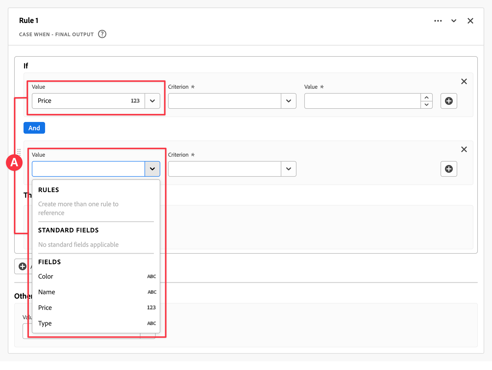
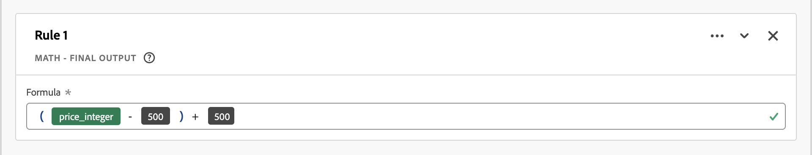

# Abgeleitete Felder {#derived-fields}

>[!CONTEXTUALHELP]
>id="dataview_derivedfields"
>title="Abgeleitete Felder"
>abstract="Mit einem abgeleiteten Feld können Sie mithilfe eines anpassbaren Regel-Builders spontan Datenmanipulationen definieren. Anschließend können Sie dieses abgeleitete Feld als Komponente (Metrik oder Dimension) in Workspace verwenden oder in der Datenansicht als Komponente weiter definieren."

Abgeleitete Felder sind ein wichtiger Aspekt der Echtzeit-Reporting-Funktion in Adobe Customer Journey Analytics. Mit einem abgeleiteten Feld können Sie mithilfe eines anpassbaren Regel-Builders spontan (häufig komplexe) Datenmanipulationen definieren. Anschließend können Sie dieses abgeleitete Feld als Komponente (Metrik oder Dimension) in [Workspace](../../analysis-workspace/home.md) verwenden oder das abgeleitete Feld in der Datenansicht als Komponente in der [Datenansicht](../data-views.md) weiter definieren.

Im Vergleich zur Umwandlung oder Bearbeitung Ihrer Daten an anderen Orten außerhalb von Customer Journey Analytics können abgeleitete Felder sehr viel Zeit und Aufwand sparen. Zum Beispiel [Data Prep](https://experienceleague.adobe.com/de/docs/experience-platform/data-prep/home), [Data Distiller](https://experienceleague.adobe.com/de/docs/experience-platform/query/data-distiller/overview), oder Ihren eigenen Extract Transform Load (ETL)/Extract Load Transform(ELT)-Prozessen.

Abgeleitete Felder werden in [Datenansichten](../data-views.md) definiert, basieren auf einem Satz von Funktionen, die als Regeln definiert sind, und werden auf verfügbare Standard- und/oder Schemafelder angewendet.

>[!NOTE]
>
>[Standardkomponenten](../component-reference.md) sind mit Ereignis-Datensätzen verknüpft. Daher funktionieren Standardkomponenten, die als Teil eines abgeleiteten Felds verwendet werden, nur für Daten aus einem Ereignis-Datensatz.
>

Beispielhafte Anwendungsfälle sind:

- Definieren Sie ein abgeleitetes Feld „Seitenname“, das falsche erfasste Seitennamenwerte korrigiert, um Seitennamenwerte zu korrigieren.

- Definieren Sie ein abgeleitetes Marketing-Kanal-Feld, das den richtigen Marketing-Kanal auf der Grundlage einer oder mehrerer Bedingungen bestimmt (z. B. URL-Parameter, Seiten-URL, Seitenname).

Standardkomponenten werden nur für Ereignis-Datensätze in abgeleiteten Feldern unterstützt.

## Oberfläche für abgeleitete Felder {#interface}

Wenn Sie ein abgeleitetes Feld erstellen oder bearbeiten, verwenden Sie die Oberfläche für abgeleitete Felder.

|  | Name | Beschreibung |
|---------|----------|--------|
| 1 | **Auswahl** | Sie verwenden den Auswahlbereich, um Ihre Funktion, Funktionsvorlage, das Schemafeld oder das Standardfeld auszuwählen und per Drag-and-Drop auf den Regel-Builder zu ziehen.  Verwenden Sie die Dropdown-Liste, um zwischen Folgendem auszuwählen:   [!UICONTROL Funktionen] - listet verfügbare [Funktionen](#function-reference) auf,   [!UICONTROL Funktionsvorlagen] - listet verfügbare [Funktionsvorlagen](#function-templates) auf,   [!UICONTROL Schemafelder] - listet verfügbare Felder aus Datensatzkategorien (Ereignis, Profil, Lookup) und zuvor definierte abgeleitete Felder auf, und   [!UICONTROL Standardfelder] - verfügbare Standardfelder (wie Plattform-Datensatz-ID). In der Auswahl werden nur Zeichenfolgen- und numerische Standardfelder angezeigt. Wenn die Funktion andere Datentypen unterstützt, können Standardfelder mit diesen anderen Datentypen für Werte oder Felder in der Oberfläche für Regeln ausgewählt werden. Sie können mithilfe des Suchfelds  nach Funktion, Funktionsvorlagen, Schema und Standardfeldern suchen.  Sie können die ausgewählte Objektliste filtern, indem Sie  auswählen und im Dialogfeld [!UICONTROL Felder filtern nach] Filter angeben. Sie können jeden Filter einfach mit  entfernen. |
| 2 | **Regel-Builder** | Das abgeleitete Feld wird sequenziell mit einer oder mehreren Regeln erstellt. Eine Regel ist eine spezifische Implementierung einer Funktion und wird daher immer nur einer Funktion zugeordnet. Sie erstellen eine Regel, indem Sie eine Funktion per Drag-and-Drop in den Regel-Builder ziehen. Der Funktionstyp bestimmt die Oberfläche der Regel. Weitere Informationen finden Sie auf der [Oberfläche für Regeln](#rule-interface).  Sie können eine Funktion am Anfang, Ende oder zwischen Regeln einfügen, die bereits im Regel-Builder verfügbar sind. Die letzte Regel im Regel-Builder bestimmt die endgültige Ausgabe des abgeleiteten Felds. |
| 3 | **[!UICONTROL **&#x200B; Feldeinstellungen &#x200B;**]** | Sie können Ihr abgeleitetes Feld benennen, beschreiben und seinen Feldtyp überprüfen. |
| 4 | **[!UICONTROL **&#x200B; Endgültige Ausgabe &#x200B;**]** | Dieser Bereich zeigt eine spontan aktualisierte Vorschau der Ausgabewerte, basierend auf den Daten der letzten 30 Tage und den Änderungen, die Sie an dem abgeleiteten Feld im Regel-Builder vornehmen. |

{style="table-layout:auto"}

## Assistent für Feldvorlagen {#wizard}

Beim erstmaligen Zugriff auf die Oberfläche für abgeleitete Felder wird der Assistent [!UICONTROL Mit einer Feldvorlage beginnen] angezeigt.

1. Wählen Sie die Vorlage aus, die die Art des Feldes, das erstellt werden soll, am besten beschreibt.
2. Wählen Sie zum Fortfahren die Schaltfläche **[!UICONTROL **&#x200B; Auswählen &#x200B;**]** aus.

Das Dialogfeld für das abgeleitete Feld wird mit Regeln (und Funktionen) gefüllt, die für den ausgewählten Feldtyp erforderlich oder nützlich sind. Weitere Informationen zu den verfügbaren Vorlagen finden Sie unter [Funktionsvorlagen](#function-templates).

## Oberfläche für Regeln {#rules}

Wenn Sie eine Regel im Regel-Builder definieren, verwenden Sie die Oberfläche für Regeln.

|  | Name | Beschreibung |
|---------|----------|--------|
| A  | **Regelname** | Standardmäßig lautet der Regelname **Regel X** (X verweist auf eine Sequenznummer). Wählen Sie zum Bearbeiten eines Regelnamens den Namen aus und geben Sie den neuen Namen ein, z. B. `Query Parameter`. |
| B | **Funktionsname** | Der ausgewählte Funktionsname für die Regel, z. B. [!UICONTROL URL PARSE]. Wenn die Funktion die letzte in der Sequenz der Funktionen ist und die endgültigen Ausgabewerte bestimmt, folgt auf den Funktionsnamen [!UICONTROL - ENDGÜLTIGE AUSGABE], zum Beispiel [!UICONTROL URL-PARSEN - ENDGÜLTIGE AUSGABE].  Um ein Popup mit weiteren Informationen zur Funktion anzuzeigen, wählen Sie  aus. |
| C | **Regelbeschreibung** | Sie können optional eine Beschreibung zu einer Regel hinzufügen. Wählen Sie  und dann **[!UICONTROL ** Beschreibung hinzufügen **]** aus, um eine Beschreibung hinzuzufügen, oder **[!UICONTROL **&#x200B; Beschreibung bearbeiten &#x200B;**]**, um eine vorhandene Beschreibung zu bearbeiten. Verwenden Sie den Editor, um eine Beschreibung einzugeben. Sie können den Text mithilfe der Symbolleiste formatieren (mit Stilauswahl, Fett, Kursiv, Unterstrichen, Rechts, Links, Zentriert, Farbe, Zahlenliste, Aufzählungsliste) und Links zu externen Informationen hinzufügen.  Um die Bearbeitung der Beschreibung abzuschließen, klicken Sie auf eine Stelle außerhalb des Editors. |
| D | **Funktionsbereich** | Definiert die Logik der Funktion. Die Oberfläche hängt vom Typ der Funktion ab. Das Dropdown-Menü für [!UICONTROL Feld] oder [!UICONTROL Wert] zeigt alle verfügbaren Feldkategorien (Regeln, Standardfelder, Felder) basierend auf dem von der Funktion erwarteten Eingabetyp an. Alternativ können Sie ein Feld aus der Auswahl „Schema und Standardfelder“ per Drag-and-Drop auf ein Feld oder einen Wert ziehen. Wenn dieses gezogene Feld aus einem Lookup-Datensatz stammt, wird automatisch eine Lookup-Funktion vor der von Ihnen definierten Funktion eingefügt.  Ausführliche Informationen zu jeder der unterstützten Funktionen finden Sie unter [Funktionsreferenz](#function-reference). |

{style="table-layout:auto"}

## Erstellen eines abgeleiteten Felds {#create}

1. Wählen Sie eine vorhandene Datenansicht aus oder erstellen Sie eine Datenansicht. Weitere Informationen finden Sie unter [Datenansichten](../data-views.md).

2. Wählen Sie die Registerkarte **[!UICONTROL **&#x200B; Komponenten &#x200B;**]** der Datenansicht aus.

3. Wählen Sie in der linken Leiste **[!UICONTROL **&#x200B; Abgeleitetes Feld erstellen &#x200B;**]** aus.

4. Um Ihr abgeleitetes Feld zu definieren, verwenden Sie die Oberfläche [!UICONTROL Abgeleitetes Feld erstellen]. Siehe [Oberfläche für abgeleitete Felder](#derived-field-interface).

   Wählen Sie zum Speichern des neuen abgeleiteten Felds **[!UICONTROL **&#x200B; Speichern &#x200B;**]** aus.

5. Das neue abgeleitete Feld wird zu [!UICONTROL „Abgeleitete Felder“ >] „Container“ als Teil der **[!UICONTROL **&#x200B; Schemafelder &#x200B;**]** in der linken Leiste der Datenansicht hinzugefügt.

## Bearbeiten eines abgeleiteten Felds {#edit}

1. Wählen Sie eine vorhandene Datenansicht aus. Weitere Informationen finden Sie unter [Datenansichten](../data-views.md).

2. Wählen Sie die Registerkarte **[!UICONTROL **&#x200B; Komponenten &#x200B;**]** der Datenansicht aus.

3. Wählen Sie links im Bereich [!UICONTROL Verbindung] die Registerkarte **[!UICONTROL **&#x200B; Schemafelder &#x200B;**]** aus.

4. Wählen Sie **[!UICONTROL **„Abgeleitete Felder“ >**]** „Container“ aus.

5. Bewegen Sie den Mauszeiger über das abgeleitete Feld, das Sie bearbeiten möchten, und wählen Sie dann  aus.

6. Verwenden Sie zum Bearbeiten des abgeleiteten Felds die Oberfläche [!UICONTROL Abgeleitetes Feld bearbeiten]. Siehe [Oberfläche für abgeleitete Felder](#derived-field-interface).

   - Wählen Sie **[!UICONTROL **&#x200B; Speichern &#x200B;**]**, um das aktualisierte abgeleitete Feld zu speichern.

   - Wählen Sie **[!UICONTROL **&#x200B; Abbrechen &#x200B;**]**, um alle Änderungen am abgeleiteten Feld abzubrechen.

   - Wählen Sie **[!UICONTROL **&#x200B; Speichern unter &#x200B;**]**, um das abgeleitete Feld als neues abgeleitetes Feld zu speichern. Das neue abgeleitete Feld hat denselben Namen wie das ursprünglich bearbeitete abgeleitete Feld, dem `(copy)` hinzugefügt wurde.

Alternativ, wenn Sie ein abgeleitetes Feld als Komponente für Dimensionen oder Metriken in Ihrer Datenansicht verwendet haben:

1. Wählen Sie die Komponente aus. Beachten Sie, dass die Komponente möglicherweise einen anderen Namen als das abgeleitete Feld hat.

1. Wählen Sie im Panel „Komponente“  neben Ihrem abgeleiteten Feld unter dem Namen des Schemafelds aus.

1. Verwenden Sie zum Bearbeiten des abgeleiteten Felds die Oberfläche [!UICONTROL Abgeleitetes Feld bearbeiten]. Siehe [Oberfläche für abgeleitete Felder](#derived-field-interface).

   - Wählen Sie **[!UICONTROL **&#x200B; Speichern &#x200B;**]**, um das aktualisierte abgeleitete Feld zu speichern.

   - Wählen Sie **[!UICONTROL **&#x200B; Abbrechen &#x200B;**]**, um alle Änderungen am abgeleiteten Feld abzubrechen.

   - Wählen Sie **[!UICONTROL **&#x200B; Speichern unter &#x200B;**]**, um das abgeleitete Feld als neues abgeleitetes Feld zu speichern. Das neue abgeleitete Feld hat denselben Namen wie das ursprünglich bearbeitete abgeleitete Feld, dem `(copy)` hinzugefügt wurde.

## Löschen eines abgeleiteten Felds {#delete}

1. Wählen Sie eine vorhandene Datenansicht aus. Weitere Informationen finden Sie unter [Datenansichten](../data-views.md).

2. Wählen Sie die Registerkarte **[!UICONTROL **&#x200B; Komponenten &#x200B;**]** der Datenansicht aus.

3. Wählen Sie im Bereich [!UICONTROL Verbindung] die Registerkarte **[!UICONTROL **&#x200B; Schemafelder &#x200B;**]** aus. 

4. Wählen Sie **[!UICONTROL **„Abgeleitete Felder“ > „Container“ &#x200B;**]**.

5. Bewegen Sie den Mauszeiger über das abgeleitete Feld, das Sie löschen möchten, und wählen Sie .

6. Wählen Sie in der Oberfläche [!UICONTROL Abgeleitetes Feld bearbeiten] die Option **[!UICONTROL Löschen]** aus.

   Sie werden im Dialogfeld [!UICONTROL Komponente löschen] aufgefordert, den Löschvorgang zu bestätigen. Berücksichtigen Sie eventuell vorhandene externe Verweise auf das abgeleitete Feld außerhalb der Datenansicht.

   - Wählen Sie **[!UICONTROL **&#x200B; Weiter &#x200B;**]**, um das abgeleitete Feld zu löschen.

Alternativ, wenn Sie ein abgeleitetes Feld als Komponente für Dimensionen oder Metriken in Ihrer Datenansicht verwendet haben:

1. Wählen Sie die Komponente aus. Beachten Sie, dass die Komponente möglicherweise einen anderen Namen als das abgeleitete Feld hat.

1. Wählen Sie im Panel „Komponente“  neben Ihrem abgeleiteten Feld unter dem Namen des Schemafelds aus.

1. Wählen Sie in der Oberfläche [!UICONTROL Abgeleitetes Feld bearbeiten] die Option **[!UICONTROL Löschen]** aus.

   Sie werden im Dialogfeld [!UICONTROL Komponente löschen] aufgefordert, den Löschvorgang zu bestätigen. Berücksichtigen Sie eventuell vorhandene externe Verweise auf das abgeleitete Feld außerhalb der Datenansicht.

   - Wählen Sie **[!UICONTROL **&#x200B; Weiter &#x200B;**]**, um das abgeleitete Feld zu löschen.

>[!NOTE]
>
>Abgeleitete Felder werden in Customer Journey Analytics auf Verbindungsebene verwaltet. Jede Änderung an einem abgeleiteten Feld in einer der mit dieser Verbindung verknüpften Datenansichten gilt für alle diese verknüpften Datenansichten.

## Funktionsvorlagen {#templates}

Es stehen Funktionsvorlagen für das schnelle Erstellen eines abgeleiteten Felds für bestimmte Anwendungsfälle zur Verfügung. Auf diese Funktionsvorlagen kann über den Auswahlbereich in der Oberfläche für abgeleitete Felder zugegriffen werden. Sie werden bei der ersten Verwendung im Assistenten [!UICONTROL Mit einer Feldvorlage beginnen] angezeigt.

### Marketing-Kanäle {#mchannel}

Diese Funktionsvorlage verwendet eine Sammlung von Regeln zum Erstellen von Marketing-Kanälen.

+++ Details

Um die Vorlage zu verwenden, müssen Sie die richtigen Parameter für jede Funktion angeben, die als Teil der Regeln in der Vorlage aufgeführt ist. Weitere Informationen finden Sie unter [Funktionsreferenz](#function-reference).

+++

### Bounces {#bounces}

Diese Funktionsvorlage verwendet eine Sammlung von Regeln zum Identifizieren von Seitenabsprüngen.

+++ Details

{{select-package}}

Um die Vorlage zu verwenden, müssen Sie die richtigen Parameter für jede Funktion angeben, die als Teil der Regeln in der Vorlage aufgeführt ist. Weitere Informationen finden Sie unter [Funktionsreferenz](#function-reference).

+++

### Mehrdimensionales Kombinieren {#multi-dim}

Diese Funktionsvorlage kombiniert zwei Werte zu einem.

+++ Details

{{select-package}}

Um die Vorlage zu verwenden, müssen Sie die richtigen Parameter für jede Funktion angeben, die als Teil der Regeln in der Vorlage aufgeführt ist. Weitere Informationen finden Sie unter [Funktionsreferenz](#function-reference).

+++

### Anzeigename des Datensatzes {#friendlyname}

Diese Funktionsvorlage stellt einen lesbaren Datensatznamen bereit.

+++ Details

{{select-package}}

Um die Vorlage zu verwenden, müssen Sie die richtigen Parameter für jede Funktion angeben, die als Teil der Regeln in der Vorlage aufgeführt ist. Weitere Informationen finden Sie unter [Funktionsreferenz](#function-reference).

+++

### Seitenname aus URL {#pagename}

Diese Funktionsvorlage erstellt einen einfachen Seitennamen.

+++ Details

{{select-package}}

Um die Vorlage zu verwenden, müssen Sie die richtigen Parameter für jede Funktion angeben, die als Teil der Regeln in der Vorlage aufgeführt ist. Weitere Informationen finden Sie unter [Funktionsreferenz](#function-reference).

+++

### Urlaubssaison {#holiday}

Diese Funktionsvorlage klassifiziert wichtige Zeiten im Jahr.

+++ Details

{{select-package}}

Um die Vorlage zu verwenden, müssen Sie die richtigen Parameter für jede Funktion angeben, die als Teil der Regeln in der Vorlage aufgeführt ist. Weitere Informationen finden Sie unter [Funktionsreferenz](#function-reference).

+++

### Monatliche Ziele {#goals}

Diese Funktionsvorlage legt benutzerdefinierte monatliche Ziele fest.

+++ Details

{{select-package}}

Um die Vorlage zu verwenden, müssen Sie die richtigen Parameter für jede Funktion angeben, die als Teil der Regeln in der Vorlage aufgeführt ist. Weitere Informationen finden Sie unter [Funktionsreferenz](#function-reference).

+++

### Alle Werte in durch Trennzeichen getrennter Liste abrufen {#allvalues}

Diese Funktionsvorlage konvertiert eine begrenzte Liste in ein Array.

+++ Details

{{select-package}}

Um die Vorlage zu verwenden, müssen Sie die richtigen Parameter für jede Funktion angeben, die als Teil der Regeln in der Vorlage aufgeführt ist. Weitere Informationen finden Sie unter [Funktionsreferenz](#function-reference).

+++

### Ersten Wert in durch Trennzeichen getrennter Liste abrufen {#firstvalue}

Diese Funktionsvorlage ruft den ersten Wert in einer durch Trennzeichen getrennten Liste ab.

+++ Details

{{select-package}}

Um die Vorlage zu verwenden, müssen Sie die richtigen Parameter für jede Funktion angeben, die als Teil der Regeln in der Vorlage aufgeführt ist. Weitere Informationen finden Sie unter [Funktionsreferenz](#function-reference).

+++

### Letzten Wert in durch Trennzeichen getrennter Liste abrufen {#lastvalue}

Diese Funktionsvorlage ruft den letzten Wert in einer durch Trennzeichen getrennten Liste ab.

+++ Details

{{select-package}}

Um die Vorlage zu verwenden, müssen Sie die richtigen Parameter für jede Funktion angeben, die als Teil der Regeln in der Vorlage aufgeführt ist. Weitere Informationen finden Sie unter [Funktionsreferenz](#function-reference).

+++

### Domänenname {#domain}

Diese Funktionsvorlage extrahiert den Domain-Namen mithilfe eines regulären Ausdrucks.

+++ Details

{{select-package}}

Um die Vorlage zu verwenden, müssen Sie die richtigen Parameter für jede Funktion angeben, die als Teil der Regeln in der Vorlage aufgeführt ist. Weitere Informationen finden Sie unter [Funktionsreferenz](#function-reference).

+++

### Abfragezeichenfolgenparameter abrufen {#querystring}

Diese Funktionsvorlage extrahiert Werte der Abfragezeichenfolge.

+++ Details

{{select-package}}

Um die Vorlage zu verwenden, müssen Sie die richtigen Parameter für jede Funktion angeben, die als Teil der Regeln in der Vorlage aufgeführt ist. Weitere Informationen finden Sie unter [Funktionsreferenz](#function-reference).

+++

### Übergangsfeld {#transition}

Diese Funktionsvorlage überträgt Berichte von einem Feld in ein anderes.

+++ Details

{{select-package}}

Um die Vorlage zu verwenden, müssen Sie die richtigen Parameter für jede Funktion angeben, die als Teil der Regeln in der Vorlage aufgeführt ist. Weitere Informationen finden Sie unter [Funktionsreferenz](#function-reference).

+++

### Einfache Bot-Erkennung {#botdetection}

Diese Funktionsvorlage implementiert die leichte Bot-Identifizierung.

+++ Details

{{select-package}}

Um die Vorlage zu verwenden, müssen Sie die richtigen Parameter für jede Funktion angeben, die als Teil der Regeln in der Vorlage aufgeführt ist. Weitere Informationen finden Sie unter [Funktionsreferenz](#function-reference).

+++

### Exitlink {#exit}

Diese Funktionsvorlage identifiziert den zuletzt in einer Sitzung angeklickten Link.

+++ Details

{{select-package}}

Um die Vorlage zu verwenden, müssen Sie die richtigen Parameter für jede Funktion angeben, die als Teil der Regeln in der Vorlage aufgeführt ist. Weitere Informationen finden Sie unter [Funktionsreferenz](#function-reference).

+++

### Downloadlink {#download}

Diese Funktionsvorlage kennzeichnet allgemeine Download-Links.

+++ Details

{{select-package}}

Um die Vorlage zu verwenden, müssen Sie die richtigen Parameter für jede Funktion angeben, die als Teil der Regeln in der Vorlage aufgeführt ist. Weitere Informationen finden Sie unter [Funktionsreferenz](#function-reference).

+++

<!--

+++ Data clean up template

>[!WARNING]
>
>Could not find any information on this template.
+++

-->

## Funktionsreferenz {#functionref}

{{select-package}}

Details zu jeder unterstützten Funktion finden Sie unten unter:

- Spezifikationen:
   - Eingabedatentyp: Art der unterstützten Daten,
   - Eingabe: mögliche Werte für die Eingabe,
   - Enthaltene Operatoren: Für diese Funktion unterstützte Operatoren (falls vorhanden),
   - Einschränkungen: Einschränkungen, die für diese spezifische Funktion gelten,
   - Ausgabe

- Anwendungsfälle, einschließlich:
   - Daten vor dem Definieren des abgeleiteten Felds,
   - wie das abgeleitete Feld definiert wird,
   - Daten nach der Definition des abgeleiteten Felds.

- Einschränkungen (falls zutreffend).

<!-- CASE WHEN -->

### Fall wenn {#casewhen}

>[!CONTEXTUALHELP]
>id="dataview_derivedfields_casewhen"
>title="Fall wenn"
>abstract="Diese Funktion bietet die Möglichkeit, Bedingungen anzuwenden, die auf definierten Kriterien aus einem oder mehreren Feldern basieren. Anhand dieser Kriterien werden dann die Werte im neuen abgeleiteten Feld auf Grundlage der Reihenfolge der Bedingungen definiert."

Wendet Bedingungen basierend auf definierten Kriterien aus einem oder mehreren Feldern an. Anhand dieser Kriterien werden dann die Werte im neuen abgeleiteten Feld auf Grundlage der Reihenfolge der Bedingungen definiert.

+++ Details

## Spezifikationen {#casewhen-io}

| Eingabedatentyp | Eingabe | Enthaltene Operatoren | Einschränkungen | Ausgabe |
|---|---|---|---|---|
| <ul><li>Zeichenfolge</li><li>Numerisch</li><li>Datum</li></ul> | <ul><li>[!UICONTROL Wenn], [!UICONTROL Ansonsten, Wenn]-Container:
<ul><li>[!UICONTROL Wert]</li><ul><li>Regeln</li><li>Standardfeldern</li><li>Felder</li></ul><li>[!UICONTROL Kriterium] (siehe eingeschlossene Operatoren, basierend auf ausgewähltem Werttyp)</li></ul></li><li>[!UICONTROL Wert setzen auf], [!UICONTROL Ansonsten Wert setzen auf]:
<ul><li>[!UICONTROL Wert]</li><ul><li>Regeln</li><li>Standardfeldern</li><li>Felder</li></ul></ul></li></ul> | 
Zeichenfolgen
<ul><li>Gleich</li><li>Gleich jedem Begriff</li><li>Enthält die Wortgruppe</li><li>Enthält einen der Begriffe</li><li>Enthält alle Begriffe</li><li>Beginnt mit</li><li>Beginnt mit einem beliebigen Begriff</li><li>Endet mit</li><li>Endet mit einem beliebigen Begriff</li><li>Ist nicht gleich</li><li>Entspricht keinem Begriff</li><li>Enthält nicht die Wortgruppe</li><li>Enthält keine Begriffe</li><li>Enthält nicht alle Begriffe</li><li>Beginnt nicht mit</li><li>Beginnt mit keinem Begriff</li><li>Endet nicht mit</li><li>Endet mit keinem Begriff</li><li>Ist eingestellt</li><li>Ist nicht eingestellt</li></ul>
Numerisch
<ul><li>Gleich</li><li>Ist nicht gleich</li><li>Größer als</li><li>Größer als oder gleich</li><li>Kleiner als</li><li>Kleiner als oder gleich</li><li>Ist eingestellt</li><li>Ist nicht eingestellt</li></ul>
Daten
<ul><li>Gleich</li><li>Ist nicht gleich</li><li>ist später als</li><li>Ist später als oder gleich</li><li>ist vor</li><li>Ist vor oder gleich</li><li>Ist eingestellt</li><li>Ist nicht eingestellt</li></ul> | <ul><li>5 Funktionen pro abgeleitetem Feld</li><li>200 [Operatoren](#operators) pro abgeleitetem Feld. Ein Beispiel für einen einzelnen Operator ist „Verweisende Domain enthält Google“. </li></ul> | 
Neues abgeleitetes Feld
 |

{style="table-layout:auto"}

## Anwendungsfall 1 {#casewhen-uc1}

Sie definieren Regeln zum Identifizieren verschiedener Marketing-Kanäle, indem Sie eine kaskadierende Logik anwenden, um ein Feld für einen Marketing-Kanal auf den richtigen Wert festzulegen:

- Wenn der Referrer aus einer Suchmaschine stammt und die Seite einen Abfragezeichenfolgenwert hat, in dem `cid` `ps_` enthält, sollte der Marketing-Kanal als [!DNL *Gebührenpflichtige Suche*] identifiziert werden.
- Wenn der Referrer aus einer Suchmaschine stammt und die Seite nicht über die Abfragezeichenfolge `cid` verfügt, sollte der Marketing-Kanal als [!DNL *Kostenlose Suche*] identifiziert werden.
- Wenn eie Seite einen Abfragezeichenfolgenwert hat, in dem `cid` `em_` enthält, sollte der Marketing-Kanal als [!DNL *E-Mail*] identifiziert werden.
- Wenn eie Seite einen Abfragezeichenfolgenwert hat, in dem `cid` `ds_` enthält, sollte der Marketing-Kanal als [!DNL *Display-Anzeige*] identifiziert werden.
- Wenn eine Seite einen Abfragezeichenfolgenwert hat, in dem `cid` `so_` enthält, sollte der Marketing-Kanal als [!DNL *Paid Social*] identifiziert werden.
- Wenn der Referrer aus einer verweisenden Domäne von [!DNL twitter.com], [!DNL facebook.com], [!DNL linkedin.com] oder [!DNL tiktok.com] stammt, sollte der Marketing-Kanal als [!DNL *Natural Social*] identifiziert werden.
- Wenn keine der oben genannten Regeln zutrifft, sollte der Marketing-Kanal als [!DNL *Sonstiger Referrer*] identifiziert werden.

Wenn Ihre Site die folgenden Beispielereignisse empfängt, die [!UICONTROL Referrer] und [!UICONTROL Seiten-URL] enthalten, sollten diese Ereignisse wie folgt identifiziert werden:

| [!DNL Event] | [!DNL Referrer] | [!DNL Page URL] | [!DNL Marketing Channel] |
|:--:|----|----|----|
| 1 | `https://facebook.com` | `https://site.com/home` | [!DNL Natural Social] |
| 2 | `https://abc.com` | `https://site.com/?cid=ds_12345678` | [!DNL Display] |
| 3 | | `https://site.com/?cid=em_12345678` | [!DNL Email] |
| 4 | `https://google.com` | `https://site.com/?cid=ps_abc098765` | [!DNL Paid Search] |
| 5 | `https://google.com` | `https://site.com/?cid=em_765544332` | [!DNL Email] |
| 6 | `https://google.com` |  | [!DNL Natural Search] |

{style="table-layout:auto"}

### Daten vor {#casewhen-uc1-databefore}

| [!DNL Referrer] | [!DNL Page URL] |
|----|----|
| `https://facebook.com` | `https://site.com/home` |
| `https://abc.com` | `https://site.com/?cid=ds_12345678` |
|  | `https://site.com/?cid=em_12345678` |
| `https://google.com` | `https://site.com/?cid=ps_abc098765` |
| `https://google.com` | `https://site.com/?cid=em_765544332` |
| `https://google.com` | |

{style="table-layout:auto"}

### Abgeleitetes Feld {#casewhen-uc1-derivedfield}

Sie definieren ein abgeleitetes `Marketing Channel`-Feld. Mit den Funktionen [!UICONTROL FALL WENN] definieren Sie auf Grundlage von vorhandenen Werten die Werte für die Felder `Page URL` und `Referring URL`.

Beachten Sie die Verwendung der Funktion [!UICONTROL URL-PARSEN] zum Definieren von Regeln, um die Werte für `Page Url` und `Referring Url` abzurufen, bevor die Regeln [!UICONTROL FALL WENN] angewendet werden.

### Daten nach {#casewhen-uc1-dataafter}

| [!DNL Marketing Channel] |
|----|
| [!DNL Natural Social] |
| [!DNL Display] |
| [!DNL Email] |
| [!DNL Paid Search] |
| [!DNL Email] |
| [!DNL Natural Search] |

{style="table-layout:auto"}

## Anwendungsfall 2 {#casewhen-uc2}

Sie haben mehrere verschiedene Varianten der Suche innerhalb Ihrer [!DNL Product Finding Methods]-Dimension erfasst. Um die Gesamtleistung der Suche im Vergleich zum Durchsuchen zu verstehen, müssen Sie viel Zeit damit verbringen, die Ergebnisse manuell zu kombinieren. 

Ihre Site erfasst die folgenden Werte für Ihre [!DNL Product Finding Methods]-Dimension. Am Ende geben alle diese Werte eine Suche an.

| Erfasster Wert | Tatsächlicher Wert |
|---|---|
| [!DNL search p13n_no] | [!DNL search] |
| [!DNL search p13n_yes] | [!DNL search] |
| [!DNL search refine p13n_no] | [!DNL search] |
| [!DNL search refine p13n_yes] | [!DNL search] |
| [!DNL search redirect p13n_yes] | [!DNL search] |
| [!DNL search-redirect] | [!DNL search] |

{style="table-layout:auto"}

### Daten vor {#casewhen-uc2-databefore}

| [!DNL Product Finding Methods] |
|----|
| [!DNL search p13_no] |
| [!DNL search p13_yes] |
| [!DNL browse] |
| [!DNL search refine p13_no] |
| [!DNL search refine p13_yes] |
| [!DNL browse] |
| [!DNL search redirect p13_yes] |
| [!DNL search-redirect] |
| [!DNL browse] |

{style="table-layout:auto"}

### Abgeleitetes Feld {#casewhen-uc2-derivedfield}

Sie definieren ein abgeleitetes `Product Finding Methods (new)`-Feld. Sie erstellen die folgenden [!UICONTROL FALL WENN]-Regeln im Regel-Builder. Diese Regeln wenden Logik auf alle möglichen Varianten der alten [!UICONTROL Produktsuchmethoden]-Feldwerte für `search` und `browse` mit dem Kriterium [!UICONTROL Enthält die Wortgruppe] an.

### Daten nach {#casewhen-uc2-dataafter}

| [!DNL Product Finding Methods (new)] |
|----|
| [!DNL search] |
| [!DNL search] |
| [!DNL browse] |
| [!DNL search] |
| [!DNL search] |
| [!DNL browse] |
| [!DNL search] |
| [!DNL search] |
| [!DNL browse] |

{style="table-layout:auto"}

## Anwendungsfall 3 {#casewhen-uc3}

Als Reiseunternehmen möchten Sie die Reisedauer für gebuchte Reisen zusammenfassen, damit Sie Berichte zu zusammengefassten Reiselängen erstellen können.

Annahmen:

- Die Organisation erfasst die Reisedauer in einem numerischen Feld.
- Sie möchte die Dauer von 1-3 Tagen in einem Bucket namens „[!DNL short trip]“ zusammenfassen
- Sie möchte die Dauer von 4-7 Tagen in einem Bucket namens „[!DNL medium trip]“ zusammenfassen
- Sie möchte die Dauer von 8 Tagen und mehr in einem Bucket namens „[!DNL long trip]“ zusammenfassen
- Es wurden 132 Reisen für eine Dauer von 1 Tag gebucht
- Es wurden 110 Reisen für eine Dauer von 2 Tagen gebucht
- Es wurden 105 Reisen für eine Dauer von 3 Tagen gebucht
- Es wurden 99 Reisen für eine Dauer von 4 Tagen gebucht
- Es wurden 92 Reisen für eine Dauer von 5 Tagen gebucht
- Es wurden 85 Reisen für eine Dauer von 6 Tagen gebucht
- Es wurden 82 Reisen für eine Dauer von 7 Tagen gebucht
- Es wurden 78 Reisen für eine Dauer von 8 Tagen gebucht
- Es wurden 50 Reisen für eine Dauer von 9 Tagen gebucht
- Es wurden 44 Reisen für eine Dauer von 10 Tagen gebucht
- Es wurden 38 Reisen für eine Dauer von 11 Tagen gebucht
- Es wurden 12 Reisen für eine Dauer von 31 Tagen gebucht

Ihr gewünschter Bericht sollte wie folgt aussehen:

| [!DNL Trip Duration Type] | [!DNL Bookings] |
|----|---:|
| [!DNL medium trip] | 358 |
| [!DNL short trip] | 347 |
| [!DNL long trip] | 241 |

{style="table-layout:auto"}

### Daten vor {#casewhen-uc3-databefore}

| [!DNL Trip Duration] |
|---:|
| 1 |
| 12 |
| 3 |
| 6 |
| 4 |
| 8 |
| 6 |
| 2 |
| 1 |
| 2 |
| 21 |
| 8 |

### Abgeleitetes Feld {#casewhen-uc3-derivedfield}

Sie definieren ein abgeleitetes `Trip Duration (bucketed)`-Feld. Sie erstellen die folgende [!UICONTROL FALL WENN]-Regel im Regel-Builder. Diese Regel wendet Logik an, um die alten [!UICONTROL Reisedauer]-Feldwerte zu drei Werten zusammenzufassen: `short trip`, `medium  trip` und `long trip`.

### Daten nach {#casewhen-uc3-dataafter}

| [!DNL Trip Duration (bucketed)] |
|---|
| [!DNL short trip] |
| [!DNL long trip] |
| [!DNL short trip] |
| [!DNL medium trip] |
| [!DNL medium trip] |
| [!DNL long trip] |
| [!DNL medium trip] |
| [!DNL short trip] |
| [!DNL short trip] |
| [!DNL short trip] |
| [!DNL long trip] |
| [!DNL long trip] |

## Weitere Informationen {#casewhen-more-info}

Customer Journey Analytics verwendet eine verschachtelte Container-Struktur, die nach dem [XDM](https://experienceleague.adobe.com/de/docs/experience-platform/xdm/home) (Experience-Datenmodell) von Adobe Experience Platform modelliert ist. Weitere [ finden ](../create-dataview.md#containers) unter [Container](/help/components/segments/seg-overview.md#containers) und Segmentcontainer). Dieses Container-Modell ist zwar von Natur aus flexibel, weist aber einige Einschränkungen bei der Verwendung des Regel-Builders auf.

Customer Journey Analytics verwendet das folgende standardmäßige Container-Modell:

Die folgenden Einschränkungen gelten und werden beim *Auswählen* und *Einstellen* der Werte erzwungen.

|  | Begrenzungen |
|:---:|----|
| **A** | Werte, die Sie innerhalb desselben [!UICONTROL Wenn], [!UICONTROL Ansonsten, wenn]-Konstrukts (mit [!UICONTROL Und] oder [!UICONTROL Oder]) in einer Regel *auswählen*, müssen aus demselben Container stammen und können von einem beliebigen Typ sein (Zeichenfolge , numerisch  und so weiter).   |
| **B** | Alle Werte, die Sie in einer Regel *festlegen*, müssen aus demselben Container stammen und denselben Typ oder einen abgeleiteten Wert desselben Typs aufweisen.    |
| **C** | Die Werte, die Sie in [!UICONTROL Wenn], [!UICONTROL Ansonsten, wenn]-Konstrukten *auswählen*, müssen *nicht* aus demselben Container stammen und *nicht* vom selben Typ sein.    |

{style="table-layout:auto"}

+++

<!-- CLASSIFY -->

### Klassifizieren {#classify}

>[!CONTEXTUALHELP]
>id="dataview_derivedfields_classify"
>title="Klassifizieren"
>abstract="Diese Funktion bietet die Möglichkeit, einen Satz von Werten zu definieren, die per Texteingabe durch entsprechende Werte ersetzt werden."

Definiert einen Satz von Werten, die in einem neuen abgeleiteten Feld durch entsprechende Werte ersetzt werden.

+++ Details

## Spezifikationen {#classify-io}

| Eingabedatentyp | Eingabe | Enthaltene Operatoren | Einschränkungen | Ausgabe |
|---|---|---|---|---|
| <ul><li>Zeichenfolge</li><li>Numerisch</li><li>Datum</li></ul> | <ul><li>[!UICONTROL Feld für die Klassifizierung]:<ul><li>Regeln</li><li>Standardfeldern</li><li>Felder</li></ul></li><li>[!UICONTROL Wenn Wert gleich] und [!UICONTROL Werte ersetzen durch]:
<ul><li>Zeichenfolge</li></ul><li>Originalwerte anzeigen<ul><li>Boolesch</li></ul></li></ul> | 
k. A.
 | <ul><li>5 Funktionen pro abgeleitetem Feld</li><li>200 [Operatoren](#operators) pro abgeleitetem Feld. Jeder Eintrag für [!UICONTROL Wenn Wert gleich Originalwert ist] [!UICONTROL Wert durch neuen Wert ersetzen] wird als Vorgang betrachtet.</li></ul> | 
Neues abgeleitetes Feld
 |

{style="table-layout:auto"}

## Anwendungsfall 1 {#classify-uc1}

Sie verfügen über eine CSV-Datei, die eine Schlüsselspalte für `hotelID` und eine oder mehrere zusätzliche Spalten enthält, die mit der `hotelID` verknüpft sind: `city`, `rooms`, `hotel name`.
Sie erfassen [!DNL Hotel ID] in einer Dimension, möchten jedoch eine [!DNL Hotel Name]-Dimension erstellen, die von der `hotelID` in der CSV-Datei abgeleitet wurde.

**Struktur und Inhalt der CSV-Datei**

| [!DNL hotelID] | [!DNL city] | [!DNL rooms] | [!DNL hotel name] |
|---|---|---:|---|
| [!DNL SLC123] | [!DNL Salt Lake City] | 40 | [!DNL SLC Downtown] |
| [!DNL LAX342] | [!DNL Los Angeles] | 60 | [!DNL LA Airport] |
| [!DNL SFO456] | [!DNL San Francisco] | 75 | [!DNL Market Street] |
| [!DNL AMS789] | [!DNL Amsterdam] | 50 | [!DNL Okura] |

{style="table-layout:auto"}

**Aktueller Bericht**

| [!DNL Hotel ID] | Produktansichten |
|---|---:|
| [!DNL SLC123] | 200 |
| [!DNL LX342] | 198 |
| [!DNL SFO456] | 190 |
| [!DNL AMS789] | 150 |

{style="table-layout:auto"}

**Gewünschter Bericht**

| [!DNL Hotel Name] | Produktansichten |
|----|----:|
| [!DNL SLC Downtown] | 200 |
| [!DNL LA Airport] | 198 |
| [!DNL Market Street] | 190 |

{style="table-layout:auto"}

### Daten vor {#classify-uc1-databefore}

| [!DNL Hotel ID] |
|----|
| [!DNL SLC123] |
| [!DNL LAX342] |
| [!DNL SFO456] |
| [!DNL AMS789] |

{style="table-layout:auto"}

### Abgeleitetes Feld {#classify-uc1-derivedfield}

Sie definieren ein abgeleitetes `Hotel Name`-Feld. Mit der Funktion [!UICONTROL KLASSIFIZIEREN] definieren Sie eine Regel, mit der Sie Werte des Felds [!UICONTROL Hotel-ID] klassifizieren und durch neue Werte ersetzen können.

Wenn Sie Originalwerte einbeziehen möchten, die Sie nicht als Teil der zu klassifizierenden Werte definiert haben (z. B. Hotel-ID AMS789), stellen Sie sicher, dass Sie **[!UICONTROL Originalwerte anzeigen]** auswählen. Dadurch wird sichergestellt, dass AMS789 Teil der Ausgabe für das abgeleitete Feld ist, obwohl dieser Wert nicht klassifiziert ist.

### Daten nach {#classify-uc1-dataafter}

| [!DNL Hotel Name] |
|----|
| [!DNL SLC Downtown] |
| [!DNL LA Airport] |
| [!DNL Market Street] |

{style="table-layout:auto"}

## Anwendungsfall 2 {#classify-uc2}

Sie haben für mehrere Seiten URLs anstelle des Anzeigenamens erfasst. Durch diese gemischte Erfassung von Werten wird das Reporting ungültig.

### Daten vor {#classify-uc2-databefore}

| [!DNL Page Name] |
|---|
| [!DNL Home Page] |
| [!DNL Flight Search] |
| `http://www.adobetravel.ca/Hotel-Search` |
| `https://www.adobetravel.com/Package-Search` |
| [!DNL Deals & Offers] |
| `http://www.adobetravel.ca/user/reviews` |
| `https://www.adobetravel.com.br/Generate-Quote/preview` |

{style="table-layout:auto"}

### Abgeleitetes Feld {#classify-uc2-derivedfield}

Sie definieren ein abgeleitetes `Page Name (updated)`-Feld. Mit der Funktion [!UICONTROL KLASSIFIZIEREN] definieren Sie eine Regel, mit der Sie Werte des vorhandenen Felds [!UICONTROL Seitenname] klassifizieren und durch neue, korrekte Werte ersetzen können.

### Daten nach {#classify-uc2-dataafter}

| [!DNL Page Name (updated)] |
|---|
| [!DNL Home Page] |
| [!DNL Flight Search] |
| [!DNL Hotel Search] |
| [!DNL Package Search] |
| [!DNL Deals & Offers] |
| [!DNL Reviews] |
| [!DNL Generate Quote] |

## Weitere Informationen {#classify-moreinfo}

Die folgende zusätzliche Funktion ist in der Oberfläche „Regel klassifizieren“ verfügbar:

- Um alle Tabellenwerte schnell zu löschen, wählen Sie  **[!UICONTROL Alle Tabellenwerte löschen]** aus.
- Um eine CSV-Datei mit den Originalwerten für „Wenn die Werte gleich sind“ und neuen Werten für „Werte ersetzen durch“ hochzuladen, wählen Sie  **[!UICONTROL CSV hochladen]**.
- Um eine Vorlage zum Erstellen einer CSV-Datei mit Originalwerten und neuen Werten zum Hochladen herunterzuladen, wählen Sie  **[!UICONTROL CSV-Vorlage herunterladen]** aus.
- Um eine CSV-Datei mit allen Originalwerten und neuen Werten hochzuladen, die in der Oberfläche für Regeln angegeben sind, wählen Sie  **[!UICONTROL CSV-Werte herunterladen]** aus.

+++

<!-- CONCATENATE -->

### Verketten {#concatenate}

<!-- markdownlint-disable MD034 -->

>[!CONTEXTUALHELP]
>id="dataview_derivedfields_concatenate"
>title="Verketten"
>abstract="Diese Funktion bietet die Möglichkeit, zwei oder mehr Felder, abgeleitete Felder oder benutzerseitig eingegebene Zeichenfolgenwerte in einem Feld mit definierten Trennzeichen zu kombinieren"

<!-- markdownlint-enable MD034 -->

Kombiniert Feldwerte zu einem einzigen neuen abgeleiteten Feld mit definierten Trennzeichen.

+++ Details

## Spezifikationen {#concatenate-io}

| Eingabedatentyp | Eingabe | Enthaltene Operatoren | Einschränkungen | Ausgabe |
|---|---|---|---|---|
| <ul><li>Zeichenfolge</li></ul> | <ul><li>[!UICONTROL Wert]:<ul><li>Regeln</li><li>Standardfeldern</li><li>Felder</li><li>Zeichenfolge</li></ul></li><li>[!UICONTROL Trennzeichen]:<ul><li>Zeichenfolge</li></ul></li> </ul> | 
k. A.
 | 
2 Funktionen pro abgeleitetem Feld
 | 
Neues abgeleitetes Feld
 |

{style="table-layout:auto"}

## Anwendungsfall {#concatenate-uc}

Derzeit erfassen Sie die Codes von Herkunfts- und Zielflughäfen Codes als separate Felder. Sie möchten die beiden Felder zu einer Dimension kombinieren, die durch einen Bindestrich (-) getrennt ist. So können Sie die Kombination von Herkunft und Ziel analysieren, um die am häufigsten gebuchten Routen zu identifizieren.

Annahmen:

- Herkunfts- und Zielwerte werden in separaten Feldern in derselben Tabelle erfasst.
- Die Benutzerin oder der Benutzer legt fest, dass das Trennzeichen „-“ zwischen den Werten verwendet werden soll.

Stellen Sie sich vor, dass folgende Buchungen stattfinden:

- Kunde ABC123 bucht einen Flug von Salt Lake City (SLC) nach Orlando (MCO)
- Kunde ABC456 bucht einen Flug von Salt Lake City (SLC) nach Los Angeles (LAX)
- Kunde ABC789 bucht einen Flug von Salt Lake City (SLC) nach Seattle (SEA)
- Kunde ABC987 bucht einen Flug von Salt Lake City (SLC) nach San Jose (SJO)
- Kunde ABC654 bucht einen Flug von Salt Lake City (SLC) nach Orlando (MCO)

Der gewünschte Bericht sollte wie folgt aussehen:

| Herkunft/Ziel | Buchungen |
|----|---:|
| SLC-MCO | 2 |
| SLC-LAX | 1 |
| SLC-SEA | 1 |
| SLC-SJO | 1 |

{style="table-layout:auto"}

### Daten vor {#concatenate-uc-databefore}

| Herkunft | Ziel |
|----|---:|
| SLC | MCO |
| SLC | LAX |
| SLC | SEA |
| SLC | SJO |
| SLC | MCO |

{style="table-layout:auto"}

### Abgeleitetes Feld {#concatenate-derivedfield}

Sie definieren ein abgeleitetes `Origin - Destination`-Feld. Mit der Funktion [!UICONTROL VERKETTEN] definieren Sie eine Regel zum Verketten der Felder [!UICONTROL Original] und [!UICONTROL Ziel] mithilfe des `-` [!UICONTROL Trennzeichens].

### Daten nach {#concatenate-dataafter}

| Herkunft - Ziel (abgeleitetes Feld) |
|---|
| SLC-MCO |
| SLC-LAX |
| SLC-SEA |
| SLC-SJO |
| SLC-MCO |

{style="table-layout:auto"}

+++

<!-- DATE MATH -->

### Datumsberechnung {#datemath}

>[!CONTEXTUALHELP]
>id="dataview_derivedfields_datemath"
>title="Datumsberechnung"
>abstract="Diese Funktion bietet die Möglichkeit, die Differenz zwischen zwei Datums- oder Datums-/Uhrzeitfeldern zurückzugeben."

Gibt die Differenz zwischen zwei Datumsangaben oder zwei Datums-/Uhrzeitfeldern zurück.

+++ Details

## Spezifikationen {#datemath-io}

| Eingabedatentyp | Eingabe | Enthaltene Operatoren | Einschränkungen | Ausgabe |
|---|---|---|---|---|
| <ul><li>Datum</li><li>Datum-Uhrzeit</li></ul> | <ul><li>[!UICONTROL Anwendungsbereich]<ul><li>Ereignis</li><li>Sitzung</li><li>Person</li></ul></li><li>[!UICONTROL Wert]:<ul><li>Datum</li><li>Datum/Uhrzeit</li><li>Statisches Datum (vom Benutzer eingegeben)</li><li>Statische Datums-/Uhrzeitangabe (Benutzereingabe)</li><li>Dynamisches Datum<ul><li>Am aktuellen Tag</li></ul></li><li>Dynamisches Datum/Uhrzeit<ul><li>Jetzt</li></ul></li></ul></li><li>[!UICONTROL Granularität]:<ul><li>Seconds</li><li>Minutes</li><li>Stunden</li><li>Days</li><li>Weeks</li><li>Months</li><li>Quartale</li><li>Jahre</li></ul></li><li>Für jede Datums- oder Datums-/Uhrzeitangabe:<ul><li>Erste(r) (innerhalb der Sitzung oder Person)</li><li>Letzte(r) (innerhalb der Sitzung oder Person)</li></ul></li></ul> | 
k. A.
 | 
2 Funktionen pro abgeleitetem Feld
 | 
Neues abgeleitetes Feld
 |

{style="table-layout:auto"}

## Anwendungsfall 1 {#datemath-uc1}

Als Marketing-Analyst eines Hotelunternehmens möchten Sie den Unterschied der Anzahl der Tage zwischen dem Check-in-Datum des Kunden und dem Buchungstermin über die letzte Woche verstehen.

### Abgeleitetes Feld {#datemath-uc1-derivedfield}

Sie definieren ein abgeleitetes `Days between booking and check-in`-Feld. Mit der Funktion [!UICONTROL DATE MATH] können Sie eine Regel definieren, mit der die Tage für [!UICONTROL Scope] [!DNL Person] zwischen dem [!UICONTROL Buchungsdatum] und [!UICONTROL Check-in-Datum] berechnet werden. Wählen Sie [!UICONTROL Tag] als [!UICONTROL Ausgabegranularität] aus. Und Sie wählen [!UICONTROL Letztes &#x200B;] sowohl für [!UICONTROL Buchungsdatum] als auch für [!UICONTROL Check-in-Datum], um sicherzustellen, dass der Wert der letzten Person in der Berechnung verwendet wird.

## Anwendungsfall 2 {#datemath-uc2}

Als Marketing-Analyst eines stationären Geschäfts möchten Sie verstehen, wie viele Tage zuvor der letzte Besuch eines Kunden im Geschäft war. Sie verwenden Geolocation-Funktionen innerhalb einer mobilen App und Beacons im Shop, um physische Besuche von Kunden zu erfassen.

### Abgeleitetes Feld {#datemath-uc2-derivedfield}

Sie definieren ein neues abgeleitetes `Days Since Visit To Shop`-Feld. Mit [!UICONTROL DATE MATH]-Funktion definieren Sie eine Regel zur Berechnung der Tage zwischen einer benutzerdefinierten Datums-/Uhrzeitangabe (die Sie in [!UICONTROL Date] angeben) und der [!UICONTROL Lokalzeit] (aus Ihrer [!UICONTROL placeContext]-Feldergruppe Ihres Ereignisdatensatzes) mit einem [!UICONTROL Deduplizierungsumfang] von [!UICONTROL Person]. Sie wählen [!UICONTROL Letzte zurückgeben], um sicherzustellen, dass der letzte von einer Person erfasste Wert für [!UICONTROL Ortszeit] in der Berechnung verwendet wird. Wählen Sie Tag als [!UICONTROL Ausgabegranularität] aus.

## Anwendungsfall 3 {#datemath-uc3}

Sie möchten die Suchzeit in Minuten verstehen, bevor ein Kunde innerhalb einer Sitzung eine Bestellung aufgibt.

Sie definieren ein neues `Time Between Search And Order In Minutes` abgeleitetes Feld, das das Ergebnis zweier [[!UICONTROL CASE WHEN]-Funktionen ist](#case-when) um [!UICONTROL Suchzeit] und [!UICONTROL Bestellzeit] Werte zu definieren.
Anschließend verwenden Sie diese beiden Werte, um die Differenz mit einer [!UICONTROL DATE MATH]-Funktion zu berechnen, wobei [!UICONTROL Scope] auf [!UICONTROL Session], Werte auf [!UICONTROL Search Time] und [!UICONTROL Order Time] und [!UICONTROL Output-Granularität] auf [!UICONTROL Minute] gesetzt sind. Für beide Werte wählen Sie [!UICONTROL Erste zurückgeben] um sicherzustellen, dass die erste [!UICONTROL Suchzeit] und [!UICONTROL Bestellzeit] zurückgegeben wird.

+++

<!-- DEDUPLICATE -->

### Deduplizieren {#dedup}

>[!CONTEXTUALHELP]
>id="dataview_derivedfields_deduplicate"
>title="Deduplizieren"
>abstract="Diese Funktion bietet die Möglichkeit, ein Feld so zu konfigurieren, dass Werte nicht wiederholt auf Sitzungs- oder Personenebene gezählt werden. Darüber hinaus kann mit einer Deduplizierungs-ID sichergestellt werden, dass auf Grundlage einer bestimmten ID (z. B. einer Kauf-ID) nur ein Wert verwendet wird (entweder die erste oder die letzte Instanz)."

Verhindert, dass ein Wert mehrmals gezählt wird.

+++ Details

## Spezifikationen {#deduplicate-io}

| Eingabedatentyp | Eingabe | Enthaltene Operatoren | Einschränkungen | Ausgabe |
|---|---|---|---|---|
| <ul><li>Zeichenfolge</li><li>Numerisch</li></ul> | <ul><li>[!UICONTROL Wert]:<ul><li>Regeln</li><li>Standardfeldern</li><li>Felder</li><li>Zeichenfolge</li></ul></li><li>[!UICONTROL Umfang]:<ul><li>Person</li><li>Sitzung</li></ul></li><li>[!UICONTROL Deduplizierungs-ID]:<ul><li>Regeln</li><li>Standardfeldern</li><li>Felder</li><li>Zeichenfolge</li></ul><li>[!UICONTROL Beizubehaltender Wert]:<ul><li>Erste Instanz beibehalten</li><li>Letzte Instanz beibehalten</li></ul></li></ul> | 
k. A.
 | 
5 Funktionen pro abgeleitetem Feld
 | 
Neues abgeleitetes Feld
 |

{style="table-layout:auto"}

## Anwendungsfall 1 {#deduplicate-uc1}

Sie möchten verhindern, dass doppelter Umsatz gezählt wird, wenn eine Person die Buchungsbestätigungsseite neu lädt. Sie verwenden die Buchungsbestätigungs-ID bei der Kennung, um den Umsatz bei Erhalt im selben Ereignis nicht erneut zu zählen.

### Daten vor {#deduplicate-uc1-databefore}

| Buchungsbestätigungs-ID | Umsatz |
|----|---:|
| ABC123456789 | 359 |
| ABC123456789 | 359 |
| ABC123456789 | 359 |

{style="table-layout:auto"}

### Abgeleitetes Feld {#deduplicate-uc1-derivedfield}

Sie definieren ein abgeleitetes `Booking Confirmation`-Feld. Mit der Funktion [!UICONTROL DEDUPLIZIEREN] definieren Sie eine Regel zum Deduplizieren des [!UICONTROL Werts] [!DNL Booking] für den [!UICONTROL Umfang] [!DNL Person] mit der [!UICONTROL Deduplizierungs-ID] [!UICONTROL Buchungsbestätigungs-ID]. Wählen Sie [!UICONTROL Erste Instanz beibehalten] als [!UICONTROL Beizubehaltender Wert].

### Daten nach {#deduplicate-uc1-dataafter}

| Buchungsbestätigungs-ID | Umsatz |
|----|---:|
| ABC123456789 | 359 |
| ABC123456789 | 0 |
| ABC123456789 | 0 |

{style="table-layout:auto"}

## Anwendungsfall 2 {#deduplicate-uc2}

Sie verwenden Ereignisse als Proxy für Kampagnenklickraten mit externen Marketing-Kampagnen. Durch Neuladungen und Umleitungen wird die Ereignismetrik in die Höhe getrieben. Sie möchten die Trackingcode-Dimension deduplizieren, damit nur das erste erfasst und die Ereignisüberzählung minimiert wird.

### Daten vor {#deduplicate-uc2-databefore}

| Besucher-ID | Marketing-Kanal | Ereignisse |
|----|---|---:|
| ABC123 | Paid Search | 1 |
| ABC123 | Paid Search | 1 |
| ABC123 | Paid Search | 1 |
| DEF123 | E-Mail | 1 |
| DEF123 | E-Mail | 1 |
| JKL123 | Kostenlose Suche | 1 |
| JKL123 | Kostenlose Suche | 1 |

{style="table-layout:auto"}

### Abgeleitetes Feld {#deduplicate-uc2-derivedfield}

Sie definieren ein neues abgeleitetes `Tracking Code (deduplicated)`-Feld. Mit der Funktion [!UICONTROL DEDUPLIZIEREN] definieren Sie eine Regel zum Deduplizieren des [!UICONTROL Trackingcodes] mit einem [!UICONTROL Umfang der Deduplizierung] von [!UICONTROL Sitzung] und [!UICONTROL Erste Instanz beibehalten] als [!UICONTROL beizubehaltender Wert].

### Daten nach {#deduplicate-uc2-dataafter}

| Besucher-ID | Marketing-Kanal | Ereignisse |
|----|---|---:|
| ABC123 | Paid Search | 1 |
| DEF123 | E-Mail | 1 |
| JKL123 | Kostenlose Suche | 1 |

{style="table-layout:auto"}

+++

<!-- DEPTH -->

### Tiefe {#depth}

>[!CONTEXTUALHELP]
>id="dataview_derivedfields_depth"
>title="Tiefe"
>abstract="Diese Funktion bietet die Möglichkeit, die Tiefe eines beliebigen Felds zurückzugeben, ähnlich der Funktionalität der Standardkomponente für Ereignistiefe."

Gibt die Tiefe eines Felds zurück, ähnlich wie dies mit der standardmäßigen ([-Dimension) möglich ](/help/components/dimensions/overview.md#standard-dimensions).

+++ Details

## Spezifikationen {#depth-io}

| Eingabedatentyp | Eingabe | Enthaltene Operatoren | Einschränkungen | Ausgabe |
|---|---|---|---|---|
| Eines | Beliebiges Feld | k. A. | 3 Funktionen pro abgeleitetem Feld | Neues abgeleitetes Feld |

{style="table-layout:auto"}

<!--
## Example Data {#depth-example}

| event# | page name | search | product view | cart add  | order |
|:---:|---|:---:|:---:|:---:|:---:|
| 1 |  home page        |  0  | 0  | 0  | 0 |
| 2 |  search page      |  1  | 0  | 0  | 0 |
| 3 |  product page     |  0  | 0  | 0  | 0 |
| 4 |  cart page        |  0  | 0  | 1  | 0 |
| 5 |  confirmation     |  0  | 0  | 0  | 1 |

-->

## Anwendungsfall {#depth-uc1}

Sie möchten die Suchtiefe verstehen (die Sie auch als Anzahl der Suchvorgänge interpretieren können). So können Sie diese Suchtiefe später verwenden, um den Suchbegriff zu suchen, der mit einer bestimmten Suchtiefe verknüpft ist.

### Abgeleitetes Feld {#depth-uc1-derivedfield}

Sie definieren ein neues abgeleitetes `Search Depth`-Feld. Mit der [!UICONTROL DEPTH]-Funktion definieren Sie eine Regel, um die Tiefe von [!UICONTROL Search] abzurufen und in einem neuen, abgeleiteten Feld zu speichern.

+++

<!-- FIND AND REPLACE -->

### Suchen und Ersetzen {#find-and-replace}

<!-- markdownlint-disable MD034 -->

>[!CONTEXTUALHELP]
>id="dataview_derivedfields_findandreplace"
>title="Suchen und Ersetzen"
>abstract="Diese Funktion bietet die Möglichkeit, alle Werte in einem ausgewählten Feld per Suche zu ermitteln und diese Werte in einem neuen abgeleiteten Feld durch einen anderen Wert zu ersetzen."

Findet alle Werte in einem ausgewählten Feld und ersetzt diese Werte durch einen anderen Wert in einem neuen, abgeleiteten Feld.

+++ Details

## Spezifikationen {#findreplace-io}

| Eingabedatentyp | Eingabe | Enthaltene Operatoren | Einschränkungen | Ausgabe |
|---|---|---|---|---|
| <ul><li>Zeichenfolge</li></ul> | <ul><li>[!UICONTROL Wert]<ul><li>Regeln</li><li>Standardfeldern</li><li>Felder</li></ul></li><li>[!UICONTROL Alle suchen], [!UICONTROL und alle ersetzen durch]:<ul><li>Zeichenfolge</li></ul></li></ul></ul> | 
Zeichenfolgen
<ul><li>[!UICONTROL Alle suchen], [!UICONTROL und alle ersetzen durch]</li></ul> | 
5 Funktionen pro abgeleitetem Feld
 | 
Neues abgeleitetes Feld
 |

{style="table-layout:auto"}

## Anwendungsfall {#findreplace-uc}

Sie haben einige fehlerhafte Werte für Ihren Bericht zu externen Marketing-Kanälen erhalten, z. B. `email%20 marketing` statt `email marketing`. Diese falsch formatierten Werte brechen Ihre Berichte und machen es schwieriger, die Leistung von E-Mails zu erkennen. Ersetzen Sie `email%20marketing` durch `email marketing`.

**Originalbericht**

| [!DNL External Marketing Channels] | [!DNL Sessions] |
|---|--:|
| [!DNL email marketing] | 500 |
| [!DNL email %20marketing] | 24 |

{style="table-layout:auto"}

**Bevorzugter Bericht**

| [!DNL External Marketing Channels] | [!DNL Sessions] |
|---|--:|
| [!DNL email marketing] | 524 |

### Daten vor {#findreplace-uc-databefore}

| [!DNL External Marketing] |
|----|
| [!DNL email marketing] |
| [!DNL email%20marketing] |
| [!DNL email marketing] |
| [!DNL email marketing] |
| [!DNL email%20marketing] |

{style="table-layout:auto"}

### Abgeleitetes Feld {#findreplace-uc-derivedfield}

Sie definieren ein abgeleitetes `Email Marketing (updated)`-Feld. Mit der Funktion [!UICONTROL SUCHEN UND ERSETZEN] definieren Sie eine Regel, mit der alle Vorkommen von `email%20marketing` gesucht und durch `email marketing` ersetzt werden.

### Daten nach {#findreplace-uc-dataafter}

| [!DNL External Marketing (updated)] |
|----|
| [!DNL email marketing] |
| [!DNL email marketing] |
| [!DNL email marketing] |
| [!DNL email marketing] |
| [!DNL email marketing] |

{style="table-layout:auto"}

+++

<!-- LOOKUP -->

### Lookup {#lookup}

>[!CONTEXTUALHELP]
>id="dataview_derivedfields_lookup"
>title="Lookup"
>abstract="Diese Funktion bietet die Möglichkeit, Felder aus einem Lookup-Datensatz mit einem übereinstimmenden Schlüssel zwischen Datensätzen zu verwenden."

Sucht mithilfe eines Felds aus einem Lookup-Datensatz nach Werten und gibt einen Wert in einem neuen abgeleiteten Feld oder für die weitere Regelverarbeitung zurück.

+++ Details

## Spezifikation {#lookup-io}

| Eingabedatentyp | Eingabe | Enthaltene Operatoren | Limit | Ausgabe |
|---|---|---|---|---|
| <ul><li>Zeichenfolge</li><li>Numerisch</li><li>Datum</li></ul> | <ul><li>[!UICONTROL Feld für die Anwendung von Lookup]:</li><ul><li>Regeln</li><li>Standardfeldern</li><li>Felder</li></ul><li>[!UICONTROL Lookup-Datensatz]</li><ul><li>Datensatz</li></ul><li>[!UICONTROL Passender Schlüssel]<ul><li>Regeln</li><li>Felder</li></ul></li><li>Zurückzugebende Werte<ul><li>Regeln</li><li>Felder</li></ul></li></ul> | 
k. A.
 | 
3 Funktionen pro abgeleitetem Feld
 | 
Neues abgeleitetes Feld oder neuer Wert für die weitere Verarbeitung in der nächsten Regel
 |

{style="table-layout:auto"}

## Anwendungsfall {#lookup-uc}

Sie möchten den Namen der Aktivität mit der Aktivitäts-ID nachschlagen, die erfasst wurde, wenn Ihre Kundinnen und Kunden auf ein personalisiertes Banner geklickt haben, das über Adobe Target angezeigt wird. Verwenden Sie einen Lookup-Datensatz mit Analytics for Target-(A4T)-Aktivitäten, die Aktivitäts-IDs und Aktivitätsnamen enthalten.

### A4T-Lookup-Datensatz {#lookup-uc-lookup}

| Aktivitäts-ID | Aktivitätsname |
|---|---|
| 415851 | MVT-Testkategorieseiten |
| 415852 | Luma - Campaign Max 2022 |
| 402922 | Startseiten-Banner |

{style="table-layout:auto"}

### Abgeleitetes Feld {#lookup-uc-derivedfield}

Sie definieren ein abgeleitetes `Activity Name`-Feld. Mit der [!UICONTROL LOOKUP]-Funktion definieren Sie eine Regel, um den Wert aus Ihren erfassten Daten zu suchen. Diese ist im [!UICONTROL Feld für die Anwendung von Lookup] angegeben (z. B. **[!DNL ActivityIdentifier]**). Sie wählen den Lookup-Datensatz aus der Liste [!UICONTROL Datensatz nachschlagen] aus (z. B. **[!DNL New CJA4T Activities]**). Anschließend wählen Sie das Kennungsfeld (z. B. **[!DNL ActivityIdentifier]**) in der Liste [!UICONTROL Übereinstimmender Schlüssel] und das zurückzugebende Feld aus der Liste [!UICONTROL Zurückzugebende Werte] aus (z. B. **[!DNL ActivityName]**).

## Weitere Informationen {#lookup-more-info}

Die Lookup-Funktion wird zur Berichtszeit auf die Daten angewendet, die von Customer Journey Analytics aus dem Lookup-Datensatz abgerufen wurden, den Sie als Teil Ihrer Verbindung konfiguriert haben.

Sie können schnell eine [!UICONTROL Lookup]-Funktion in den Regel-Builder einfügen, der bereits eine oder mehrere andere Funktionen enthält.

1. Wählen Sie **[!UICONTROL Schemafelder]** aus der Auswahl aus.
1. Wählen Sie  **[!UICONTROL Datensätze nachschlagen]** aus.
1. Wählen Sie Ihren Lookup-Datensatz aus und suchen Sie das Feld, das Sie für die Suche verwenden möchten.
1. Ziehen Sie das Suchfeld per Drag-and-Drop auf eines der verfügbaren Eingabefelder für eine Funktion (z. B. Fall wenn). Wenn gültig, können Sie das Feld in einem blauen Feld mit der Bezeichnung **[!UICONTROL + Hinzufügen]** ablegen und automatisch eine Lookup-Funktion vor der Funktion ablegen, auf die Sie das Suchfeld abgelegt haben. Die eingefügte Lookup-Funktion wird automatisch mit relevanten Werten für alle Felder ausgefüllt.
   

+++

<!-- LOWERCASE -->

### Kleinschreibung {#lowercase}

>[!CONTEXTUALHELP]
>id="dataview_derivedfields_lowercase"
>title="Kleinschreibung"
>abstract="Diese Funktion wandel die gesamte Zeichenkette in Kleinschreibung um."

Konvertiert Werte aus einem Feld in Kleinbuchstaben und speichert sie in einem neuen abgeleiteten Feld.

+++ Details

## Spezifikation {#lowercase-io}

| Eingabedatentyp | Eingabe | Enthaltene Operatoren | Limit | Ausgabe |
|---|---|---|---|---|
| <ul><li>Zeichenfolge</li><li>Numerisch</li><li>Datum</li></ul> | <ul><li>[!UICONTROL Feld]:</li><ul><li>Regeln</li><li>Standardfeldern</li><li>Felder</li></ul> | 
k. A.
 | 
2 Funktionen pro abgeleitetem Feld
 | 
Neues abgeleitetes Feld
 |

{style="table-layout:auto"}

## Anwendungsfall {#lowercase-uc}

Sie möchten alle erfassten Produktnamen für ein ordnungsgemäßes Reporting in Kleinbuchstaben konvertieren.

### Daten vor {#lowercase-uc-databefore}

| Erfasste Produktnamen | Produktansichten |
|---|---:|
| Tennisschläger | 35 |
| Tennisschläger | 33 |
| tennisschläger | 21 |
| Baseballschläger | 15 |
| Baseballschläger | 12 |
| baseballschläger | 10 |

{style="table-layout:auto"}

### Abgeleitetes Feld {#lowercase-uc-derivedfield}

Sie definieren ein abgeleitetes `Product Names`-Feld. Mit der Funktion [!UICONTROL KLEINSCHREIBUNG] definieren Sie eine Regel, um den Wert aus dem Feld [!UICONTROL Erfasste Produktnamen] in Kleinbuchstaben zu konvertieren und in dem neuen abgeleiteten Feld zu speichern.

### Daten nach {#lowercase-uc-dataafter}

| Produktnamen | Produktansichten |
|---|---|
| tennisschläger | 89 |
| baseballschläger | 37 |

{style="table-layout:auto"}

+++

<!-- MATH -->

### Mathematik {#math}

>[!CONTEXTUALHELP]
>id="dataview_derivedfields_math"
>title="Mathematik"
>abstract="Diese Funktion bietet die Möglichkeit, mathematische Operationen für ein Feld durchzuführen. Mit ihr lassen sich grundlegende Rechenoperationen wie Addition, Subtraktion, Multiplikation und Division ausführen."

Verwenden Sie grundlegende mathematische Operatoren (Addieren, Subtrahieren, Multiplizieren, Dividieren und Potenzieren) für numerische Felder.

+++ Details

## Spezifikation {#math-io}

| Eingabedatentyp | Eingabe | Enthaltene Operatoren | Limit | Ausgabe |
|---|---|---|---|---|
| <ul><li>Numerisch</li></ul> | <ul><li>Ein oder mehrere numerische Felder</li><li>Ein oder mehrere Operatoren (Addieren, Subtrahieren, Multiplizieren, Dividieren, Potenzieren)</li><li>Benutzereingabewert</li></ul> | <ul><li>`+` (Addieren)</li><li>`-` (Subtrahieren)</li><li>`*` (Multiplizieren)</li><li>`/` (Dividieren)</li><li>`^` (Potenzieren)</li></ul> | <ul><li>25 Vorgänge pro abgeleitetem Feld</li><li>5 mathematische Funktionen pro abgeleitetem Feld</li></ul> | 
Neues abgeleitetes Feld
 |

{style="table-layout:auto"}

## Anwendungsfall {#math-uc}

Aufgrund der Inflation müssen Sie die Umsatzzahlen der aufgenommenen CRM-Daten mit einer Inflationsrate von 5 % korrigieren.

### Daten vor {#math-uc-databefore}

| CRM-ID | Jahresumsatz |
|---|---:|
| 1234 | 35.070.000 |
| 4133 | 7.500.000 |
| 8110 | 10.980 |
| 2201 | 42.620 |

{style="table-layout:auto"}

### Abgeleitetes Feld {#math-uc-derivedfield}

Sie definieren ein abgeleitetes `Corrected Annual Revenue`-Feld. Mit der Funktion [!UICONTROL MATHEMATIK] definieren Sie eine Regel, die die ursprüngliche jährliche Umsatzzahl mit 1,05 multipliziert.

### Daten nach {#math-uc-dataafter}

| CRM-ID | Berichtigter Jahresumsatz |
|---|---:|
| 1234 | 36.823.500 |
| 4133 | 7.875.000 |
| 8110 | 11.529,00 |
| 2201 | 44.751 |

{style="table-layout:auto"}

## Weitere Informationen {#math-more-info}

So erstellen Sie eine Formel:

1. Beginnen Sie einfach mit der Eingabe in das Formelfeld. Sobald numerische Felder mit Ihrer Eingabe übereinstimmen, werden sie in einem Popup-Menü angezeigt. Alternativ können Sie ein numerisches Feld per Drag-and-Drop aus den verfügbaren Feldern im linken Bereich ziehen.
   

1. Fügen Sie den Operanden (z. B. `*` zum Multiplizieren) und anschließend ein weiteres Feld oder einen statischen Wert hinzu. Sie können Klammern verwenden, um komplexere Formeln zu definieren.

1. Um einen statischen Wert einzufügen (z. B. `1.05`), geben Sie den Wert ein und wählen Sie **[!UICONTROL Hinzufügen *x* als statischen Wert]** oder **[!UICONTROL Hinzufügen -*x* als negativen statischen Wert]** aus dem Popup-Menü aus.
   

1. Ein grünes Häkchen  zeigt an, ob Ihre mathematische Formel gültig ist. Andernfalls werden eine Warnung  und die Meldung [!UICONTROL Ungültiger Formelausdruck] angezeigt.
   

Beim Arbeiten mit statischen Zahlen in der Funktion [!UICONTROL MATHEMATIK] sind einige wichtige Aspekte zu beachten:

- Statische Werte müssen einem Feld zugeordnet werden. Beispielsweise wird die Verwendung der Funktion [!UICONTROL MATHEMATIK] mit ausschließlich statischen Feldern nicht unterstützt.
- Sie können den Operator „Potenzieren“ (`ˆ`) nicht für einen statischen Wert verwenden.
- Wenn Sie mehrere statische Werte in einer Formel verwenden, sollten diese statischen Werte mithilfe von Klammern gruppiert werden, damit die Formel gültig ist. Zum Beispiel:

   - Diese Formel gibt einen Fehler zurück.

     

   - Diese Formel ist gültig.

     

Verwenden Sie die mathematische Funktion für Berechnungen auf Trefferebene. Verwenden Sie die Funktion [Zusammenfassen](#summarize) für Berechnungen, die auf dem Umfang „Ereignis“, „Sitzung“ oder „Person“ basieren.

+++

<!-- MERGE FIELDS -->

### Felder zusammenführen {#merge}

>[!CONTEXTUALHELP]
>id="dataview_derivedfields_mergefields"
>title="Felder zusammenführen"
>abstract="Diese Funktion bietet die Möglichkeit, Werte aus zwei verschiedenen Feldern in einer einzigen Dimension einzuschließen. Mithilfe der ersten Regel wird zunächst überprüft, ob der erste Wert festgelegt ist. Wenn nicht, wird der zweite Wert verwendet usw."

Führt Werte aus zwei verschiedenen Feldern in einem neuen abgeleiteten Feld zusammen.

+++ Details

## Spezifikation {#merge-fields-io}

| Eingabedatentyp | Eingabe | Enthaltene Operatoren | Limit | Ausgabe |
|---|---|---|---|---|
| <ul><li>Zeichenfolge</li><li>Numerisch</li><li>Datum</li></ul> | <ul><li>[!UICONTROL Feld]:</li><ul><li>Regeln</li><li>Standardfeldern</li><li>Felder</li></ul> | 
k. A.
 | 
5 Funktionen pro abgeleitetem Feld
 | 
Neues abgeleitetes Feld
 |

{style="table-layout:auto"}

## Anwendungsfall {#merge-fields-uc}

Sie möchten eine Dimension erstellen, die aus dem Feld „Seitenname“ und dem Feld „Grund für den Anruf“ besteht, um die Journey kanalübergreifend zu analysieren.

### Daten vor {#merge-fields-uc-databefore}

| Seitenname | Sitzung | Besuchende |
|---|--:|--:|
| Hilfeseite | 250 | 200 |
| Startseite | 500 | 250 |
| Seite „Produktdetails“ | 300 | 200 |

{style="table-layout:auto"}

| Grund für den Anruf | Sitzung | Besuchende |
|---|--:|--:|
| Fragen zu meiner Bestellung | 275 | 250 |
| Änderung meiner Bestellung | 150 | 145 |
| Problem mit der Bestellung | 100 | 95 |

{style="table-layout:auto"}

### Abgeleitetes Feld {#merge-fields-uc-derivedfield}

Sie definieren ein abgeleitetes `Cross Channel Interactions`-Feld. Mit der Funktion [!UICONTROL FELDER ZUSAMMENFÜHREN] können Sie eine Regel definieren, um die Werte aus dem Feld [!UICONTROL Seitenname] und dem Feld [!UICONTROL Grund für den Anruf] zusammenzuführen und in dem neuen abgeleiteten Feld zu speichern.

### Daten nach {#merge-fields-uc-dataafter}

| Kanalübergreifende Interaktionen | Sitzungen | Besuchende |
|---|--:|--:|
| Startseite | 500 | 250 |
| Seite „Produktdetails“ | 300 | 200 |
| Fragen zu meiner Bestellung | 275 | 250 |
| Hilfeseite | 250 | 200 |
| Änderung meiner Bestellung | 150 | 145 |
| Problem mit der Bestellung | 100 | 95 |

{style="table-layout:auto"}

## Weitere Informationen {#merge-fields-moreinfo}

Sie müssen denselben Feldtyp in einer Regel zum Zusammenführen von Feldern auswählen. Wenn Sie beispielsweise ein Datumsfeld auswählen, müssen alle anderen Felder, die zusammengeführt werden sollen, Datumsfelder sein.

+++

<!-- NEXT OR PREVIOUS -->

### Weiter oder zurück {#next-previous}

>[!CONTEXTUALHELP]
>id="dataview_derivedfields_nextprevious"
>title="Weiter oder zurück"
>abstract="Diese Funktion bietet die Möglichkeit, den nächsten bzw. vorherigen Wert anzuzeigen, der für ein bestimmtes Feld erfasst wurde."

Nimmt ein Feld als Eingabe und löst den nächsten oder vorherigen Wert für dieses Feld im Rahmen der Sitzung oder Verwendung auf. Dies gilt nur für die Tabellenfelder „Besuch“ und „Ereignis“.

+++ Details

## Spezifikation {#prevornext-io}

| Eingabedatentyp | Eingabe | Enthaltene Operatoren | Limit | Ausgabe |
|---|---|---|---|---|
| <ul><li>Zeichenfolge</li><li>Numerisch</li><li>Datum</li></ul> | <ul><li>[!UICONTROL Feld]:</li><ul><li>Regeln</li><li>Standardfeldern</li><li>Felder</li></ul><li>[!UICONTROL Methode]:<ul><li>Vorheriger Wert</li><li>Nächster Wert</li></ul></li><li>[!UICONTROL Umfang]:<ul><li>Person</li><li>Sitzung</li></ul></li><li>[!UICONTROL Index]:<ul><li>Numerisch</li></ul><li>[!UICONTROL Wiederholungen einschließen]:<ul><li>Boolesch</li></ul></li></ul> | 
k. A.
 | 
3 Funktionen pro abgeleitetem Feld
 | 
Neues abgeleitetes Feld
 |

{style="table-layout:auto"}

## Anwendungsfall {#prevornext-uc1}

Sie möchten erfahren, welcher der **nächste** oder **vorherige** Wert der Daten ist, die Sie erhalten, wobei Wiederholungswerte berücksichtigt werden.

### Daten {#prevornext-uc1-databefore}

**Beispiel 1 - Handhabung von „Wiederholungen einschließen“**

| Empfangene Daten | Nächster Wert Sitzung Index = 1 Wiederholungen einschließen | Nächster Wert Sitzung Index = 1 KEINE Wiederholungen einschließen | Vorheriger Wert Sitzung Index = 1 Wiederholungen einschließen | Vorheriger Wert Sitzung Index = 1 KEINE Wiederholungen einschließen |
|---|---|---|---|---|
| Startseite | Startseite | Suche | *Kein Wert* | *Kein Wert* |
| Startseite | Suche | Suche | Startseite | *Kein Wert* |
| Suche | Suche | Produktdetails | Startseite | Startseite |
| Suche | Produktdetails | Produktdetails | Suche | Startseite |
| Produktdetails | Suche | Suche | Suche | Suche |
| Suche | Produktdetails | Produktdetails | Produktdetails | Produktdetails |
| Produktdetails | Suche | Suche | Suche | Suche |
| Suche | Suche | *Kein Wert* | Produktdetails | Produktdetails |
| Suche | *Kein Wert* | *Kein Wert* | Suche | Produktdetails |

{style="table-layout:auto"}

**Beispiel 2 - Handhabung von „Wiederholungen einschließen“ mit leeren Werten in empfangenen Daten**

| Empfangene Daten | Nächster Wert Sitzung Index = 1 Wiederholungen einschließen | Nächster Wert Sitzung Index = 1 KEINE Wiederholungen einschließen | Vorheriger Wert Sitzung Index = 1 Wiederholungen einschließen | Vorheriger Wert Sitzung Index = 1 KEINE Wiederholungen einschließen |
|---|---|---|---|---|
| Startseite | Startseite | Suche | *Kein Wert* | *Kein Wert* |
| Startseite | Startseite | Suche | Startseite | *Kein Wert* |
| Startseite | Suche | Suche | Startseite | *Kein Wert* |
| Suche | Suche | Produktdetails | Startseite | Startseite |
|   |   |   |   |   |
| Suche | Suche | Produktdetails | Suche | Startseite |
| Suche | Produktdetails | Produktdetails | Suche | Startseite |
| Produktdetails | *Kein Wert* | *Kein Wert* | Suche | Suche |
|   |   |   |   |   |

{style="table-layout:auto"}

### Abgeleitetes Feld {#prevnext-uc1-derivedfield}

Sie definieren ein abgeleitetes `Next Value`- oder `Previous value`-Feld. Mit der Funktion [!UICONTROL WEITER ODER ZURÜCK] definieren Sie eine Regel, die das Feld [!UICONTROL Empfangene Daten] auswählt. Wählen Sie [!UICONTROL Nächster Wert] oder [!UICONTROL Vorheriger Wert] als [!UICONTROL Methode], [!UICONTROL Sitzung] als Umfang und setzen Sie den Wert von [!UICONTROL Index] auf `1`.

## Weitere Informationen {#prevnext-moreinfo}

Sie können nur Felder auswählen, die zur Besuchs- oder Ereignistabelle gehören.

[!UICONTROL Wiederholungen einschließen] bestimmt, wie sich wiederholende Werte für die Funktion [!UICONTROL WEITER ODER ZURÜCK] behandelt werden.

- „Wiederholungen einschließen“ prüft die nächsten oder vorherigen Werte. Wenn [!UICONTROL Wiederholungen einschließen] ausgewählt ist, werden alle sequenziellen Wiederholungen der nächsten oder vorherigen Werte aus dem aktuellen Treffer ignoriert.

- In Zeilen ohne (leere) Werte für ein ausgewähltes Feld werden keine nächsten oder vorherigen Werte als Teil der Ausgabe der Funktionsausgabe [!UICONTROL WEITER ODER ZURÜCK] zurückgegeben.

+++

<!-- REGEX REPLACE -->

### Regulären Ausdruck ersetzen {#regex-replace}

>[!CONTEXTUALHELP]
>id="dataview_derivedfields_regexreplace"
>title="Regulären Ausdruck ersetzen"
>abstract="Diese Funktion bietet die Möglichkeit, Teile einer Zeichenfolge mithilfe regulärer Ausdrücke zu extrahieren."

Ersetzt einen Wert aus einem Feld mithilfe eines regulären Ausdrucks in ein neues abgeleitetes Feld.

+++ Details

## Spezifikation {#regex-replace-io}

| Eingabedatentyp | Eingabe | Enthaltene Operatoren | Limit | Ausgabe |
|---|---|---|---|---|
| <ul><li>Zeichenfolge</li><li>Numerisch</li></ul> | <ul><li>[!UICONTROL Feld]:</li><ul><li>Regeln</li><li>Standardfeldern</li><li>Felder</li></ul></ul><ul><li>[!UICONTROL Regex]:</li><ul><li>Zeichenfolge</li></ul></li><li>[!UICONTROL Ausgabeformat]:<ul><li>Zeichenfolge</li></ul></ul><ul><li>Groß-/Kleinschreibung beachten</li><ul><li>Boolesch</li></ul></li></ul></li> | 
k. A.
 | 
1 Funktion pro abgeleitetem Feld
 | 
Neues abgeleitetes Feld
 |

{style="table-layout:auto"}

## Anwendungsfall {#regex-replace-uc}

Sie möchten einen Teil einer URL erfassen und als eindeutige Seitenkennung zur Analyse des Traffics verwenden. Sie verwenden `[^/]+(?=/$|$)` für den regulären Ausdruck, um das Ende der URL zu erfassen und `$1` als das Ausgabemuster.

### Daten vor {#regex-replace-uc-databefore}

| Seiten-URL |
|---|
| `https://business.adobe.com/products/analytics/adobe-analytics-benefits.html` |
| `https://business.adobe.com/products/analytics/adobe-analytics.html` |
| `https://business.adobe.com/products/experience-platform/customer-journey-analytics.html` |
| `https://business.adobe.com/products/experience-platform/adobe-experience-platform.html` |

{style="table-layout:auto"}

### Abgeleitetes Feld {#regex-replace-uc-derivedfield}

Sie erstellen ein abgeleitetes `Page Identifier`-Feld. Mit der Funktion [!UICONTROL REGULÄREN AUSDRUCK ERSETZEN] definieren Sie eine Regel, um den Wert des Felds [!UICONTROL Referrer-URL] mithilfe eines [!UICONTROL Regex] von `[^/]+(?=/$|$)` und [!UICONTROL Ausgabeformats] von `$1` zu ersetzen.

### Daten nach {#regex-replace-uc-dataafter}

| Seitenkennung |
|---|
| adobe-analytics-benefits.html |
| adobe-analytics.html |
| customer-journey-analytics.html |
| adobe-experience-platform.html |

## Weitere Informationen {#regex-replace-more-info}

Customer Journey Analytics verwendet eine Teilmenge der Perl-Regex-Syntax. Die folgenden Ausdrücke werden unterstützt:

| Ausdruck | Beschreibung |
| --- | --- |
| `a` | Ein einzelnes Zeichen: `a`. |
| `a\|b` | Ein einzelnes Zeichen: `a` oder `b`. |
| `[abc]` | Ein einzelnes Zeichen: `a`, `b` oder `c`. |
| `[^abc]` | Ein beliebiges einzelnes Zeichen, außer: `a`, `b` oder `c`. |
| `[a-z]` | Ein beliebiges einzelnes Zeichen im Bereich `a`–`z`. |
| `[a-zA-Z0-9]` | Ein beliebiges einzelnes Zeichen im Bereich `a`–`z`, `A`–`Z` oder im Ziffernbereich `0`–`9`. |
| `^` | Entspricht dem Zeilenanfang. |
| `$` | Entspricht dem Zeilenende. |
| `\A` | Beginn der Zeichenfolge. |
| `\z` | Ende der Zeichenfolge. |
| `.` | Entspricht einem beliebigen Zeichen. |
| `\s` | Beliebiges Whitespace-Zeichen. |
| `\S` | Beliebiges Zeichen, außer Whitespace-Zeichen. |
| `\d` | Beliebige Ziffer. |
| `\D` | Beliebiges Zeichen, außer Ziffern. |
| `\w` | Beliebige Buchstaben, Zahlen oder Unterstriche. |
| `\W` | Beliebiges Zeichen, das nicht in Wörtern zulässig ist. |
| `\b` | Beliebige Wortgrenze. |
| `\B` | Beliebiges Zeichen, das keine Wortgrenze ist. |
| `\<` | Wortbeginn. |
| `\>` | Wortende. |
| `(...)` | Alles dazwischen wird erfasst. |
| `(?:...)` | Nicht-kennzeichnende Erfassung. Verhindert, dass in der Ausgabezeichenfolge auf die Übereinstimmung verwiesen wird. |
| `a?` | Null oder eins von `a`. |
| `a*` | Null oder mehr von `a`. |
| `a+` | Eines oder mehr von `a`. |
| `a{3}` | Genau 3 von `a`. |
| `a{3,}` | 3 oder mehr von `a`. |
| `a{3,6}` | Zwischen 3 und 6 von `a`. |

Sie können diese Sequenzen im [!UICONTROL Ausgabeformat] beliebig oft und in beliebiger Reihenfolge verwenden, um die gewünschte Zeichenfolgenausgabe zu erlangen.

| Ausgabe-Platzhaltersequenz | Beschreibung |
| --- | --- |
| `$&` | Gibt aus, was mit dem gesamten Ausdruck übereinstimmt. |
| `$n` | Gibt aus, was mit dem n-ten Unterausdruck übereinstimmt. Beispiel: `$1` gibt den ersten Unterausdruck aus. |
| ``$` `` | Gibt den Text zwischen dem Ende der letzten gefundenen Übereinstimmung (oder dem Beginn des Textes, wenn keine vorherige Übereinstimmung gefunden wurde) und dem Beginn der aktuellen Übereinstimmung aus. |
| `$+` | Gibt aus, was mit dem letzten markierten Unterausdruck im regulären Ausdruck übereinstimmt. |
| `$$` | Gibt das Zeichenfolgenzeichen `"$"` aus. |

{style="table-layout:auto"}

+++

<!-- SPLIT -->

### Aufspalten {#split}

>[!CONTEXTUALHELP]
>id="dataview_derivedfields_split"
>title="Aufspalten"
>abstract="Diese Funktion bietet die Möglichkeit, ein Feld mithilfe eines Trennzeichens in mehrere Felder aufzuspalten."

Spaltet einen Wert von einem Feld in ein neues abgeleitetes Feld auf.

+++ Details

## Spezifikation {#split-io}

| Eingabedatentyp | Eingabe | Enthaltene Operatoren | Limit | Ausgabe |
|---|---|---|---|---|
| <ul><li>Zeichenfolge</li><li>Numerisch</li></ul> | <ul><li>[!UICONTROL Feld]:</li><ul><li>Regeln</li><li>Standardfeldern</li><li>Felder</li></ul></ul><ul><li>[!UICONTROL Methode]:</li><ul><li>Von links</li><li>Von rechts</li><li>In Array konvertieren</li></ul></li><li>Für Trennzeichen:<ul><li>Zeichenfolge</li></ul><li>Für Index:<ul><li>Numerisch</li></ul></li> | 
k. A.
 | 
2 Funktionen pro abgeleitetem Feld
 | 
Neues abgeleitetes Feld
 |

{style="table-layout:auto"}

## Anwendungsfall 1 {#split-uc1}

Sie erfassen Voice-App-Antworten in einer durch Trennzeichen getrennten Liste in einer einzigen Dimension. Sie möchten, dass jeder Wert in der Liste ein eindeutiger Wert im Antwortbericht ist.

### Daten vor {#split-uc1-databefore}

| Voice-App-Antworten | Ereignisse |
|---|--:|
| Es war großartig, ergab Sinn, werde ich weiterempfehlen | 1 |
| Es war gut, etwas verwirrend, werde ich weiterempfehlen | 1 |
| Es war nicht besonders gut, sehr verwirrend, werde ich nicht weiterempfehlen | 1 |

{style="table-layout:auto"}

### Abgeleitetes Feld {#split-u1-derivedfield}

Sie erstellen ein abgeleitetes `Responses`-Feld. Mit der Funktion [!UICONTROL AUFSPALTEN] definieren Sie eine Regel, um mithilfe der Methode [!UICONTROL In Array konvertieren] die Werte aus dem Feld [!UICONTROL Voice-App-Antwort] unter Verwendung von `,` als [!UICONTROL Trennzeichen] zu konvertieren.

### Daten nach {#split-uc1-dataafter}

| Antworten | Ereignisse |
|---|--:|
| Es war großartig | 2 |
| werde ich weiterempfehlen | 2 |
| Es war nicht besonders gut | 1 |
| ergab Sinn | 1 |
| etwas verwirrend | 1 |
| sehr verwirrend | 1 |
| werde ich nicht weiterempfehlen | 1 |

{style="table-layout:auto"}

## Anwendungsfall 2 {#split-uc2}

Sie erfassen Voice-App-Antworten in einer durch Trennzeichen getrennten Liste in einer einzigen Dimension. Sie möchten die Antworten des ersten Werts in der Liste in eine eigene Dimension einfügen. Sie möchten den letzten Wert in der Liste in eine eigene Dimension einfügen.

### Daten vor {#split-uc2-databefore}

| Antworten | Ereignisse |
|---|--:|
| Es war großartig, ergab Sinn, werde ich weiterempfehlen | 1 |
| Es war gut, etwas verwirrend, werde ich weiterempfehlen | 1 |
| Es war nicht besonders gut, sehr verwirrend, werde ich nicht weiterempfehlen | 1 |

{style="table-layout:auto"}

### Abgeleitetes Feld {#split-u2-derivedfield}

Sie erstellen ein abgeleitetes  `First Response`-Feld. Mit der Funktion [!UICONTROL AUFSPALTEN] definieren Sie eine Regel, um den ersten Wert aus dem Feld [!UICONTROL Antworten] links neben der Antwort `,` als Trennzeichen zu verwenden.

Sie erstellen ein abgeleitetes `Second Response`-Feld, um den letzten Wert aus dem Feld [!UICONTROL Antworten] zu übernehmen, indem Sie rechts 1 als Trennzeichen und 1 als Index auswählen.

### Daten nach {#split-uc2-dataafter}

| Erste Antwort | Ereignisse |
|---|--:|
| Es war großartig | 2 |
| Es war nicht besonders gut | 1 |

{style="table-layout:auto"}

| Zweite Antwort | Ereignisse |
|---|--:|
| werde ich weiterempfehlen | 2 |
| werde ich nicht weiterempfehlen | 1 |

{style="table-layout:auto"}

+++

<!-- SUMMARIZE -->

### Zusammenfassen {#summarize}

>[!CONTEXTUALHELP]
>id="dataview_derivedfields_summarize"
>title="Zusammenfassen"
>abstract="Diese Funktion bietet die Möglichkeit, Werte auf Ereignis-, Sitzungs- oder Personenebene zu aggregieren. Je nach Feldtyp für das Auswahlfeld stehen verschiedene Optionen zur Verfügung."

Wendet Aggregationstypfunktionen auf Ereignis-, Sitzungs- und Benutzerebene auf Metriken oder Dimensionen an.

+++ Details

## Spezifikation {#summarize-io}

| Eingabedatentyp | Eingabe | Enthaltene Operatoren | Limit | Ausgabe |
|---|---|---|---|---|
| <ul><li>Zeichenfolge</li><li>Numerisch</li><li>Datum</li></ul> | <ul><li>Wert<ul><li>Regeln</li><li>Standardfeldern</li><li>Felder</li></ul></li><li>Methoden zusammenfassen</li><li>Anwendungsbereich<ul><li>Ereignis</li><li>Sitzung</li><li>Person</li></ul></li></ul> | <ul><li>Numerisch<ul><li>MAX - Gibt den größten Wert aus einem Satz von Werten zurück</li><li>MIN - Gibt den kleinsten Wert aus einem Satz von Werten zurück</li><li>MEDIAN - Gibt den Median für einen Satz von Werten zurück</li><li>MEAN - Gibt den Durchschnitt für einen Satz von Werten zurück</li><li>SUM - Gibt die Summe für einen Satz von Werten zurück</li><li>COUNT - Gibt die Anzahl der empfangenen Werte zurück</li><li>DISTINCT - Gibt einen Satz unterschiedlicher Werte zurück</li></ul></li><li>Zeichenfolgen<ul><li>DISTINCT - Gibt einen Satz unterschiedlicher Werte zurück</li><li>COUNT DISTINCT - Gibt die Anzahl der eindeutigen Werte zurück</li><li>MOST COMMON - Gibt den Zeichenfolgenwert zurück, der am häufigsten empfangen wurde</li><li>LEAST COMMON - Gibt den Zeichenfolgenwert zurück, der am seltensten empfangen wurde</li><li>FIRST - Der erste empfangene Wert; gilt nur für die Sitzungs- und Ereignistabellen</li><li>LAST - Der zuletzt empfangene Wert; gilt nur für die Sitzungs- und Ereignistabellen</li></ul></li><li>Daten<ul><li>DISTINCT - Gibt einen Satz unterschiedlicher Werte zurück</li><li>COUNT DISTINCT - Gibt die Anzahl der eindeutigen Werte zurück</li><li>MOST COMMON - Gibt den Zeichenfolgenwert zurück, der am häufigsten empfangen wurde</li><li>LEAST COMMON - Gibt den Zeichenfolgenwert zurück, der am seltensten empfangen wurde</li><li>FIRST - Der erste empfangene Wert; gilt nur für die Sitzungs- und Ereignistabellen</li><li>LAST - Der zuletzt empfangene Wert; gilt nur für die Sitzungs- und Ereignistabellen</li><li>EARLIEST - Der früheste empfangene Wert (bestimmt durch die Zeit); gilt nur für die Sitzungs- und Ereignistabellen</li><li>LATEST - Der zuletzt empfangene Wert (bestimmt durch die Zeit); gilt nur für die Sitzungs- und Ereignistabellen</li></ul></li></ul> | 3 Funktionen pro abgeleitetem Feld | Neues abgeleitetes Feld |

{style="table-layout:auto"}

## Anwendungsfall {#summarize-uc}

Sie möchten den Umsatz von „Hinzufügen zum Warenkorb“ in drei verschiedene Kategorien unterteilen: Klein, Mittel und Groß. Auf diese Weise können Sie die Eigenschaften von wertvollen Kundinnen und Kunden analysieren und identifizieren.

### Daten vor {#summarize-uc-databefore}

Annahmen:

- Der Umsatz von „Hinzufügen zum Warenkorb“ wird als numerisches Feld erfasst.

Szenarien:

- KundeABC123 fügt 35 $ für ProduktABC zum Warenkorb hinzu und fügt dann gesondert 75 $ für ProduktDEF zum Warenkorb hinzu.
- KundeDEF456 fügt 50 $ für ProduktGHI zum Warenkorb hinzu und fügt dann gesondert 275 $ für ProduktJKL zum Warenkorb hinzu.
- KundeGHI789 fügt 500 $ für ProduktMNO zum Warenkorb hinzu.

Logik:

- Wenn der Gesamtumsatz für „Hinzufügen zum Warenkorb“ für eine Person weniger als 150 $ beträgt, setzen Sie ihn auf „Klein“.
- Wenn der Gesamtumsatz für „Hinzufügen zum Warenkorb“ für eine Person mehr als 150 $, aber weniger als 500 $ beträgt, setzen Sie ihn auf „Mittel“.
- Wenn der Gesamtumsatz für „Hinzufügen zum Warenkorb“ für eine Person mindestens 500 $ beträgt, setzen Sie ihn auf „Groß“.

Ergebnisse:

- Gesamtumsatz für „Hinzufügen zum Warenkorb“ für 110 $ für KundeABC123.
- Gesamtumsatz für „Hinzufügen zum Warenkorb“ für 325 $ für KundeDEF456.
- Gesamtumsatz für „Hinzufügen zum Warenkorb“ für 500 $ für KundeGHI789.

### Abgeleitetes Feld {#summarize-uc-derivedfield}

Sie erstellen ein abgeleitetes `Add To Cart Revenue Size`-Feld. Sie verwenden die Funktion [!UICONTROL ZUSAMMENFASSEN] und die Methode „[!UICONTROL Summe] [!UICONTROL zusammenfassen“], wobei [!UICONTROL Umfang] auf [!UICONTROL Person] gesetzt ist, um die Werte des Felds [!UICONTROL Warenkorb_hinzufügen] zusammenzufassen. Anschließend verwenden Sie eine zweite [!UICONTROL FALL WENN]-Regel, um das Ergebnis in die drei Kategoriegrößen aufzuteilen.

### Daten nach {#summarize-uc-dataafter}

| Umsatzgröße für „Hinzufügen zum Warenkorb“ | Besuchende |
|---|--:|
| Klein | 1 |
| Mittel | 1 |
| Groß | 1 |

{style="table-layout:auto"}

## Weitere Informationen {#summarize-more-info}

Verwenden Sie die Funktion „Zusammenfassen“ für Berechnungen, die auf dem Umfang „Ereignis“, „Sitzung“ oder „Person“ basieren. Verwenden Sie die [mathematische](#math) Funktion für Berechnungen auf Trefferebene. 

+++

<!-- TRIM -->

### Zuschneiden {#trim}

>[!CONTEXTUALHELP]
>id="dataview_derivedfields_trim"
>title="Zuschneiden"
>abstract="Diese Funktion bietet die Möglichkeit, Leer- oder Sonderzeichen entweder am Anfang oder am Ende einer Zeichenfolge zu entfernen. Außerdem kann die Anzahl der Zeichen angegeben werden, die für den zurückgegebenen Wert verwendet werden sollen (entweder vom Anfang oder vom Ende der Zeichenfolge aus gesehen)."

Schneidet Leerzeichen, Sonderzeichen oder die Anzahl von Zeichen entweder vom Anfang oder Ende der Feldwerte in ein neues abgeleitetes Feld zu.

+++ Details

## Spezifikation {#trim-io}

| Eingabedatentyp | Eingabe | Enthaltene Operatoren | Limit | Ausgabe |
|---|---|---|---|---|
| <ul><li>Zeichenfolge</li></ul> | <ul><li>[!UICONTROL Feld]<ul><li>Regeln</li><li>Standardfeldern</li><li>Felder</li></ul></li><li>Leerzeichen kürzen</li><li>Sonderzeichen kürzen<ul><li>Eingabe von Sonderzeichen</li></ul></li><li>Von links zuschneiden<ul><li>Von<ul><li>Beginn der Zeichenfolge</li><li>Position<ul><li>Positionsnummer</li></ul></li><li>Zeichenfolge<ul><li>Zeichenfolgenwert</li><li>Index</li><li>Markierung zum Einschließen einer Zeichenfolge</li></ul></li></ul></li><li>Bis<ul><li>Ende der Zeichenfolge</li><li>Position<ul><li>Positionsnummer</li></ul></li><li>Zeichenfolge<ul><li>Zeichenfolgenwert</li><li>Index</li><li>Markierung zum Einschließen einer Zeichenfolge</li></ul></li><li>Länge</li></ul></li></ul></li><li>Von rechts zuschneiden<ul><li>Von<ul><li>Ende der Zeichenfolge</li><li>Position<ul><li>Positionsnummer</li></ul></li><li>Zeichenfolge<ul><li>Zeichenfolgenwert</li><li>Index</li><li>Markierung zum Einschließen einer Zeichenfolge</li></ul></li></ul></li><li>Bis<ul><li>Beginn der Zeichenfolge</li><li>Position<ul><li>Positionsnummer</li></ul></li><li>Zeichenfolge<ul><li>Zeichenfolgenwert</li><li>Index</li><li>Markierung zum Einschließen einer Zeichenfolge</li></ul></li><li>Länge</li></ul></li></ul></li></ul> | 
k. A.
 | 
1 Funktion pro abgeleitetem Feld
 | 
Neues abgeleitetes Feld
 |

## Anwendungsfall 1 {#trim-uc1}

Sie erfassen Produktdaten. Diese Daten enthalten jedoch ausgeblendete Leerzeichen, die Berichte fragmentieren. Sie möchten überschüssige Leerzeichen einfach zuschneiden

### Daten vor {#trim-uc1-databefore}

| Produkt-ID | Ereignisse |
|---|--:|
| `"prod12356 "` | 1 |
| `"prod12356"` | 1 |
| `" prod12356"` | 1 |

{style="table-layout:auto"}

### Abgeleitetes Feld {#trim-u1-derivedfield}

Sie erstellen ein abgeleitetes `Product Identifier`-Feld. Mit der Funktion [!UICONTROL ZUSCHNEIDEN] definieren Sie eine Regel für **[!UICONTROL Leerzeichen kürzen]** aus dem Feld **[!UICONTROL Produkt-ID]**.

### Daten nach {#trim-uc1-dataafter}

| Produktkennung | Ereignisse |
|---|--:|
| `"prod12356"` | 3 |

{style="table-layout:auto"}

## Anwendungsfall 2 {#trim-uc2}

Ihre erfassten Daten zu Seitennamen enthalten einige fehlerhafte Sonderzeichen am Ende des Seitennamen, die entfernt werden müssen.

### Daten vor {#trim-uc2-databefore}

| Name | Ereignisse |
|---|--:|
| Startseite# | 1 |
| Startseite? | 1 |
| Startseite% | 1 |
| Startseite&amp; | 1 |
| Startseite/ | 1 |

{style="table-layout:auto"}

### Abgeleitetes Feld {#trim-u2-derivedfield}

Sie erstellen ein abgeleitetes  `Page Name`-Feld. Mit der Funktion [!UICONTROL ZUSCHNEIDEN] definieren Sie eine Regel für [!UICONTROL Sonderzeichen kürzen] aus dem Feld [!UICONTROL Name] mithilfe der [!UICONTROL Sonderzeichen] `#?%&/`.

### Daten nach {#trim-uc2-dataafter}

| Seitenname | Ereignisse |
|---|--:|
| Startseite | 5 |

{style="table-layout:auto"}

## Anwendungsfall 3 {#trim-uc3}

Sie erfassen Daten mit einer Store-ID. Die Store-ID enthält den abgekürzten US-Bundesstaat-Code als die ersten beiden Zeichen. Sie möchten nur den Code dieses Bundestaats in Ihrem Bericht verwenden.

### Daten vor {#trim-uc3-databefore}

| Store-ID | Ereignisse |
|---|--:|
| CA293842 | 1 |
| CA423402 | 1 |
| UT123418 | 1 |
| UT189021 | 1 |
| ID028930 | 1 |
| OR234223 | 1 |
| NV22342 | 1 |

{style="table-layout:auto"}

### Abgeleitetes Feld {#trim-u3-derivedfield}

Sie erstellen ein abgeleitetes  `Store Identifier`-Feld. Mit der Funktion [!UICONTROL ZUSCHNEIDEN] definieren Sie eine Regel für [!UICONTROL Von rechts abschneiden] für das Feld [!UICONTROL Store-ID] vom Ende der Zeichenfolge bis zu Position `3`.

### Daten nach {#trim-uc3-dataafter}

| Store-Kennung | Ereignisse |
|---|--:|
| CA | 2 |
| UT | 2 |
| ID | 1 |
| ODER | 1 |
| NV | 1 |

{style="table-layout:auto"}

+++

<!-- TYPECASE -->

### Typecast {#typecast}

>[!CONTEXTUALHELP]
>id="dataview_derivedfields_typecast"
>title="Typecast"
>abstract="Diese Funktion bietet die Möglichkeit, den Feldtyp spontan zu ändern, um das Feld für zusätzliche Transformationen in Customer Journey Analytics verfügbar zu machen."

Ändert den Feldtyp eines Felds, um ihn für zusätzliche Transformationen in Customer Journey Analytics verfügbar zu machen.

+++ Details

## Spezifikationen {#typecast-io}

| Eingabedatentyp | Eingabe | Enthaltene Operatoren | Limit | Ausgabe |
|---|---|---|---|---|
| <ul><li>Numerisch</li><li>Datum</li><li>Datum-Uhrzeit</li><li>Zeichenfolge</li></ul> | <ul><li>[!UICONTROL Feld] | 
<ul><li>Ganzzahl<ul><li>An Zeichenfolge <strong>(muss)</strong></li></ul></li><li>Double<ul><li>An Zeichenfolge <strong>(muss)</strong><ul><li>Anzahl der zu erbenden Dezimalstellen einschließen (max. 5?)</li></ul></li><li>Zu Ganzzahl <strong>(sollte)</strong></li></ul></li><li>Byte<ul><li>An Zeichenfolge <strong>(muss)</strong></li></ul></li><li>Lang<ul><li>An Zeichenfolge <strong>(muss)</strong></li></ul></li><li>Datum<ul><li>An Zeichenfolge <strong>(muss)</strong><ul><li>Möglichkeit zur Definition des Ausgabeformats</li></ul></li><li>Beispiele<ul><li>Datum (Beispiel: 7. Januar 2025)<ul><li data-stringify-indent="1" data-stringify-border="0">MM-TT-JJ<ul><li data-stringify-indent="2" data-stringify-border="0">z. B. 01-07-25</li></ul></li><li data-stringify-indent="1" data-stringify-border="0">MM-TT-JJJJ<ul><li data-stringify-indent="2" data-stringify-border="0">z. B. 01-07-2025</li></ul></li><li data-stringify-indent="1" data-stringify-border="0">TT-MM-JJ<ul><li data-stringify-indent="2" data-stringify-border="0">z. B. 07-01-25</li></ul></li><li data-stringify-indent="1" data-stringify-border="0">TT-MM-JJJJ<ul><li data-stringify-indent="2" data-stringify-border="0">z. B. 07-01-2025</li></ul></li><li data-stringify-indent="1" data-stringify-border="0">JJ-MM-TT<ul><li data-stringify-indent="2" data-stringify-border="0">z. B. 25-01-07</li></ul></li><li data-stringify-indent="1" data-stringify-border="0">JJJJ-MM-TT<ul><li data-stringify-indent="2" data-stringify-border="0">z. B. 07.01.2025</li></ul></li><li data-stringify-indent="1" data-stringify-border="0">MM/TT/JJ<ul><li data-stringify-indent="2" data-stringify-border="0">z. B. 01/07/25</li></ul></li><li data-stringify-indent="1" data-stringify-border="0">MM/TT/JJJJ<ul><li data-stringify-indent="2" data-stringify-border="0">z. B. 01/07/2025</li></ul></li><li data-stringify-indent="1" data-stringify-border="0">JJJJ/MM/TT<ul><li data-stringify-indent="2" data-stringify-border="0">z. B. 2025/01/07</li></ul></li><li data-stringify-indent="1" data-stringify-border="0">JJ/MM/TT<ul><li data-stringify-indent="2" data-stringify-border="0">z. B. 25/01/07</li></ul></li><li data-stringify-indent="1" data-stringify-border="0">MMM TT, JJJJ<ul><li data-stringify-indent="2" data-stringify-border="0">z. B. Mittwoch, 7. Januar 2025</li></ul></li></ul></li></ul></li></ul></li><li>Datum-Uhrzeit<ul><li>An Zeichenfolge <strong>(muss)</strong><ul><li>Möglichkeit zur Definition des Ausgabeformats</li></ul></li><li>Beispiele<ul><li data-stringify-indent="0" data-stringify-border="0">Datum-Uhrzeit (Beispiel: 7. Januar 2025 um 1::30pm, 52 Sekunden)<ul><li data-stringify-indent="2" data-stringify-border="0">MM-TT-JJ hhmmss<ul><li data-stringify-indent="3" data-stringify-border="0">z. B. 01-07-25 13:30:52</li></ul></li><li data-stringify-indent="2" data-stringify-border="0">MM-TT-JJJJ hhmmss<ul><li data-stringify-indent="3" data-stringify-border="0">z. B. 01-07-2025 13:30:52</li></ul></li><li data-stringify-indent="2" data-stringify-border="0">TT-MM-JJ hhmmss<ul><li data-stringify-indent="3" data-stringify-border="0">z. B. 07-01-25 13:30:52</li></ul></li><li data-stringify-indent="2" data-stringify-border="0">TT-MM-JJJJ hhmmss<ul><li data-stringify-indent="3" data-stringify-border="0">z. B. 07-01-2025 13:30:52</li></ul></li><li data-stringify-indent="2" data-stringify-border="0">JJ-MM-TT hhmmss<ul><li data-stringify-indent="3" data-stringify-border="0">z. B. 25-01-07 13:30:52</li></ul></li><li data-stringify-indent="2" data-stringify-border="0">JJJJ-MM-TT hhmmss<ul><li data-stringify-indent="3" data-stringify-border="0">z. B. 07.01.2025 13:30:52</li></ul></li><li data-stringify-indent="2" data-stringify-border="0">MM/TT/JJ hhmmss<ul><li data-stringify-indent="3" data-stringify-border="0">z. B. 01/07/25 13:30:52</li></ul></li><li data-stringify-indent="2" data-stringify-border="0">MM/TT/JJJJ hhmmss<ul><li data-stringify-indent="3" data-stringify-border="0">z. B. 01/07/2025 13:30:52</li></ul></li><li data-stringify-indent="2" data-stringify-border="0">JJJJ/MM/TT hhmmss<ul><li data-stringify-indent="3" data-stringify-border="0">z. B. 2025/01/07 13:30:52</li></ul></li><li data-stringify-indent="2" data-stringify-border="0">JJ/MM/TT hh:mm :ss<ul><li data-stringify-indent="3" data-stringify-border="0">z. B. 25/01/07 13:30:52</li></ul></li><li data-stringify-indent="2" data-stringify-border="0">MMM TT, JJJJ hhmmss<ul><li data-stringify-indent="3" data-stringify-border="0">z. B. 7. Januar 2025 13:30:52</li></ul></li></ul></li></ul></li><li>Zeichenfolge<ul><li>Zu numerischem <strong> (sollte)</strong><ul><li>Wenn wir Werte haben, die nicht numerischer Natur sind, geben sie null zurück.</li><li>Der Benutzer muss die Präzision und das zu verwendende Gebietsschema eingeben. </li></ul></li></ul></li></ul></li></ul>
 | 
3 Funktionen pro abgeleitetem Feld
 | 
Neues abgeleitetes Feld
 |

{style="table-layout:auto"}

## Anwendungsfall 1 {#typecast-uc1}

Sie verfügen über ein ganzzahliges Feld, die Bildschirmhöhe (z. B. device.screenHeight aus Ihrem Ereignis-Datensatz), das Sie als zeichenfolgenbasierte Dimension verwenden möchten.

### Abgeleitetes Feld {#typecast-uc1-derivedfield}

Sie definieren ein abgeleitetes  `Screen Height`-Feld. Mit der Funktion [!UICONTROL TYPECAST] definieren Sie eine Regel für [!UICONTROL &#x200B; Feld Typecast to] [!UICONTROL String] [!UICONTROL Screen height] und speichern diese im neuen abgeleiteten Feld.

## Anwendungsfall 2 {#typecast-uc2}

Sie möchten den Umsatz in einer Kohortentabelle verwenden (die nur Ganzzahlen unterstützt), aber das Feld Umsatz hat den Typ Double.

### Abgeleitetes Feld {#typecast-uc2-derivedfield}

Sie definieren ein abgeleitetes  `Revenue (integer)`-Feld. Mit der Funktion [!UICONTROL TYPECAST] definieren Sie eine Regel für [!UICONTROL &#x200B; Feld Typecast to] [!UICONTROL Integer] [!UICONTROL Revenue] und speichern diese im neuen abgeleiteten Feld.

+++

<!-- URL PARSE -->

### URL-Parsen {#urlparse}

>[!CONTEXTUALHELP]
>id="dataview_derivedfields_urlparse"
>title="URL parsen"
>abstract="Diese Funktion bietet die Möglichkeit, verschiedene Teile einer URL, einschließlich Host-, Pfad- oder Abfrageparameter, auszuparsen."

Analysiert verschiedene Teile einer URL, einschließlich Protokoll-, Host-, Pfad- oder Abfrageparametern.

+++ Details

## Spezifikationen {#urlparse-io}

| Eingabedatentyp | Eingabe | Enthaltene Operatoren | Limit | Ausgabe |
|---|---|---|---|---|
| <ul><li>Zeichenfolge</li></ul> | <ul><li>[!UICONTROL Feld]:</li><ul><li>Regeln</li><li>Standardfeldern</li><li>Felder</li></ul><li>[!UICONTROL Option]:<ul><li>[!UICONTROL Protokoll abrufen]</li><li>[!UICONTROL Host abrufen]</li><li> [!UICONTROL Pfad abrufen]</li><li>[!UICONTROL Wert der Abfragezeichenfolge abrufen]<ul><li>[!UICONTROL Abfrageparameter]:<ul><li>Zeichenfolge</li></ul></li></ul></li><li>[!UICONTROL Hash-Wert abrufen]</li></ul></li></ul></li></ul> | 
k. A.
 | 
5 Funktionen pro abgeleitetem Feld
 | 
Neues abgeleitetes Feld
 |

{style="table-layout:auto"}

## Anwendungsfall 1 {#urlparse-uc1}

Sie möchten nur die verweisende Domäne von der Referrer-URL als Teil des Regelsatzes eines Marketing-Kanals verwenden.

### Daten vor {#urlparse-uc1-databefore}

| [!DNL Referring URL] |
|----|
| `https://www.google.com/` |
| `https://duckduckgo.com/` |
| `https://t.co/` |
| `https://l.facebook.com/` |

{style="table-layout:auto"}

### Abgeleitetes Feld {#urlparse-uc1-derivedfield}

Sie definieren ein abgeleitetes  `Referring Domain`-Feld. Mit der Funktion [!UICONTROL URL-PARSEN] definieren Sie eine Regel, um den Host aus dem Feld [!UICONTROL Referrer-URL] abzurufen und in dem neuen abgeleiteten Feld zu speichern.

### Daten nach {#urlparse-uc1-dataafter}

| [!DNL Referrer Domain] |
|----|
| [!DNL www.google.com] |
| [!DNL duckduckgo.com] |
| [!DNL t.co] |
| [!DNL l.facebook.com] |

{style="table-layout:auto"}

## Anwendungsfall 2 {#urlparse-uc2}

Sie möchten den Wert des Parameters `cid` einer Abfragezeichenfolge in einer [!DNL Page URL] als Teil der Ausgabe eines abgeleiteten Trackingcode-Berichts verwenden.

### Daten vor {#urlparse-uc2-databefore}

| [!DNL Page URL] |
|----|
| `https://www.adobe.com/?cid=abc123` |
| `https://www.adobe.com/?em=email1234&cid=def123` |
| `https://www.adobe.com/landingpage?querystring1=test&test2=1234&cid=xyz123` |

{style="table-layout:auto"}

### Abgeleitetes Feld {#urlparse-uc2-derivedfield}

Sie definieren ein abgeleitetes `Query String CID`-Feld. Mit der Funktion [!UICONTROL URL-PARSEN] definieren Sie eine Regel, um den Wert des Abfragezeichenfolgenparameters im Feld [!UICONTROL Seiten-URL] abzurufen, wodurch `cid` als der Abfrageparameter angegeben wird. Der Ausgabewert wird im neuen abgeleiteten Feld gespeichert.

### Daten nach {#urlparse-uc2-dataafter}

| [!DNL Query String CID] |
|----|
| [!DNL abc123] |
| [!DNL def123] |
| [!DNL xyz123] |

{style="table-layout:auto"}

+++

## Einschränkungen

Die folgenden Einschränkungen gelten generell für die Funktionalität „Abgeleitetes Feld“:

- Beim Definieren von Regeln für ein abgeleitetes Feld können Sie maximal zehn verschiedene Schemafelder (ohne Standardfelder) verwenden.
   - Von diesen maximal zehn verschiedenen Schemafeldern sind nur maximal drei Lookup-Schema- oder Profilschemafelder zulässig.
- Je nach zu lizenzierendem Package kann eine maximale Anzahl abgeleiteter Felder pro Customer Journey Analytics-Verbindung vorhanden sein. Weitere Informationen [ Sie unter ](https://helpx.adobe.com/de/legal/product-descriptions/customer-journey-analytics.html){target="_blank"}Produktbeschreibung“.

### Zusammenfassung der Funktionsbeschränkungen

| Funktion | Einschränkungen |
|---|---|
| 
Fall wenn
 | <ul><li>5 „Fall Wenn“-Funktionen pro abgeleitetem Feld</li><li>200 [Operatoren](#operators) pro abgeleitetem Feld</li></ul> |
| 
Klassifizieren
 | <ul><li>5 Klassifizierungsfunktionen pro abgeleitetem Feld</li><li>200 [Operatoren](#operators) pro abgeleitetem Feld</li></ul> |
| 
Verketten
 | <ul><li>2 Verkettungsfunktionen pro abgeleitetem Feld</li></ul> |
| 
Datumsberechnung
 | <ul><li>2 Datumsmathematische Funktionen pro abgeleitetem Feld</li></ul> |
| 
Deduplizieren
 | <ul><li>5 Deduplizierungsfunktionen pro abgeleitetem Feld</li></ul> |
| 
Tiefe
 | <ul><li>3 Tiefenfunktionen pro abgeleitetem Feld</li></ul> |
| 
Suchen und Ersetzen
 | <ul><li>2 „Suchen und ersetzen“-Funktionen pro abgeleitetem Feld</li></ul> |
| 
Lookup
 | <ul><li>5 Lookup-Funktionen pro abgeleitetem Feld</li></ul> |
| 
Kleinschreibung
 | <ul><li>2 Kleinschreibungsfunktionen pro abgeleitetem Feld</li></ul> |
| 
Mathematik
 | <ul><li>25 Vorgänge pro abgeleitetem Feld</li><li>5 mathematische Funktionen pro abgeleitetem Feld</li></ul> |
| 
Felder zusammenführen
 | <ul><li>2 Funktionen zum Zusammenführen von Feldern pro abgeleitetem Feld</li></ul> |
| 
Weiter oder zurück
 | <ul><li>3 „Weiter oder zurück“-Funktionen pro abgeleitetem Feld</li></ul> |
| 
Regulären Ausdruck ersetzen
 | <ul><li>1 Funktion zum Ersetzen eines regulären Ausdrucks pro abgeleitetem Feld</li></ul> |
| 
Aufspalten
 | <ul><li>2 Aufspaltungsfunktionen pro abgeleitetem Feld</li></ul> |
| 
Zusammenfassen
 | <ul><li>3 Zusammenfassungsfunktionen pro abgeleitetem Feld</li></ul> |
| 
Zuschneiden
 | <ul><li>1 Zuschneidefunktion pro abgeleitetem Feld</li></ul> |
| 
Typecast
 | <ul><li>3 Typecast-Funktionen pro abgeleitetem Feld</li></ul> |
| 
URL-Parsen
 | <ul><li>5 „URL-Parsen“-Funktionen pro abgeleitetem Feld</li></ul> |

{style="table-layout:auto"}

### Operatoren

Ein Operator in einem „Wenn“- oder „Ansonsten, wenn“-Konstrukt innerhalb einer „Ansonsten, wenn“-Funktion ist die Kombination eines Kriteriums mit **einem** Wert. Jeder zusätzliche Wert für das Kriterium erhöht die Anzahl der Operatoren.

In der folgenden Bedingung werden beispielsweise 13 Operatoren verwendet.

Ein Operator in der Klassifizierungsfunktion ist ein einzelner Eintrag für [!UICONTROL Wenn Wert gleich Originalwert] [!UICONTROL Wert durch neuen Wert ersetzen].

Die unten stehende Klassifizierungsregel verwendet beispielsweise drei Operatoren.

## Weitere Informationen {#trim-more-info}

[`Trim`](#trim) und [`Lowercase`](#lowercase) sind Funktionen, die bereits in den Komponenteneinstellungen in [Datenansichten](../component-settings/overview.md) verfügbar sind. Durch die Verwendung abgeleiteter Felder können Sie diese Funktionen kombinieren, um komplexere Datenumwandlungen direkt in Customer Journey Analytics durchzuführen. Zum Beispiel können Sie mit `Lowercase` die Groß-/Kleinschreibung in einem Ereignisfeld entfernen und dann mit [`Lookup`](#lookup) das neue Feld „Kleinschreibung“ einem Lookup-Datensatz zuordnen, der nur lookup key in Kleinbuchstaben enthält. Außerdem können Sie mit `Trim` Zeichen entfernen, bevor Sie `Lookup` für das neue Feld einrichten.

Die Unterstützung für Lookup- und Profilfelder in abgeleiteten Feldern ermöglicht die Umwandlung von Daten basierend auf Ereignissuchen und Profilattributen. Dies kann besonders in B2B-Szenarien mit Daten auf Kontoebene in Lookup- oder Profildatensätzen hilfreich sein. Darüber hinaus ist diese Unterstützung nützlich, um Daten in allgemeinen Feldern aus LookupDaten (wie Kampagneninformationen und Angebotstyp) oder aus Profildaten (wie Mitgliedsebene und Kontotyp) zu bearbeiten.

>[!MORELIKETHIS]
>
>- [Blog: Ihre Daten optimal nutzen: Ein Framework zur Verwendung abgeleiteter Felder in Customer Journey Analytics](https://experienceleaguecommunities.adobe.com/t5/adobe-analytics-blogs/making-the-most-of-your-data-a-framework-for-using-derived/ba-p/601670?profile.language=de)
>- [Blog: Anwendungsfälle zu abgeleiteten Feldern für Customer Journey Analytics](https://experienceleaguecommunities.adobe.com/t5/adobe-analytics-blogs/derived-fields-use-cases-for-customer-journey-analytics/ba-p/601679?profile.language=de)
>- [Blog: Verbesserungen für abgeleitete Felder in Customer Journey Analytics](https://experienceleaguecommunities.adobe.com/t5/adobe-analytics-blogs/adobe-customer-journey-analytics-derived-fields-enhancements/ba-p/697808?profile.language=de)

