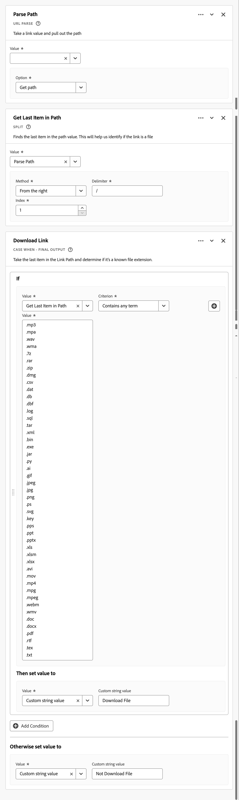
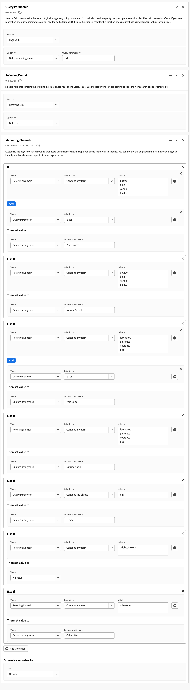
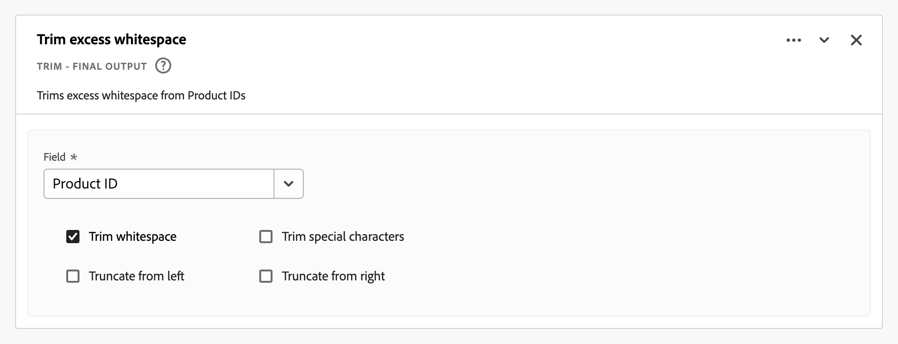

# Abgeleitete Felder {#derived-fields}

<!-- markdownlint-disable MD034 -->

>[!CONTEXTUALHELP]
>id="dataview_derivedfields"
>title="Abgeleitete Felder"
>abstract="Mit einem abgeleiteten Feld können Sie mithilfe eines anpassbaren Regel-Builders spontan Datenmanipulationen definieren. Anschließend können Sie dieses abgeleitete Feld als Komponente (Metrik oder Dimension) in Workspace verwenden oder in der Datenansicht als Komponente weiter definieren."

<!-- markdownlint-enable MD034 -->

Abgeleitete Felder sind ein wichtiger Aspekt der Echtzeitberichterstellungsfunktion in Adobe Customer Journey Analytics. Mit einem abgeleiteten Feld können Sie mithilfe eines anpassbaren Regel-Builders spontan (häufig komplexe) Datenmanipulationen definieren. Sie können dieses abgeleitete Feld dann als Komponente (Metrik oder Dimension) in [Workspace verwenden ](../../analysis-workspace/home.md) das abgeleitete Feld sogar als Komponente in der [Datenansicht“ ](../data-views.md).

Abgeleitete Felder können erheblich Zeit und Aufwand sparen, im Vergleich zur Umwandlung oder Bearbeitung Ihrer Daten an anderen Orten außerhalb von Customer Journey Analytics. Beispielsweise [Datenvorbereitung](https://experienceleague.adobe.com/docs/experience-platform/data-prep/home.html?lang=de), [Data Distiller](https://experienceleague.adobe.com/docs/experience-platform/query/data-distiller/overview.html) oder innerhalb Ihrer eigenen ETL-Prozesse (Extract Transform Load)/ELT (Extract Load Transform) .

Abgeleitete Felder werden in [Datenansichten](../data-views.md) definiert, basieren auf einem Satz von Funktionen, die als Regeln definiert und auf verfügbare Standard- und/oder Schemafelder angewendet werden.

Beispielhafte Anwendungsfälle sind:

- Definieren Sie ein abgeleitetes Seitennamenfeld, das falsche erfasste Seitennamenwerte korrigiert, um Seitennamenwerte zu korrigieren.

- Definieren Sie ein abgeleitetes Marketing-Kanal-Feld, das den richtigen Marketing-Kanal auf der Grundlage einer oder mehrerer Bedingungen bestimmt (z. B. URL-Parameter, Seiten-URL, Seitenname).

## Schnittstelle für abgeleitetes Feld {#interface}

Wenn Sie ein abgeleitetes Feld erstellen oder bearbeiten, verwenden Sie die Oberfläche für abgeleitete Felder.

|  | Name | Beschreibung |
|---------|----------|--------|
| 1 | **selector** | Sie verwenden den Auswahlbereich, um Ihre Funktion, Funktionsvorlage, das Schemafeld oder das Standardfeld auszuwählen und per Drag-and-Drop auf den Regel-Builder zu ziehen.  Verwenden Sie die Dropdown-Liste, um Folgendes auszuwählen:   [!UICONTROL Funktionen] - Listen der verfügbaren [Funktionen](#function-reference),  [!UICONTROL  Funktionsvorlagen] - Listen der verfügbaren [Funktionsvorlagen](#function-templates),   [!UICONTROL  Schemafeldsymbol] - Listen der in Datensatzkategorien (Ereignis, Profil, Suche) und zuvor definierten abgeleiteten Feldern verfügbaren Felder und   - Verfügbare Felder (wie Platform-Datensatz-ID). In der Auswahl werden nur Zeichenfolgen- und numerische Standardfelder angezeigt. Wenn die Funktion andere Datentypen unterstützt, können Standardfelder mit diesen anderen Datentypen für Werte oder Felder in der Regelschnittstelle ausgewählt werden. Sie können mithilfe des Suchfelds (Suchsymbol) nach Funktion, Funktionsvorlagen, Schema .  Sie können die ausgewählte Objektliste filtern, indem Sie  auswählen und im Dialogfeld [!UICONTROL Felder filtern nach] Filter angeben. Sie können Filter einfach mit dem Symbol  für jeden Filter entfernen. |
| 2 | **Regel-Builder** | Das abgeleitete Feld wird sequenziell mit einer oder mehreren Regeln erstellt. Eine Regel ist eine spezifische Implementierung einer Funktion und wird daher immer nur einer Funktion zugeordnet. Sie erstellen eine Regel, indem Sie eine Funktion per Drag-and-Drop in den Regel-Builder ziehen. Der Funktionstyp bestimmt die Schnittstelle der Regel. Weitere Informationen finden Sie in Regelschnittstelle).  Sie können eine Funktion am Anfang, Ende oder zwischen Regeln einfügen, die bereits im Regel-Builder verfügbar sind. Die letzte Regel im Regel-Builder bestimmt die endgültige Ausgabe des abgeleiteten Felds. |
| 3 | **[!UICONTROL ** Feldeinstellungen **]** | Sie können Ihr abgeleitetes Feld benennen und beschreiben und seinen Feldtyp überprüfen. |
| 4 | **[!UICONTROL ** Endgültige Ausgabe **]** | Dieser Bereich zeigt eine spontan aktualisierte Vorschau der Ausgabewerte, basierend auf den Daten der letzten 30 Tage und den Änderungen, die Sie an dem abgeleiteten Feld im Regel-Builder vornehmen. |

{style="table-layout:auto"}

## Assistent für Feldvorlagen {#wizard}

Beim erstmaligen Zugriff auf die Benutzeroberfläche für abgeleitete Felder wird der [!UICONTROL Mit einer Feldvorlage beginnen] angezeigt.

1. Wählen Sie die Vorlage aus, die den Feldtyp, den Sie erstellen möchten, am besten beschreibt.
2. Klicken Sie auf **[!UICONTROL ** Auswählen **]**, um fortzufahren.

Das Dialogfeld für das abgeleitete Feld wird mit Regeln (und Funktionen) gefüllt, die für den ausgewählten Feldtyp erforderlich oder nützlich sind. Weitere [ zu den verfügbaren Vorlagen finden ](#function-templates) unter „Funktionsvorlagen“.

## Regelschnittstelle {#rules}

Wenn Sie eine Regel im Regel-Builder definieren, verwenden Sie die Regelschnittstelle.

|  | Name | Beschreibung |
|---------|----------|--------|
| A  | **Regelname** | Standardmäßig lautet der Regelname **Regel X** (X verweist auf eine Sequenznummer). Um den Namen einer Regel zu bearbeiten, wählen Sie ihren Namen aus und geben Sie den neuen Namen ein, z. B. `Query Parameter`. |
| B | **Funktionsname** | Der ausgewählte Funktionsname für die Regel, z. B. [!UICONTROL URL PARSE]. Wenn die Funktion die letzte in der Sequenz der Funktionen ist und die endgültigen Ausgabewerte bestimmt, folgt auf den Funktionsnamen [!UICONTROL - ENDGÜLTIGE AUSGABE], zum Beispiel [!UICONTROL URL PARSE - ENDGÜLTIGE AUSGABE].  Um ein Popup mit weiteren Informationen zur Funktion anzuzeigen, wählen Sie  aus. |
| C  | **Regelbeschreibung** | Sie können optional eine Beschreibung zu einer Regel hinzufügen. Klicken Sie auf  und wählen Sie dann **[!UICONTROL ** Beschreibung hinzufügen **]** aus, um eine Beschreibung hinzuzufügen, oder **[!UICONTROL ** Beschreibung bearbeiten **]**, um eine vorhandene Beschreibung zu bearbeiten. Verwenden Sie den Editor, um eine Beschreibung einzugeben. Sie können den Text mithilfe der Symbolleiste formatieren (Stilauswahl, Fett, Kursiv, Unterstrichen, Rechts, Links, Zentriert, Farbe, Zahlenliste, Aufzählungsliste) und Links zu externen Informationen hinzufügen.  Um die Bearbeitung der Beschreibung abzuschließen, klicken Sie außerhalb des Editors. |
| D | **Funktionsbereich** | Definiert die Logik der Funktion. Die Schnittstelle hängt vom Typ der Funktion ab. Das Dropdown-Menü für [!UICONTROL Feld] oder [!UICONTROL Wert] zeigt alle verfügbaren Feldkategorien (Regeln, Standardfelder, Felder) basierend auf dem von der Funktion erwarteten Eingabetyp an. Alternativ können Sie ein Feld aus der Auswahl Schema und Standardfelder per Drag-and-Drop auf ein Feld oder einen Wert ziehen. Wenn dieses gezogene Feld aus einem Lookup-Datensatz stammt, wird automatisch eine Lookup-Funktion vor der von Ihnen definierten Funktion eingefügt.  Siehe [Funktionsreferenz](#function-reference) mit detaillierten Informationen zu den einzelnen unterstützten Funktionen. |

{style="table-layout:auto"}

## Erstellen eines abgeleiteten Felds {#create}

1. Wählen Sie eine vorhandene Datenansicht aus oder erstellen Sie eine Datenansicht. Weitere Informationen finden [ unter ](../data-views.md)Datenansichten“.

2. Wählen Sie die **[!UICONTROL ** Komponenten **]** der Datenansicht aus.

3. Wählen **[!UICONTROL ** Abgeleitetes Feld erstellen **]** in der linken Leiste aus.

4. Um Ihr abgeleitetes Feld zu definieren, verwenden Sie die Schnittstelle [!UICONTROL Abgeleitetes Feld erstellen]. Siehe [Oberfläche für abgeleitete Felder](#derived-field-interface).

   Wählen Sie zum Speichern des neuen abgeleiteten Felds **[!UICONTROL ** Speichern **]** aus.

5. Das neue abgeleitete Feld wird dem Container [!UICONTROL Abgeleitete Felder >] als Teil der **[!UICONTROL ** Schemafelder **]** in der linken Leiste der Datenansicht hinzugefügt.

## Abgeleitetes Feld bearbeiten {#edit}

1. Eine vorhandene Datenansicht auswählen. Weitere Informationen finden [ unter ](../data-views.md)Datenansichten“.

2. Wählen Sie die **[!UICONTROL ** Komponenten **]** der Datenansicht aus.

3. Wählen Sie **[!UICONTROL ** Registerkarte **]** Schemafelder“ im Bereich [!UICONTROL Verbindung] auf der linken Seite aus.

4. Wählen Sie **[!UICONTROL ** Abgeleitete Felder > Container **]**.

5. Bewegen Sie den Mauszeiger über das abgeleitete Feld, das Sie bearbeiten möchten, und wählen Sie  aus.

6. Verwenden Sie zum Bearbeiten des abgeleiteten Felds die [!UICONTROL Abgeleitetes Feld bearbeiten]. Siehe [Oberfläche für abgeleitete Felder](#derived-field-interface).

   - Wählen Sie **[!UICONTROL ** Speichern **]**, um das aktualisierte abgeleitete Feld zu speichern.

   - Wählen Sie **[!UICONTROL ** Abbrechen **]**, um alle Änderungen zu verwerfen, die Sie am abgeleiteten Feld vorgenommen haben.

   - Wählen **[!UICONTROL ** Speichern unter **]**, um das abgeleitete Feld als neues abgeleitetes Feld zu speichern. Das neue abgeleitete Feld hat denselben Namen wie das ursprünglich bearbeitete abgeleitete Feld, dem `(copy)` hinzugefügt wurden.

Alternativ können Sie ein abgeleitetes Feld als Komponente für Dimensionen oder Metriken in Ihrer Datenansicht verwenden:

1. Wählen Sie die Komponente aus. Beachten Sie, dass die Komponente möglicherweise einen anderen Namen als das abgeleitete Feld hat.

1. Wählen Sie im Bedienfeld Komponente das  neben Ihrem abgeleiteten Feld unter dem Feldnamen Schema aus.

1. Verwenden Sie zum Bearbeiten des abgeleiteten Felds die [!UICONTROL Abgeleitetes Feld bearbeiten]. Siehe [Oberfläche für abgeleitete Felder](#derived-field-interface).

   - Wählen Sie **[!UICONTROL ** Speichern **]**, um das aktualisierte abgeleitete Feld zu speichern.

   - Wählen Sie **[!UICONTROL ** Abbrechen **]**, um alle Änderungen zu verwerfen, die Sie am abgeleiteten Feld vorgenommen haben.

   - Wählen **[!UICONTROL ** Speichern unter **]**, um das abgeleitete Feld als neues abgeleitetes Feld zu speichern. Das neue abgeleitete Feld hat denselben Namen wie das ursprünglich bearbeitete abgeleitete Feld, dem `(copy)` hinzugefügt wurden.

## Löschen eines abgeleiteten Felds {#delete}

1. Eine vorhandene Datenansicht auswählen. Weitere Informationen finden [ unter ](../data-views.md)Datenansichten“.

2. Wählen Sie die **[!UICONTROL ** Komponenten **]** der Datenansicht aus.

3. Wählen Sie **[!UICONTROL ** Registerkarte **]** Schemafelder“ im Bereich [!UICONTROL Verbindung] aus.

4. Wählen Sie **[!UICONTROL ** Abgeleitete Felder > Container **]**.

5. Bewegen Sie den Mauszeiger über das abgeleitete Feld, das Sie löschen möchten, und wählen Sie .

6. Wählen Sie in der [!UICONTROL Abgeleitetes Feld bearbeiten] die Option **[!UICONTROL Löschen]** aus.

   In [!UICONTROL  Dialogfeld „Komponente ]&quot; werden Sie aufgefordert, den Löschvorgang zu bestätigen. Eventuell vorhandene externe Verweise auf das abgeleitete Feld außerhalb der Datenansicht.

   - Wählen Sie **[!UICONTROL ** Fortfahren **]**, um das abgeleitete Feld zu löschen.

Alternativ können Sie ein abgeleitetes Feld als Komponente für Dimensionen oder Metriken in Ihrer Datenansicht verwenden:

1. Wählen Sie die Komponente aus. Beachten Sie, dass die Komponente möglicherweise einen anderen Namen als das abgeleitete Feld hat.

1. Wählen Sie im Bedienfeld Komponente das  neben Ihrem abgeleiteten Feld unter dem Feldnamen Schema aus.

1. Wählen Sie in der [!UICONTROL Abgeleitetes Feld bearbeiten] die Option **[!UICONTROL Löschen]** aus.

   In [!UICONTROL  Dialogfeld „Komponente ]&quot; werden Sie aufgefordert, den Löschvorgang zu bestätigen. Eventuell vorhandene externe Verweise auf das abgeleitete Feld außerhalb der Datenansicht.

   - Wählen Sie **[!UICONTROL ** Fortfahren **]**, um das abgeleitete Feld zu löschen.

>[!NOTE]
>
>Abgeleitete Felder werden in Customer Journey Analytics auf Verbindungsebene verwaltet. Jede Änderung an einem abgeleiteten Feld in einer der mit dieser Verbindung verknüpften Datenansichten gilt für alle diese verknüpften Datenansichten.

## Funktionsvorlagen {#templates}

Um schnell ein abgeleitetes Feld für bestimmte Anwendungsfälle zu erstellen, stehen Funktionsvorlagen zur Verfügung. Auf diese Funktionsvorlagen kann über den Auswahlbereich in der Benutzeroberfläche für abgeleitete Felder zugegriffen werden. Sie werden bei der ersten Verwendung im Assistenten [!UICONTROL Mit einer Feldvorlage beginnen] angezeigt.

### Marketing-Kanäle {#mchannel}

Diese Funktionsvorlage verwendet eine Sammlung von Regeln, um Marketing-Kanäle zu erstellen.

+++ Details

Um die Vorlage zu verwenden, müssen Sie die richtigen Parameter für jede Funktion angeben, die als Teil der Regeln in der Vorlage aufgeführt ist. Weitere Informationen finden [ unter ](#function-reference)Funktionsreferenz“.

+++

### Bounces {#bounces}

Diese Funktionsvorlage verwendet eine Sammlung von Regeln, um Website-Bounces zu identifizieren.

+++ Details

{{select-package}}

Um die Vorlage zu verwenden, müssen Sie die richtigen Parameter für jede Funktion angeben, die als Teil der Regeln in der Vorlage aufgeführt ist. Weitere Informationen finden [ unter ](#function-reference)Funktionsreferenz“.

+++

### Mehrdimensionales Kombinieren {#multi-dim}

Diese Funktionsvorlage kombiniert zwei Werte zu einem.

+++ Details

{{select-package}}

Um die Vorlage zu verwenden, müssen Sie die richtigen Parameter für jede Funktion angeben, die als Teil der Regeln in der Vorlage aufgeführt ist. Weitere Informationen finden [ unter ](#function-reference)Funktionsreferenz“.

+++

### Anzeigename des Datensatzes {#friendlyname}

Diese Funktionsvorlage stellt einen lesbaren Datensatznamen bereit.

+++ Details

{{select-package}}

Um die Vorlage zu verwenden, müssen Sie die richtigen Parameter für jede Funktion angeben, die als Teil der Regeln in der Vorlage aufgeführt ist. Weitere Informationen finden [ unter ](#function-reference)Funktionsreferenz“.

+++

### Seitenname aus URL {#pagename}

Diese Funktionsvorlage erstellt einen einfachen Seitennamen.

+++ Details

{{select-package}}

Um die Vorlage zu verwenden, müssen Sie die richtigen Parameter für jede Funktion angeben, die als Teil der Regeln in der Vorlage aufgeführt ist. Weitere Informationen finden [ unter ](#function-reference)Funktionsreferenz“.

+++

### Urlaubssaison {#holiday}

Diese Funktionsvorlage klassifiziert Schlüsselzeiten des Jahres.

+++ Details

{{select-package}}

Um die Vorlage zu verwenden, müssen Sie die richtigen Parameter für jede Funktion angeben, die als Teil der Regeln in der Vorlage aufgeführt ist. Weitere Informationen finden [ unter ](#function-reference)Funktionsreferenz“.

+++

### Monatliche Ziele {#goals}

Diese Funktionsvorlage legt benutzerdefinierte monatliche Ziele fest.

+++ Details

{{select-package}}

Um die Vorlage zu verwenden, müssen Sie die richtigen Parameter für jede Funktion angeben, die als Teil der Regeln in der Vorlage aufgeführt ist. Weitere Informationen finden [ unter ](#function-reference)Funktionsreferenz“.

+++

### Alle Werte in durch Trennzeichen getrennter Liste abrufen {#allvalues}

Diese Funktionsvorlage konvertiert eine begrenzte Liste in ein Array.

+++ Details

{{select-package}}

Um die Vorlage zu verwenden, müssen Sie die richtigen Parameter für jede Funktion angeben, die als Teil der Regeln in der Vorlage aufgeführt ist. Weitere Informationen finden [ unter ](#function-reference)Funktionsreferenz“.

+++

### Ersten Wert in durch Trennzeichen getrennter Liste abrufen {#firstvalue}

Diese Funktionsvorlage ruft den ersten Wert in einer durch Trennzeichen getrennten Liste ab.

+++ Details

{{select-package}}

Um die Vorlage zu verwenden, müssen Sie die richtigen Parameter für jede Funktion angeben, die als Teil der Regeln in der Vorlage aufgeführt ist. Weitere Informationen finden [ unter ](#function-reference)Funktionsreferenz“.

+++

### Letzten Wert in durch Trennzeichen getrennter Liste abrufen {#lastvalue}

Diese Funktionsvorlage ruft den letzten Wert in einer durch Trennzeichen getrennten Liste ab.

+++ Details

{{select-package}}

Um die Vorlage zu verwenden, müssen Sie die richtigen Parameter für jede Funktion angeben, die als Teil der Regeln in der Vorlage aufgeführt ist. Weitere Informationen finden [ unter ](#function-reference)Funktionsreferenz“.

+++

### Domänenname {#domain}

Diese Funktionsvorlage extrahiert den Domain-Namen mithilfe eines regulären Ausdrucks.

+++ Details

{{select-package}}

Um die Vorlage zu verwenden, müssen Sie die richtigen Parameter für jede Funktion angeben, die als Teil der Regeln in der Vorlage aufgeführt ist. Weitere Informationen finden [ unter ](#function-reference)Funktionsreferenz“.

+++

### Abfragezeichenfolgenparameter abrufen {#querystring}

Diese Funktionsvorlage extrahiert Werte der Abfragezeichenfolge.

+++ Details

{{select-package}}

Um die Vorlage zu verwenden, müssen Sie die richtigen Parameter für jede Funktion angeben, die als Teil der Regeln in der Vorlage aufgeführt ist. Weitere Informationen finden [ unter ](#function-reference)Funktionsreferenz“.

+++

### Übergangsfeld {#transition}

Diese Funktionsvorlage überträgt Berichte von einem Feld in ein anderes.

+++ Details

{{select-package}}

Um die Vorlage zu verwenden, müssen Sie die richtigen Parameter für jede Funktion angeben, die als Teil der Regeln in der Vorlage aufgeführt ist. Weitere Informationen finden [ unter ](#function-reference)Funktionsreferenz“.

+++

### Einfache Bot-Erkennung {#botdetection}

Diese Funktionsvorlage implementiert die Erkennung von Lichtbots.

+++ Details

{{select-package}}

Um die Vorlage zu verwenden, müssen Sie die richtigen Parameter für jede Funktion angeben, die als Teil der Regeln in der Vorlage aufgeführt ist. Weitere Informationen finden [ unter ](#function-reference)Funktionsreferenz“.

+++

### Exitlink {#exit}

Diese Funktionsvorlage identifiziert den zuletzt in einer Sitzung angeklickten Link.

+++ Details

{{select-package}}

Um die Vorlage zu verwenden, müssen Sie die richtigen Parameter für jede Funktion angeben, die als Teil der Regeln in der Vorlage aufgeführt ist. Weitere Informationen finden [ unter ](#function-reference)Funktionsreferenz“.

+++

### Downloadlink {#download}

Diese Funktionsvorlage kennzeichnet allgemeine Download-Links.

+++ Details

{{select-package}}

Um die Vorlage zu verwenden, müssen Sie die richtigen Parameter für jede Funktion angeben, die als Teil der Regeln in der Vorlage aufgeführt ist. Weitere Informationen finden [ unter ](#function-reference)Funktionsreferenz“.

+++

<!--

+++ Data clean up template

>[!WARNING]
>
>Could not find any information on this template.
+++

-->

## Funktionsverweis {#functionref}

{{select-package}}

Details zu jeder unterstützten Funktion finden Sie unten unter:

- Spezifikationen:
   - Eingabedatentyp: Art der unterstützten Daten,
   - Eingabe: mögliche Werte für Eingabe,
   - Enthaltene Operatoren: Für diese Funktion unterstützte Operatoren (falls vorhanden),
   - Einschränkungen: Einschränkungen, die für diese spezifische Funktion gelten,
   - Ausgabe.

- Anwendungsfälle, einschließlich:
   - Daten vor dem Definieren des abgeleiteten Felds,
   - wie das abgeleitete Feld definiert wird,
   - Daten nach der Definition des abgeleiteten Felds.

- Einschränkungen (falls zutreffend).

<!-- CASE WHEN -->

### Fall wenn {#casewhen}

<!-- markdownlint-disable MD034 -->

>[!CONTEXTUALHELP]
>id="dataview_derivedfields_casewhen"
>title="Fall wenn"
>abstract="Diese Funktion bietet die Möglichkeit, Bedingungen anzuwenden, die auf definierten Kriterien aus einem oder mehreren Feldern basieren. Anhand dieser Kriterien werden dann die Werte im neuen abgeleiteten Feld auf Grundlage der Reihenfolge der Bedingungen definiert."

<!-- markdownlint-enable MD034 -->

Wendet Bedingungen basierend auf definierten Kriterien aus einem oder mehreren Feldern an. Diese Kriterien werden dann verwendet, um die Werte in einem neuen abgeleiteten Feld auf der Grundlage der Reihenfolge der Bedingungen zu definieren.

+++ Details

## Spezifikationen {#casewhen-io}

| Eingabedatentyp | Eingabe | Enthaltene Operatoren | Einschränkungen | Ausgabe |
|---|---|---|---|---|
| <ul><li>Zeichenfolge</li><li>Numerisch</li><li>Datum</li></ul> | <ul><li>[!UICONTROL If], [!UICONTROL Else If]-Container:
<ul><li>[!UICONTROL Wert]</li><ul><li>Regeln</li><li>Standardfelder</li><li>Felder</li></ul><li>[!UICONTROL Kriterium] (siehe eingeschlossene Operatoren, basierend auf ausgewähltem Werttyp)</li></ul></li><li>[!UICONTROL Setzen Sie dann den Wert auf], [!UICONTROL andernfalls setzen Sie den Wert auf]:
<ul><li>[!UICONTROL Wert]</li><ul><li>Regeln</li><li>Standardfelder</li><li>Felder</li></ul></ul></li></ul> | 
Zeichenfolgen
<ul><li>Gleich</li><li>Gleich jedem Begriff</li><li>Enthält die Wortgruppe</li><li>Enthält einen der Begriffe</li><li>Enthält alle Begriffe</li><li>Beginnt mit</li><li>Beginnt mit einem beliebigen Begriff</li><li>Endet mit</li><li>Endet mit einem beliebigen Begriff</li><li>Ist nicht gleich</li><li>Entspricht keinem Begriff</li><li>Enthält nicht die Wortgruppe</li><li>Enthält keine Begriffe</li><li>Enthält nicht alle Begriffe</li><li>Beginnt nicht mit</li><li>Beginnt mit keinem Begriff</li><li>Endet nicht mit</li><li>Endet mit keinem Begriff</li><li>Ist eingestellt</li><li>Ist nicht eingestellt</li></ul>
Numerisch
<ul><li>Gleich</li><li>Ist nicht gleich</li><li>Größer als</li><li>Größer als oder gleich</li><li>Kleiner als</li><li>Kleiner als oder gleich</li><li>Ist eingestellt</li><li>Ist nicht eingestellt</li></ul>
Daten 
<ul><li>Gleich</li><li>Ist nicht gleich</li><li>ist später als</li><li>Ist später als oder gleich</li><li>ist vor</li><li>Ist vor oder gleich</li><li>Ist eingestellt</li><li>Ist nicht eingestellt</li></ul> | <ul><li>5 Funktionen pro abgeleitetem Feld</li><li>200 [Operatoren](#operators) pro abgeleitetem Feld. Ein Beispiel für einen einzelnen Operator ist „Verweisende Domain enthält Google“. </li></ul> | 
Neues abgeleitetes Feld
 |

{style="table-layout:auto"}

## Anwendungsfall 1 {#casewhen-uc1}

Sie möchten Regeln definieren, um verschiedene Marketing-Kanäle zu identifizieren, indem Sie eine kaskadierende Logik anwenden, um ein Feld für einen Marketing-Kanal auf den richtigen Wert festzulegen:

- Wenn der Referrer von einer Suchmaschine stammt und die Seite einen Abfragezeichenfolgenwert hat, in dem `cid` `ps_` enthält, sollte der Marketing-Kanal als &quot;[!DNL *Suche“*] werden.
- Wenn der Referrer von einer Suchmaschine stammt und die Seite nicht über die Abfragezeichenfolge `cid` verfügt, sollte der Marketing-Kanal als &quot;[!DNL *Suche“*] werden.
- Wenn eine Seite einen Abfragezeichenfolgenwert hat, in dem `cid` `em_` enthält, sollte der Marketing-Kanal als „E-[!DNL *&quot;*] werden.
- Wenn eine Seite einen Abfragezeichenfolgenwert hat, in dem `cid` `ds_` enthält, sollte der Marketing-Kanal als [!DNL *Display-Anzeige“ identifiziert*].
- Wenn eine Seite einen Abfragezeichenfolgenwert hat, in dem `cid` `so_` enthält, sollte der Marketing-Kanal als &quot;[!DNL *Social“*] werden.
- Wenn der Referrer von einer verweisenden Domain wie [!DNL twitter.com], [!DNL facebook.com], [!DNL linkedin.com] oder [!DNL tiktok.com] stammt, sollte der Marketing-Kanal als &quot;[!DNL *Social“*] werden.
- Wenn keine der oben genannten Regeln zutrifft, sollte der Marketing-Kanal als &quot;[!DNL *Referrer“ identifiziert*].

Wenn Ihre Site die folgenden Beispielereignisse erhält, die [!UICONTROL Referrer] und [!UICONTROL Seiten-URL] enthalten, sollten diese Ereignisse wie folgt identifiziert werden:

| [!DNL Event] | [!DNL Referrer] | [!DNL Page URL] | [!DNL Marketing Channel] |
|:--:|----|----|----|
| 1 | `https://facebook.com` | `https://site.com/home` | [!DNL Natural Social] |
| 2 | `https://abc.com` | `https://site.com/?cid=ds_12345678` | [!DNL Display] |
| 3 | | `https://site.com/?cid=em_12345678` | [!DNL Email] |
| 4 | `https://google.com` | `https://site.com/?cid=ps_abc098765` | [!DNL Paid Search] |
| 5 | `https://google.com` | `https://site.com/?cid=em_765544332` | [!DNL Email] |
| 6 | `https://google.com` |  | [!DNL Natural Search] |

{style="table-layout:auto"}

### Daten vor {#casewhen-uc1-databefore}

| [!DNL Referrer] | [!DNL Page URL] |
|----|----|
| `https://facebook.com` | `https://site.com/home` |
| `https://abc.com` | `https://site.com/?cid=ds_12345678` |
|  | `https://site.com/?cid=em_12345678` |
| `https://google.com` | `https://site.com/?cid=ps_abc098765` |
| `https://google.com` | `https://site.com/?cid=em_765544332` |
| `https://google.com` | |

{style="table-layout:auto"}

### Abgeleitetes Feld {#casewhen-uc1-derivedfield}

Sie definieren ein `Marketing Channel` Feld. Mit der FUNKTION [!UICONTROL WENN“ ] Sie Regeln definieren, anhand derer Werte für die basierend auf vorhandenen Werten sowohl für das `Page URL`- als auch für `Referring URL` Feld erstellt werden.

Beachten Sie die Verwendung der Funktion [!UICONTROL URL PARSE] zum Definieren von Regeln, um die Werte für `Page Url` und `Referring Url` abzurufen, bevor die Regeln [!UICONTROL CASE WHEN] angewendet werden.

### Daten nach {#casewhen-uc1-dataafter}

| [!DNL Marketing Channel] |
|----|
| [!DNL Natural Social] |
| [!DNL Display] |
| [!DNL Email] |
| [!DNL Paid Search] |
| [!DNL Email] |
| [!DNL Natural Search] |

{style="table-layout:auto"}

## Anwendungsfall 2 {#casewhen-uc2}

Sie haben mehrere verschiedene Varianten der Suche innerhalb Ihrer [!DNL Product Finding Methods] Dimension erfasst. Um die Gesamtleistung der Suche im Vergleich zum Durchsuchen zu verstehen, müssen Sie viel Zeit damit verbringen, die Ergebnisse manuell zu kombinieren.

Ihre Site erfasst die folgenden Werte für Ihre [!DNL Product Finding Methods]. Am Ende geben alle diese Werte eine Suche an.

| Erfasster Wert | Tatsächlicher Wert |
|---|---|
| [!DNL search p13n_no] | [!DNL search] |
| [!DNL search p13n_yes] | [!DNL search] |
| [!DNL search refine p13n_no] | [!DNL search] |
| [!DNL search refine p13n_yes] | [!DNL search] |
| [!DNL search redirect p13n_yes] | [!DNL search] |
| [!DNL search-redirect] | [!DNL search] |

{style="table-layout:auto"}

### Daten vor {#casewhen-uc2-databefore}

| [!DNL Product Finding Methods] |
|----|
| [!DNL search p13_no] |
| [!DNL search p13_yes] |
| [!DNL browse] |
| [!DNL search refine p13_no] |
| [!DNL search refine p13_yes] |
| [!DNL browse] |
| [!DNL search redirect p13_yes] |
| [!DNL search-redirect] |
| [!DNL browse] |

{style="table-layout:auto"}

### Abgeleitetes Feld {#casewhen-uc2-derivedfield}

Sie definieren ein `Product Finding Methods (new)` Feld. Sie erstellen die folgenden [!UICONTROL CASE WHEN]-Regeln im Regel-Builder. Diese Regeln wenden Logik auf alle möglichen Varianten der alten [!UICONTROL Produktsuchmethoden] Feldwerte für `search` und `browse` mit dem [!UICONTROL Enthält die Phrase] an.

### Daten nach {#casewhen-uc2-dataafter}

| [!DNL Product Finding Methods (new)] |
|----|
| [!DNL search] |
| [!DNL search] |
| [!DNL browse] |
| [!DNL search] |
| [!DNL search] |
| [!DNL browse] |
| [!DNL search] |
| [!DNL search] |
| [!DNL browse] |

{style="table-layout:auto"}

## Anwendungsfall 3 {#casewhen-uc3}

Als Reiseunternehmen möchten Sie die Reisedauer für gebuchte Reisen in eine Bucket-Liste aufteilen, damit Sie Berichte zu in Buckets zusammengefassten Reiselängen erstellen können.

Annahmen:

- Die Organisation erfasst die Reisedauer in einem numerischen Feld.
- Sie möchten die Dauer von 1-3 Tagen in einen Behälter namens &quot;[!DNL short trip]&quot; einteilen
- Sie möchten die Dauer von 4-7 Tagen in einen Behälter namens &quot;[!DNL medium trip]&quot; einteilen
- Sie möchten die Dauer von mehr als 8 Tagen in einen Behälter namens &quot;[!DNL long trip]&quot; packen
- 132 Fahrten wurden für eine Dauer von 1 Tag gebucht
- 110 Fahrten wurden für eine 2-tägige Dauer gebucht
- 105 Fahrten wurden für eine 3-tägige Dauer gebucht
- 99 Fahrten wurden für eine 4-tägige Dauer gebucht
- 92 Fahrten wurden für eine 5-tägige Dauer gebucht
- 85 Fahrten wurden für eine 6-tägige Dauer gebucht
- 82 Fahrten wurden für eine Dauer von 7 Tagen gebucht
- 78 Fahrten wurden für eine Dauer von 8 Tagen gebucht
- 50 Fahrten wurden für eine 9-tägige Dauer gebucht
- 44 Fahrten wurden für eine Dauer von 10 Tagen gebucht
- 38 Fahrten wurden für eine Dauer von 11 Tagen gebucht
- 31 Fahrten wurden für eine Dauer von 12 Tagen gebucht

Ihr gewünschter Bericht sollte wie folgt aussehen:

| [!DNL Trip Duration Type] | [!DNL Bookings] |
|----|---:|
| [!DNL medium trip] | 358 |
| [!DNL short trip] | 347 |
| [!DNL long trip] | 241 |

{style="table-layout:auto"}

### Daten vor {#casewhen-uc3-databefore}

| [!DNL Trip Duration] |
|---:|
| 1 |
| 12 |
| 3 |
| 6 |
| 4 |
| 8 |
| 6 |
| 2 |
| 1 |
| 2 |
| 21 |
| 8 |

### Abgeleitetes Feld {#casewhen-uc3-derivedfield}

Sie definieren ein `Trip Duration (bucketed)` Feld. Sie erstellen die folgende [!UICONTROL CASE WHEN]-Regel im Regel-Builder. Diese Regel wendet Logik an, um die alten Werte [!UICONTROL Reisedauer] in drei Werte zu bündeln: `short trip`, `medium  trip` und `long trip`.

### Daten nach {#casewhen-uc3-dataafter}

| [!DNL Trip Duration (bucketed)] |
|---|
| [!DNL short trip] |
| [!DNL long trip] |
| [!DNL short trip] |
| [!DNL medium trip] |
| [!DNL medium trip] |
| [!DNL long trip] |
| [!DNL medium trip] |
| [!DNL short trip] |
| [!DNL short trip] |
| [!DNL short trip] |
| [!DNL long trip] |
| [!DNL long trip] |

## Weitere Informationen {#casewhen-more-info}

Customer Journey Analytics verwendet eine verschachtelte Container-Struktur, die nach dem [XDM](https://experienceleague.adobe.com/docs/experience-platform/xdm/home.html?lang=de) (Experience-Datenmodell) von Adobe Experience Platform modelliert ist. Weitere Hintergrundinformationen finden [ unter ](../create-dataview.md#containers)Container[ und ](../../components/filters/filters-overview.md#filter-containers)Filter-Container“. Dieses Container-Modell ist zwar von Natur aus flexibel, weist aber einige Einschränkungen bei der Verwendung des Regel-Builders auf.

Customer Journey Analytics verwendet das folgende standardmäßige Container-Modell:

Die folgenden Einschränkungen gelten für und werden bei der Auswahl *Auswahl* und *Einstellung* erzwungen.

|  | Begrenzungen |
|:---:|----|
| **A** | Werte *select* innerhalb desselben [!UICONTROL If]-, [!UICONTROL ElseIf]-Konstrukts (mit [!UICONTROL And] oder [!UICONTROL Or]) in einer Regel müssen vom selben Container stammen und können beliebigen Typs sein (Zeichenfolge , numerische  usw.).   |
| **B** | Alle Werte, *Sie in* Regel festlegen, müssen aus demselben Container stammen und denselben Typ oder einen abgeleiteten Wert desselben Typs aufweisen.    |
| **C** | Die von *ausgewählten Werte* den Konstrukten [!UICONTROL If], [!UICONTROL Else If] in der Regel müssen ** aus demselben Container stammen und ** müssen vom gleichen Typ sein.    |

{style="table-layout:auto"}

+++

<!-- CLASSIFY -->

### Klassifizieren {#classify}

<!-- markdownlint-disable MD034 -->

>[!CONTEXTUALHELP]
>id="dataview_derivedfields_classify"
>title="Klassifizieren"
>abstract="Diese Funktion bietet die Möglichkeit, einen Satz von Werten zu definieren, die per Texteingabe durch entsprechende Werte ersetzt werden."

<!-- markdownlint-enable MD034 -->

Definiert einen Satz von Werten, die in einem neuen abgeleiteten Feld durch entsprechende Werte ersetzt werden.

+++ Details

## Spezifikationen {#classify-io}

| Eingabedatentyp | Eingabe | Enthaltene Operatoren | Einschränkungen | Ausgabe |
|---|---|---|---|---|
| <ul><li>Zeichenfolge</li><li>Numerisch</li><li>Datum</li></ul> | <ul><li>[!UICONTROL Zu klassifizierendes Feld]:<ul><li>Regeln</li><li>Standardfelder</li><li>Felder</li></ul></li><li>[!UICONTROL Wenn Wert gleich ist] und [!UICONTROL Werte ersetzen durch]:
<ul><li>Zeichenfolge</li></ul><li>Originalwerte anzeigen<ul><li>Boolesch</li></ul></li></ul> | 
-/-
 | <ul><li>5 Funktionen pro abgeleitetem Feld</li><li>200 [Operatoren](#operators) pro abgeleitetem Feld. Jeder Eintrag für [!UICONTROL Wenn Wert gleich Ausgangswert ist] [!UICONTROL Wert durch neuen Wert ersetzen] wird als Vorgang betrachtet.</li></ul> | 
Neues abgeleitetes Feld
 |

{style="table-layout:auto"}

## Anwendungsfall 1 {#classify-uc1}

Sie haben eine CSV-Datei, die eine Schlüsselspalte für `hotelID` und eine oder mehrere zusätzliche Spalten enthält, die mit dem `hotelID` verknüpft sind: `city`, `rooms`, `hotel name`.
Sie erfassen [!DNL Hotel ID] in einer Dimension, möchten jedoch eine [!DNL Hotel Name] Dimension erstellen, die aus der `hotelID` in der CSV-Datei abgeleitet wurde.

**CSV-Dateistruktur und -inhalt**

| [!DNL hotelID] | [!DNL city] | [!DNL rooms] | [!DNL hotel name] |
|---|---|---:|---|
| [!DNL SLC123] | [!DNL Salt Lake City] | 40 | [!DNL SLC Downtown] |
| [!DNL LAX342] | [!DNL Los Angeles] | 60 | [!DNL LA Airport] |
| [!DNL SFO456] | [!DNL San Francisco] | 75 | [!DNL Market Street] |
| [!DNL AMS789] | [!DNL Amsterdam] | 50 | [!DNL Okura] |

{style="table-layout:auto"}

**Aktueller Bericht**

| [!DNL Hotel ID] | Produktansichten |
|---|---:|
| [!DNL SLC123] | 200 |
| [!DNL LX342] | 198 |
| [!DNL SFO456] | 190 |
| [!DNL AMS789] | 150 |

{style="table-layout:auto"}

**Gewünschter Bericht**

| [!DNL Hotel Name] | Produktansichten |
|----|----:|
| [!DNL SLC Downtown] | 200 |
| [!DNL LA Airport] | 198 |
| [!DNL Market Street] | 190 |

{style="table-layout:auto"}

### Daten vor {#classify-uc1-databefore}

| [!DNL Hotel ID] |
|----|
| [!DNL SLC123] |
| [!DNL LAX342] |
| [!DNL SFO456] |
| [!DNL AMS789] |

{style="table-layout:auto"}

### Abgeleitetes Feld {#classify-uc1-derivedfield}

Sie definieren ein `Hotel Name` Feld. Mit der Funktion [!UICONTROL CLASSIFY] können Sie eine Regel definieren, mit der Sie Werte des Felds [!UICONTROL Hotel-ID] klassifizieren und durch neue Werte ersetzen können.

Wenn Sie Originalwerte einbeziehen möchten, die Sie nicht als Teil der zu klassifizierenden Werte definiert haben (z. B. Hotel ID AMS789), stellen Sie sicher, dass Sie **[!UICONTROL Originalwerte anzeigen]** auswählen. Dadurch wird sichergestellt, dass AMS789 Teil der Ausgabe für das abgeleitete Feld ist, obwohl dieser Wert nicht klassifiziert ist.

### Daten nach {#classify-uc1-dataafter}

| [!DNL Hotel Name] |
|----|
| [!DNL SLC Downtown] |
| [!DNL LA Airport] |
| [!DNL Market Street] |

{style="table-layout:auto"}

## Anwendungsfall 2 {#classify-uc2}

Für mehrere Seiten wurden URLs anstelle des Anzeigenamens erfasst. Diese gemischte Sammlung von Werten unterbricht das Reporting.

### Daten vor {#classify-uc2-databefore}

| [!DNL Page Name] |
|---|
| [!DNL Home Page] |
| [!DNL Flight Search] |
| `http://www.adobetravel.ca/Hotel-Search` |
| `https://www.adobetravel.com/Package-Search` |
| [!DNL Deals & Offers] |
| `http://www.adobetravel.ca/user/reviews` |
| `https://www.adobetravel.com.br/Generate-Quote/preview` |

{style="table-layout:auto"}

### Abgeleitetes Feld {#classify-uc2-derivedfield}

Sie definieren ein `Page Name (updated)` Feld. Mit der Funktion [!UICONTROL CLASSIFY] können Sie eine Regel definieren, mit der Sie Werte Ihres vorhandenen Felds [!UICONTROL Seitenname] klassifizieren und durch aktualisierte korrekte Werte ersetzen können.

### Daten nach {#classify-uc2-dataafter}

| [!DNL Page Name (updated)] |
|---|
| [!DNL Home Page] |
| [!DNL Flight Search] |
| [!DNL Hotel Search] |
| [!DNL Package Search] |
| [!DNL Deals & Offers] |
| [!DNL Reviews] |
| [!DNL Generate Quote] |

## Weitere Informationen {#classify-moreinfo}

Die folgende zusätzliche Funktion ist in der Benutzeroberfläche „Regel klassifizieren“ verfügbar:

- Um schnell alle Tabellenwerte zu löschen, wählen Sie  **[!UICONTROL Alle Tabellenwerte löschen]**.
- Um eine CSV-Datei hochzuladen, die die ursprünglichen Werte für Wenn-Werte gleich und die neuen Werte für „Werte ersetzen mit“ enthält, wählen Sie  **[!UICONTROL CSV hochladen]**.
- Um eine Vorlage zum Erstellen einer CSV-Datei mit ursprünglichen und neuen Werten zum Hochladen herunterzuladen, wählen Sie  **[!UICONTROL CSV-Vorlage herunterladen]**.
- Um eine CSV-Datei herunterzuladen, in der alle ursprünglichen und neuen Werte in der Regelschnittstelle aufgefüllt sind, wählen Sie  **[!UICONTROL CSV-Werte herunterladen]**.

+++

<!-- CONCATENATE -->

### Verketten {#concatenate}

<!-- markdownlint-disable MD034 -->

>[!CONTEXTUALHELP]
>id="dataview_derivedfields_concatenate"
>title="Verketten"
>abstract="Diese Funktion bietet die Möglichkeit, zwei oder mehr Felder, abgeleitete Felder oder benutzerseitig eingegebene Zeichenfolgenwerte in einem Feld mit definierten Trennzeichen zu kombinieren"

<!-- markdownlint-enable MD034 -->

Kombiniert Feldwerte zu einem einzigen neuen abgeleiteten Feld mit definierten Trennzeichen.

+++ Details

## Spezifikationen {#concatenate-io}

| Eingabedatentyp | Eingabe | Enthaltene Operatoren | Einschränkungen | Ausgabe |
|---|---|---|---|---|
| <ul><li>Zeichenfolge</li></ul> | <ul><li>[!UICONTROL Wert]:<ul><li>Regeln</li><li>Standardfelder</li><li>Felder</li><li>Zeichenfolge</li></ul></li><li>[!UICONTROL Trennzeichen]:<ul><li>Zeichenfolge</li></ul></li> </ul> | 
-/-
 | 
2 Funktionen pro abgeleitetem Feld
 | 
Neues abgeleitetes Feld
 |

{style="table-layout:auto"}

## Anwendungsfall {#concatenate-uc}

Derzeit erfassen Sie Ursprungs- und Zielflughafen-Codes als separate Felder. Sie möchten die beiden Felder in einer Dimension kombinieren, die durch einen Bindestrich (-) getrennt ist. So können Sie die Kombination von Herkunft und Ziel analysieren, um die am häufigsten gebuchten Routen zu identifizieren.

Annahmen:

- Ursprungs- und Zielwerte werden in separaten Feldern in derselben Tabelle erfasst.
- Der Benutzer bestimmt, dass das Trennzeichen &quot;-&quot; zwischen den Werten verwendet werden soll.

Stellen Sie sich vor, dass folgende Buchungen stattfinden:

- Kunde ABC123 bucht einen Flug zwischen Salt Lake City (SLC) und Orlando (MCO)
- Kunde ABC456 bucht einen Flug zwischen Salt Lake City (SLC) und Los Angeles (LAX)
- Kunde ABC789 bucht einen Flug zwischen Salt Lake City (SLC) und Seattle (SEA)
- Kunde ABC987 bucht einen Flug zwischen Salt Lake City (SLC) und San Jose (SJO)
- Kunde ABC654 bucht einen Flug zwischen Salt Lake City (SLC) und Orlando (MCO)

Der gewünschte Bericht sollte wie folgt aussehen:

| Herkunft/Ziel | Buchungen |
|----|---:|
| SLC-MCO | 2 |
| SLC-LAX | 1 |
| SLC-SEA | 1 |
| SLC-SJO | 1 |

{style="table-layout:auto"}

### Daten vor {#concatenate-uc-databefore}

| Entstehung | Ziel |
|----|---:|
| SLC | MCO |
| SLC | LOCKER |
| SLC | SEE |
| SLC | SJO |
| SLC | MCO |

{style="table-layout:auto"}

### Abgeleitetes Feld {#concatenate-derivedfield}

Sie definieren ein `Origin - Destination` Feld. Mit der Funktion [!UICONTROL CONCATENATE] definieren Sie eine Regel zum Verketten der [!UICONTROL Original] und [!UICONTROL Ziel] mithilfe des `-` [!UICONTROL Trennzeichens].

### Daten nach {#concatenate-dataafter}

| Herkunft - Ziel (abgeleitetes Feld) |
|---|
| SLC-MCO |
| SLC-LAX |
| SLC-SEA |
| SLC-SJO |
| SLC-MCO |

{style="table-layout:auto"}

+++

### Deduplizieren {#dedup}

<!-- markdownlint-disable MD034 -->

>[!CONTEXTUALHELP]
>id="dataview_derivedfields_deduplicate"
>title="Deduplizieren"
>abstract="Diese Funktion bietet die Möglichkeit, ein Feld so zu konfigurieren, dass Werte nicht wiederholt auf Sitzungs- oder Personenebene gezählt werden. Darüber hinaus kann mit einer Deduplizierungs-ID sichergestellt werden, dass auf Grundlage einer bestimmten ID (z. B. einer Kauf-ID) nur ein Wert verwendet wird (entweder die erste oder die letzte Instanz)."

<!-- markdownlint-enable MD034 -->

Verhindert, dass ein Wert mehrmals gezählt wird.

+++ Details

## Spezifikationen {#deduplicate-io}

| Eingabedatentyp | Eingabe | Enthaltene Operatoren | Einschränkungen | Ausgabe |
|---|---|---|---|---|
| <ul><li>Zeichenfolge</li><li>Numerisch</li></ul> | <ul><li>[!UICONTROL Wert]:<ul><li>Regeln</li><li>Standardfelder</li><li>Felder</li><li>Zeichenfolge</li></ul></li><li>[!UICONTROL Umfang]:<ul><li>Person</li><li>Sitzung</li></ul></li><li>[!UICONTROL Deduplizierungs-ID]:<ul><li>Regeln</li><li>Standardfelder</li><li>Felder</li><li>Zeichenfolge</li></ul><li>[!UICONTROL Wert beibehalten]:<ul><li>Erste Instanz beibehalten</li><li>Letzte Instanz beibehalten</li></ul></li></ul> | 
-/-
 | 
5 Funktionen pro abgeleitetem Feld
 | 
Neues abgeleitetes Feld
 |

{style="table-layout:auto"}

## Anwendungsfall 1 {#deduplicate-uc1}

Sie möchten verhindern, dass doppelte Einnahmen gezählt werden, wenn ein Benutzer die Buchungsbestätigungsseite neu lädt. Sie verwenden die Buchungsbestätigungs-ID bei der Kennung, um den Umsatz bei Erhalt im selben Ereignis nicht erneut zu zählen.

### Daten vor {#deduplicate-uc1-databefore}

| Buchungsbestätigungs-ID | Umsatz |
|----|---:|
| ABC123456789 | 359 |
| ABC123456789 | 359 |
| ABC123456789 | 359 |

{style="table-layout:auto"}

### Abgeleitetes Feld {#deduplicate-uc1-derivedfield}

Sie definieren ein `Booking Confirmation` Feld. Mit der Funktion [!UICONTROL DEDUPLICATE] definieren Sie eine Regel zur Deduplizierung des [!UICONTROL Value]-[!DNL Booking] für  Scope[!DNL Person] mithilfe der [!UICONTROL Deduplizierungs-ID][!UICONTROL  Buchungs-Bestätigungs-ID]. Wählen Sie [!UICONTROL Erste Instanz beibehalten] als [!UICONTROL Beizubehaltender Wert].

### Daten nach {#deduplicate-uc1-dataafter}

| Buchungsbestätigungs-ID | Umsatz |
|----|---:|
| ABC123456789 | 359 |
| ABC123456789 | 0 |
| ABC123456789 | 0 |

{style="table-layout:auto"}

## Anwendungsfall 2 {#deduplicate-uc2}

Ereignisse werden als Proxy für Kampagnen-Clickthroughs mit externen Marketing-Kampagnen verwendet. Durch Neuladungen und Umleitungen wird die Ereignismetrik in die Höhe getrieben. Sie möchten die Trackingcode-Dimension deduplizieren, damit nur der erste erfasst und die Ereignisüberzählung minimiert wird.

### Daten vor {#deduplicate-uc2-databefore}

| Besucher-ID | Marketing-Kanal | Ereignisse |
|----|---|---:|
| ABC123 | Paid Search | 1 |
| ABC123 | Paid Search | 1 |
| ABC123 | Paid Search | 1 |
| DEF123 | E-Mail | 1 |
| DEF123 | E-Mail | 1 |
| JKL123 | natürliche Suche | 1 |
| JKL123 | natürliche Suche | 1 |

{style="table-layout:auto"}

### Abgeleitetes Feld {#deduplicate-uc2-derivedfield}

Sie definieren ein neues `Tracking Code (deduplicated)` abgeleitetes Feld. Mit der Funktion [!UICONTROL DEDUPLICATE] definieren Sie eine Regel zur Deduplizierung des [!UICONTROL Trackingcodes] mit einem [!UICONTROL Deduplizierungsumfang] von [!UICONTROL Sitzung] und [!UICONTROL Erste Instanz beibehalten] als [!UICONTROL beizubehaltender Wert].

### Daten nach {#deduplicate-uc2-dataafter}

| Besucher-ID | Marketing-Kanal | Ereignisse |
|----|---|---:|
| ABC123 | Paid Search | 1 |
| DEF123 | E-Mail | 1 |
| JKL123 | natürliche Suche | 1 |

{style="table-layout:auto"}

+++

<!-- FIND AND REPLACE -->

### Suchen und Ersetzen {#find-and-replace}

<!-- markdownlint-disable MD034 -->

>[!CONTEXTUALHELP]
>id="dataview_derivedfields_findandreplace"
>title="Suchen und Ersetzen"
>abstract="Diese Funktion bietet die Möglichkeit, alle Werte in einem ausgewählten Feld per Suche zu ermitteln und diese Werte in einem neuen abgeleiteten Feld durch einen anderen Wert zu ersetzen."

<!-- markdownlint-enable MD034 -->

Sucht alle Werte in einem ausgewählten Feld und ersetzt diese Werte durch einen anderen Wert in einem neuen abgeleiteten Feld.

+++ Details

## Spezifikationen {#findreplace-io}

| Eingabedatentyp | Eingabe | Enthaltene Operatoren | Einschränkungen | Ausgabe |
|---|---|---|---|---|
| <ul><li>Zeichenfolge</li></ul> | <ul><li>[!UICONTROL Wert]<ul><li>Regeln</li><li>Standardfelder</li><li>Felder</li></ul></li><li>[!UICONTROL Alle suchen], [!UICONTROL und alle ersetzen durch]:<ul><li>Zeichenfolge</li></ul></li></ul></ul> | 
Zeichenfolgen
<ul><li>[!UICONTROL Alle suchen], [!UICONTROL und alle ersetzen durch]</li></ul> | 
5 Funktionen pro abgeleitetem Feld
 | 
Neues abgeleitetes Feld
 |

{style="table-layout:auto"}

## Anwendungsfall {#findreplace-uc}

Sie haben einige falsch formatierte Werte für Ihren Bericht zu externen Marketing-Kanälen erhalten, z. B. `email%20 marketing` statt `email marketing`. Diese falsch formatierten Werte brechen Ihre Berichte und machen es schwieriger, die Leistung von E-Mails zu erkennen. Sie möchten `email%20marketing` durch `email marketing` ersetzen.

**Originalbericht**

| [!DNL External Marketing Channels] | [!DNL Sessions] |
|---|--:|
| [!DNL email marketing] | 500 |
| [!DNL email %20marketing] | 24 |

{style="table-layout:auto"}

**Bevorzugter Bericht**

| [!DNL External Marketing Channels] | [!DNL Sessions] |
|---|--:|
| [!DNL email marketing] | 524 |

### Daten vor {#findreplace-uc-databefore}

| [!DNL External Marketing] |
|----|
| [!DNL email marketing] |
| [!DNL email%20marketing] |
| [!DNL email marketing] |
| [!DNL email marketing] |
| [!DNL email%20marketing] |

{style="table-layout:auto"}

### Abgeleitetes Feld {#findreplace-uc-derivedfield}

Sie definieren ein `Email Marketing (updated)` Feld. Mit der Funktion [!UICONTROL FINDEN UND ERSETZEN] können Sie eine Regel definieren, mit der alle Vorkommen von `email%20marketing` durch `email marketing` gesucht und ersetzt werden.

### Daten nach {#findreplace-uc-dataafter}

| [!DNL External Marketing (updated)] |
|----|
| [!DNL email marketing] |
| [!DNL email marketing] |
| [!DNL email marketing] |
| [!DNL email marketing] |
| [!DNL email marketing] |

{style="table-layout:auto"}

+++

<!-- LOOKUP -->

### Suche {#lookup}

<!-- markdownlint-disable MD034 -->

>[!CONTEXTUALHELP]
>id="dataview_derivedfields_lookup"
>title="Suche"
>abstract="Diese Funktion bietet die Möglichkeit, Felder aus einem Lookup-Datensatz mit einem übereinstimmenden Schlüssel zwischen Datensätzen zu verwenden."

<!-- markdownlint-enable MD034 -->

Werte mithilfe eines Felds aus einem Lookup-Datensatz suchen und einen Wert in einem neuen abgeleiteten Feld oder für die weitere Regelverarbeitung zurückgeben.

+++ Details

## Spezifikation {#lookup-io}

| Eingabedatentyp | Eingabe | Enthaltene Operatoren | Limit | Ausgabe |
|---|---|---|---|---|
| <ul><li>Zeichenfolge</li><li>Numerisch</li><li>Datum</li></ul> | <ul><li>[!UICONTROL Feld für die Anwendung der Suche]:</li><ul><li>Regeln</li><li>Standardfelder</li><li>Felder</li></ul><li>[!UICONTROL Lookup-Datensatz]</li><ul><li>Datensatz</li></ul><li>[!UICONTROL Passender Schlüssel]<ul><li>Regeln</li><li>Felder</li></ul></li><li>Zurückzugebende Werte<ul><li>Regeln</li><li>Felder</li></ul></li></ul> | 
-/-
 | 
3 Funktionen pro abgeleitetem Feld
 | 
Neues abgeleitetes Feld oder neuer Wert für die weitere Verarbeitung in der nächsten Regel
 |

{style="table-layout:auto"}

## Anwendungsfall {#lookup-uc}

Sie möchten den Namen der Aktivität mit der Aktivitäts-ID nachschlagen, die erfasst wurde, wenn Ihre Kunden auf ein personalisiertes Banner geklickt haben, das über Adobe Target angezeigt wird. Verwenden Sie einen Lookup-Datensatz mit Analytics for Target-(A4T)-Aktivitäten, die Aktivitäts-IDs und Aktivitätsnamen enthalten.

### A4T-Lookup-Datensatz {#lookup-uc-lookup}

| Aktivitäts-ID | Aktivitätsname |
|---|---|
| 415851 | MVT-Testkategorieseiten |
| 415852 | Luma - Campaign Max. 2022 |
| 402922 | Homepage-Banner |

{style="table-layout:auto"}

### Abgeleitetes Feld {#lookup-uc-derivedfield}

Sie definieren ein `Activity Name` Feld. Mit der [!UICONTROL LOOKUP]-Funktion definieren Sie eine Regel, um den Wert aus Ihren erfassten Daten zu suchen. Diese ist im Feld [!UICONTROL Anzuwendendes Lookup] angegeben (z. B. **[!DNL ActivityIdentifier]**). Sie wählen den Lookup-Datensatz aus der Liste [!UICONTROL Lookup-]) aus (z. B. **[!DNL New CJA4T Activities]**). Wählen Sie anschließend das Kennungsfeld (z. B. **[!DNL ActivityIdentifier]**) in der Liste [!UICONTROL Übereinstimmender Schlüssel] und das Feld aus der Liste [!UICONTROL Zurückzugebende Werte] aus (z. B. **[!DNL ActivityName]**).

## Weitere Informationen {#lookup-more-info}

Die Suchfunktion wird zur Berichtszeit auf die Daten angewendet, die von Customer Journey Analytics aus dem Lookup-Datensatz abgerufen wurden, den Sie als Teil Ihrer Verbindung konfiguriert haben.

Sie können schnell eine [!UICONTROL Lookup]-Funktion in den Regel-Builder einfügen, die bereits eine oder mehrere andere Funktionen enthält.

1. Wählen Sie **[!UICONTROL Schemafelder]** aus der Auswahl aus.
1. Wählen Sie  **[!UICONTROL Lookup-Datensätze]** aus.
1. Wählen Sie Ihren Lookup-Datensatz aus und suchen Sie das Feld, das Sie für die Suche verwenden möchten.
1. Ziehen Sie das Suchfeld per Drag-and-Drop auf eines der verfügbaren Eingabefelder für eine Funktion (z. B. Wenn Fall). Wenn gültig, können Sie in einem blauen Feld mit der Bezeichnung **[!UICONTROL + Hinzufügen]** das Feld ablegen und automatisch eine Suchfunktion einfügen, bevor die Funktion, in der Sie das Suchfeld abgelegt haben, verwendet wird. Die eingefügte Lookup-Funktion wird automatisch mit relevanten Werten für alle Felder ausgefüllt.
   

+++

<!-- LOWERCASE -->

### Kleinschreibung {#lowercase}

<!-- markdownlint-disable MD034 -->

>[!CONTEXTUALHELP]
>id="dataview_derivedfields_lowercase"
>title="Kleinschreibung"
>abstract="Diese Funktion wandel die gesamte Zeichenkette in Kleinschreibung um."

<!-- markdownlint-enable MD034 -->

Konvertiert Werte aus einem Feld in Kleinbuchstaben und speichert sie in ein neues abgeleitetes Feld.

+++ Details

## Spezifikation {#lowercase-io}

| Eingabedatentyp | Eingabe | Enthaltene Operatoren | Limit | Ausgabe |
|---|---|---|---|---|
| <ul><li>Zeichenfolge</li><li>Numerisch</li><li>Datum</li></ul> | <ul><li>[!UICONTROL Feld]:</li><ul><li>Regeln</li><li>Standardfelder</li><li>Felder</li></ul> | 
-/-
 | 
2 Funktionen pro abgeleitetem Feld
 | 
Neues abgeleitetes Feld
 |

{style="table-layout:auto"}

## Anwendungsfall {#lowercase-uc}

Sie möchten alle erfassten Produktnamen für ein ordnungsgemäßes Reporting in Kleinbuchstaben konvertieren.

### Daten vor {#lowercase-uc-databefore}

| Erfasste Produktnamen | Produktansichten |
|---|---:|
| Tennisschläger | 35 |
| Tennisschläger | 33 |
| Tennisschläger | 21 |
| Baseballschläger | 15 |
| Baseballschläger | 12 |
| Baseballschläger | 10 |

{style="table-layout:auto"}

### Abgeleitetes Feld {#lowercase-uc-derivedfield}

Sie definieren ein `Product Names` Feld. Mit der Funktion [!UICONTROL LOWERCASE] definieren Sie eine Regel, um den Wert aus dem Feld [!UICONTROL Collected Product Names] in Kleinbuchstaben zu konvertieren und in dem neuen abgeleiteten Feld zu speichern.

### Daten nach {#lowercase-uc-dataafter}

| Produktnamen | Produktansichten |
|---|---|
| Tennisschläger | 89 |
| Baseballschläger | 37 |

{style="table-layout:auto"}

+++

<!-- MATH -->

### Math {#math}

<!-- markdownlint-disable MD034 -->

>[!CONTEXTUALHELP]
>id="dataview_derivedfields_math"
>title="Math"
>abstract="Diese Funktion bietet die Möglichkeit, mathematische Operationen für ein Feld durchzuführen. Mit ihr lassen sich grundlegende Rechenoperationen wie Addition, Subtraktion, Multiplikation und Division ausführen."

<!-- markdownlint-enable MD034 -->

Verwenden Sie grundlegende mathematische Operatoren (Hinzufügen, Subtrahieren, Multiplizieren, Dividieren und Erhöhen einer Potenz) für numerische Felder.

+++ Details

## Spezifikation {#math-io}

| Eingabedatentyp | Eingabe | Enthaltene Operatoren | Limit | Ausgabe |
|---|---|---|---|---|
| <ul><li>Numerisch</li></ul> | <ul><li>Ein oder mehrere numerische Felder</li><li>Ein oder mehrere Operatoren (addieren, subtrahieren, multiplizieren, dividieren, potenzieren)</li><li>Benutzereingabewert</li></ul> | <ul><li>`+` (hinzufügen)</li><li>`-` (abziehen)</li><li>`*` (Multiplizieren)</li><li>`/` (teilen)</li><li>`^` (an die Macht bringen)</li></ul> | <ul><li>25 Vorgänge pro abgeleitetem Feld</li><li>5 Mathematische Funktionen pro abgeleitetem Feld</li></ul> | 
Neues abgeleitetes Feld
 |

{style="table-layout:auto"}

## Anwendungsfall {#math-uc}

Aufgrund der Inflation möchten Sie die Umsatzzahlen der aufgenommenen CRM-Daten mit einer Inflationsrate von 5 % korrigieren.

### Daten vor {#math-uc-databefore}

| CRM-ID | Jahreseinnahmen |
|---|---:|
| 1234 | 35.070.000 |
| 4133 | 7.500.000 |
| 8110 | 10.980 |
| 2201 | 42.620 |

{style="table-layout:auto"}

### Abgeleitetes Feld {#math-uc-derivedfield}

Sie definieren ein `Corrected Annual Revenue` Feld. Mit der Funktion [!UICONTROL MATH] definieren Sie eine Regel, die die ursprüngliche jährliche Umsatzzahl mit 1,05 multipliziert.

### Daten nach {#math-uc-dataafter}

| CRM-ID | Berichtigte jährliche Einnahmen |
|---|---:|
| 1234 | 36.823.500 |
| 4133 | 7.875.000 |
| 8110 | 11 529 00 |
| 2201 | 44.751 |

{style="table-layout:auto"}

## Weitere Informationen {#math-more-info}

Erstellen einer Formel:

1. Beginnen Sie einfach mit der Eingabe in das Formelfeld und numerische Felder, die mit Ihrer Eingabe übereinstimmen, werden in einem Popup-Menü angezeigt. Alternativ können Sie ein numerisches Feld aus den verfügbaren Feldern im linken Bereich ziehen.
   

1. Fügen Sie den Operanden hinzu (z. B. `*` zu multiplizieren) und anschließend ein weiteres Feld oder einen statischen Wert. Sie können Klammern verwenden, um komplexere Formeln zu definieren.

1. Um einen statischen Wert einzufügen (z. B. `1.05`), geben Sie den Wert ein und wählen Sie **[!UICONTROL Hinzufügen *x* als statischen Wert]** oder **[!UICONTROL Hinzufügen -*x* als negativen statischen Wert]** aus dem Popup-Menü aus.
   

1. Ein grünes Häkchen  zeigt an, ob Ihre mathematische Formel gültig ist. Andernfalls wird eine Warnung  und die Meldung [!UICONTROL Ungültiger Formelausdruck] angezeigt.
   

Beim Arbeiten mit statischen Zahlen in der Funktion [!UICONTROL MATH] sind einige wichtige Aspekte zu beachten:

- Statische Werte müssen einem Feld zugeordnet werden. Beispielsweise wird die Verwendung der [!UICONTROL MATH]-Funktion nur mit statischen Feldern nicht unterstützt.
- Sie können den Operator „Zu Power erhöhen“ (`ˆ`) nicht für einen statischen Wert verwenden.
- Wenn Sie mehrere statische Werte in einer Formel verwenden, sollten diese statischen Werte mithilfe von Klammern gruppiert werden, damit die Formel gültig ist. z. B.:

   - Diese Formel gibt einen Fehler zurück.
     

   - Diese Formel ist gültig.
     

Verwenden Sie die mathematische Funktion für Berechnungen auf Trefferebene. Verwenden Sie die [Zusammenfassen](#summarize)-Funktion für Berechnungen, die auf Ereignissen, Sitzungen oder Personenbereichen basieren.

+++

<!-- MERGE FIELDS -->

### Felder zusammenführen {#merge}

<!-- markdownlint-disable MD034 -->

>[!CONTEXTUALHELP]
>id="dataview_derivedfields_mergefields"
>title="Felder zusammenführen"
>abstract="Diese Funktion bietet die Möglichkeit, Werte aus zwei verschiedenen Feldern in einer einzigen Dimension einzuschließen. Mithilfe der ersten Regel wird zunächst überprüft, ob der erste Wert festgelegt ist. Wenn nicht, wird der zweite Wert verwendet usw."

<!-- markdownlint-enable MD034 -->

Führt Werte aus zwei verschiedenen Feldern in einem neuen abgeleiteten Feld zusammen.

+++ Details

## Spezifikation {#merge-fields-io}

| Eingabedatentyp | Eingabe | Enthaltene Operatoren | Limit | Ausgabe |
|---|---|---|---|---|
| <ul><li>Zeichenfolge</li><li>Numerisch</li><li>Datum</li></ul> | <ul><li>[!UICONTROL Feld]:</li><ul><li>Regeln</li><li>Standardfelder</li><li>Felder</li></ul> | 
-/-
 | 
5 Funktionen pro abgeleitetem Feld
 | 
Neues abgeleitetes Feld
 |

{style="table-layout:auto"}

## Anwendungsfall {#merge-fields-uc}

Sie möchten eine Dimension erstellen, die aus dem Feld Seitenname und dem Feld Anrufgrund besteht, um den Journey kanalübergreifend zu analysieren.

### Daten vor {#merge-fields-uc-databefore}

| Seitenname | Sitzung | Besucher |
|---|--:|--:|
| Hilfeseite | 250 | 200 |
| Startseite | 500 | 250 |
| Produktdetailseite | 300 | 200 |

{style="table-layout:auto"}

| Grund für den Anruf | Sitzung | Besucher |
|---|--:|--:|
| Fragen zu meiner Bestellung | 275 | 250 |
| Meine Bestellung ändern | 150 | 145 |
| Problem mit der Sortierung | 100 | 95 |

{style="table-layout:auto"}

### Abgeleitetes Feld {#merge-fields-uc-derivedfield}

Sie definieren ein `Cross Channel Interactions` Feld. Mit der Funktion [!UICONTROL FELDER ZUSAMMENFÜHREN] können Sie eine Regel definieren, um die Werte aus dem Feld [!UICONTROL Seitenname] und dem Feld [!UICONTROL Grund des Anrufs] zusammenzuführen und in dem neuen abgeleiteten Feld zu speichern.

### Daten nach {#merge-fields-uc-dataafter}

| Kanalübergreifende Interaktionen | Sitzungen | Besucher |
|---|--:|--:|
| Startseite | 500 | 250 |
| Produktdetailseite | 300 | 200 |
| Fragen zu meiner Bestellung | 275 | 250 |
| Hilfeseite | 250 | 200 |
| Meine Bestellung ändern | 150 | 145 |
| Problem mit der Sortierung | 100 | 95 |

{style="table-layout:auto"}

## Weitere Informationen {#merge-fields-moreinfo}

Sie müssen denselben Feldtyp in einer Regel vom Typ Felder zusammenführen auswählen. Wenn Sie beispielsweise ein Datumsfeld auswählen, müssen alle anderen Felder, die zusammengeführt werden sollen, Datumsfelder sein.

+++

<!-- NEXT OR PREVIOUS -->

### Weiter oder zurück {#next-previous}

<!-- markdownlint-disable MD034 -->

>[!CONTEXTUALHELP]
>id="dataview_derivedfields_nextprevious"
>title="Weiter oder zurück"
>abstract="Diese Funktion bietet die Möglichkeit, den nächsten bzw. vorherigen Wert anzuzeigen, der für ein bestimmtes Feld erfasst wurde."

<!-- markdownlint-enable MD034 -->

Nimmt ein Feld als Eingabe und löst den nächsten oder vorherigen Wert für dieses Feld im Rahmen der Sitzung oder Verwendung auf. Dies gilt nur für die Tabellenfelder Besuch und Ereignis .

+++ Details

## Spezifikation {#prevornext-io}

| Eingabedatentyp | Eingabe | Enthaltene Operatoren | Limit | Ausgabe |
|---|---|---|---|---|
| <ul><li>Zeichenfolge</li><li>Numerisch</li><li>Datum</li></ul> | <ul><li>[!UICONTROL Feld]:</li><ul><li>Regeln</li><li>Standardfelder</li><li>Felder</li></ul><li>[!UICONTROL Methode]:<ul><li>Vorheriger Wert</li><li>Nächster Wert</li></ul></li><li>[!UICONTROL Umfang]:<ul><li>Person</li><li>Sitzung</li></ul></li><li>[!UICONTROL index]:<ul><li>Numerisch</li></ul><li>[!UICONTROL Wiederholungen einschließen]:<ul><li>Boolesch</li></ul></li></ul> | 
-/-
 | 
3 Funktionen pro abgeleitetem Feld
 | 
Neues abgeleitetes Feld
 |

{style="table-layout:auto"}

## Anwendungsfall {#prevornext-uc1}

Sie möchten verstehen, was der **nächste** oder **vorherige** Wert der Daten ist, die Sie erhalten, wobei Wiederholungswerte berücksichtigt werden.

### Daten {#prevornext-uc1-databefore}

**Beispiel 1 - Handhabung von Include-Wiederholungen**

| Empfangene Daten | Next value session index = 1 include repeats | Nächster Wert Sitzung Index = 1 KEINE Wiederholungen enthalten | Vorheriger Wert Sitzung Index = 1 Wiederholungen einschließen | Vorheriger Wert Sitzung Index = 1 KEINE Wiederholungen enthalten |
|---|---|---|---|---|
| Startseite | Startseite | Suche | *Kein Wert* | *Kein Wert* |
| Startseite | Suche | Suche | Startseite | *Kein Wert* |
| Suche | Suche | Produktdetails | Startseite | Startseite |
| Suche | Produktdetails | Produktdetails | Suche | Startseite |
| Produktdetails | Suche | Suche | Suche | Suche |
| Suche | Produktdetails | Produktdetails | Produktdetails | Produktdetails |
| Produktdetails | Suche | Suche | Suche | Suche |
| Suche | Suche | *Kein Wert* | Produktdetails | Produktdetails |
| Suche | *Kein Wert* | *Kein Wert* | Suche | Produktdetails |

{style="table-layout:auto"}

**Beispiel 2 - Handhabung von Include-Wiederholungen mit leeren Werten in empfangenen Daten**

| Empfangene Daten | Next value session index = 1 include repeats | Nächster Wert Sitzung Index = 1 KEINE Wiederholungen enthalten | Vorheriger Wert Sitzung Index = 1 Wiederholungen einschließen | Vorheriger Wert Sitzung Index = 1 KEINE Wiederholungen enthalten |
|---|---|---|---|---|
| Startseite | Startseite | Suche | *Kein Wert* | *Kein Wert* |
| Startseite | Startseite | Suche | Startseite | *Kein Wert* |
| Startseite | Suche | Suche | Startseite | *Kein Wert* |
| Suche | Suche | Produktdetails | Startseite | Startseite |
|   |   |   |   |   |
| Suche | Suche | Produktdetails | Suche | Startseite |
| Suche | Produktdetails | Produktdetails | Suche | Startseite |
| Produktdetails | *Kein Wert* | *Kein Wert* | Suche | Suche |
|   |   |   |   |   |

{style="table-layout:auto"}

### Abgeleitetes Feld {#prevnext-uc1-derivedfield}

Sie definieren ein `Next Value` oder `Previous value` abgeleitetes Feld. Mit der Funktion [!UICONTROL WEITER ODER VORHERIGE] definieren Sie eine Regel, die das Feld [!UICONTROL Empfangene Daten], [!UICONTROL Nächster Wert] oder [!UICONTROL Vorheriger Wert] als [!UICONTROL Methode], [!UICONTROL Sitzung] als Bereich auswählt und den Wert [!UICONTROL Index] auf `1` festlegt.

## Weitere Informationen {#prevnext-moreinfo}

Sie können nur Felder auswählen, die zur Besuchs- oder Ereignistabelle gehören.

[!UICONTROL Wiederholungen einschließen] bestimmt, wie sich wiederholende Werte für die Funktion [!UICONTROL NÄCHSTE ODER VORHERIGE“ ] werden.

- Wiederholungen und Looks sowie die nächsten oder vorherigen Werte einschließen. Wenn [!UICONTROL Wiederholungen einschließen] ausgewählt ist, werden alle sequenziellen Wiederholungen der nächsten oder vorherigen Werte aus dem aktuellen Treffer ignoriert.

- In Zeilen ohne (leere) Werte für ein ausgewähltes Feld werden keine nächsten oder vorherigen Werte als Teil der Ausgabe der Funktion [!UICONTROL WEITER ODER ]) zurückgegeben.

+++

<!-- REGEX REPLACE -->

### Regulären Ausdruck ersetzen {#regex-replace}

<!-- markdownlint-disable MD034 -->

>[!CONTEXTUALHELP]
>id="dataview_derivedfields_regexreplace"
>title="Regulären Ausdruck ersetzen"
>abstract="Diese Funktion bietet die Möglichkeit, Teile einer Zeichenfolge mithilfe regulärer Ausdrücke zu extrahieren."

<!-- markdownlint-enable MD034 -->

Ersetzt einen Wert aus einem Feld mithilfe eines regulären Ausdrucks in ein neues abgeleitetes Feld.

+++ Details

## Spezifikation {#regex-replace-io}

| Eingabedatentyp | Eingabe | Enthaltene Operatoren | Limit | Ausgabe |
|---|---|---|---|---|
| <ul><li>Zeichenfolge</li><li>Numerisch</li></ul> | <ul><li>[!UICONTROL Feld]:</li><ul><li>Regeln</li><li>Standardfelder</li><li>Felder</li></ul></ul><ul><li>[!UICONTROL Regex]:</li><ul><li>Zeichenfolge</li></ul></li><li>[!UICONTROL Ausgabeformat]:<ul><li>Zeichenfolge</li></ul></ul><ul><li>Groß-/Kleinschreibung beachten</li><ul><li>Boolesch</li></ul></li></ul></li> | 
-/-
 | 
1 Funktion pro abgeleitetem Feld
 | 
Neues abgeleitetes Feld
 |

{style="table-layout:auto"}

## Anwendungsfall {#regex-replace-uc}

Sie möchten einen Teil einer URL erfassen und diese als eindeutige Seitenkennung zur Analyse des Traffics verwenden. Sie verwenden `[^/]+(?=/$|$)` für den regulären Ausdruck, um das Ende der URL zu erfassen und als Ausgabemuster `$1`.

### Daten vor {#regex-replace-uc-databefore}

| Seiten-URL |
|---|
| `https://business.adobe.com/products/analytics/adobe-analytics-benefits.html` |
| `https://business.adobe.com/products/analytics/adobe-analytics.html` |
| `https://business.adobe.com/products/experience-platform/customer-journey-analytics.html` |
| `https://business.adobe.com/products/experience-platform/adobe-experience-platform.html` |

{style="table-layout:auto"}

### Abgeleitetes Feld {#regex-replace-uc-derivedfield}

Sie erstellen ein `Page Identifier` Feld. Mit der Funktion [!UICONTROL REGEX REPLACE] definieren Sie eine Regel, um den Wert des Felds [!UICONTROL Verweisende URL] mithilfe eines [!UICONTROL Regex] von `[^/]+(?=/$|$)` und [!UICONTROL Ausgabeformat] von `$1` zu ersetzen.

### Daten nach {#regex-replace-uc-dataafter}

| Seitenkennung |
|---|
| adobe-analytics-benefits.html |
| adobe-analytics.html |
| customer-journey-analytics.html |
| adobe-experience-platform.html |

## Weitere Informationen {#regex-replace-more-info}

Customer Journey Analytics verwendet eine Teilmenge der Perl-Regex-Syntax. Die folgenden Ausdrücke werden unterstützt:

| Ausdruck | Beschreibung |
| --- | --- |
| `a` | Ein einzelnes Zeichen: `a`. |
| `a\|b` | Ein einzelnes Zeichen: `a` oder `b`. |
| `[abc]` | Ein einzelnes Zeichen: `a`, `b` oder `c`. |
| `[^abc]` | Ein beliebiges einzelnes Zeichen, außer: `a`, `b` oder `c`. |
| `[a-z]` | Ein beliebiges einzelnes Zeichen im Bereich `a`–`z`. |
| `[a-zA-Z0-9]` | Ein beliebiges einzelnes Zeichen im Bereich `a`–`z`, `A`–`Z` oder im Ziffernbereich `0`–`9`. |
| `^` | Entspricht dem Zeilenanfang. |
| `$` | Entspricht dem Zeilenende. |
| `\A` | Beginn der Zeichenfolge. |
| `\z` | Ende der Zeichenfolge. |
| `.` | Entspricht einem beliebigen Zeichen. |
| `\s` | Beliebiges Whitespace-Zeichen. |
| `\S` | Beliebiges Zeichen, außer Whitespace-Zeichen. |
| `\d` | Beliebige Ziffer. |
| `\D` | Beliebiges Zeichen, außer Ziffern. |
| `\w` | Beliebige Buchstaben, Zahlen oder Unterstriche. |
| `\W` | Beliebiges Zeichen, das nicht in Wörtern zulässig ist. |
| `\b` | Beliebige Wortgrenze. |
| `\B` | Beliebiges Zeichen, das keine Wortgrenze ist. |
| `\<` | Wortbeginn. |
| `\>` | Wortende. |
| `(...)` | Alles dazwischen wird erfasst. |
| `(?:...)` | Nicht-kennzeichnende Erfassung. Verhindert, dass in der Ausgabezeichenfolge auf die Übereinstimmung verwiesen wird. |
| `a?` | Null oder eins von `a`. |
| `a*` | Null oder mehr von `a`. |
| `a+` | Eines oder mehr von `a`. |
| `a{3}` | Genau 3 von `a`. |
| `a{3,}` | 3 oder mehr von `a`. |
| `a{3,6}` | Zwischen 3 und 6 von `a`. |

Sie können diese Sequenzen im [!UICONTROL Ausgabeformat] beliebig oft und in beliebiger Reihenfolge verwenden, um die gewünschte Zeichenfolgenausgabe zu erlangen.

| Ausgabe-Platzhaltersequenz | Beschreibung |
| --- | --- |
| `$&` | Gibt aus, was mit dem gesamten Ausdruck übereinstimmt. |
| `$n` | Gibt aus, was mit dem n-ten Unterausdruck übereinstimmt. Beispielsweise gibt `$1` den ersten Unterausdruck aus. |
| ``$` `` | Gibt den Text zwischen dem Ende der letzten gefundenen Übereinstimmung (oder dem Beginn des Textes aus, wenn keine vorherige Übereinstimmung gefunden wurde) und dem Beginn der aktuellen Übereinstimmung aus. |
| `$+` | Gibt aus, was mit dem letzten markierten Unterausdruck im regulären Ausdruck übereinstimmt. |
| `$$` | Gibt das Zeichenfolgenzeichen `"$"` aus. |

{style="table-layout:auto"}

+++

<!-- SPLIT -->

### Split {#split}

<!-- markdownlint-disable MD034 -->

>[!CONTEXTUALHELP]
>id="dataview_derivedfields_split"
>title="Split"
>abstract="Diese Funktion bietet die Möglichkeit, ein Feld mithilfe eines Trennzeichens in mehrere Felder aufzuspalten."

<!-- markdownlint-enable MD034 -->

Teilt einen Wert von einem Feld in ein neues abgeleitetes Feld auf.

+++ Details

## Spezifikation {#split-io}

| Eingabedatentyp | Eingabe | Enthaltene Operatoren | Limit | Ausgabe |
|---|---|---|---|---|
| <ul><li>Zeichenfolge</li><li>Numerisch</li></ul> | <ul><li>[!UICONTROL Feld]:</li><ul><li>Regeln</li><li>Standardfelder</li><li>Felder</li></ul></ul><ul><li>[!UICONTROL Methode]:</li><ul><li>Von links</li><li>Von rechts</li><li>In Array konvertieren</li></ul></li><li>Für Trennzeichen:<ul><li>Zeichenfolge</li></ul><li>Für Index:<ul><li>Numerisch</li></ul></li> | 
-/-
 | 
2 Funktionen pro abgeleitetem Feld
 | 
Neues abgeleitetes Feld
 |

{style="table-layout:auto"}

## Anwendungsfall 1 {#split-uc1}

Sie erfassen Sprach-App-Antworten in einer durch Trennzeichen getrennten Liste in einer einzigen Dimension. Sie möchten, dass jeder Wert in der Liste ein eindeutiger Wert im Antwortbericht ist.

### Daten vor {#split-uc1-databefore}

| Sprach-App-Antworten | Ereignisse |
|---|--:|
| Es war großartig, machte perfekten Sinn, wird anderen empfehlen | 1 |
| Es war großartig, etwas verwirrend, wird anderen empfehlen | 1 |
| Es war nicht toll, sehr verwirrend, wird nicht zu anderen empfehlen | 1 |

{style="table-layout:auto"}

### Abgeleitetes Feld {#split-u1-derivedfield}

Sie erstellen ein `Responses` Feld. Mit der [!UICONTROL SPLIT]-Funktion definieren Sie eine Regel, die mithilfe der Methode [!UICONTROL In Array konvertieren] die Werte aus dem Feld [!UICONTROL Voice-App-Antwort] unter Verwendung von `,` als [!UICONTROL Trennzeichen] konvertiert.

### Daten nach {#split-uc1-dataafter}

| Antworten | Ereignisse |
|---|--:|
| Es war großartig | 2 |
| wird anderen empfehlen | 2 |
| Es war nicht großartig | 1 |
| ergab absolut Sinn | 1 |
| Etwas verwirrend | 1 |
| Sehr verwirrend | 1 |
| Wird anderen nicht empfehlen | 1 |

{style="table-layout:auto"}

## Anwendungsfall 2 {#split-uc2}

Sie erfassen Sprach-App-Antworten in einer durch Trennzeichen getrennten Liste in einer einzigen Dimension. Sie möchten die Antworten vom ersten Wert in der Liste in eine eigene Dimension umwandeln. Sie möchten den letzten Wert in der Liste in eine eigene Dimension einfügen.

### Daten vor {#split-uc2-databefore}

| Antworten | Ereignisse |
|---|--:|
| Es war großartig, machte vollkommenen Sinn, wird anderen empfehlen | 1 |
| Es war großartig, etwas verwirrend, wird anderen empfehlen | 1 |
| Es war nicht toll, sehr verwirrend, wird nicht zu anderen empfehlen | 1 |

{style="table-layout:auto"}

### Abgeleitetes Feld {#split-u2-derivedfield}

Sie erstellen ein `First Response` Feld. Mit der [!UICONTROL SPLIT]-Funktion definieren Sie eine Regel, die den ersten Wert aus dem Feld [!UICONTROL Antworten] links neben der `,` als Trennzeichen verwendet.

Sie erstellen ein `Second Response` abgeleitetes Feld, um den letzten Wert aus dem Feld [!UICONTROL Antworten] zu übernehmen, indem Sie Von rechts, 1 als Trennzeichen und 1 als Index auswählen.

### Daten nach {#split-uc2-dataafter}

| Erste Antwort | Ereignisse |
|---|--:|
| Es war großartig | 2 |
| Es war nicht großartig | 1 |

{style="table-layout:auto"}

| Zweite Antwort | Ereignisse |
|---|--:|
| wird anderen empfehlen | 2 |
| Wird anderen nicht empfehlen | 1 |

{style="table-layout:auto"}

+++

<!-- SUMMARIZE -->

### Zusammenfassen {#summarize}

<!-- markdownlint-disable MD034 -->

>[!CONTEXTUALHELP]
>id="dataview_derivedfields_summarize"
>title="Zusammenfassen"
>abstract="Diese Funktion bietet die Möglichkeit, Werte auf Ereignis-, Sitzungs- oder Personenebene zu aggregieren. Je nach Feldtyp für das Auswahlfeld stehen verschiedene Optionen zur Verfügung."

<!-- markdownlint-enable MD034 -->

Wendet Funktionen vom Typ Aggregation auf Metriken oder Dimensionen auf Ereignis-, Sitzungs- und Benutzerebene an.

+++ Details

## Spezifikation {#summarize-io}

| Eingabedatentyp | Eingabe | Enthaltene Operatoren | Limit | Ausgabe |
|---|---|---|---|---|
| <ul><li>Zeichenfolge</li><li>Numerisch</li><li>Datum</li></ul> | <ul><li>Wert<ul><li>Regeln</li><li>Standardfelder</li><li>Felder</li></ul></li><li>Zusammenfassen von Methoden</li><li>Anwendungsbereich<ul><li>Ereignis</li><li>Sitzung</li><li>Person</li></ul></li></ul> | <ul><li>Numerisch<ul><li>MAX - Gibt den größten Wert aus einer Reihe von Werten zurück.</li><li>MIN - Gibt den kleinsten Wert aus einer Reihe von Werten zurück.</li><li>MEDIAN - Gibt den Median für einen Wertesatz zurück.</li><li>MITTELWERT - gibt den Durchschnitt für eine Reihe von Werten zurück.</li><li>SUM - gibt die Summe für einen Wertesatz zurück.</li><li>COUNT - gibt die Anzahl der empfangenen Werte zurück.</li><li>DISTINCT - gibt einen Satz unterschiedlicher Werte zurück.</li></ul></li><li>Zeichenfolgen<ul><li>DISTINCT - gibt einen Satz unterschiedlicher Werte zurück.</li><li>COUNT DISTINCT - gibt die Anzahl der eindeutigen Werte zurück.</li><li>AM HÄUFIGSTEN - gibt den Zeichenfolgenwert zurück, der am häufigsten empfangen wurde</li><li>LEAST COMMON - Gibt den Zeichenfolgenwert zurück, der am seltensten empfangen wird</li><li>ERSTER : Der erste empfangene Wert; gilt nur für die Sitzungs- und Ereignistabellen.</li><li>LAST- Der zuletzt empfangene Wert; gilt nur für die Sitzungs- und Ereignistabellen</li></ul></li><li>Daten <ul><li>DISTINCT - gibt einen Satz unterschiedlicher Werte zurück.</li><li>COUNT DISTINCT - gibt die Anzahl der eindeutigen Werte zurück.</li><li>AM HÄUFIGSTEN - gibt den Zeichenfolgenwert zurück, der am häufigsten empfangen wurde</li><li>LEAST COMMON - Gibt den Zeichenfolgenwert zurück, der am seltensten empfangen wird</li><li>ERSTER : Der erste empfangene Wert; gilt nur für die Sitzungs- und Ereignistabellen.</li><li>LAST- Der zuletzt empfangene Wert; gilt nur für die Sitzungs- und Ereignistabellen</li><li>FRÜHEST : Der früheste empfangene Wert (bestimmt durch die Zeit); gilt nur für die Sitzungs- und Ereignistabellen.</li><li>LATEST : Der zuletzt empfangene Wert (ermittelt durch die Zeit); gilt nur für die Sitzungs- und Ereignistabellen.</li></ul></li></ul> | 3 Funktionen pro abgeleitetem Feld | Neues abgeleitetes Feld |

{style="table-layout:auto"}

## Anwendungsfall {#summarize-uc}

Sie möchten den Umsatz in den Warenkorb in drei verschiedene Kategorien unterteilen: Klein, Medium und Groß. Auf diese Weise können Sie die Eigenschaften von hochwertigen Kunden analysieren und identifizieren.

### Daten vor {#summarize-uc-databefore}

Annahmen:

- Zum Warenkorb hinzufügen Der Umsatz wird als numerisches Feld erfasst.

Szenarien:

- CustomerABC123 fügt 35 $ in den Warenkorb für ProductABC ein und fügt dann ProductDEF separat für 75 $ in den Warenkorb.
- CustomerDEF456 fügt $50 in den Warenkorb für ProductGHI ein und fügt dann ProductJKL separat für $275 in den Warenkorb.
- CustomerGHI789 fügt seinem Warenkorb für ProductMNO 500 $ hinzu.

Logik:

- Wenn der Gesamtumsatz zum Warenkorb für einen Besucher weniger als 150 USD beträgt, setzen Sie auf Klein.
- Wenn der Gesamtumsatz von Zum Warenkorb hinzufügen für einen Besucher größer als 150 $, aber kleiner als 500 $ ist, setzen Sie auf Medium.
- Wenn der Gesamtumsatz von Zum Warenkorb hinzufügen für einen Besucher 500 USD oder mehr beträgt, setzen Sie auf „Groß“.

Ergebnisse:

- Gesamtbetrag In den Warenkorb Umsatz für $110 für CustomerABC123.
- Gesamtumsatz in den Warenkorb für 325 $ für CustomerDEF456.
- Gesamtumsatz in den Warenkorb für 500 $ für CustomerGHI789.

### Abgeleitetes Feld {#summarize-uc-derivedfield}

Sie erstellen ein `Add To Cart Revenue Size` abgeleitetes Feld. Sie verwenden die [!UICONTROL SUMMARIZE]-Funktion und die [!UICONTROL Sum][!UICONTROL Summarize-Methode] wobei [!UICONTROL Scope] auf [!UICONTROL Person] gesetzt ist, um die Werte des [!UICONTROL cart_add]-Feldes zu summieren. Anschließend verwenden Sie eine zweite [!UICONTROL CASE WHEN]-Regel, um das Ergebnis in die drei Kategoriegrößen aufzuteilen.

### Daten nach {#summarize-uc-dataafter}

| Zum Warenkorb hinzufügen Umsatzgröße | Besucher |
|---|--:|
| Klein | 1 |
| Mittel | 1 |
| Groß | 1 |

{style="table-layout:auto"}

## Weitere Informationen {#summarize-more-info}

Verwenden Sie die Zusammenfassungsfunktion für Berechnungen, die auf Ereignissen, Sitzungen oder Personenbereichen basieren. Verwenden Sie die [Math](#math)-Funktion für Berechnungen auf Trefferebene.

+++

<!-- TRIM -->

### Zuschneiden {#trim}

<!-- markdownlint-disable MD034 -->

>[!CONTEXTUALHELP]
>id="dataview_derivedfields_trim"
>title="Zuschneiden"
>abstract="Diese Funktion bietet die Möglichkeit, Leer- oder Sonderzeichen entweder am Anfang oder am Ende einer Zeichenfolge zu entfernen. Außerdem kann die Anzahl der Zeichen angegeben werden, die für den zurückgegebenen Wert verwendet werden sollen (entweder vom Anfang oder vom Ende der Zeichenfolge aus gesehen)."

<!-- markdownlint-enable MD034 -->

Schneidet Leerzeichen, Sonderzeichen oder die Anzahl von Zeichen entweder vom Anfang oder Ende der Feldwerte in ein neues abgeleitetes Feld ein.

+++ Details

## Spezifikation {#trim-io}

| Eingabedatentyp | Eingabe | Enthaltene Operatoren | Limit | Ausgabe |
|---|---|---|---|---|
| <ul><li>Zeichenfolge</li></ul> | <ul><li>[!UICONTROL Feld]<ul><li>Regeln</li><li>Standardfelder</li><li>Felder</li></ul></li><li>Leerzeichen kürzen</li><li>Sonderzeichen kürzen<ul><li>Eingabe von Sonderzeichen</li></ul></li><li>Von links kürzen<ul><li>Von <ul><li>Beginn der Zeichenfolge</li><li>Position<ul><li>Position #</li></ul></li><li>Zeichenfolge<ul><li>Zeichenfolgenwert</li><li>Index</li><li>Markierung zum Einschließen einer Zeichenfolge</li></ul></li></ul></li><li>Hierzu<ul><li>Ende der Zeichenfolge</li><li>Position<ul><li>Position #</li></ul></li><li>Zeichenfolge<ul><li>Zeichenfolgenwert</li><li>Index</li><li>Markierung zum Einschließen einer Zeichenfolge</li></ul></li><li>Länge</li></ul></li></ul></li><li>Von rechts kürzen<ul><li>Von <ul><li>Ende der Zeichenfolge</li><li>Position<ul><li>Position #</li></ul></li><li>Zeichenfolge<ul><li>Zeichenfolgenwert</li><li>Index</li><li>Markierung zum Einschließen einer Zeichenfolge</li></ul></li></ul></li><li>Hierzu<ul><li>Beginn der Zeichenfolge</li><li>Position<ul><li>Position #</li></ul></li><li>Zeichenfolge<ul><li>Zeichenfolgenwert</li><li>Index</li><li>Markierung zum Einschließen einer Zeichenfolge</li></ul></li><li>Länge</li></ul></li></ul></li></ul> | 
-/-
 | 
1 Funktion pro abgeleitetem Feld
 | 
Neues abgeleitetes Feld
 |

## Anwendungsfall 1 {#trim-uc1}

Sie erfassen Produktdaten. Diese Daten enthalten jedoch ausgeblendete Leerzeichen, die das Reporting fragmentieren. Sie möchten überschüssige Leerzeichen einfach zuschneiden

### Daten vor {#trim-uc1-databefore}

| Produkt-ID | Ereignisse |
|---|--:|
| `"prod12356 "` | 1 |
| `"prod12356"` | 1 |
| `" prod12356"` | 1 |

{style="table-layout:auto"}

### Abgeleitetes Feld {#trim-u1-derivedfield}

Sie erstellen ein `Product Identifier` Feld. Mit der Funktion [!UICONTROL TRIM] können Sie eine Regel definieren, **[!UICONTROL Leerzeichen]** Feld **[!UICONTROL Produkt-ID]** zuschneidet.

### Daten nach {#trim-uc1-dataafter}

| Produktkennung | Ereignisse |
|---|--:|
| `"prod12356"` | 3 |

{style="table-layout:auto"}

## Anwendungsfall 2 {#trim-uc2}

Ihre Daten auf Seitennamen enthalten einige fehlerhafte Sonderzeichen am Ende des Seitennamen, die entfernt werden müssen.

### Daten vor {#trim-uc2-databefore}

| Name | Ereignisse |
|---|--:|
| Startseite# | 1 |
| Homepage? | 1 |
| Startseite% | 1 |
| Startseite&amp; | 1 |
| Startseite/ | 1 |

{style="table-layout:auto"}

### Abgeleitetes Feld {#trim-u2-derivedfield}

Sie erstellen ein `Page Name` Feld. Mit der Funktion [!UICONTROL TRIM] können Sie eine Regel definieren, [!UICONTROL  Sonderzeichen ] Feld [!UICONTROL Name] mithilfe der `#?%&/` [!UICONTROL  Sonderzeichen].

### Daten nach {#trim-uc2-dataafter}

| Seitenname | Ereignisse |
|---|--:|
| Startseite | 5 |

{style="table-layout:auto"}

## Anwendungsfall 3 {#trim-uc3}

Sie erfassen Daten einschließlich einer Store-ID. Die storeID enthält den abgekürzten US-Bundesstaat-Code als die ersten beiden Zeichen. Sie möchten nur diesen Status-Code in Ihrem Reporting verwenden.

### Daten vor {#trim-uc3-databefore}

| storeID | Ereignisse |
|---|--:|
| CA293842 | 1 |
| CA423402 | 1 |
| UT123418 | 1 |
| UT189021 | 1 |
| ID028930 | 1 |
| ODER234223 | 1 |
| NV22342 | 1 |

{style="table-layout:auto"}

### Abgeleitetes Feld {#trim-u3-derivedfield}

Sie erstellen ein `Store Identifier` Feld. Mit der Funktion [!UICONTROL TRIM] definieren Sie eine Regel, [!UICONTROL  das Feld [!UICONTROL storeID] vom Zeichenfolgenende zum Position-`3` von ] abgeschnitten wird.

### Daten nach {#trim-uc3-dataafter}

| Kennung des Geschäfts | Ereignisse |
|---|--:|
| CA | 2 |
| AUSSCHNEIDEN | 2 |
| ID | 1 |
| ODER | 1 |
| NV | 1 |

{style="table-layout:auto"}
+++

<!-- URL PARSE -->

### URL-Parsen {#urlparse}

<!-- markdownlint-disable MD034 -->

>[!CONTEXTUALHELP]
>id="dataview_derivedfields_urlparse"
>title="URL parsen"
>abstract="Diese Funktion bietet die Möglichkeit, verschiedene Teile einer URL, einschließlich Host-, Pfad- oder Abfrageparameter, auszuparsen."

<!-- markdownlint-enable MD034 -->

Analysiert verschiedene Teile einer URL, einschließlich Protokoll-, Host-, Pfad- oder Abfrageparameter.

+++ Details

## Spezifikationen {#urlparse-io}

| Eingabedatentyp | Eingabe | Enthaltene Operatoren | Limit | Ausgabe |
|---|---|---|---|---|
| <ul><li>Zeichenfolge</li></ul> | <ul><li>[!UICONTROL Feld]:</li><ul><li>Regeln</li><li>Standardfelder</li><li>Felder</li></ul><li>[!UICONTROL Option]:<ul><li>[!UICONTROL Protokoll abrufen]</li><li>[!UICONTROL Host abrufen]</li><li>[!UICONTROL Pfad abrufen]</li><li>[!UICONTROL Wert der Abfragezeichenfolge abrufen]<ul><li>[!UICONTROL Abfrageparameter]:<ul><li>Zeichenfolge</li></ul></li></ul></li><li>[!UICONTROL Hash-Wert abrufen]</li></ul></li></ul></li></ul> | 
-/-
 | 
5 Funktionen pro abgeleitetem Feld
 | 
Neues abgeleitetes Feld
 |

{style="table-layout:auto"}

## Anwendungsfall 1 {#urlparse-uc1}

Sie möchten die verweisende Domain von der verweisenden URL nur als Teil des Regelsatzes eines Marketing-Kanals verwenden.

### Daten vor {#urlparse-uc1-databefore}

| [!DNL Referring URL] |
|----|
| `https://www.google.com/` |
| `https://duckduckgo.com/` |
| `https://t.co/` |
| `https://l.facebook.com/` |

{style="table-layout:auto"}

### Abgeleitetes Feld {#urlparse-uc1-derivedfield}

Sie definieren ein `Referring Domain` Feld. Mit der Funktion [!UICONTROL URL PARSE] können Sie eine Regel definieren, um den Host aus dem Feld [!UICONTROL Verweisende URL] abzurufen und in dem neuen abgeleiteten Feld zu speichern.

### Daten nach {#urlparse-uc1-dataafter}

| [!DNL Referrer Domain] |
|----|
| [!DNL www.google.com] |
| [!DNL duckduckgo.com] |
| [!DNL t.co] |
| [!DNL l.facebook.com] |

{style="table-layout:auto"}

## Anwendungsfall 2 {#urlparse-uc2}

Sie möchten den Wert des `cid` Parameters einer Abfragezeichenfolge in einem [!DNL Page URL] als Teil der Ausgabe eines abgeleiteten Trackingcode-Berichts verwenden.

### Daten vor {#urlparse-uc2-databefore}

| [!DNL Page URL] |
|----|
| `https://www.adobe.com/?cid=abc123` |
| `https://www.adobe.com/?em=email1234&cid=def123` |
| `https://www.adobe.com/landingpage?querystring1=test&test2=1234&cid=xyz123` |

{style="table-layout:auto"}

### Abgeleitetes Feld {#urlparse-uc2-derivedfield}

Sie definieren ein `Query String CID` Feld. Mit der [!UICONTROL URL PARSE]-Funktion definieren Sie eine Regel, um den Wert des Abfragezeichenfolgenparameters im Feld [!UICONTROL Seiten-URL] abzurufen und `cid` als Abfrageparameter anzugeben. Der Ausgabewert wird im neuen abgeleiteten Feld gespeichert.

### Daten nach {#urlparse-uc2-dataafter}

| [!DNL Query String CID] |
|----|
| [!DNL abc123] |
| [!DNL def123] |
| [!DNL xyz123] |

{style="table-layout:auto"}

+++

## Einschränkungen

Die folgenden Einschränkungen gelten generell für die Funktionen abgeleiteter Felder:

- Beim Definieren von Regeln für ein abgeleitetes Feld können Sie maximal zehn verschiedene Schemafelder (ohne Standardfelder) verwenden.
   - Von diesen maximal zehn verschiedenen Schemafeldern sind nur maximal drei Lookup-Schema- oder Profilschemafelder zulässig.
- Pro Customer Journey Analytics-Verbindung können maximal 100 abgeleitete Felder verwendet werden.

### Zusammenfassung der Funktionsbeschränkungen

| Funktion | Einschränkungen |
|---|---|
| 
Fall wenn
 | <ul><li>5 Fall Wenn Funktionen pro abgeleitetem Feld</li><li>200 [Operatoren](#operators) pro abgeleitetem Feld</li></ul> |
| 
Klassifizieren
 | <ul><li>5 Klassifizierungsfunktionen pro abgeleitetem Feld</li><li>200 [Operatoren](#operators) pro abgeleitetem Feld</li></ul> |
| 
Verketten
 | <ul><li>2 Verketten von Funktionen pro abgeleitetem Feld</li></ul> |
| 
Deduplizieren
 | <ul><li>5 Deduplizierungsfunktionen pro abgeleitetem Feld</li></ul> |
| 
Suchen und Ersetzen
 | <ul><li>2 Such- und Ersetzungsfunktionen pro abgeleitetem Feld</li></ul> |
| 
Suche
 | <ul><li>5 Suchfunktionen pro abgeleitetem Feld</li></ul> |
| 
Kleinschreibung
 | <ul><li>2 Kleinbuchstaben-Funktionen pro abgeleitetem Feld</li></ul> |
| 
Math
 | <ul><li>25 Vorgänge pro abgeleitetem Feld</li><li>5 Mathematische Funktionen pro abgeleitetem Feld</li></ul> |
| 
Felder zusammenführen
 | <ul><li>2 Funktionen zum Zusammenführen von Feldern pro abgeleitetem Feld</li></ul> |
| 
Weiter oder zurück
 | <ul><li>3 Nächste oder vorherige Funktionen pro abgeleitetem Feld</li></ul> |
| 
Regulären Ausdruck ersetzen
 | <ul><li>1 Regex-Ersetzungsfunktion pro abgeleitetem Feld</li></ul> |
| 
Split
 | <ul><li>2 Aufspaltungsfunktionen pro abgeleitetem Feld</li></ul> |
| 
Zusammenfassen
 | <ul><li>3 Funktionen pro abgeleitetem Feld zusammenfassen</li></ul> |
| 
Zuschneiden
 | <ul><li>1 Trimm-Funktion pro abgeleitetem Feld</li></ul> |
| 
URL-Parsen
 | <ul><li>5 URL-Analysefunktionen pro abgeleitetem Feld</li></ul> |

{style="table-layout:auto"}

### Operatoren

Ein Operator in einem If - oder Else If -Konstrukt innerhalb einer Case When -Funktion ist die Kombination eines Kriteriums mit **1** Wert. Jeder zusätzliche Wert für das Kriterium erhöht die Anzahl der Operatoren.

In der folgenden Bedingung werden beispielsweise 13 Operatoren verwendet.

Ein Operator in der Classify-Funktion ist ein einzelner Eintrag für [!UICONTROL Wenn der Wert gleich dem ursprünglichen Wert] [!UICONTROL Ersetzen Sie den Wert durch einen neuen Wert].

Die unten stehende Klassifizierungsregel verwendet beispielsweise drei Operatoren.

## Weitere Informationen {#trim-more-info}

[`Trim`](#trim) und [`Lowercase`](#lowercase) Funktionen sind bereits in den Komponenteneinstellungen in [Datenansichten](../component-settings/overview.md) verfügbar. Durch die Verwendung abgeleiteter Felder können Sie diese Funktionen kombinieren, um komplexere Datenumwandlungen direkt in Customer Journey Analytics durchzuführen. Sie können beispielsweise `Lowercase` verwenden, um die Groß-/Kleinschreibung in einem Ereignisfeld zu entfernen, und dann [`Lookup`](#lookup) verwenden, um das neue Kleinbuchstabenfeld einem Lookup-Datensatz zuzuordnen, der nur Suchschlüssel in Kleinbuchstaben hat. Sie können auch `Trim` verwenden, um Zeichen zu entfernen, bevor Sie `Lookup` für das neue Feld einrichten.

Die Unterstützung für Lookup- und Profilfelder in abgeleiteten Feldern ermöglicht die Umwandlung von Daten basierend auf Ereignissuchen und Profilattributen. Dies kann besonders in B2B-Szenarien mit Daten auf Kontoebene in Lookup- oder Profildatensätzen hilfreich sein. Darüber hinaus ist diese Unterstützung nützlich, um Daten in allgemeinen Feldern aus Suchdaten (wie Kampagneninformationen und Angebotstyp) oder aus Profildaten (wie Mitgliedsebene und Kontotyp) zu bearbeiten.

>[!MORELIKETHIS]
>
>- [Blog: Ihre Daten optimal nutzen: Ein Framework zur Verwendung abgeleiteter Felder in Customer Journey Analytics](https://experienceleaguecommunities.adobe.com/t5/adobe-analytics-blogs/making-the-most-of-your-data-a-framework-for-using-derived/ba-p/601670)
>- [Blog: Anwendungsfälle für abgeleitete Felder für Customer Journey Analytics](https://experienceleaguecommunities.adobe.com/t5/adobe-analytics-blogs/derived-fields-use-cases-for-customer-journey-analytics/ba-p/601679)
>- [Blog: Verbesserungen an von Adobe Customer Journey Analytics abgeleiteten Feldern](https://experienceleaguecommunities.adobe.com/t5/adobe-analytics-blogs/adobe-customer-journey-analytics-derived-fields-enhancements/ba-p/697808)

