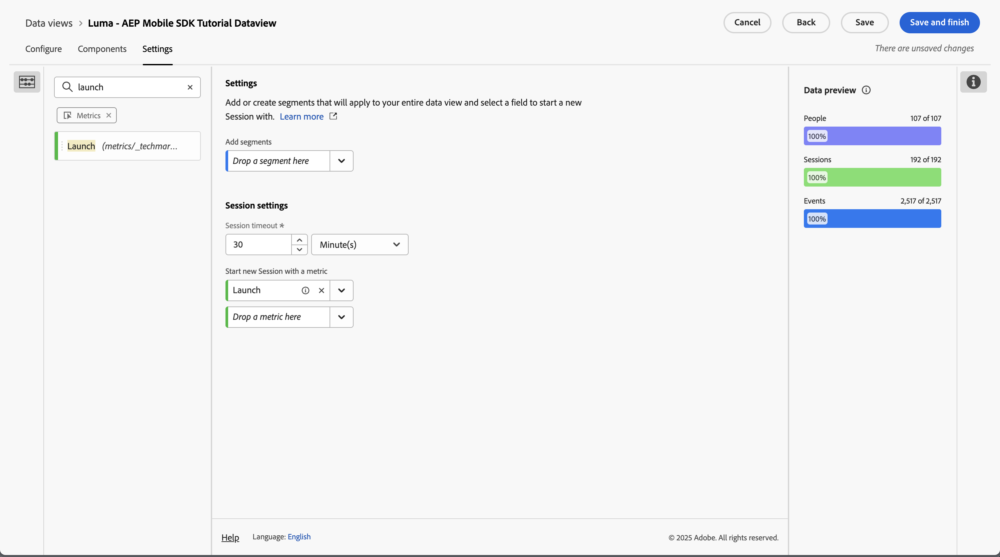

# Sitzungseinstellungen {#session-settings}

<!-- markdownlint-disable MD034 -->

>[!CONTEXTUALHELP]
>id="dataview_settings_datapreview"
>title="Datenvorschau"
>abstract="Vergleicht die Daten dieser Datenansicht mit den Daten der Verbindung. Der Prozentsatz der Vorschau basiert auf der Gesamtzahl in der Verbindung aus den **letzten 90 Tagen**.  Wenn die Vorschau nicht geladen wird, wird Ihre Verbindung möglicherweise noch aufgestockt."

<!-- markdownlint-enable MD034 -->

<!-- markdownlint-enable MD034 -->

In Customer Journey Analytics können Sie eine Sitzung auf jede beliebige Art und Weise definieren, die der Interaktion von Personen mit Ihren digitalen Erlebnissen entspricht. Die Sitzungseinstellungen werden in einer Datenansicht konfiguriert.

Definitionen von Sitzungseinstellungen sind zerstörungsfrei und verändern die zugrunde liegenden Daten nicht. Sie können mehrere Datenansichten (jede mit ihrer spezifischen Definition von Sitzungseinstellungen) als Grundlage für Ihre Workspace-Projekte einrichten.

So definieren Sie den Kontext einer Sitzung innerhalb einer Datenansicht:

1. Wählen **[!UICONTROL Datenansichten]** optional unter **[!UICONTROL Datenverwaltung]** in der Hauptnavigation der Benutzeroberfläche von Customer Journey Analytics aus.

2. Erstellen Sie eine neue oder bearbeiten Sie eine vorhandene Datenansicht. Weitere Informationen finden Sie unter [Erstellen oder Bearbeiten einer Datenansicht](create-dataview.md).

3. Wählen Sie die Registerkarte **[!UICONTROL Einstellungen]** aus. Unter [!UICONTROL Sitzungseinstellungen]:

   1. Geben Sie einen Wert für ein **[!UICONTROL Sitzungs-Timeout]** in [!UICONTROL Minute(n)], [!UICONTROL Stunde(n)], [!UICONTROL Tag(en) ] oder [!UICONTROL Woche(n)] ein. Durch das Sitzungs-Timeout ist festgelegt, wie lange eine Sitzung inaktiv sein kann (es treten keine Ereignisse auf), bevor eine neue Sitzung gestartet wird.

      Verwenden Sie ein kurzes Sitzungs-Timeout (z. B. 30 Minuten), wenn Sie hauptsächlich Online-Interaktionen analysieren möchten. Wenn Sie beispielsweise analysieren, ob Profile, die Ihre Online-Store-Produktseiten besucht haben, Produkte zum Warenkorb hinzugefügt oder sogar online gekauft haben.

      Verwenden Sie einen langes Sitzungs-Timeout (z. B. 3 Monate), wenn Sie Online- und Offline-Daten kombinieren und analysieren möchten, ob Kundinnen bzw. Kunden, die eines oder mehrere Ihrer Produkte gekauft haben, innerhalb der ersten drei Monate nach dem Kauf Ihr Kontaktzentrum angerufen haben.

   2. Wählen Sie eine Metrik aus der Liste **[!UICONTROL Metrik hier ablegen]** unter **[!UICONTROL Neue Sitzung mit einer Metrik starten]** aus. Alternativ können Sie per Drag-and-Drop eine Metrik aus dem linken Bereich auf den Bereich **[!UICONTROL Metrik ablegen]** ziehen. Die ausgewählte Metrik definiert den Beginn einer neuen Sitzung. Sie können mehr als eine Metrik definieren.

      Sie können eine beliebige Metrik verwenden, um eine neue Sitzung zu definieren. Angenommen, Sie möchten jedes Mal, wenn ein Profil Ihre Mobile App startet, eine neue Sitzung definieren. In **[!UICONTROL Datenansicht]** > **[!UICONTROL Komponenten]** definieren Sie eine Komponente des Typs Metrik namens **[!UICONTROL Launch]**, die auf einem **[!UICONTROL appInteraction]****[!UICONTROL Name]** Schemafeld basiert. Darüber hinaus geben Sie die Metrikkomponente **[!UICONTROL Launch]** an, damit der Wert nur gezählt wird, wenn der Wert `launch` entspricht.

      

      Anschließend ziehen Sie per Drag-and-Drop oder wählen **[!UICONTROL die Metrik]** Launch“ als Metrik aus, um eine neue Sitzung zu definieren.

      

4. Wählen Sie **[!UICONTROL Speichern]** oder **[!UICONTROL Speichern und beenden]**, um die Definitionen der Sitzungseinstellungen zu speichern.
