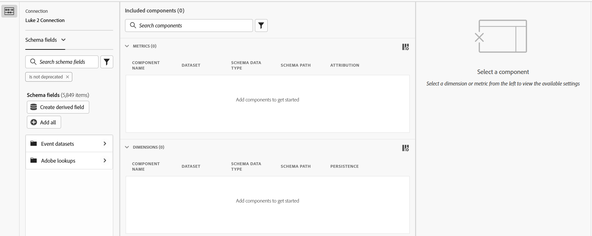

# Freigegebener Komponenten-Editor

Mit dem Editor für freigegebene Komponenten können Sie freigegebene Dimensionen und Metriken erstellen und bearbeiten. Sie verwendet beim [Erstellen oder Bearbeiten einer Datenansicht](/help/data-views/create-dataview.md) viele Benutzeroberflächenelemente, aber diese Schnittstellen haben einen anderen Zweck:

* Mit dem Komponenteneditor für die Datenansicht können Sie für diese Datenansicht spezifische Komponenten erstellen und bearbeiten. Freigegebene Dimensionen oder Metriken können im Komponenteneditor für die Datenansicht nicht bearbeitet werden. In dieser Benutzeroberfläche können freigegebene Dimensionen und Metriken durch ein Symbol  neben dem Komponentennamen identifiziert werden.
* Mit dem Editor für freigegebene Komponenten können Sie freigegebene Dimensionen und Metriken erstellen und bearbeiten. Sie können keine Komponenten bearbeiten, die zu einer einzelnen Datenansicht im freigegebenen Komponenten-Editor gehören.

Oben rechts befinden sich drei Schaltflächen:

* **[!UICONTROL Schließen]** oder **[!UICONTROL Abbrechen]**: Wenn alle Änderungen gespeichert wurden, wird der Editor durch Klicken auf **[!UICONTROL Schließen]** geschlossen. Wenn es ungespeicherte Änderungen gibt, wird mit der Schaltfläche **[!UICONTROL Abbrechen] der Editor geschlossen, ohne dass diese Änderungen gespeichert werden.
* **[!UICONTROL Speichern]**: Speichert alle Komponenten und lässt den Editor geöffnet.
* **[!UICONTROL Speichern und beenden]**: Speichert alle Komponenten und schließt den Editor.

Die Benutzeroberfläche umfasst drei Hauptspalten/Abschnitte:

* **Schemafeldauswahl**: Suchen Sie die gewünschten Schemafelder und ziehen Sie sie in den Bereich Enthaltene Komponenten .
   * **Verbindung**: Die aktive Verbindung. Ändern Sie die aktive Verbindung im [Manager für freigegebene Metriken und Dimensionen](smd-overview.md).
   * **Dropdown-Liste der Komponenten**: Sie können zwischen der Auswahl [!UICONTROL Schemafelder] (neue freigegebene Dimensionen und Metriken) oder [!UICONTROL Metriken und Dimensionen] (vorhandene freigegebene Komponenten) wählen.
   * **Suche**: Verwenden Sie das  Textsuche, um das gewünschte Schemafeld oder die freigegebene Komponente nach Namen zu suchen. Sie können auch Filter  verwenden, um die Liste der Komponenten einzugrenzen. Der `Is not deprecated` ist standardmäßig aktiv.
   * **Abgeleitetes Feld erstellen**: Ermöglicht das [Erstellen eines abgeleiteten Felds](/help/data-views/derived-fields/derived-fields.md).
* **Enthaltene Komponenten**: Die Komponenten, die Sie für die Freigabe konfigurieren. Beim Erstellen gemeinsam genutzter Komponenten können Sie mehrere Schemafelder in diesen Bereich ziehen, um mehrere Komponenten gleichzeitig zu erstellen. Beim Bearbeiten freigegebener Komponenten können Sie mehrere zu bearbeitende Komponenten auswählen. Daraufhin werden alle in diesem Bereich ausgewählten Komponenten aufgelistet.
* **Komponenteneinstellungen**: Wenn Sie eine Komponente im Bereich Enthaltene Komponenten auswählen, können alle verfügbaren Einstellungen in dieser Spalte konfiguriert werden. Siehe [Komponenteneinstellungen](/help/data-views/component-settings/overview.md) für alle verfügbaren Optionen für Dimensionen und Metriken. Umschalt+Klicken auf mehrere Elemente im Bereich Enthaltene Komponenten ermöglicht es Ihnen, alle gängigen Felder gleichzeitig zu bearbeiten.
