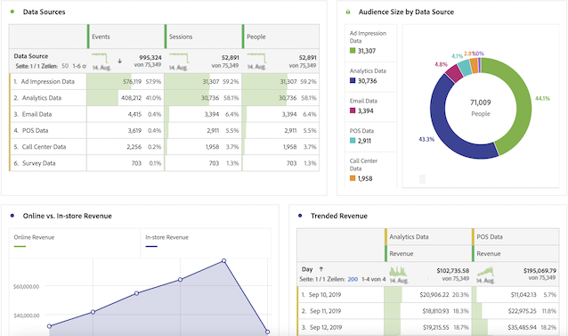
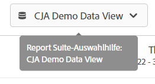

# Benutzerhandbuch für Adobe Analytics-Benutzende

Wenn Ihr Unternehmen mit der Verwendung von Adobe Customer Journey Analytics beginnt, werden Sie möglicherweise einige Ähnlichkeiten und Unterschiede zwischen Adobe Analytics und Customer Journey Analytics feststellen. Auf dieser Seite werden diese Unterschiede erläutert, um Ihr Unternehmen beim neuen Implementierungs- und Reporting-Workflow zu unterstützen. Auf dieser Seite finden Sie außerdem zusätzliche Ressourcen zu neuen Konzepten sowie weitere Schritte, um Ihre Arbeit als Analytiker einfacher und erfolgreicher zu gestalten.

Einige Funktionen in Customer Journey Analytics wurden umbenannt und entsprechend den Branchenstandards neu gestaltet. Zu den aktualisierten Begriffen gehören Segmente, Virtual Report Suites, Klassifizierungen, Kundenattribute und Container-Namen. Es gibt keine Einschränkungen von eVars und Props mehr. Stattdessen stehen flexible benutzerdefinierte Dimensionen und Metriken zur Verfügung.

## Was sich nicht geändert hat

Vieles beim Reporting hat sich nicht geändert.

* Sie können weiterhin die Funktionen von [Analysis Workspace](/help/analysis-workspace/home.md) verwenden, um Ihre Daten zu analysieren. Der Arbeitsbereich funktioniert genauso wie im herkömmlichen Adobe Analytics.
* Dieselbe Version von [Adobe Analytics-Dashboards](/help/mobile-app/home.md) ist verfügbar und funktioniert in Customer Journey Analytics und Adobe Analytics auf ähnliche Weise.
* [Report Builder](/help/report-builder/rb-overview.md) verfügt über eine neue Benutzeroberfläche und läuft unter MS Windows, macOS und der Web-Version von Excel. (Vor dieser Version von Report Builder konnten Sie in nur dann in Mac verwenden, wenn es auf VMware ausgeführt wurde.) Diese Version unterstützt die herkömmliche AA-Datenanfrage noch nicht.

## Änderungen beim Reporting

Sie haben jetzt Zugriff auf viel mehr kanalübergreifende Daten, die Sie analysieren können. Sie können beispielsweise ein Workspace-Projekt erstellen, das die Leistung mehrerer Kanäle analysiert, sofern diese Datensätze von Ihrer Organisation aufgenommen und in die von Customer Journey Analytics verwendeten Datenansichten einbezogen werden (siehe „Änderungen an der Datenarchitektur“ unten).

## Änderungen an der Datenarchitektur {#architecture}

Customer Journey Analytics erhält seine Daten von Adobe Experience Platform. Mit Experience Platform können Sie Kundendaten und Inhalte aus beliebigen Systemen oder Kanälen zentral zusammenführen und standardisieren sowie mithilfe von Datenwissenschaft und maschinellem Lernen die Gestaltung und Bereitstellung personalisierter Erlebnisse verbessern.

Kundendaten in Experience Platform werden als Datensätze gespeichert, die aus einem [Schema](https://experienceleague.adobe.com/docs/platform-learn/tutorials/schemas/schemas-and-experience-data-model.html?lang=de) und Datenstapeln bestehen. Weitere Informationen zu Platform finden Sie unter [Übersicht über die Adobe Experience Platform-Architektur](https://experienceleague.adobe.com/docs/platform-learn/tutorials/intro-to-platform/basic-architecture.html?lang=de).

Customer Journey Analytics-Admis richten [Verbindungen](/help/connections/create-connection.md) zu Datensätzen in Experience Platform ein. Anschließend erstellen sie mithilfe dieser Verbindungen [Datenansichten](/help/data-views/data-views.md). Datenansichten ähneln konzeptionell den Virtual Report Suites und bilden die Grundlage für die Berichterstellung in Customer Journey Analytics. Da Experience Platform alle Daten für die Berichterstellung bereitstellt, fungieren Report Suites nicht mehr als Daten-Container.

Mit einer Verbindung können Analytics-Admins Datensätze von Adobe Experience Platform in Customer Journey Analytics integrieren.

<!--
Outdated UI

>[!BEGINSHADEBOX]

See  [Configuring connections](https://video.tv.adobe.com/){target="_blank"} for a demo video.

>[!ENDSHADEBOX]

-->

Adobe bietet mehrere Möglichkeiten, Daten in Adobe Experience Platform zu importieren, wie etwa Report Suite-Daten über den Analytics-Quell-Connector oder das Web SDK. Vorhandene Implementierungen aus mehreren Report Suites können in Experience Platform zusammengefasst werden. Die auf diesen Datensätzen basierenden Verbindungen und Datenansichten können Daten kombinieren, die zuvor in separaten Report Suites vorhanden gewesen sind.

## Änderungen am Konzept von Virtual Report Suites {#data-views}

[!UICONTROL Datenansichten] übernehmen das Konzept der heutigen Virtual Report Suites und erweitern es, sodass [die über die Verbindungen verfügbar gemachten Daten besser kontrolliert werden können](/help/data-views/create-dataview.md). Durch diese Änderungen können allgemeine Einstellungen wie Zeitzonen und Sitzungs-Timeout-Intervalle konfiguriert werden und diese Konfigurationen gelten auch rückwirkend. Einzelne Variableneinstellungen wie Attribution und Gültigkeit können auch auf Berichts- oder Datenansichtsebene angepasst werden. Diese Einstellungen sind nicht destruktiv und gelten auch rückwirkend.

Beachten Sie, dass Sie mit der Report Suite-Auswahl oben rechts jetzt aus den verfügbaren Datenansichten wählen können:

Weitere Informationen zu diesem Konzept finden Sie unter [Anwendungsbeispiele für Datenansichten](/help/use-cases/data-views/data-views-usecases.md).

## Änderungen am Konzept von eVars und Props

Die Konzepte von [!UICONTROL eVars], [!UICONTROL Props] und [!UICONTROL Ereignisse] im traditionellen Adobe Analytics existieren in [!UICONTROL Customer Journey Analytics] nicht mehr. In Adobe Analytics speichern eVars und Props Beschreibungen von Inhalten, Kunden, Kampagnen usw. und Ereignisse zählen Dinge wie Umsatz, Abonnements oder generierte Leads. In Customer Journey Analytics bleiben beide Datentypen erhalten, und Sie können auf dieselbe Weise darauf zugreifen - über die linke Leiste in Analysis Workspace unter Dimensionen bzw. Metriken.

In Customer Journey Analytics sind unbegrenzte Schemaelemente verfügbar, darunter Dimensionen, Metriken und Listenfelder. Diese werden unbegrenzten Schemaelementen wie Dimensionen, Metriken und Listenfeldern in Experience Platform zugeordnet. Alle Besuchs- und Attributionseinstellungen, die nach den Verarbeitungsregeln in Adobe Analytics angewendet werden, gelten jetzt zur Abfragezeit in Customer Journey Analytics.

Mit dieser Flexibilität könnten Situationen auftreten, in denen ein einzelnes Schemafeld sowohl als Dimension als auch Metrik verwendet werden kann, um unterschiedliche Tracking-Anforderungen zu ermöglichen.

## Änderungen am Konzept der Segmente

Auch wenn Segmente technisch nicht von Adobe Analytics zu Customer Journey Analytics migriert werden, können Adobe Analytics-Segmente mit dem Komponentenmigrations-Tool in Customer Journey Analytics neu erstellt werden. Segmente werden in Customer Journey Analytics anhand der zugeordneten Dimensionen und Metriken neu erstellt. Weitere Informationen finden Sie unter [Vorbereitung der Migration von Komponenten und Projekten von Adobe Analytics zu Customer Journey Analytics](https://experienceleague.adobe.com/de/docs/analytics/admin/admin-tools/component-migration/prepare-component-migration).

Sie können [!UICONTROL Segmente] ([!UICONTROL Segmente]) von [!DNL Customer Journey Analytics] zwar noch nicht für Experience Platform Unified Profile freigeben oder dort veröffentlichen, diese Funktion ist aber schon in Entwicklung.

Zusätzlich zum geänderten Konzept der Segmente wurden auch Segment-Container aktualisiert.

* **Treffer-Container sind jetzt [!UICONTROL Ereignis]-Container**. Mit dem Container [!UICONTROL Ereignis] können Sie Informationen zu Personen auf Grundlage einzelner Ereignisse aufschlüsseln.
* **Besucher-Container sind jetzt [!UICONTROL Sitzungs]-Container**. Mit dem [!UICONTROL Sitzungs]-Container können Seiteninteraktionen, Kampagnen oder Konversionen für eine bestimmte Sitzung identifiziert werden.
* **Besucher-Container sind jetzt [!UICONTROL Person]-Container**. Der Container [!UICONTROL Person] enthält sämtliche Sitzungen und Ereignisse für eine Person innerhalb eines bestimmten Zeitrahmens.

## Änderungen am Konzept der berechneten Metriken

Berechnete Metriken sind in Adobe Analytics und Customer Journey Analytics ähnlich benannt. Doch [!UICONTROL Customer Journey Analytics] verwendet keine eVars, Props oder Ereignisse mehr, sondern verwendet stattdessen ein Experience Platform-Schemaelement. Diese grundlegende Änderung bedeutet, dass keine der vorhandenen berechneten Metriken mit [!UICONTROL Customer Journey Analytics] kompatibel ist.

>[!BEGINSHADEBOX]

Unter  [Verschieben der berechneten Metriken von Adobe Analytics nach Customer Journey Analytics](https://experienceleague.adobe.com/de/docs/customer-journey-analytics-learn/tutorials/components/calc-metrics/moving-your-calculated-metrics-from-adobe-analytics-to-customer-journey-analytics){target="_blank"} finden Sie ein Demovideo zum Verschieben berechneter Metriken.

>[!ENDSHADEBOX]

## Änderungen an Einstellungen der Variablenattribution und der Gültigkeit

[!UICONTROL Customer Journey Analytics] wendet alle Variableneinstellungen, einschließlich Attribution und Gültigkeit, zum Zeitpunkt der Berichterstellung an. Diese Einstellungen sind jetzt in den [Datenansichten](/help/data-views/component-settings/persistence.md) gespeichert und einige Variableneinstellungen (wie Attribution) können in Workspace-Projekten geändert werden.

Sie können mehrere Versionen derselben Variablen in derselben Datenansicht haben. Sie können beispielsweise eine Trackingcode-Dimension verwenden, die nach 30 Tagen abläuft, eine andere, die am Ende einer Sitzung abläuft. Beide Trackingcode-Dimensionen verwenden dieselben Quelldaten, jedoch unterschiedliche Attributionseinstellungen.

Sie können auch mehrere Datenansichten haben, die auf derselben Verbindung basieren. Beispielsweise können Sie eine Datenansicht mit einem Sitzungs-Timeout von 30 Minuten und eine andere mit einem Sitzungs-Timeout von 15 Minuten haben. Beide Datenansichten werden im Auswahlmenü oben rechts angezeigt, sodass Sie nahtlos zwischen ihnen wechseln können.

## Änderungen am Konzept der Klassifizierungen

„Klassifizierungen“ werden jetzt als *Lookup-Datensätze* bezeichnet. Lookup-Datensätze werden verwendet, um nach Werten oder Schlüsseln in Ihren Ereignis- oder Profildaten zu suchen. Beispielsweise können Sie Suchdaten hochladen, die numerische IDs in Ihren Ereignisdaten den Produktnamen zuordnen.

## Änderungen am Konzept der Kundenattribute

„Kundenattribute“ werden jetzt als „Profildatensätze“ bezeichnet. Profildatensätze enthalten Daten, die auf Personen, Benutzende oder Kundinnen bzw. Kunden in den [!UICONTROL Ereignisdaten] angewendet werden. So können Sie beispielsweise CRM-Daten über Ihren Kunden hochladen. Sie können auswählen, welche Personen-ID Sie einbeziehen möchten. Jeder Datensatz, der in [!DNL Experience Platform] definiert ist, verfügt über einen eigenen Satz von einer oder mehreren definierten Personen-IDs.

## Änderungen bei der Besucheridentifizierung durch die Adobe

Customer Journey Analytics erweitert die Konzepte von Identitäten über ECIDs hinaus und umfasst alle IDs, die Sie verwenden möchten, einschließlich Kunden-IDs, Cookie-IDs, zugeordneter IDs, Benutzer-IDs und Trackingcodes. Durch die Verwendung einer gemeinsamen Namespace-ID für mehrere Datensätze oder die Verwendung der [Zuordnungsfunktion](../stitching/overview.md) können Personen über verschiedene Datensätze hinweg miteinander verknüpft werden. Benutzende, die in Customer Journey Analytics ein Workspace-Projekt einrichten, müssen wissen, welche IDs in den verschiedenen Datensätzen verwendet werden. Sehen Sie sich das folgende Video an, in dem die Verwendung von Identitäten in Customer Journey Analytics erläutert wird.

>[!BEGINSHADEBOX]

Unter  [Verwenden von Identitäten in Customer Journey Analytics](https://experienceleague.adobe.com/en/docs/customer-journey-analytics-learn/tutorials/visitor-id/understanding-how-customer-journey-analytics-uses-identity){target="_blank"} finden Sie ein Demovideo.

>[!ENDSHADEBOX]

## Änderungen am Konzept des Dimensionselements „Low Traffic“

Im traditionellen Adobe Analytics beginnt eine Variable, die zu viele eindeutige Werte erhält, Dimensionselemente unter [!UICONTROL Low Traffic] zusammenzufassen. Customer Journey Analytics hat weniger Einschränkungen in Bezug auf Felder mit hoher Kardinalität. Aufgrund von Änderungen an der Berichtsarchitektur können in Analysis Workspace Berichte zu vielen weiteren eindeutigen Dimensionselementen erstellt werden. Weitere Informationen dazu, wie Customer Journey Analytics das Reporting für Dimensionen mit vielen eindeutigen Werten optimiert, finden Sie unter [Dimensionen mit hoher Kardinalität](../components/dimensions/high-cardinality.md).
