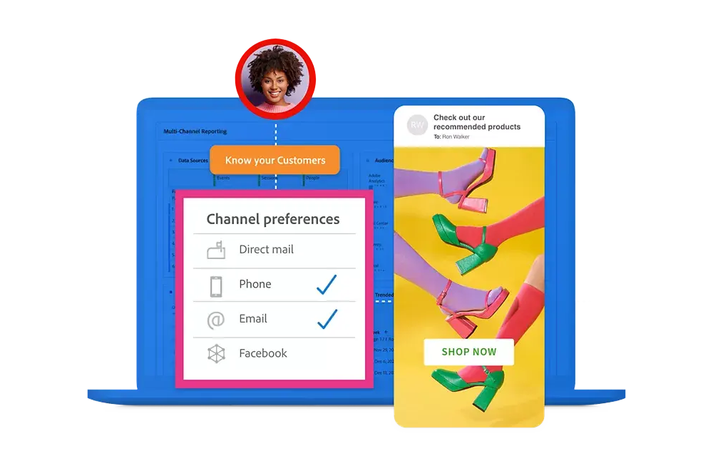

# Handbuch für Customer Journey Analytics

Diese technische Dokumentation bietet Hilfe zur Selbsthilfe für Customer Journey Analytics. Customer Journey Analytics ermöglicht es Ihnen, Kundendaten von beliebigen Kanälen – sowohl online als auch offline – in Adobe Experience Platform zusammenzuführen und mithilfe von Analysis Workspace genauso zu analysieren wie vorhandene digitale Daten.

Mit Customer Journey Analytics können Sie steuern, wie Sie Ihre Online- und Offline-Daten in Analysis Workspace mit jeder beliebigen Kunden-ID verbinden. Dadurch können Sie Aufgaben wie Attribution, Filterung, Fluss- und Fallout-Steuerung usw. endlich durchführen. kundendatenübergreifend.

## Neue Funktionen

Werfen Sie einen Blick auf die neuesten Verbesserungen in Customer Journey Analytics und die Dokumentation! Eine umfassende Liste der Funktionen, Verbesserungen und Fehlerbehebungen finden Sie in den detaillierten [Versionshinweisen](../release-notes/latest.md). Bleiben Sie auf dem Laufenden über die neuesten Änderungen in unserer Dokumentation, indem Sie die [Seite „Dokumentationsaktualisierungen“](../release-notes/doc-changes.md) besuchen.

>[!BEGINTABS]

>[!TAB Geführte Analyse* - Bindungsrate]

Dieser neue Ansichtstyp zeigt den Prozentsatz der Benutzenden an, die nach ihrer anfänglichen Interaktion innerhalb des gewünschten Datumsbereichs zurückkehren. Die horizontale Achse stellt die Anzahl der Tage seit der anfänglichen Interaktion einer Benutzerin oder eines Benutzers dar. Die vertikale Achse stellt den Prozentsatz der Benutzenden dar, die erneut interagieren.

*_Die geführte Analyse ist Bestandteil von Adobe Product Analytics, einem Add-on von Customer Journey Analytics._

>[!TAB Geführte Analyse* - Trend-Linien]

Die Ansicht „Nutzung“ zeigt nun Trend-Linienüberlagerungen an, um ein klareres Datenmuster darzustellen. Verfügbare Trend-Linientypen sind: linear, logarithmisch und gleitender Mittelwert.

*_Die geführte Analyse ist Teil von Adobe Product Analytics, einem kostenpflichtigen Add-on von Customer Journey Analytics._

>[!TAB Visualisierte Schlüsselmetrikübersicht]

Bei Verwendung der visualisierten Schlüsselmetrikübersicht kann der Vergleichsdatumsbereich nun automatisch aktualisiert werden, je nachdem, ob der gewählte Vergleichsdatenbereich relativ zum Hauptdatumsbereich oder fest ist.

>[!ENDTABS]

## Beginnen Sie mit den Grundlagen

Lesen Sie zunächst das Material in den unten stehenden Links, um sich mit den Funktionen und Möglichkeiten von Customer Journey Analytics vertraut zu machen.

<table style="table-layout:fixed">
  <tr style="border: 0;">
    <td>
    
    
<strong>Über Online-Daten hinaus</strong> Erfahren Sie, wie sich Customer Journey Analytics von Adobe Analytics unterscheidet, welche Funktionen freigegeben werden und wie Sie Ihre Analytics-Daten verwenden können.

    </td>
    <td>
    
    
<strong>Daten aufnehmen und verwenden</strong> Erfahren Sie mehr über die angebotenen Optionen zur Datenaufnahme in Experience Platform und zur Verwendung dieser Daten für Analysen und Berichte in Customer Journey Analytics.

    </td>
    <td>
    
    
<strong>Geführte Analyse</strong> Erfahren Sie, wie Sie mit Workflows Daten und Erkenntnisse über das Produkterlebnis von Kundschaft gewinnen können. Produkt Analytics über geführte Analyse …
    

    </td>
    <td>
    
    
<strong>Analysis Workspace</strong> Nutzen Sie Analysis Workspace, um grundlegende und erweiterte Analysen, wie Attribution, Fluss- und Fallout-Diagramme oder Dimensionsaufschlüsselungen durchzuführen.

    </td>
  </tr>
  <tr style="border: 0;">
    <td align="center"></td>
    <td align="center"></td>
    <td align="center"></td>
    <td align="center"></td>
    </tr>
</table>

## Dokumentation

Erfahren Sie, wie sich Customer Journey Analytics von Adobe Analytics unterscheidet und wie Sie Ihre Daten in die Lösung aufnehmen und dann vorbereiten, anzeigen, analysieren und demokratisieren können, um daraus Analysen und Berichte zu erstellen.

<table style="table-layout:auto">
  <tr style="border: 0;">
    <td>
       
      <strong>Vergleich mit Adobe Analytics</strong> <a href="/help/getting-started/aa-vs-cja/overview.md">Übersicht</a> - <a href="/help/getting-started/aa-to-cja.md">Entwicklung</a> - <a href="/help/getting-started/aa-vs-cja/aa-data-in-cja.md">Verwenden von Adobe Analytics-Daten</a> - <a href="/help/getting-started/aa-vs-cja/cja-aa.md">Funktionsunterstützung</a> - <a href="/help/getting-started/aa-vs-cja/terminology.md">Terminologie</a> - <a href="/help/getting-started/aa-vs-cja/data-processing-comparisons.md">Datenverarbeitung</a>
    </td>
    <td>
       
      <strong>Verbindungen</strong> <a href="/help/connections/overview.md">Übersicht</a> - <a href="/help/connections/create-connection.md">Erstellen</a> - <a href="/help/connections/manage-connections.md">Verwalten</a> - <a href="/help/stitching/overview.md">Zuordnung</a> - <a href="/help/connections/combined-dataset.md">Kombinierte Ereignis-Datensätze</a> - <a href="/help/connections/standard-lookups.md">Standardsuche</a>
    </td>
     <td>
       
      <strong>Datenansichten</strong> <a href="/help/data-views/data-views.md">Übersicht</a> - <a href="/help/data-views/create-dataview.md">Erstellen oder bearbeiten</a> - <a href="/help/data-views/session-settings.md">Sitzungseinstellungen</a> - <a href="/help/data-views/derived-fields/derived-fields.md">Abgeleitete Felder</a> - <a href="/help/data-views/component-reference.md">Komponentenverweis</a>
    </td>

</tr>
  <tr style="border: 0;">
    <td>
       
      <strong>Workspace-Projekte</strong> <a href="/help/analysis-workspace/home.md">Analysis Workspace</a> - <a href="/help/analysis-workspace/perform-basic-analysis.md">Allgemeine </a> und <a href="/help/analysis-workspace/perform-adv-analysis.md">erweiterte Analyse</a> - <a href="/help/analysis-workspace/build-workspace-project/freeform-overview.md">Projekte</a> - <a href="/help/analysis-workspace/visualizations/freeform-analysis-visualizations.md">Visualisierungen</a> - <a href="/help/analysis-workspace/c-panels/freeform-panel.md">Bedienfelder</a>
    </td>
    <td>
       
      <strong>Geführte Analyse</strong> <a href="/help/guided-analysis/overview.md">Übersicht</a> - <a href="/help/guided-analysis/types/active.md">Benutzerwachstum</a> - <a href="/help/guided-analysis/types/usage.md">Trends</a> - <a href="/help/guided-analysis/types/friction.md">Trichter</a> - <a href="/help/guided-analysis/types/release.md">Auswirkung</a> - <a href="/help/guided-analysis/industry-use-cases.md">Branchenanwendungsfälle</a>
    </td>
    <td>
       
      <strong>Freigeben, exportieren, integrieren</strong> <a href="/help/analysis-workspace/curate-share/share-projects.md">Projekte</a> - <a href="/help/mobile-app/home.md">Analytics-Dashboards</a> - <a href="/help/report-builder/report-buider-overview.md">Report Builder</a> - <a href="/help/integrations/overview.md">Integrationen</a>
    </td>
  </tr>
</table>

## Zusätzliche Ressourcen

<table style="table-layout:fixed"><tr style="border: 0;">
<td><strong>Customer Journey Analytics</strong> 
<a href="https://experienceleague.adobe.com/docs/customer-journey-analytics-learn/tutorials/overview.html?lang=de" target="_blank">Tutorials</a> - <a href="https://helpx.adobe.com/de/legal/product-descriptions/customer-journey-analytics.html" target="_blank">Customer Journey Analytics - Produktbeschreibung</a> - <a href="https://helpx.adobe.com/de/legal/product-descriptions/adobe-analytics-addon-customer-journey-analytics.html" target="_blank">Adobe Analytics (Customer Journey Analytics-Add-on) - Produktbeschreibung </a> - <a href="https://developer.adobe.com/cja-apis/docs/" target="_blank">Customer Journey Analytics-APIs</a>
</td>
<td><strong>Datenaufnahme</strong> <a href="/help/data-ingestion/data-ingestion.md">Übersicht</a> - <a href="/help/data-ingestion/analytics.md">Analytics</a> - <a href="/help/data-ingestion/aepwebsdk.md">Web-SDK</a> - <a href="/help/data-ingestion/aepmobilesdk.md">Mobile SDK</a> - <a href="/help/data-ingestion/batch.md">Batch</a> - <a href="/help/data-ingestion/streaming.md">Streaming</a> - <a href="/help/data-ingestion/sources.md">Quellen</a> - <a href="/help/data-ingestion/serverapi.md">Server-API</a>
</td>
</tr></table>

<table style="table-layout:auto" class="tablelayout-is-fixed"><tbody><tr style="border: 0;"><td></td><td>
<b>Bleiben Sie auf dem Laufenden, tragen Sie zur Community bei und verbessern Sie Ihr Erlebnis mit Customer Journey Analytics!</b> Werden Sie Teil der Adobe Analytics-Community, um die Funktionalität mit anderen Nutzenden zu erörtern. <a href="https://experienceleaguecommunities.adobe.com/t5/adobe-analytics/ct-p/adobe-analytics-community?lang=de">Werden Sie noch heute Teil der Community!</a></td></tr></tbody></table>
