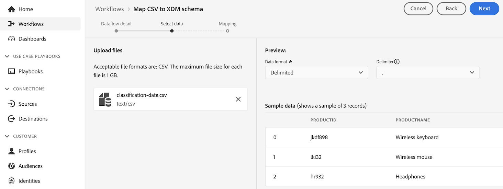

# Erstellen von Lookup-Datensätzen zum Klassifizieren von Daten im Customer Journey Analytics

>[!NOTE]
> 
>Führen Sie die Schritte auf dieser Seite erst aus, nachdem Sie alle vorherigen Aktualisierungsschritte ausgeführt haben. Sie können die [empfohlenen Aktualisierungsschritte](/help/getting-started/cja-upgrade/cja-upgrade-recommendations.md#recommended-upgrade-steps-for-most-organizations) ausführen oder die für Ihr Unternehmen dynamisch generierten Aktualisierungsschritte mit dem Fragebogen [Adobe Analytics to Customer Journey Analytics Upgrade Fragenkatalog](https://gigazelle.github.io/cja-ttv/) ausführen.
>
>Nachdem Sie die Schritte auf dieser Seite ausgeführt haben, fahren Sie mit den empfohlenen Aktualisierungsschritten oder den dynamisch generierten Aktualisierungsschritten fort.

Ähnlich wie Klassifizierungsdaten in Adobe Analytics sind Lookup-Datensätze die Methode zum Klassifizieren von Daten in Customer Journey Analytics.

Bei Verwendung des Analytics-Quell-Connectors werden einige standardmäßige Lookup-Datensätze automatisch zur Berichtszeit angewendet. Weitere Informationen finden Sie unter [Hinzufügen von Standardsuchvorgängen zu Datensätzen](/help/connections/standard-lookups.md).

Um Daten bei Verwendung des Experience Platform Web SDK in Customer Journey Analytics zu klassifizieren, müssen Sie ein XDM-Schema und einen Lookup-Datensatz für jede Dimension erstellen, die Daten enthält, die Sie klassifizieren möchten.

## Erstellen eines XDM-Schemas

Erstellen Sie ein neues XDM-Schema für jede Dimension, die Daten enthält, die Sie unter Customer Journey Analytics klassifizieren möchten. Wenn Sie den Lookup-Datensatz in einem späteren Schritt erstellen, verweist er auf dieses Schema.

Wiederholen Sie diesen Vorgang für jede Dimension, die Daten enthält, die Sie klassifizieren möchten.

So erstellen Sie ein Schema zur Verwendung mit einem Lookup-Datensatz in Customer Journey Analytics:

1. Wählen Sie in Adobe Experience Platform in der linken Leiste im Bereich **[!UICONTROL Datenverwaltung]** die Option **[!UICONTROL Schemas]** aus.

1. Wählen Sie **[!UICONTROL Schema erstellen]** aus.

   

1. Wählen Sie **[!UICONTROL Manuell]** aus. Auf diese Weise können Sie Ihrem Schema manuell Felder und Feldergruppen hinzufügen. Wählen Sie **[!UICONTROL Auswählen]** aus, um mit der nächsten Seite des Erstellungsassistenten fortzufahren.

1. Wählen Sie auf der Seite **[!UICONTROL Schemadetails]** die Option **[!UICONTROL Sonstige]** und dann **[!UICONTROL Benutzerdefiniert]** aus.

   

1. Wählen Sie **[!UICONTROL Create class]** aus.

   <!-- add screenshot -->

1. Geben Sie im Dialogfeld **[!UICONTROL Klasse erstellen]** einen Namen und eine Beschreibung für das Schema ein, wählen Sie **[!UICONTROL Datensatz]** und klicken Sie dann auf **[!UICONTROL Erstellen]**.

1. Fahren Sie mit [Erstellen Sie einen Lookup-Datensatz](#create-a-lookup-dataset) fort.

## Lookup-Datensatz erstellen

Nachdem Sie [ein XDM-Schema erstellt haben](#create-an-xdm-schema-for-lookup-datasets), das für einen Lookup-Datensatz verwendet werden soll, müssen Sie den Lookup-Datensatz erstellen und ihn Ihrem Schema zuordnen.

Wiederholen Sie diesen Vorgang für jede Dimension, die Daten enthält, die Sie klassifizieren möchten.

So erstellen Sie einen Lookup-Datensatz zur Verwendung mit einem Schema in Customer Journey Analytics:

>[!NOTE]
>
>Der folgende Prozess verwendet eine CSV-Datei, um den Datensatz zu erstellen. Sie können auch jede andere Methode verwenden, die für den Datenimport in Experience Platform verfügbar ist, z. B. die Einrichtung eines Datenspeichers.

1. Wählen Sie in Adobe Experience Platform in der linken Leiste **[!UICONTROL Workflows]** aus.

   

1. Wählen Sie **[!UICONTROL CSV dem XDM-Schema zuordnen]** und dann **[!UICONTROL Launch]** aus.

1. Wählen Sie im Abschnitt **[!UICONTROL Datensatzdetails]** die Option **[!UICONTROL Neuer Datensatz]** aus.

1. Geben Sie einen Namen und eine Beschreibung für Ihren Datensatz an.

1. Wählen Sie im Feld **[!UICONTROL Schema]** das Schema aus, das Sie für Lookup-Datensätze erstellt haben, wie unter [Schema für Lookup-Datensätze erstellen](#create-a-schema-for-lookup-datasets) beschrieben.

1. Klicken Sie auf **[!UICONTROL Weiter]**.

1. Wählen Sie auf der Seite **[!UICONTROL CSV XDM-Schema zuordnen]** im Abschnitt **[!UICONTROL Dateien hochladen]** die Option **[!UICONTROL Dateien auswählen]** und suchen Sie dann Ihr Dateisystem nach der Datei, die die Classification-Informationen für die Dimension enthält, für die Sie Classification-Daten anwenden möchten. Dies kann beispielsweise eine Tabelle sein, in der die Feld-IDs und die entsprechenden Feldnamen aufgeführt werden. <!-- correct? How can I better explain what this file is?-->

   

1. Wählen Sie **[!UICONTROL Weiter]**

1. Überprüfen Sie nach dem Hochladen der Datei die Zuordnungen, um sicherzustellen, dass sie korrekt sind. Die Spalten der CSV-Datei werden unter **[!UICONTROL Source-Daten]** aufgelistet und die zugehörigen XDM-Schemafelder werden unter **[!UICONTROL Zielfeld]** aufgelistet.

   Platform bietet automatisch intelligente Empfehlungen für automatisch zugeordnete Felder, die auf dem von Ihnen ausgewählten Zielschema oder Datensatz basieren. Sie können die Zuordnungsregeln manuell an Ihre Anwendungsfälle anpassen.

   Weitere Informationen zum Zuordnungsprozess finden Sie unter [Zuordnen einer CSV-Datei zu einem vorhandenen XDM-Schema](https://experienceleague.adobe.com/en/docs/experience-platform/ingestion/tutorials/map-csv/existing-schema) in der Experience Platform-Dokumentation.

1. Wählen Sie **[!UICONTROL Beenden]** aus.

1. Fahren Sie mit [Hinzufügen des Lookup-Datensatzes zu Ihrer Verbindung in Customer Journey Analytics](#add-the-lookup-dataset-to-your-connection-in-customer-journey-analytics) fort.

## Fügen Sie Ihrer Verbindung in Customer Journey Analytics den Lookup-Datensatz hinzu.

Nachdem Sie [ein XDM-Schema erstellen](#create-an-xdm-schema-for-lookup-datasets) und [einen Lookup-Datensatz erstellen](#create-a-lookup-dataset), müssen Sie den Lookup-Datensatz zu Ihrer Verbindung in Customer Journey Analytics hinzufügen.

Wiederholen Sie diesen Vorgang für jede Dimension, die Daten enthält, die Sie klassifizieren möchten.

So fügen Sie Ihren Lookup-Datensatz in Customer Journey Analytics zu Ihrer Verbindung hinzu:

1. Rufen Sie in Customer Journey Analytics die Registerkarte **[!UICONTROL Verbindungen]** auf.

1. Wählen Sie neben der Verbindung, in der Sie den Lookup-Datensatz hinzufügen möchten,  und dann **[!UICONTROL Bearbeiten]** aus.

   <!-- add screenshot -->

1. Wählen Sie **[!UICONTROL Datensätze hinzufügen]** aus.

1. Wählen Sie im Dialogfeld **[!UICONTROL Datensätze hinzufügen]** den von Ihnen erstellten Lookup-Datensatz und dann **[!UICONTROL Weiter]** aus.

1. Wählen Sie im Feld **[!UICONTROL Personen-ID]** eine Personen-ID aus den verfügbaren Identitäten aus, die im Datensatzschema definiert sind, das Sie in Experience Platform konfiguriert haben. <!-- fill out other fields? -->

1. Wählen Sie **[!UICONTROL Datensätze hinzufügen]** und dann **[!UICONTROL Speichern]** aus.

1. Erstellen Sie mithilfe des Felds **[!UICONTROL Schlüssel]** und des Felds **[!UICONTROL Übereinstimmungsschlüssel]** eine Korrelation zwischen dem Feld in Ihrem Lookup-Datensatz und dem Feld in Ihrem Ereignis- oder Zusammenfassungsdatensatz.

1. Nachdem alle Lookup-Datensätze zu Ihrer Verbindung in Customer Journey Analytics hinzugefügt wurden, führen Sie die [empfohlenen Aktualisierungsschritte](/help/getting-started/cja-upgrade/cja-upgrade-recommendations.md#recommended-upgrade-steps-for-most-organizations) oder die dynamisch generierten Aktualisierungsschritte](https://gigazelle.github.io/cja-ttv/) aus.[

1. Führen Sie die [empfohlenen Aktualisierungsschritte](/help/getting-started/cja-upgrade/cja-upgrade-recommendations.md#recommended-upgrade-steps-for-most-organizations) oder die dynamisch generierten Aktualisierungsschritte](https://gigazelle.github.io/cja-ttv/) aus.[

