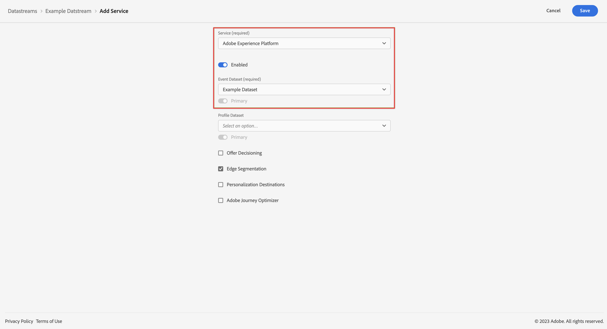

# Hinzufügen von Platform als Service zu Ihrem Datenstrom

>[!NOTE]
> 
>Befolgen Sie die Schritte auf dieser Seite erst, nachdem Sie alle vorherigen Upgrade-Schritte abgeschlossen haben. Sie können die [empfohlenen Upgrade-Schritte](/help/getting-started/cja-upgrade/cja-upgrade-recommendations.md#recommended-upgrade-steps-for-most-organizations) ausführen oder die Upgrade-Schritte ausführen, die für Ihr Unternehmen mit dem [Fragebogen für das Upgrade von Adobe Analytics auf Customer Journey Analytics dynamisch generiert wurden](https://gigazelle.github.io/cja-ttv/).
>
>Nachdem Sie die Schritte auf dieser Seite abgeschlossen haben, folgen Sie den empfohlenen Upgrade-Schritten oder den dynamisch generierten Upgrade-Schritten.

<!-- Should we single source this instead of duplicate it? The following steps were copied from: /help/data-ingestion/aepwebsdk.md-->

Ein Datenstrom sollte bereits vorhanden sein, bevor Sie die Schritte in diesem Abschnitt abschließen. Wann und wie der Datenstrom erstellt wurde, hängt wie folgt von Ihrer Adobe Analytics-Implementierung ab:

* Wenn Ihre Adobe Analytics-Implementierung die Web-SDK oder die Web-SDK-Erweiterung verwendet, war der Datenstrom vor dem Upgrade-Prozess für Ihre Adobe Analytics-Umgebung verfügbar.

* Bei anderen Adobe Analytics-Implementierungen ist die Erstellung eines Datenstroms Teil des Upgrade-Prozesses, wie unter [Erstellen eines Datenstroms zur Verwendung mit Customer Journey Analytics](/help/getting-started/cja-upgrade/cja-upgrade-datastream.md) beschrieben.

Wenn der Datenstrom verfügbar ist, müssen Sie Platform als Service hinzufügen:

1. Wählen Sie in der Adobe Experience Platform-Benutzeroberfläche die Option **[!UICONTROL Datenströme]** in [!UICONTROL DATENERFASSUNG] in der linken Leiste.

1. Wählen Sie den zuvor konfigurierten Datenstrom aus. <!--true?-->

1. Wählen Sie **[!UICONTROL Service hinzufügen]** aus.

1. Im Bildschirm [!UICONTROL Service hinzufügen]:

   1. Wählen Sie **[!UICONTROL Adobe Experience Platform]** in der Liste [!UICONTROL Service] aus.

   1. Achten Sie darauf, dass **[!UICONTROL Aktiviert]** ausgewählt ist.

   1. Wählen Sie Ihren Datensatz aus der Liste [!UICONTROL Ereignisdatensatz] aus.

      

   1. Lassen Sie die anderen Einstellungen unverändert und wählen Sie **[!UICONTROL Speichern]** aus, um den Datenstrom zu speichern.

   Ihr Datenstrom ist jetzt so konfiguriert, dass die auf Ihrer Website erfassten Daten an Ihren Datensatz in Adobe Experience Platform weitergeleitet werden.

   Weitere Informationen um Konfigurieren eines Datenstroms und zum Umgang mit sensiblen Daten finden Sie unter [Übersicht über Datenströme](https://experienceleague.adobe.com/docs/experience-platform/datastreams/overview.html?lang=de).

1. Fahren Sie mit den [empfohlenen Upgrade-Schritten](/help/getting-started/cja-upgrade/cja-upgrade-recommendations.md#recommended-upgrade-steps-for-most-organizations) oder den [dynamisch generierten Upgrade-Schritten](https://gigazelle.github.io/cja-ttv/) fort.
