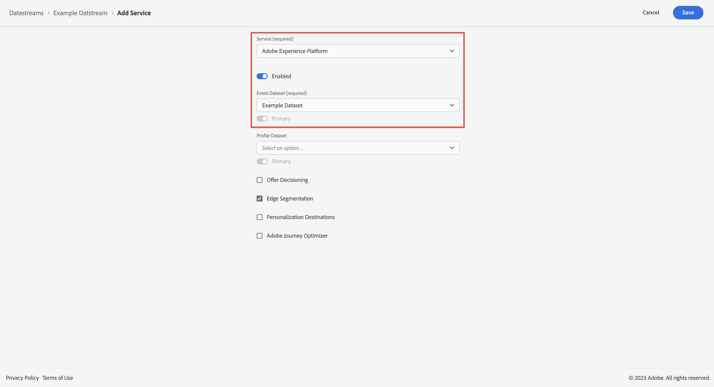

# Platform als Dienst zu Ihrem Datenstrom hinzufügen {#upgrade-addplatform-datastream}

<!-- markdownlint-disable MD034 -->

>[!CONTEXTUALHELP]
>id="cja-upgrade-addplatform-datastream"
>title="Adobe Experience Platform als Dienst zum Datenstrom hinzufügen"
>abstract="Ein Datenstrom benötigt einen oder mehrere Dienste, an die Daten gesendet werden. Richten Sie Adobe Experience Platform als Dienst in Ihrem Datenstrom ein.  Das Hinzufügen von Diensten zu einem Datenstrom ist ein einfacher Prozess und dauert nur wenige Minuten."

<!-- markdownlint-enable MD034 -->

{{upgrade-note-step}}

<!-- Should we single source this instead of duplicate it? The following steps were copied from: /help/data-ingestion/aepwebsdk.md-->

Bevor Sie die Schritte in diesem Abschnitt abschließen, sollte bereits ein Datenstrom vorhanden sein. Wann und wie der Datenstrom erstellt wurde, hängt wie folgt von Ihrer Adobe Analytics-Implementierung ab:

* Wenn Ihre Adobe Analytics-Implementierung das Web-SDK oder die Web-SDK-Erweiterung verwendet, war der Datenstrom bereits vor dem Upgrade-Prozess für Ihre Adobe Analytics-Umgebung verfügbar.

* Bei anderen Adobe Analytics-Implementierungen ist die Erstellung eines Datenstroms Teil des Upgrade-Prozesses, wie unter [Erstellen eines Datenstroms zur Verwendung mit Customer Journey Analytics](/help/getting-started/cja-upgrade/cja-upgrade-datastream.md) beschrieben.

Wenn der Datenstrom verfügbar ist, müssen Sie Platform als Dienst hinzufügen:

1. Wählen Sie in der Adobe Experience Platform-Benutzeroberfläche die Option **[!UICONTROL Datenströme]** in [!UICONTROL DATENERFASSUNG] in der linken Leiste.

1. Wählen Sie den zuvor konfigurierten Datenstrom aus. <!--true?-->

1. Wählen Sie **[!UICONTROL Service hinzufügen]** aus.

1. Im Bildschirm [!UICONTROL Service hinzufügen]:

   1. Wählen Sie **[!UICONTROL Adobe Experience Platform]** in der Liste [!UICONTROL Service] aus.

   1. Achten Sie darauf, dass **[!UICONTROL Aktiviert]** ausgewählt ist.

   1. Wählen Sie Ihren Datensatz aus der Liste [!UICONTROL Ereignisdatensatz] aus.

      

   1. Lassen Sie die anderen Einstellungen unverändert und wählen Sie **[!UICONTROL Speichern]** aus, um den Datenstrom zu speichern.

   Ihr Datenstrom ist jetzt so konfiguriert, dass die auf Ihrer Website erfassten Daten an Ihren Datensatz in Adobe Experience Platform weitergeleitet werden.

   Weitere Informationen um Konfigurieren eines Datenstroms und zum Umgang mit sensiblen Daten finden Sie unter [Übersicht über Datenströme](https://experienceleague.adobe.com/docs/experience-platform/datastreams/overview.html?lang=de).

{{upgrade-final-step}}
